# Driver Genericity and Optimization Review

## Executive decision

The driver layer should become generic, but only at the **lifecycle-control** layer.
Praxis should build one typed lifecycle kernel that owns resource state transitions,
durable execution rules, reconciliation scheduling, import/delete policy, conditions,
and the common handler contract. Each resource package should continue to own AWS
identity, validation, observation, mutation, readiness, drift, and deletion details.

The objective is not “make 51 drivers shorter” in isolation. The objective is:

- make lifecycle invariants true by construction;
- give every resource the same failure, replay, deletion, and scheduling semantics;
- make resource reviews focus on AWS behavior instead of repeated Restate plumbing;
- make a conformance test apply to every kind; and
- reduce the cost and risk of adding the 52nd driver.

This is the boundary I recommend:

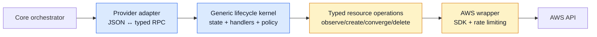

Blue is shared infrastructure; amber remains resource-specific. The kernel must not
turn into a generic AWS CRUD engine.

## Short answer: why this is better

Today, every driver is responsible for both of these concerns:

1. **What AWS requires** for that resource.
2. **How a Praxis resource lifecycle works** under Restate.

The first concern genuinely varies. The second should not. Mixing them across 51
packages has produced a large review surface and concrete divergence bugs.

After the change, a reviewer looking at `snstopic` should primarily answer:

- How is a topic identified?
- Which attributes are mutable, immutable, or clearable?
- How do we observe and converge those attributes?
- What does AWS return for not-found, access-denied, throttling, and conflict?

They should not have to re-review whether Delete retains a tombstone, whether time is
journaled, whether Reconcile schedules exactly one successor, whether Observed mode
blocks deletion, or whether a failed Provision writes Error state. Those are kernel
properties.

## Scope and evidence

This proposal is based on the current tree, not only on the architecture docs. The
actual driver contract now has eight handlers even though some documentation still
says six:

| Handler | Mode | Current count | Intended owner after refactor |
|---|---|---:|---|
| `Provision` | Exclusive | 51 | Kernel |
| `Import` | Exclusive | 51 | Kernel |
| `Delete` | Exclusive | 51 | Kernel |
| `Reconcile` | Exclusive | 51 | Kernel |
| `GetStatus` | Shared | 51 | Kernel |
| `GetOutputs` | Shared | 51 | Kernel |
| `GetInputs` | Shared | 51 | Kernel |
| `ClearState` | Exclusive | 51 | Kernel |

Measured current shape:

| Measure | Current tree |
|---|---:|
| Concrete driver packages | 51 |
| Public handler methods | 408 |
| Non-test Go lines under `internal/drivers` | 56,172 |
| Lines in the 51 `driver.go` files | 28,385 |
| Smallest/largest `driver.go` | 360 / 825 lines |
| `restate.Set` call sites in driver handlers | 1,065 |
| `restate.Run` call sites in driver handlers | 598 |
| `restate.TerminalError` call sites in driver handlers | 804 |
| Per-driver `scheduleReconcile` helpers | 51 |
| Per-driver `apiForAccount` helpers | 51 |
| Per-driver `GetInputs` handlers | 51 |
| Per-driver `ClearState` handlers | 51 |
| State structs carrying the same lifecycle envelope | 51 |

The high call-site counts are not automatically bad—AWS operations must remain
separate durable steps—but they show how much correctness policy is distributed.
The target is not to collapse 598 external calls into one opaque call. It is to make
the lifecycle around those calls uniform while keeping each side effect visible in
the Restate journal.

## Terminology: adapter genericity is not driver genericity

Praxis already has a mostly generic **provider adapter** layer. Forty-five of 51
adapters use `GenericAdapter[S, O, Obs]`. That abstraction bridges generic template
JSON and typed driver RPC:

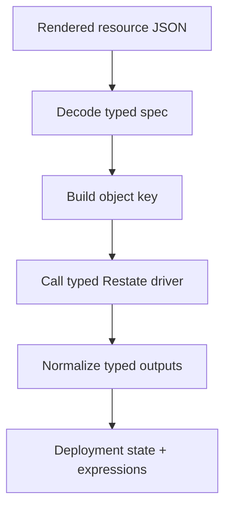

The proposed driver kernel solves a different problem:

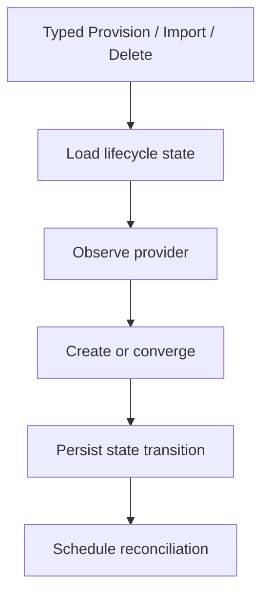

These layers should share capability metadata where useful, but they should not be
merged. The adapter belongs to Core and knows about plan/import orchestration. The
kernel belongs to the driver service and knows about Restate object state and AWS
side-effect execution. Combining them would leak orchestration concerns into driver
packs and make external driver implementations harder.

## What the current driver actually does

A typical `Provision` is not merely CRUD. It is a hand-built state machine with the
following repeated stages:

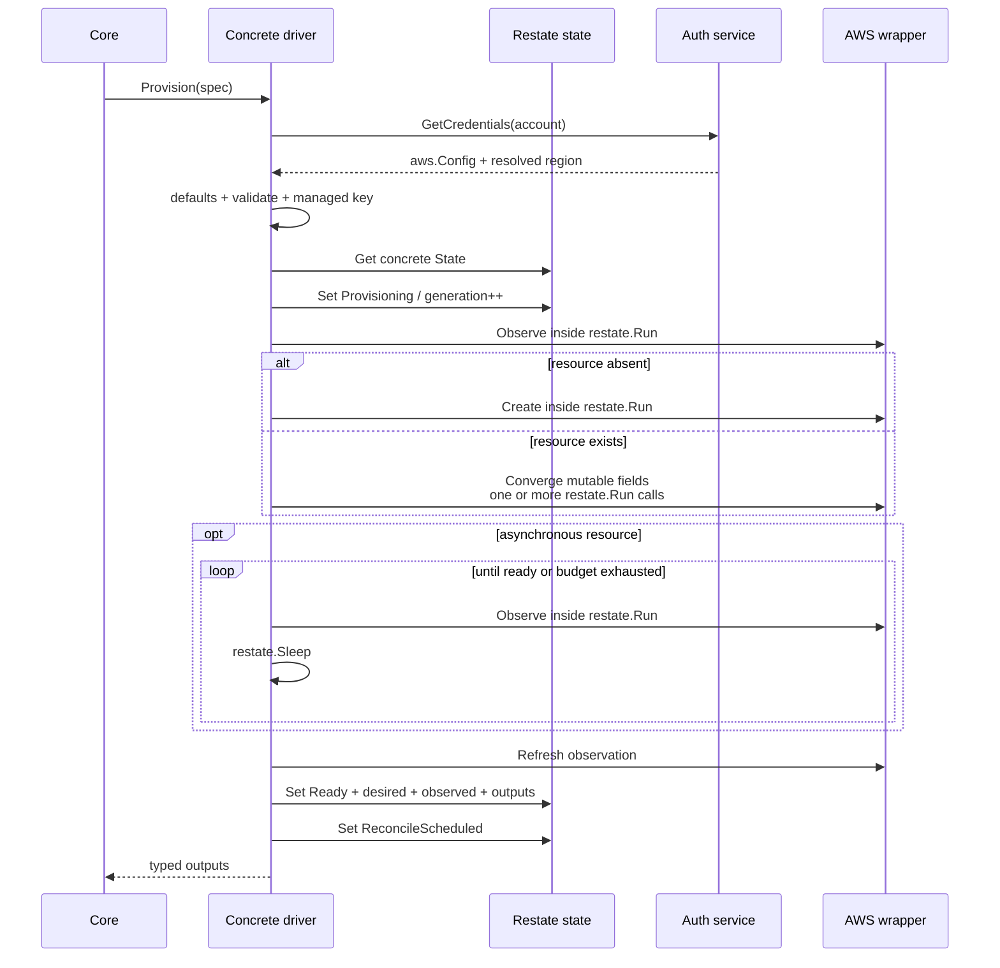

Every resource repeats some version of that flow, plus equivalent Import, Delete,
Reconcile, and read handlers. The repetition is not textual only. Each driver decides
where state is written, which errors change status, when generation increments,
whether Error may recover, and whether a reconcile successor is scheduled.

## The kinds of complexity we must preserve

A useful kernel must make common mechanics generic **without flattening real AWS
differences**. The following complexity classes are present today.

| Complexity | Why a generic CRUD engine would fail | Examples | Proposed expression |
|---|---|---|---|
| Natural identity | AWS identity is not uniform | S3 name, regional name, VPC-scoped SG, ARN-based subresources | Typed key/identity function in descriptor |
| Composite resources | One Praxis resource can own multiple AWS objects | KMS key + alias, IAM role + policy/profile relationships | Resource-specific create/delete operations |
| Mutable vs immutable fields | Update may require in-place mutation, replacement, or rejection | KMS key spec, EC2 image/type, SNS FIFO identity | Typed field/capability manifest + drift result |
| Server defaults | Desired input may omit values AWS fills | S3 encryption, EC2 root volume, VPC tenancy | Optional late-initialization capability |
| Asynchronous readiness | Successful Create does not imply usable | EKS, DynamoDB, ALB/NLB, NAT, EC2, RDS | Shared durable poller + typed readiness predicate |
| Transitional states | Update during provider transition may be invalid | DynamoDB `UPDATING`, EKS updates, ELB provisioning | Readiness/deferral policy returned by resource ops |
| Collection convergence | Sets need add/remove ordering and canonical comparison | SG rules, NACL entries, routes, IAM attachments | Resource-specific diff and converge logic |
| Deletion prerequisites | Delete may require cleanup or safety checks | S3 objects, ECR images, IAM attachments | Optional pre-delete capability inside driver boundary |
| Delayed deletion | “Deleted” may mean scheduled, not physically absent | KMS scheduled deletion, Secrets Manager recovery window | Resource-specific delete result + kernel tombstone policy |
| Version-producing create | Update creates a new immutable version | Lambda layers, AMIs | Resource-specific output/identity semantics |
| One-time sensitive output | Provider returns a value only at creation | EC2 KeyPair private material | Explicit ephemeral/sensitive output policy |
| Import reconstruction | Observed state must be converted into a stable desired baseline | All resources; defaults differ | `SpecFromObserved` hook + shared mode policy |
| Explicit clear | Empty can mean absent, unmanaged, or “remove provider value” | SNS policy/KMS fields, optional tags/config | Field presence/tri-state manifest |
| Provider disappearance | Not-found has different meaning by lifecycle phase | Observe, import, delete, readiness | Phase-aware error policy |
| Account/region resolution | Credentials and actual region are runtime context | Every driver | Shared account resolver + typed spec preparation |
| Reconcile side effects | Managed corrects; Observed reports | Every driver | Kernel-owned mode branch |

The kernel succeeds only if these differences remain obvious. “Generic” must mean
common lifecycle policy with typed hooks, not reflection over arbitrary AWS structs.

## Where distributed lifecycle policy has already failed

The strongest argument for the kernel is that the current bugs are failures of
duplicated policy rather than obscure AWS behavior.

### SNS update self-comparison

Current Topic Provision overwrites `state.Desired` with the new spec and then passes
`spec` and `state.Desired` to the update comparison. They are the same value, so no
mutable update is emitted.


In the proposed design, the kernel passes desired state and a fresh provider
observation to `Converge`. The resource operation does not need to use a mutable
copy of lifecycle state as its comparison baseline.

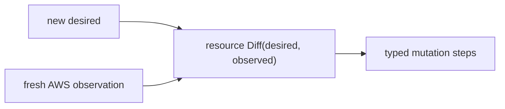

### SNS deletion tombstone loss

Topic and Subscription write `Deleted` and immediately clear the state key. The next
Delete no longer sees the tombstone. A kernel can make the normal Delete epilogue
unconditional: successful delete writes a minimal tombstone; only explicit
`ClearState` erases it.

### Direct time and replay

Four drivers still call `time.Now()` directly for persisted reconciliation data.
Most drivers use a journaled clock. This is exactly the kind of partial migration a
single kernel prevents: only the kernel writes `LastReconcile` and condition times.

### Error classification drift

Classification is repeated at hundreds of call sites and is structurally uneven.
The same provider failure can become 400, 403, 409, 500, retryable, or terminal based
on which driver copied which helper. A shared `RunAWS` boundary plus a conformance
matrix can make operation phase and provider error code explicit.

### Contract/documentation drift

The code has eight handlers while architecture and review docs still say six. A
generic driver type and a generated inventory test turn the handler contract into
executable structure rather than prose.

## Target architecture

The target has four responsibilities with deliberately narrow boundaries:

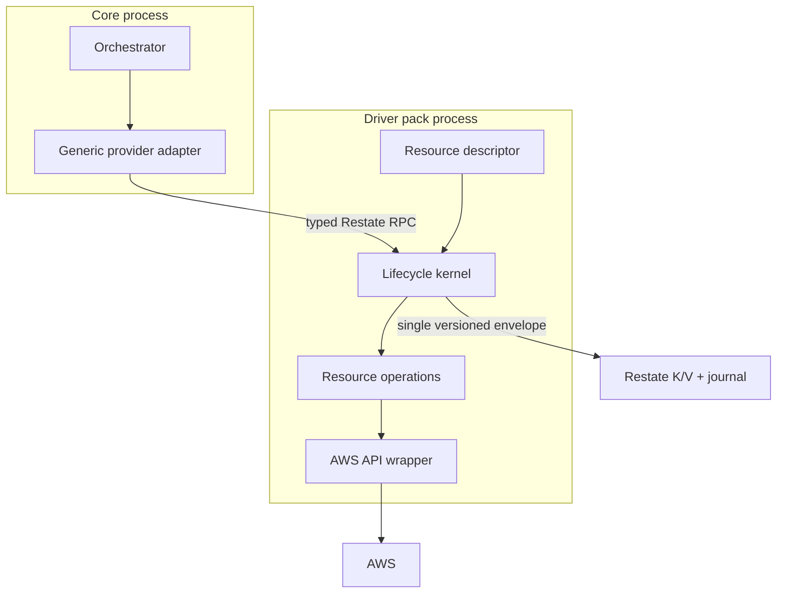

### 1. Lifecycle kernel

Owns the eight Restate handlers and all cross-resource invariants:

- state loading, version validation, and atomic writes;
- legal status transitions;
- generation rules;
- Managed/Observed behavior;
- normal delete tombstones;
- journaled timestamps and condition updates;
- error-to-state behavior;
- reconciliation timer deduplication and jitter;
- common readiness loop mechanics;
- common Import, GetStatus, GetOutputs, GetInputs, and ClearState behavior;
- standard logs, metrics, and drift-event emission; and
- startup validation that a descriptor is internally coherent.

### 2. Typed resource descriptor

Declares static facts and pure functions:

- kind/service name;
- how to read account and prepare the spec with resolved runtime context;
- validation/defaulting;
- output construction;
- desired-from-observed import conversion;
- drift/field classification;
- reconcile and readiness policy; and
- declared optional capabilities and sensitive/ephemeral fields.

### 3. Typed resource operations

Own AWS semantics and side effects:

- observe and not-found interpretation;
- create;
- converge mutable fields;
- delete and provider-specific safety checks;
- composite-resource sequencing;
- provider transition handling; and
- operation-specific error detail.

### 4. AWS wrapper

Remains the SDK boundary:

- AWS SDK request/response translation;
- testable interfaces;
- service-family rate limiting;
- low-level provider error inspection; and
- canonical observation construction.

## Proposed state model

The 51 concrete state structs should become one versioned generic envelope. The
following is illustrative; exact naming should be proven in the pilot:

```go
type State[S, O, Obs any] struct {
    Version            int                  `json:"version"`
    Desired            S                    `json:"desired"`
    Observed           Obs                  `json:"observed"`
    Outputs            O                    `json:"outputs"`
    Status             types.ResourceStatus `json:"status"`
    Mode               types.Mode           `json:"mode"`
    Error              *OperationError       `json:"error,omitempty"`
    Generation         int64                 `json:"generation"`
    LastReconcile      string                `json:"lastReconcile,omitempty"`
    ReconcileScheduled bool                  `json:"reconcileScheduled"`
    LateInitDone       bool                  `json:"lateInitDone,omitempty"`
    Conditions         []types.Condition     `json:"conditions,omitempty"`
}
```

Why keep a single envelope rather than embed a base struct in every state:

- JSON shape and zero values are controlled once;
- the kernel can update state without reflection;
- every status transition writes the full atomic object;
- late initialization is already the only lifecycle-specific extension used by
  current state structs; and
- state version rejection/reset is centralized.

Do not add a generic `map[string]any` metadata bag. If a later resource needs truly
private durable metadata that is neither desired, observed, nor output, add a fourth
typed state parameter only after a real use case proves it necessary.

### State transition ownership

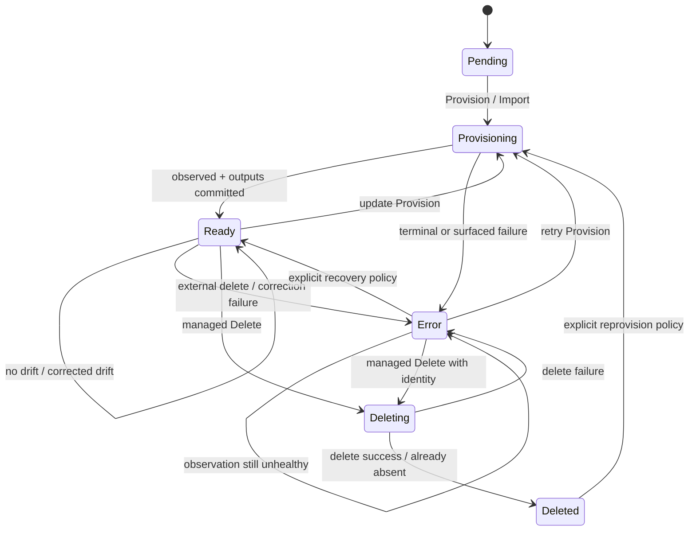

The kernel should define this table directly and test every allowed/forbidden edge.
Resource operations return facts; they do not choose arbitrary lifecycle statuses.

## Proposed typed boundary

The API below is a design direction, not a drop-in implementation. The pilots should
make it compile naturally for KMS, DynamoDB, and S3/SecurityGroup before freezing it.

```go
type Presence string

const (
    Present Presence = "present"
    Absent  Presence = "absent"
)

type Observation[Obs any] struct {
    Presence Presence
    Value    Obs
    Phase    string // provider phase such as ACTIVE, UPDATING, PENDING
}

type CreateResult[O any] struct {
    SeedOutputs O // identity available before the first successful Observe
}

type ResourceOps[S, O, Obs any] interface {
    Observe(ctx restate.ObjectContext, desired S, outputs O) (Observation[Obs], error)
    Create(ctx restate.ObjectContext, desired S) (CreateResult[O], error)
    Converge(ctx restate.ObjectContext, desired S, observed Obs) error
    Delete(ctx restate.ObjectContext, desired S, outputs O, observed Obs) error
}

type Descriptor[S, O, Obs any] struct {
    Kind             string
    Account          func(S) string
    Prepare          func(S, RuntimeIdentity) (S, error)
    Validate         func(S) error
    Outputs          func(Obs, O) O
    SpecFromObserved func(Obs) S
    Diff             func(S, Obs) DriftResult
    Reconcile        ReconcilePolicy
    ErrorPolicy      ErrorPolicy
    Capabilities     Capabilities[S, O, Obs]
}
```

There is an intentional tension here: `Converge` may require multiple AWS calls, and
each must remain a separate `restate.Run`. The hook therefore receives an object
context rather than one `RunContext`. Resource code must use a shared helper:

```go
func RunAWS[T any](
    ctx restate.ObjectContext,
    operation Operation,
    classify ErrorClassifier,
    call func(context.Context) (T, error),
) (T, error)
```

This helper should:

- create one journaled `restate.Run` step;
- classify the error **inside** the callback;
- attach kind, provider operation, key, account, region, and generation to logs;
- preserve retryable errors as retryable;
- wrap terminal failures with the correct status; and
- be enforced by a static check forbidding raw AWS-wrapper calls from handlers.

The kernel should never wrap an entire Provision or Converge in one `restate.Run`.
That would hide multi-step side effects and worsen ambiguous-outcome recovery.

## Capability model

Avoid a huge mandatory interface. Optional behavior should be explicit and validated
at construction, not discovered through reflection or kind switches.

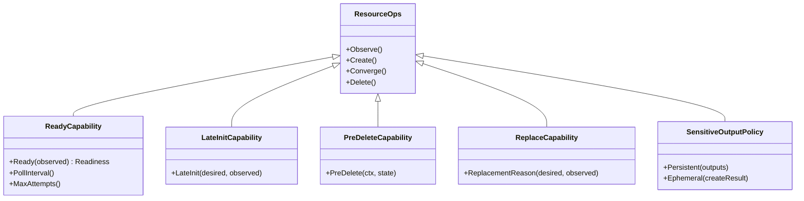

Recommended capabilities:

| Capability | Applies when | Examples |
|---|---|---|
| Readiness | Provider has a transitional create/update phase | EKS, DynamoDB, ALB/NLB, NAT, EC2, RDS |
| Late initialization | AWS defaults an omitted managed field | S3, EC2, VPC |
| Pre-delete | Cleanup must occur inside the resource's serialized boundary | S3, ECR, IAM role |
| Replacement | Immutable drift has a supported recreate strategy | EC2/AMI-dependent resources, immutable identities |
| Import normalization | Imported observation requires special desired baseline | Most resources, especially composites |
| Ephemeral output | Create returns sensitive or one-time data | KeyPair |
| Deferred correction | Provider is healthy but temporarily rejects updates | DynamoDB/EKS transitional states |

Descriptor construction must fail at startup for contradictory declarations, such
as readiness enabled without a predicate, a sensitive field also marked persistable,
or replacement enabled without a stable ownership lookup.

## Before and after: package shape

### Before

```text
internal/drivers/<kind>/
├── types.go       # spec + outputs + observed + repeated lifecycle state
├── aws.go         # SDK wrapper
├── drift.go       # resource comparison
├── driver.go      # 360–825 lines of lifecycle + AWS behavior
└── *_test.go      # resource tests + repeated handler tests
```

### After

```text
internal/drivers/
├── kernel/
│   ├── driver.go          # eight generic handlers
│   ├── state.go           # versioned generic envelope
│   ├── transitions.go     # legal lifecycle edges
│   ├── execution.go       # RunAWS + error boundary
│   ├── reconcile.go       # scheduling + conditions + drift events
│   ├── readiness.go       # durable polling loop
│   └── conformance_test.go
└── <kind>/
    ├── types.go           # spec + outputs + observed only
    ├── aws.go             # SDK wrapper
    ├── drift.go           # resource comparison
    ├── ops.go             # observe/create/converge/delete
    ├── descriptor.go      # policy + capability wiring
    └── *_test.go          # AWS semantics and field contracts
```

The exact filenames are less important than the ownership split. A resource package
should read like a concise explanation of that AWS resource, not another copy of the
Praxis state machine.

## Before and after: Provision

### Current resource driver

Every package roughly repeats this structure:

```go
func (d *KindDriver) Provision(ctx restate.ObjectContext, spec Spec) (Outputs, error) {
    api, region, err := d.apiForAccount(ctx, spec.Account)
    // classify auth, default, validate...

    state, err := restate.Get[KindState](ctx, drivers.StateKey)
    state.Desired = spec
    state.Status = types.StatusProvisioning
    state.Mode = types.ModeManaged
    state.Error = ""
    state.Generation++

    observed, found, err := d.observe(ctx, api, identity)
    if !found {
        // resource-specific restate.Run create calls
    }
    // resource-specific convergence and readiness
    // refresh observation

    state.Observed = observed
    state.Outputs = outputsFromObserved(observed)
    state.Status = types.StatusReady
    restate.Set(ctx, drivers.StateKey, state)
    d.scheduleReconcile(ctx, &state)
    return state.Outputs, nil
}
```

### Proposed resource package

```go
func NewDriver(auth authservice.AuthClient) *kernel.Driver[Spec, Outputs, Observed] {
    return kernel.New(Descriptor(auth), Ops{apiFactory: defaultFactory})
}

func Descriptor(auth authservice.AuthClient) kernel.Descriptor[Spec, Outputs, Observed] {
    return kernel.Descriptor[Spec, Outputs, Observed]{
        Kind:             ServiceName,
        Account:          func(s Spec) string { return s.Account },
        Prepare:          prepareSpec,
        Validate:         validateSpec,
        Outputs:          outputsFromObserved,
        SpecFromObserved: specFromObserved,
        Diff:             ComputeDrift,
        Reconcile:        kernel.DefaultReconcilePolicy(),
        ErrorPolicy:      errorPolicy,
    }
}

func (o Ops) Create(ctx restate.ObjectContext, desired Spec) (kernel.CreateResult[Outputs], error) {
    // Only AWS-specific durable steps remain here.
}

func (o Ops) Converge(ctx restate.ObjectContext, desired Spec, observed Observed) error {
    // Only field-specific mutations remain here.
}
```

The generic `kernel.Driver.Provision` performs the surrounding state machine once.
The resource package supplies only provider facts and operations.

### Proposed Provision flow

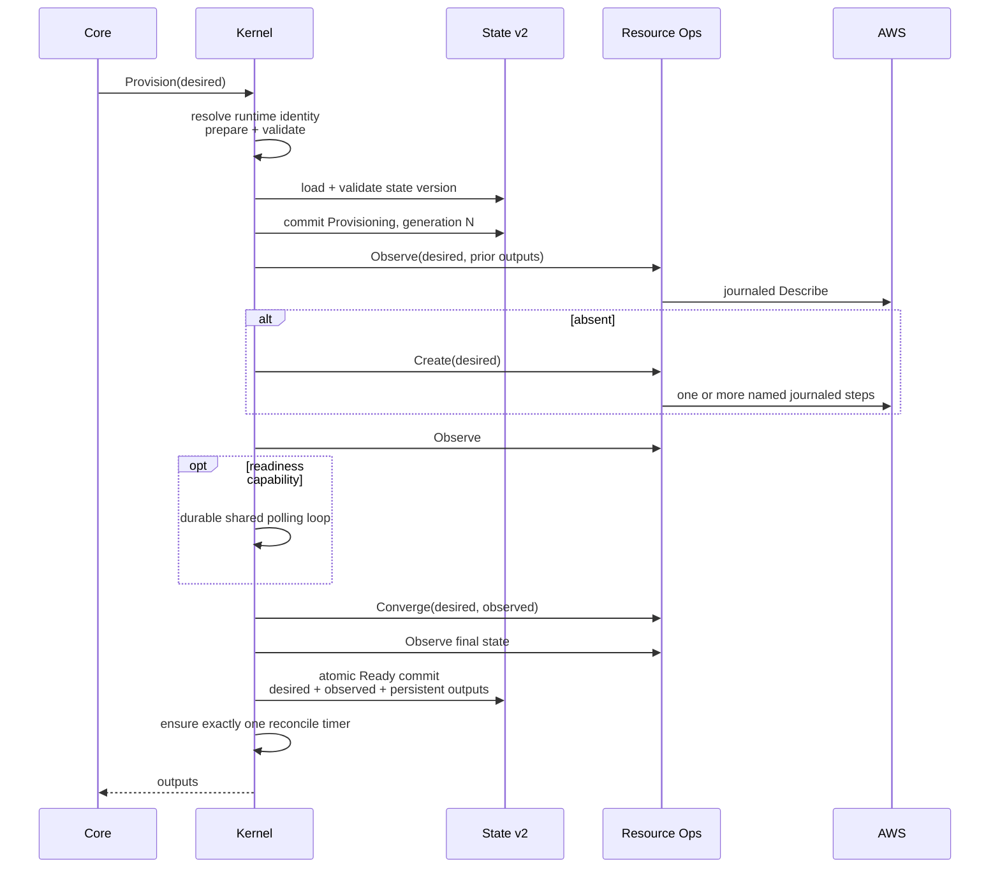

## Before and after: Reconcile

### Current risk

Each resource manually clears the scheduling flag, chooses eligible statuses, reads
time, handles observe failure/not-found, updates observed outputs, branches on mode,
emits events, corrects drift, persists state, and schedules the next call. Missing
one epilogue on any branch can stop reconciliation or create duplicate timers.

### Proposed kernel flow

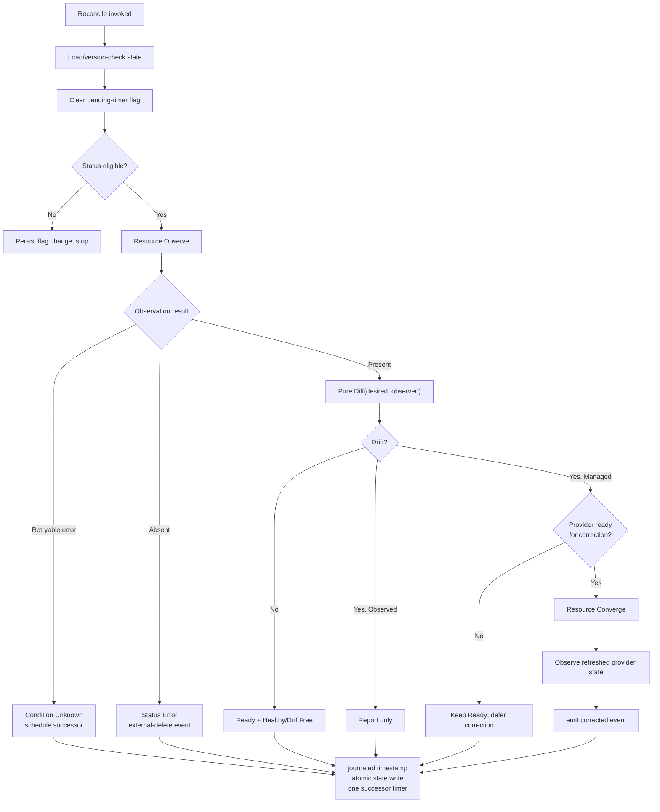

This does not genericize field correction. It genericizes the policy around it.

## Before and after: Delete

### Proposed invariant

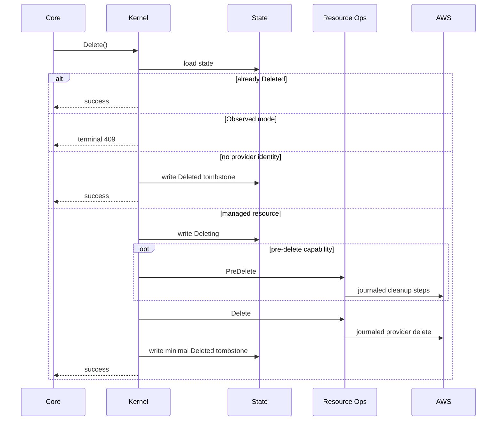

Normal Delete never clears the state key. `ClearState` remains an explicit management
operation for orphan/adoption reset. That distinction becomes impossible to overlook.

## Readiness: generic loop, specific predicate

Readiness is a good example of the correct abstraction boundary.

Generic mechanics:

- maximum attempts or deadline;
- one journaled Observe per attempt;
- `restate.Sleep` between attempts;
- not-found handling;
- cancellation/error propagation;
- log/metric fields; and
- final timeout condition.

Resource-specific facts:

- which provider phase is ready;
- which phases are terminal failures;
- polling interval and maximum duration;
- whether updates and creates use different readiness rules; and
- the actionable timeout message.

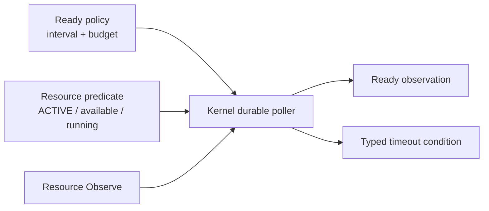

This replaces similar loops currently present in DynamoDB, EKS, ALB, and NLB and can
be extended to other asynchronous resources without copying orchestration code.

## Error policy

Error meaning depends on both provider code and lifecycle phase. A single flat map of
AWS code to HTTP code is insufficient.

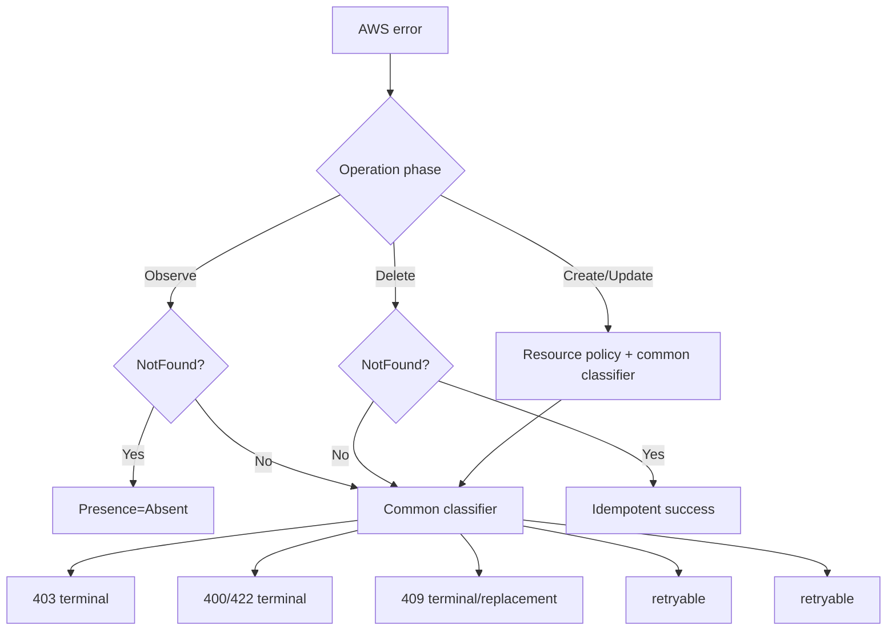

Recommended error representation:

| Field | Purpose |
|---|---|
| Kind/key/account/region | Locate affected object and credential context |
| Lifecycle phase | Provision, observe, import, reconcile, delete, readiness |
| Provider operation | `CreateTable`, `SetTopicAttribute`, etc. |
| Classification | auth, validation, conflict, absence, throttling, transient, unknown |
| Retryability | Restate callback behavior |
| HTTP/status code | Stable external contract for terminal errors |
| Provider code/request ID | Diagnosis without string parsing when available |

Resource packages may add narrow overrides, but every override must be a data entry or
typed function covered by the same conformance cases.

## Durable-execution failure windows

Genericization must preserve Restate's journal granularity and explicitly address the
external side-effect ambiguity.

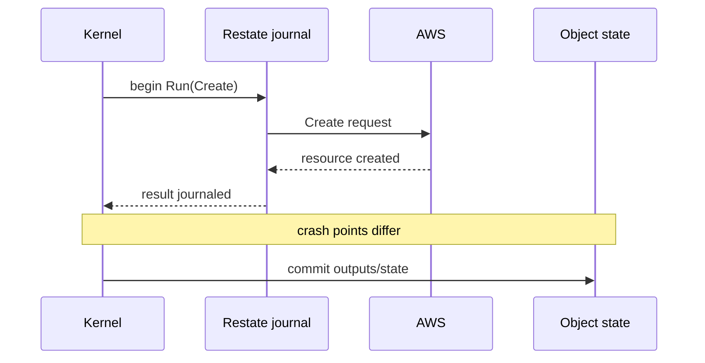

| Failure point | Expected recovery |
|---|---|
| Before AWS call | Retry executes call |
| During call with no result | Outcome may be unknown; stable ownership lookup is required |
| After journaled success, before state write | Replay returns journaled result without repeating call |
| After state write, before response | Replay returns consistent Ready state/output |
| After provider Create, orchestrator cancels invocation | Kernel must expose UnknownOutcome/recovery rather than assume absence |

The kernel improves consistency but cannot eliminate an unknowable provider outcome.
Every create-capable resource should declare a recovery identity strategy:

- deterministic provider name;
- `praxis:managed-key` ownership tag;
- client token/idempotency token; or
- explicit statement that safe automatic adoption is impossible.

That declaration belongs in the capability manifest and should drive fault tests.

## Sensitive and ephemeral outputs

The kernel is the right place to enforce a data-classification boundary.

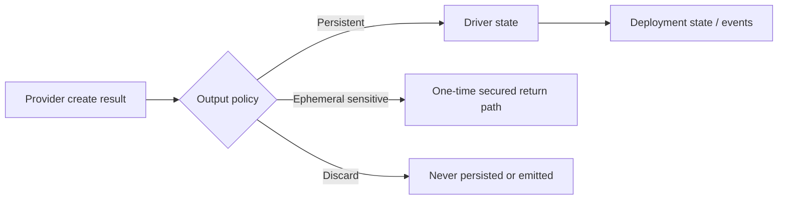

For KeyPair, private material must not flow through generic output normalization into
deployment state or CloudEvents. A descriptor should distinguish:

- persistent public outputs;
- sensitive persistent references, if ever allowed;
- one-time ephemeral outputs; and
- values that must be discarded.

The kernel should reject a descriptor that marks the same field both ephemeral and
persistable. End-to-end tests must trace outputs through adapter normalization,
deployment state, expression hydration, events, and sinks.

## Complexity removed versus complexity added

The refactor is not free. It exchanges wide, repeated complexity for narrower,
centralized complexity.

| Area | Before | After | Net effect |
|---|---|---|---|
| Handler state machines | 51 copies | One generic implementation | Large reduction in divergence |
| State structs | 51 repeated envelopes | One versioned generic envelope | Simpler schema, broader central blast radius |
| AWS behavior | Mixed into handlers | Typed Ops packages | Easier resource review |
| Optional behavior | Ad hoc methods/branches | Validated capabilities | More explicit, some descriptor ceremony |
| Error handling | Hundreds of local branches | Shared boundary + narrow overrides | Consistency, risk of over-general classification |
| Readiness | Repeated loops and adapter waiters | Shared loop + predicates | Less code, clearer policy ownership |
| Debugging | Direct concrete call stacks | Kernel + hook indirection | Requires better structured logs |
| Change blast radius | Local bugs, wide inconsistency | Kernel bugs affect all kinds | Demands exceptional kernel tests |
| Type system | Simple concrete structs | Generics and instantiated handler types | Stronger guarantees, harder compiler errors |
| Deployment migration | Independent files | Coordinated state/version change | Higher one-time coordination cost |
| Testing | Many bespoke happy paths | Kernel model + all-driver conformance | Higher initial harness investment, lower marginal cost |

### New complexity we are intentionally accepting

1. A generic type API that maintainers must learn.
2. A versioned shared state format.
3. Capability validation and descriptor construction.
4. A kernel with a larger correctness blast radius.
5. More sophisticated conformance/fault infrastructure.
6. A temporary mixed world during pilot development.

These are acceptable only because they are centralized, measurable, and heavily
testable. If the design merely moves 28,000 lines into a generic package or replaces
typed code with reflection, it has failed.

## Approaches considered

| Approach | Advantages | Problems | Decision |
|---|---|---|---|
| Keep copy/paste drivers | Easy local edits; no migration | Divergence continues; reviews remain huge | Reject |
| Add only small helpers | Low risk; fixes clocks/tags/errors | Cannot enforce handler/state-machine invariants | Do first, but insufficient as end state |
| Generate driver.go files | Keeps concrete code; reproducible | Generated code remains large; customization/regen drift | Useful for inventories, not lifecycle implementation |
| One generic AWS CRUD engine | Maximum LOC reduction | Hides identity/readiness/replacement/deletion differences | Reject |
| Reflection and `map[string]any` | Flexible descriptors | Loses compile-time safety; runtime failures; poor reviewability | Reject |
| Typed lifecycle kernel + Ops hooks | Enforces invariants while retaining AWS semantics | Generic API and central blast radius | Recommend |

## What must remain resource-specific

The kernel must never contain `switch kind` logic. These concerns stay in resource
packages:

- AWS identity and lookup;
- defaults with service-specific meaning;
- validation and cross-field constraints;
- immutable/mutable/clearable field definitions;
- provider API request construction;
- multi-call mutation ordering;
- set/list normalization;
- readiness predicate and provider failure phases;
- import reconstruction;
- deletion prerequisites and provider-specific delayed deletion;
- output derivation; and
- field-level drift descriptions.

Decision rule:

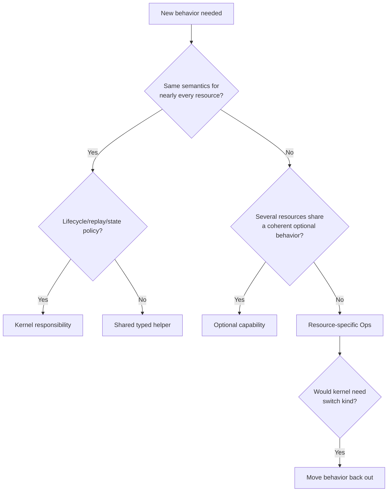

## Relationship to existing adapter hooks

Core currently has optional `Observer`, `ReadyWaiter`, `PreDeleter`, and timeout
interfaces. Some behavior therefore exists at both adapter and driver layers.

The refactor should clarify ownership:

| Concern | Correct owner |
|---|---|
| Plan-time live probe | Adapter/Core; it exists before a driver invocation |
| Data-source lookup | Adapter/Core read path |
| Driver readiness before returning Ready | Driver kernel + resource predicate |
| Orchestrator operation timeout | Adapter metadata consumed by Core |
| Resource cleanup required for safe Delete | Driver operation/capability |
| Deployment-level lifecycle guards | Orchestrator |
| Provider state and tombstone | Driver kernel |

Do not keep two readiness implementations where the driver returns Ready and the
adapter then decides it is not ready. The driver should not return Ready until its
declared provider readiness predicate holds. Adapter `ReadyWaiter` can then disappear
or become a compatibility shim during the bounded conversion.

Likewise, pre-delete cleanup should execute behind the driver's per-key exclusive
handler whenever it mutates the same provider resource. This preserves serialization
with Provision/Reconcile and keeps the delete transaction understandable.

## Performance implications

This work is primarily a correctness optimization. Go generics will not materially
improve runtime by themselves. Expected performance benefits come from consistent
behavior:

- a reliable observe/no-op path avoids unnecessary updates;
- shared readiness polling prevents overly aggressive provider calls;
- one scheduling policy prevents timer fan-out and synchronized herds;
- consistent error classification stops retrying permanent failures;
- shared credential-resolution policy can support caching safely; and
- smaller resource packages reduce developer/test cycle time.

The following optimizations are related but separate and should not be smuggled into
the kernel migration:

- orchestrator `WaitFirst`/multi-future scheduling;
- sharding global indexes/event routing;
- credential cache architecture;
- account/region/API-family rate limiting;
- Restate test-environment reuse; and
- driver-pack scaling.

Rate limiting should remain keyed by AWS API family, account, and region in the AWS
wrapper/infrastructure layer. A lifecycle kernel does not know that VPC, subnet,
route table, SG, EIP, and EC2 share EC2 control-plane limits.

## Pre-release state strategy

Praxis is not live and explicitly warns that breaking changes will occur. The project
should use that freedom rather than building compatibility shims for development-era
state.

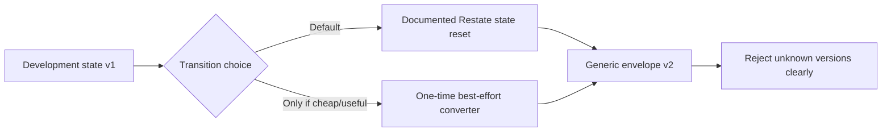

Rules:

1. Add `version` before broad migration.
2. Update drivers, adapters, schemas, examples, and tests in a bounded change window.
3. Provide a documented development-state reset as the supported path.
4. Write a converter only if preserving fixtures materially helps development.
5. Do not dual-read/dual-write indefinitely.
6. Do not retain deprecated fields solely for backward compatibility.
7. Test replay and atomicity rigorously within v2.

Breaking the unpublished representation is acceptable. Breaking deterministic replay
or leaving an unrecognized state partially decoded is not.

## Migration plan

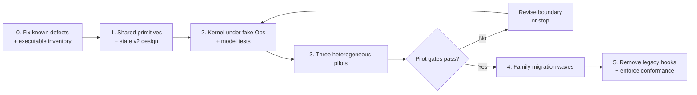

### Phase 0 — fix defects before moving code

- Fix SNS previous-desired comparison and tombstone clearing.
- Stop KeyPair private material from entering durable generic outputs/events.
- Centralize journaled current time.
- Establish one phase-aware AWS error classification helper.
- Make the eight-handler inventory executable and correct stale docs.

Moving known bugs into a kernel makes them harder to isolate; fix and regression-test
them first.

### Phase 1 — primitives and state v2

- Introduce `RunAWS`, journaled time, condition constructors, and tombstone helpers.
- Define the generic state envelope and version rejection.
- Document/reset development state.
- Define the field/capability manifest and startup validation.
- Keep existing drivers on the helpers temporarily to prove behavior.

### Phase 2 — kernel against fake operations

Before migrating an AWS driver, test the kernel with a deterministic fake Ops layer
that can inject a fault at every boundary:

- absent/present observation;
- create success/failure;
- crash after create result and before state commit;
- converge success/failure;
- readiness transitions and timeout;
- external deletion;
- Managed versus Observed drift;
- delete/not-found/double-delete;
- timer deduplication; and
- sensitive/ephemeral output filtering.

### Phase 3 — three heterogeneous pilots

1. **KMSKey** — simple field convergence plus composite key+alias creation and delayed
   deletion.
2. **DynamoDBTable** — asynchronous readiness, transitional update deferral, mutable
   throughput, immutable key schema, and tags.
3. **S3Bucket or SecurityGroup** — late initialization/pre-delete or complex set
   convergence and custom identity.

The pilot set is deliberately awkward. An interface designed only around a simple
tagged resource will fail later.

### Phase 4 — family waves

Once pilots pass, convert related families in a bounded pre-release change window:

| Wave | Candidate families | What it proves |
|---|---|---|
| 1 | CloudWatch, SQS/SNS policies, ECR policy | Simple/subresource lifecycle |
| 2 | IAM identities and relationships | Composite cleanup and auth errors |
| 3 | VPC primitives | Custom identity, collection convergence, shared EC2 API limits |
| 4 | ELB/Route 53 | Readiness, ordered subresources, clearable attributes |
| 5 | Compute/Lambda/ECR | versioned outputs, one-time data, async readiness |
| 6 | RDS/Aurora/storage | long waits, destructive safety, delayed provider behavior |

This ordering is adjustable; the important rule is that each wave adds a distinct
complexity class and keeps the conformance suite green.

### Phase 5 — remove the mixed world

- Remove copied lifecycle state structs and schedule helpers.
- Remove adapter readiness/pre-delete behavior that moved behind the driver boundary.
- Reject registration of a driver without a validated descriptor.
- Add static checks for raw `time.Now`, raw AWS calls outside `RunAWS`, and direct
  normal-Delete state clearing.
- Regenerate docs/inventory from descriptors.

## Verification architecture

The kernel increases central blast radius, so its verification must be stronger than
the current per-driver happy-path suite.

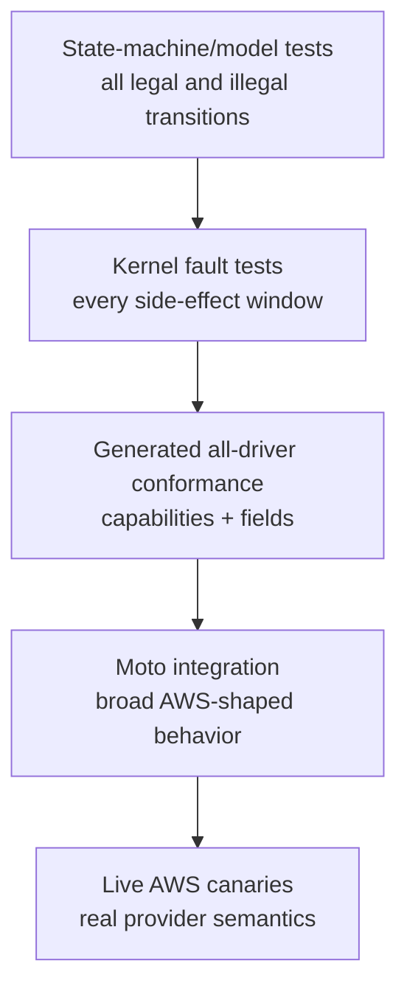

### Kernel model tests

Generate action sequences over Provision, Import, Reconcile, Delete, and ClearState.
Assert invariants after every action:

- status is a legal value and transition;
- generation never decreases;
- Deleted retains a tombstone;
- Observed mode never invokes mutation;
- Ready has coherent desired/observed/output state;
- no sensitive ephemeral value is persisted;
- no more than one reconcile successor is pending; and
- every persisted timestamp came from the journaled clock.

### All-driver conformance

Each descriptor supplies a fixture and declares applicable capabilities. The same
harness checks:

| Area | Required contract |
|---|---|
| Provision | create, second identical call, provider-already-exists, external absence |
| Fields | every mutable update, every immutable change, every explicit clear |
| Import | default Observed, explicit Managed, not-found |
| Delete | normal, second delete, already absent, Observed rejection, tombstone |
| Reconcile | no drift, report-only, correction, external delete, correction failure |
| Errors | auth, validation, conflict, throttling, timeout/5xx, retry exhaustion |
| Replay | before/after every provider side effect and state commit |
| Readiness | ready, transitional, failed provider phase, timeout |
| Data | sensitive output/state/event assertions |

A skip is permitted only when the descriptor says why the capability does not apply.
Availability-based skips must fail CI for a resource family rather than silently make
the suite green.

### Static enforcement

Add a small repository check that rejects:

- `time.Now`, randomness, or environment reads in handlers outside journaled helpers;
- AWS wrapper calls outside `RunAWS`/approved observation helpers;
- `restate.Clear(StateKey)` in normal Delete;
- direct reconcile delayed sends outside the kernel;
- a resource registered without schema, adapter, driver, descriptor, and tests; and
- descriptor sensitive fields absent from adapter masking metadata.

## Observability after genericization

Indirection is only acceptable if diagnosis improves. Every kernel operation should
emit structured fields:

| Field | Example |
|---|---|
| `resource.kind` | `DynamoDBTable` |
| `resource.key` | `us-east-1~orders` |
| `resource.generation` | `7` |
| `lifecycle.operation` | `reconcile` |
| `provider.operation` | `UpdateTable` |
| `provider.phase` | `UPDATING` |
| `management.mode` | `Managed` |
| `error.class` | `throttled` |
| `reconcile.next_delay` | `5m42s` |
| `state.version` | `2` |

Recommended metrics:

- handler duration and outcome by kind/operation;
- AWS call/retry count by API family/account/region;
- readiness attempts and timeout rate;
- drift detected/corrected/deferred;
- external deletion count;
- terminal versus retryable error classification;
- reconcile scheduling delay and duplicate-prevention count; and
- UnknownOutcome recovery attempts.

The kernel should attach these fields automatically so resource Ops code only adds
provider-specific identifiers.

## Expected code-shape change

Do not commit to a line-count target before pilots, but use these directional goals:

| Measure | Current | Target direction |
|---|---:|---|
| Lifecycle handler implementations | 408 concrete methods | 8 generic methods instantiated for 51 kinds |
| State envelopes | 51 | 1 versioned generic envelope |
| Schedule helpers | 51 | 1 kernel implementation |
| Read handler bodies | 153 (`GetStatus/Outputs/Inputs`) | 3 generic implementations |
| Clear handlers | 51 | 1 generic implementation |
| Direct lifecycle state writes | 1,065 total `Set` sites | State-transition writes concentrated in kernel |
| Resource `driver.go` size | 360–825 lines | Ops/descriptor dominated; measure after pilots |

A reasonable pilot hypothesis is a **40–55% reduction in lifecycle-heavy driver.go
code**, not necessarily in total driver package code. AWS wrappers, normalization,
drift, and tests should remain explicit and may grow as verification improves.

## Success criteria

Proceed with the broad migration only if the pilots demonstrate all of the following:

1. No kind switch, reflection, or untyped lifecycle maps in the kernel.
2. KMS, DynamoDB, and S3/SG fit without weakening their AWS semantics.
3. Every AWS side effect remains an individually visible journal step.
4. State transitions and tombstones are kernel-controlled.
5. Error conformance covers auth, validation, conflict, throttling, and not-found.
6. Readiness uses one durable loop with resource predicates.
7. Resource package code is easier to review than before.
8. Fault tests cover after-create/before-state and cancellation ambiguity.
9. Sensitive outputs cannot enter durable state/events without an explicit policy.
10. Adding a representative new resource requires mostly Ops, drift, schema, and
    field-contract work—not another lifecycle state machine.

Operational targets after full conversion:

- zero direct wall-clock reads in driver handlers;
- zero per-kind scheduling helpers;
- zero normal Delete handlers clearing their tombstone;
- 100% of registered drivers in the conformance inventory;
- 100% of AWS call boundaries using the shared classifier path;
- no duplicated adapter/driver readiness ownership; and
- state v2 unknown-version behavior tested for every driver service.

## Stop conditions

Pause or redesign the migration if any of these occur:

- the kernel needs `switch kind` logic;
- resource behavior moves into reflection, JSON round-trips, or `map[string]any`;
- a resource needs to expose fewer journal steps to fit the interface;
- classification becomes less operation-aware;
- one exceptional driver changes unrelated kinds' behavior;
- descriptor fields become a large collection of undocumented nil callbacks;
- compiler errors make routine driver development substantially harder;
- test coverage is reduced because “the kernel is already tested”;
- the new state version/reset behavior cannot be proven; or
- the pilots reduce line count but make AWS semantics harder to locate.

## Final recommendation

Do the work, but frame it as a **correctness architecture project**, not a cleanup.

The recommended sequence is:

1. fix the known lifecycle/security bugs;
2. add shared execution/time/error primitives;
3. build and model-test a versioned lifecycle kernel;
4. prove it against KMS, DynamoDB, and S3 or SecurityGroup;
5. migrate families in a bounded pre-release change window; and
6. delete the legacy lifecycle implementations and duplicated adapter hooks.

The before/after difference should be easy to state:

```mermaid
flowchart LR
    Before["Before<br/>51 resources each implement<br/>AWS semantics + Praxis lifecycle"]
    After["After<br/>51 resources implement AWS semantics<br/>1 kernel implements Praxis lifecycle"]
    Before -->|"conformance-tested refactor"| After
```

That separation is better because AWS complexity stays visible where it belongs,
while lifecycle correctness becomes centralized, executable, and enforceable.
