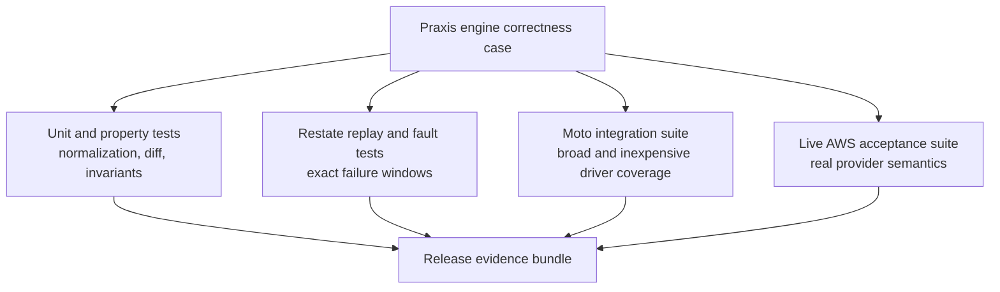
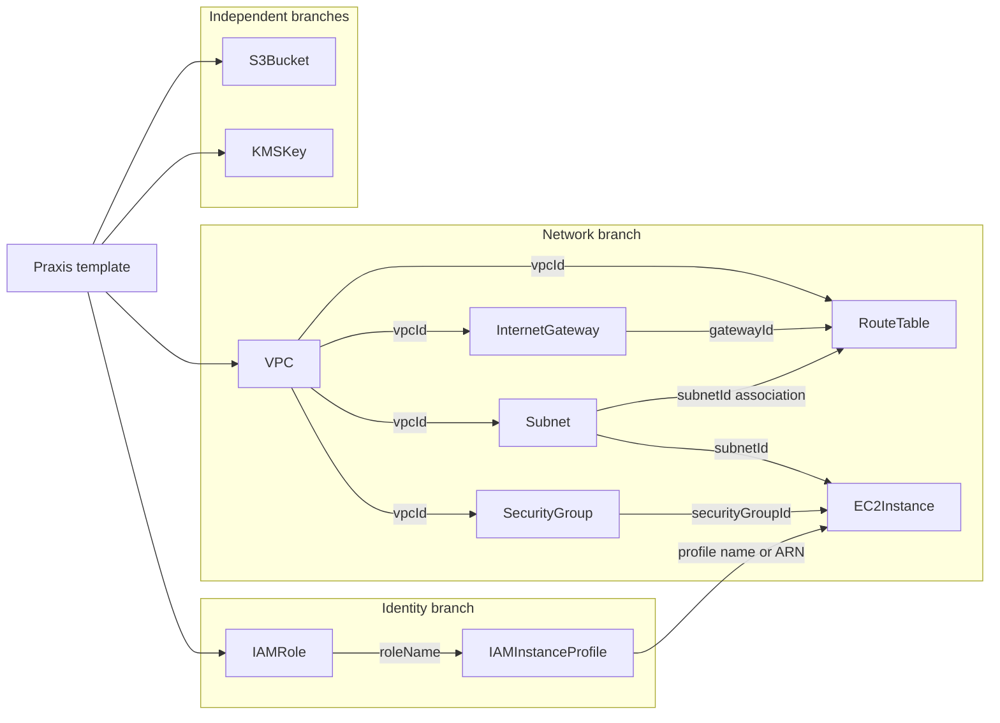
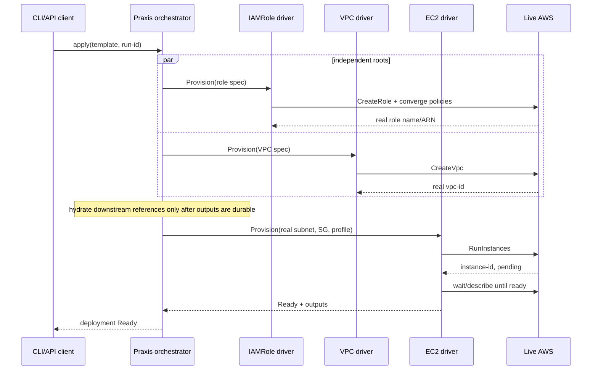
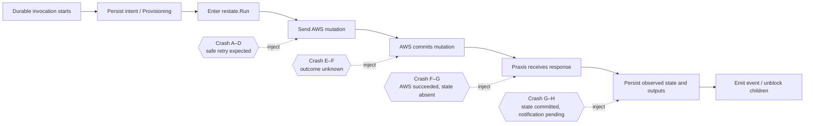
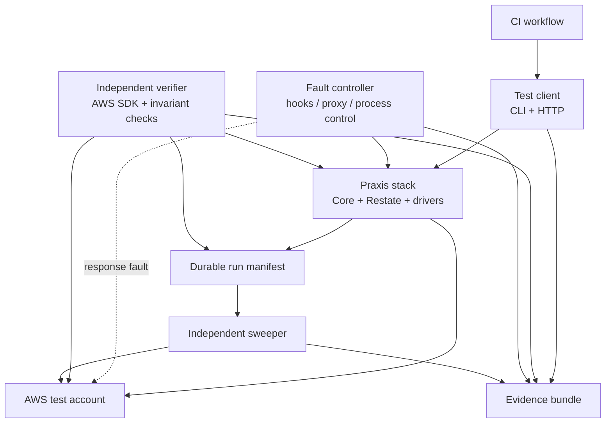
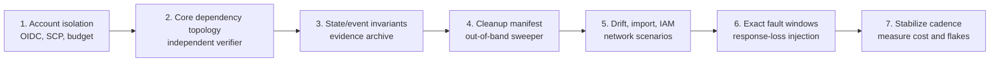

# Live AWS Engine Correctness Verification — Scope and Cost

Estimate date: 2026-07-13. Prices are public `us-east-1` rates in USD,
excluding tax, support plans, negotiated discounts, and Free Tier credits. This
is a planning estimate, not an AWS quote. The suite should record tagged cost
from its first runs and replace these allowances with measured Cost and Usage
Report data.

## Executive recommendation

Build the live-AWS tier as an **acceptance suite for the Praxis engine**, not as
a certification program for all 51 AWS drivers.

Use approximately **10 representative driver kinds**—about 20% of the current
driver inventory—covering IAM, VPC networking, EC2, S3, and KMS. Those resources
are enough to put real AWS semantics behind the engine paths that matter most:

- dependency discovery, DAG ordering, and output hydration;
- parallel execution of independent branches;
- durable provider calls and recovery after interruption;
- idempotent re-apply and ambiguous-outcome recovery;
- drift detection, managed correction, and observed-only import;
- terminal versus retryable error behavior;
- state, generation, status, outputs, events, and CLI/API results; and
- reverse-order deletion and leak detection.

The recommended cash commitment is:

| Item | Estimate |
|---|---:|
| Expected direct AWS usage after tuning | $5–$30/month |
| Recommended operating envelope, including logs and leak reserve | **$25–$100/month** |
| Initial monthly budget alarm | **$100** |
| Per-run abnormal-spend alarm | **$10** |

There is intentionally no labor-price or engineer-week estimate. Praxis is a
solo passion project and AI assistance changes the implementation cadence too
much for team-planning units to be useful. The meaningful non-cash estimate is
the milestone sequence later in this document: each milestone should leave one
new engine claim continuously verifiable, and stopping after the core milestone
still produces a valuable correctness signal.

The difficult part is designing assertions that distinguish “AWS eventually
created something” from “Praxis made the correct durable state transition and
can safely continue after every failure boundary.”

Do not put this live suite on every pull request. Keep deterministic unit,
Restate, and Moto verification on every change; run the core live acceptance
suite nightly or after selected merges, an extended network/IAM scenario
weekly, and destructive fault campaigns monthly.

## The claim this suite should make

After the suite is built and passing, the defensible claim is:

> For a representative, dependency-rich AWS topology, Praxis correctly plans,
> orders, executes, resumes, reconciles, observes, and deletes infrastructure
> against real AWS control-plane behavior under the tested success and failure
> conditions.

It is **not** defensible to claim:

> Every Praxis driver implements every AWS field and lifecycle edge correctly.

That broader claim would require a much larger driver conformance program. It
is not necessary for validating the engine and is a poor use of the initial
live-AWS budget.

## What live AWS can and cannot prove

No finite test suite proves total correctness. “Prove” here means collecting
repeatable evidence strong enough to support an engineering release decision
and to falsify incorrect assumptions at the real provider boundary.

### What it can establish at a reasonable level

| Engine property | What real AWS contributes |
|---|---|
| Dependency ordering | Child APIs genuinely reject missing or not-yet-visible VPC, subnet, role, profile, and gateway identifiers. |
| Output hydration | Downstream specs consume real AWS-generated IDs and ARNs rather than Moto-shaped placeholders. |
| IAM behavior | Real trust policies, managed/inline permissions, propagation delay, `AccessDenied`, and instance-profile attachment are exercised. |
| Network control-plane behavior | VPC scoping, subnet placement, route associations, internet-gateway attachment, security-group normalization, and EC2 ENI placement are real. |
| Asynchronous readiness | EC2 and IAM expose actual eventual consistency, waiter behavior, and delayed visibility. |
| Idempotency | A second apply can be checked against both Praxis state and an independent AWS inventory for duplicates. |
| Drift and reconciliation | Tests can mutate AWS outside Praxis, then prove whether managed and observed modes behave differently. |
| Import behavior | A pre-existing AWS resource can be imported and proven unchanged while Praxis records observed state and outputs. |
| Error classification | Real validation, missing-resource, conflict, authorization, and selected throttling responses can be compared with Praxis retry/terminal behavior. |
| Delete ordering | AWS dependency constraints make incorrect reverse ordering observable rather than silently accepted by a fake provider. |
| Cleanup correctness | An independent AWS inventory can prove that the test run left no tagged resources behind. |

### What it cannot establish by itself

| Non-claim | Why live AWS is insufficient | Required complementary evidence |
|---|---|---|
| All 51 drivers are correct | Ten representative kinds do not cover every adapter, field, waiter, or update path. | Table-driven driver conformance tests and selective per-driver live canaries. |
| Every field combination is correct | The combinatorial surface is too large and many combinations are invalid or region-specific. | Unit/property tests around normalization, diffing, and capability manifests. |
| Every rare AWS error is handled | AWS cannot safely or deterministically induce every timeout, malformed response, throttle, and partial failure. | Scripted provider doubles or a fault-injection transport. |
| Exactly-once AWS mutation | AWS APIs and network delivery are not transactional with Restate state. The strongest achievable contract is safe replay and convergence. | Idempotency tokens/ownership keys, post-error reads, and crash-window tests. |
| Crash at an exact instruction boundary | Killing a process near an API call does not prove which side of the response boundary it reached. | Test hooks immediately before/after `restate.Run`, provider calls, and state commits. |
| Data-plane network correctness | A route or security group existing does not prove packets travel as intended. | An explicit probe workload, flow logs, or SSM-based connectivity test. |
| Production scale and quota behavior | A small correctness topology does not model hundreds of concurrent deployments. | Separate load, soak, quota, and rate-limit testing. |
| All regions/accounts/partitions | One account in `us-east-1` cannot represent regional service availability or GovCloud/China partitions. | A small region matrix only where product scope requires it. |
| Formal determinism | A passing workflow does not mathematically prove code inside durable execution is deterministic. | Static review plus deterministic replay tests. |

The important design consequence is that live AWS is one layer of the
correctness case, not the entire case.

## Representative scope: the top 10 driver kinds

The core topology should favor **mechanical diversity**, not service count. One
resource earns a place only if it exercises an engine behavior not adequately
covered by a cheaper resource.

| Driver kind | Why it belongs | Principal engine behavior exercised |
|---|---|---|
| `VPC` | Root of the network branch with AWS-assigned identity | Root creation, outputs, tagging, deletion |
| `Subnet` | Consumes a VPC output and has immutable placement | DAG hydration, immutable inputs, deletion dependency |
| `InternetGateway` | Separate object attached to another object | Multi-step create/attach and detach/delete |
| `RouteTable` | Depends on VPC, subnet, and gateway; contains set-like routes | Fan-in dependencies, normalization, association convergence |
| `SecurityGroup` | Depends on VPC and manages unordered rules | Set semantics, external rule drift, in-place correction |
| `IAMRole` | Globally scoped and eventually consistent | Trust policy, policy convergence, propagation, authorization errors |
| `IAMInstanceProfile` | References a role and is consumed by EC2 | Cross-driver output/name hydration and IAM propagation |
| `EC2Instance` | Consumes network and IAM branches and has real waiters | Fan-in, asynchronous readiness, mutable update, replacement boundary |
| `S3Bucket` | Cheap independent branch with globally constrained naming | Parallelism, account/region API behavior, import/no-op/delete |
| `KMSKey` | Security-sensitive and deletion is asynchronous/scheduled | Policy/permission behavior and non-immediate deletion semantics |

Ten of the 51 concrete resource-driver packages is 19.6% of the inventory. This
is intentionally near the requested top 10–20%; it covers five important AWS
service families without pretending that service popularity alone selects the
best engine tests.

`S3Bucket` and `KMSKey` should initially be independent branches. The current S3
spec supports the `aws:kms` encryption algorithm but does not expose a KMS key ID,
so the test must not invent a dependency that Praxis cannot currently express.

### Core topology

This shape is deliberately useful to the engine:

- VPC, IAM, S3, and KMS roots can start in parallel.
- EC2 is a fan-in node that cannot start until network and IAM outputs exist.
- Route table creation also fans in VPC, subnet, and gateway outputs.
- Deletion must reverse the graph, with EC2 removed before its subnet, security
  group, and instance profile, and the route table detached before gateway/VPC.
- Real AWS IDs make hydration errors visible.

### Weekly extension for network data-plane evidence

The core suite proves network **control-plane** mechanics. If packet-level proof
is important, add one weekly scenario rather than burdening every nightly run:

1. Create the Praxis-managed VPC, subnet, route table, security group, role,
   instance profile, and EC2 instance.
2. Use a deliberately minimal probe path—prefer SSM if the required endpoint or
   egress is available; otherwise use a short-lived harness-created peer.
3. Demonstrate both an allowed connection and a denied connection.
4. Change the security-group rule through Praxis and prove the outcome changes.
5. Retain probe results and VPC Flow Logs only for this scenario.

This distinction matters: `DescribeRouteTables` proving that a route is present
is not the same as proving a packet followed that route.

## Engine acceptance scenarios

The suite should be organized by engine claim. Each scenario may reuse the same
topology within a run, but assertions must be independently identifiable.

### A. Plan, dependency, and execution mechanics

1. Compile and validate the template.
2. Produce a plan whose nodes, dependency edges, and actions match a checked-in
   expected graph.
3. Start the deployment through the public CLI or HTTP API, not an internal Go
   shortcut.
4. Prove independent roots overlapped in time while dependent nodes did not
   start before their prerequisites became ready.
5. Prove every hydrated child field equals the actual parent output recorded by
   an independent AWS `Describe`/`Get` call.
6. Prove final deployment and resource statuses, generations, outputs, and
   events form a coherent history.

### B. Idempotency and update mechanics

1. Apply the identical template again.
2. Assert the plan is empty/no-op, generations behave as specified, and AWS has
   exactly one owned resource for every logical key.
3. Change one mutable property—for example security-group rules, EC2 instance
   type, a role inline policy, or tags.
4. Assert the plan describes the intended in-place action.
5. Apply and independently verify the new live state.
6. Confirm unrelated nodes were not provisioned again.

The test must inspect CloudTrail or a request audit where practical. Merely
ending with one resource does not prove that Praxis avoided unnecessary
mutations on the second apply.

### C. Drift and management-mode mechanics

1. Mutate a managed security-group rule or role policy directly through an AWS
   test principal.
2. Wait for or explicitly trigger reconciliation.
3. Assert drift was observed, reported, and corrected in managed mode.
4. Import a separate pre-existing S3 bucket or role in observed mode.
5. Mutate it directly in AWS.
6. Assert Praxis updates its observation/report but performs no corrective AWS
   call.

This paired test is more valuable to the engine than repeating create/delete
against dozens of simple drivers.

### D. Durable failure-window mechanics

The highest-risk engine property is the boundary between a successful AWS
mutation and a durable Praxis state commit.

Test at least these four windows. Live AWS supplies the real mutation and
visibility behavior, but exact timing requires test-only hooks or an injectable
AWS transport. A process kill alone is too ambiguous to know which boundary was
tested.

For every window, assert:

- Restate resumes or replays the invocation;
- Praxis discovers whether the resource already exists;
- no duplicate owned resource is created;
- state and outputs converge to the actual AWS object;
- downstream nodes are released at most once under the documented semantics;
- events do not claim success before durable state supports that claim; and
- retry count and terminal/retryable classification are bounded and visible.

An especially valuable case is dropping the successful AWS response after the
provider has committed the mutation. That tests the real “unknown outcome”
problem without relying on AWS to manufacture a convenient timeout.

### E. IAM and authorization mechanics

Use at least three roles:

- the normal least-privilege Praxis execution role;
- a deliberately under-privileged role for negative tests; and
- an independent verifier/cleanup role that Praxis itself cannot impersonate.

Exercise:

1. real role and instance-profile propagation into EC2;
2. `AccessDenied` on a create operation;
3. `AccessDenied` on a describe/reconcile operation;
4. `AccessDenied` during delete, followed by permission restoration and resume;
5. a malformed trust or inline policy that AWS rejects; and
6. confirmation that credentials, policy documents marked sensitive, and
   provider error internals do not leak into public events or normal logs.

The under-privileged tests should assert behavior, not exact AWS message text.
AWS error wording can change while the error code and HTTP status remain stable.

### F. Delete and cleanup mechanics

1. Request deletion through the same public surface used for apply.
2. Record the actual deletion start order.
3. Assert no parent is deleted before all Praxis-managed dependents are gone.
4. Retry deletion after a deliberate transient or authorization failure.
5. Delete again and verify the idempotent already-absent contract.
6. Query AWS independently by run tag, ownership key, name prefix, and durable
   manifest.
7. Fail the workflow if anything remains, even if functional tests passed.

KMS is a special case: deletion is scheduled rather than immediate. The cleanup
report should treat “scheduled for deletion with the expected key and date” as
the terminal evidence, not wait days for disappearance.

## Acceptance matrix

The initial implementation should make this matrix executable and produce a
machine-readable result for every row.

| ID | Claim | Representative resource/path | Live AWS required? | Evidence |
|---|---|---|---:|---|
| ENG-01 | Plan graph is correct | Full topology | No, but repeat live | Serialized plan + expected graph |
| ENG-02 | Independent roots execute concurrently | VPC, IAM, S3, KMS | No | Restate invocation timestamps |
| ENG-03 | Children wait for dependencies | EC2 and route table fan-in | Yes | Invocation history + AWS IDs |
| ENG-04 | Outputs hydrate exactly | VPC→subnet/SG/route; IAM→profile→EC2 | Yes | Praxis state compared with AWS `Describe` |
| ENG-05 | Apply reaches coherent Ready state | Full topology | Yes | State/event invariant report |
| ENG-06 | Identical apply is a no-op | Full topology | Yes | Plan + AWS inventory + request audit |
| ENG-07 | Mutable update is scoped | SG rule, IAM policy, EC2 type | Yes | Before/after state and CloudTrail/request log |
| ENG-08 | Managed drift is corrected | SG rule or role policy | Yes | External mutation + reconciliation evidence |
| ENG-09 | Observed import does not mutate | Existing S3 bucket or role | Yes | Before/after AWS state + zero Praxis writes |
| ENG-10 | Terminal validation stops | Invalid policy/spec | Yes for AWS-shaped error | Bounded invocation + classified error |
| ENG-11 | Authorization failure is recoverable as designed | IAM create/describe/delete | Yes | Role policy, retry history, final convergence |
| ENG-12 | Pre-call crash resumes safely | Any cheap create | No | Deterministic injection trace |
| ENG-13 | Post-commit response loss converges | S3 or SG creation | Yes + injection | One live resource + recovered state |
| ENG-14 | Post-response/pre-state crash converges | VPC or S3 | Yes + injection | One live resource + recovered outputs |
| ENG-15 | Post-state/pre-event crash does not corrupt workflow | Any dependency parent | No | Replay/event history |
| ENG-16 | Delete reverses dependency order | Full topology | Yes | Delete trace + AWS dependency evidence |
| ENG-17 | Double delete is idempotent | All core kinds | Yes | Final state + independent absence check |
| ENG-18 | Cleanup leaves no owned resources | Entire run | Yes | Independent inventory/manifest report |
| ENG-19 | CLI and HTTP surfaces agree | Apply/status/outputs/delete | No, repeat live | JSON schema, exit status, API comparison |
| ENG-20 | Sensitive data is not exposed | IAM/KMS/error paths | Yes for realistic payloads | Redaction scan over logs/events/state |

## Test architecture

Separate the system under test from the verifier. If the same Praxis code that
claims success is also the only code checking AWS, a shared bug can make the
test falsely pass.

### Required harness features

- Unique run ID and deterministic ownership key for every logical resource.
- A durable manifest written before creation attempts, not only after success.
- Public-surface test client for template apply, plan, status, outputs, and delete.
- Independent AWS SDK verifier using credentials separate from Praxis.
- Exact fault hooks around durable call and state/event boundaries.
- Provider-response fault injection capable of dropping or delaying a successful
  response without preventing the AWS request.
- Timeline capture for orchestrator, driver, Restate, and AWS request events.
- Invariant checker that evaluates state, event, output, and inventory agreement.
- Cleanup that always runs, plus a separately scheduled expiry sweeper.
- A single evidence archive containing input template, plan, environment, commit,
  statuses, timelines, assertions, CloudTrail/request references, cost tags, and
  cleanup result.

The fault hooks should be test-only and narrow. They must name semantic
boundaries such as `after_provider_success_before_state_commit`, not depend on
sleeping for a guessed number of milliseconds.

## What stays local or Moto-only

Live AWS should not absorb tests that are more deterministic and informative
locally:

- exhaustive normalization and diff cases;
- random/property-generated resource state transitions;
- all-driver handler presence and state-envelope conformance;
- every AWS error-code mapping;
- precise retry/backoff sequences;
- high-volume replay and concurrency interleavings;
- malformed Restate state and state-version migration/reset behavior;
- sensitive-field taint propagation through arbitrary nested structures;
- every CLI validation and JSON-schema case; and
- hundreds of broad create/import/update/delete driver examples.

This keeps the live suite small enough that a failure is investigated rather
than routinely retried as “AWS flakiness.”

## Cadence and release use

| Cadence | Environment | Scope | Expected purpose |
|---|---|---|---|
| Every PR | Unit + Restate test environment + Moto | Broad deterministic suite | Fast regression and driver coverage |
| Nightly or selected merges | Live AWS | Core 10-kind topology, ENG-01–10, 16–20 | Provider-boundary engine acceptance |
| Weekly | Live AWS | Data-plane network probe and IAM negative paths | Critical infrastructure depth |
| Monthly | Live AWS + fault injection | Crash windows, response loss, permission restore, optional second region | Durable recovery evidence |
| Before a release candidate | All layers | One clean run of every required row | Signed release evidence bundle |

A live failure should block release only when its acceptance row is required and
the failure is attributable to Praxis. Account outage, regional AWS incident,
or verifier failure should be reported separately rather than converted into a
false product failure.

## Cost model

### Core run

The core topology is intentionally cheap. VPCs, subnets, route tables, internet
gateways, security groups, and IAM objects do not have standing hourly charges.
S3 requests and tiny temporary storage are fractions of a cent. A short-lived
small EC2 instance plus root EBS volume is usually only a few cents. A KMS key is
$1/month prorated hourly, and low request volume is within the published KMS
request free tier.

| Core component | Conservative allowance per run |
|---|---:|
| VPC, subnet, route table, internet gateway, security group | $0.00 standing charge |
| IAM role and instance profile | $0.00 standing charge |
| S3 API calls and tiny temporary object | <$0.01 |
| One small EC2 instance and gp3 root volume for 10–30 minutes | $0.01–$0.05 |
| One short-lived KMS key and API calls | <$0.01 |
| CloudWatch/log/storage allocation | $0.00–$0.03 |
| **Expected core run** | **$0.02–$0.10** |

Avoid public IPv4 on the core EC2 instance unless the scenario truly needs it.
AWS charges $0.005 per public IPv4 address-hour. The independent verifier can
check EC2 through the control-plane API without logging in to the instance.

### Extended and fault runs

| Extension | Conservative allowance per run |
|---|---:|
| Data-plane probe without NAT/ELB | $0.02–$0.20 |
| Optional one-hour NAT Gateway path | $0.05–$0.15 plus data |
| Optional one-hour ALB/NLB path | $0.03–$0.10 plus public IPv4/LCU |
| IAM negative/recovery campaign | <$0.05 |
| Crash/response-loss campaign with repeated topology slices | $0.25–$2.00 |
| Optional second-region repetition | approximately doubles that run's usage |

NAT Gateway and load balancer billing granularity can dominate a short test, so
they are optional extensions, not core acceptance dependencies. EKS, RDS/Aurora,
and the long tail of drivers are specifically excluded from the initial engine
suite: they add wait time and cost without contributing enough new engine proof.

### Monthly estimate

One reasonable schedule is 25 core runs, four weekly network/IAM runs, and one
monthly fault campaign:

| Monthly component | Estimate |
|---|---:|
| 25 core runs | $0.50–$2.50 |
| 4 extended runs | $0.20–$2.00 |
| 1 fault campaign | $0.25–$2.00 |
| Logs, evidence storage, CloudTrail/S3, and verifier requests | $1–$10 |
| Normal pricing/runtime variance | $3–$15 |
| **Expected measured spend** | **approximately $5–$30/month** |
| **Operating envelope including leak reserve** | **$25–$100/month** |

The envelope is deliberately much larger than expected usage because the most
expensive test failure is a leaked hourly resource, not a successful run. Set a
$100 initial account budget and a $10 abnormal per-run threshold, then lower
both after two weeks of measured data.

### Public pricing references

- [Amazon VPC pricing](https://aws.amazon.com/vpc/pricing/)
- [EC2 On-Demand pricing](https://aws.amazon.com/ec2/pricing/on-demand/)
- [EBS pricing](https://aws.amazon.com/ebs/pricing/)
- [AWS KMS pricing](https://aws.amazon.com/kms/pricing/)
- [Amazon S3 pricing](https://aws.amazon.com/s3/pricing/)
- [Elastic Load Balancing pricing](https://aws.amazon.com/elasticloadbalancing/pricing/)
- [CloudWatch pricing](https://aws.amazon.com/cloudwatch/pricing/)
- [CloudTrail pricing](https://aws.amazon.com/cloudtrail/pricing/)
- [AWS Budgets pricing](https://aws.amazon.com/aws-cost-management/aws-budgets/pricing/)

## Solo-project build sequence

Cloud spend is small; the useful effort estimate is a sequence of independently
valuable checkpoints. This lets one developer, working with AI assistance, make
progress opportunistically without pretending the work has a team delivery date.

| Milestone | Build | Evidence gained | Sensible stopping point? |
|---|---|---|---:|
| 1. Safe account | Dedicated account, OIDC role, region SCP, budget, run tags | Experiments cannot silently expand into production scope or unlimited spend | No |
| 2. Cleanup first | Durable run manifest, `always` cleanup, independent expiry sweeper | Failed and cancelled runs can be used without accepting leak risk | No |
| 3. Core engine proof | Representative topology, public CLI/API client, independent AWS verifier | Plan, DAG hydration, ordering, readiness, state, output, event, and delete claims | **Yes—minimum useful suite** |
| 4. Convergence proof | Identical re-apply, mutable update, managed drift, observed import | Praxis converges correctly instead of only creating resources | **Yes—strong routine suite** |
| 5. Critical boundaries | IAM denial/recovery and optional packet-level network probe | Real authorization and network claims are supported | Yes |
| 6. Durable failure proof | Exact pre/post-provider and pre/post-state hooks, dropped responses | Ambiguous outcomes and replay behavior are directly exercised | **Yes—strong engine case** |
| 7. Operational polish | Scheduled cadence, evidence archive, flake classification, tagged-cost report | The suite is reliable enough to use as a release gate | Yes |

The minimum worthwhile target is Milestone 3, not the full program. Milestones
4–6 can be added when the relevant engine area is changing or when confidence is
more valuable than the next product feature. Milestone 7 matters only when Praxis
starts using repeatable release candidates.

Do not spend solo-project energy building an all-51-driver live certification
matrix. That work grows with every driver and field combination but does not
materially strengthen the initial claim about Praxis engine mechanics. Keep it
as an explicit non-goal unless real usage identifies a driver that deserves its
own live canary.

## Account, security, and cost guardrails

Use a dedicated member account, never a shared development or production
account. Required controls:

- CI assumes a short-lived OIDC-federated role; no static AWS access keys.
- An SCP limits allowed regions and denies services outside the test inventory.
- The Praxis execution role is least privilege for only the tested resources.
- The independent verifier and sweeper have separate roles; Praxis cannot forge
  verifier results or suppress cleanup findings.
- Every supported resource carries `praxis:test-run`, `praxis:expires-at`,
  repository, and commit tags. Untaggable resources are recorded in the durable
  run manifest before the create attempt.
- Names include an account-safe, region-safe run prefix to catch resources that
  lose tags or never receive them.
- Cleanup runs in `always()`/finally behavior, followed by an out-of-band sweeper
  for expired tags, names, and manifest entries.
- Service quotas remain low where practical. AWS Budgets and alerts are account
  guardrails; they are not instantaneous kill switches.
- CloudTrail management events are retained as provider-boundary evidence.
- Test policies prevent final snapshots, backups, or termination protection
  unless the scenario explicitly tests those behaviors.
- The workflow fails on a non-empty cleanup report even when all functional
  assertions passed.

Guardrail references:

- [AWS tagging guidance](https://docs.aws.amazon.com/solutions/tagging-on-aws/)
- [Service control policies](https://docs.aws.amazon.com/organizations/latest/userguide/orgs_manage_policies_scps.html)
- [AWS Budgets pricing](https://aws.amazon.com/aws-cost-management/aws-budgets/pricing/)
- [CloudTrail pricing](https://aws.amazon.com/cloudtrail/pricing/)

## Release exit criteria

Treat the live tier as credible when all of the following are true:

- Every required acceptance-matrix row has an automated assertion and retained
  evidence, not only a green script exit.
- The independent verifier agrees with Praxis state, outputs, and terminal
  statuses.
- All four durable failure windows have passed repeatedly with exactly one owned
  AWS resource per logical key.
- Managed drift corrects and observed import does not mutate.
- IAM create/read/delete authorization failures have bounded, documented
  recovery behavior.
- Network control-plane ordering passes; packet-level claims are made only if
  the weekly probe passes.
- Apply and delete work through both the supported CLI/API contract under test.
- Cleanup reports zero unexpected resources after success, assertion failure,
  process kill, and CI cancellation.
- Thirty consecutive scheduled runs stay under the agreed flake-rate threshold;
  provider incidents are separately classified.
- Tagged spend is measured and remains within the revised account budget.

## Recommended implementation order

The first useful milestone is not “ten resources created.” It is one dependency
topology whose plan, execution timeline, durable state, provider inventory,
events, and cleanup all agree. Once that evidence chain is trustworthy, adding
one carefully selected engine scenario is valuable; adding dozens of repetitive
driver smoke tests is not.
