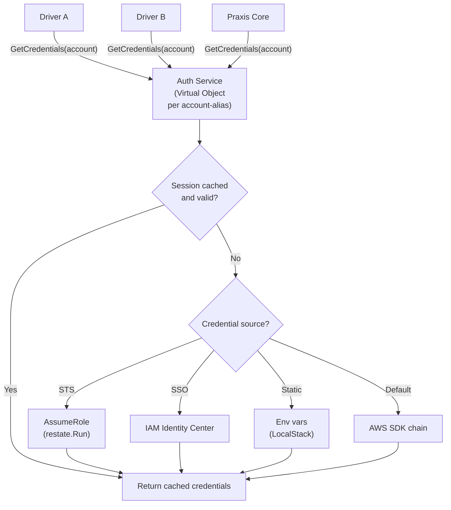
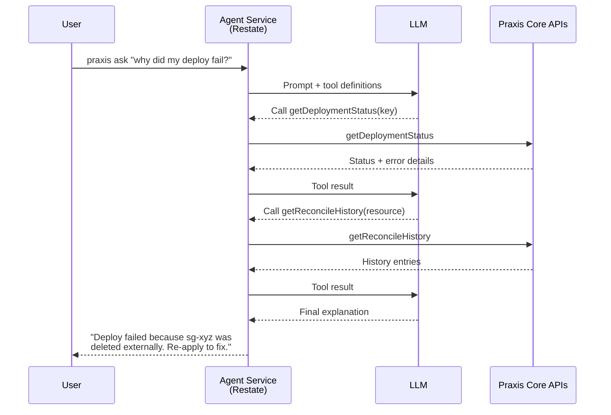
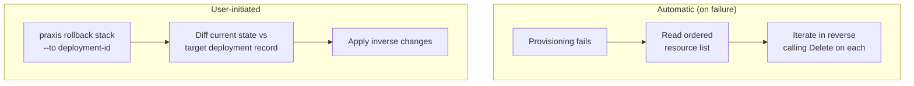

# FUTURE.md — Planned Features & Roadmap

> Features are listed roughly in priority order.
>
> This file tracks gaps and extensions beyond the current implementation. Already-shipped pieces such as the Restate command service, DAG-driven deployment orchestrator, built-in CLI, deployment state/index objects, deployment events stream, observe flow, and AWS SSM resolver are intentionally omitted.

---

## High-Priority AWS Driver Expansion

Extend the driver ecosystem to cover the top ~20% of AWS services by real-world usage (guided by Terraform AWS provider adoption). S3, Security Group, EC2, VPC, and AMI drivers already ship; the following represent the most commonly provisioned resource types and should be prioritized before niche or multi-cloud drivers.

**Drivers to implement (roughly by Terraform usage frequency):**

| # | Driver Service | Key Resource Types | Key Scope |
|---|---|---|---|
| 1 | **IAM** | Roles, policies, users, groups, instance profiles | Global (`roleName`) |
| 2 | **ELB** | ALBs, NLBs, target groups, listeners, listener rules | Region (`region~lbName`) |
| 3 | **Route 53** | Hosted zones, DNS records, health checks | Global (`hostedZoneId~recordName`) |
| 4 | **RDS** | DB instances, Aurora clusters, parameter groups, subnet groups | Region (`region~dbIdentifier`) |
| 5 | **Lambda** | Functions, layers, permissions, event source mappings | Region (`region~functionName`) |
| 6 | **CloudWatch** | Log groups, metric alarms, dashboards | Region (`region~resourceName`) |
| 7 | **ECS** | Clusters, services, task definitions | Region (`region~clusterName`) |
| 8 | **SNS** | Topics, subscriptions | Region (`region~topicName`) |
| 9 | **SQS** | Queues, queue policies | Region (`region~queueName`) |
| 10 | **DynamoDB** | Tables, global tables | Region (`region~tableName`) |
| 11 | **CloudFront** | Distributions, origin access controls | Global (`distributionId`) |
| 12 | **ACM** | Certificates, DNS validation records | Region (`region~certArn`) |
| 13 | **KMS** | Keys, aliases, key policies | Region (`region~keyAlias`) |
| 14 | **EKS** | Clusters, managed node groups, Fargate profiles | Region (`region~clusterName`) |
| 15 | **Secrets Manager** | Secrets, secret versions | Region (`region~secretName`) |
| 16 | **API Gateway** | REST APIs, HTTP APIs, stages, routes | Region (`region~apiId`) |
| 17 | **Auto Scaling** | Auto Scaling groups, scaling policies, launch configurations | Region (`region~asgName`) |

**Technical approach:** Each driver follows the established pattern — a Restate Virtual Object implementing the driver contract (`Provision`, `Delete`, `Plan`/drift detection, `Import`, `Reconcile`, `GetStatus`, `GetOutputs`). New drivers are added to the appropriate domain-grouped driver pack (`praxis-storage`, `praxis-network`, `praxis-compute`, etc.) via an additional `.Bind()` call in the pack's entry point, with a CUE validation schema under `schemas/aws/<service>/` and a typed adapter registered in the provider registry. Driver packs are deployed as containers and registered with Restate independently, preserving the existing loose-coupling model.

**Implementation order considerations:** IAM is foundational — almost every other resource depends on IAM roles. RDS and Lambda cover the bulk of compute workloads. ELB and Route 53 complete a typical web-application stack. The remaining services (ECS, EKS, DynamoDB, CloudFront, etc.) fill out the long tail of common infrastructure patterns. Prioritize based on what unblocks real-world compound templates — a practical first wave is IAM → RDS → Lambda → ELB → Route 53.

---

## Auth Service

Centralized AWS credential management as a Restate Virtual Object. Replaces the current model where each driver independently loads credentials via the default SDK chain. All AWS authentication — static credentials, IAM role assumption, cross-account STS sessions, and credential rotation — flows through a single service that vends short-lived, scoped credentials to drivers and Core components on demand.



**Technical approach:** A Restate Virtual Object keyed by account-alias (e.g. `prod-us`, `staging`, `shared-services`). Each key encapsulates the credential state for one AWS account/role pair. Drivers request credentials by calling `Auth.GetCredentials(accountAlias)` via Restate RPC; the service returns a cached STS session or assumes a fresh role if the session is expired or missing.

**Credential sources (priority order):**

1. **STS AssumeRole** — primary mode for production and multi-account. The Auth Service's own identity (IAM role on the container/task) assumes target roles configured per account-alias. Supports external ID and session policies for cross-account trust.
2. **IAM Identity Center (SSO)** — for developer workflows. The service exchanges SSO tokens for temporary role credentials.
3. **Static credentials** — dev/test only (LocalStack). `AWS_ACCESS_KEY_ID` / `AWS_SECRET_ACCESS_KEY` passed through as-is. The service detects `AWS_ENDPOINT_URL` and skips STS.
4. **Default SDK chain** — fallback. If no explicit source is configured, delegates to the standard AWS SDK credential chain (env vars → shared config → IMDS/ECS task role).

**Session management:** Credentials are cached in the Virtual Object's Restate-managed state with their expiry time. On each `GetCredentials` call, the service checks TTL and returns the cached session if it has ≥5 minutes remaining. Expired or near-expiry sessions trigger a new `AssumeRole` call wrapped in `restate.Run` for journaling. This eliminates redundant STS calls across concurrent driver invocations targeting the same account.

**Configuration model:** Account-alias → role mapping defined in a config file or environment:

```yaml
accounts:
  prod-us:
    role_arn: arn:aws:iam::123456789012:role/PraxisDriverRole
    region: us-east-1
    external_id: praxis-prod
  staging:
    role_arn: arn:aws:iam::987654321098:role/PraxisDriverRole
    region: us-west-2
  local:
    # No role_arn — uses static creds or default chain
    region: us-east-1
```

**Integration points:** The SSM Secret Resolver, all driver services, and future Core components call `Auth.GetCredentials` instead of loading `aws.Config` directly. For multi-account deployments, the Deployment Orchestrator passes the target account-alias to each driver invocation, and the driver uses it to fetch the correct credentials. This is the prerequisite that makes Multi-Account (see below) possible without per-driver credential plumbing.

---

## Notification Sinks & External Event Delivery

Build external delivery and fan-out on top of the existing internal deployment event stream.

**Technical approach:** Praxis already records deployment events and exposes them to the CLI via polling. The remaining work is a lightweight event bus within Core that forwards those events to pluggable sinks and broadens the event catalog where needed:

- **Webhooks** — POST JSON payloads to user-configured endpoints (Slack, PagerDuty, custom)
- **Structured Logging** — JSON log lines to stdout for ingestion by existing log pipelines (Datadog, CloudWatch, ELK)
- **CLI streaming enhancements** — richer filtering, watch mode, and higher-fidelity event payloads for existing `praxis observe`

Events follow a common envelope: `{type, resource, timestamp, deployment, payload}`.

---

## AI Agent Concierge

A bring-your-own-API AI assistant that is Praxis-aware. The agent understands Praxis concepts (stacks, resources, drivers, templates, drift) and can query internal APIs to gather state, explain what happened, suggest fixes, and perform actions on the user's behalf.

**Supported providers:** Ollama (local), OpenAI API, Claude API. Users configure their preferred provider and API key; Praxis routes requests accordingly.



**Technical approach:** A Restate service that wraps LLM API calls in durable execution. The agent is given tool definitions that map to Praxis Core's internal APIs — `getDeploymentStatus`, `listResources`, `getReconcileHistory`, `getDrift`, `explainDAG`, etc. On each user prompt, the agent calls the LLM with the tool schema; the LLM decides which tools to invoke; results are fed back for a final response. Ollama runs locally (no network), OpenAI and Claude are external API calls wrapped in `restate.Run` for journaling. The agent can be exposed via the CLI (`praxis ask "why did my last deploy fail?"`).

---

## Historical Revisions & Audit Trail

Extend the current deployment state and per-deployment event feed into an immutable historical record across generations and re-applies.

**Technical approach:** Praxis already stores current deployment state, resource status, and append-only deployment events. The missing layer is durable revision history: preserve every apply/delete generation with template version, input values, resolved DAG, per-resource result, timestamps, and triggering identity. Query it via `praxis history <stack>` or the API, and support `praxis diff <deployment-a> <deployment-b>` for comparing historical revisions.

---

## Dependency Visualization

Render the resource dependency DAG as a visual graph so users can understand provisioning order and debug dependency issues.

**Technical approach:** Export the DAG (computed from expression parsing) as DOT, Mermaid, or JSON. `praxis plan --graph` outputs a Mermaid diagram. Nodes show resource kind + name; edges show which output feeds which input.

---

## Multi-Stack References

Allow one deployment to reference the outputs of another deployment. A "networking" stack produces a VPC ID; an "application" stack consumes it.

**Technical approach:** Introduce a cross-stack reference syntax, e.g. `${ stacks["networking"].outputs["vpc"].vpcId }`. Core resolves these by querying the referenced deployment's stored outputs via `GetOutputs` on the Deployment Workflow. Requires that the referenced stack is already deployed and in a `Complete` state. Creates an implicit dependency edge between stacks for ordering during coordinated applies.

---

## Rollbacks

Revert a deployment to a previous known-good state when provisioning fails or on user request.



**Technical approach:** The Deployment Orchestrator already maintains the ordered list of provisioned resources. On failure, rollback iterates that list in reverse and calls `Delete` on each resource. For user-initiated rollbacks (`praxis rollback <stack> --to <deployment-id>`), Core diffs the current state against the target deployment record and applies the inverse changes. Deployment History provides the state snapshots needed for this.

---

## GitOps Integration

Watch a Git repository for template changes and automatically apply them.

**Technical approach:** Core exposes a webhook endpoint that receives push events from GitHub/GitLab. On change, Core pulls the repo, evaluates templates, computes a diff, and applies. Analogous to ArgoCD/Flux. Could also support a pull-based model with periodic polling.

---

## Kubernetes Integration

A Kubernetes driver service that manages Deployments, Services, and Ingresses in a target cluster.

**Technical approach:** A standard Restate Virtual Object driver that wraps the Kubernetes client-go SDK. Allows Praxis to orchestrate both cloud infrastructure and application deployment from a single composition — e.g. a compound template that provisions an RDS database and deploys a Kubernetes workload that connects to it.

---

## Multi-Cloud

Support for GCP and Azure as additional cloud providers.

**Technical approach:** The driver service model already supports this — each cloud provider is a set of independent driver services with their own container images and schemas. A GCP provider ships drivers for GCS, Cloud SQL, Compute Engine, etc. An Azure provider ships drivers for Blob Storage, Azure SQL, VMs, etc. v1 is AWS-only; this extends the provider ecosystem to other clouds.

---

## Multi-Account

Manage resources across multiple AWS accounts (or multiple GCP projects / Azure subscriptions) from a single Praxis instance.

**Technical approach:** Credential configuration per driver instance via IAM role assumption (AWS), service account impersonation (GCP), or managed identity (Azure). Templates specify the target account/project as a parameter. Core passes the credential context to the driver, which assumes the appropriate role before making API calls. Enables hub-and-spoke patterns where a central platform team manages infrastructure across many workload accounts.

---

## Additional Secret Backends

Extend beyond AWS SSM to support other secret stores.

**Technical approach:** Pluggable resolver interface behind the `ssm://` protocol. Add backends for AWS Secrets Manager, HashiCorp Vault, GCP Secret Manager, Azure Key Vault. Each backend implements a `Resolve(path) → value` interface. The URI scheme determines which backend handles the request (e.g. `vault:///secret/data/db-password`).

---

## Partial / Speculative Provisioning

Start provisioning long-running resources (e.g. RDS: 5–15 min) with a partial spec, then apply remaining fields as an in-place update after creation.

**Technical approach:** Extends the driver service contract with a two-phase model: `ProvisionPartial` (create with available fields) → await dependent outputs → `ProvisionUpdate` (apply remaining fields). Optimization for deployment speed; not needed until creation latency becomes a pain point.

---

## Central Rate Limit Advisor

Shared service that aggregates AWS API usage across all drivers and signals "slow down" when approaching account-level limits.

**Technical approach:** Drivers report API call counts to a central Virtual Object. The advisor tracks aggregate usage per API per account and returns throttle signals. Supplements per-driver rate limiting for high-scale deployments with many concurrent driver instances.
