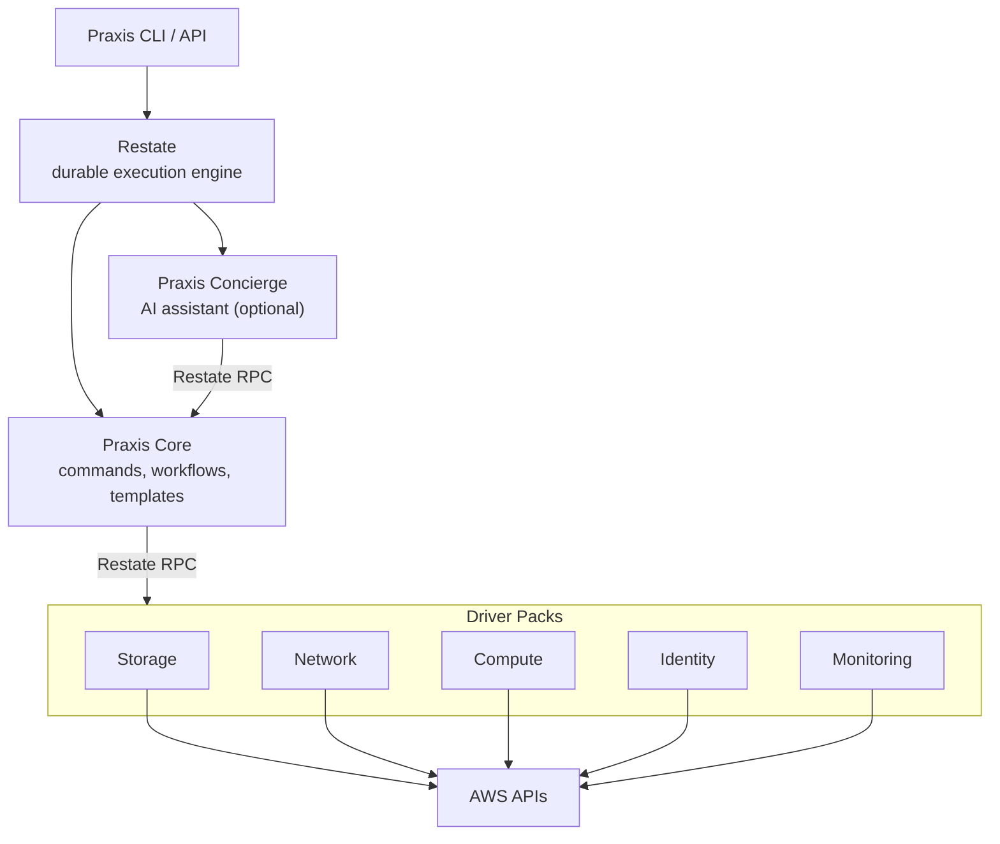

# Praxis

**Declarative infrastructure automation — without the cluster.**

[Why Praxis](#why-praxis) · [Get Started](#get-started) · [Docs](#documentation) · [Future](docs/FUTURE.md)

---

> Praxis is in alpha, with limited real world testing.

Praxis is a declarative infrastructure platform that manages cloud resources the way Kubernetes manages containers continuous reconciliation, drift correction, dependency-aware orchestration but without the overhead of a Kubernetes cluster to run it. Praxis itself can be run on Kubernetes if you already use it.

Powered by [Restate](https://restate.dev) for durable execution, Praxis models every cloud resource as a stateful Virtual Object with exactly-once lifecycle guarantees. Define what you want in [CUE](https://cuelang.org/) templates, and Praxis converges reality to match.

For a more detailed explanation of the idea and reasons behind Praxis see the [Praxis Architecture](docs/PRAXIS_ARCHITECTURE.md) document.



---

## Why Praxis

### The Problem

Managing cloud infrastructure today means choosing between extremes:

- **Terraform** gives you plan-and-apply but no continuous reconciliation, no drift correction, and state file contention at scale.
- **Crossplane** gives you Kubernetes-native reconciliation but requires operating a full cluster just to manage cloud resources.
- **CDK / Pulumi** give you real programming languages but the same imperative plan-apply model underneath.

None of them let you declare infrastructure, have it continuously converged, and run it all from a Docker Compose stack.

### What Praxis Does Differently

| | Terraform | Crossplane | Praxis |
| --- | --- | --- | --- |
| **Execution model** | Plan → Apply (imperative, manual) | Continuous reconciliation | Continuous reconciliation |
| **Runtime requirement** | CLI + state backend | Kubernetes cluster | Restate server (single binary) |
| **Drift detection** | Manual (`terraform plan`) | Automatic | Automatic |
| **Execution guarantee** | None (can leave partial state) | At-least-once | **Exactly-once** (journaled) |
| **Crash recovery** | Manual intervention | Controller restart + re-reconcile | Automatic journal replay |
| **Dependency resolution** | Provider-determined | Composition functions | DAG from output expressions |
| **Template language** | HCL | YAML + Compositions | CUE |
| **Extension model** | Go providers (complex SDK) | Go controllers (complex SDK) | Restate Virtual Objects (any language, no fork) |

### Key Capabilities

**Durable Execution.** Every AWS API call is journaled by Restate. If a driver crashes mid-provision, execution resumes from the journal — no duplicate calls, no partial state.

**Continuous Reconciliation.** Drivers automatically detect and correct configuration drift on a 5-minute interval using Restate's durable timers. No external cron, no polling infrastructure.

**Single-Writer Guarantee.** Each resource is a Restate Virtual Object with exclusive handler execution. No racing updates, no distributed locks, no optimistic concurrency conflicts.

**Dependency-Aware Orchestration.** Templates declare cross-resource dependencies via output expressions (`${resources.<name>.outputs.<field>}`). The orchestrator builds a DAG and dispatches resources with maximum parallelism as dependencies complete.

**Plan Before Apply.** Preview exactly what would change before committing — per-field diffs for every resource, just like `terraform plan`.

**Import Existing Resources.** Adopt cloud resources already running in your account. Praxis captures their current state as a baseline and begins managing or observing them.

**Data Sources.** Reference existing cloud resources in templates without managing them. A `data` block performs read-only lookups that inject outputs (VPC IDs, ARNs, CIDR blocks) into managed resource specs — no state stored, no lifecycle tracked.

**CUE Templates.** Platform teams define typed, validated templates in CUE. End users fill in variables. Output expressions wire resource outputs into downstream specs. Policy constraints enforce organizational standards via CUE unification.

**Lifecycle Protection.** Mark resources with `preventDestroy` to block accidental deletion, or `ignoreChanges` to let external systems co-manage specific fields without Praxis fighting for control.

**Lightweight Operations.** The entire stack runs in Docker Compose. No etcd, no API server, no cluster to maintain. Drivers are grouped by AWS domain into independent driver packs that register with Restate.

**Extensible Without Forking.** Praxis runs on [Restate](https://restate.dev), and Restate doesn't distinguish between built-in and external services. Write a custom driver in Python, TypeScript, Go, Java, Kotlin, or Rust from your own repository, register it with the same Restate instance, and it participates in DAG orchestration, output expression hydration, state tracking, and event streaming alongside built-in drivers. No plugin SDK, no fork, no code changes to Praxis. See the [Extending Guide](docs/EXTENDING.md).

---

## Get Started

Praxis runs anywhere Restate runs — a single Docker Compose stack on your laptop, a Kubernetes cluster, or fully managed on Restate Cloud. Pick the path that fits your situation.

### Local Development

The fastest way to try Praxis. Docker Compose brings up Moto (mock AWS), Restate, Praxis Core, and all driver packs.

#### Prerequisites

- [Docker](https://www.docker.com/) + Docker Compose
- [just](https://github.com/casey/just) (task runner)
- [Go](https://go.dev/) >= 1.25 (for building from source)

#### Start the Stack

```bash
git clone https://github.com/shirvan/praxis.git
cd praxis

# Create the operator environment file
cp .env.example .env

# Start Moto + Restate + Praxis Core + drivers, then register services
just up
```

#### Use the CLI

```bash
# Build the CLI
just build-cli

# --- Operator: register a template ---
praxis template register webapp.cue --description "Web application stack"
praxis template list
praxis template describe webapp

# --- User: deploy from a registered template ---
# Preview changes (dry-run)
praxis deploy webapp --account local --var env=dev --dry-run

# Deploy with variables
praxis deploy webapp --account local --var env=dev --key my-webapp --wait

# Deploy with a variables file
praxis deploy webapp --account local -f vars.json --key my-webapp --wait

# --- Common operations ---
praxis get Deployment/my-webapp          # Check deployment status
praxis list deployments                  # List all deployments
praxis observe Deployment/my-webapp      # Follow deployment events
praxis delete Deployment/my-webapp --yes --wait

# --- Operator: inline CUE (development/testing) ---
praxis plan webapp.cue --account local --var env=dev
praxis apply webapp.cue --account local --var env=dev --key my-webapp --wait
```

### Centralized Deployment (Kubernetes)

For team and production use, deploy Praxis on Kubernetes with the Helm chart published to GitHub Container Registry. The chart deploys all Praxis components and optionally bundles a Restate instance — or you can point to an external one (like [Restate Cloud](https://restate.dev/cloud/)).

```bash
# Deploy with bundled Restate
helm install praxis oci://ghcr.io/shirvan/charts/praxis \
  --namespace praxis-system --create-namespace

# Or deploy against Restate Cloud (no bundled Restate)
helm install praxis oci://ghcr.io/shirvan/charts/praxis \
  --namespace praxis-system --create-namespace \
  --set restate.enabled=false \
  --set restate.external.ingressUrl=https://<env>.dev.restate.cloud:8080 \
  --set restate.external.adminUrl=https://<env>.dev.restate.cloud:9070

# Wait for readiness
kubectl -n praxis-system wait --for=condition=ready pod \
  -l app.kubernetes.io/part-of=praxis --timeout=120s

# (Optional) Enable autoscaling for driver packs
helm upgrade praxis oci://ghcr.io/shirvan/charts/praxis \
  --namespace praxis-system \
  --set drivers.network.autoscaling.enabled=true \
  --set drivers.compute.autoscaling.enabled=true
```

Service registration with Restate is handled automatically by a post-install hook. Raw YAML manifests (without Helm) are available in [`examples/ops/k8s/`](examples/ops/k8s/) for environments where Helm is not an option.

#### Production Readiness

Restate is built for production workloads:

- **State & log backups** — Self-hosted Restate stores its log and state snapshots in S3 (or S3-compatible storage) for durable backup and recovery.
- **High availability** — Multi-node Restate clusters with replicated log storage for fault tolerance.
- **Restate Cloud** — Fully managed HA with zero infrastructure overhead.

See the [Operator Guide](docs/OPERATORS.md) for Praxis-specific deployment, configuration, and monitoring details. See the [Restate documentation](https://docs.restate.dev/category/restate-server) for Restate server configuration, HA setup, and backup strategies.

### Talk to Praxis

Praxis offers three ways to interact — pick what fits your workflow.

#### CLI

The `praxis` binary is the primary interface. Every command goes through the Restate ingress endpoint.

```bash
praxis deploy webapp --account prod --var env=staging --key my-webapp --wait
praxis get Deployment/my-webapp
praxis plan webapp.cue --account prod --var env=prod
```

See the [CLI Reference](docs/CLI.md) for the full command set.

#### API

Everything the CLI does is an HTTP call to the Restate ingress. Integrate Praxis into CI/CD pipelines, scripts, or internal tools directly:

```bash
curl -X POST http://localhost:8080/PraxisCommandService/Apply \
  -H 'content-type: application/json' \
  -d '{"template": "webapp", "account": "prod", "variables": {"env": "staging"}}'
```

#### Concierge (AI Assistant)

The Concierge is an optional AI-powered interface that understands Praxis concepts. Ask questions in natural language, trigger deployments, debug failures, or migrate Terraform/CloudFormation/Crossplane templates to CUE — all through conversation.

```bash
# Natural language on the root command
praxis "why did my deploy fail?"
praxis "convert this terraform to praxis" --file main.tf
praxis "deploy the orders API to staging"

# Or explicitly
praxis concierge ask "show me what would change if I update the VPC CIDR"
```

The Concierge runs as a separate container (`praxis-concierge`). Bring your own LLM — it supports OpenAI-compatible APIs (OpenAI, Ollama, Together, Groq, Azure OpenAI) and Anthropic Claude. Destructive actions require explicit human approval before executing.

For Slack teams, the [Slack Gateway](docs/SLACK_GATEWAY.md) connects the Concierge as a bot user — DM conversations, event-watch threads with AI-powered analysis, and approval buttons.

See the [Concierge documentation](docs/CONCIERGE.md) for setup and capabilities.

### Plan Output

```text
Praxis will perform the following actions:

  # S3Bucket "my-bucket" will be updated in-place
  ~ resource "S3Bucket" "my-bucket" {
      ~ spec.versioning: false -> true
      ~ tags.env: "staging" -> "prod"
    }

Plan: 0 to create, 1 to update, 0 to delete, 2 unchanged.
```

---

## AWS Coverage

45 drivers across five domains:

| Domain | Resources |
|--------|-----------|
| **Network** (18) | VPC, Security Group, Subnet, Route Table, Internet Gateway, NAT Gateway, Network ACL, Elastic IP, VPC Peering, Hosted Zone, DNS Record, Health Check, ALB, NLB, Target Group, Listener, Listener Rule, ACM Certificate |
| **Compute** (9) | EC2 Instance, AMI, Key Pair, Lambda Function, Lambda Layer, Lambda Permission, Event Source Mapping, ECR Repository, ECR Lifecycle Policy |
| **Storage** (10) | S3 Bucket, EBS Volume, RDS Instance, DB Subnet Group, DB Parameter Group, Aurora Cluster, SNS Topic, SNS Subscription, SQS Queue, SQS Queue Policy |
| **Identity** (5) | IAM Role, IAM Policy, IAM User, IAM Group, IAM Instance Profile |
| **Monitoring** (3) | Log Group, Metric Alarm, Dashboard |

### Limitations

- **AWS only.** No GCP, Azure, or other cloud providers yet.
- **No cross-stack references.** One deployment cannot reference the outputs of another deployment yet.
- **No automatic rollback.** Failed deployments stop and report — they don't automatically revert completed resources.

See [FUTURE.md](docs/FUTURE.md) for what's coming next and [`examples/`](examples/) for ready-to-use templates.

---

## Documentation

| Document | Audience | Description |
| ---------- | ---------- | ------------- |
| [Architecture](docs/PRAXIS_ARCHITECTURE.md) | Everyone | How Praxis works — Restate-powered core, modular drivers, design tradeoffs |
| [Drivers](docs/DRIVERS.md) | Contributors | Driver model, contract, state management, reconciliation, building new drivers |
| [Orchestrator](docs/ORCHESTRATOR.md) | Contributors | Deployment workflows, DAG scheduling, state lifecycle, delete flow |
| [Templates](docs/TEMPLATES.md) | Platform Engineers | CUE template system, expression evaluation, registry, policy enforcement, data sources |
| [Auth & Workspaces](docs/AUTH.md) | Everyone | Credential management, workspace isolation, account selection |
| [CLI Reference](docs/CLI.md) | Users | All commands, output formats, styled terminal output, timeouts |
| [Operator Guide](docs/OPERATORS.md) | Operators | Deployment, configuration, registration, monitoring, troubleshooting |
| [Error Handling](docs/ERRORS.md) | Contributors | Error classification, status codes, error codes |
| [Events](docs/EVENTS.md) | Contributors | CloudEvents event bus, event types, sinks, event store |
| [Developer Guide](docs/DEVELOPERS.md) | Contributors | Building, testing, project structure, contributing |
| [Concierge](docs/CONCIERGE.md) | Contributors | AI assistant — LLM integration, tool framework, migration, approval flow |
| [Slack Gateway](docs/SLACK_GATEWAY.md) | Contributors | Slack integration — DM conversations, event-watch threads, approval buttons |
| [Extending Praxis](docs/EXTENDING.md) | Contributors | Build custom drivers in any language without forking — extension contract, Python example, deployment patterns |

---

## Contributing

Praxis is Apache 2.0 licensed. See [LICENSE](LICENSE).

If you are interested in becoming a contributor, contact me via email.

See [docs/DEVELOPERS.md](docs/DEVELOPERS.md) for building, testing.

## License

Copyright 2026 Shirvan. Licensed under the Apache License, Version 2.0.
