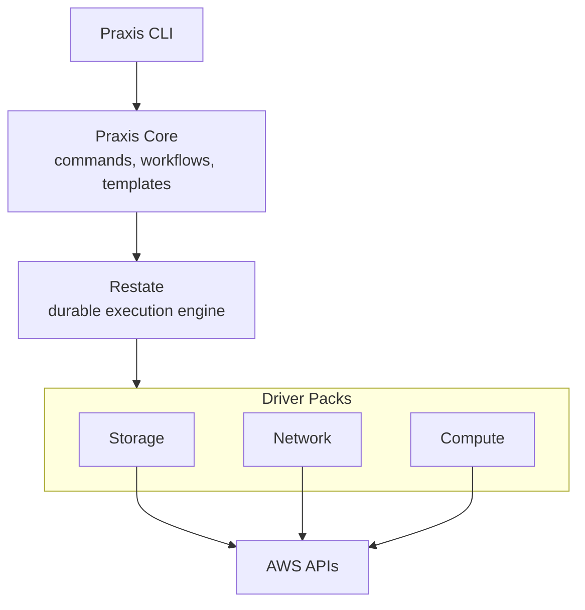

# Praxis

**Declarative infrastructure automation — without the cluster.**

[Why Praxis](#why-praxis) · [Quickstart](#quickstart) · [Docs](#documentation) · [Roadmap](FUTURE.md)

---

## >>> Praxis is very much in active development and not ready for any sort of real world use. <<<

Praxis is a declarative infrastructure platform that manages cloud resources the way Kubernetes manages containers — continuous reconciliation, drift correction, dependency-aware orchestration — but **without requiring a Kubernetes cluster to run it**.

Powered by [Restate](https://restate.dev) for durable execution, Praxis models every cloud resource as a stateful Virtual Object with exactly-once lifecycle guarantees. Define what you want in [CUE](https://cuelang.org/) templates, and Praxis converges reality to match.



---

## Why Praxis

### The Problem

Managing cloud infrastructure today means choosing between extremes:

- **Terraform** gives you plan-and-apply but no continuous reconciliation, no drift correction, and state file contention at scale.
- **Crossplane** gives you Kubernetes-native reconciliation but requires operating a full cluster just to manage cloud resources.
- **CDK / Pulumi** give you real programming languages but the same imperative plan-apply model underneath.

None of them let you declare infrastructure, have it continuously converged, and run it all from a Docker Compose stack.

### What Praxis Does Differently

| | Terraform | Crossplane | Praxis |
| --- | --- | --- | --- |
| **Execution model** | Plan → Apply (imperative, manual) | Continuous reconciliation | Continuous reconciliation |
| **Runtime requirement** | CLI + state backend | Kubernetes cluster | Restate server (single binary) |
| **Drift detection** | Manual (`terraform plan`) | Automatic | Automatic |
| **Execution guarantee** | None (can leave partial state) | At-least-once | **Exactly-once** (journaled) |
| **Crash recovery** | Manual intervention | Controller restart + re-reconcile | Automatic journal replay |
| **Dependency resolution** | Provider-determined | Composition functions | DAG from output expressions |
| **Template language** | HCL | YAML + Compositions | CUE |
| **Extension model** | Go providers (complex SDK) | Go controllers (complex SDK) | Restate Virtual Objects (simple handler interface) |

### Key Capabilities

**Durable Execution.** Every AWS API call is journaled by Restate. If a driver crashes mid-provision, execution resumes from the journal — no duplicate calls, no partial state.

**Continuous Reconciliation.** Drivers automatically detect and correct configuration drift on a 5-minute interval using Restate's durable timers. No external cron, no polling infrastructure.

**Single-Writer Guarantee.** Each resource is a Restate Virtual Object with exclusive handler execution. No racing updates, no distributed locks, no optimistic concurrency conflicts.

**Dependency-Aware Orchestration.** Templates declare cross-resource dependencies via output expressions (`${resources.<name>.outputs.<field>}`). The orchestrator builds a DAG and dispatches resources with maximum parallelism as dependencies complete.

**Plan Before Apply.** Preview exactly what would change before committing — per-field diffs for every resource, just like `terraform plan`.

**Import Existing Resources.** Adopt cloud resources already running in your account. Praxis captures their current state as a baseline and begins managing or observing them.

**CUE Templates.** Platform teams define typed, validated templates in CUE. End users fill in variables. Output expressions wire resource outputs into downstream specs. Policy constraints enforce organizational standards via CUE unification.

**Lightweight Operations.** The entire stack runs in Docker Compose. No etcd, no API server, no cluster to maintain. Drivers are grouped by AWS domain into independent driver packs that register with Restate.

---

## Quickstart

### Prerequisites

- [Docker](https://www.docker.com/) + Docker Compose
- [just](https://github.com/casey/just) (task runner)
- [Go](https://go.dev/) >= 1.24 (for building from source)

### Start the Stack

```bash
git clone https://github.com/praxiscloud/praxis.git
cd praxis

# Create the operator environment file
cp .env.example .env

# Start LocalStack + Restate + Praxis Core + drivers, then register services
just up
```

### Use the CLI

```bash
# Build the CLI
just build-cli

# --- Operator: register a template ---
praxis template register webapp.cue --description "Web application stack"
praxis template list
praxis template describe webapp

# --- User: deploy from a registered template ---
# Preview changes (dry-run)
praxis deploy webapp --account local --var env=dev --dry-run

# Deploy with variables
praxis deploy webapp --account local --var env=dev --key my-webapp --wait

# Deploy with a variables file
praxis deploy webapp --account local -f vars.json --key my-webapp --wait

# --- Common operations ---
# Check deployment status
praxis get Deployment/my-webapp

# List all deployments
praxis list deployments

# Stream deployment events in real time
praxis observe Deployment/my-webapp

# Import an existing S3 bucket
praxis import S3Bucket --account local --id my-existing-bucket --region us-east-1

# Delete a deployment
praxis delete Deployment/my-webapp --yes --wait

# --- Operator: inline CUE (development/testing) ---
praxis plan webapp.cue --account local --var env=dev
praxis apply webapp.cue --account local --var env=dev --key my-webapp --wait
```

### Plan Output

```text
Praxis will perform the following actions:

  # S3Bucket "my-bucket" will be updated in-place
  ~ resource "S3Bucket" "my-bucket" {
      ~ spec.versioning: false -> true
      ~ tags.env: "staging" -> "prod"
    }

Plan: 0 to create, 1 to update, 0 to delete, 2 unchanged.
```

---

## Current Scope (0.1.0)

- **Cloud:** AWS
- **Drivers:** S3 Bucket, Security Group, EC2 Instance, VPC, Elastic IP, AMI, EBS Volume
- **Accounts:** One operator-defined account per deployed stack
- **Deployment:** Docker Compose reference stack (LocalStack for local dev)
- **Templates:** CUE schemas with output expressions, template registry with variable schema extraction, policy enforcement
- **CLI:** `deploy`, `template`, `apply`, `plan`, `get`, `list`, `observe`, `import`, `delete`

See [FUTURE.md](FUTURE.md) for the roadmap and [`examples/`](examples/) for ready-to-use templates.

---

## Documentation

| Document | Audience | Description |
| ---------- | ---------- | ------------- |
| [Architecture](docs/ARCHITECTURE.md) | Everyone | How Praxis works — Restate-powered core, modular drivers, design tradeoffs |
| [Drivers](docs/DRIVERS.md) | Contributors | Driver model, contract, state management, reconciliation, building new drivers |
| [Orchestrator](docs/ORCHESTRATOR.md) | Contributors | Deployment workflows, DAG scheduling, state lifecycle, delete flow |
| [Templates](docs/TEMPLATES.md) | Platform Engineers | CUE template system, expression evaluation, registry, policy enforcement |
| [CLI Reference](docs/CLI.md) | Users | All commands, account selection, output formats, timeouts |
| [Operator Guide](docs/OPERATORS.md) | Operators | Deployment, configuration, registration, monitoring, troubleshooting |
| [Developer Guide](docs/DEVELOPERS.md) | Contributors | Building, testing, project structure, contributing |

---

## Contributing

Praxis is Apache 2.0 licensed. See [LICENSE](LICENSE).

See [docs/DEVELOPERS.md](docs/DEVELOPERS.md) for building, testing, and contributing.

## License

Copyright 2025 The Praxis Authors. Licensed under the Apache License, Version 2.0.
