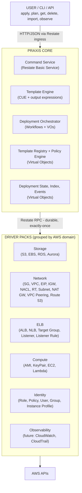
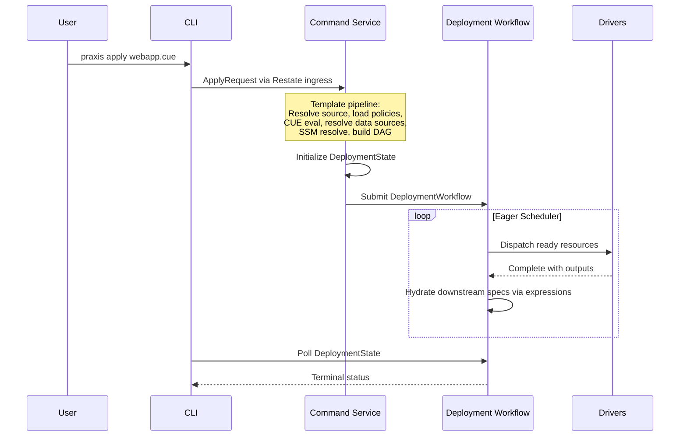
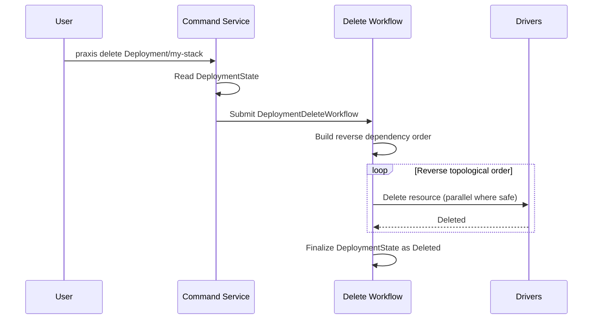
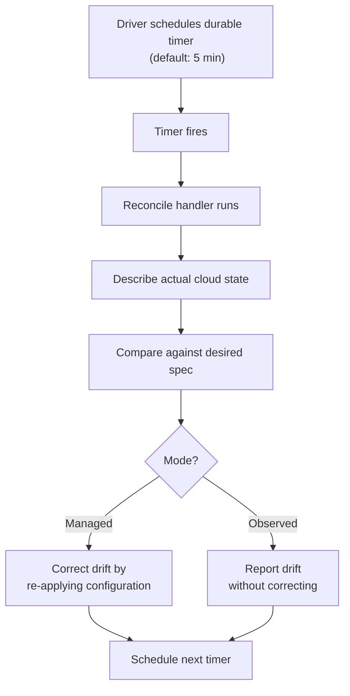
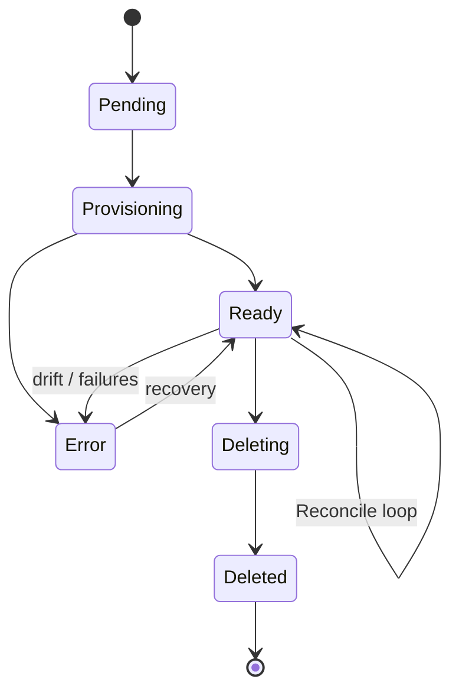

# Praxis Architecture

> **See also:** [Drivers](DRIVERS.md) | [Orchestrator](ORCHESTRATOR.md) | [Templates](TEMPLATES.md) | [Events](EVENTS.md) | [Auth](AUTH.md) | [Errors](ERRORS.md) | [CLI](CLI.md) | [Operators](OPERATORS.md) | [Developers](DEVELOPERS.md)

---

## Overview

Praxis is a declarative infrastructure automation platform that manages cloud resources through continuous reconciliation. It draws inspiration from Kubernetes controllers and Crossplane — declare what you want, and the system converges to make it so — but replaces the Kubernetes control plane with [Restate](https://restate.dev), a durable execution engine.

The result: a system with the same reconciliation semantics (drift detection, self-healing, dependency-aware orchestration) that runs as a set of lightweight services in Docker Compose instead of requiring a full cluster.

---

## System Architecture



---

## Components

### Restate — The Execution Engine

Restate is the backbone that makes everything work. It provides:

- **Durable execution** — every operation is journaled. If a service crashes mid-call, Restate replays the journal from the last checkpoint without re-executing completed steps.
- **Virtual Objects** — stateful, key-addressable entities with exclusive (single-writer) and shared (concurrent-read) handler modes. Each cloud resource is one Virtual Object.
- **Built-in K/V state** — each Virtual Object has its own key-value store, eliminating the need for an external database.
- **Durable timers** — survive process restarts. Used for reconciliation scheduling.
- **Exactly-once RPC** — service-to-service calls are journaled and deduplicated.

Praxis does not use Restate as a simple message broker. It uses Restate as the **runtime** — state storage, concurrency control, crash recovery, and inter-service communication all flow through it.

### Praxis Core

The central coordination service. It hosts:

- **Command Service** — a Restate Basic Service that receives user commands (apply, plan, delete, import) and orchestrates the response. Evaluates templates, resolves data source lookups, builds dependency graphs, and submits deployment workflows.
- **Template Engine** — validates and evaluates CUE templates, resolves output expressions, enforces policy constraints, and resolves SSM secret references. Extracts data source definitions from the `data` block for read-only lookups of existing resources (see [Templates — Data Sources](TEMPLATES.md#data-sources)).
- **Deployment Orchestrator** — Restate Workflows that execute apply and delete operations. The scheduler dispatches resources in dependency order with maximum parallelism.
- **Template Registry** — a Virtual Object that stores registered templates with metadata, digest tracking, and shallow rollback.
- **Policy Registry** — a Virtual Object that stores CUE-based policy constraints scoped globally or per template.
- **Deployment State / Index / Events** — Virtual Objects that persist deployment lifecycle state, provide listing indexes, and record event streams.

Core runs as a single container. All its Restate services register under one deployment endpoint.

### Driver Packs

Drivers are grouped by AWS domain into **driver packs** — each pack is a single container hosting multiple related Restate Virtual Objects. The Restate SDK supports binding multiple Virtual Objects to one server via chained `.Bind()` calls:

```go
srv := server.NewRestate().
    Bind(restate.Reflect(eip.NewElasticIPDriver(auth))).
    Bind(restate.Reflect(igw.NewIGWDriver(auth))).
    Bind(restate.Reflect(natgw.NewNATGatewayDriver(auth))).
    Bind(restate.Reflect(nacl.NewNetworkACLDriver(auth))).
    Bind(restate.Reflect(routetable.NewRouteTableDriver(auth))).
    Bind(restate.Reflect(sg.NewSecurityGroupDriver(auth))).
    Bind(restate.Reflect(subnet.NewSubnetDriver(auth))).
    Bind(restate.Reflect(vpcpeering.NewVPCPeeringDriver(auth))).
    Bind(restate.Reflect(vpc.NewVPCDriver(auth)))
```

| Pack | Container | Drivers | Rationale |
| --- | --- | --- | --- |
| **Storage** | `praxis-storage` | S3, EBS, RDSInstance, DBSubnetGroup, DBParameterGroup, AuroraCluster | Data stores and databases |
| **Network** | `praxis-network` | SecurityGroup, VPC, ElasticIP, InternetGateway, NetworkACL, RouteTable, Subnet, NATGateway, VPCPeering, Route53HostedZone, DNSRecord, HealthCheck, ALB, NLB, TargetGroup, Listener, ListenerRule | Networking and load balancing — VPC+SG+DNS+ELB almost always deploy together |
| **Compute** | `praxis-compute` | AMI, KeyPair, EC2, Lambda, LambdaLayer, LambdaPermission, EventSourceMapping | Compute lifecycle |
| **Identity** | `praxis-identity` | IAMRole, IAMPolicy, IAMUser, IAMGroup, IAMInstanceProfile | Security-sensitive, low churn |
| **Monitoring** | `praxis-monitoring` | LogGroup, MetricAlarm, Dashboard | CloudWatch log groups, metric alarms, and dashboards — optional, many users skip it |

Each driver within a pack:

- Implements a standard handler contract: `Provision`, `Import`, `Delete`, `Reconcile`, `GetStatus`, `GetOutputs`
- Stores all resource state in Restate's built-in K/V store
- Handles its own rate limiting for AWS API calls
- Has zero knowledge of other drivers, dependency graphs, or deployments

Grouping by domain provides meaningful selectivity (don't need networking? don't run `praxis-network`) while keeping the system operationally manageable as the driver count grows. Restate doesn't care which container serves a Virtual Object — it routes by service name, not endpoint. Moving a driver between packs is a deployment-time decision, not a code change.

### CLI

The `praxis` CLI is a standalone Go binary built with Cobra. It talks directly to Restate's ingress HTTP API — there is no dedicated Praxis API server. Write commands (`apply`, `plan`, `delete`, `import`) route to the Command Service. Read commands (`get`, `list`, `observe`) query Virtual Objects directly.

---

## Design Tradeoffs

### Why Restate Instead of Kubernetes

Kubernetes provides reconciliation, state management, and scheduling — but it requires operating a cluster (etcd, API server, controller manager, scheduler). For teams that already run Kubernetes, Crossplane is a natural choice. For teams that don't — or that want infrastructure management without cluster overhead — Praxis offers the same reconciliation model on a simpler runtime.

Restate gives Praxis the properties typically associated with Kubernetes controllers:

- **State management** → Virtual Object K/V store (vs etcd)
- **Single-writer per resource** → Exclusive handlers (vs controller leader election)
- **Crash recovery** → Journal replay (vs controller restart + re-list)
- **Periodic reconciliation** → Durable timers (vs informer watches + work queues)

The tradeoff: Restate is a younger project than Kubernetes with a smaller ecosystem. Praxis bets that for the infrastructure management use case, the simplicity advantage outweighs the ecosystem breadth.

### Why CUE Instead of HCL or YAML

CUE merges types, constraints, defaults, and values into a single lattice. A CUE schema is also a validator, a default provider, and a composition target — all in one language. This means platform teams can define rich, validated templates that end users fill in without learning the full language.

Cross-resource references use a simple `${resources.<name>.outputs.<field>}` syntax that the orchestrator resolves at dispatch time as outputs become available. No external expression language is needed — the dot-path format maps directly to the output data structure.

The tradeoff: CUE has a steeper learning curve than YAML. Praxis mitigates this by having platform teams write CUE templates while end users mostly interact through CLI variables and pre-registered templates.

### Why Centralized Orchestration

Praxis uses a centralized orchestrator in Core rather than distributed choreography between drivers. Core resolves the dependency graph, dispatches resources, collects outputs, and manages the deployment lifecycle.

Benefits:

- Drivers stay simple — they implement CRUD and know nothing about dependencies
- Deployment state lives in one place for consistent observability
- Failure handling is centralized — skip dependents, report clear errors
- Rollback has a single coordination point

Tradeoff: Core is a coordination bottleneck. Every deployment flows through it. This is acceptable at Praxis's current scale and simplifies the system significantly.

### Why Virtual Objects for Resources

Instead of a single driver service managing all instances of a resource type through a shared database, each resource instance is its own Virtual Object keyed by a natural identifier (e.g., `my-bucket` for S3).

Benefits:

- **Single-writer guarantee** — no distributed locking needed
- **Built-in state** — no external database to operate
- **Natural addressing** — `S3Bucket/my-bucket` maps directly to a Virtual Object key
- **Stateless services** — driver containers hold no state; Restate holds it all. Scale horizontally, restart freely.

Tradeoff: state lives in Restate's storage layer, not a traditional database. Restate supports S3-backed snapshots for disaster recovery.

### Why Domain-Grouped Driver Packs

Instead of one container per resource type (which would mean 18+ containers at full AWS coverage) or a single monolithic driver process, Praxis groups drivers by AWS domain into a handful of **driver packs**. Each pack is a container hosting related Virtual Objects.

Benefits:

- **Scaling aligns with reality** — if someone is churning EC2 instances, they're probably also churning Auto Scaling groups and Lambda functions. Scale the compute pack, not five separate containers.
- **Blast radius is contained** — a panic in the VPC driver doesn't take down S3. The grouping follows natural AWS API boundaries.
- **Restate doesn't care** — Virtual Object keys are globally unique within Restate regardless of which endpoint serves them. The orchestrator dispatches by service name (e.g., `"EC2Instance"`), not by container.
- **Operations stay manageable** — 5–6 services instead of 20+. Docker Compose stays readable, health checks stay simple.
- **Users still pick and choose** — don't need networking? Don't run `praxis-network`. Nobody runs SG without VPC anyway.

The driver code itself remains fully modular — each driver is its own Go package with its own types, AWS wrapper, and drift detection. Only the binary entry points group them together.

Tradeoff: a bug in one driver within a pack affects all drivers in that pack. This is acceptable because drivers in the same domain share AWS SDK clients and failure patterns — a networking API outage affects all networking drivers regardless of deployment topology.

---

## Data Flow

### Apply (Provision)



### Plan (Dry-Run)

Same as Apply through step 3, then diffs each resource spec against the driver's current state to produce a per-field change summary. No workflow is submitted.

### Delete



### Reconcile



---

## Resource Lifecycle



| Status | Description |
| --- | --- |
| `Pending` | Declared but not yet provisioned |
| `Provisioning` | Provision handler is executing |
| `Ready` | Exists and matches desired state |
| `Error` | Provision or reconciliation failed — check the error field |
| `Deleting` | Delete handler is executing |
| `Deleted` | Removed (tombstone preserved for status queries) |

### Resource Modes

| Mode | Behavior |
| --- | --- |
| **Managed** | Full lifecycle — provision, reconcile, correct drift, delete |
| **Observed** | Import-only — detect and report drift but never modify the resource |

### Lifecycle Rules

Resources can declare **lifecycle rules** — protective policies that gate dangerous transitions:

- **`preventDestroy`** — If `true`, the orchestrator refuses to delete the resource. Any delete operation fails terminally until the rule is removed from the template and re-applied.
- **`ignoreChanges`** — A list of spec field paths to ignore during plan diff and reconciliation. Drift in these fields is not corrected, allowing external systems to co-manage specific fields.

Lifecycle rules are declared in the template's `lifecycle` block, validated during CUE evaluation, and enforced by the orchestrator and plan diff engine. They do not alter the resource state machine — they add protective gates around the `Ready → Deleting` transition and the drift correction path. See [Templates — Lifecycle Rules](TEMPLATES.md#lifecycle-rules) for syntax.

---

## What Praxis Is Not

- **Not a Kubernetes replacement.** Praxis manages cloud infrastructure resources, not container workloads.
- **Not a CI/CD pipeline.** Praxis is the target of a pipeline, not the pipeline itself.
- **Not multi-cloud (yet).** 0.1.0 targets AWS only. The driver model supports multi-cloud — the architecture is ready, the implementations are not.
- **Not multi-tenant.** The 0.1.0 trust model is operator-managed. There is no built-in auth or RBAC.

---

## Further Reading

- [Drivers](DRIVERS.md) — how drivers work, how to build one
- [Orchestrator](ORCHESTRATOR.md) — deployment workflows, DAG scheduling, state management
- [Templates](TEMPLATES.md) — CUE template system, registry, policies
- [Auth](AUTH.md) — credential management, workspaces, account selection
- [Errors](ERRORS.md) — error handling, classification, status codes, error codes
- [CLI](CLI.md) — command reference and usage patterns
- [Operators](OPERATORS.md) — deployment, configuration, monitoring
- [Developers](DEVELOPERS.md) — building, testing, contributing
