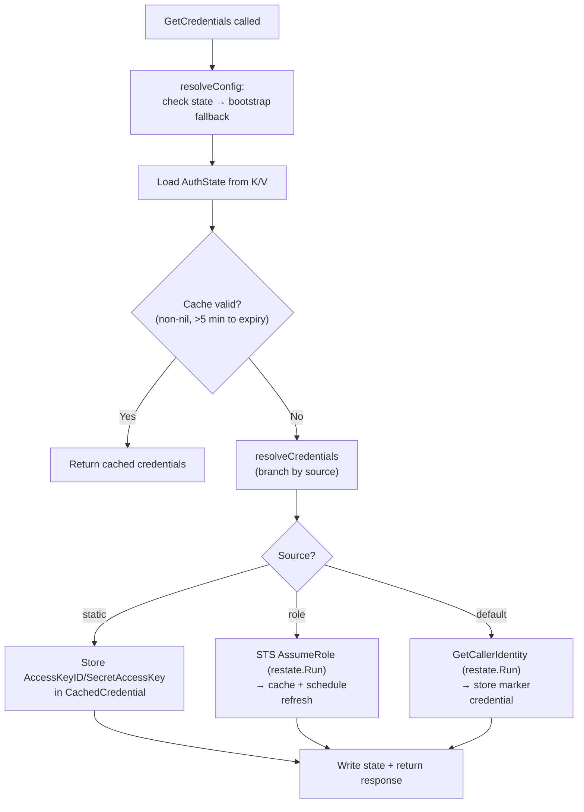
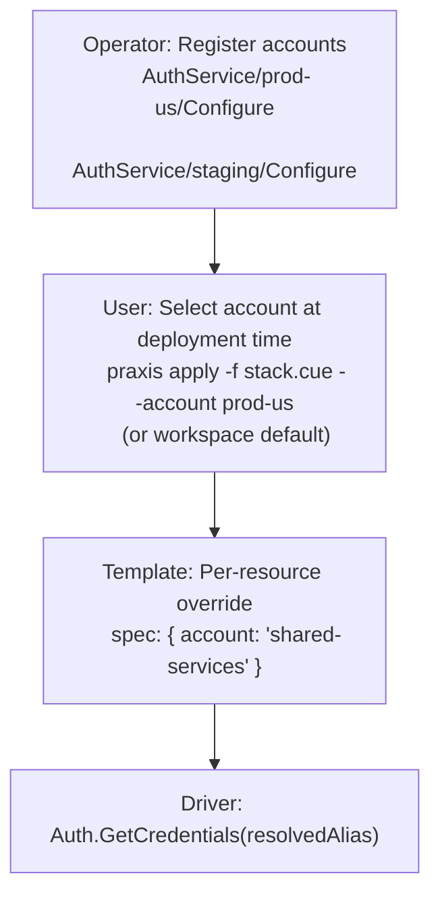
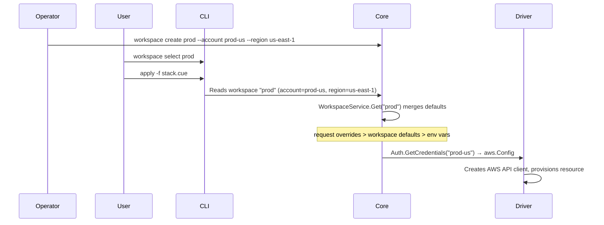

# Auth & Workspaces

---

## Overview

Praxis centralizes AWS credential management and environment isolation through two co-dependent Restate Virtual Object services:

1. **Auth Service** — Manages the lifecycle of AWS credentials for all driver packs and Core components. One Virtual Object per **account-alias** (e.g., `prod-us`, `staging`, `localstack`). Drivers call `Auth.GetCredentials` via Restate RPC instead of loading credentials independently.

2. **Workspace Service** — Named environment contexts that bind deployments with shared defaults (account alias, region, variable overrides). One Virtual Object per **workspace name** (e.g., `dev`, `staging`, `prod`). Operators define workspaces; users select one before deploying. Deployed resources are tagged with their workspace for filtering and isolation.

These two services are co-dependent: the Auth Service provides the runtime registry of account aliases; the Workspace Service binds those aliases to named environments. Together they give operators full account management and environment isolation without config files on disk.

---

## Auth Service

### Service Contract

The Auth Service is a Restate Virtual Object keyed by account-alias. It is registered in [cmd/praxis-core/main.go](../cmd/praxis-core/main.go) and bound to the Core runtime. The virtual object name is `AuthService`.

| Handler | Context | Purpose |
|---|---|---|
| `GetCredentials` | `ObjectContext` (exclusive) | Return cached or fresh AWS credentials |
| `RefreshCredentials` | `ObjectContext` (exclusive) | Force-refresh credentials (ignore cache) |
| `GetStatus` | `ObjectSharedContext` (shared) | Return credential status (valid, expiry, source) |
| `Configure` | `ObjectContext` (exclusive) | Update account configuration at runtime |

### Why a Virtual Object

- **Per-account state**: Each account-alias key stores its own cached session, expiry time, and configuration. Restate's K/V state eliminates the need for an external cache.
- **Exclusive access**: `GetCredentials` uses `ObjectContext` (exclusive) to prevent concurrent refresh races. Two drivers requesting credentials for the same account simultaneously are serialized — one refreshes, the other gets the cached result.
- **Durable timers**: Near-expiry sessions schedule a proactive refresh via a Restate delayed message, ensuring fresh credentials are always ready.

### Credential Sources

The Auth Service supports three credential sources, resolved in the `resolveCredentials` method:

| Source | When Used | Caching | Refresh |
|---|---|---|---|
| `static` | Dev/test (LocalStack). Direct `AccessKeyID`/`SecretAccessKey` | Cached indefinitely (no expiry) | None |
| `role` | Production, multi-account. STS AssumeRole with target role ARN | Cached until 5 min before expiry | Proactive refresh 10 min before expiry via durable timer |
| `default` | Fallback. Delegates to the standard AWS SDK credential chain (env vars → shared config → IMDS/ECS task role) | Cached indefinitely (SDK manages its own refresh) | None (SDK-managed) |

### State Model

All Auth Service state is stored per Virtual Object key under the Restate K/V key `"state"`:

```go
// internal/core/authservice/types.go
type AuthState struct {
    Config           AccountConfig     `json:"config"`
    CachedCredential *CachedCredential `json:"cachedCredential,omitempty"`
    LastRefresh      string            `json:"lastRefresh,omitempty"`
    RefreshScheduled bool              `json:"refreshScheduled"`
    Error            string            `json:"error,omitempty"`
}

type CachedCredential struct {
    AccessKeyID     string `json:"accessKeyId"`
    SecretAccessKey string `json:"secretAccessKey"`
    SessionToken    string `json:"sessionToken,omitempty"`
    ExpiresAt       string `json:"expiresAt,omitempty"`
}
```

### GetCredentials Flow



Key properties:

- **Cache-first** — if a valid cached credential exists (non-nil, >5 min until expiry), it is returned immediately without any AWS API call.
- **Crash-safe** — STS calls are wrapped in `restate.Run()`, journaled by Restate. On replay, completed calls return their journaled result.
- **Proactive refresh** — for `role` sources, a durable timer schedules `RefreshCredentials` 10 minutes before session expiry.

### RefreshCredentials

Force-refreshes credentials ignoring the cache. Clears the `RefreshScheduled` flag and resolves fresh credentials unconditionally. This handler is called by the proactive refresh timer and can also be called manually.

### GetStatus

A shared (read-only) handler that returns credential health without triggering a refresh. Returns `CredentialStatus` with the account alias, credential source, region, validity, expiry, last refresh timestamp, and any error message.

### Configure

Updates the account configuration at runtime. Validates the incoming config (alias format, credential source, required fields, session duration bounds), stores it in state, and clears the credential cache to force a fresh resolution on the next `GetCredentials` call.

### Proactive Refresh

For `role` credentials with an expiry time, the service schedules a delayed self-invocation to refresh before the session expires:

```go
func (a *AuthService) scheduleRefresh(ctx restate.ObjectContext, state *AuthState, expiresAt time.Time) {
    if state.RefreshScheduled {
        return
    }
    delay := time.Until(expiresAt) - 10*time.Minute
    if delay < time.Minute {
        delay = time.Minute
    }
    restate.ObjectSend(ctx, ServiceName, restate.Key(ctx), "RefreshCredentials").
        Send(restate.Key(ctx), restate.WithDelay(delay))
    state.RefreshScheduled = true
}
```

The `RefreshScheduled` boolean guard prevents timer fan-out — the same pattern used by [driver reconciliation timers](DRIVERS.md#timer-deduplication).

---

## Account Configuration

### Runtime API (Primary)

Operators register account-alias → credential-config mappings by calling the `Configure` handler. This is a runtime operation — no restart required, no config file on disk:

```bash
# Register a production account (STS AssumeRole)
curl -X POST http://restate:8080/AuthService/prod-us/Configure \
  -H 'content-type: application/json' \
  -d '{
    "config": {
      "region": "us-east-1",
      "credentialSource": "role",
      "roleArn": "arn:aws:iam::111111111111:role/PraxisDeployRole",
      "sessionDuration": "1h"
    }
  }'

# Register a LocalStack account (static credentials)
curl -X POST http://restate:8080/AuthService/local/Configure \
  -H 'content-type: application/json' \
  -d '{
    "config": {
      "region": "us-east-1",
      "credentialSource": "static",
      "accessKeyId": "test",
      "secretAccessKey": "test",
      "endpointUrl": "http://localstack:4566"
    }
  }'
```

Operators can store these payloads as files in git and apply them via scripts or CI:

```bash
for f in infra/accounts/*.json; do
  alias=$(basename "$f" .json)
  curl -X POST "http://restate:8080/AuthService/$alias/Configure" \
    -H 'content-type: application/json' -d @"$f"
done
```

### AccountConfig

```go
// internal/core/authservice/config.go
type AccountConfig struct {
    Region           string        `json:"region"`
    CredentialSource string        `json:"credentialSource"`
    AccessKeyID      string        `json:"accessKeyId,omitempty"`
    SecretAccessKey  string        `json:"secretAccessKey,omitempty"`
    RoleARN          string        `json:"roleArn,omitempty"`
    ExternalID       string        `json:"externalId,omitempty"`
    SessionDuration  time.Duration `json:"sessionDuration,omitempty"`
    EndpointURL      string        `json:"endpointUrl,omitempty"`
}
```

### Validation Rules

`AccountConfig.Validate(alias)` enforces:

| Rule | Constraint |
|---|---|
| Alias format | `^[a-z0-9][a-z0-9_-]{0,62}$` |
| `static` source | Requires `accessKeyId` and `secretAccessKey` |
| `role` source | Requires `roleArn` |
| `default` source | No extra fields required |
| Session duration | 15 minutes – 12 hours (if specified) |

Invalid configs return `restate.TerminalError` with HTTP 400.

### Bootstrap Fallback (Environment Variables)

For local development and first-boot, the Auth Service falls back to environment variables. `LoadBootstrapFromEnv()` reads `PRAXIS_ACCOUNT_*` env vars and creates a single account config that seeds Restate state on first access:

| Environment Variable | Default | Purpose |
|---|---|---|
| `PRAXIS_ACCOUNT_NAME` | `default` | Account alias |
| `PRAXIS_ACCOUNT_REGION` | `us-east-1` | AWS region |
| `PRAXIS_ACCOUNT_CREDENTIAL_SOURCE` | `default` | Credential source |
| `PRAXIS_ACCOUNT_ACCESS_KEY_ID` | — | Static access key |
| `PRAXIS_ACCOUNT_SECRET_ACCESS_KEY` | — | Static secret key |
| `PRAXIS_ACCOUNT_ROLE_ARN` | — | STS role ARN |
| `PRAXIS_ACCOUNT_EXTERNAL_ID` | — | STS external ID |
| `AWS_ENDPOINT_URL` | — | Custom endpoint (LocalStack) |

The bootstrap config is loaded at startup in [cmd/praxis-core/main.go](../cmd/praxis-core/main.go) and passed to `NewAuthService()`.

---

## Account Selection

Account selection flows through three layers, each with an override point:



### Resolution Priority

| Priority | Source | Scope | Example |
|---|---|---|---|
| 1 (highest) | Resource spec `account` field | Per-resource | `spec: { account: "shared-services" }` |
| 2 | `--account` CLI flag | Per-deployment | `praxis apply --account prod-us` |
| 3 | Workspace default | Per-workspace | `praxis workspace select prod` (account = `prod-us`) |
| 4 | `PRAXIS_ACCOUNT` env var | Per-environment | `export PRAXIS_ACCOUNT=staging` |
| 5 (lowest) | Hardcoded `"default"` | Global fallback | Always available |

---

## Auth Client

Drivers and Core components consume credentials through the `AuthClient` interface, not the Auth Service directly. This decouples callers from the Restate transport:

```go
// internal/core/authservice/client.go
type AuthClient interface {
    GetCredentials(ctx restate.Context, accountAlias string) (aws.Config, error)
}
```

Two implementations:

| Implementation | When Used | How It Works |
|---|---|---|
| `RestateAuthClient` | Production (all driver packs and Core) | Calls `AuthService/<alias>/GetCredentials` via Restate RPC, reconstructs `aws.Config` from JSON response |
| `LocalAuthClient` | Unit/integration tests without Restate | Wraps `auth.Registry` for direct credential resolution |

### Driver Integration Pattern

Every driver receives an `AuthClient` at construction time and calls it in each handler:

```go
// internal/drivers/ec2/driver.go
type EC2InstanceDriver struct {
    auth       authservice.AuthClient
    apiFactory func(aws.Config) EC2API
}

func NewEC2InstanceDriver(auth authservice.AuthClient) *EC2InstanceDriver {
    return &EC2InstanceDriver{
        auth: auth,
        apiFactory: func(cfg aws.Config) EC2API {
            return NewEC2API(awsclient.NewEC2Client(cfg))
        },
    }
}

func (d *EC2InstanceDriver) apiForAccount(ctx restate.ObjectContext, account string) (EC2API, string, error) {
    awsCfg, err := d.auth.GetCredentials(ctx, account)
    if err != nil {
        return nil, "", fmt.Errorf("resolve account %q: %w", account, err)
    }
    return d.apiFactory(awsCfg), awsCfg.Region, nil
}
```

All driver packs follow this pattern. The `RestateAuthClient` normalizes empty aliases to `"default"`, so drivers that don't specify an account get the bootstrap credentials automatically.

### Entry Points

Each driver pack binary creates an `AuthClient` and injects it into all drivers:

```go
// cmd/praxis-identity/main.go
auth := authservice.NewAuthClient()
srv := server.NewRestate().
    Bind(restate.Reflect(iamrole.NewIAMRoleDriver(auth))).
    Bind(restate.Reflect(iampolicy.NewIAMPolicyDriver(auth))).
    // ...
```

The Core binary creates the `AuthClient` for its own components (provider registry, command service) and also hosts the Auth Service itself:

```go
// cmd/praxis-core/main.go
bootstrap := authservice.LoadBootstrapFromEnv()
authClient := authservice.NewAuthClient()
srv := server.NewRestate().
    Bind(restate.Reflect(authservice.NewAuthService(bootstrap))).
    Bind(restate.Reflect(workspace.WorkspaceService{})).
    Bind(restate.Reflect(workspace.WorkspaceIndex{})).
    Bind(restate.Reflect(command.NewPraxisCommandService(cfg, authClient, providers))).
    // ...
```

---

## STS Abstraction

The `STSAPI` interface abstracts STS operations for testability:

```go
// internal/core/authservice/sts.go
type STSAPI interface {
    AssumeRole(ctx context.Context, roleARN string, opts AssumeRoleOpts) (*Credentials, error)
    GetCallerIdentity(ctx context.Context) (*CallerIdentity, error)
}
```

The production implementation (`realSTSAPI`) wraps the AWS STS SDK client. Tests inject mock implementations via `NewAuthServiceWithFactory`.

`AssumeRole` generates a session name (`praxis-auth-<timestamp>`), sets the duration, and includes the external ID if configured. `GetCallerIdentity` validates that credentials work without modifying any state.

---

## Auth Errors

Auth failures are classified by `AuthErrorCode` for machine-readable diagnostics:

| Code | HTTP | Retryable | Meaning |
|---|---|---|---|
| `AUTH_REGISTRY_NIL` | 400 | No | Auth registry not configured |
| `AUTH_NO_DEFAULT_ACCOUNT` | 400 | No | No default account registered |
| `AUTH_UNKNOWN_ACCOUNT` | 404 | No | Account alias not registered |
| `AUTH_MISSING_CREDENTIALS` | 401 | No | Static credentials incomplete or role ARN missing |
| `AUTH_UNSUPPORTED_SOURCE` | 400 | No | Invalid credential source value |
| `AUTH_CONFIG_LOAD_FAILED` | 502 | Yes | AWS SDK config load failure |
| `AUTH_ASSUME_ROLE_FAILED` | 401 | Yes* | STS AssumeRole failure |
| `AUTH_CREDENTIAL_RETRIEVAL_FAILED` | 401 | Yes* | Credential chain failure |
| `AUTH_ACCESS_DENIED` | 403 | No | IAM policy denial |

\* Retryable only when the underlying AWS error is throttling-related (`awserr.IsThrottled`). Access-denied errors within AssumeRole return terminal 403.

### AuthError Structure

```go
type AuthError struct {
    Code    AuthErrorCode
    Account string
    Message string
    Hint    string
    Cause   error
}
```

Every `AuthError` includes a `Hint` field with an actionable fix suggestion, following the same pattern as `TemplateError.Detail` documented in [Errors](ERRORS.md).

### ClassifyAWSError

The `ClassifyAWSError(err, account)` function wraps AWS API errors with auth context when they are authorization failures (access-denied, expired token). Non-auth errors pass through unchanged. Drivers call this when an AWS API error might be credential-related.

---

## Workspace Service

### Service Contract

The Workspace Service is a Restate Virtual Object keyed by workspace name. Registered in [cmd/praxis-core/main.go](../cmd/praxis-core/main.go). Virtual object name is `WorkspaceService`.

| Handler | Context | Purpose |
|---|---|---|
| `Configure` | `ObjectContext` (exclusive) | Create or update workspace defaults |
| `Get` | `ObjectSharedContext` (shared) | Read workspace configuration |
| `Delete` | `ObjectContext` (exclusive) | Remove workspace and deregister from index |

### State Model

Workspace configuration is stored under the K/V key `"config"`:

```go
// internal/core/workspace/types.go
type WorkspaceConfig struct {
    Name      string            `json:"name"`
    Account   string            `json:"account"`
    Region    string            `json:"region"`
    Variables map[string]string `json:"variables,omitempty"`
}
```

### Configure

Creates or updates a workspace. Validates:

1. `Name` matches the Virtual Object key
2. Name matches `^[a-z0-9][a-z0-9_-]{0,62}$`
3. `Account` is non-empty
4. `Region` is non-empty
5. Account alias exists (cross-service RPC to `AuthService/<alias>/GetStatus`)

On success, stores the config in state and registers the workspace name in the global `WorkspaceIndex` via a one-way send.

### Get

Returns `WorkspaceInfo` (name, account, region, variables). Returns `TerminalError(404)` if the workspace has not been configured. This is a shared handler — it runs concurrently and never blocks exclusive handlers.

### Delete

Clears all state for the workspace and deregisters from the global index via a one-way send.

---

## Workspace Index

A single-key Virtual Object (key `"global"`) that maintains the set of known workspace names. Virtual object name is `WorkspaceIndex`.

| Handler | Context | Purpose |
|---|---|---|
| `Register` | `ObjectContext` (exclusive) | Add workspace name to the global set |
| `Deregister` | `ObjectContext` (exclusive) | Remove workspace name from the global set |
| `List` | `ObjectSharedContext` (shared) | Return all workspace names (sorted) |

The index stores names as a `map[string]bool` in Restate state under the key `"names"`. This is the same pattern used by `DeploymentIndex`.

---

## CLI Workspace Commands

The CLI provides a `workspace` command group with five subcommands:

### `praxis workspace create <name>`

Creates or updates a workspace. Sends `WorkspaceConfig` to the `Configure` handler.

```text
praxis workspace create prod --account prod-us --region us-east-1
praxis workspace create staging --account staging --region us-west-2 --var env=staging
```

Flags:

| Flag | Required | Purpose |
|---|---|---|
| `--account` | Yes | AWS account alias (must be registered in Auth Service) |
| `--region` | Yes | Default AWS region |
| `--var` | No | Default variable in `key=value` format (repeatable) |
| `--select` | No | Set as active workspace after creation |

Auto-selects the workspace if `--select` is set or if this is the first workspace created.

### `praxis workspace list`

Lists all workspaces with their account, region, and active status:

```text
$ praxis workspace list
NAME                  ACCOUNT               REGION           ACTIVE
prod                  prod-us               us-east-1        *
staging               staging               us-west-2
dev                   local                 us-east-1
```

Supports `--output json` for machine-readable output.

### `praxis workspace select <name>`

Sets the active workspace. Validates the workspace exists via `Get`, then stores the name in `~/.praxis/config.json`:

```text
$ praxis workspace select staging
Switched to workspace "staging".
```

### `praxis workspace show [name]`

Shows workspace details. Uses the active workspace if no name is provided:

```text
$ praxis workspace show prod
Name:      prod
Account:   prod-us
Region:    us-east-1
Variables:
  env = production
  team = platform
```

### `praxis workspace delete <name>`

Deletes a workspace. Clears the active workspace if the deleted one was active:

```text
$ praxis workspace delete staging
Workspace "staging" deleted.
```

---

## CLI Config

The CLI stores user-local state in `~/.praxis/config.json`:

```go
// internal/cli/config.go
type CLIConfig struct {
    ActiveWorkspace string `json:"activeWorkspace,omitempty"`
    Endpoint        string `json:"endpoint,omitempty"`
}
```

- `LoadCLIConfig()` reads the file, returning zero-value if missing or unreadable
- `SaveCLIConfig()` writes with `0600` permissions, creating the directory with `0700`

The active workspace is injected into `apply`, `plan`, `deploy`, and `import` commands automatically.

---

## How Auth + Workspaces Fit Together



---

## File Inventory

```text
# Auth Service
internal/core/authservice/types.go            — Domain types (CredentialResponse, AuthState, CachedCredential)
internal/core/authservice/service.go           — AuthService Virtual Object (handlers + credential resolution)
internal/core/authservice/client.go            — AuthClient interface + RestateAuthClient + LocalAuthClient
internal/core/authservice/config.go            — AccountConfig, validation, bootstrap env loader
internal/core/authservice/errors.go            — AuthError, error codes, ClassifyAWSError
internal/core/authservice/sts.go               — STSAPI interface + realSTSAPI (STS SDK wrapper)
internal/core/authservice/client_test.go       — AuthClient unit tests
internal/core/authservice/config_test.go       — AccountConfig validation tests
internal/core/authservice/errors_test.go       — AuthError formatting + classification tests

# Direct Auth (used by tests)
internal/core/auth/auth.go                     — Registry (direct credential resolution without Restate)
internal/core/auth/auth_test.go                — Registry tests

# Workspace Service
internal/core/workspace/types.go               — WorkspaceConfig, WorkspaceInfo, name validation
internal/core/workspace/service.go             — WorkspaceService Virtual Object
internal/core/workspace/index.go               — WorkspaceIndex (global name tracker)
internal/core/workspace/types_test.go          — Workspace name validation tests

# CLI
internal/cli/workspace.go                      — Workspace subcommands (create, list, select, show, delete)
internal/cli/config.go                         — CLIConfig (active workspace, endpoint)
internal/cli/client.go                         — Restate RPC methods (ConfigureWorkspace, GetWorkspace, etc.)

# Entry Points
cmd/praxis-core/main.go                       — Binds AuthService + WorkspaceService + WorkspaceIndex
cmd/praxis-identity/main.go                    — Identity driver pack (creates AuthClient, injects into drivers)
cmd/praxis-compute/main.go                     — Compute driver pack (creates AuthClient)
cmd/praxis-network/main.go                     — Network driver pack (creates AuthClient)
cmd/praxis-storage/main.go                     — Storage driver pack (creates AuthClient)
```
