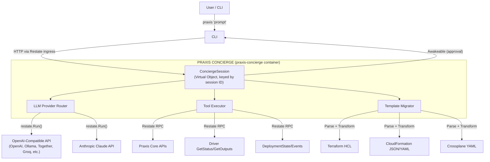
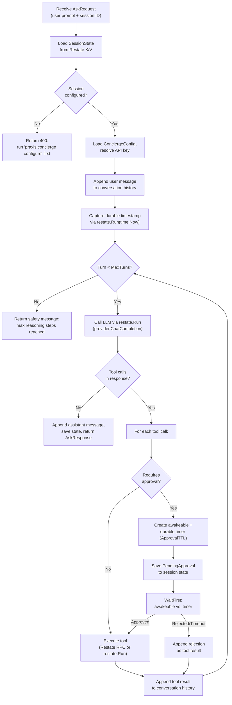
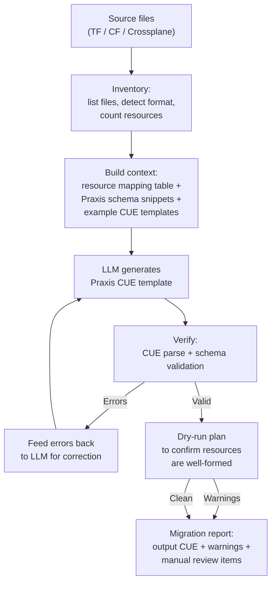

# Concierge

---

## Overview

The Concierge is an opt-in, bring-your-own-API AI assistant that understands Praxis concepts and can query, explain, act on, and migrate infrastructure on the user's behalf. It is one of the primary differentiating features of Praxis — an infrastructure platform that ships with a native AI operator.

The concierge is a Restate Virtual Object (session-scoped) that wraps LLM API calls in durable execution. It receives user prompts, calls the LLM with a tool schema that maps to Praxis Core's internal APIs, executes tool calls durably, and returns a final response. For destructive actions (apply, delete), the concierge pauses execution using Restate awakeables and waits for explicit human approval before proceeding.

A flagship capability is **template migration**: the concierge can translate Terraform HCL, CloudFormation YAML/JSON, and Crossplane YAML into Praxis CUE templates — including entire directories and repositories. Migration is LLM-guided: Praxis provides heuristics, rules, and verification while the LLM generates the CUE output. This is the primary onboarding path for users migrating from other tools.

### What It Does

- **"Why did my deploy fail?"** → Concierge queries deployment status, reads error details, explains the root cause.
- **"Convert this Terraform file to Praxis"** → Concierge inventories resources, maps to Praxis drivers, generates valid CUE.
- **"Show me what would change if I update the VPC CIDR"** → Concierge runs a plan with modified variables and explains the diff.
- **"Deploy the orders API to staging"** → Concierge looks up the template, asks for confirmation, triggers deploy.

### Design Principles

1. **Opt-in** — The agent is a separate container (`praxis-concierge`). Don't need it? Don't run it. Zero impact on the rest of the system.
2. **Durable by default** — Every LLM call is wrapped in `restate.Run()`. Tool executions that call Praxis Core use Restate RPC directly (already journaled by Restate); tool executions that call external APIs wrap those calls in `restate.Run()`. If the concierge crashes mid-conversation, it resumes from the last checkpoint.
3. **Human-in-the-loop for mutations** — Read operations execute freely. Write operations (apply, delete, import) require explicit approval via Restate awakeables. The concierge suspends, the CLI prompts, the user approves or rejects.
4. **Provider-agnostic** — Two provider backends: an OpenAI-compatible client (works with OpenAI, Ollama, Together, Groq, Azure OpenAI, and any provider that implements the OpenAI chat completions API) and an Anthropic Claude client. Users configure their preferred provider, model, and optional base URL. The concierge routes requests through a unified interface.
5. **Tool-based, not prompt-hacked** — The concierge's knowledge of Praxis comes from structured tool definitions, not from stuffing documentation into the system prompt. Tools return structured data; the LLM interprets it.
6. **Praxis-only, fail closed** — The concierge is not a general-purpose chatbot. It answers questions about Praxis concepts, deployments, templates, drivers, migrations, policies, and closely related cloud details only when needed to explain Praxis behavior. If a request is outside that scope, it refuses instead of improvising.
7. **Good errors, not guardrails** — Praxis does not validate model capability, enforce rate limits, or track token costs. Those are the user's domain. When something goes wrong (rate limit hit, context window exceeded, bad tool call), the concierge returns clear, actionable error messages.

---

## Architecture



### Component Summary

| Component | Restate Type | Key | Purpose |
|-----------|-------------|-----|---------|
| `ConciergeSession` | Virtual Object | `<sessionID>` | Conversation state, message history, tool loop execution |
| `ConciergeConfig` | Virtual Object | `"global"` | LLM provider configuration, API keys, model preferences, session retention TTL |
| `ApprovalRelay` | Basic Service | — | Resolves/rejects awakeables for destructive action approval |

The agent registers as a single Restate deployment with three services. It runs in its own container (`praxis-concierge`) and communicates with Praxis Core via Restate RPC — the same pattern every driver pack uses.

### Session Key Convention

The `ConciergeSession` is keyed by a caller-provided string — the concierge itself never generates session IDs. Different transports use different key strategies:

| Transport | Session Key | Example | Persistence |
|-----------|------------|---------|-------------|
| CLI | Random UUID generated by the CLI | `a3f8c2d1-...` | Manual — user must save and pass `--session <id>` to resume |
| Slack DM | `slack:<team_id>:<user_id>` | `slack:T01ABC:U04XYZ` | Automatic — every DM from the same user hits the same session |
| Slack thread | `slack:thread:<channel_id>:<thread_ts>` | `slack:thread:C01ABC:1711234567.000100` | Automatic — the thread is the session |

The concierge is fully transport-agnostic. The `Ask` handler doesn't care who set the key or how — it just loads state from whatever key Restate routes to.

### Deployment Model

The concierge runs as a standalone container, separate from `praxis-core`:

```yaml
# docker-compose.yaml
praxis-concierge:
  build:
    context: .
    dockerfile: cmd/praxis-concierge/Dockerfile
  container_name: praxis-concierge
  depends_on:
    restate:
      condition: service_healthy
  ports:
    - "9088:9080"
  environment:
    - PRAXIS_LISTEN_ADDR=0.0.0.0:9080
```

The container registers three Restate services: `ConciergeSession`, `ConciergeConfig`, and `ApprovalRelay`. Producers in `praxis-core` and the CLI call these via Restate ingress — no direct network coupling between containers.

---

## Restate Service Design

### ConciergeSession — Virtual Object

Each conversation is a Virtual Object keyed by a session ID. The session holds message history, pending approvals, and configuration overrides.

```go
// ConciergeSession is a Restate Virtual Object keyed by session ID.
type ConciergeSession struct {
    llm       *ProviderRouter
    tools     *ToolRegistry
    migrator  *TemplateMigrator
}

func (ConciergeSession) ServiceName() string { return "ConciergeSession" }
```

#### State Model

```go
type SessionState struct {
    Messages        []Message     `json:"messages"`
    TurnCount       int           `json:"turnCount"`
    Account         string        `json:"account"`
    Workspace       string        `json:"workspace"`
    CreatedAt       string        `json:"createdAt"`
    ExpiresAt       string        `json:"expiresAt"`
    LastActiveAt    string        `json:"lastActiveAt"`
    MaxMessages     int           `json:"maxMessages"`
    PendingApproval *ApprovalInfo `json:"pendingApproval,omitempty"`
}

type Message struct {
    Role       string      `json:"role"`       // "system", "user", "assistant", "tool"
    Content    string      `json:"content"`
    ToolCalls  []ToolCall  `json:"toolCalls,omitempty"`
    ToolCallID string      `json:"toolCallId,omitempty"`
    Timestamp  string      `json:"timestamp"`
}

type ToolCall struct {
    ID       string `json:"id"`
    Name     string `json:"name"`
    Args     string `json:"args"`     // JSON string of arguments
}

type ApprovalInfo struct {
    AwakeableID string `json:"awakeableId"`
    Action      string `json:"action"`
    Description string `json:"description"`
    RequestedAt string `json:"requestedAt"`
}
```

#### Handler Contract

| Handler | Type | Signature | Purpose |
|---------|------|-----------|---------|
| `Ask` | Exclusive | `(ObjectContext, AskRequest) → (AskResponse, error)` | Main entry point. Processes user prompt through the LLM tool loop. Suspends on awakeable when approval is needed; resumes when resolved or timed out. |
| `GetHistory` | Shared | `(ObjectSharedContext) → ([]Message, error)` | Returns conversation history for display. |
| `GetStatus` | Shared | `(ObjectSharedContext) → (SessionStatus, error)` | Returns session metadata (provider, turn count, pending approvals). |
| `Reset` | Exclusive | `(ObjectContext) → error` | Clears conversation history and state. |
| `Expire` | Exclusive | `(ObjectContext) → error` | Proactive session cleanup. Called via delayed self-send at session creation. Clears state if `ExpiresAt` has passed; re-schedules if session was extended. |

```go
type SessionStatus struct {
    Provider        string        `json:"provider"`
    Model           string        `json:"model"`
    TurnCount       int           `json:"turnCount"`
    CreatedAt       string        `json:"createdAt"`
    LastActiveAt    string        `json:"lastActiveAt"`
    PendingApproval *ApprovalInfo `json:"pendingApproval,omitempty"`
}
```

**Note:** There is no `Approve` handler on the session object. Approvals are resolved externally via the `ApprovalRelay` Basic Service. Because `Ask` is an exclusive handler and suspends while waiting on the awakeable, no other exclusive handler can execute on the same session during that window. The relay sidesteps this by resolving the awakeable without touching the Virtual Object.

### ConciergeConfig — Virtual Object

Global singleton (`"global"` key) that stores LLM provider configuration. Operators configure this once; all sessions inherit the settings.

#### Handler Contract

| Handler | Type | Signature | Purpose |
|---------|------|-----------|---------|
| `Configure` | Exclusive | `(ObjectContext, ConciergeConfigRequest) → error` | Set or update LLM provider, model, defaults, and either a direct API key or an SSM-backed API key reference. |
| `Get` | Shared | `(ObjectSharedContext) → (ConciergeConfiguration, error)` | Return current configuration with secrets redacted. |
| `GetFull` | Shared | `(ObjectSharedContext) → (ConciergeConfiguration, error)` | Return current configuration with unredacted API key (internal use only). |

#### Configuration State

```go
type ConciergeConfiguration struct {
    Provider       string `json:"provider"`                 // "openai" (OpenAI-compatible) or "claude" (Anthropic)
    Model          string `json:"model"`                    // e.g. "gpt-4o", "claude-sonnet-4-20250514"
    BaseURL        string `json:"baseUrl,omitempty"`        // override for OpenAI-compatible (e.g. Ollama, Together)
    APIKey         string `json:"apiKey,omitempty"`         // direct API key (dev convenience)
    APIKeyRef      string `json:"apiKeyRef,omitempty"`      // ssm:///path/to/key (production)
    Temperature    float64 `json:"temperature"`             // default: 0.2
    MaxTurns       int    `json:"maxTurns"`                 // max tool loop iterations (default: 20)
    SessionTTL     string `json:"sessionTTL"`               // session expiry duration (default: "24h")
    ApprovalTTL    string `json:"approvalTTL"`              // how long to wait for approval (default: "5m")
}
```

`APIKeyRef` uses the existing Praxis `ssm:///...` resolver contract. The concierge stores the reference durably, resolves it immediately before provider calls, and never writes the resolved secret back to Restate state or returns it from `Get`/`status` responses.

---

## The Ask Handler — Core Tool Loop

The `Ask` handler is the heart of the concierge. It implements the standard LLM tool-use loop: send messages to the LLM, receive tool call requests, execute tools, feed results back, repeat until the LLM produces a final text response.

### Flow



### Replay Invariant

If the handler crashes mid-turn (after some tool calls succeed but before all results are appended), Restate replays the handler from the beginning. The in-memory `state.Messages` mutations are re-executed, but because every tool execution is journaled — either via `restate.Run()` (external API calls) or via Restate RPC (Praxis Core calls) — the journaled results replay deterministically. The same tool results are re-appended in the same order.

### Turn Limiting

The tool loop runs up to `MaxTurns` iterations (default: 20). If the limit is reached, the handler appends a safety message to history and returns it to the user. This prevents runaway tool loops.

---

## Approval Flow

When a tool requires approval (any mutation: apply, delete, import), the `Ask` handler suspends inline using a Restate awakeable paired with a durable timer. The handler does **not** return early — it sleeps until one of two things happens:

1. **External approval** — the CLI or chat gateway resolves the awakeable via `ApprovalRelay.Resolve`.
2. **Timeout** — the durable timer fires after `ApprovalTTL` (default: 5 minutes) and the action is auto-rejected.

Because sessions are Virtual Objects keyed by session ID, each user's approval wait is fully sandboxed — one sleeping session never blocks another session's `Ask` calls.

### Transport-Specific UX

| Transport | What the user sees | How approval is resolved |
|-----------|-------------------|------------------------|
| CLI | `Ask` blocks. The CLI polls `GetStatus` and renders a Y/N prompt when `PendingApproval` appears in state. User types `y` or `n`. | CLI calls `ApprovalRelay.Resolve` with the awakeable ID from `GetStatus`. |
| Slack | Gateway posts an interactive message with Approve/Reject buttons immediately after calling `Ask`. `Ask` is still running (suspended). | Button click calls `ApprovalRelay.Resolve`. The suspended `Ask` resumes, executes the tool, and returns the final response. |

### ApprovalRelay — Stateless Resolution Service

The `ApprovalRelay` is a Restate Basic Service that resolves awakeables by ID. It exists solely to sidestep the Virtual Object exclusive-handler constraint — the `Ask` handler holds the session lock while suspended, so no exclusive handler can run on the same session. The relay operates outside the session entirely.

```go
type ApprovalRelay struct{}

func (ApprovalRelay) ServiceName() string { return "ApprovalRelay" }

type ApprovalRelayRequest struct {
    AwakeableID string `json:"awakeableId"`
    Approved    bool   `json:"approved"`
    Reason      string `json:"reason,omitempty"`
    Actor       string `json:"actor,omitempty"` // who approved/rejected — for audit trail
}
```

Both the CLI and future chat gateways call `ApprovalRelay.Resolve` — a Basic Service with no key, so no lock contention.

### Approval Authorization

The relay intentionally does **not** enforce who may approve — that responsibility belongs to the caller (the transport layer). Each transport enforces its own rules:

| Transport | Who may approve/reject | Enforcement point |
|-----------|----------------------|-------------------|
| CLI | The local operator running the CLI session | Implicit — only the operator has access to the terminal |
| Slack DM | The same user whose DM session triggered the approval | Gateway checks user identity before calling the relay |
| Slack thread | Any user on the allow-list who is in the channel | Gateway checks the allow-list |

The `Actor` field on `ApprovalRelayRequest` records **who** approved/rejected. It is informational (for audit) and does not influence the resolve/reject decision.

### What Approval Looks Like

```text
$ praxis "deploy the orders API to staging"

Thinking... querying template schema... running plan...

🔒 The concierge wants to perform a destructive action:

   Action: deployTemplate
   Deploy template "orders-api" with variables:
     name=orders-staging, environment=staging

Approve this action? [y/N]: y

✓ Deployment submitted.
  Key: orders-staging
  Status: Running

The deployment has been submitted. You can watch progress with:
  praxis observe orders-staging
```

---

## Tool Definitions

Tools are the concierge's interface to Praxis. Each tool maps to one or more Praxis Core API calls. Tools are defined with JSON Schema for the LLM and an execution function for the runtime.

### Tool Registry

```go
type ToolDef struct {
    Name             string                 // tool name (matches LLM tool_call name)
    Description      string                 // human + LLM readable description
    Parameters       map[string]any         // JSON Schema for parameters
    RequiresApproval bool                   // true for mutations (apply, delete, import)
    Execute          ToolExecuteFunc        // runtime execution function
    DescribeAction   func(argsJSON string) string // human-readable action description (approval UX)
}

type ToolExecuteFunc func(ctx restate.Context, args string, session SessionState) (string, error)
```

### Tool Catalog

#### Read Tools (No Approval Required)

| Tool | Description | Praxis API | Parameters |
|------|-------------|------------|------------|
| `getDeploymentStatus` | Get the current status and details of a deployment | `DeploymentStateObj.GetDetail` | `deploymentKey` (required) |
| `listDeployments` | List all active deployments, optionally filtered by workspace | `DeploymentIndex.List` | `workspace` (optional) |
| `listTemplates` | List all registered templates | `TemplateIndex.List` | *(none)* |
| `describeTemplate` | Get template details including variable schema | `TemplateRegistry.GetVariableSchema` + `GetMetadata` | `templateName` |
| `getTemplateSource` | Get the raw CUE source of a registered template | `TemplateRegistry.GetSource` | `templateName` |
| `getResourceOutputs` | Get the outputs (IDs, ARNs, endpoints) of a provisioned resource | `<Driver>.GetOutputs` (shared handler) | `kind`, `key` |
| `getDrift` | Check if a resource has drifted from its desired state | `<Driver>.GetStatus` | `kind`, `key` |
| `planDeployment` | Run a plan (dry-run) to see what would change | `PraxisCommandService.Plan` | `template`, `variables`, `account`, `workspace` |
| `listWorkspaces` | List all workspaces | `WorkspaceIndex.List` | *(none)* |

#### Write Tools (Approval Required)

| Tool | Description | Praxis API | Parameters |
|------|-------------|------------|------------|
| `applyTemplate` | Apply a CUE template to provision resources | `PraxisCommandService.Apply` | `template`, `variables`, `deploymentKey` (optional), `account`, `workspace` |
| `deployTemplate` | Deploy from a registered template | `PraxisCommandService.Deploy` | `templateName`, `variables`, `deploymentKey` (optional) |
| `deleteDeployment` | Delete all resources in a deployment | `PraxisCommandService.DeleteDeployment` | `deploymentKey` |
| `importResource` | Import an existing cloud resource into Praxis | `PraxisCommandService.Import` | `kind`, `resourceId`, `region`, `mode` |

#### Explain Tools (No Approval Required)

| Tool | Description | Parameters |
|------|-------------|------------|
| `explainError` | Given an error code or message, explain what it means and how to fix it | `error` (string) |
| `explainResource` | Explain what a Praxis resource kind does and its available spec fields | `kind` (string, e.g. `"S3Bucket"`, `"SecurityGroup"`) |
| `suggestFix` | Given a failed deployment, analyze the errors and suggest remediation | `deploymentKey` |

#### Migration Tools (No Approval Required — Output Only)

Migration tools generate CUE templates but do not apply them. The LLM may chain a migration tool with `applyTemplate` in a single turn — this is fine because `applyTemplate` requires approval, so the user always reviews before any resources are created.

| Tool | Description | Parameters |
|------|-------------|------------|
| `migrateTerraform` | Convert Terraform HCL to Praxis CUE. LLM-guided with verification. | `source` (string, file contents) |
| `migrateCloudFormation` | Convert CloudFormation JSON/YAML to Praxis CUE. Same pipeline. | `source` (string, template content) |
| `migrateCrossplane` | Convert Crossplane YAML to Praxis CUE. Same pipeline. | `source` (string, manifest content) |
| `validateTemplate` | Validate a CUE template against Praxis schemas without applying | `template` (string, CUE source) |

### Tool Implementation Pattern

Each tool follows the same pattern: parse arguments, make Restate RPC calls, format the result as a string for the LLM.

```go
func toolGetDeploymentStatus(ctx restate.Context, argsJSON string, _ SessionState) (string, error) {
    var args struct {
        DeploymentKey string `json:"deploymentKey"`
    }
    if err := json.Unmarshal([]byte(argsJSON), &args); err != nil {
        return "", fmt.Errorf("invalid arguments: %w", err)
    }
    if args.DeploymentKey == "" {
        return "Error: deploymentKey is required", nil
    }

    detail, err := restate.Object[*types.DeploymentDetail](
        ctx, "DeploymentStateObj", args.DeploymentKey, "GetDetail",
    ).Request(restate.Void{})
    if err != nil {
        return fmt.Sprintf("Error fetching deployment: %s", err.Error()), nil
    }

    result, _ := json.MarshalIndent(detail, "", "  ")
    return string(result), nil
}
```

---

## LLM Provider Abstraction

The concierge supports two LLM provider backends behind a common interface. No external LLM SDKs are used — both providers are implemented as direct HTTP clients using `net/http` and `encoding/json`.

### Interface

```go
type LLMProvider interface {
    // ChatCompletion sends a chat request and returns the response.
    // Called inside restate.Run() by the caller — implementations
    // must NOT use Restate context internally.
    ChatCompletion(ctx context.Context, req ChatRequest) (LLMResponse, error)
}

type ChatRequest struct {
    Messages    []Message      `json:"messages"`
    Tools       []ToolSchema   `json:"tools"`
    Temperature float64        `json:"temperature"`
    MaxTokens   int            `json:"maxTokens,omitempty"`
}

type LLMResponse struct {
    Content   string     `json:"content"`
    ToolCalls []ToolCall `json:"toolCalls,omitempty"`
    Usage     Usage      `json:"usage"`
}

type Usage struct {
    PromptTokens     int `json:"promptTokens"`
    CompletionTokens int `json:"completionTokens"`
    TotalTokens      int `json:"totalTokens"`
}
```

### Provider Implementations

#### OpenAI-Compatible

The primary provider. Works with any service that implements the OpenAI chat completions API. Users point it at different providers by setting the base URL.

| Provider | Base URL | API Key | Notes |
|----------|----------|---------|-------|
| OpenAI | `https://api.openai.com/v1` (default) | Required | Full tool-calling support |
| Ollama | `http://localhost:11434/v1` | Not required | Model must be pre-pulled. In Docker Compose: `http://ollama:11434/v1` |
| Together | `https://api.together.xyz/v1` | Required | Good open-source model selection |
| Groq | `https://api.groq.com/openai/v1` | Required | Extremely fast inference |
| Azure OpenAI | `https://<resource>.openai.azure.com/openai/deployments/<deployment>` | Required | Enterprise Azure hosting |
| Any compatible | User-provided | Varies | Any service implementing the OpenAI chat completions API |

#### Anthropic Claude

Dedicated provider for Claude. Anthropic uses a different API format (Messages API with `tool_use` content blocks), so it has its own implementation that normalizes to the common `LLMResponse` format.

### Provider Router

```go
type ProviderRouter struct{}

func (r *ProviderRouter) ForConfig(cfg ConciergeConfiguration, resolvedKey string) LLMProvider {
    switch cfg.Provider {
    case "openai":
        // Returns OpenAIProvider with configurable baseURL
    case "claude":
        // Returns ClaudeProvider with Anthropic Messages API
    default:
        // Default to OpenAI-compatible
    }
}
```

### API Key Resolution

```go
func resolveAPIKey(ctx restate.Context, cfg ConciergeConfiguration) (string, error) {
    if cfg.APIKeyRef != "" {
        return restate.Run(ctx, func(rc restate.RunContext) (string, error) {
            return ssmresolver.Resolve(rc, cfg.APIKeyRef)
        })
    }
    return cfg.APIKey, nil
}
```

**Security note:** The resolved API key is journaled by `restate.Run()`, meaning it persists in Restate's durable log. Operators should restrict Restate admin API access in production. For sensitive deployments, use short-lived SSM references with automatic rotation and limit Restate log retention.

---

## Template Migration

Template migration is the concierge's flagship onboarding feature. It converts Terraform HCL, CloudFormation, and Crossplane templates into Praxis CUE templates.

### Philosophy: Guide and Verify, Don't Compute

The migration system is **LLM-guided, not parser-driven**. Praxis does minimal computation — its role is to provide the LLM with:

1. **Heuristics** — resource type mapping tables, reference patterns, known gotchas
2. **Rules** — Praxis CUE schema definitions that the output must conform to
3. **Verification** — schema validation, CUE parsing, and plan dry-runs to catch errors

The LLM does the heavy lifting: reading the source format, understanding intent, and generating valid CUE. This approach handles edge cases (modules, conditionals, dynamic blocks, `for_each`) that a deterministic parser would choke on, while Praxis's verification layer catches mistakes.

### Migration Flow



**Step 1 — Inventory.** Lightweight scanning of the input to build a resource inventory. No deep parsing — just regex-based detection of resource types:

```go
type MigrationInventory struct {
    Format         string            `json:"format"`         // "terraform", "cloudformation", "crossplane"
    Files          []FileEntry       `json:"files"`
    ResourceTypes  []string          `json:"resourceTypes"`
    MappedKinds    map[string]string `json:"mappedKinds"`    // source type → Praxis kind
    UnmappedTypes  []string          `json:"unmappedTypes"`
    TotalResources int               `json:"totalResources"`
}
```

**Step 2 — Build context.** Assembles migration context for the LLM: resource type mapping table, Praxis CUE schema snippets for detected kinds, example templates, and reference syntax rules.

**Step 3 — LLM generates CUE.** The concierge calls the LLM with source files, migration context, and a focused migration prompt (embedded from `prompts/migration.txt`).

**Step 4 — Verify.** Validates the LLM's output:

```go
type VerificationResult struct {
    ParseOK      bool     `json:"parseOk"`
    ParseErrors  []string `json:"parseErrors,omitempty"`
    SchemaOK     bool     `json:"schemaOk"`
    SchemaErrors []string `json:"schemaErrors,omitempty"`
    PlanOK       bool     `json:"planOk"`
    PlanErrors   []string `json:"planErrors,omitempty"`
    PlanResult   *types.PlanResponse `json:"planResult,omitempty"`
}
```

**Step 5 — Feedback loop.** If verification fails, errors are fed back to the LLM as a tool result. The LLM corrects its output and the concierge re-verifies. This loop runs up to 3 times before returning the best attempt with error annotations.

**Step 6 — Report.** The final output includes the generated CUE template(s), a migration summary, warnings about unmapped features, and the plan output.

### Resource Type Mapping

A static lookup table maps source resource types to Praxis kinds. This is provided to the LLM as context — a hint, not a parser:

```go
var resourceTypeMap = map[string]string{
    // Terraform → Praxis
    "aws_s3_bucket":                   "S3Bucket",
    "aws_security_group":              "SecurityGroup",
    "aws_vpc":                         "VPC",
    "aws_instance":                    "EC2Instance",
    "aws_iam_role":                    "IAMRole",
    "aws_lambda_function":             "LambdaFunction",
    "aws_lb":                          "ALB",
    "aws_db_instance":                 "RDSInstance",
    // ... 30+ Terraform mappings

    // CloudFormation → Praxis
    "AWS::S3::Bucket":                 "S3Bucket",
    "AWS::EC2::SecurityGroup":         "SecurityGroup",
    "AWS::EC2::VPC":                   "VPC",
    "AWS::EC2::Instance":              "EC2Instance",
    // ... 30+ CloudFormation mappings

    // Crossplane → Praxis (AWS provider only)
    "Bucket":                          "S3Bucket",
    "SecurityGroup":                   "SecurityGroup",
    "VPC":                             "VPC",
    "Instance":                        "EC2Instance",
    // ... 10+ Crossplane mappings
}
```

### What Verification Catches

| Error Type | Detection | Feedback to LLM |
|-----------|-----------|------------------|
| Invalid CUE syntax | CUE parse error | Exact error with line number |
| Unknown resource kind | Schema validation | "Kind 'S3BucketPolicy' is not a valid Praxis resource kind. Available kinds: ..." |
| Missing required spec fields | Schema validation | "SecurityGroup spec is missing required field 'vpcId'" |
| Invalid reference syntax | Template compilation | "${resources.foo.outputs.bar} refers to unknown resource 'foo'" |
| Type mismatch | CUE type checking | "Field 'port' expects int, got string '80'" |

---

## System Prompt

The system prompt establishes the concierge's identity, capabilities, and behavioral boundaries. It is prepended to every conversation.

The prompt lives in a standalone text file (`internal/concierge/prompts/system.txt`) and is embedded into the binary at compile time via `go:embed`. This keeps prompts reviewable in plain text — changes show up clearly in diffs without wading through Go source.

The system prompt directs the concierge to:

- Answer only questions grounded in Praxis concepts, schemas, embedded docs/examples, and tool results
- Refuse unrelated requests with a short out-of-scope message
- Avoid answering cloud/provider trivia unless it directly helps explain Praxis behavior
- Prefer tool-backed facts over model-only narration whenever a Praxis API can answer the question

The migration prompt template (`internal/concierge/prompts/migration.txt`) is similarly embedded and provides format-specific instructions, schema snippets, and reference rules for the LLM during template conversion.

---

## CLI Integration

### Concierge Subcommands

The concierge is accessed via `praxis concierge`:

```bash
# Configure LLM provider
praxis concierge configure --provider openai --api-key sk-... --model gpt-4o
praxis concierge configure --provider openai --base-url http://localhost:11434/v1 --model llama3
praxis concierge configure --provider claude --api-key sk-ant-... --model claude-sonnet-4-20250514

# Ask questions (shorthand)
praxis "why did my deploy fail?"
praxis "list my deployments"
praxis "convert this terraform to praxis" --file main.tf

# Ask questions (explicit)
praxis concierge ask "why did my deploy fail?"
praxis concierge ask "list my deployments"
praxis concierge ask "convert this terraform to praxis" --file main.tf

# Session management
praxis concierge status --session <id>
praxis concierge history --session <id>
praxis concierge reset --session <id>

# Approval management
praxis concierge approve --awakeable-id <id>
praxis concierge approve --awakeable-id <id> --reject --reason "Not ready"
```

| Subcommand | Purpose |
|-----------|---------|
| `concierge ask` | Send natural language prompt to the concierge |
| `concierge configure` | Set LLM provider, model, API key, base URL |
| `concierge status` | Show session metadata, pending approvals |
| `concierge history` | Display conversation history |
| `concierge reset` | Clear session state |
| `concierge approve` | Approve or reject a pending action |

### What the User Sees

When the concierge is not installed or unreachable:

```text
$ praxis "list my deployments"

Error: Concierge is not available.

The Praxis Concierge is an optional component. To use it:

  1. Start the praxis-concierge container (see docker-compose.yaml)
  2. Configure a provider:  praxis concierge configure --provider openai --api-key <key> --model gpt-4o

Run 'praxis --help' for available commands.
```

---

## Session Lifecycle

### Creation and Expiry

Sessions are created on first `Ask`. The CLI generates a random UUID and prints it for the user to save. Sessions expire after a configurable TTL (default: 24h, set via `ConciergeConfiguration.SessionTTL`).

Expiry is **proactive, not lazy**. When a session is created, the `Ask` handler schedules a delayed self-send:

```go
restate.ObjectSend(ctx, "ConciergeSession", sessionID, "Expire").
    Send(restate.Void{}, restate.WithDelay(ttl))
```

The `Expire` handler checks if `ExpiresAt` has passed. If expired, it clears all state. If the session was extended by a recent `Ask`, it re-schedules for the remaining duration. As a safety net, the `Ask` handler also checks expiry on entry and returns a 410 error if the session has expired.

### Message Backpressure

Sessions enforce a maximum message count (`MaxMessages`, default: 200). When the limit is reached, `trimHistory` drops the oldest non-system messages to stay within bounds. This prevents a single long-running session from accumulating unbounded state in Restate's KV store.

### Context Window Management

Context window management is handled in two layers:
1. **Offload to provider** — If the LLM provider supports automatic truncation (e.g., OpenAI's `truncation_strategy`), use it.
2. **Fallback: trim oldest** — If the provider returns a context-length error, drop the oldest non-system messages and retry. The system prompt and the most recent messages are always preserved.

---

## Chat Gateways

The concierge is transport-agnostic — it receives a string prompt via `ConciergeSession.Ask` and returns a structured `AskResponse`. The CLI is one transport. Chat platforms are others. Each gateway is a separate opt-in container that translates platform-specific interactions into the same Restate RPC calls the CLI uses.

| Gateway | Container | Status | Documentation |
|---------|-----------|--------|---------------|
| Slack | `praxis-slack` | Available | [Slack Gateway](SLACK_GATEWAY.md) |
| Discord | `praxis-discord` | Not yet available | — |

Gateways are thin adapters. They manage platform connections, translate messages, render approvals as interactive buttons, and route button clicks to `ApprovalRelay.Resolve`. The concierge itself has zero knowledge of any chat platform.

See [Slack Gateway](SLACK_GATEWAY.md) for the full Slack integration design including event-watch threads.

---

## Security Considerations

1. **API Key Storage** — SSM-backed API key references are supported from day one. `ConciergeConfig` stores an `apiKeyRef` such as `ssm:///praxis/concierge/openai-api-key`, resolved through Praxis's existing SSM resolver immediately before the provider call. The resolved key is never written back to Restate state or returned from `status`/`Get` handlers. A literal `apiKey` is accepted for local development.

2. **Prompt Injection** — The concierge receives user prompts and tool results. Tool results may contain attacker-controlled data (e.g., resource tags set by a third party). Mitigations:
    - Tool results are presented as structured data (JSON), not interpolated into prompts.
    - The system prompt includes clear behavioral boundaries.
    - Write operations always require human approval — even if an injected prompt convinces the LLM to attempt a delete, the user must still approve it.

3. **Scope Limiting** — The concierge can only access APIs exposed through its tool definitions. It cannot make arbitrary AWS calls, access the filesystem, or execute arbitrary code. All actions go through Praxis Core's existing authorization and validation layer. The concierge refuses questions outside its Praxis scope.

4. **Turn Limits** — The `MaxTurns` configuration prevents runaway tool loops.

5. **Audit** — All concierge actions flow through Praxis Core's existing event system. A deploy triggered by the concierge generates the same `dev.praxis.command.apply` event as a manual deploy. The concierge's session ID is included as metadata for attribution.

---

## Design Decisions

### No Streaming

Responses are returned synchronously. No SSE, no websockets, no side channels. The concierge completes its full tool loop and returns the final response in one shot. This keeps the architecture simple and fully durable.

### LLM-Guided Migration

Migration does not use HCL parsers, CloudFormation intrinsic function engines, or Crossplane schema decoders. The LLM generates CUE directly from the source files. Praxis provides heuristics, rules, and verification. The verify-and-retry loop catches mistakes and lets the LLM self-correct.

### No Model Validation

Praxis does not validate model capability at configuration time. Users choose their preferred model. If the model can't handle tool calling or produces poor output, the concierge returns the LLM's errors directly. Good error messages are the mitigation, not capability gates.

### No Cost Tracking

Token usage tracking and cost visibility are out of scope. Users manage their own API spend through their provider's dashboard.

### No Concierge-Specific Events

The concierge does not emit CloudEvents. Existing Praxis Core events (`dev.praxis.command.*`, `dev.praxis.deployment.*`) already cover all mutations the concierge triggers.

### No Rate Limiting

Praxis does not enforce rate limits on LLM API calls. Restate manages call durability and retries. If the LLM provider rate-limits the request, the concierge surfaces the error cleanly.

### Error Philosophy

The concierge prioritizes clear, actionable error messages over preventive guardrails:
- LLM provider returns 429 → "Rate limited by OpenAI. Wait and retry, or configure a different model."
- Context window exceeded → "Conversation too long for model X. Start a new session or switch to a model with a larger context window."
- Tool call failed → "Failed to get deployment status: deployment 'foo' not found. Check the deployment key."
- Migration verification failed → The exact parse/schema/plan errors, fed back to LLM for correction and surfaced to user if correction fails.

---

## Key Files

| File | Purpose |
|------|---------|
| `cmd/praxis-concierge/main.go` | Binary entry point — registers all three Restate services |
| `cmd/praxis-concierge/Dockerfile` | Container image (multi-stage, distroless) |
| `internal/concierge/session.go` | `ConciergeSession` Virtual Object — Ask handler, tool loop, approval flow |
| `internal/concierge/config.go` | `ConciergeConfig` Virtual Object — provider configuration, SSM resolution |
| `internal/concierge/relay.go` | `ApprovalRelay` Basic Service — awakeable resolution |
| `internal/concierge/types.go` | All concierge-scoped types (SessionState, Message, ToolCall, etc.) |
| `internal/concierge/tools.go` | ToolRegistry — registration framework |
| `internal/concierge/tools_read.go` | Read tool implementations (9 tools) |
| `internal/concierge/tools_write.go` | Write tool implementations with approval (4 tools) |
| `internal/concierge/tools_explain.go` | Explain tool implementations (3 tools) |
| `internal/concierge/tools_migrate.go` | Migration tool implementations (4 tools) |
| `internal/concierge/llm.go` | `LLMProvider` interface and `ProviderRouter` |
| `internal/concierge/llm_openai.go` | OpenAI-compatible provider (direct HTTP client) |
| `internal/concierge/llm_claude.go` | Anthropic Claude provider (direct HTTP client) |
| `internal/concierge/migrate.go` | Migration orchestration (inventory → context → LLM → verify → retry) |
| `internal/concierge/migrate_inventory.go` | Lightweight file scanner (regex-based resource type detection) |
| `internal/concierge/migrate_mapping.go` | Resource type mapping table |
| `internal/concierge/migrate_verify.go` | CUE parse + schema validation + plan dry-run verification |
| `internal/concierge/history.go` | Conversation history trimming |
| `internal/concierge/prompt.go` | System prompt embed + prompt helpers |
| `internal/concierge/prompts/system.txt` | System prompt (plain text, embedded via `go:embed`) |
| `internal/concierge/prompts/migration.txt` | Migration prompt template (plain text, embedded via `go:embed`) |
| `internal/cli/concierge.go` | CLI subcommands (ask, configure, status, history, reset, approve) |
| `internal/cli/client.go` | Client methods for concierge API calls |
