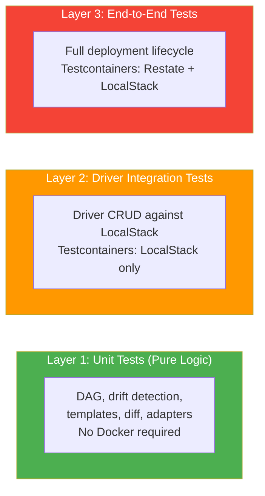
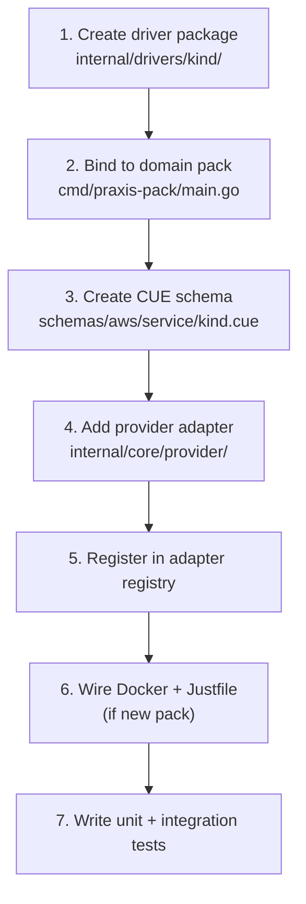
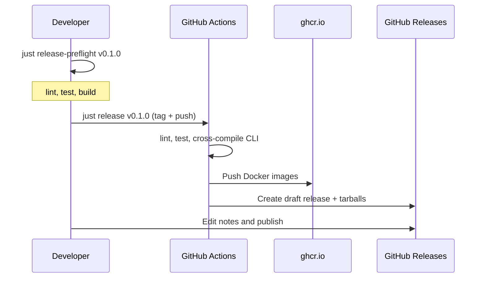

# Developer Guide

This guide is for contributors developing the Praxis codebase. Adding features, writing drivers, fixing bugs, and running tests.

Praxis development benefits from scoping the imagination sandbox of the LLM Agents to pre-defined rules of Restate and Go, with heuristics of Praxis architecture. This off-loads much of the complex work to Restate while allowing for very flexible systems, planned and implemented by Agents.

## Prerequisites

- [Go](https://go.dev/) >= 1.25
- [Docker](https://www.docker.com/) + Docker Compose
- [just](https://github.com/casey/just) task runner
- [golangci-lint](https://golangci-lint.run/) for linting

## Directory Structure

```text
cmd/
  praxis/                      # CLI binary
  praxis-core/                 # Core command/orchestration service
  praxis-storage/              # Storage driver pack (S3, future: RDS, DynamoDB...)
  praxis-network/              # Network driver pack (SG, VPC, future: ELB...)
  praxis-compute/              # Compute driver pack (AMI, EC2, future: ASG, Lambda...)

internal/
  cli/                         # CLI command implementations
    root.go                    # Root command, global flags
    apply.go, plan.go, ...     # Subcommand implementations
    client.go                  # Restate ingress client wrapper
    output.go                  # Table/JSON output formatters
  core/
    command/                   # Restate Basic Service (PraxisCommandService)
      service.go               # Service registration
      handlers_apply.go        # Apply handler
      handlers_plan.go         # Plan handler
      handlers_resource.go     # Delete + Import handlers
      handlers_template.go     # Template registry handlers
      handlers_policy.go       # Policy registry handlers
      pipeline.go              # Shared template evaluation pipeline
    config/                    # Configuration loading
    dag/                       # Dependency graph engine (pure Go)
      graph.go                 # DAG construction, cycle detection
      parser.go                # Expression reference extraction
      scheduler.go             # Topological sort + eager dispatch
    diff/                      # Plan diff engine
    orchestrator/              # Restate deployment workflows
      workflow.go              # DeploymentWorkflow (apply)
      delete_workflow.go       # DeploymentDeleteWorkflow
      deployment_state.go      # DeploymentState Virtual Object
      index.go                 # DeploymentIndex Virtual Object
      events.go                # DeploymentEvents Virtual Object
      hydrator.go              # Dispatch-time expression hydration
    provider/                  # Driver adapter registry
      registry.go              # Kind → service name mapping
      keys.go                  # Canonical resource key generation
      s3_adapter.go            # S3 adapter
      sg_adapter.go            # SG adapter
      ami_adapter.go           # AMI adapter
    registry/                  # Template + policy registries
      template_registry.go     # Restate VO for template storage
      policy_registry.go       # Restate VO for policy storage
      template_index.go        # Global template index
    resolver/                  # Secret resolution
      ssm.go                   # SSM Parameter Store resolver
      restate_ssm.go           # Restate-journaled SSM wrapper
    template/                  # Template engine
      engine.go                # CUE evaluation pipeline
  drivers/                     # Resource driver implementations
    contract.go                # Driver service contract docs
    state.go                   # Shared constants (StateKey, ReconcileInterval)
    s3/                        # S3 bucket driver
    sg/                        # Security Group driver
    ami/                       # AMI driver
  infra/
    awsclient/                 # Shared AWS client setup
    ratelimit/                 # Token bucket rate limiter

pkg/types/                     # Public shared types

schemas/aws/                   # CUE schemas per provider/service
  s3/s3.cue
  ec2/sg.cue
  ec2/ami.cue

tests/integration/             # Integration tests (Testcontainers)
```

## Building

```bash
# Build everything: CLI + Core + drivers
just build

# Build the CLI only
just build-cli

# Build Core only
just build-core

# Build Docker images
just docker-build
```

## Testing

### Running Tests

```bash
# Unit tests (no Docker needed)
just test

# Scoped unit tests
just test-core       # Command service + DAG + orchestrator
just test-cli        # CLI
just test-s3         # S3 driver
just test-sg         # SG driver
just test-vpc        # VPC driver
just test-ami        # AMI driver
just test-template   # Template engine + resolver

# Lint
just lint

# Integration tests (requires Docker — Testcontainers)
just test-integration

# Full local CI (lint → unit → integration)
just ci
```

### Testing Strategy



#### Layer 1: Unit Tests (Pure Logic)

No AWS or Restate required. Tests the most complex logic in isolation:

- DAG construction, cycle detection, topological ordering
- Expression reference parsing, typed hydration
- Drift detection per driver (pure function comparison)
- Template evaluation, schema validation
- Plan diff rendering
- Provider adapter registry, key generation

#### Layer 2: Driver Integration Tests

Driver CRUD operations tested against LocalStack via Testcontainers. No real AWS required.

Per driver:

- Provision (create, idempotency, update)
- Import (managed and observed modes)
- Delete (resource removed, tombstone preserved)
- Reconcile (no drift, managed drift correction, observed drift reporting)
- GetStatus / GetOutputs
- Error handling (terminal vs retryable)

#### Layer 3: End-to-End Tests

Full deployment lifecycle — template submission through the command service, orchestrator dispatching resources in dependency order, outputs propagating, delete in reverse order. Runs against Testcontainers (Restate + LocalStack).

## Driver Development

Each driver is a **Restate Virtual Object** managing the lifecycle of a single cloud resource type. See [DRIVERS.md](DRIVERS.md) for the full driver model documentation.

### File Layout

```text
internal/drivers/<kind>/
├── types.go       # Spec, Outputs, ObservedState, State structs
├── aws.go         # AWS SDK wrapper behind a testable interface
├── drift.go       # Pure-function drift detection
├── driver.go      # Restate Virtual Object with lifecycle handlers
├── driver_test.go # Unit tests
└── drift_test.go  # Drift detection tests

cmd/praxis-<pack>/
├── main.go        # Binds all drivers in this domain pack
└── Dockerfile     # Multi-stage distroless build

schemas/aws/<service>/<kind>.cue  # CUE schema for user-facing spec
```

### Driver Contract

Every driver Virtual Object implements 6 handlers. See [DRIVERS.md](DRIVERS.md) for full signatures and semantics.

| Handler     | Type      | Purpose                                      |
|-------------|-----------|----------------------------------------------|
| `Provision` | Exclusive | Idempotent create-or-converge                |
| `Import`    | Exclusive | Adopt existing resource                      |
| `Delete`    | Exclusive | Remove the resource                          |
| `Reconcile` | Exclusive | Periodic drift detection + correction        |
| `GetStatus` | Shared    | Return lifecycle status, mode, generation    |
| `GetOutputs`| Shared    | Return resource outputs (ARN, endpoint, etc.)|

### Key Design Rules

**Error classification** — Use `restate.TerminalError()` for permanent failures (validation, conflict, not-found). Return regular errors for transient issues (throttling, timeouts) so Restate retries automatically.

```go
// Terminal — stops retry loop
return restate.TerminalError(fmt.Errorf("bucket is not empty"), 409)

// Retryable — Restate retries
return fmt.Errorf("AWS API timeout: %w", err)
```

**Side effects** — Every AWS API call must be wrapped in `restate.Run()` to journal the result:

```go
observed, err := restate.Run(ctx, func(rc restate.RunContext) (ObservedState, error) {
    return d.api.DescribeBucket(rc, name)
})
```

**State model** — All driver state is stored as a single atomic K/V entry under the key `"state"`. This prevents torn state if a handler crashes mid-execution.

**Idempotent provision** — Always: check if exists → create if absent → configure always.

**Reconcile deduplication** — Use a `ReconcileScheduled` boolean in state to prevent timer fan-out.

**Import baseline** — Captures observed state as both desired and observed, so the first reconcile sees no drift.

**Delete safety** — Non-empty resources fail terminally. Already-deleted resources succeed (idempotent). Delete never schedules a reconcile timer.

### AWS Wrapper Pattern

Wrap the AWS SDK behind an interface for testability:

```go
type S3API interface {
    HeadBucket(ctx context.Context, name string) error
    CreateBucket(ctx context.Context, name, region string) error
    ConfigureBucket(ctx context.Context, spec S3BucketSpec) error
    DescribeBucket(ctx context.Context, name string) (ObservedState, error)
    DeleteBucket(ctx context.Context, name string) error
}
```

Rate limiting is built into the AWS wrapper layer — drivers never touch the limiter directly.

### Adding a New Driver



1. Create `internal/drivers/<kind>/` with types, aws wrapper, drift detection, and driver
2. Add the driver to the appropriate domain pack entry point (e.g., add a VPC driver to `cmd/praxis-network/main.go` via an additional `.Bind()` call)
3. Create CUE schema in `schemas/aws/<service>/<kind>.cue`
4. Add provider adapter in `internal/core/provider/` (adapter + registry entry + key scope)
5. Update `docker-compose.yaml` registration if the driver pack is new
6. Add `just` recipes for the new driver's tests
7. Write unit tests (drift, spec synthesis) and integration tests

### Reference Implementations

Study the S3 driver (`internal/drivers/s3/`), Security Group driver (`internal/drivers/sg/`), EC2 driver (`internal/drivers/ec2/`), and AMI driver (`internal/drivers/ami/`) — every pattern described here is demonstrated in those implementations.

The EC2 driver was built from [EC2_DRIVER_PLAN.md](EC2_DRIVER_PLAN.md), which documents the full process — CUE schema, types, AWS wrapper, drift detection, driver handlers, adapter, registry integration, Docker/Justfile wiring, and tests — with design rationale for each decision.

## Code Style

- **Logging**: Use `slog` structured logging throughout
- **Error handling**: Wrap errors with context using `fmt.Errorf("...: %w", err)`
- **Formatting**: `gofmt -s` (check with `just fmt-check`)
- **Linting**: `golangci-lint` (run with `just lint`)

## Release

Praxis uses [semver](https://semver.org/) with this convention:

| Level | Purpose | Example |
| --- | --- | --- |
| **Major** | Big architecture changes (shared, post-1.0.0) | `v1.0.0` → `v2.0.0` |
| **Minor** | Driver-level releases, new features | `v0.1.0` → `v0.2.0` |
| **Patch** | Hotfixes and patches | `v0.1.0` → `v0.1.1` |

Releases are **manual** — you control what version ships and with what notes. No automated release-on-push.

### Release Workflow



```bash
# 1. Run pre-release checks (lint, test, build)
just release-preflight v0.1.0

# 2. Tag and push — triggers GitHub Actions to build artifacts and create a draft release
just release v0.1.0

# 3. Go to GitHub Releases, edit the draft, add release notes, and publish
```

### What Happens

1. `just release v0.1.0` validates the version, checks for a clean working tree on `main`, creates an annotated git tag, and pushes it.
2. GitHub Actions ([`.github/workflows/release.yml`](../.github/workflows/release.yml)) runs: lint → test → cross-compile CLI (darwin/arm64, darwin/amd64, linux/amd64) → create a **draft** GitHub Release with tarballs and checksums attached.
3. Docker images for all services (`praxis-core`, `praxis-storage`, `praxis-network`, `praxis-compute`) are built and pushed to `ghcr.io/shirvan/praxis-*`.
4. You edit the draft release on GitHub to add your release notes, then publish.

### Local-Only Build (No Tag)

```bash
# Build release artifacts locally without tagging (for inspection)
just release-build v0.1.0
```

This runs the `release-build` recipe which cross-compiles the CLI and service binaries into `dist/v0.1.0/`.

### CI

A separate CI workflow ([`.github/workflows/ci.yml`](../.github/workflows/ci.yml)) runs lint, format check, tests, and build on every push to `main` and on pull requests.

## License

Praxis is Apache 2.0 licensed. See [LICENSE](../LICENSE).
