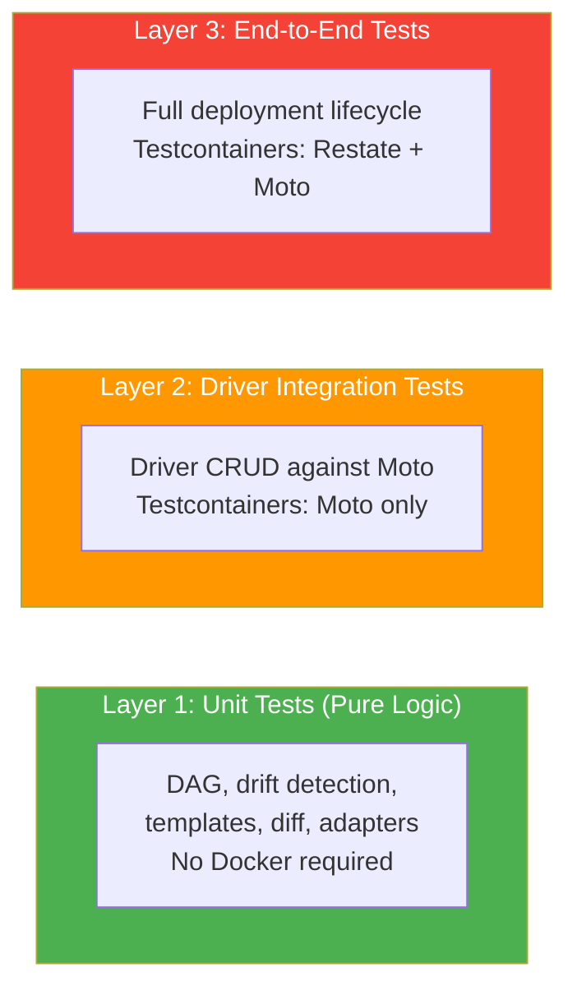
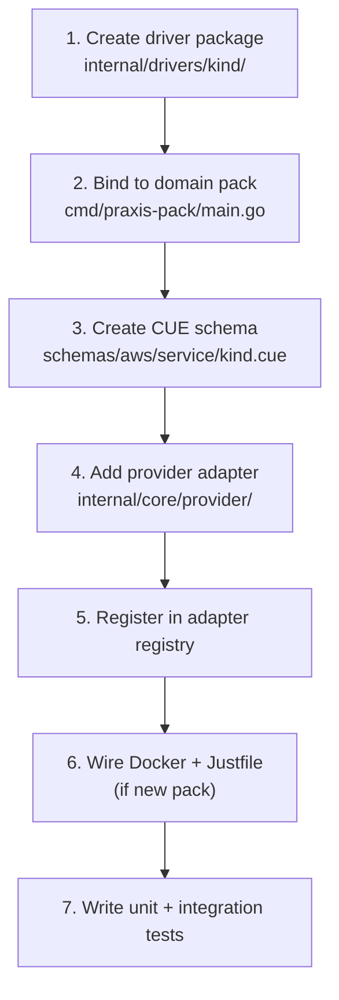
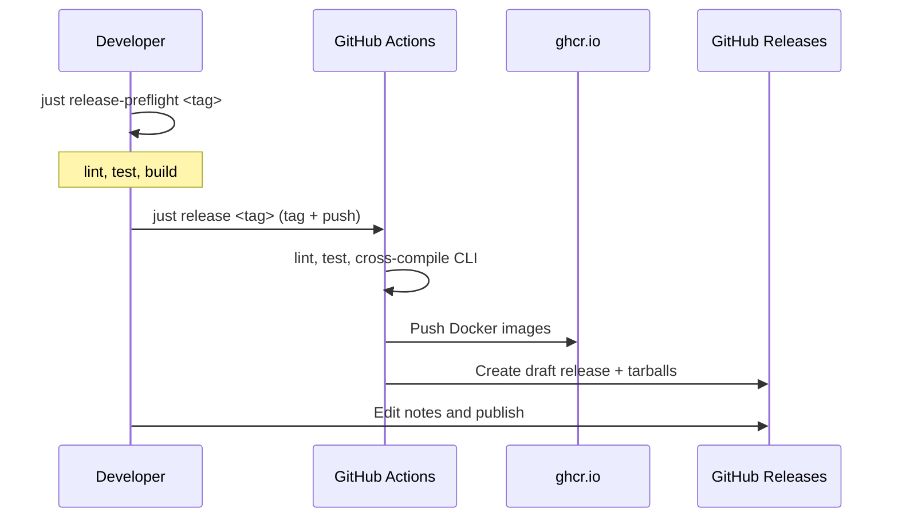

# Developer Guide

This guide is for contributors developing the Praxis codebase. Adding features, writing drivers, fixing bugs, and running tests.

Praxis development benefits from scoping the imagination sandbox of the LLM Agents to pre-defined rules of Restate and Go, with heuristics of Praxis architecture. This off-loads much of the complex work to Restate while allowing for very flexible systems, planned and implemented by Agents.

## Prerequisites

- [Go](https://go.dev/) >= 1.25
- [Docker](https://www.docker.com/) + Docker Compose
- [just](https://github.com/casey/just) task runner
- [golangci-lint](https://golangci-lint.run/) for linting

## Directory Structure

```text
cmd/
  praxis/                      # CLI binary
  praxis-core/                 # Core command/orchestration service
  praxis-concierge/            # Concierge AI assistant service
  praxis-storage/              # Storage driver pack (S3, EBS, DBSubnetGroup, DBParameterGroup, RDSInstance, AuroraCluster)
  praxis-network/              # Network driver pack (SG, VPC, EIP, IGW, NACL, RouteTable, Subnet, NATGateway, VPCPeering, Route53Zone, Route53Record, Route53HealthCheck)
  praxis-compute/              # Compute driver pack (AMI, KeyPair, EC2, Lambda, LambdaLayer, LambdaPermission, EventSourceMapping)
  praxis-identity/             # Identity driver pack (IAMRole, IAMPolicy, IAMUser, IAMGroup, IAMInstanceProfile)
  praxis-monitoring/           # Monitoring driver pack (LogGroup, MetricAlarm, Dashboard)
  praxis-notifications/        # Notification sink service
  praxis-slack/                # Slack gateway service

internal/
  cli/                         # CLI command implementations
    root.go                    # Root command, global flags
    apply.go, plan.go, ...     # Subcommand implementations
    concierge.go               # Concierge AI assistant commands
    client.go                  # Restate ingress client wrapper
    output.go                  # Table/JSON output formatters
  concierge/                   # Concierge AI assistant (optional service)
    session.go                 # ConciergeSession Virtual Object (conversation loop)
    config.go                  # ConciergeConfig Virtual Object (LLM settings)
    relay.go                   # ApprovalRelay Basic Service (awakeable resolution)
    types.go                   # Shared types and constants
    llm.go                     # LLM provider abstraction
    llm_openai.go              # OpenAI provider
    llm_claude.go              # Anthropic Claude provider
    tools.go                   # Tool registry and execution
    tools_read.go              # Read-only tools (get, list, describe)
    tools_write.go             # Write tools (apply, delete — require approval)
    tools_explain.go           # Explain/plan tools
    tools_migrate.go           # Migration analysis tool
    prompt.go                  # System prompt construction
    history.go                 # Conversation history management
    migrate.go                 # Migration orchestration (Terraform/CloudFormation)
  core/
    command/                   # Restate Basic Service (PraxisCommandService)
      service.go               # Service registration
      handlers_apply.go        # Apply handler
      handlers_plan.go         # Plan handler
      handlers_resource.go     # Delete + Import handlers
      handlers_template.go     # Template registry handlers
      handlers_policy.go       # Policy registry handlers
      pipeline.go              # Shared template evaluation pipeline
      datasource.go            # Data source validation, resolution, expression substitution
    config/                    # Configuration loading
    dag/                       # Dependency graph engine (pure Go)
      graph.go                 # DAG construction, cycle detection
      parser.go                # Expression reference extraction
      scheduler.go             # Topological sort + eager dispatch
    diff/                      # Plan diff engine
    orchestrator/              # Restate deployment workflows
      workflow.go              # DeploymentWorkflow (apply)
      delete_workflow.go       # DeploymentDeleteWorkflow
      deployment_state.go      # DeploymentState Virtual Object
      index.go                 # DeploymentIndex Virtual Object
      events.go                # DeploymentEvents Virtual Object
      hydrator.go              # Dispatch-time expression hydration
    provider/                  # Driver adapter registry
      registry.go              # Kind → service name mapping, Adapter interface (incl. Lookup)
      keys.go                  # Canonical resource key generation
      lookup_helpers.go        # Shared lookup utilities (tag merging, error classification)
      s3_adapter.go            # S3 adapter
      sg_adapter.go            # SG adapter
      ami_adapter.go           # AMI adapter
      igw_adapter.go           # IGW adapter
      ebs_adapter.go           # EBS adapter
      eip_adapter.go           # Elastic IP adapter
      ec2_adapter.go           # EC2 adapter
      keypair_adapter.go       # Key Pair adapter
      vpc_adapter.go           # VPC adapter
      nacl_adapter.go          # Network ACL adapter
      routetable_adapter.go    # Route Table adapter
      subnet_adapter.go        # Subnet adapter
      natgw_adapter.go         # NAT Gateway adapter
      vpcpeering_adapter.go    # VPC Peering adapter
      lambda_adapter.go        # Lambda Function adapter
      lambdalayer_adapter.go   # Lambda Layer adapter
      lambdaperm_adapter.go    # Lambda Permission adapter
      esm_adapter.go           # Event Source Mapping adapter
      iamrole_adapter.go       # IAM Role adapter
      iampolicy_adapter.go     # IAM Policy adapter
      iamuser_adapter.go       # IAM User adapter
      iamgroup_adapter.go      # IAM Group adapter
      iaminstanceprofile_adapter.go # IAM Instance Profile adapter
      route53zone_adapter.go   # Route 53 Hosted Zone adapter
      route53record_adapter.go # Route 53 DNS Record adapter
      route53healthcheck_adapter.go # Route 53 Health Check adapter
      rdsinstance_adapter.go   # RDS Instance adapter
      dbsubnetgroup_adapter.go # DB Subnet Group adapter
      dbparametergroup_adapter.go # DB Parameter Group adapter
      auroracluster_adapter.go # Aurora Cluster adapter
      targetgroup_adapter.go   # Target Group adapter
      alb_adapter.go           # ALB adapter
      nlb_adapter.go           # NLB adapter
      listener_adapter.go      # Listener adapter
      listenerrule_adapter.go  # Listener Rule adapter
      snstopic_adapter.go      # SNS Topic adapter
      snssub_adapter.go        # SNS Subscription adapter
      sqs_adapter.go           # SQS Queue adapter
      sqspolicy_adapter.go     # SQS Queue Policy adapter
      ecrrepository_adapter.go # ECR Repository adapter
      ecrlifecyclepolicy_adapter.go # ECR Lifecycle Policy adapter
      acmcert_adapter.go       # ACM Certificate adapter
      loggroup_adapter.go      # CloudWatch Log Group adapter
      metricalarm_adapter.go   # CloudWatch Metric Alarm adapter
      dashboard_adapter.go     # CloudWatch Dashboard adapter
    registry/                  # Template + policy registries
      template_registry.go     # Restate VO for template storage
      policy_registry.go       # Restate VO for policy storage
      template_index.go        # Global template index
    resolver/                  # Secret resolution
      ssm.go                   # SSM Parameter Store resolver
      restate_ssm.go           # Restate-journaled SSM wrapper
    template/                  # Template engine
      engine.go                # CUE evaluation pipeline (extracts resources + data sources)
      types.go                 # DataSourceSpec, DataSourceFilter, EvaluationResult
  drivers/                     # Resource driver implementations
    contract.go                # Driver service contract docs
    state.go                   # Shared constants (StateKey, ReconcileInterval)
    s3/                        # S3 bucket driver
    sg/                        # Security Group driver
    ec2/                       # EC2 instance driver
    vpc/                       # VPC driver
    eip/                       # Elastic IP driver
    igw/                       # Internet Gateway driver
    ami/                       # AMI driver
    ebs/                       # EBS volume driver
    keypair/                   # Key Pair driver
    nacl/                      # Network ACL driver
    routetable/                # Route Table driver
    subnet/                    # Subnet driver
    natgw/                     # NAT Gateway driver
    vpcpeering/                # VPC Peering Connection driver
    lambda/                    # Lambda Function driver
    lambdalayer/               # Lambda Layer driver
    lambdaperm/                # Lambda Permission driver
    esm/                       # Event Source Mapping driver
    iamrole/                   # IAM Role driver
    iampolicy/                 # IAM Policy driver
    iamuser/                   # IAM User driver
    iamgroup/                  # IAM Group driver
    iaminstanceprofile/        # IAM Instance Profile driver
    route53zone/               # Route 53 Hosted Zone driver
    route53record/             # Route 53 DNS Record driver
    route53healthcheck/        # Route 53 Health Check driver
    rdsinstance/               # RDS Instance driver
    dbsubnetgroup/             # DB Subnet Group driver
    dbparametergroup/          # DB Parameter Group driver
    auroracluster/             # Aurora Cluster driver
    targetgroup/               # Target Group driver
    alb/                       # Application Load Balancer driver
    nlb/                       # Network Load Balancer driver
    listener/                  # ELB Listener driver
    listenerrule/              # ELB Listener Rule driver
    snstopic/                  # SNS Topic driver
    snssub/                    # SNS Subscription driver
    sqs/                       # SQS Queue driver
    sqspolicy/                 # SQS Queue Policy driver
    ecrrepo/                   # ECR Repository driver
    ecrpolicy/                 # ECR Lifecycle Policy driver
    acmcert/                   # ACM Certificate driver
    loggroup/                  # CloudWatch Log Group driver
    metricalarm/               # CloudWatch Metric Alarm driver
    dashboard/                 # CloudWatch Dashboard driver
  infra/
    awsclient/                 # Shared AWS client setup
    ratelimit/                 # Token bucket rate limiter

pkg/types/                     # Public shared types

schemas/aws/                   # CUE schemas per provider/service
  s3/s3.cue
  ec2/ec2.cue
  ec2/sg.cue
  ec2/ami.cue
  ec2/eip.cue
  ec2/keypair.cue
  ebs/ebs.cue
  igw/igw.cue
  nacl/nacl.cue
  routetable/routetable.cue
  subnet/subnet.cue
  natgw/natgw.cue
  vpc/vpc.cue
  vpcpeering/vpcpeering.cue
  lambda/function.cue
  lambda/layer.cue
  lambda/permission.cue
  lambda/event_source_mapping.cue
  iam/role.cue
  iam/policy.cue
  iam/user.cue
  iam/group.cue
  iam/instance_profile.cue
  route53/hosted_zone.cue
  route53/record.cue
  route53/health_check.cue
  rds/instance.cue
  rds/aurora_cluster.cue
  rds/parameter_group.cue
  rds/subnet_group.cue
  elb/target_group.cue
  elb/alb.cue
  elb/nlb.cue
  elb/listener.cue
  elb/listener_rule.cue
  sns/topic.cue
  sns/subscription.cue
  sqs/queue.cue
  sqs/queue_policy.cue
  ecr/repository.cue
  ecr/lifecycle_policy.cue
  acm/certificate.cue
  cloudwatch/log_group.cue
  cloudwatch/metric_alarm.cue
  cloudwatch/dashboard.cue

schemas/data/                  # Data source schemas (provider-agnostic)
  lookup.cue                   # #Lookup definition for data block entries

tests/integration/             # Integration tests (Testcontainers)
```

## Building

```bash
# Build everything: CLI + Core + drivers
just build

# Build the CLI only
just build-cli

# Build Core only
just build-core

# Build Docker images
just docker-build
```

## Testing

### Running Tests

```bash
# Unit tests (no Docker needed)
just test

# Scoped unit tests — Core
just test-core       # Command service + DAG + orchestrator + provider + registry
just test-cli        # CLI commands + output formatting
just test-concierge  # Concierge AI assistant + LLM + tools + migration
just test-template   # Template engine + resolver + CUE validation
just test-slack      # Slack gateway + config + messages + watch

# Scoped unit tests — Network drivers
just test-sg         # Security Group driver
just test-vpc        # VPC driver
just test-eip        # Elastic IP driver
just test-igw        # Internet Gateway driver
just test-nacl       # Network ACL driver
just test-routetable # Route Table driver
just test-subnet     # Subnet driver
just test-natgw      # NAT Gateway driver
just test-vpcpeering # VPC Peering driver

# Scoped unit tests — Compute drivers
just test-ec2        # EC2 Instance driver
just test-ami        # AMI driver
just test-keypair    # Key Pair driver
just test-lambda     # Lambda Function driver
just test-lambdalayer # Lambda Layer driver
just test-lambdaperm # Lambda Permission driver
just test-esm        # Event Source Mapping driver

# Scoped unit tests — Storage drivers
just test-s3         # S3 Bucket driver
just test-ebs        # EBS Volume driver
just test-sqs        # SQS Queue driver
just test-sqspolicy  # SQS Queue Policy driver

# Scoped unit tests — Identity drivers
just test-iamrole    # IAM Role driver
just test-iampolicy  # IAM Policy driver
just test-iamuser    # IAM User driver
just test-iamgroup   # IAM Group driver
just test-iaminstanceprofile # IAM Instance Profile driver
just test-iam        # All IAM drivers

# Scoped unit tests — Route 53 drivers
just test-route53zone # Route 53 Hosted Zone driver
just test-route53record # Route 53 DNS Record driver
just test-route53healthcheck # Route 53 Health Check driver
just test-route53    # All Route 53 drivers

# Scoped unit tests — RDS drivers
just test-rds        # All RDS drivers (RDSInstance, Aurora, DBSubnetGroup, DBParameterGroup)

# Scoped unit tests — ELB drivers
just test-alb        # Application Load Balancer driver
just test-nlb        # Network Load Balancer driver
just test-targetgroup # Target Group driver
just test-listener   # Listener driver
just test-listenerrule # Listener Rule driver

# Scoped unit tests — Other drivers
just test-ecrrepo    # ECR Repository driver
just test-ecrpolicy  # ECR Lifecycle Policy driver
just test-snstopic   # SNS Topic driver
just test-snssub     # SNS Subscription driver
just test-acmcert    # ACM Certificate driver
just test-loggroup   # CloudWatch Log Group driver
just test-metricalarm # CloudWatch Metric Alarm driver
just test-dashboard  # CloudWatch Dashboard driver

# Lint
just lint

# Integration tests (requires Docker — Testcontainers)
just test-integration

# Full local CI (lint → unit → integration)
just ci
```

### Testing Strategy



#### Layer 1: Unit Tests (Pure Logic)

No AWS or Restate required. Tests the most complex logic in isolation:

- **DAG engine** — Graph construction, cycle detection, topological ordering, expression reference parsing, eager dispatch scheduling
- **Drift detection** — Pure-function comparison per driver (HasDrift, ComputeFieldDiffs)
- **Template engine** — CUE evaluation pipeline, schema validation, variable validation, data source extraction
- **Plan diff** — Field-level diff rendering with Terraform-inspired sigils
- **Provider adapters** — Kind mapping, key generation, spec decoding, output normalization (all 45 adapters)
- **Registry** — Template storage, policy storage, index synchronization
- **CLI** — Config parsing, output formatting, error rendering
- **Concierge** — LLM provider abstraction, tool registry, conversation history, migration mapping/inventory
- **Auth** — Credential resolution, error classification, STS operations
- **Infrastructure** — Rate limiter, AWS error classification

##### Unit Test Coverage by Package

| Package | Test Files | Status | Key Scenarios Covered |
|---------|-----------|--------|----------------------|
| `core/dag` | 3 | **Complete** | Graph construction, cycle detection, parser extraction, scheduler ordering |
| `core/diff` | 1 | **Complete** | Add/change/remove rendering, summary counters |
| `core/config` | 1 | **Complete** | Env-based configuration loading |
| `core/auth` | 1 | **Complete** | Credential resolution, multi-account |
| `core/jsonpath` | 1 | **Complete** | Dot-path set operations, array indexing |
| `core/resolver` | 2 | **Complete** | SSM resolution, Restate-journaled wrapper |
| `infra/ratelimit` | 1 | **Complete** | Token bucket behavior, burst, refill |
| `core/template` | 2 | **Good** | CUE evaluation, schema extraction, variable validation |
| `core/registry` | 3 | **Good** | Template CRUD, policy scoping, index sync |
| `core/provider` | 45 | **Near-complete** | All 45 adapters: BuildKey, DecodeSpec, NormalizeOutputs, Scope |
| `core/command` | 5 | **Partial** | Service init, pipeline, datasource, template/policy handlers |
| `core/orchestrator` | 5 | **Partial** | Workflow state, hydrator, event builders/index, notification sinks |
| `core/authservice` | 3 | **Partial** | Client, config, errors; service.go/sts.go lack direct unit tests |
| `core/workspace` | 1 | **Minimal** | Name validation only; service/index handlers untested |
| `cli` | 11 | **Good** | Config, errors, fmt, output, root, state + command tests for plan, get, delete, list, apply, import, template, workspace, events, notifications, config, state mv, concierge (configure/status/history/reset/approve), slack (configure/get-config/allowed-users/watch) |
| `concierge` | 10 | **Good** | Config, history, LLM providers, tools registry, types, session, migration mapping/inventory |
| `slack` | 5 | **Partial** | Config, gateway, messages, thread_state, watch |

##### Driver Unit Test Coverage

Every driver package has 3 test files covering the core patterns:

| Test File | What It Tests |
|-----------|--------------|
| `driver_test.go` | Provision (happy path, idempotency, validation), Import, Delete, Reconcile, GetStatus, GetOutputs |
| `drift_test.go` | HasDrift (no-drift baseline, per-field drift, tag drift), ComputeFieldDiffs (field annotations) |
| `aws_test.go` | Error classifiers (IsNotFound, IsDuplicate, etc.), API wrapper edge cases |

| Driver | driver_test | drift_test | aws_test | Depth |
|--------|:-----------:|:----------:|:--------:|-------|
| S3Bucket | 6 tests | 10 tests | 2 tests | Good |
| SecurityGroup | 5 tests | 17 tests | 8 tests | Good |
| VPC | 5 tests | 17 tests | 8 tests | Good |
| EC2Instance | 3 tests | 15 tests | 11 tests | Good (driver sparse) |
| EBSVolume | 7 tests | 9 tests | 7 tests | Good |
| ElasticIP | 4 tests | 5 tests | 8 tests | Good |
| AMI | 6 tests | 7 tests | 4 tests | Good |
| KeyPair | 4 tests | 5 tests | 4 tests | Good |
| IGW | 15 tests | 4 tests | 6 tests | Excellent |
| NACL | 20 tests | 6 tests | 8 tests | Excellent |
| RouteTable | 8 tests | 5 tests | 5 tests | Good |
| Subnet | 16 tests | 10 tests | 4 tests | Excellent |
| NATGateway | 20 tests | 8 tests | 7 tests | Excellent |
| VPCPeering | 5 tests | 6 tests | 5 tests | Good |
| Lambda | 5 tests | 2 tests | 1 test | Moderate |
| LambdaLayer | 4 tests | 2 tests | 1 test | Moderate |
| LambdaPerm | 3 tests | 35 tests | 35 tests | Good |
| ESM | 3 tests | 39 tests | 39 tests | Good |
| IAMRole | 5 tests | 7 tests | 5 tests | Good |
| IAMPolicy | 5 tests | 7 tests | 5 tests | Good |
| IAMUser | 4 tests | 8 tests | 3 tests | Good |
| IAMGroup | 4 tests | 6 tests | 4 tests | Good |
| IAMInstanceProfile | 9 tests | 6 tests | 4 tests | Good |
| Route53Zone | 11 tests | 7 tests | 8 tests | Good |
| Route53Record | 11 tests | 6 tests | 9 tests | Good |
| Route53HealthCheck | 11 tests | 7 tests | 6 tests | Good |
| RDSInstance | 22 tests | 19 tests | 14 tests | Excellent |
| AuroraCluster | 17 tests | 19 tests | 14 tests | Excellent |
| DBSubnetGroup | 10 tests | 13 tests | 8 tests | Excellent |
| DBParameterGroup | 12 tests | 12 tests | 9 tests | Excellent |
| TargetGroup | 8 tests | 30 tests | 23 tests | Excellent |
| ALB | 9 tests | 5 tests | 20 tests | Good |
| NLB | 9 tests | 5 tests | 18 tests | Good |
| Listener | 12 tests | 11 tests | 17 tests | Excellent |
| ListenerRule | 12 tests | 13 tests | 25 tests | Excellent |
| SNSTopic | 5 tests | 27 tests | 15 tests | Excellent |
| SNSSub | 13 tests | 18 tests | 12 tests | Excellent |
| SQSQueue | 4 tests | 5 tests | 5 tests | Good |
| SQSQueuePolicy | 3 tests | 3 tests | 2 tests | Moderate |
| ECRRepository | 19 tests | 15 tests | 11 tests | Excellent |
| ECRLifecyclePolicy | 13 tests | 8 tests | 8 tests | Good |
| ACMCertificate | 4 tests | 3 tests | 2 tests | Moderate |
| LogGroup | 8 tests | 3 tests | 3 tests | Good |
| MetricAlarm | 8 tests | 3 tests | 3 tests | Good |
| Dashboard | 6 tests | 3 tests | 2 tests | Good |

#### Layer 2: Driver Integration Tests

Driver CRUD operations tested against Moto via Testcontainers. No real AWS required. Each driver integration test covers the full lifecycle:

- **Provision** — Create resource, verify outputs (ARN, ID, etc.)
- **Idempotent provision** — Re-provision same resource, verify convergence
- **Update** — Modify mutable fields, verify changes applied
- **Import** — Adopt pre-existing resource (managed and/or observed mode)
- **Delete** — Remove resource, verify cleanup
- **Delete safety** — Non-empty resources fail terminally
- **Reconcile** — Drift detection with auto-correction (managed) or reporting (observed)
- **External delete** — Detect resource removal outside Praxis
- **GetStatus / GetOutputs** — Verify status reporting

##### Integration Test Coverage by Driver

| Driver | Tests | Create | Idempotent | Update | Import | Delete | Reconcile | Ext. Delete | GetStatus |
|--------|:-----:|:------:|:----------:|:------:|:------:|:------:|:---------:|:-----------:|:---------:|
| S3Bucket | 7 | ✅ | ✅ | — | ✅ | ✅ | ✅ | — | ✅ |
| SecurityGroup | 7 | ✅ | ✅ | — | ✅ | ✅ | ✅ | ✅ | ✅ |
| VPC | 10 | ✅ | ✅ | — | ✅ | ✅ | ✅ | ✅ | ✅ |
| EC2Instance | 8 | ✅ | ✅ | — | ✅ | ✅ | ✅ | ✅ | ✅ |
| EBSVolume | 7 | ✅ | ✅ | — | ✅ | ✅ | ✅ | — | ✅ |
| ElasticIP | 7 | ✅ | ✅ | — | ✅ | ✅ | ✅ | ✅ | ✅ |
| KeyPair | 6 | ✅ | ✅ | — | ✅ | ✅ | ✅ | — | — |
| AMI | 3 | ✅ | — | — | ✅ | ✅ | — | — | — |
| IGW | 7 | ✅ | ✅ | — | ✅ | ✅ | ✅ | — | ✅ |
| Subnet | 7 | ✅ | ✅ | — | ✅ | ✅ | ✅ | — | ✅ |
| RouteTable | 3 | ✅ | — | — | ✅ | — | ✅ | — | — |
| NACL | 9 | ✅ | ✅ | — | ✅ | ✅ | ✅ | — | ✅ |
| NATGateway | 7 | ✅ | ✅ | — | ✅ | ✅ | ✅ | — | ✅ |
| VPCPeering | 7 | ✅ | ✅ | — | ✅ | ✅ | ✅ | — | ✅ |
| Lambda | 7 | ✅ | ✅ | ✅ | ✅ | ✅ | ✅ | — | ✅ |
| LambdaLayer | 5 | ✅ | ✅ | — | ✅ | ✅ | — | — | ✅ |
| LambdaPerm | 4 | ✅ | ✅ | — | — | ✅ | — | — | ✅ |
| ESM | 4 | ✅ | ✅ | — | — | ✅ | — | — | ✅ |
| IAMRole | 5 | ✅ | — | ✅ | ✅ | ✅ | ✅ | — | — |
| IAMPolicy | 6 | ✅ | ✅ | ✅ | ✅ | ✅ | ✅ | — | ✅ |
| IAMUser | 5 | ✅ | — | ✅ | ✅ | ✅ | ✅ | — | — |
| IAMGroup | 6 | ✅ | — | ✅ | ✅ | ✅ | ✅ | — | ✅ |
| IAMInstanceProfile | 5 | ✅ | — | ✅ | ✅ | ✅ | ✅ | — | — |
| Route53Zone | 6 | ✅ | ✅ | — | ✅ | ✅ | ✅ | — | ✅ |
| Route53Record | 4 | ✅ | — | ✅ | — | ✅ | — | — | ✅ |
| Route53HealthCheck | 4 | ✅ | — | ✅ | — | ✅ | — | — | ✅ |
| ALB | 4 | ✅ | ✅ | — | — | ✅ | — | — | ✅ |
| NLB | 4 | ✅ | ✅ | — | — | ✅ | — | — | ✅ |
| TargetGroup | 7 | ✅ | ✅ | ✅ | ✅ | ✅ | — | — | ✅ |
| Listener | 3 | ✅ | — | — | — | ✅ | — | — | ✅ |
| ListenerRule | 3 | ✅ | — | — | — | ✅ | — | — | ✅ |
| SQSQueue | 4 | ✅ | — | — | ✅ | ✅ | — | — | — |
| SQSQueuePolicy | 3 | ✅ | — | — | ✅ | ✅ | — | — | — |
| ECRRepository | 6 | ✅ | ✅ | — | ✅ | ✅ | ✅ | — | ✅ |
| ECRLifecyclePolicy | 6 | ✅ | ✅ | — | ✅ | ✅ | ✅ | — | ✅ |
| SNSTopic | 6 | ✅ | ✅ | — | ✅ | ✅ | ✅ | — | ✅ |
| SNSSub | 4 | ✅ | — | — | ✅ | ✅ | — | — | ✅ |
| LogGroup | 5 | ✅ | ✅ | — | ✅ | ✅ | ✅ | — | — |
| MetricAlarm | 5 | ✅ | ✅ | — | ✅ | ✅ | ✅ | — | — |
| Dashboard | 5 | ✅ | ✅ | — | ✅ | ✅ | ✅ | — | — |
| DBParameterGroup | 5 | ✅ | ✅ | — | ✅ | ✅ | — | — | ✅ |
| DBSubnetGroup | 5 | ✅ | ✅ | — | ✅ | ✅ | — | — | ✅ |
| RDSInstance | 5 | ✅ | ✅ | — | ✅ | ✅ | — | — | ✅ |
| AuroraCluster | 5 | ✅ | ✅ | — | ✅ | ✅ | — | — | ✅ |
| ACMCertificate | 2 | ✅ | — | — | — | — | — | — | ✅ |

#### Layer 3: End-to-End Tests

Full deployment lifecycle through the Restate command service and orchestrator. Testcontainers (Restate + Moto).

##### Workflow Scenarios Covered

| Scenario | Test | Status |
|----------|------|:------:|
| Single-resource apply (S3) | `TestCore_Apply_SingleS3` | ✅ |
| Plan dry-run (no provisioning) | `TestCore_Plan_ShowsDiff` | ✅ |
| Multi-resource with DAG dependencies | `TestCore_Apply_MultiResource_WithDependencies` | ✅ |
| Delete single resource | `TestCore_Delete_ReverseOrder` | ✅ |
| Delete multi-resource (reverse topo) | `TestCore_Delete_MultiResource` | ✅ |
| Cycle detection | Apply + Plan | ✅ |
| Rollback on partial failure | `TestCore_Rollback_DeletesOnlyReadyResources` | ✅ |
| Import via command service | `TestCore_Import_S3` | ✅ |
| Deploy from registered template | `TestDeploy_HappyPath` | ✅ |
| Deploy with required variables | `TestDeploy_MissingVariable` / `TestDeploy_InvalidEnum` | ✅ |
| PlanDeploy (dry-run) | `TestDeploy_PlanDeploy` | ✅ |
| Deploy multi-resource with deps | `TestDeploy_MultiResource_WithDependencies` | ✅ |
| Template not found | `TestDeploy_TemplateNotFound` | ✅ |
| Template re-registration | `TestDeploy_ReRegister_DigestChange` | ✅ |
| Variable schema extraction | `TestDeploy_VariableSchema` | ✅ |
| Template registry CRUD | `TestTemplateRegistry_RegisterGetListApply` | ✅ |
| SSM parameter resolution | `TestSSMParameterResolution` | ✅ |
| SSM missing parameter | `TestSSMParameterResolution_MissingParam` | ✅ |
| Data source: VPC lookup | `TestDataSource_VPCLookup` | ✅ |
| Data source: S3 lookup | `TestDataSource_S3Lookup` | ✅ |
| Data source: not found | `TestDataSource_NotFound` | ✅ |
| Global policy enforcement | `TestPolicy_GlobalBlocksInvalid` | ✅ |
| Template-scoped policy | `TestPolicy_TemplateScopedPolicy` | ✅ |
| preventDestroy lifecycle | `TestCore_SystemAndPolicyEvents` | ✅ |
| Deployment events + CloudEvents | Multiple tests | ✅ |
| Notification sink delivery | `TestCore_NotificationSink_*` | ✅ |
| Event retention + sweep | `TestCore_Retention_*` | ✅ |
| Event index querying | `TestCore_EventIndex_*` | ✅ |
| Workspace event retention | `TestCore_Workspace_EventRetention_*` | ✅ |

## Driver Development

Each driver is a **Restate Virtual Object** managing the lifecycle of a single cloud resource type. See [DRIVERS.md](DRIVERS.md) for the full driver model documentation.

### File Layout

```text
internal/drivers/<kind>/
├── types.go       # Spec, Outputs, ObservedState, State structs
├── aws.go         # AWS SDK wrapper behind a testable interface
├── drift.go       # Pure-function drift detection
├── driver.go      # Restate Virtual Object with lifecycle handlers
├── driver_test.go # Unit tests
└── drift_test.go  # Drift detection tests

cmd/praxis-<pack>/
├── main.go        # Binds all drivers in this domain pack
└── Dockerfile     # Multi-stage distroless build

schemas/aws/<service>/<kind>.cue  # CUE schema for user-facing spec
```

### Driver Contract

Every driver Virtual Object implements 6 handlers. See [DRIVERS.md](DRIVERS.md) for full signatures and semantics.

| Handler     | Type      | Purpose                                      |
|-------------|-----------|----------------------------------------------|
| `Provision` | Exclusive | Idempotent create-or-converge                |
| `Import`    | Exclusive | Adopt existing resource                      |
| `Delete`    | Exclusive | Remove the resource                          |
| `Reconcile` | Exclusive | Periodic drift detection + correction        |
| `GetStatus` | Shared    | Return lifecycle status, mode, generation    |
| `GetOutputs`| Shared    | Return resource outputs (ARN, endpoint, etc.)|

### Key Design Rules

**Error classification** — See [Errors](ERRORS.md) for the full error model: terminal vs retryable errors, HTTP status code conventions, the shared `awserr` classifier package, structured failure summaries, and error codes.

**Side effects** — Every AWS API call must be wrapped in `restate.Run()` to journal the result:

```go
observed, err := restate.Run(ctx, func(rc restate.RunContext) (ObservedState, error) {
    return d.api.DescribeBucket(rc, name)
})
```

**State model** — All driver state is stored as a single atomic K/V entry under the key `"state"`. This prevents torn state if a handler crashes mid-execution.

**Idempotent provision** — Always: check if exists → create if absent → configure always.

**Reconcile deduplication** — Use a `ReconcileScheduled` boolean in state to prevent timer fan-out.

**Import baseline** — Captures observed state as both desired and observed, so the first reconcile sees no drift.

**Delete safety** — Non-empty resources fail terminally. Already-deleted resources succeed (idempotent). Delete never schedules a reconcile timer.

### AWS Wrapper Pattern

Wrap the AWS SDK behind an interface for testability:

```go
type S3API interface {
    HeadBucket(ctx context.Context, name string) error
    CreateBucket(ctx context.Context, name, region string) error
    ConfigureBucket(ctx context.Context, spec S3BucketSpec) error
    DescribeBucket(ctx context.Context, name string) (ObservedState, error)
    DeleteBucket(ctx context.Context, name string) error
}
```

Rate limiting is built into the AWS wrapper layer — drivers never touch the limiter directly.

### Adding a New Driver



1. Create `internal/drivers/<kind>/` with types, aws wrapper, drift detection, and driver
2. Add the driver to the appropriate domain pack entry point (e.g., add a VPC driver to `cmd/praxis-network/main.go` via an additional `.Bind()` call). The `config.DefaultRetryPolicy()` is already applied to all `restate.Reflect()` calls in every pack, so your new driver inherits the bounded retry policy (50 attempts, exponential backoff, pause on exhaustion) automatically.
3. Create CUE schema in `schemas/aws/<service>/<kind>.cue`
4. Add provider adapter in `internal/core/provider/` (adapter + registry entry + key scope)
5. Update `docker-compose.yaml` registration if the driver pack is new
6. Add `just` recipes for the new driver's tests
7. Write unit tests (drift, spec synthesis) and integration tests

### Reference Implementations

Study the S3 driver (`internal/drivers/s3/`), Security Group driver (`internal/drivers/sg/`), EC2 driver (`internal/drivers/ec2/`), VPC driver (`internal/drivers/vpc/`), EIP driver (`internal/drivers/eip/`), AMI driver (`internal/drivers/ami/`), EBS driver (`internal/drivers/ebs/`), and KeyPair driver (`internal/drivers/keypair/`) — every pattern described here is demonstrated in those implementations.

The EC2 driver was built from [EC2_DRIVER_PLAN.md](ec2/EC2_DRIVER_PLAN.md), which documents the full process — CUE schema, types, AWS wrapper, drift detection, driver handlers, adapter, registry integration, Docker/Justfile wiring, and tests — with design rationale for each decision.

## Code Style

- **Logging**: Use `slog` structured logging throughout
- **Error handling**: Wrap errors with context using `fmt.Errorf("...: %w", err)`. See [Errors](ERRORS.md) for classification and status code conventions
- **Formatting**: `gofmt -s` (check with `just fmt-check`)
- **Linting**: `golangci-lint` (run with `just lint`)

## Release

Praxis uses [semver](https://semver.org/). Releases are **manual** — you control what version ships and with what notes. No automated release-on-push.

### Versioning

All services currently share a **single monolithic version**. After the initial public release, each service will move to independent per-service versioning.

| Component | Binary / Image | Current Versioning |
| --- | --- | --- |
| **CLI** | `praxis` | Shared tag |
| **Core** | `praxis-core` | Shared tag |
| **Network Pack** | `praxis-network` | Shared tag |
| **Compute Pack** | `praxis-compute` | Shared tag |
| **Storage Pack** | `praxis-storage` | Shared tag |
| **Identity Pack** | `praxis-identity` | Shared tag |
| **Monitoring Pack** | `praxis-monitoring` | Shared tag |
| **Notifications** | `praxis-notifications` | Shared tag |

### Release Workflow



```bash
# 1. Run pre-release checks (lint, test, build)
just release-preflight <tag>

# 2. Tag and push — triggers GitHub Actions to build artifacts and create a draft release
just release <tag>

# 3. Go to GitHub Releases, edit the draft, add release notes, and publish
```

### What Happens

1. `just release <tag>` validates the tag, checks for a clean working tree on `main`, creates an annotated git tag, and pushes it.
2. GitHub Actions ([`.github/workflows/release.yml`](../.github/workflows/release.yml)) runs: lint → test → cross-compile CLI (darwin/arm64, darwin/amd64, linux/amd64) → create a **draft** GitHub Release with tarballs and checksums attached.
3. Docker images for all services are built and pushed to `ghcr.io/shirvan/praxis-*`.
4. You edit the draft release on GitHub to add your release notes, then publish.

### Local-Only Build (No Tag)

```bash
# Build release artifacts locally without tagging (for inspection)
just release-build <tag>
```

This runs the `release-build` recipe which cross-compiles the CLI and service binaries into `dist/<tag>/`.

### CI

A separate CI workflow ([`.github/workflows/ci.yml`](../.github/workflows/ci.yml)) runs lint, format check, tests, and build on every push to `main` and on pull requests.

## License

Praxis is Apache 2.0 licensed. See [LICENSE](../LICENSE).
