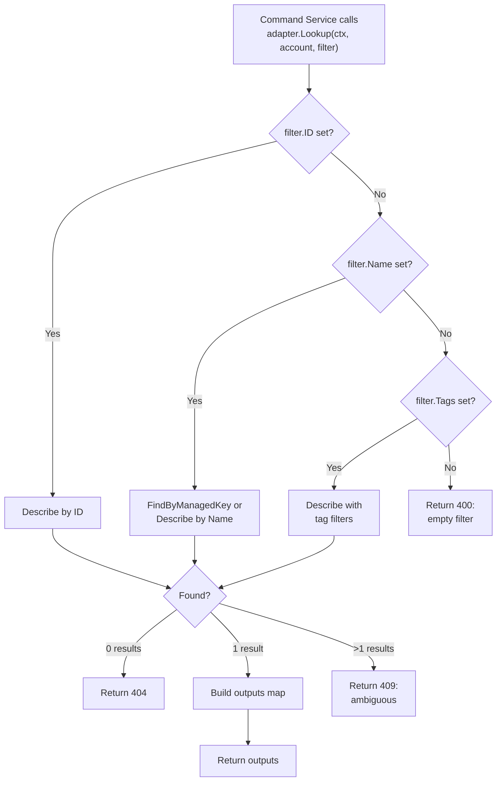
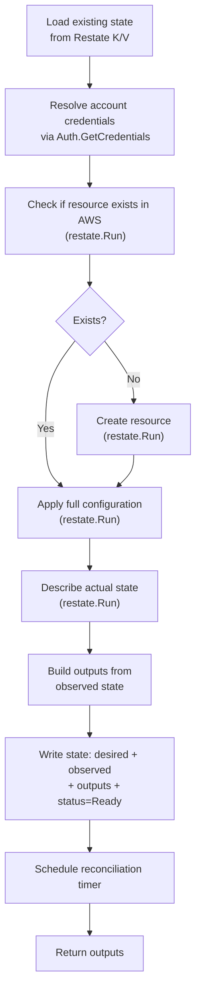
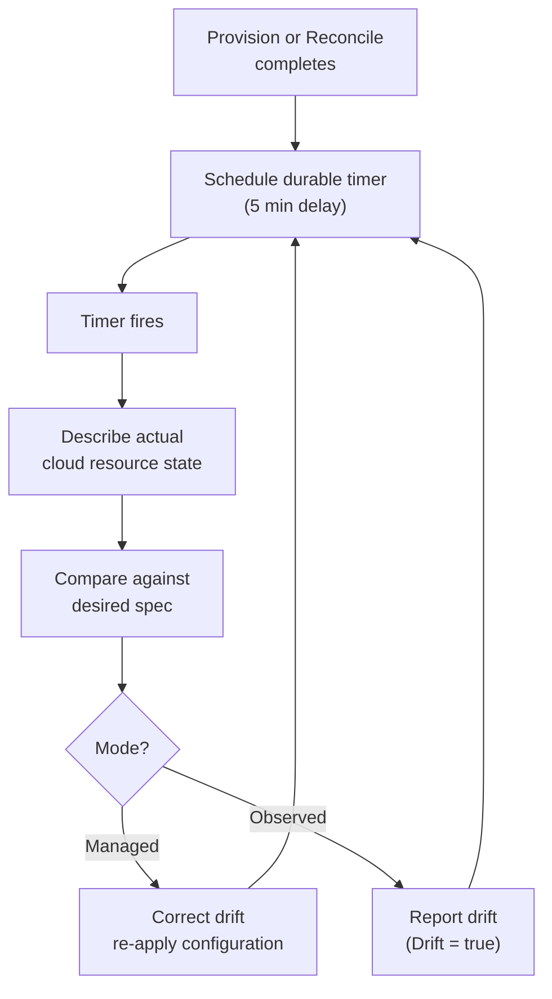
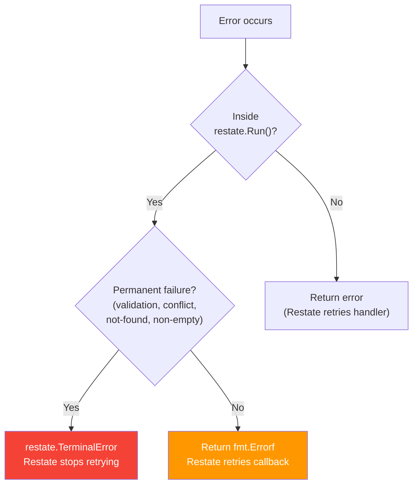

# Drivers

> **See also:** [Architecture](ARCHITECTURE.md) | [Orchestrator](ORCHESTRATOR.md) | [Templates](TEMPLATES.md) | [Events](EVENTS.md) | [Auth](AUTH.md) | [Errors](ERRORS.md) | [Developers](DEVELOPERS.md)

---

## Overview

A Praxis driver manages the lifecycle of a single cloud resource type. The S3 driver manages S3 buckets. The SecurityGroup driver manages EC2 security groups. The EC2 driver manages EC2 instances. The VPC driver manages AWS Virtual Private Clouds. The ElasticIP driver manages AWS Elastic IP addresses. The AMI driver manages Amazon Machine Images. The EBS driver manages EBS volumes. The KeyPair driver manages EC2 key pairs. The InternetGateway driver manages AWS Internet Gateways. The NetworkACL driver manages AWS Network ACLs. The IAM drivers manage Roles, Policies, Users, Groups, and Instance Profiles. The Route 53 drivers manage Hosted Zones, DNS Records, and Health Checks. The Lambda drivers manage Lambda Functions, Layers, Permissions, and Event Source Mappings. The RDS drivers manage RDS Instances, DB Subnet Groups, DB Parameter Groups, and Aurora Clusters. The ELB drivers manage ALBs, NLBs, Target Groups, Listeners, and Listener Rules. The ACM driver manages AWS Certificate Manager certificates. The CloudWatch drivers manage Log Groups, Metric Alarms, and Dashboards. The ECR drivers manage ECR Repositories and Lifecycle Policies. The SNS drivers manage Topics and Subscriptions. Each driver is a Restate Virtual Object that registers with Restate and communicates with Praxis Core via durable RPC.

Drivers are grouped by AWS domain into **driver packs** — each pack is a single container hosting multiple related Virtual Objects. For example, the **network** pack hosts the SecurityGroup, VPC, ElasticIP, InternetGateway, NetworkACL, and ACMCertificate drivers. The Restate SDK supports binding multiple Virtual Objects to one server via chained `.Bind()` calls, so grouping drivers is purely a deployment-time decision — no code changes required.

Drivers are intentionally simple. They know how to create, read, update, delete, and reconcile one type of resource. They have zero knowledge of other drivers, dependency graphs, or deployment workflows. All coordination happens in [Core's orchestrator](ORCHESTRATOR.md).

Drivers can also expose read-only lookup helpers used by template data sources. These lookups do not create Restate state and are only used during command-service compilation.

## Adapter Lookup Support

Provider adapters may implement a read-only `Lookup` capability for existing resources. The command service uses it to resolve template `data` blocks before SSM resolution and DAG parsing.

### Lookup Method Signature

```go
Lookup(ctx context.Context, account string, filter LookupFilter) (map[string]any, error)
```

The `LookupFilter` struct carries the filter specified in a template's `data.<name>.filter` block:

```go
type LookupFilter struct {
    ID   string            // Direct resource ID
    Name string            // Lookup by Name tag or resource name
    Tags map[string]string // Tag key/value pairs (ANDed)
}
```

### Implementation Requirements

Lookup implementations should:

- Accept `id`, `name`, and `tag` filters (resolution priority: id → name → tag)
- Return the same output map shape the resource exposes after provisioning
- Reject zero matches with a terminal `404`
- Reject ambiguous matches (multiple results) with a terminal `409`
- Return a `501` if the adapter has not implemented `Lookup` yet
- Never call create, update, or delete APIs — lookups are strictly read-only

### Adapter Implementation Flow



### Supported Kinds

See the [Supported Data Source Kinds](TEMPLATES.md#supported-data-source-kinds) table in the Templates documentation for the full list of adapters that support lookup, along with their outputs and filter support.

---

## Driver Model

Every cloud resource instance is modeled as a **Restate Virtual Object** keyed by a natural identifier:

- S3 Bucket: `my-bucket` (bucket names are globally unique)
- SecurityGroup: `vpc-123~web-sg` (VPC-scoped, using `~` as separator)
- NetworkACL: `vpc-123~web-nacl` (VPC-scoped, using `~` as separator)
- EC2 Instance: `us-east-1~web-server` (region-scoped, using `~` as separator)
- VPC: `us-east-1~main-vpc` (region-scoped, using `~` as separator)
- InternetGateway: `us-east-1~web-igw` (region-scoped, using `~` as separator)
- AMI: `us-east-1~my-ami` (region-scoped, using `~` as separator)
- EBS Volume: `us-east-1~data-vol` (region-scoped, using `~` as separator)
- KeyPair: `us-east-1~my-keypair` (region-scoped, using `~` as separator)
- Lambda Function: `us-east-1~my-function` (region-scoped, using `~` as separator)
- Lambda Layer: `us-east-1~my-layer` (region-scoped, using `~` as separator)
- Lambda Permission: `us-east-1~my-function~allow-s3` (region + function + statement ID)
- Event Source Mapping: `us-east-1~my-function~<encoded-source-arn>` (region + function + encoded ARN)
- ALB: `us-east-1~web-lb` (region-scoped, using `~` as separator)
- NLB: `us-east-1~tcp-lb` (region-scoped, using `~` as separator)
- Target Group: `us-east-1~web-targets` (region-scoped, using `~` as separator)
- Listener: `us-east-1~web-https` (region-scoped, using `~` as separator)
- Listener Rule: `us-east-1~api-route` (region-scoped, using `~` as separator)
- ECR Repository: `us-east-1~my-repo` (region-scoped, using `~` as separator)
- ECR Lifecycle Policy: `us-east-1~my-repo` (region + repository name)

Each Virtual Object holds:

| Field | Description |
| --- | --- |
| **Desired State** | The user's declared configuration (from template evaluation) |
| **Observed State** | What actually exists in the cloud provider |
| **Outputs** | Values produced after provisioning (ARNs, endpoints, IDs) |
| **Status** | `Pending`, `Provisioning`, `Ready`, `Error`, `Deleting`, `Deleted` |
| **Mode** | `Managed` (full lifecycle) or `Observed` (read-only tracking) |
| **Generation** | Counter incremented on each spec change |
| **Last Reconcile** | Timestamp of the last drift detection run |

---

## Handler Contract

Every driver MUST implement these six handlers:

### Exclusive Handlers (Single-Writer)

These run one-at-a-time per object key. While a `Provision` is running for `my-bucket`, no other exclusive handler can execute on `my-bucket`.

| Handler | Signature | Purpose |
| --- | --- | --- |
| `Provision` | `(ObjectContext, Spec) → (Outputs, error)` | Idempotent create-or-converge. If the resource exists and matches the spec, succeed. If it differs, converge. |
| `Import` | `(ObjectContext, ImportRef) → (Outputs, error)` | Adopt an existing cloud resource. Captures observed state as desired baseline. |
| `Delete` | `(ObjectContext) → error` | Remove the resource. Fail terminally if unsafe (e.g., non-empty bucket). |
| `Reconcile` | `(ObjectContext) → (ReconcileResult, error)` | Periodic drift detection. Managed mode: correct drift. Observed mode: report only. |

### Shared Handlers (Concurrent Reads)

These can run concurrently and never block exclusive handlers.

| Handler | Signature | Purpose |
| --- | --- | --- |
| `GetStatus` | `(ObjectSharedContext) → (StatusResponse, error)` | Return lifecycle status, mode, generation. |
| `GetOutputs` | `(ObjectSharedContext) → (Outputs, error)` | Return resource outputs (ARN, endpoint, etc.). |

The Restate SDK discovers handlers automatically via reflection (`restate.Reflect`) — there is no Go interface to implement.

---

## State Model

All driver state is stored as a **single atomic K/V entry** under the key `"state"`. A single `restate.Set()` call writes the entire state struct, ensuring no torn state if the handler crashes between operations.

```go
type S3BucketState struct {
    Desired            S3BucketSpec           `json:"desired"`
    Observed           ObservedState          `json:"observed"`
    Outputs            S3BucketOutputs        `json:"outputs"`
    Status             types.ResourceStatus   `json:"status"`
    Mode               types.Mode             `json:"mode"`
    Error              string                 `json:"error,omitempty"`
    Generation         int64                  `json:"generation"`
    LastReconcile      string                 `json:"lastReconcile,omitempty"`
    ReconcileScheduled bool                   `json:"reconcileScheduled"`
}
```

Every driver follows this exact pattern. The concrete types (`S3BucketSpec`, `S3BucketOutputs`, `ObservedState`) vary per driver, but the structure is always the same.

---

## Provision Flow

Provision follows a check-then-converge pattern:



Key properties:

- **Idempotent** — calling Provision twice with the same spec produces the same result
- **Convergent** — calling Provision with an updated spec adjusts the resource to match
- **Crash-safe** — every AWS call is wrapped in `restate.Run()`, journaled by Restate. On replay, completed calls return their journaled result without re-executing.

---

## Reconciliation

Reconciliation is Praxis's drift detection and correction mechanism. It replaces the polling-watch model used by Kubernetes controllers with Restate's durable timers.

### How It Works



1. After each Provision or Reconcile, the driver schedules a delayed self-invocation:

   ```go
   restate.ObjectSend(ctx, ServiceName, restate.Key(ctx), "Reconcile").
       Send(restate.Void{}, restate.WithDelay(5 * time.Minute))
   ```

2. When the timer fires, the `Reconcile` handler runs:
   - Describes the actual cloud resource state
   - Compares it against the desired spec

3. Based on mode:
   - **Managed**: corrects drift by re-applying configuration, updates observed state
   - **Observed**: reports drift (sets `ReconcileResult.Drift = true`) but does not modify the resource

4. Schedules the next timer.

The plan diff engine (in Core) also respects `lifecycle.ignoreChanges` — field diffs matching ignored paths are filtered before presenting plan results. This filtering happens in the command handlers, not in drivers. Drivers always report full drift; the orchestrator decides what to act on.

### Timer Deduplication

Drivers use a `ReconcileScheduled` boolean guard in state to prevent timer fan-out. Without this, each Provision call would stack additional timers:

```go
func (d *Driver) scheduleReconcile(ctx restate.ObjectContext, state *State) {
    if state.ReconcileScheduled {
        return
    }
    state.ReconcileScheduled = true
    restate.Set(ctx, drivers.StateKey, *state)
    restate.ObjectSend(ctx, ServiceName, restate.Key(ctx), "Reconcile").
        Send(restate.Void{}, restate.WithDelay(drivers.ReconcileInterval))
}
```

### Properties

- **Crash-proof** — the timer is a durable Restate invocation. It fires even if the driver restarts.
- **Deduplicated** — no duplicate AWS calls on replay (all wrapped in `restate.Run()`).
- **Self-healing** — managed resources converge back to desired state automatically.

---

## Import

Import adopts an existing cloud resource into Praxis without modifying it:

1. Resolve account credentials
2. Describe the resource in AWS → observed state
3. Set desired = observed (so the first reconcile sees no drift)
4. Build outputs from observed state
5. Apply the requested mode (`Managed` or `Observed`)
6. Schedule reconciliation

Users can later call Provision with a new spec to update the desired state, and reconciliation will converge the resource.

---

## Delete

1. Load current state
2. Check safety constraints (e.g., S3 bucket must be empty)
3. Delete the resource in AWS (`restate.Run()`)
4. Write tombstone state (`Status: Deleted`)
5. Do NOT schedule reconciliation

The orchestrator checks `lifecycle.preventDestroy` **before** calling the driver's Delete handler. If the flag is set, the driver is never invoked — the orchestrator fails the resource with a terminal error. Drivers themselves do not inspect lifecycle rules.

Properties:

- **Safe** — non-empty resources fail with a terminal error
- **Idempotent** — deleting an already-deleted resource succeeds
- **Tombstone** — `GetStatus` still returns meaningful data after deletion

---

## Resource Keys

Each driver owns its key format, producing the shortest natural key for its resource type:

| Resource Type | Scope | Format | Example |
| --- | --- | --- | --- |
| S3Bucket | Global | `<name>` | `my-bucket` |
| SecurityGroup | Custom (VPC-scoped) | `<vpcId>~<groupName>` | `vpc-123~web-sg` |
| NetworkACL | Custom (VPC-scoped) | `<vpcId>~<name>` | `vpc-123~web-nacl` |
| EC2Instance | Region | `<region>~<name>` | `us-east-1~web-server` |
| VPC | Region | `<region>~<name>` | `us-east-1~main-vpc` |
| ElasticIP | Region | `<region>~<name>` | `us-east-1~web-eip` |
| InternetGateway | Region | `<region>~<name>` | `us-east-1~web-igw` |
| AMI | Region | `<region>~<amiName>` | `us-east-1~my-ami` |
| EBSVolume | Region | `<region>~<name>` | `us-east-1~data-vol` |
| KeyPair | Region | `<region>~<keyName>` | `us-east-1~my-keypair` |
| LambdaFunction | Region | `<region>~<functionName>` | `us-east-1~my-function` |
| LambdaLayer | Region | `<region>~<layerName>` | `us-east-1~my-layer` |
| LambdaPermission | Custom | `<region>~<functionName>~<statementId>` | `us-east-1~my-func~allow-s3` |
| EventSourceMapping | Custom | `<region>~<functionName>~<encodedSourceArn>` | `us-east-1~my-func~<base64>` |
| ALB | Region | `<region>~<albName>` | `us-east-1~web-lb` |
| NLB | Region | `<region>~<nlbName>` | `us-east-1~tcp-lb` |
| TargetGroup | Region | `<region>~<tgName>` | `us-east-1~web-targets` |
| Listener | Region | `<region>~<listenerName>` | `us-east-1~web-https` |
| ListenerRule | Region | `<region>~<ruleName>` | `us-east-1~api-route` |
| ACMCertificate | Region | `<region>~<name>` | `us-east-1~api-cert` |
| ECRRepository | Region | `<region>~<repositoryName>` | `us-east-1~my-repo` |
| ECRLifecyclePolicy | Custom | `<region>~<repositoryName>` | `us-east-1~my-repo` |
| SNSTopic | Region | `<region>~<topicName>` | `us-east-1~alerts` |
| SNSSubscription | Custom | `<region>~<topicArn>~<protocol>~<endpoint>` | `us-east-1~arn:aws:sns:us-east-1:123456789012:alerts~sqs~arn:aws:sqs:us-east-1:123456789012:queue` |

The `~` separator is URL-safe and does not collide with characters valid in AWS resource names.

### Key Scopes

| Scope | Format | Description |
| --- | --- | --- |
| **Global** | `<name>` | Resource name is globally unique (S3) |
| **Region** | `<region>~<name>` | Resource name is unique within a region |
| **Custom** | adapter-defined | Resource has domain-specific scoping (SecurityGroup, NetworkACL = VPC) |

The CLI uses key scope metadata to assemble keys from user input and ambient context (e.g., `PRAXIS_REGION`).

---

## Error Classification

Drivers must classify errors into two categories:



### Terminal Errors (No Retry)

```go
return restate.TerminalError(fmt.Errorf("bucket is not empty"), 409)
```

Use for permanent failures: validation errors, conflicts, not-found during import, non-empty on delete. Restate stops retrying immediately.

### Retryable Errors (Automatic Retry)

```go
return fmt.Errorf("AWS API timeout: %w", err)
```

Use for transient failures: throttling, timeouts, 5xx responses. Restate retries automatically with backoff.

**Critical rule:** error classification MUST happen inside `restate.Run()` callbacks. If a `restate.Run()` callback returns a non-terminal error, Restate retries the entire callback. Terminal errors must be returned from inside the callback to signal that the failure is permanent.

---

## AWS Wrapper Pattern

Each driver wraps the AWS SDK behind a testable interface:

```go
type S3API interface {
    HeadBucket(ctx context.Context, name string) error
    CreateBucket(ctx context.Context, name, region string) error
    ConfigureBucket(ctx context.Context, spec S3BucketSpec) error
    DescribeBucket(ctx context.Context, name string) (ObservedState, error)
    DeleteBucket(ctx context.Context, name string) error
}
```

The concrete implementation translates to AWS SDK calls and provides error classification helpers (`IsNotFound`, `IsBucketNotEmpty`, `IsConflict`).

### Rate Limiting

All AWS API wrappers include a per-service token bucket rate limiter (from `internal/infra/ratelimit/`), wired transparently at construction time. Drivers never interact with the rate limiter directly — it sits inside the AWS wrapper layer.

| Service | Default Rate | Burst |
| --- | --- | --- |
| S3 (control plane) | 100 rps | 20 |
| EC2 (describe/create) | 50 rps | 10 |

---

## Driver File Layout

Each driver follows the same directory structure for its internal package:

```text
internal/drivers/<kind>/
├── types.go       # Spec, Outputs, ObservedState, State structs
├── aws.go         # AWS SDK wrapper behind a testable interface
├── drift.go       # Pure-function drift detection
├── driver.go      # Restate Virtual Object with lifecycle handlers
└── drift_test.go  # Drift detection tests

schemas/aws/<service>/<kind>.cue  # CUE schema for user-facing spec
```

Drivers are deployed via **domain-grouped driver packs** — each pack is a binary that binds all related drivers to a single Restate server:

```text
cmd/praxis-<pack>/
├── main.go        # Binds all drivers in this domain pack
└── Dockerfile     # Multi-stage distroless build
```

| Pack | Binary | Drivers |
| --- | --- | --- |
| Storage | `cmd/praxis-storage/` | S3, EBS, RDSInstance, DBSubnetGroup, DBParameterGroup, AuroraCluster, SNSTopic, SNSSubscription |
| Network | `cmd/praxis-network/` | SecurityGroup, VPC, ElasticIP, InternetGateway, NetworkACL, RouteTable, Subnet, NATGateway, VPCPeering, Route53HostedZone, DNSRecord, HealthCheck, ALB, NLB, TargetGroup, Listener, ListenerRule, ACMCertificate |
| Compute | `cmd/praxis-compute/` | AMI, KeyPair, EC2, Lambda, LambdaLayer, LambdaPermission, EventSourceMapping, ECRRepository, ECRLifecyclePolicy |
| Identity | `cmd/praxis-identity/` | IAMRole, IAMPolicy, IAMUser, IAMGroup, IAMInstanceProfile |

See [Driver Roadmap](DRIVER_ROADMAP.md) for 1.0 and future planned drivers.

---

## Provider Adapter Registry

Core doesn't call drivers directly. It uses a provider adapter registry (`internal/core/provider/`) that maps resource kinds to typed dispatch logic:

```go
type Adapter interface {
    Kind() string                    // "S3Bucket"
    ServiceName() string             // Restate service name
    Scope() KeyScope                 // Global, Region, Custom
    BuildKey(doc json.RawMessage) (string, error)
    DecodeSpec(doc json.RawMessage) (any, error)
    Provision(ctx, key, account, spec) (ProvisionInvocation, error)
    Delete(ctx, key) (DeleteInvocation, error)
    Plan(ctx, key, account, spec) (DiffOperation, []FieldDiff, error)
    Import(ctx, key, account, ref) (ResourceStatus, map[string]any, error)
    NormalizeOutputs(raw any) (map[string]any, error)
}
```

Each adapter converts between the generic JSON resource documents that templates produce and the typed Go structs that drivers expect. The orchestrator calls `adapter.Provision()` which returns a Restate future; it then waits on that future alongside others for maximum parallelism.

---

## Current Drivers

### S3Bucket

Manages AWS S3 buckets. Spec fields: `bucketName`, `region`, `versioning`, `encryption` (enabled + algorithm), `acl`, `tags`.

Outputs: `arn`, `bucketName`, `region`, `domainName`.

Key: bucket name (globally unique). Scope: Global.

### SecurityGroup

Manages AWS EC2 Security Groups. Spec fields: `groupName`, `description`, `vpcId`, `ingressRules`, `egressRules`, `tags`.

Outputs: `groupId`, `groupArn`, `groupName`, `vpcId`.

Key: `<vpcId>~<groupName>`. Scope: Custom.

### NetworkACL

Manages AWS Network ACLs (stateless subnet-level firewalls). Spec fields: `region`, `vpcId`, `ingressRules`, `egressRules`, `subnetAssociations`, `tags`.

Outputs: `networkAclId`, `vpcId`, `isDefault`, `ingressRules`, `egressRules`, `associations`.

Key: `<vpcId>~<name>`. Scope: Custom.

### RouteTable

Manages AWS VPC Route Tables with routes and subnet associations. Spec fields: `region`, `vpcId`, `routes` (destinationCidrBlock + one target: gatewayId, natGatewayId, vpcPeeringConnectionId, transitGatewayId, networkInterfaceId, vpcEndpointId), `associations` (subnetId), `tags`.

Outputs: `routeTableId`, `vpcId`, `ownerId`, `routes`, `associations`.

Key: `<vpcId>~<name>`. Scope: Custom.

### VPC

Manages AWS Virtual Private Clouds. Spec fields: `region`, `cidrBlock`, `enableDnsSupport`, `enableDnsHostnames`, `tags`.

Outputs: `vpcId`, `arn`, `cidrBlock`, `state`.

Key: `<region>~<name>`. Scope: Region.

### ElasticIP

Manages AWS Elastic IP addresses. Spec fields: `region`, `domain`, `tags`.

Outputs: `allocationId`, `publicIp`, `domain`.

Key: `<region>~<name>`. Scope: Region.

### InternetGateway

Manages AWS Internet Gateways. Spec fields: `region`, `vpcId`, `tags`.

Outputs: `internetGatewayId`, `vpcId`.

Key: `<region>~<name>`. Scope: Region.

### EC2Instance

Manages AWS EC2 instances. Spec fields: `region`, `imageId`, `instanceType`, `subnetId`, `securityGroupIds`, `keyName`, `tags`.

Outputs: `instanceId`, `publicIp`, `privateIp`, `state`.

Key: `<region>~<name>`. Scope: Region.

### AMI

Manages Amazon Machine Images (lookup/import only). Spec fields: `region`, `amiName`, `tags`.

Outputs: `imageId`, `name`, `state`.

Key: `<region>~<amiName>`. Scope: Region.

### EBSVolume

Manages AWS EBS volumes. Spec fields: `region`, `availabilityZone`, `size`, `volumeType`, `iops`, `throughput`, `encrypted`, `tags`.

Outputs: `volumeId`, `arn`, `availabilityZone`, `size`, `state`.

Key: `<region>~<name>`. Scope: Region.

### KeyPair

Manages EC2 key pairs. Spec fields: `region`, `keyName`, `keyType`, `tags`.

Outputs: `keyPairId`, `keyFingerprint`, `keyName`.

Key: `<region>~<keyName>`. Scope: Region.

### Subnet

Manages AWS VPC Subnets. Spec fields: `region`, `vpcId`, `cidrBlock`, `availabilityZone`, `mapPublicIpOnLaunch`, `tags`.

Outputs: `subnetId`, `arn`, `vpcId`, `cidrBlock`, `availabilityZone`, `availabilityZoneId`, `mapPublicIpOnLaunch`, `state`, `ownerId`, `availableIpCount`.

Key: `<vpcId>~<name>`. Scope: Custom.

### NATGateway

Manages AWS NAT Gateways. Spec fields: `region`, `subnetId`, `connectivityType`, `allocationId`, `tags`.

Outputs: `natGatewayId`, `subnetId`, `vpcId`, `connectivityType`, `state`, `publicIp`, `privateIp`, `allocationId`, `networkInterfaceId`.

Key: `<region>~<name>`. Scope: Region.

### VPCPeeringConnection

Manages AWS VPC Peering Connections. Spec fields: `region`, `requesterVpcId`, `accepterVpcId`, `autoAccept`, `requesterOptions`, `accepterOptions`, `tags`.

Outputs: `vpcPeeringConnectionId`, `requesterVpcId`, `accepterVpcId`, `requesterCidrBlock`, `accepterCidrBlock`, `status`, `requesterOwnerId`, `accepterOwnerId`.

Key: `<region>~<name>`. Scope: Region.

### LambdaFunction

Manages AWS Lambda functions. Spec fields: `region`, `functionName`, `role`, `runtime`, `handler`, `memorySize`, `timeout`, `code`, `description`, `environment`, `layers`, `vpcConfig`, `tags`.

Outputs: `functionArn`, `functionName`, `version`, `state`, `lastModified`, `lastUpdateStatus`, `codeSha256`.

Key: `<region>~<functionName>`. Scope: Region.

### LambdaLayer

Manages AWS Lambda layers (versioned, immutable per version). Spec fields: `region`, `layerName`, `description`, `compatibleRuntimes`, `code`.

Outputs: `layerArn`, `layerVersionArn`, `version`, `codeSha256`.

Key: `<region>~<layerName>`. Scope: Region.

### LambdaPermission

Manages Lambda resource-based policy statements. Spec fields: `region`, `functionName`, `statementId`, `action`, `principal`, `sourceArn`, `sourceAccount`.

Outputs: `statementId`, `functionName`, `statement`.

Key: `<region>~<functionName>~<statementId>`. Scope: Custom.

### EventSourceMapping

Manages Lambda event source mappings (SQS, DynamoDB Streams, Kinesis, etc.). Spec fields: `region`, `functionName`, `eventSourceArn`, `enabled`, `batchSize`, `maximumBatchingWindowInSeconds`, `startingPosition`, `filterCriteria`.

Outputs: `uuid`, `eventSourceArn`, `functionArn`, `state`, `batchSize`.

Key: `<region>~<functionName>~<encodedEventSourceArn>`. Scope: Custom.

### ALB

Manages AWS Application Load Balancers. Spec fields: `region`, `name`, `scheme`, `ipAddressType`, `subnets`, `subnetMappings`, `securityGroups`, `accessLogs`, `deletionProtection`, `idleTimeout`, `tags`.

Outputs: `loadBalancerArn`, `dnsName`, `hostedZoneId`, `vpcId`, `canonicalHostedZoneId`.

Key: `<region>~<albName>`. Scope: Region.

### NLB

Manages AWS Network Load Balancers. Spec fields: `region`, `name`, `scheme`, `ipAddressType`, `subnets`, `subnetMappings`, `crossZoneLoadBalancing`, `deletionProtection`, `tags`.

Outputs: `loadBalancerArn`, `dnsName`, `hostedZoneId`, `vpcId`, `canonicalHostedZoneId`.

Key: `<region>~<nlbName>`. Scope: Region.

### TargetGroup

Manages AWS ELB Target Groups. Spec fields: `region`, `name`, `protocol`, `port`, `vpcId`, `targetType`, `healthCheck`, `deregistrationDelay`, `stickiness`, `targets`, `tags`.

Outputs: `targetGroupArn`, `targetGroupName`.

Key: `<region>~<tgName>`. Scope: Region.

### Listener

Manages AWS ELB Listeners. Spec fields: `region`, `name`, `loadBalancerArn`, `port`, `protocol`, `sslPolicy`, `certificateArn`, `alpnPolicy`, `defaultActions`, `tags`.

Outputs: `listenerArn`, `loadBalancerArn`, `port`, `protocol`.

Key: `<region>~<listenerName>`. Scope: Region.

### ListenerRule

Manages AWS ELB Listener Rules. Spec fields: `region`, `name`, `listenerArn`, `priority`, `conditions`, `actions`, `tags`.

Outputs: `ruleArn`, `listenerArn`, `priority`.

Key: `<region>~<ruleName>`. Scope: Region.

### ECRRepository

Manages AWS ECR repositories. Spec fields: `region`, `repositoryName`, `imageTagMutability`, `imageScanningConfiguration`, `encryptionConfiguration`, `repositoryPolicy`, `forceDelete`, `tags`.

Outputs: `repositoryArn`, `repositoryName`, `repositoryUri`, `registryId`.

Key: `<region>~<repositoryName>`. Scope: Region.

### ECRLifecyclePolicy

Manages AWS ECR lifecycle policies (sub-resource of an ECR repository). Spec fields: `region`, `repositoryName`, `lifecyclePolicyText`.

Outputs: `repositoryName`, `repositoryArn`, `registryId`.

Key: `<region>~<repositoryName>`. Scope: Custom.

### SNSTopic

Manages AWS SNS topics. Spec fields: `region`, `topicName`, `displayName`, `fifoTopic`, `contentBasedDeduplication`, `kmsMasterKeyId`, `policy`, `deliveryPolicy`, `tags`.

Outputs: `topicArn`, `topicName`.

Key: `<region>~<topicName>`. Scope: Region. Immutable: `topicName`, `fifoTopic`.

### SNSSubscription

Manages AWS SNS subscriptions. Spec fields: `region`, `topicArn`, `protocol`, `endpoint`, `filterPolicy`, `filterPolicyScope`, `rawMessageDelivery`, `deliveryPolicy`, `redrivePolicy`, `subscriptionRoleArn`.

Outputs: `subscriptionArn`, `topicArn`, `protocol`, `endpoint`, `pendingConfirmation`, `confirmationStatus`.

Key: `<region>~<topicArn>~<protocol>~<endpoint>`. Scope: Custom. Immutable: `topicArn`, `protocol`, `endpoint`.
