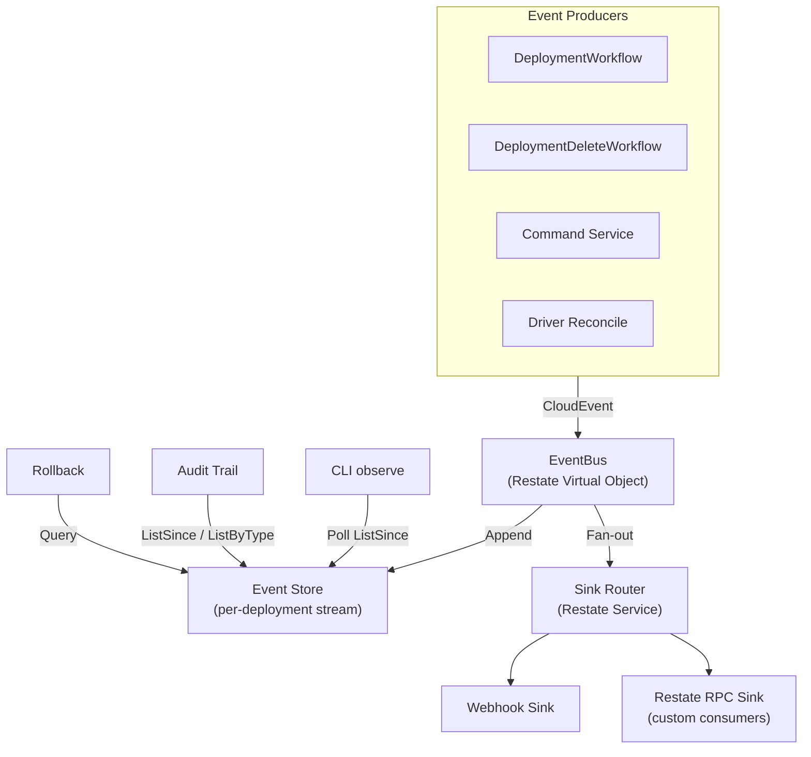
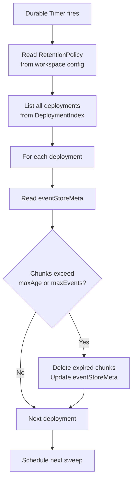
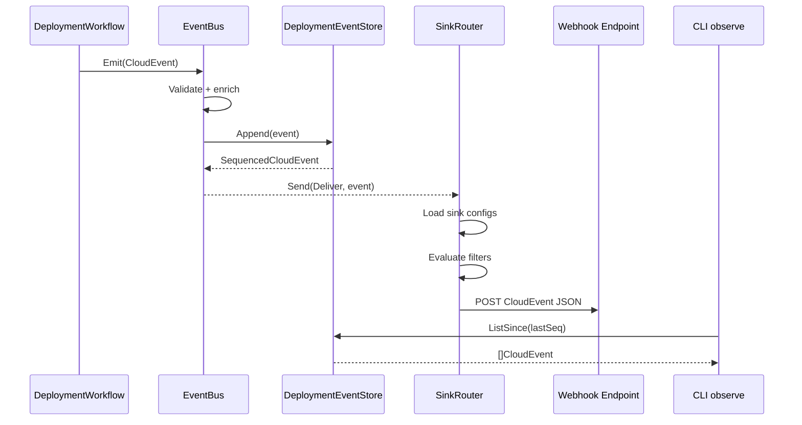

# Events & Notifications

---

## Overview

The Events & Notifications system is the observability and integration backbone of Praxis. Every state transition — deployment lifecycle, resource provisioning, drift detection, policy enforcement, administrative action — produces a structured [CloudEvents v1.0](https://github.com/cloudevents/spec/blob/v1.0.2/cloudevents/spec.md) event that flows through a central event bus into per-deployment stores and external notification sinks.

The system serves multiple consumers:

- **CLI observe** — real-time deployment monitoring via `praxis observe`
- **Audit trail** — per-deployment event history via `praxis list events Deployment/<key>`
- **Rollback** — event-stream-based rollback plans via `DeploymentEventStore.RollbackPlan`
- **External integrations** — webhook sinks for Slack, PagerDuty, Datadog, etc., and `restate_rpc` sinks for custom Restate-based consumers

CloudEvents is a graduated CNCF specification with broad industry adoption (AWS EventBridge, Azure Event Grid, Google Eventarc, Knative). Every event Praxis produces can be consumed by any CloudEvents-compatible system without Praxis-specific adapters. The Go SDK ([`cloudevents/sdk-go`](https://github.com/cloudevents/sdk-go)) provides serialization, validation, and HTTP protocol bindings.

---

## Architecture



### Component Responsibilities

| Component | Restate Type | Key | Purpose |
|-----------|-------------|-----|---------|
| `EventBus` | Virtual Object | `"global"` | Receives CloudEvents, validates against CUE schemas, routes to store + sinks |
| `DeploymentEventStore` | Virtual Object | `<deploymentKey>` | Chunked append-only per-deployment event stream |
| `SinkRouter` | Basic Service | — | Fan-out delivery to registered notification sinks |
| `NotificationSinkConfig` | Virtual Object | `"global"` | Sink registrations, delivery configuration, health tracking |
| `ResourceEventOwnerObj` | Virtual Object | `<resourceKey>` | Maps resource keys to deployment/workspace context for drift events |
| `ResourceEventBridge` | Basic Service | — | Resolves ownership and emits drift CloudEvents on behalf of drivers |

### Deployment Model

The event system is hosted by **`praxis-core`** alongside the command service
and orchestrator — there is no separate notifications container. Core registers
the six event services (`EventBus`, `DeploymentEventStore`, `ResourceEventOwnerObj`,
`ResourceEventBridge`, `SinkRouter`, `NotificationSinkConfig`) with Restate.
Producers (workflows, command handlers, drivers) call `EventBus.Emit` via
one-way send — Restate routes the message regardless of which container
registered the target service, so drivers in other packs need no direct
network coupling to core.

---

## CloudEvents Envelope

Every event Praxis emits conforms to CloudEvents v1.0.2. The required attributes map naturally to Praxis concepts:

### Required Attributes

| CloudEvents Attribute | Type | Praxis Mapping |
|----------------------|------|----------------|
| `specversion` | String | `"1.0"` |
| `id` | String | `"<deploymentKey>-<sequence>"` — unique per event |
| `source` | URI-reference | `"/praxis/<workspace>/<deploymentKey>"` |
| `type` | String | Reverse-DNS event type (see [catalog](#event-type-catalog) below) |

### Optional Attributes

| CloudEvents Attribute | Type | Praxis Mapping |
|----------------------|------|----------------|
| `time` | Timestamp | RFC 3339 timestamp from `restate.Run`-wrapped `time.Now()` |
| `subject` | String | Resource name when event is resource-scoped, empty for deployment-level events |
| `datacontenttype` | String | `"application/json"` |

### Extension Attributes

CloudEvents allows custom extension attributes for domain-specific metadata. The `source` URI already identifies Praxis as the origin (`/praxis/...`), so extension names stay short and follow the CloudEvents naming convention (lowercase, ≤20 characters, descriptive).

| Extension Attribute | Type | Description |
|--------------------|------|-------------|
| `deployment` | String | Deployment key |
| `workspace` | String | Workspace name |
| `generation` | Integer | Deployment generation number |
| `resourcekind` | String | Resource kind (e.g., `"S3Bucket"`, `"SecurityGroup"`, `"ACMCertificate"`) — empty for deployment-level events |
| `category` | String | Event category: `"lifecycle"`, `"drift"`, `"policy"`, `"command"`, `"system"` |
| `severity` | String | `"info"`, `"warn"`, `"error"` |

The `source` URI encodes provenance and scope. Extension attributes carry individual fields broken out for efficient filtering — a sink filter can match on `severity == "error"` without parsing the source URI.

### Data Payload

The `data` field carries a JSON object with event-type-specific details. Payload schemas are defined in CUE under `schemas/events/` and validated at emit time by the EventBus.

```json
{
  "specversion": "1.0",
  "id": "myapp-prod-42",
  "source": "/praxis/production/myapp-prod",
  "type": "dev.praxis.resource.ready",
  "time": "2026-03-23T14:30:00Z",
  "subject": "webBucket",
  "datacontenttype": "application/json",
  "deployment": "myapp-prod",
  "workspace": "production",
  "generation": 3,
  "resourcekind": "S3Bucket",
  "category": "lifecycle",
  "severity": "info",
  "data": {
    "message": "S3Bucket provisioned successfully",
    "resourceName": "webBucket",
    "resourceKind": "S3Bucket",
    "status": "Ready",
    "outputs": {
      "arn": "arn:aws:s3:::web-assets-bucket",
      "bucketName": "web-assets-bucket"
    }
  }
}
```

---

## Event Type Catalog

Event types follow CloudEvents convention: reverse-DNS prefix, dot-separated hierarchy, lowercase. The prefix `dev.praxis.` identifies all Praxis events.

### Lifecycle Events (category: `lifecycle`)

These events track the deployment and resource state machines. Emitted by `DeploymentWorkflow`, `DeploymentDeleteWorkflow`, and `RollbackWorkflow`.

| Type | Severity | Subject | Description |
|------|----------|---------|-------------|
| `dev.praxis.deployment.submitted` | info | — | Apply/delete request accepted, deployment initialized |
| `dev.praxis.deployment.started` | info | — | Workflow execution began |
| `dev.praxis.deployment.completed` | info | — | All resources reached terminal success state |
| `dev.praxis.deployment.failed` | error | — | Deployment failed (at least one resource errored) |
| `dev.praxis.deployment.cancelled` | warn | — | Deployment cancelled by user |
| `dev.praxis.deployment.delete.started` | info | — | Delete workflow began |
| `dev.praxis.deployment.delete.completed` | info | — | All resources deleted |
| `dev.praxis.deployment.delete.failed` | error | — | Delete workflow failed |
| `dev.praxis.resource.dispatched` | info | `<resourceName>` | Resource sent to driver for provisioning |
| `dev.praxis.resource.ready` | info | `<resourceName>` | Resource provisioned successfully with outputs |
| `dev.praxis.resource.error` | error | `<resourceName>` | Resource provisioning failed |
| `dev.praxis.resource.skipped` | warn | `<resourceName>` | Resource skipped due to dependency failure |
| `dev.praxis.resource.delete.started` | info | `<resourceName>` | Resource delete dispatched |
| `dev.praxis.resource.deleted` | info | `<resourceName>` | Resource deleted successfully |
| `dev.praxis.resource.delete.error` | error | `<resourceName>` | Resource delete failed |
| `dev.praxis.resource.replace.started` | info | `<resourceName>` | Force-replace: delete-before-reprovision started |
| `dev.praxis.resource.auto_replace.started` | info | `<resourceName>` | Auto-replace: 409 immutable conflict triggered delete+re-provision |

### Drift Events (category: `drift`)

Emitted by the reconciliation loop in all 45 drivers when actual state diverges from desired state. The `ResourceEventBridge` resolves the resource's owning deployment and workspace before constructing the CloudEvent.

| Type | Severity | Subject | Description |
|------|----------|---------|-------------|
| `dev.praxis.drift.detected` | warn | `<resourceName>` | Resource state differs from spec |
| `dev.praxis.drift.corrected` | info | `<resourceName>` | Drift auto-corrected by reconciliation |
| `dev.praxis.drift.external_delete` | error | `<resourceName>` | Resource deleted outside Praxis |

### Command Events (category: `command`)

Emitted when user actions enter the system via the command service.

| Type | Severity | Subject | Description |
|------|----------|---------|-------------|
| `dev.praxis.command.apply` | info | — | Apply command received |
| `dev.praxis.command.delete` | info | — | Delete command received |
| `dev.praxis.command.import` | info | — | Import command received |
| `dev.praxis.command.cancel` | info | — | Cancel command received |

### Policy Events (category: `policy`)

Emitted during deployment validation when lifecycle policies block destructive operations. Policy violations during template evaluation are returned as template errors, not CloudEvents.

| Type | Severity | Subject | Description |
|------|----------|---------|-------------|
| `dev.praxis.policy.prevented_destroy` | warn | `<resourceName>` | Destroy blocked by `lifecycle.preventDestroy` |
| `dev.praxis.policy.force_delete_override` | warn | `<resourceName>` | `--force` overrode `lifecycle.preventDestroy` protection (audit trail) |

### System Events (category: `system`)

Internal health and operational events. System events are written to the event store but are excluded from sink delivery to prevent loops.

| Type | Severity | Subject | Description |
|------|----------|---------|-------------|
| `dev.praxis.system.sink.delivery_failed` | error | — | Notification sink delivery failed |
| `dev.praxis.system.sink.registered` | info | — | New notification sink registered |
| `dev.praxis.system.sink.removed` | info | — | Notification sink removed |
| `dev.praxis.system.retention.sweep_started` | info | — | Retention sweep began |
| `dev.praxis.system.retention.sweep_completed` | info | — | Sweep finished (summary in payload) |

Sink lifecycle events land in the `__system__/sinks` stream; retention sweep
events land in `__system__/retention/<workspace>`.

---

## EventBus — Central Event Router

The `EventBus` Virtual Object is the single entry point for all event emission. Producers call `EventBus.Emit` via one-way send instead of writing directly to the event store.

### Service Contract

| Handler | Context | Purpose |
|---------|---------|---------|
| `Emit` | Exclusive | Validate, enrich, and route a single CloudEvent |
| `ScheduleRetentionSweep` | Exclusive | Schedule the next retention sweep via durable timer |
| `RunRetentionSweep` | Exclusive | Execute retention pruning |

### Emit Flow

1. **Validate** — check required CloudEvents attributes (`specversion`, `id`, `source`, `type`)
2. **Schema-validate** — validate the `data` payload against CUE schemas under `schemas/events/` for the event's type
3. **Enrich** — add `time` if missing (via `restate.Run`-wrapped `time.Now()`)
4. **Store** — request to `DeploymentEventStore.Append` (keyed by `deployment` extension), which assigns the sequence number
5. **Fan-out** — one-way send to `SinkRouter.Deliver` for external sinks (skipped for system events)

Sink fan-out is a fire-and-forget send. Restate's durable messaging guarantees delivery without the producer blocking.

### Event Emission Helpers

Typed constructors in `event_builders.go` enforce consistency across all emission points:

```go
// internal/core/orchestrator/event_builders.go

func NewDeploymentStartedEvent(deploymentKey, workspace string, generation int64, occurredAt time.Time) (cloudevents.Event, error) {
    // Sets type, source, extensions, and typed data payload
    // Returns a fully populated CloudEvent ready for Emit
}

func NewResourceReadyEvent(deploymentKey, workspace string, generation int64, occurredAt time.Time, resourceName, resourceKind string, outputs map[string]any) (cloudevents.Event, error) {
    // ...
}

// Constructors for each event type in the catalog ...
```

Producers call these helpers and then pass the result to `EmitDeploymentCloudEvent` (which enriches the event with a timestamp if missing and sends to the EventBus) or `EmitCloudEvent` (which sends directly to the EventBus).

---

## Event Store

### `DeploymentEventStore` (Virtual Object, key: `<deploymentKey>`)

Stores events in chunks of configurable size, avoiding the single-key bottleneck of a flat list. Appending only reads and writes the current (latest) chunk, not the entire history.

```go
// internal/core/orchestrator/event_store.go

type eventStoreMeta struct {
    NextSequence int64 `json:"nextSequence"`
    ActiveCount  int64 `json:"activeCount,omitempty"`
    ChunkCount   int   `json:"chunkCount"`
    ChunkSize    int   `json:"chunkSize"` // default: 100
}
```

#### Handler Contract

| Handler | Context | Purpose |
|---------|---------|---------|
| `Append` | Exclusive | Validate CloudEvent, assign sequence, write to current chunk |
| `ListSince` | Shared | Return events after a given sequence cursor |
| `ListByType` | Shared | Filter events by `type` prefix |
| `ListByResource` | Shared | Filter events by `subject` (resource name) |
| `GetRange` | Shared | Return events within a sequence range |
| `Count` | Shared | Return total event count |
| `RollbackPlan` | Shared | Query `resource.ready` events to build a rollback plan |
| `Prune` | Exclusive | Delete expired chunks (called by retention sweep) |

### Client-Side Filtering (`EventQuery`)

Event queries are scoped to a single deployment's stream. The CLI fetches via
`ListSince` and applies filters client-side using `EventQuery`:

```go
type EventQuery struct {
    DeploymentKey string    `json:"deploymentKey,omitempty"`
    Workspace     string    `json:"workspace,omitempty"`
    TypePrefix    string    `json:"typePrefix,omitempty"`
    Severity      string    `json:"severity,omitempty"`
    Resource      string    `json:"resource,omitempty"`
    Since         time.Time `json:"since,omitempty"`
    Until         time.Time `json:"until,omitempty"`
    Limit         int       `json:"limit,omitempty"`
}
```

There is deliberately no global cross-deployment event index — per-deployment
streams keep the write path simple and unbounded growth out of a single key.
For fleet-wide alerting, register a webhook sink with a filter instead.

---

## Drift Event Bridge

Drift events originate from driver reconciliation loops running in separate containers (`praxis-compute`, `praxis-network`, etc.). These drivers don't have direct access to deployment context (workspace, deployment key, generation). The ownership bridge resolves this.

### ResourceEventOwnerObj (Virtual Object, key: `<resourceKey>`)

Maps resource keys to their deployment/workspace context. Updated by the orchestrator when resources are provisioned or imported. Drivers read from this to look up ownership.

### ResourceEventBridge (Basic Service)

Drivers call `ResourceEventBridge.ReportDrift` via one-way send during reconciliation. The bridge:

1. Looks up the resource's owner via `ResourceEventOwnerObj`
2. Constructs a typed drift CloudEvent with the resolved deployment/workspace context
3. Sends it to `EventBus.Emit`

This keeps drivers decoupled from the event system — they only need to know the resource key and the drift details.

---

## Notification Sinks

Sinks are external destinations for event delivery. Each sink is a registered configuration specifying where and how to deliver events.

### Sink Types

#### Webhook Sink

POST JSON CloudEvents to an HTTP endpoint:

```json
{
  "name": "slack-alerts",
  "type": "webhook",
  "url": "https://hooks.slack.com/services/T00/B00/xxx",
  "filter": {
    "types": ["dev.praxis.deployment.failed", "dev.praxis.resource.error"],
    "severities": ["error"]
  },
  "headers": {
    "Authorization": "Bearer ssm:///praxis/webhooks/slack-token"
  },
  "retry": {
    "maxAttempts": 3,
    "backoffMs": 1000
  }
}
```

- URL is validated as HTTPS (HTTP allowed only for localhost/development)
- Headers support SSM references for secrets (`ssm:///path/to/secret`), resolved at delivery time via the existing Auth Service SSM resolver
- Retry with exponential backoff, capped at configurable max attempts
- Circuit breaker: after consecutive failures, the sink is marked open and delivery is paused

#### Restate RPC Sink

Deliver events as a Restate service-to-service send to any service registered
with the same Restate instance. This is the extension hook for custom
consumers — write a service in any language, register it, and receive every
matching `SequencedCloudEvent` without polling:

```json
{
  "name": "my-consumer",
  "type": "restate_rpc",
  "target": "MyEventConsumer",
  "handler": "Receive",
  "filter": {
    "categories": ["drift"]
  }
}
```

### Sink Validation via CUE

Sink configurations are validated through the same CUE engine that validates resource specs. The schema under `schemas/notifications/sink.cue` defines structure and constraints for each sink type:

```cue
// schemas/notifications/sink.cue

#SinkFilter: {
    types?:       [...string]
    categories?:  [...("lifecycle" | "drift" | "policy" | "command" | "system")]
    severities?:  [...("info" | "warn" | "error")]
    workspaces?:  [...string]
    deployments?: [...string]
}

#RetryPolicy: {
    maxAttempts: int & >=1 & <=10 | *3
    backoffMs:   int & >=100 & <=60000 | *1000
}

#WebhookSink: {
    name:    string & =~"^[a-zA-Z0-9_-]{1,64}$"
    type:    "webhook"
    url:     string & =~"^https://"
    filter:  #SinkFilter
    headers: [string]: string
    retry:   #RetryPolicy | *{maxAttempts: 3, backoffMs: 1000}
}

#RestateRPCSink: {
    name:    string & =~"^[a-zA-Z0-9_-]{1,64}$"
    type:    "restate_rpc"
    target:  string & =~"^[a-zA-Z0-9_-]+$"
    handler: string & =~"^[a-zA-Z0-9_-]+$"
    filter:  #SinkFilter
}

#NotificationSink: #WebhookSink | #RestateRPCSink
```

Invalid configurations are rejected with clear error messages before they enter the system — the same pattern used for resource specs.

### Sink Filtering

Each sink specifies a filter that determines which events it receives:

- **`types`** — list of event type prefixes (e.g., `dev.praxis.deployment` matches all deployment events)
- **`categories`** — list of `category` extension values
- **`severities`** — list of `severity` extension values
- **`workspaces`** — list of workspace names
- **`deployments`** — list of deployment key patterns (supports `*` glob)

An event passes the filter if it matches **all** specified criteria (AND logic). Omitting a criterion means "match all" for that field.

### SinkRouter Delivery

The `SinkRouter` receives events from the EventBus and delivers them to matching sinks:

1. Read all sink configurations from `NotificationSinkConfig`
2. For each sink, evaluate the filter against the event
3. For matching sinks, dispatch delivery based on sink type
4. Record delivery status (success/failure) on the sink record

Delivery to each sink is wrapped in `restate.Run` so that successful deliveries are not re-executed on replay. Failed deliveries are retried according to the sink's retry policy.

### Delivery Status and Circuit Breaker

The `NotificationSinkConfig` tracks per-sink delivery health:

| Field | Description |
|-------|-------------|
| `deliveryState` | `healthy`, `degraded`, or `open` |
| `deliveredCount` | Total successful deliveries |
| `failedCount` | Total failed deliveries |
| `consecutiveFailures` | Sequential failures since last success |
| `lastSuccessAt` | Timestamp of last successful delivery |
| `lastFailureAt` | Timestamp of last failed delivery |
| `lastError` | Error message from most recent failure |
| `circuitOpenUntil` | When the circuit breaker will allow retry |

When a sink's consecutive failure count reaches the circuit-breaker threshold, the sink transitions to `open` state and delivery is paused until `circuitOpenUntil`. The `Health` shared handler returns aggregate health across all sinks:

```go
type NotificationSinkHealth struct {
    Total            int       `json:"total"`
    Healthy          int       `json:"healthy"`
    Degraded         int       `json:"degraded"`
    Open             int       `json:"open"`
    LastDeliveryAt   string    `json:"lastDeliveryAt,omitempty"`
}
```

### Delivery Guarantees

- **At-least-once** — Restate's durable execution ensures events are delivered at least once to each matching sink. Sinks must be idempotent or tolerate duplicates.
- **Ordering** — events are delivered in sequence within a deployment. Cross-deployment ordering is not guaranteed.
- **Backpressure** — if a sink is consistently failing, the circuit breaker pauses delivery. A `dev.praxis.system.sink.delivery_failed` event is emitted so operators can investigate.

---

## Event Retention

Praxis stores events in Restate's built-in K/V store. The retention system keeps the event store bounded with two simple caps: a maximum age and a per-deployment event count.

### Retention Policy

Retention is configured per-workspace via the Workspace Service. The CUE schema under `schemas/notifications/retention.cue` validates the policy:

```cue
// schemas/notifications/retention.cue

#RetentionPolicy: {
    maxAge:                 string & =~"^[0-9]+(d)$" | *"90d"
    maxEventsPerDeployment: int & >=100 & <=1000000 | *10000
    sweepInterval:          string & =~"^[0-9]+(h|d)$" | *"24h"
}
```

#### Defaults

| Setting | Default | Description |
|---------|---------|-------------|
| `maxAge` | `90d` | Events older than 90 days are eligible for pruning |
| `maxEventsPerDeployment` | `10000` | Per-deployment cap; oldest events pruned first when exceeded |
| `sweepInterval` | `24h` | How often the retention sweep runs |

### Retention Sweep

The `EventBus` runs a retention sweep on a Restate durable timer at the configured `sweepInterval` — the same delayed self-send pattern drivers use for reconciliation scheduling.



The sweep operates chunk-by-chunk, not event-by-event. A chunk is eligible for pruning when **all** events in it are older than `maxAge`, or when the total event count across all chunks exceeds `maxEventsPerDeployment` (oldest chunks first).

If you need long-term archival of events, register a webhook (or `restate_rpc`)
sink — every event is delivered as it happens, so the external system of record
is continuously up to date regardless of local retention.

---

## Consumer Integration Points

### CLI Observe

`praxis observe` polls `DeploymentEventStore.ListSince` for real-time deployment monitoring. The CLI extracts display fields from the CloudEvents envelope and data payload.

```bash
# Real-time event stream
praxis observe Deployment/myapp-prod

# Filter by severity
praxis observe Deployment/myapp-prod --severity error

# Filter by resource
praxis observe Deployment/myapp-prod --resource webBucket

# Raw CloudEvents JSON output (for piping to jq or other tools)
praxis observe Deployment/myapp-prod --output json
```

### Audit Trail via Event Queries

Each deployment's event stream is a complete, ordered audit trail:

```bash
# Full timeline for a deployment
praxis list events Deployment/myapp-prod

# Apply commands in the last week
praxis list events Deployment/myapp-prod --type "dev.praxis.command.apply" --since 7d

# Policy events (prevented destroys) in the last 24 hours
praxis list events Deployment/myapp-prod --type "dev.praxis.policy." --since 24h
```

For fleet-wide audit (across deployments), deliver events to an external
system via a filtered webhook sink and query there.

### Rollback

The rollback system uses the event stream to understand what happened during a failed deployment. `DeploymentEventStore.RollbackPlan` queries for `dev.praxis.resource.ready` events — these are the resources that were successfully provisioned — and builds a reverse-order delete plan from their outputs. This is more reliable than querying deployment state alone, because events capture the exact sequence of operations including force-replaces and retries.

---

## Event Schema Registry

Each event type has a CUE schema defining its `data` payload structure. The same CUE engine used for resource specs and sink validation evaluates event payloads at emit time — malformed events are rejected at the source with a terminal error.

### CUE Event Schemas

```cue
// schemas/events/lifecycle.cue

#DeploymentStartedData: {
    message: string
}

#DeploymentCompletedData: {
    message:       string
    status:        string
}

#ResourceReadyData: {
    message:      string
    resourceName: string
    resourceKind: string
    status:       string
    outputs:      {[string]: _}
}

// schemas/events/drift.cue
#DriftDetectedData: {
    message:      string
    resourceName: string
    resourceKind: string
    error?:       string
}
```

### JSON Schema Export

CUE has built-in JSON Schema export. A build step generates JSON Schema files from the CUE event definitions:

```bash
just generate-event-schemas
```

The generated files are committed under `schemas/events/gen/` and published alongside the event type catalog. External consumers reference them to validate incoming CloudEvents payloads without needing CUE tooling. The generated schemas cover all 31 event types with 30 payload schemas: lifecycle (17), drift (3), command (4), policy (2), system (4 — the two retention sweep event types share `#RetentionEventData`).

---

## CLI Commands

### `praxis observe`

```
praxis observe Deployment/<key> [flags]

Flags:
  --severity string          Filter by severity (info, warn, error)
  --resource string          Filter by resource name
  --type string              Filter by event type prefix
  --output string            Output format: text (default), json
  --poll-interval duration   Polling interval (default: 1s)
```

### `praxis list events`

```
praxis list events Deployment/<key> [flags]
  --since duration       Show events from the last N duration (e.g., 1h, 7d)
  --type string          Filter by event type prefix
  --severity string      Filter by severity
  --resource string      Filter by resource name
  --limit int            Max events to return (default: 100)
  -o, --output string    Output format: table (default), json
```

### Notification Sinks (verb-first CLI)

```
praxis create sink [flags]
  --name string          Sink name (required unless using --file)
  --type string          Sink type: webhook or restate_rpc
  --url string           Endpoint URL (required for webhook)
  --filter-types string  Comma-separated event type prefixes
  --filter-categories string  Comma-separated categories
  --filter-severities string  Comma-separated severities
  --filter-workspaces string  Comma-separated workspace names
  --header key=value     HTTP header (repeatable, supports ssm:// values)
  --max-retries int      Max delivery retries (default: 3)
  --backoff-ms int       Initial retry backoff in ms (default: 1000)
  -f, --file string      Read sink config from JSON file (use - for stdin)

praxis list sinks
praxis get sink/<name>
praxis delete sink/<name>
praxis test sink/<name>
praxis get notifications
```

### Configuration (verb-first CLI)

```
praxis set config events.retention [flags]
  -f, --file string      Read retention policy from JSON file (use - for stdin)

praxis set config events.retention.max-age <duration>
praxis set config events.retention.max-events-per-deployment <int>
praxis set config events.retention.sweep-interval <duration>

praxis get config events.retention
```

---

## Security Considerations

- **Webhook URLs** — validated as HTTPS in production. HTTP is allowed only for `localhost` or when explicitly opted in for development.
- **Secrets in headers** — use SSM references (`ssm:///path/to/secret`), resolved at delivery time via the existing Auth Service SSM resolver. Raw secrets are never stored in sink configuration.
- **Sensitive data in events** — following CloudEvents security guidance, event payloads do not contain credentials, secrets, or PII. Resource outputs included in events exclude sensitive fields (e.g., password outputs are omitted).
- **Sink validation** — `test-sink` sends a synthetic event with a known shape so operators can verify connectivity without exposing real deployment data.

---

## Event Lifecycle Sequence

A complete event lifecycle from production to consumption:



---

## File Layout

```
cmd/
  praxis-core/
    main.go                   # Hosts the event services alongside the command service
internal/
  core/
    orchestrator/
      cloudevents.go          # CloudEvent types, constants, extension helpers
      event_builders.go       # Typed CloudEvent constructors for all event types
      event_bus.go            # EventBus Virtual Object
      event_store.go          # DeploymentEventStore Virtual Object
      notification_sinks.go   # NotificationSinkConfig + SinkRouter
      resource_event_bridge.go  # ResourceEventOwnerObj + ResourceEventBridge
      retention.go            # Retention sweep + pruning
  eventing/
    contracts.go              # Service name constants, DriftReportRequest, shared types
  cli/
    events.go                 # event listing helpers
    notifications.go          # sink configuration helpers
    observe.go                # praxis observe command
schemas/
  events/
    lifecycle.cue             # Lifecycle event data schemas
    drift.cue                 # Drift event data schemas
    command.cue               # Command event data schemas
    policy.cue                # Policy event data schemas
    system.cue                # System event data schemas
    gen/                      # Generated JSON Schema output (30 files, committed)
  notifications/
    sink.cue                  # CUE schema for notification sink validation
    retention.cue             # CUE schema for event retention policy
```

---

## Dependencies

| Dependency | Purpose | Version |
|-----------|---------|---------|
| `github.com/cloudevents/sdk-go/v2` | CloudEvents envelope construction, validation, serialization | v2.16.2 |

No other external dependencies. Webhook delivery uses Go's `net/http`. SSM resolution reuses the existing Auth Service infrastructure.
