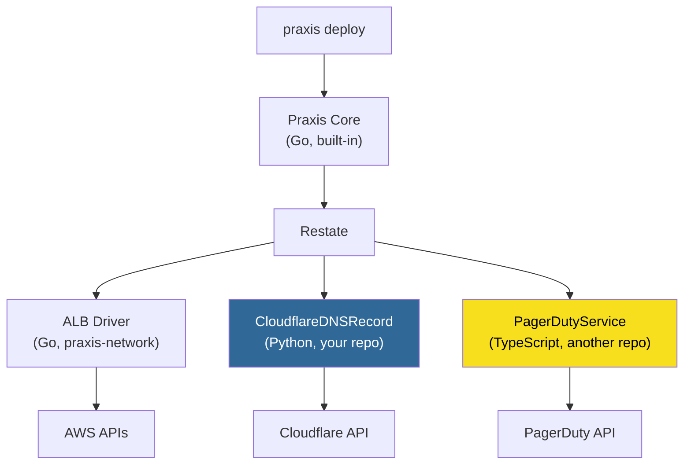

# Extending Praxis

How to add custom resource types, integrations, and automation to Praxis from a separate repository, in any language, without forking.

---

## Why Extensibility Matters

Praxis ships with 45 AWS drivers. Your team almost certainly manages things that aren't AWS resources: Datadog monitors, Cloudflare DNS records, PagerDuty services, GitHub repositories, Vault secrets, internal APIs. The traditional approach (fork the project, add your code, maintain a permanent divergence) is expensive and fragile.

Praxis avoids this entirely because of a foundational architectural choice: **Restate is the runtime, not Praxis.** Every Praxis component (Core, drivers, the event bus, the Concierge) is just a set of Restate services registered with the same Restate instance. Your custom extensions register the same way. Restate doesn't distinguish between "built-in" and "external" services. They're all peers.

This means:

- **No fork required.** Your extensions live in their own repository with their own release cycle.
- **Any language.** Restate has SDKs for Go, Python, TypeScript, Java, Kotlin, and Rust. Your extension doesn't need to be Go.
- **Full platform integration.** Custom drivers participate in DAG orchestration, output expression hydration, deployment state tracking, and event streaming, just like built-in drivers.
- **Independent scaling and deployment.** Your extension runs as its own container. Scale it, version it, and deploy it independently.

---

## How It Works

### Architecture Recap

Praxis uses Restate as its execution backbone. Every resource type is a [Restate Virtual Object](https://docs.restate.dev/develop/python/services#virtual-objects): a stateful, key-addressable entity with exclusive (single-writer) and shared (concurrent-read) handlers. The orchestrator dispatches work to drivers via durable Restate RPC, addressing them by **service name** and **key**.

```
Orchestrator → restate.Object("CloudflareDNSRecord", "example.com~api", "Provision") → your service
```

Restate handles discovery, routing, state storage, crash recovery, and exactly-once execution. The orchestrator doesn't care where the service is hosted or what language it's written in. It just needs the service name to exist in the Restate registry.

### The Extension Contract

To participate in the Praxis ecosystem, a custom driver must:

1. **Be a Restate Virtual Object** with a unique service name (e.g., `"CloudflareDNSRecord"`)
2. **Implement the handler contract:**

| Handler | Context | Signature | Purpose |
|---------|---------|-----------|---------|
| `Provision` | Exclusive | `(spec) → outputs` | Create or update the resource |
| `Delete` | Exclusive | `() → void` | Remove the resource |
| `Reconcile` | Exclusive | `() → reconcile_result` | Detect and optionally correct drift |
| `GetStatus` | Shared | `() → status_response` | Return current lifecycle status |
| `GetOutputs` | Shared | `() → outputs` | Return resource outputs |

3. **Register with the same Restate instance** that Praxis uses
4. **Optionally: provide a CUE schema** for template-time validation

That's it. No SDK to import from Praxis, no interface to implement, no plugin framework. The contract is the handler names and their input/output shapes.

### What You Get for Free

Once registered, your custom driver automatically participates in:

- **DAG orchestration.** Other resources can depend on your driver's outputs via `${resources.<name>.outputs.<field>}`
- **Deployment lifecycle.** The orchestrator tracks your resource's status alongside built-in resources
- **Exactly-once execution.** Restate journals every API call your driver makes; crash recovery replays the journal
- **Single-writer guarantee.** Concurrent provisions for the same resource key are serialized automatically
- **State management.** Restate's embedded K/V store holds your driver's state. No external database needed
- **Event streaming.** Resource lifecycle events flow through the Praxis event bus for observability, audit, and Slack notifications

---

## Real-World Example: Cloudflare DNS Driver in Python

Let's build a complete custom driver that manages Cloudflare DNS records. This is a realistic scenario: your team provisions AWS infrastructure with Praxis and needs DNS records created in Cloudflare as part of the same deployment.

The driver lives in its own repository, is written in Python, and integrates with a running Praxis instance by registering with Restate.

### Project Structure

```
cloudflare-dns-driver/
├── pyproject.toml
├── Dockerfile
├── driver.py          # Restate Virtual Object (the driver)
├── cloudflare_api.py  # Cloudflare API wrapper
├── types.py           # Spec, Outputs, State models
└── schema/
    └── cloudflare_dns.cue  # Optional: CUE schema for template validation
```

### 1. Define Your Types

```python
# types.py
from typing import TypedDict
from pydantic import BaseModel

class DNSRecordSpec(BaseModel):
    """Input spec: what the user declares in a CUE template."""
    zone_id: str
    name: str           # e.g., "api.example.com"
    type: str           # A, AAAA, CNAME, TXT, MX, etc.
    content: str        # e.g., "192.0.2.1" or target hostname
    ttl: int = 1        # 1 = automatic
    proxied: bool = False
    account: str = ""   # injected by orchestrator

class DNSRecordOutputs(BaseModel):
    """Outputs, available to downstream resources via expressions."""
    record_id: str
    name: str
    type: str
    content: str
    zone_id: str
    fqdn: str           # fully qualified domain name

class DriverState(BaseModel):
    """Persisted in Restate's K/V store."""
    desired: DNSRecordSpec | None = None
    outputs: DNSRecordOutputs | None = None
    status: str = "Pending"        # Pending | Provisioning | Updating | Ready | Error | Deleting | Deleted
    error: str = ""

class ReconcileResult(TypedDict):
    drift: bool
    correcting: bool
    error: str

class StatusResponse(TypedDict):
    status: str
    error: str
```

### 2. Wrap the Cloudflare API

```python
# cloudflare_api.py
import httpx

class CloudflareAPI:
    """Thin wrapper around Cloudflare's DNS API."""

    def __init__(self, api_token: str):
        self.client = httpx.AsyncClient(
            base_url="https://api.cloudflare.com/client/v4",
            headers={"Authorization": f"Bearer {api_token}"},
            timeout=30.0,
        )

    async def create_record(self, zone_id: str, record: dict) -> dict:
        resp = await self.client.post(f"/zones/{zone_id}/dns_records", json=record)
        resp.raise_for_status()
        return resp.json()["result"]

    async def get_record(self, zone_id: str, record_id: str) -> dict | None:
        resp = await self.client.get(f"/zones/{zone_id}/dns_records/{record_id}")
        if resp.status_code == 404:
            return None
        resp.raise_for_status()
        return resp.json()["result"]

    async def update_record(self, zone_id: str, record_id: str, record: dict) -> dict:
        resp = await self.client.put(
            f"/zones/{zone_id}/dns_records/{record_id}", json=record
        )
        resp.raise_for_status()
        return resp.json()["result"]

    async def delete_record(self, zone_id: str, record_id: str) -> None:
        resp = await self.client.delete(f"/zones/{zone_id}/dns_records/{record_id}")
        if resp.status_code != 404:
            resp.raise_for_status()
```

### 3. Implement the Driver

This is the core: a Restate Virtual Object that manages one DNS record per key.

```python
# driver.py
import os
import restate
from restate.exceptions import TerminalError
from datetime import timedelta

from types import DNSRecordSpec, DNSRecordOutputs, DriverState, ReconcileResult, StatusResponse
from cloudflare_api import CloudflareAPI

STATE_KEY = "state"
RECONCILE_INTERVAL = timedelta(minutes=5)

cf_driver = restate.VirtualObject("CloudflareDNSRecord")


def get_api() -> CloudflareAPI:
    token = os.environ.get("CLOUDFLARE_API_TOKEN", "")
    if not token:
        raise TerminalError("CLOUDFLARE_API_TOKEN not set")
    return CloudflareAPI(token)


# ── Exclusive Handlers ──────────────────────────────────────

@cf_driver.handler()
async def Provision(ctx: restate.ObjectContext, spec: DNSRecordSpec) -> DNSRecordOutputs:
    """Create or update a Cloudflare DNS record."""
    state = await ctx.get(STATE_KEY, type_hint=DriverState) or DriverState()
    state.desired = spec
    state.status = "Provisioning"
    state.error = ""
    ctx.set(STATE_KEY, state)

    api = get_api()

    # If we already have a record ID, update in place
    if state.outputs and state.outputs.record_id:
        record = await ctx.run_typed("update DNS record", api.update_record,
            zone_id=spec.zone_id,
            record_id=state.outputs.record_id,
            record={
                "type": spec.type,
                "name": spec.name,
                "content": spec.content,
                "ttl": spec.ttl,
                "proxied": spec.proxied,
            },
        )
    else:
        # Check if it already exists (idempotency)
        existing = await ctx.run_typed("check existing record", api.get_record,
            zone_id=spec.zone_id,
            record_id=state.outputs.record_id if state.outputs else "",
        )
        if existing:
            record = existing
        else:
            record = await ctx.run_typed("create DNS record", api.create_record,
                zone_id=spec.zone_id,
                record={
                    "type": spec.type,
                    "name": spec.name,
                    "content": spec.content,
                    "ttl": spec.ttl,
                    "proxied": spec.proxied,
                },
            )

    outputs = DNSRecordOutputs(
        record_id=record["id"],
        name=record["name"],
        type=record["type"],
        content=record["content"],
        zone_id=spec.zone_id,
        fqdn=record["name"],
    )
    state.outputs = outputs
    state.status = "Ready"
    ctx.set(STATE_KEY, state)

    # Schedule first reconciliation
    ctx.object_send(Reconcile, ctx.key(), send_delay=RECONCILE_INTERVAL)

    return outputs


@cf_driver.handler()
async def Delete(ctx: restate.ObjectContext) -> None:
    """Delete the DNS record from Cloudflare."""
    state = await ctx.get(STATE_KEY, type_hint=DriverState)
    if not state or not state.outputs:
        return

    state.status = "Deleting"
    ctx.set(STATE_KEY, state)

    api = get_api()
    await ctx.run_typed("delete DNS record", api.delete_record,
        zone_id=state.outputs.zone_id,
        record_id=state.outputs.record_id,
    )

    state.status = "Deleted"
    state.error = ""
    ctx.set(STATE_KEY, state)


@cf_driver.handler()
async def Reconcile(ctx: restate.ObjectContext) -> ReconcileResult:
    """Detect drift and correct it if the resource is managed."""
    state = await ctx.get(STATE_KEY, type_hint=DriverState)
    if not state or state.status in ("Deleted", "Deleting", "Pending"):
        return ReconcileResult(drift=False, correcting=False, error="")

    api = get_api()
    current = await ctx.run_typed("describe DNS record", api.get_record,
        zone_id=state.outputs.zone_id,
        record_id=state.outputs.record_id,
    )

    if current is None:
        state.status = "Error"
        state.error = "record not found in Cloudflare"
        ctx.set(STATE_KEY, state)
        ctx.object_send(Reconcile, ctx.key(), send_delay=RECONCILE_INTERVAL)
        return ReconcileResult(drift=True, correcting=False, error=state.error)

    # Check for drift on mutable fields
    drift = (
        current.get("content") != state.desired.content
        or current.get("ttl") != state.desired.ttl
        or current.get("proxied") != state.desired.proxied
    )

    if drift:
        await ctx.run_typed("correct drift", api.update_record,
            zone_id=state.outputs.zone_id,
            record_id=state.outputs.record_id,
            record={
                "type": state.desired.type,
                "name": state.desired.name,
                "content": state.desired.content,
                "ttl": state.desired.ttl,
                "proxied": state.desired.proxied,
            },
        )
        state.status = "Ready"
        state.error = ""
        ctx.set(STATE_KEY, state)

    # Schedule next reconciliation
    ctx.object_send(Reconcile, ctx.key(), send_delay=RECONCILE_INTERVAL)

    return ReconcileResult(drift=drift, correcting=drift, error="")


# ── Shared Handlers ─────────────────────────────────────────

@cf_driver.handler(kind="shared")
async def GetStatus(ctx: restate.ObjectSharedContext) -> StatusResponse:
    """Return the current resource status."""
    state = await ctx.get(STATE_KEY, type_hint=DriverState)
    if not state:
        return StatusResponse(status="Pending", error="")
    return StatusResponse(status=state.status, error=state.error)


@cf_driver.handler(kind="shared")
async def GetOutputs(ctx: restate.ObjectSharedContext) -> DNSRecordOutputs | None:
    """Return the resource outputs (record ID, FQDN, etc.)."""
    state = await ctx.get(STATE_KEY, type_hint=DriverState)
    if not state:
        return None
    return state.outputs


# ── Serve ────────────────────────────────────────────────────

app = restate.app([cf_driver])

if __name__ == "__main__":
    import hypercorn
    import hypercorn.asyncio
    import asyncio

    conf = hypercorn.Config()
    conf.bind = ["0.0.0.0:9080"]
    asyncio.run(hypercorn.asyncio.serve(app, conf))
```

### 4. Containerize

```dockerfile
# Dockerfile
FROM python:3.12-slim
WORKDIR /app
COPY pyproject.toml .
RUN pip install --no-cache-dir .
COPY . .
EXPOSE 9080
CMD ["python", "driver.py"]
```

### 5. Register with Restate

Your driver needs to reach the same Restate instance that Praxis uses. Registration is a single HTTP call to the Restate admin API:

```bash
# Register your custom driver with the Praxis Restate instance
curl -X POST http://localhost:9070/deployments \
  -H 'content-type: application/json' \
  -d '{"uri": "http://your-driver-host:9080"}'
```

That's it. Restate discovers the `CloudflareDNSRecord` Virtual Object and its handlers automatically via the service's discovery endpoint. No configuration in Praxis Core. No code changes anywhere.

### 6. Use It in a CUE Template

Now reference your custom driver alongside built-in Praxis resources:

```cue
// webapp-with-dns.cue
variables: {
    env:       string
    domain:    string
    zone_id:   string
}

resources: {
    // Built-in Praxis driver: provisions an ALB
    loadBalancer: {
        apiVersion: "praxis.io/v1"
        kind:       "ALB"
        metadata: name: "webapp-alb-\(variables.env)"
        spec: {
            region: "us-east-1"
            scheme: "internet-facing"
            subnets: ["subnet-abc", "subnet-def"]
            tags: Environment: variables.env
        }
    }

    // Your custom driver: creates a DNS record pointing to the ALB
    dnsRecord: {
        apiVersion: "praxis.io/v1"
        kind:       "CloudflareDNSRecord"
        metadata: name: "\(variables.domain)-\(variables.env)"
        spec: {
            zone_id: variables.zone_id
            name:    "\(variables.env).\(variables.domain)"
            type:    "CNAME"
            content: "${resources.loadBalancer.outputs.dnsName}"
            ttl:     300
            proxied: true
        }
    }
}
```

Deploy it:

```bash
praxis deploy webapp-with-dns.cue \
  --account prod \
  --var env=staging \
  --var domain=api.example.com \
  --var zone_id=abc123 \
  --key webapp-staging \
  --wait
```

The orchestrator:

1. Builds the DAG. `dnsRecord` depends on `loadBalancer` (via the output expression)
2. Dispatches `loadBalancer` to the built-in ALB driver
3. Waits for the ALB to provision, collects `dnsName` from its outputs
4. Hydrates the DNS record spec with the real ALB DNS name
5. Dispatches `dnsRecord` to your custom `CloudflareDNSRecord` driver
6. Reports the deployment as complete when both resources reach `Ready`

Your Python driver and the Go ALB driver run in different containers, different languages, different repositories, yet they participate in the same orchestrated deployment with full dependency resolution.

---

## How the Pieces Fit Together



Every box connected to Restate is a peer. Restate handles:
- **Discovery.** It queries each service's endpoint for handler metadata
- **Routing.** It dispatches calls by service name and key
- **State.** It provides the K/V store that each Virtual Object uses
- **Journaling.** It logs every side-effect for crash recovery and exactly-once semantics
- **Concurrency.** It enforces single-writer semantics per key

---

## Integration Patterns

### Pattern 1: Custom Resource Driver

The Cloudflare DNS example above. Register a new `kind` that the orchestrator can dispatch to. Use this when you want full lifecycle management (provision, delete, reconcile, drift detection) for a resource type Praxis doesn't support.

**Examples:** Cloudflare DNS, Datadog monitors, PagerDuty services, Vault secrets, GitHub repositories.

### Pattern 2: Event-Driven Automation

Subscribe to the Praxis event bus to trigger custom actions on deployment lifecycle events. Register a [Restate Basic Service](https://docs.restate.dev/develop/python/services#basic-services) that the Praxis event bus can call.

```python
# compliance_checker.py
import restate

checker = restate.Service("ComplianceChecker")

@checker.handler()
async def on_deployment_complete(ctx: restate.Context, event: dict) -> dict:
    """Called by the Praxis event bus when a deployment completes."""
    deployment_key = event.get("deployment_key", "")
    resources = event.get("resources", [])

    # Run your compliance checks
    violations = []
    for r in resources:
        result = await ctx.run_typed("check compliance", check_resource, resource=r)
        if not result["compliant"]:
            violations.append(result)

    if violations:
        await ctx.run_typed("notify", send_slack_alert, violations=violations)

    return {"compliant": len(violations) == 0, "violations": violations}

app = restate.app([checker])
```

Register a webhook sink in Praxis to route events to your service:

```bash
praxis notifications sink create \
  --name compliance \
  --type webhook \
  --url http://compliance-checker:9080/ComplianceChecker/on_deployment_complete \
  --filter "type=deployment.complete"
```

### Pattern 3: Custom CLI Tooling via the Restate HTTP API

Every Restate service is callable via HTTP. Build custom automation that talks directly to your custom drivers or to Praxis Core:

```python
import httpx

# Call your custom driver directly via Restate ingress
resp = httpx.post(
    "http://localhost:8080/CloudflareDNSRecord/staging.api.example.com/GetStatus",
)
print(resp.json())  # {"status": "Ready", "error": ""}

# Call a Praxis Core endpoint
resp = httpx.post(
    "http://localhost:8080/PraxisCommandService/Apply",
    json={
        "template": "webapp-with-dns",
        "account": "prod",
        "variables": {"env": "staging", "domain": "api.example.com"},
    },
)
```

---

## Adapter Registration (Advanced)

The examples above show drivers that the orchestrator dispatches to by service name. For full integration into the `praxis plan` workflow (pre-deployment diffs), your driver's `kind` needs to be known to Praxis Core's adapter registry. There are two approaches:

### Without Core Changes (Works Today)

The orchestrator dispatches to any Restate Virtual Object by `kind` → service name mapping. If the resource's `kind` in the CUE template matches the Restate Virtual Object service name, the orchestrator can dispatch to it directly. The only limitation: `praxis plan` won't show diffs for your custom kind, and the CLI won't validate the spec at plan time.

Deployments, lifecycle tracking, DAG resolution, and reconciliation all work without changes. This is the right starting point for most extensions.

### With Core Integration (Full Feature Parity)

To add `praxis plan` support and spec validation, implement an adapter in Go and register it in Praxis Core's provider registry. This requires a PR to the Praxis repo (or a fork) but is a small, well-contained change:

1. Add an adapter file: `internal/core/provider/cloudflaredns_adapter.go`
2. Register it in `internal/core/provider/registry.go`
3. Add a CUE schema: `schemas/cloudflare/dns_record.cue`

This is the same pattern used for every built-in AWS driver. See [DRIVERS.md](DRIVERS.md) for the full adapter specification.

> **Future direction:** A dynamic adapter registry that reads configuration at startup (service name, kind, key scope, schema URL) would eliminate the need for Go code changes entirely. This is tracked in the roadmap, and will be implemented in the future.

---

## Deployment Options

### Docker Compose (Local / Development)

Add your service to the existing Praxis `docker-compose.yaml` or keep it in your own Compose file on the same Docker network:

```yaml
# In your extension's docker-compose.yaml
services:
  cloudflare-dns-driver:
    build: .
    ports:
      - "9090:9080"
    environment:
      - CLOUDFLARE_API_TOKEN=${CLOUDFLARE_API_TOKEN}
    networks:
      - praxis_default  # join the Praxis network
```

Then register:

```bash
curl -X POST http://localhost:9070/deployments \
  -H 'content-type: application/json' \
  -d '{"uri": "http://cloudflare-dns-driver:9080"}'
```

### Kubernetes

Deploy your extension as a standard Kubernetes Deployment. Point the Restate registration to your service's ClusterIP:

```yaml
apiVersion: apps/v1
kind: Deployment
metadata:
  name: cloudflare-dns-driver
  namespace: praxis-system
spec:
  replicas: 1
  selector:
    matchLabels:
      app: cloudflare-dns-driver
  template:
    metadata:
      labels:
        app: cloudflare-dns-driver
    spec:
      containers:
        - name: driver
          image: your-registry/cloudflare-dns-driver:latest
          ports:
            - containerPort: 9080
          env:
            - name: CLOUDFLARE_API_TOKEN
              valueFrom:
                secretKeyRef:
                  name: cloudflare-credentials
                  key: api-token
---
apiVersion: v1
kind: Service
metadata:
  name: cloudflare-dns-driver
  namespace: praxis-system
spec:
  selector:
    app: cloudflare-dns-driver
  ports:
    - port: 9080
```

Register with the Restate instance in the cluster:

```bash
curl -X POST http://restate.praxis-system:9070/deployments \
  -H 'content-type: application/json' \
  -d '{"uri": "http://cloudflare-dns-driver.praxis-system:9080"}'
```

### Restate Cloud

If Praxis runs against [Restate Cloud](https://restate.dev/cloud/), register your extension against the same environment. Your service needs to be reachable from Restate Cloud (public endpoint or VPC peering).

---

## Guidelines for Extension Authors

### Naming

- Use a descriptive, unique service name: `CloudflareDNSRecord`, `DatadogMonitor`, `PagerDutyService`
- Avoid generic names that could collide with future Praxis built-ins

### State Management

- Store all driver state under a single key (convention: `"state"`) for atomic updates
- Include `desired`, `outputs`, `status`, and `error` in your state model
- Use Restate's K/V store. Don't introduce an external database

### Error Handling

- Throw `TerminalError` for permanent failures (invalid input, 404s, authorization errors)
- Let transient errors (rate limits, timeouts) propagate naturally. Restate will retry them up to 50 times (per `config.DefaultRetryPolicy()`), then **pause** the invocation for operator inspection
- Classify errors inside `ctx.run` callbacks, not after

### Reconciliation

- Schedule the next reconciliation via a delayed self-call: `ctx.object_send(Reconcile, ctx.key(), send_delay=...)`
- Check for drift on mutable fields only
- Don't schedule reconciliation after deletion

### Idempotency

- Always check if the resource exists before creating
- Use the same key for the same logical resource
- Handle "already exists" responses gracefully

### Security

- Never log or store API tokens in Restate state. Use environment variables or a secret manager
- Validate all input specs before making external API calls
- Use Restate's [request identity validation](https://docs.restate.dev/server/security#deployment-registration) in production

---

## Supported Restate SDKs

Extensions can be written in any language with a Restate SDK:

| Language | SDK | Virtual Objects | Production Ready |
|----------|-----|-----------------|-----------------|
| **Go** | [restatedev/sdk-go](https://github.com/restatedev/sdk-go) | Yes | Yes |
| **Python** | [restatedev/sdk-python](https://github.com/restatedev/sdk-python) | Yes | Yes |
| **TypeScript** | [restatedev/sdk-typescript](https://github.com/restatedev/sdk-typescript) | Yes | Yes |
| **Java** | [restatedev/sdk-java](https://github.com/restatedev/sdk-java) | Yes | Yes |
| **Kotlin** | [restatedev/sdk-java](https://github.com/restatedev/sdk-java) | Yes | Yes |
| **Rust** | [restatedev/sdk-rust](https://github.com/restatedev/sdk-rust) | Yes | Yes |

All SDKs implement the same Restate protocol. A Python driver and a Go driver are indistinguishable to Restate and to Praxis.

---

## Quick Reference

```bash
# 1. Run your extension service (any language, any host)
python driver.py  # or: go run ., npm start, cargo run

# 2. Register with Restate (one HTTP call)
curl -X POST http://localhost:9070/deployments \
  -H 'content-type: application/json' \
  -d '{"uri": "http://your-service:9080"}'

# 3. Use in CUE templates (reference by kind)
resources: {
    myResource: {
        apiVersion: "praxis.io/v1"
        kind:       "YourCustomKind"
        metadata: name: "my-resource"
        spec: { /* your driver's spec */ }
    }
}

# 4. Deploy as usual
praxis deploy template.cue --account prod --key my-deployment --wait
```

Three steps to extend, zero lines changed in Praxis.
