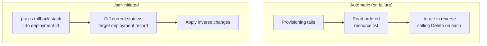

# FUTURE.md — Architectural Direction

> The following features are not yet implemented. Each section describes the technical approach for reference.
>
> Implemented capabilities such as the Restate command service, DAG-driven deployment orchestrator, built-in CLI, deployment state/index objects, deployment events stream, observe flow, AWS SSM resolver, Auth Service (credential management), Workspace Service (environment isolation), Concierge (AI assistant), and Slack Gateway are intentionally omitted.

---

## Kubernetes Integration

A Kubernetes driver service that manages Deployments, Services, and Ingresses in a target cluster.

**Technical approach:** A standard Restate Virtual Object driver that wraps the Kubernetes client-go SDK. Allows Praxis to orchestrate both cloud infrastructure and application deployment from a single composition — e.g. a compound template that provisions an RDS database and deploys a Kubernetes workload that connects to it.

---

## Cross-Stack References

Allow one deployment to reference the outputs of another deployment. A "networking" stack produces a VPC ID; an "application" stack consumes it.

**Technical approach:** Introduce a cross-stack reference syntax, e.g. `${ stacks["networking"].outputs["vpc"].vpcId }`. Core resolves these by querying the referenced deployment's stored outputs via `GetOutputs` on the Deployment Workflow. Requires that the referenced stack is already deployed and in a `Complete` state. Creates an implicit dependency edge between stacks for ordering during coordinated applies.

---

## Rollbacks

Revert a deployment to a previous known-good state when provisioning fails or on user request.

**Technical approach:** The Deployment Orchestrator already maintains the ordered list of provisioned resources. On failure, rollback iterates that list in reverse and calls `Delete` on each resource. For user-initiated rollbacks (`praxis rollback <stack> --to <deployment-id>`), Core diffs the current state against the target deployment record and applies the inverse changes. Deployment History provides the state snapshots needed for this.

---

## Create-Before-Destroy Lifecycle

When immutable field changes require recreation, the orchestrator provisions the replacement before deleting the old resource.

This is intentionally deferred. Implementing it properly requires the driver contract to support provisioning a second instance with a temporary key, swapping references in dependent resources, and then tearing down the old instance — all under transactional semantics that the current driver model doesn't support. The coordination complexity (temporary naming, reference swapping, partial-failure recovery) is significantly higher than `preventDestroy` or `ignoreChanges` and isn't worth the investment until there are concrete use cases driving the need.

---

## Multi-Cloud

Support for GCP and Azure as additional cloud providers.

**Technical approach:** The driver service model already supports this — each cloud provider is a set of independent driver services with their own container images and schemas. A GCP provider ships drivers for GCS, Cloud SQL, Compute Engine, etc. An Azure provider ships drivers for Blob Storage, Azure SQL, VMs, etc. v1 is AWS-only; this extends the provider ecosystem to other clouds.

---

## Cross-Account

Manage resources across multiple AWS accounts (or multiple GCP projects / Azure subscriptions) from a single Praxis instance.

**Technical approach:** Credential configuration per driver instance via IAM role assumption (AWS), service account impersonation (GCP), or managed identity (Azure). Templates specify the target account/project as a parameter. Core passes the credential context to the driver, which assumes the appropriate role before making API calls. Enables hub-and-spoke patterns where a central platform team manages infrastructure across many workload accounts. The Auth Service already handles per-account credential resolution and STS AssumeRole — the remaining work is multi-account orchestration logic in Core and per-resource account overrides in templates.

---

## Additional Secret Backends

Extend beyond AWS SSM to support other secret stores.

**Technical approach:** Pluggable resolver interface behind the `ssm://` protocol. Add backends for AWS Secrets Manager, HashiCorp Vault, GCP Secret Manager, Azure Key Vault. Each backend implements a `Resolve(path) → value` interface. The URI scheme determines which backend handles the request (e.g. `vault:///secret/data/db-password`).

---

## Partial / Speculative Provisioning

Start provisioning long-running resources (e.g. RDS: 5–15 min) with a partial spec, then apply remaining fields as an in-place update after creation.

**Technical approach:** Extends the driver service contract with a two-phase model: `ProvisionPartial` (create with available fields) → await dependent outputs → `ProvisionUpdate` (apply remaining fields). Optimization for deployment speed; not needed until creation latency becomes a pain point.

---

## Central Rate Limit Advisor

Shared service that aggregates AWS API usage across all drivers and signals "slow down" when approaching account-level limits.

**Technical approach:** Drivers report API call counts to a central Virtual Object. The advisor tracks aggregate usage per API per account and returns throttle signals. Supplements per-driver rate limiting for high-scale deployments with many concurrent driver instances.
