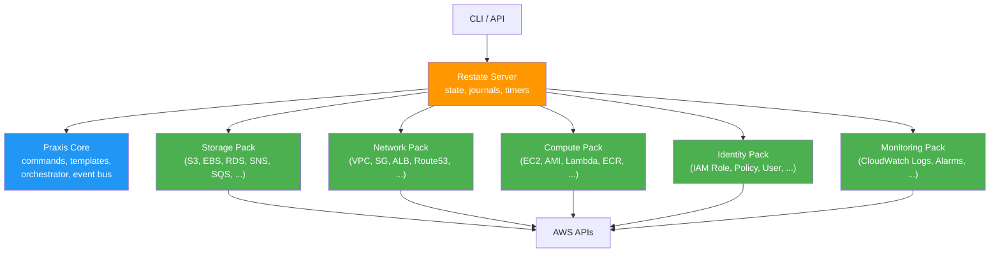
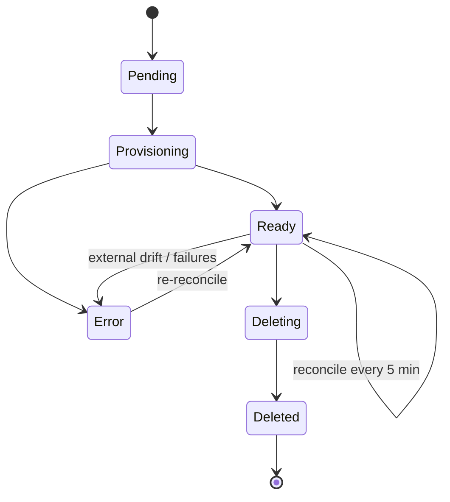
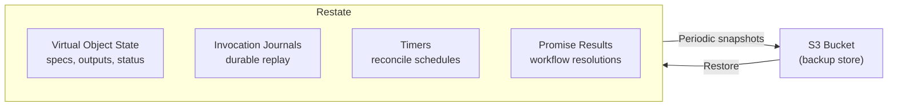

# Operators Guide

This guide is for platform engineers who deploy, configure, and maintain a Praxis stack.

## Deployment Model

Praxis consists of three service tiers, all fronted by a Restate server:



| Component          | Description                                          | Scaling                                    |
|--------------------|------------------------------------------------------|--------------------------------------------|
| **Restate Server** | Durable execution engine — state, journals, timers   | Single instance (or HA cluster)            |
| **Praxis Core**    | Command service, template engine, orchestrator, event bus + notification sinks | Stateless; scale horizontally              |
| **Driver Packs**   | Domain-grouped drivers (storage, network, compute, identity, monitoring) | Stateless; scale horizontally per domain   |

Every component is shipped as a Docker image. The reference topology is captured in [docker-compose.yaml](../docker-compose.yaml).

### Decoupled Architecture

Every Praxis component is fully decoupled. Restate, Praxis Core, and each driver are independent processes that communicate exclusively through Restate's invocation protocol. There is no shared memory, no sidecar coupling, and no requirement that any two components run on the same host, in the same cluster, or even in the same region.

This means:

- **Restate can run anywhere**: self-hosted on a VM, as a container in your cluster, or on [Restate Cloud](https://restate.dev/cloud/) as a fully managed service. Praxis services only need HTTP connectivity to Restate's ingress and admin endpoints.
- **Each driver pack is independently deployable**: The storage pack can run on a different machine (or in a different cloud) from the network pack. Add a new driver to the appropriate pack without touching other packs. Remove a pack by deregistering it from Restate.
- **Praxis Core is stateless**: It holds no local state — all durable state lives in Restate. Run one replica or ten; Restate routes invocations.
- **Drivers are stateless**: All resource state (desired spec, observed state, outputs, status) is stored in Restate Virtual Objects. Driver processes can be replaced, restarted, or scaled without data loss.

The only coupling point is Restate itself, which acts as the message bus, state store, and timer service. As long as every Praxis component can reach Restate over HTTP, the topology is arbitrary.

### Restate Hosting Options

| Option | Description | Best For |
|---|---|---|
| **Single instance** | One Restate container (the docker-compose default) | Local dev, small deployments |
| **HA cluster** | Multi-node Restate with replicated log storage | Production self-hosted deployments |
| **Restate Cloud** | Fully managed Restate — no infrastructure to operate | Production with minimal ops overhead |

For self-hosted HA, Restate stores its log and state snapshots in an object store (S3). See [State & Backups](#state--backups) for details.

For Restate Cloud, replace the Restate admin/ingress URLs in your configuration with the cloud-provided endpoints. All Praxis services register against Restate Cloud the same way they register against a local instance — the protocol is identical.

### Port Map (Reference Stack)

| Service           | Container Port | Host Port | Purpose              |
|-------------------|---------------|-----------|----------------------|
| Restate           | 8080          | 8080      | Ingress (CLI + API)  |
| Restate           | 9070          | 9070      | Admin API            |
| Restate           | 9071          | 9071      | Metrics              |
| Praxis Core       | 9080          | 9083      | Restate endpoint     |
| Storage Pack      | 9080          | 9081      | Restate endpoint     |
| Network Pack      | 9080          | 9082      | Restate endpoint     |
| Compute Pack      | 9080          | 9084      | Restate endpoint     |
| Identity Pack     | 9080          | 9085      | Restate endpoint     |
| Monitoring Pack   | 9080          | 9087      | Restate endpoint     |
| Moto        | 4566          | 4566      | Mock AWS (local dev) |

### Network Exposure

**The Restate ingress (8080) and admin API (9070) must never be reachable from untrusted networks.** The ingress performs no authentication, and Praxis exposes credential management over it: `AuthService/<alias>/GetCredentials` returns plaintext AWS credentials to any caller, and `Configure` accepts credential changes from any caller. The admin API can register arbitrary new service endpoints. Treat network access to these ports as equivalent to administrator access to every registered AWS account. See [Auth & Workspaces — Security Model](AUTH.md#security-model-the-ingress-is-the-trust-boundary) for the full threat model.

Defaults are private — keep them that way:

- **Docker Compose** binds all ports to `127.0.0.1`. Do not rebind to `0.0.0.0` on a shared host without a firewall in front.
- **Helm chart** creates `ClusterIP` services only. Do not convert them to `LoadBalancer`/`NodePort` or add an Ingress for ports 8080/9070. Add a NetworkPolicy restricting traffic to the workloads that legitimately call Praxis (CI runners, operator tooling).
- **Remote access** belongs behind an authenticating layer: VPN, SSH tunnel, or an mTLS/OIDC reverse proxy that terminates TLS — or use [Restate Cloud](https://restate.dev/cloud/), whose ingress requires API keys.
- The driver-pack endpoint ports (9080-9087) only need to be reachable *from Restate*, nowhere else.

### Kubernetes Deployment (Helm)

The recommended way to deploy Praxis on Kubernetes is with the Helm chart
attached to the mutable GitHub alpha release. The chart deploys Praxis Core,
all driver packs, and optionally a bundled Restate instance, or points to an
external one such as Restate Cloud.

```bash
# Deploy with bundled Restate
helm install praxis https://github.com/shirvan/praxis/releases/download/alpha/praxis-alpha-chart.tgz \
  --namespace praxis-system --create-namespace \
  --set aws.region=us-east-1 \
  --set account.credentialSource=default

# Deploy with Restate Cloud (no bundled Restate)
helm install praxis https://github.com/shirvan/praxis/releases/download/alpha/praxis-alpha-chart.tgz \
  --namespace praxis-system --create-namespace \
  --set restate.enabled=false \
  --set restate.external.ingressUrl=https://<env>.dev.restate.cloud:8080 \
  --set restate.external.adminUrl=https://<env>.dev.restate.cloud:9070

# Wait for readiness
kubectl -n praxis-system wait --for=condition=ready pod \
  -l app.kubernetes.io/part-of=praxis --timeout=120s

# Enable autoscaling for driver packs
helm upgrade praxis https://github.com/shirvan/praxis/releases/download/alpha/praxis-alpha-chart.tgz \
  --namespace praxis-system \
  --set drivers.network.autoscaling.enabled=true \
  --set drivers.compute.autoscaling.enabled=true
```

The Helm chart handles service registration with Restate automatically via a post-install Job.

Key Helm values:

| Value | Default | Description |
|-------|---------|-------------|
| `restate.enabled` | `true` | Deploy a bundled Restate StatefulSet |
| `restate.external.ingressUrl` | `""` | Restate ingress URL (required when `restate.enabled=false`) |
| `restate.external.adminUrl` | `""` | Restate admin URL (required when `restate.enabled=false`) |
| `aws.region` | `us-east-1` | Default AWS region |
| `account.credentialSource` | `default` | `static`, `role`, or `default` |
| `drivers.<name>.autoscaling.enabled` | `false` | Enable HPA for a driver pack |

See [`charts/praxis/values.yaml`](../charts/praxis/values.yaml) for the full set of configurable values.

### Raw Manifests (Without Helm)

For environments where Helm is not available, raw Kubernetes manifests are provided in [`examples/ops/k8s/`](../examples/ops/k8s/). These do **not** include Restate — you must configure the `PRAXIS_RESTATE_ENDPOINT` ConfigMap entry to point at your Restate instance.

| Manifest | Description |
|----------|-------------|
| [`praxis-full.yaml`](../examples/ops/k8s/praxis-full.yaml) | Namespace, ConfigMap, Praxis Core + all driver packs as Deployments + Services |
| [`praxis-autoscaling.yaml`](../examples/ops/k8s/praxis-autoscaling.yaml) | HorizontalPodAutoscalers that scale driver packs based on CPU demand |

```bash
# Edit the ConfigMap in praxis-full.yaml with your Restate endpoint and AWS credentials
kubectl apply -f examples/ops/k8s/praxis-full.yaml

# Wait for readiness
kubectl -n praxis-system wait --for=condition=ready pod \
  -l app.kubernetes.io/part-of=praxis --timeout=120s

# Register each service with Restate
for svc in praxis-core praxis-storage praxis-compute praxis-network \
           praxis-identity praxis-monitoring; do
  curl -X POST http://<RESTATE_ADMIN>:9070/deployments \
    -H 'content-type: application/json' \
    -d "{\"uri\": \"http://${svc}.praxis-system:9080\", \"force\": true}"
done

# (Optional) Enable autoscaling
kubectl apply -f examples/ops/k8s/praxis-autoscaling.yaml
```

## Quick Start (Published Alpha)

The supported evaluation path uses the artifacts attached to the mutable
[GitHub alpha release](https://github.com/shirvan/praxis/releases/tag/alpha).
It does not require Go, `just`, or a repository clone.

### Prerequisite

- Docker with Docker Compose

### Start the Stack

Download the CLI archive for your platform, `checksums.txt`, and
`praxis-alpha-quickstart.tar.gz`. Verify the archives, install the CLI on your
`PATH`, then run:

```bash
tar -xzf praxis-alpha-quickstart.tar.gz
cd praxis-alpha-quickstart
./praxis-up

praxis version
praxis list schemas
```

The bundle pulls Praxis Core and all five driver-pack images at the single
supported `:alpha` tag, then starts and registers them with Restate. Moto is
included for local evaluation.

```bash
praxis plan bucket.cue --account local
praxis deploy bucket.cue --account local --key quickstart --yes --wait
praxis delete Deployment/quickstart --yes --wait
./praxis-down
```

Alpha revisions may change the contract without backwards compatibility.
Update the CLI, all service images, chart, schemas, and templates together.

For repository builds, local service development, logs, Moto helpers, and
individual test recipes, see the [developer guide](DEVELOPERS.md).

## Configuration

Praxis Core and every driver load the same `.env` file. Copy `.env.example` to `.env` next to `docker-compose.yaml` before starting.

### Runtime Settings

| Variable                  | Default          | Description                               |
|---------------------------|------------------|-------------------------------------------|
| `PRAXIS_LISTEN_ADDR`      | `0.0.0.0:9080`  | HTTP listen address for Restate SDK       |
| `PRAXIS_RESTATE_ENDPOINT` | `http://localhost:8080` | Restate ingress URL (Core + CLI)   |
| `PRAXIS_SCHEMA_DIR`       | `./schemas`      | Filesystem path to the CUE schema bundle  |
| `AWS_ENDPOINT_URL`        | *(empty)*        | AWS endpoint override (e.g. `http://moto:4566`) |

### Account Settings

| Variable                            | Required          | Description                                          |
|-------------------------------------|-------------------|------------------------------------------------------|
| `PRAXIS_ACCOUNT_NAME`               | Yes               | Account name users pass as `--account`               |
| `PRAXIS_ACCOUNT_REGION`             | Yes               | Default AWS region for this account                  |
| `PRAXIS_ACCOUNT_CREDENTIAL_SOURCE`  | Yes               | `static`, `role`, or `default`                       |
| `PRAXIS_ACCOUNT_ACCESS_KEY_ID`      | For `static`      | Access key for static credentials                    |
| `PRAXIS_ACCOUNT_SECRET_ACCESS_KEY`  | For `static`      | Secret key for static credentials                    |
| `PRAXIS_ACCOUNT_ROLE_ARN`           | For `role`        | Role ARN Praxis should assume                        |
| `PRAXIS_ACCOUNT_EXTERNAL_ID`        | Optional          | External ID for role assumption                      |

Praxis currently supports exactly one configured account per deployed stack. Users select the account by name via `--account` or `PRAXIS_ACCOUNT`.

**Credential sources:**

- **static** — Explicit access key + secret key. Set both `PRAXIS_ACCOUNT_ACCESS_KEY_ID` and `PRAXIS_ACCOUNT_SECRET_ACCESS_KEY`.
- **role** — Assume `PRAXIS_ACCOUNT_ROLE_ARN` using the container's identity. Optionally set `PRAXIS_ACCOUNT_EXTERNAL_ID`.
- **default** — Use the standard AWS credential chain (instance profile, environment, config file).

## Restate Administration

### Register Endpoints

Each Praxis service must be registered with Restate before it can receive invocations. The `just register` recipe handles this automatically:

```bash
just register
```

For manual registration or debugging:

```bash
# Register Storage driver pack
curl -X POST http://localhost:9070/deployments \
  -H 'content-type: application/json' \
  -d '{"uri": "http://praxis-storage:9080"}'

# Register Network driver pack
curl -X POST http://localhost:9070/deployments \
  -H 'content-type: application/json' \
  -d '{"uri": "http://praxis-network:9080"}'

# Register Compute driver pack
curl -X POST http://localhost:9070/deployments \
  -H 'content-type: application/json' \
  -d '{"uri": "http://praxis-compute:9080"}'

# Register Identity driver pack
curl -X POST http://localhost:9070/deployments \
  -H 'content-type: application/json' \
  -d '{"uri": "http://praxis-identity:9080"}'

# Register Monitoring driver pack
curl -X POST http://localhost:9070/deployments \
  -H 'content-type: application/json' \
  -d '{"uri": "http://praxis-monitoring:9080"}'

# Register Praxis Core
curl -X POST http://localhost:9070/deployments \
  -H 'content-type: application/json' \
  -d '{"uri": "http://praxis-core:9080"}'
```

### Verify Registration

```bash
# List registered services
curl http://localhost:9070/services | jq '.services[].name'

# List deployments
curl http://localhost:9070/deployments | jq .
```

## Monitoring

### Health Checks

| Endpoint                                    | Checks             |
|---------------------------------------------|---------------------|
| `GET http://localhost:9070/health`           | Restate server      |
| `GET http://localhost:4566/moto-api/` | Moto (dev)  |

For Praxis services, verify registration via `just rs-services` or `just doctor`.

### Observability

- **Restate metrics**: Exposed on port 9071. Scrape with Prometheus or your preferred tool.
- **Structured logs**: All Praxis services emit JSON logs via Go's `slog` package. Collect with your log aggregation tool.
- **Deployment events**: Use `praxis observe Deployment/<key>` to stream real-time progress.

## Resource Lifecycle

Every managed resource follows this state machine:



### Status Meanings

| Status         | Description                                             |
|----------------|---------------------------------------------------------|
| `Pending`      | Declared but not yet provisioned                        |
| `Provisioning` | Provision handler executing                             |
| `Ready`        | Resource exists and matches desired state               |
| `Error`        | Something went wrong — check the error field            |
| `Deleting`     | Delete handler executing                                |
| `Deleted`      | Resource removed (tombstone for audit trail)            |

### Modes

| Mode       | Behavior                                                    |
|------------|-------------------------------------------------------------|
| `Managed`  | Full lifecycle: provision, reconcile, correct drift, delete |
| `Observed` | Import-only: detect drift but never modify the resource     |

### Lifecycle Rules

Templates can declare protective **lifecycle rules** on individual resources:

- **`preventDestroy: true`** — blocks deletion of the resource. `praxis delete` fails with a terminal error until the rule is removed from the template and re-applied. As an escape hatch, `praxis delete --force` overrides this protection — an audit event (`dev.praxis.policy.force_delete_override`) is emitted for each overridden resource.
- **`ignoreChanges: ["field.path", ...]`** — skips drift correction for the listed spec fields. Drift in those fields is detected but not corrected, allowing external systems to co-manage them.

Lifecycle rules are visible in deployment details and plan output. See [Templates — Lifecycle Rules](TEMPLATES.md#lifecycle-rules) for syntax.

### Immutable Field Changes

Some cloud resource fields cannot be modified after creation (e.g., VPC CIDR block, target group protocol). When `praxis plan` detects such changes, it flags them as "(immutable, requires replacement)" and suggests either:

- **`--replace <resource>`** — explicitly target specific resources for destroy-then-recreate.
- **`--allow-replace`** — automatically replace any resource that fails with a 409 immutable-field conflict during provisioning. Resources with `lifecycle.preventDestroy` are still protected.

### Resource Statuses

During orchestration, each resource transitions through these statuses:

| Status | Meaning |
|--------|---------|
| `Pending` | Queued, waiting for dependencies |
| `Provisioning` | Driver has been dispatched for initial creation |
| `Updating` | Driver has been dispatched for an update (resource existed in prior generation) |
| `Ready` | Completed successfully |
| `Error` | Driver returned an error |
| `Skipped` | Bypassed due to dependency failure or cancellation |
| `Deleting` | Delete operation in progress |
| `Deleted` | Successfully removed |

## Approval Gates

Protected workspaces require an explicit operator decision before any
deployment into them dispatches a single resource. The deployment workflow
computes its full plan, transitions to `AwaitingApproval`, and suspends on a
Restate durable promise — at zero cost, surviving restarts, for as long as the
decision takes.

### Protecting a Workspace

```bash
# At creation
praxis create workspace prod --account prod-us --region us-east-1 --protected

# Existing workspaces: re-run Configure with the flag (configuration is an upsert)
praxis create workspace prod --account prod-us --region us-east-1 --protected
```

Every subsequent `praxis deploy`/`praxis apply` targeting the workspace stops
at the gate. Deployments without a workspace, or into unprotected workspaces,
are unaffected.

### The Operator Flow

```bash
# 1. Someone deploys into the protected workspace
praxis deploy stack.cue --workspace prod --key payments --wait
# → Status: AwaitingApproval
# → Deployment "payments" is awaiting approval.
#   Run 'praxis approve payments' to resume it or 'praxis reject payments' to cancel it.

# 2. Inspect what is about to happen
praxis get Deployment/payments        # status, resources, inputs
praxis observe Deployment/payments    # live event stream

# 3. Decide
praxis approve payments --comment "change CAB-1402"
# or
praxis reject payments --comment "outside the change window"
```

Approval resumes the workflow exactly where it suspended; the plan that was
computed at submit time is what executes. Rejection finalizes the deployment
as `Cancelled` without touching the cloud.

While a deployment is `AwaitingApproval`:

- Re-applying the same deployment key is rejected with a conflict (409) until
  the gate is decided.
- `praxis list deployments` and `praxis get` show the `AwaitingApproval`
  status.
- A Restate restart does not lose the gate — the suspended workflow resumes
  waiting after recovery.

### Audit Trail

Every decision lands in the deployment event stream:

| Event | When |
|-------|------|
| `dev.praxis.deployment.approval.requested` | The deployment suspended at the gate |
| `dev.praxis.deployment.approval.approved`  | An operator approved; carries `decidedBy` and `comment` |
| `dev.praxis.deployment.approval.rejected`  | An operator rejected; carries `decidedBy` and `comment` |

`--decided-by` overrides the recorded identity (it defaults to the local OS
username); `--comment` attaches the rationale. Route the events to a webhook
or `restate_rpc` notification sink to feed change-management systems.

## Point-in-Time Rollback

Every apply records its full plan as a **generation** snapshot (the most
recent 10 are retained per deployment). Rolling back replays a known-good
generation's plan through the normal apply machinery:

- specs that changed since are converged back,
- resources **added** since are deleted,
- resources **removed** since are re-provisioned.

```bash
# 1. See what you can roll back to
praxis list generations payments
# GENERATION  CREATED               STATUS    RESOURCES  TEMPLATE
# 1           2026-06-12T09:14:02Z  Complete  4          inline://template.cue
# 2           2026-06-12T11:30:45Z  Failed    5          inline://template.cue

# 2. Roll back to the last known-good generation
praxis rollback payments --to 1 --wait
```

Rules of the road:

- Only generations that finished `Complete` are valid targets; anything else
  is rejected with a conflict.
- The rollback is itself a new generation (with `rollback://gen-<N>`
  provenance in its template path), so it is snapshotted and roll-back-able.
- Rollbacks pass the standard submit guard and — in protected workspaces —
  the approval gate.
- Generations older than the retention window lose their snapshots and can
  no longer be targets.

Not to be confused with `praxis delete Deployment/<key> --rollback`, which
cleans up a **failed** deployment by deleting its confirmed-provisioned
resources; point-in-time rollback *restores* a previous good state.

## Reconciliation

Drivers reconcile automatically on a **5-minute interval** using Restate durable timers. During each cycle:

1. The driver reads actual cloud state via the provider API
2. Compares against the desired spec stored in the Virtual Object
3. **Managed mode**: Corrects any drift by re-applying the configuration
4. **Observed mode**: Reports drift without correcting

The reconcile loop survives process restarts — Restate's durable timers ensure the next cycle fires even if the driver container is replaced.

### On-Demand Reconciliation

To trigger reconciliation immediately without waiting for the 5-minute timer:

```bash
praxis reconcile S3Bucket/my-bucket
praxis reconcile EC2Instance/us-east-1~web-server
praxis reconcile SecurityGroup/vpc-123~web-sg -o json
```

This is useful after manual AWS console changes, when diagnosing Error status, or in CI/CD pipelines that need to confirm resource state. See `praxis reconcile --help` or the [CLI reference](CLI.md#reconcile) for full details.

### External Deletion

If a resource is deleted outside Praxis, the driver transitions to `Error` status with a descriptive message. It does **not** re-provision automatically — an operator must explicitly re-apply to recreate the resource.

## State & Backups

Praxis stores **zero state locally**. All durable state — Virtual Object key-value pairs, invocation journals, timer schedules — lives inside Restate. This is what makes every Praxis service stateless and freely replaceable.



### What Restate Stores

| Data | Purpose |
|---|---|
| Virtual Object state | Desired spec, observed state, outputs, status, generation counters for every managed resource |
| Invocation journals | Step-by-step execution log for durable replay on failure |
| Timers | Scheduled reconciliation callbacks (one per managed resource) |
| Promise results | Workflow promise resolutions |

### Backup Strategy

Restate persists its log and periodic state snapshots to an S3-compatible object store. This is Restate's built-in durability mechanism — not a Praxis feature, but the foundation Praxis depends on.

For **self-hosted Restate** (single instance or HA cluster), configure the snapshot and log storage backend to write to S3:

```toml
# restate.toml (relevant excerpt)
[worker.snapshots]
destination = "s3://my-restate-snapshots/praxis/"
```

Restate automatically takes periodic snapshots of Virtual Object state and trims the write-ahead log. On recovery, Restate restores from the latest snapshot and replays any remaining log entries.

For **Restate Cloud**, snapshot storage and replication are managed by the service — no operator configuration needed.

### Recovery Model

Because Praxis services are stateless:

1. **Lost a driver container?** Start a new one and re-register it. Restate replays any in-flight invocations from the journal.
2. **Lost Praxis Core?** Same — start a new one. All template and deployment state is in Restate.
3. **Lost Restate?** Restore from S3 snapshots. Restate recovers all Virtual Object state, pending timers, and in-flight journals. Praxis services resume exactly where they left off.

There is nothing to back up on the Praxis side. Back up Restate's S3 bucket and you have the entire system state.

## Troubleshooting

### Unknown account

```text
unknown account "production"
```

Verify `PRAXIS_ACCOUNT_NAME` in `.env` matches the name users pass with `--account` or in their template's `variables.account`.

### Credentials valid but AWS calls fail

Check that the credential source matches the environment:

- **static**: Both `PRAXIS_ACCOUNT_ACCESS_KEY_ID` and `PRAXIS_ACCOUNT_SECRET_ACCESS_KEY` are set
- **role**: The container identity can assume `PRAXIS_ACCOUNT_ROLE_ARN`
- **default**: A working AWS credential chain is available (instance profile, env vars, config)

### Driver not registered

```bash
# Re-register all endpoints
just register

# Verify
just rs-services
```

### Provision returns 409

The resource already exists but is owned by another AWS account or was created outside Praxis. Use `praxis import` instead, or confirm the selected Praxis account matches the target AWS identity.

### Delete returns 409

The resource is not empty (e.g., S3 bucket with objects). Empty it manually, then retry the delete.

### Reconcile shows Error status

Check the error field with `praxis get <Kind>/<Key>`. To trigger an immediate
reconciliation and see the current drift status:

```bash
praxis reconcile <Kind>/<Key>
```

### Invocation paused (retry exhausted)

All Praxis services are configured with a bounded retry policy (`config.DefaultRetryPolicy()`): 50 attempts with exponential backoff (100ms → 60s cap). When retries are exhausted, Restate **pauses** the invocation rather than retrying forever. This prevents orphan invocations that run for hours.

To check for paused invocations:

```bash
restate invocations list --status paused
```

To inspect a specific invocation:

```bash
restate invocations describe <invocation_id>
```

To resume after fixing the underlying issue (e.g., IAM permissions, credential expiry):

```bash
restate invocations resume <invocation_id>
```

To cancel a paused invocation that is no longer needed:

```bash
restate invocations cancel <invocation_id>
```

Common causes of retry exhaustion:

- **IAM misconfiguration** — `AccessDenied` errors that won't self-heal
- **Expired credentials** — stale STS tokens that keep failing
- **Persistent throttling** — sustained AWS rate limiting beyond the retry window
- **Resource in unexpected state** — e.g., an EC2 instance that never reaches `running`

Common causes:

- IAM permissions insufficient for the operation
- Resource deleted externally (re-apply to recreate)
- AWS API throttling (will auto-retry via Restate up to 50 attempts; pauses if exhausted)

### Stack fails to start

```bash
# Check container status
just status

# Check health endpoints
just doctor

# View all logs
just logs-all
```
