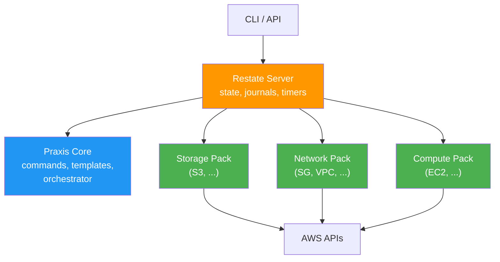
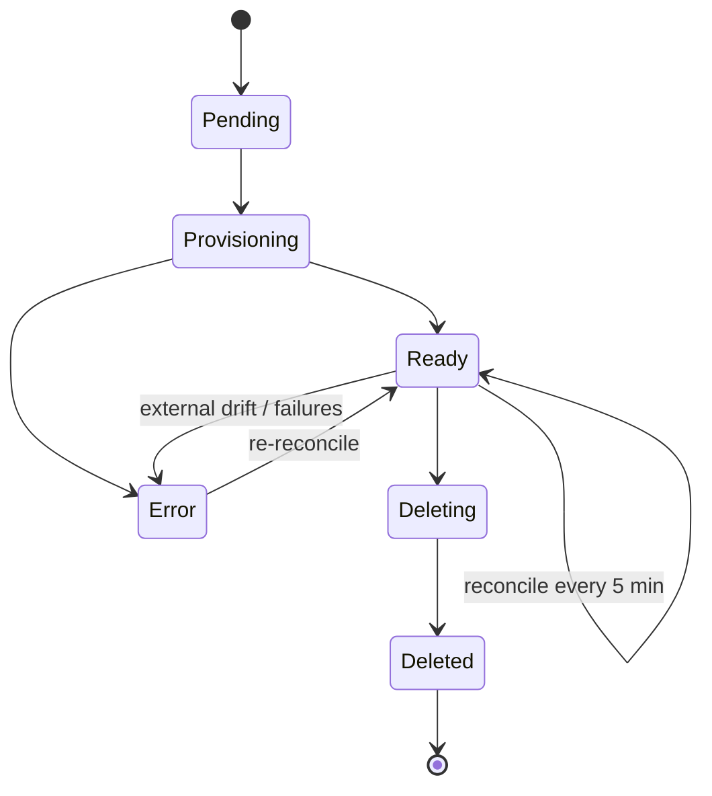
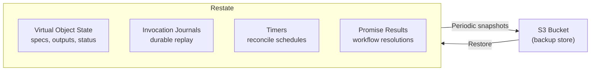

# Operators Guide

This guide is for platform engineers who deploy, configure, and maintain a Praxis stack.

## Deployment Model

Praxis consists of three service tiers, all fronted by a Restate server:



| Component          | Description                                          | Scaling                                    |
|--------------------|------------------------------------------------------|--------------------------------------------|
| **Restate Server** | Durable execution engine — state, journals, timers   | Single instance (or HA cluster)            |
| **Praxis Core**    | Command service, template engine, orchestrator       | Stateless; scale horizontally              |
| **Driver Packs**   | Domain-grouped drivers (storage, network, compute)   | Stateless; scale horizontally per domain   |

Every component is shipped as a Docker image. The reference topology is captured in [docker-compose.yaml](../docker-compose.yaml).

### Decoupled Architecture

Every Praxis component is fully decoupled. Restate, Praxis Core, and each driver are independent processes that communicate exclusively through Restate's invocation protocol. There is no shared memory, no sidecar coupling, and no requirement that any two components run on the same host, in the same cluster, or even in the same region.

This means:

- **Restate can run anywhere**: self-hosted on a VM, as a container in your cluster, or on [Restate Cloud](https://restate.dev/cloud/) as a fully managed service. Praxis services only need HTTP connectivity to Restate's ingress and admin endpoints.
- **Each driver pack is independently deployable**: The storage pack can run on a different machine (or in a different cloud) from the network pack. Add a new driver to the appropriate pack without touching other packs. Remove a pack by deregistering it from Restate.
- **Praxis Core is stateless**: It holds no local state — all durable state lives in Restate. Run one replica or ten; Restate routes invocations.
- **Drivers are stateless**: All resource state (desired spec, observed state, outputs, status) is stored in Restate Virtual Objects. Driver processes can be replaced, restarted, or scaled without data loss.

The only coupling point is Restate itself, which acts as the message bus, state store, and timer service. As long as every Praxis component can reach Restate over HTTP, the topology is arbitrary.

### Restate Hosting Options

| Option | Description | Best For |
|---|---|---|
| **Single instance** | One Restate container (the docker-compose default) | Local dev, small deployments |
| **HA cluster** | Multi-node Restate with replicated log storage | Production self-hosted deployments |
| **Restate Cloud** | Fully managed Restate — no infrastructure to operate | Production with minimal ops overhead |

For self-hosted HA, Restate stores its log and state snapshots in an object store (S3). See [State & Backups](#state--backups) for details.

For Restate Cloud, replace the Restate admin/ingress URLs in your configuration with the cloud-provided endpoints. All Praxis services register against Restate Cloud the same way they register against a local instance — the protocol is identical.

### Port Map (Reference Stack)

| Service           | Container Port | Host Port | Purpose              |
|-------------------|---------------|-----------|----------------------|
| Restate           | 8080          | 8080      | Ingress (CLI + API)  |
| Restate           | 9070          | 9070      | Admin API            |
| Restate           | 9071          | 9071      | Metrics              |
| Praxis Core       | 9080          | 9083      | Restate endpoint     |
| Storage Pack      | 9080          | 9081      | Restate endpoint     |
| Network Pack      | 9080          | 9082      | Restate endpoint     |
| Compute Pack      | 9080          | 9084      | Restate endpoint     |
| LocalStack        | 4566          | 4566      | Mock AWS (local dev) |

### Kubernetes Example

In production, each Praxis service runs as a separate Kubernetes Deployment behind an Ingress (or directly reachable by Restate via cluster DNS). Restate itself can be Restate Cloud or a self-hosted StatefulSet.

The example below deploys the storage driver pack and registers it with Restate Cloud. The same pattern applies to every other driver pack and Praxis Core.

```yaml
apiVersion: apps/v1
kind: Deployment
metadata:
  name: praxis-storage
spec:
  replicas: 2
  selector:
    matchLabels:
      app: praxis-storage
  template:
    metadata:
      labels:
        app: praxis-storage
    spec:
      containers:
        - name: praxis-storage
          image: ghcr.io/shirvan/praxis-storage:latest
          ports:
            - containerPort: 9080
          env:
            - name: PRAXIS_LISTEN_ADDR
              value: "0.0.0.0:9080"
          envFrom:
            - secretRef:
                name: praxis-aws-credentials
---
apiVersion: v1
kind: Service
metadata:
  name: praxis-storage
spec:
  selector:
    app: praxis-storage
  ports:
    - port: 9080
      targetPort: 9080
---
apiVersion: networking.k8s.io/v1
kind: Ingress
metadata:
  name: praxis-storage
  annotations:
    nginx.ingress.kubernetes.io/ssl-redirect: "true"
spec:
  ingressClassName: nginx
  rules:
    - host: praxis-storage.example.com
      http:
        paths:
          - path: /
            pathType: Prefix
            backend:
              service:
                name: praxis-storage
                port:
                  number: 9080
```

Register the driver pack with Restate Cloud (or any Restate instance):

```bash
curl -X POST https://<restate-cloud-admin>/deployments \
  -H 'content-type: application/json' \
  -H 'Authorization: Bearer <api-token>' \
  -d '{"uri": "https://praxis-storage.example.com"}'
```

Repeat for each driver pack and Praxis Core. Each gets its own Deployment, Service, and Ingress — fully independent scaling and rollout.

## Quick Start (Local Development)

### Prerequisites

- Docker + Docker Compose
- [just](https://github.com/casey/just) task runner
- Go >= 1.25 (building from source)

### Start the Stack

```bash
# Start everything — LocalStack, Restate, Core, drivers
just up

# The recipe:
#   1. Validates .env exists
#   2. Builds and starts all containers
#   3. Waits for LocalStack + Restate health checks
#   4. Registers all Praxis endpoints with Restate

# Stop and clean up (removes volumes)
just down
```

### Just Recipes

```bash
just              # List all available recipes
just up           # Start the full stack
just down         # Stop and remove volumes
just restart      # Rebuild and restart core + drivers, then re-register
just wait-stack   # Wait for LocalStack + Restate readiness
just status       # Show current container status
just doctor       # Fast endpoint + registration sanity check
```

**Logs:**

```bash
just logs         # Follow Praxis Core logs
just logs-storage # Follow Storage driver pack logs
just logs-network # Follow Network driver pack logs
just logs-compute # Follow Compute driver pack logs
just logs-drivers # Follow all driver pack logs together
just logs-all     # Follow all service logs
```

**Helpers:**

```bash
just ls-s3        # List S3 buckets in LocalStack
just rs-services  # List registered Restate services
just rs-deployments # List registered Restate deployments
```

## Configuration

Praxis Core and every driver load the same `.env` file. Copy `.env.example` to `.env` next to `docker-compose.yaml` before starting.

### Runtime Settings

| Variable                  | Default          | Description                               |
|---------------------------|------------------|-------------------------------------------|
| `PRAXIS_LISTEN_ADDR`      | `0.0.0.0:9080`  | HTTP listen address for Restate SDK       |
| `PRAXIS_RESTATE_ENDPOINT` | `http://localhost:8080` | Restate ingress URL (Core + CLI)   |
| `PRAXIS_SCHEMA_DIR`       | `./schemas`      | Filesystem path to the CUE schema bundle  |
| `AWS_ENDPOINT_URL`        | *(empty)*        | AWS endpoint override (e.g. `http://localstack:4566`) |

### Account Settings

| Variable                            | Required          | Description                                          |
|-------------------------------------|-------------------|------------------------------------------------------|
| `PRAXIS_ACCOUNT_NAME`               | Yes               | Account name users pass as `--account`               |
| `PRAXIS_ACCOUNT_REGION`             | Yes               | Default AWS region for this account                  |
| `PRAXIS_ACCOUNT_CREDENTIAL_SOURCE`  | Yes               | `static`, `role`, or `default`                       |
| `PRAXIS_ACCOUNT_ACCESS_KEY_ID`      | For `static`      | Access key for static credentials                    |
| `PRAXIS_ACCOUNT_SECRET_ACCESS_KEY`  | For `static`      | Secret key for static credentials                    |
| `PRAXIS_ACCOUNT_ROLE_ARN`           | For `role`        | Role ARN Praxis should assume                        |
| `PRAXIS_ACCOUNT_EXTERNAL_ID`        | Optional          | External ID for role assumption                      |

Praxis 0.1.0 supports exactly one configured account per deployed stack. Users select the account by name via `--account` or `PRAXIS_ACCOUNT`.

**Credential sources:**

- **static** — Explicit access key + secret key. Set both `PRAXIS_ACCOUNT_ACCESS_KEY_ID` and `PRAXIS_ACCOUNT_SECRET_ACCESS_KEY`.
- **role** — Assume `PRAXIS_ACCOUNT_ROLE_ARN` using the container's identity. Optionally set `PRAXIS_ACCOUNT_EXTERNAL_ID`.
- **default** — Use the standard AWS credential chain (instance profile, environment, config file).

## Restate Administration

### Register Endpoints

Each Praxis service must be registered with Restate before it can receive invocations. The `just register` recipe handles this automatically:

```bash
just register
```

For manual registration or debugging:

```bash
# Register Storage driver pack
curl -X POST http://localhost:9070/deployments \
  -H 'content-type: application/json' \
  -d '{"uri": "http://praxis-storage:9080"}'

# Register Network driver pack
curl -X POST http://localhost:9070/deployments \
  -H 'content-type: application/json' \
  -d '{"uri": "http://praxis-network:9080"}'

# Register Compute driver pack
curl -X POST http://localhost:9070/deployments \
  -H 'content-type: application/json' \
  -d '{"uri": "http://praxis-compute:9080"}'

# Register Praxis Core
curl -X POST http://localhost:9070/deployments \
  -H 'content-type: application/json' \
  -d '{"uri": "http://praxis-core:9080"}'
```

### Verify Registration

```bash
# List registered services
curl http://localhost:9070/services | jq '.services[].name'

# List deployments
curl http://localhost:9070/deployments | jq .
```

## Monitoring

### Health Checks

| Endpoint                                    | Checks             |
|---------------------------------------------|---------------------|
| `GET http://localhost:9070/health`           | Restate server      |
| `GET http://localhost:4566/_localstack/health` | LocalStack (dev)  |

For Praxis services, verify registration via `just rs-services` or `just doctor`.

### Observability

- **Restate metrics**: Exposed on port 9071. Scrape with Prometheus or your preferred tool.
- **Structured logs**: All Praxis services emit JSON logs via Go's `slog` package. Collect with your log aggregation tool.
- **Deployment events**: Use `praxis observe Deployment/<key>` to stream real-time progress.

## Resource Lifecycle

Every managed resource follows this state machine:



### Status Meanings

| Status         | Description                                             |
|----------------|---------------------------------------------------------|
| `Pending`      | Declared but not yet provisioned                        |
| `Provisioning` | Provision handler executing                             |
| `Ready`        | Resource exists and matches desired state               |
| `Error`        | Something went wrong — check the error field            |
| `Deleting`     | Delete handler executing                                |
| `Deleted`      | Resource removed (tombstone for audit trail)            |

### Modes

| Mode       | Behavior                                                    |
|------------|-------------------------------------------------------------|
| `Managed`  | Full lifecycle: provision, reconcile, correct drift, delete |
| `Observed` | Import-only: detect drift but never modify the resource     |

## Reconciliation

Drivers reconcile automatically on a **5-minute interval** using Restate durable timers. During each cycle:

1. The driver reads actual cloud state via the provider API
2. Compares against the desired spec stored in the Virtual Object
3. **Managed mode**: Corrects any drift by re-applying the configuration
4. **Observed mode**: Reports drift without correcting

The reconcile loop survives process restarts — Restate's durable timers ensure the next cycle fires even if the driver container is replaced.

### External Deletion

If a resource is deleted outside Praxis, the driver transitions to `Error` status with a descriptive message. It does **not** re-provision automatically — an operator must explicitly re-apply to recreate the resource.

## State & Backups

Praxis stores **zero state locally**. All durable state — Virtual Object key-value pairs, invocation journals, timer schedules — lives inside Restate. This is what makes every Praxis service stateless and freely replaceable.



### What Restate Stores

| Data | Purpose |
|---|---|
| Virtual Object state | Desired spec, observed state, outputs, status, generation counters for every managed resource |
| Invocation journals | Step-by-step execution log for durable replay on failure |
| Timers | Scheduled reconciliation callbacks (one per managed resource) |
| Promise results | Workflow promise resolutions |

### Backup Strategy

Restate persists its log and periodic state snapshots to an S3-compatible object store. This is Restate's built-in durability mechanism — not a Praxis feature, but the foundation Praxis depends on.

For **self-hosted Restate** (single instance or HA cluster), configure the snapshot and log storage backend to write to S3:

```toml
# restate.toml (relevant excerpt)
[worker.snapshots]
destination = "s3://my-restate-snapshots/praxis/"
```

Restate automatically takes periodic snapshots of Virtual Object state and trims the write-ahead log. On recovery, Restate restores from the latest snapshot and replays any remaining log entries.

For **Restate Cloud**, snapshot storage and replication are managed by the service — no operator configuration needed.

### Recovery Model

Because Praxis services are stateless:

1. **Lost a driver container?** Start a new one and re-register it. Restate replays any in-flight invocations from the journal.
2. **Lost Praxis Core?** Same — start a new one. All template and deployment state is in Restate.
3. **Lost Restate?** Restore from S3 snapshots. Restate recovers all Virtual Object state, pending timers, and in-flight journals. Praxis services resume exactly where they left off.

There is nothing to back up on the Praxis side. Back up Restate's S3 bucket and you have the entire system state.

## Troubleshooting

### Unknown account

```text
unknown account "production"
```

Verify `PRAXIS_ACCOUNT_NAME` in `.env` matches the name users pass with `--account` or in their template's `variables.account`.

### Credentials valid but AWS calls fail

Check that the credential source matches the environment:

- **static**: Both `PRAXIS_ACCOUNT_ACCESS_KEY_ID` and `PRAXIS_ACCOUNT_SECRET_ACCESS_KEY` are set
- **role**: The container identity can assume `PRAXIS_ACCOUNT_ROLE_ARN`
- **default**: A working AWS credential chain is available (instance profile, env vars, config)

### Driver not registered

```bash
# Re-register all endpoints
just register

# Verify
just rs-services
```

### Provision returns 409

The resource already exists but is owned by another AWS account or was created outside Praxis. Use `praxis import` instead, or confirm the selected Praxis account matches the target AWS identity.

### Delete returns 409

The resource is not empty (e.g., S3 bucket with objects). Empty it manually, then retry the delete.

### Reconcile shows Error status

Check the error field with `praxis get <Kind>/<Key>`. Common causes:

- IAM permissions insufficient for the operation
- Resource deleted externally (re-apply to recreate)
- AWS API throttling (will auto-retry via Restate)

### Stack fails to start

```bash
# Check container status
just status

# Check health endpoints
just doctor

# View all logs
just logs-all
```
