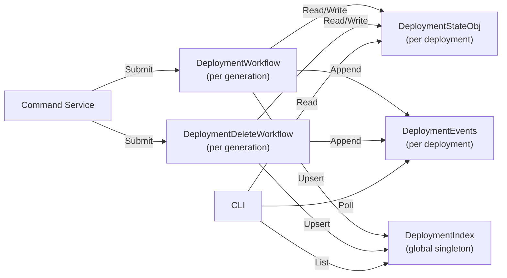
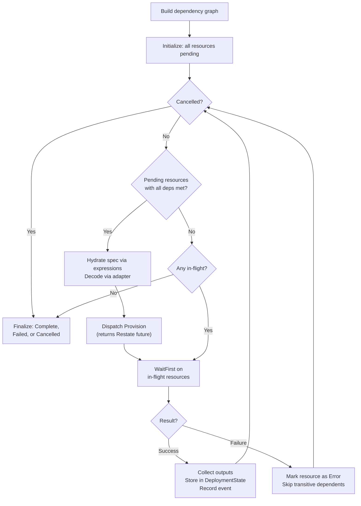
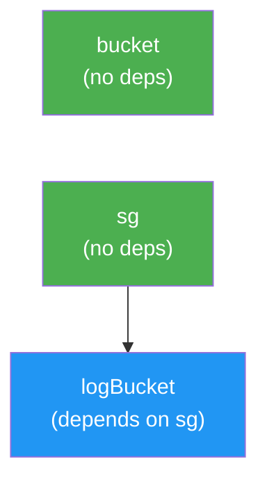
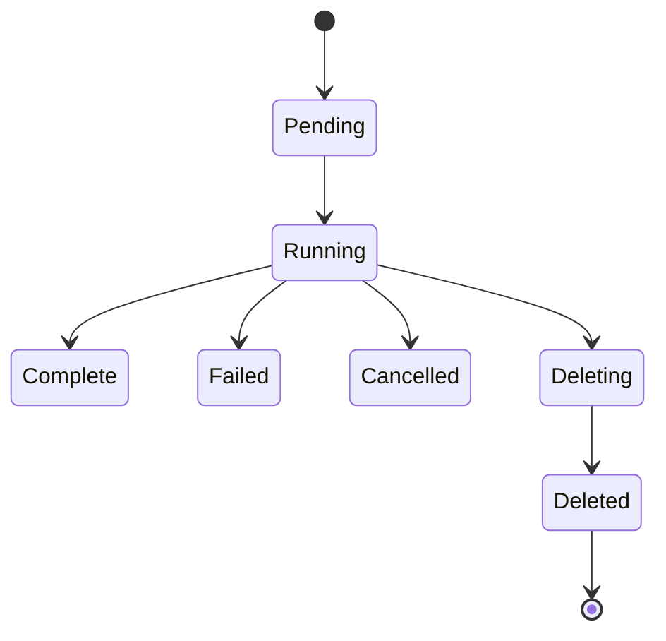
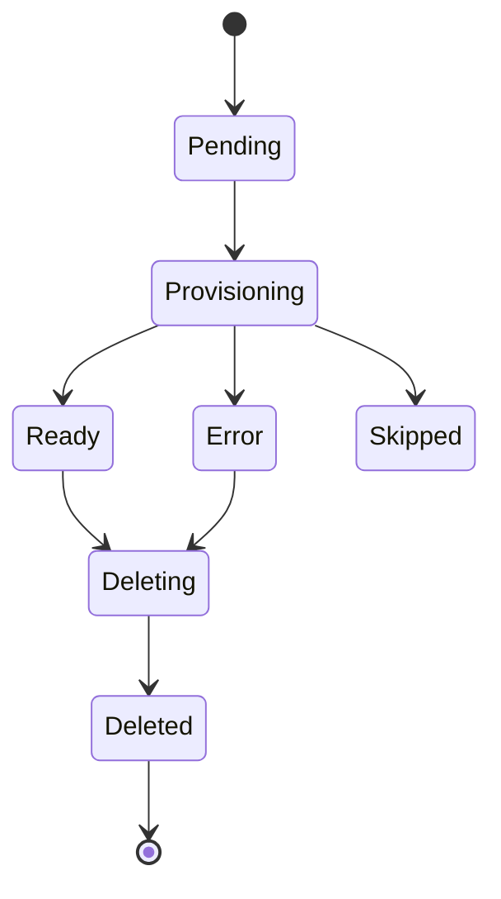

# Orchestrator

> **See also:** [Architecture](ARCHITECTURE.md) | [Drivers](DRIVERS.md) | [Templates](TEMPLATES.md) | [Events](EVENTS.md) | [Auth](AUTH.md) | [Errors](ERRORS.md)

---

## Overview

The orchestrator is the deployment execution engine inside Praxis Core. It takes a compiled template — validated resources with a dependency graph — and drives them to completion by dispatching to [drivers](DRIVERS.md) in topological order with maximum parallelism.

The orchestrator never sees [data sources](TEMPLATES.md#data-sources). Data source lookups are resolved during template compilation in the Command Service — before the DAG is built — so by the time the orchestrator receives a plan, all `${data.*}` expressions have been replaced with literal values. The orchestrator only handles `${resources.*}` expressions for dispatch-time hydration.

The orchestrator is built on three Restate primitives:

- **Workflows** — run-once-per-key execution for apply and delete flows
- **Virtual Objects** — durable state for deployments, listing indexes, and event feeds
- **Durable RPC** — exactly-once inter-service calls from workflows to drivers

---

## Restate Services

The orchestrator consists of five Restate services, all hosted in the `praxis-core` container:

| Service | Type | Key | Purpose |
|---------|------|-----|---------|
| `DeploymentWorkflow` | Workflow | `<deploymentKey>-gen-<N>` | Apply/re-apply execution |
| `DeploymentDeleteWorkflow` | Workflow | `<deploymentKey>-delete-<N>` | Delete execution |
| `DeploymentStateObj` | Virtual Object | `<deploymentKey>` | Durable lifecycle record |
| `DeploymentIndex` | Virtual Object | `"global"` (fixed) | Listing index for all deployments |
| `DeploymentEvents` | Virtual Object | `<deploymentKey>` | Append-only event stream |



### Why Separate Workflows and State

Restate Workflows are run-once-per-key — a workflow key can only execute one `Run` once. Deployments need re-apply semantics (apply the same stack again with updated specs). The solution:

- **DeploymentState** is keyed by deployment ID and persists across all runs
- **DeploymentWorkflow** is keyed by `<deploymentID>-gen-<N>`, where N is the generation counter
- Each apply increments the generation and spawns a new workflow
- Both the current and historical workflows share access to the same DeploymentState

This separation also means:

- Direct reads (CLI `get`, `list`) query DeploymentState without coupling to workflow internals
- Apply and delete workflows both read/write the same state object
- State survives workflow completion

---

## Apply Flow

### Input: DeploymentPlan

The [Command Service](TEMPLATES.md#evaluation-pipeline) builds a `DeploymentPlan` after template evaluation:

```go
type DeploymentPlan struct {
    Key          string            // stable deployment identifier
    Account      string            // resolved AWS account name
    Resources    []PlanResource    // rendered resources with dependency metadata
    Variables    map[string]any    // template variables
    CreatedAt    time.Time
    TemplatePath string            // "inline://template.cue" or "registry://<name>"
}

type PlanResource struct {
    Name           string              // template-local name (e.g., "bucket", "sg")
    Kind           string              // resource type (e.g., "S3Bucket")
    Key            string              // canonical Restate object key
    Spec           json.RawMessage     // rendered JSON, may have unresolved expressions
    Dependencies   []string            // template-local names this depends on
    Expressions    map[string]string   // JSON path → expression for dispatch-time hydration
}
```

### Execution: Eager Scheduler

The workflow uses an **eager dispatch** strategy — resources start as soon as their specific dependencies are met, not when an entire tier completes:



### Dispatch-Time Expression Hydration

Templates can express cross-resource dependencies with output expressions:

```cue
logBucket: s3.#S3Bucket & {
    spec: {
        tags: {
            securityGroup: "${resources.sg.outputs.groupId}"
        }
    }
}
```

At template evaluation time, the DAG parser extracts these expressions and records them as dependency edges. The expressions themselves are left as strings in the resource spec.

When the dependency completes and its outputs are available, `HydrateExprs` resolves each expression by walking the dot path (`resources.<name>.outputs.<field>`) through the output map and writes the **typed** result back into the JSON document:

- Strings stay strings
- Integers stay integers
- Booleans stay booleans
- Arrays stay arrays

This is different from template-time variable injection (CUE interpolation), which stringifies results. The hydrator preserves types so drivers receive specs with correct JSON types.

### Parallel Dispatch

The eager scheduler uses Restate's `WaitFirst` to wait on multiple in-flight Provision calls simultaneously. Consider a template with three resources:



Execution:

1. `bucket` and `sg` dispatch in parallel (both have no dependencies)
2. `WaitFirst` returns whichever completes first
3. When `sg` completes → `logBucket` becomes ready, gets hydrated and dispatched
4. `bucket` and `logBucket` run in parallel

The scheduler achieves maximum parallelism limited only by the dependency graph.

---

## Delete Flow

The `DeploymentDeleteWorkflow` handles deployment teardown:

1. Read current DeploymentState
2. Reconstruct the dependency graph from stored resource metadata
3. Compute reverse topological order
4. For each resource in reverse order:
   - **Check `lifecycle.preventDestroy`** — if `true`, fail immediately with a terminal error
   - Delete the resource via the driver
5. On failure: mark the resource's dependencies as Skipped (they may still be referenced)
6. Independent branches continue in parallel
7. Finalize deployment as Deleted or Failed

Delete is a separate workflow from apply because:

- Both are long-running operations that benefit from Restate's durable execution
- Both need their own workflow key (run-once-per-key semantics)
- They share the same DeploymentState for consistent lifecycle tracking

---

## Deployment State

### Lifecycle



### Resource Lifecycle Within a Deployment



- **Pending** — queued, dependencies not yet met
- **Provisioning** — driver Provision call dispatched
- **Ready** — driver returned success and outputs
- **Error** — driver returned an error
- **Skipped** — a dependency failed, this resource was never dispatched
- **Deleting** — driver Delete call dispatched
- **Deleted** — driver confirmed removal

### State Structure

```go
type DeploymentState struct {
    Key          string
    Account      string
    Status       DeploymentStatus
    TemplatePath string
    Resources    map[string]*ResourceState
    Outputs      map[string]map[string]any    // resource name → normalized outputs
    Generation   int64
    Error        string
    CreatedAt    time.Time
    UpdatedAt    time.Time
    Cancelled    bool
}
```

### DeploymentState Handlers

| Handler | Context | Purpose |
|---------|---------|---------|
| `InitDeployment` | Exclusive | Create or re-initialize for a new apply generation |
| `SetStatus` | Exclusive | Update deployment-wide status |
| `UpdateResource` | Exclusive | Update one resource's status and outputs |
| `Finalize` | Exclusive | Set terminal status and error |
| `GetState` | Shared | Return full state (used by CLI `get`) |
| `GetDetail` | Shared | Return deployment detail view |
| `IsCancelled` | Shared | Check cancellation flag |

---

## Deployment Index

Restate Virtual Objects cannot be enumerated by key. To support `praxis list deployments`, a `DeploymentIndex` Virtual Object (keyed by `"global"`) maintains a map of deployment summaries.

Workflows update the index via one-way sends after status changes:

```go
type DeploymentSummary struct {
    Key       string
    Status    DeploymentStatus
    Account   string
    UpdatedAt time.Time
}
```

The `List` handler returns summaries in deterministic key order.

---

## Deployment Events

An append-only event stream per deployment, stored in the `DeploymentEvents` Virtual Object.

Each event carries:

```go
type DeploymentEvent struct {
    DeploymentKey string
    Sequence      int64       // monotonically increasing per deployment
    Status        DeploymentStatus
    ResourceName  string      // empty for deployment-level events
    ResourceKind  string
    Message       string
    CreatedAt     time.Time
}
```

The CLI's `observe` command polls `ListSince(lastSequence)` to stream events in real time.

### Handlers

| Handler | Context | Purpose |
|---------|---------|---------|
| `Append` | Exclusive | Add an event with auto-incremented sequence |
| `ListSince` | Shared | Return events after a given sequence cursor |

---

## DAG Engine

The dependency graph engine (`internal/core/dag/`) is a **pure Go library** with no Restate dependency. It is testable in complete isolation.

### Components

| Component | File | Purpose |
|-----------|------|---------|
| Parser | `parser.go` | Extracts `${resources.<name>.outputs.*}` patterns from JSON specs → dependency edges |
| Graph | `graph.go` | DAG construction, cycle detection (DFS), topological ordering |
| Scheduler | `scheduler.go` | Runtime dispatch queries: `Ready()` and `AffectedByFailure()` |

### Graph Operations

- **Topological sort** — deterministic resource ordering for dispatch
- **Cycle detection** — DFS-based, rejects circular dependencies at template evaluation time
- **Dependency check** — `DependenciesMet(name, completed)` for the scheduler
- **Dependents query** — `Dependents(name)` for failure propagation
- **Reverse topological** — `ReverseTopo()` for delete ordering

### Scheduler

The `Schedule` type wraps a validated graph and answers two questions:

1. **`Ready(completed, dispatched)`** — which resources can be dispatched now? Walks topological order for deterministic results.
2. **`AffectedByFailure(failed)`** — which resources transitively depend on the failed resource? Used to mark them as Skipped.

---

## Re-Apply Semantics

When a user runs `praxis apply` against an existing deployment:

1. Command Service detects the deployment key already exists
2. Calls `DeploymentState.InitDeployment` which increments the generation counter
3. All resource statuses reset to `Pending`, previous outputs are cleared
4. A new `DeploymentWorkflow` is submitted with key `<deploymentKey>-gen-<N>`
5. The workflow runs the same eager dispatch flow against the updated specs

This means Praxis supports iterative development: update the template, re-apply, and the orchestrator converges resources to the new desired state.

---

## Cancellation

Workflows check for cancellation via `DeploymentState.IsCancelled()` at the start of each dispatch loop iteration. When cancellation is detected:

1. No new resources are dispatched
2. In-flight resources are allowed to complete (no mid-operation abort)
3. The deployment finalizes as `Cancelled`

This graceful approach avoids leaving resources in an indeterminate state.

---

## Lifecycle Rules

Lifecycle rules protect resources from accidental deletion and allow selective drift ignoring. They are declared in templates and enforced by the orchestrator and plan diff engine.

### preventDestroy

When `lifecycle.preventDestroy: true` is set on a resource:

- The **delete workflow** checks the flag before calling `adapter.Delete()`. If set, the resource is marked as failed with a terminal error and the workflow does not retry.
- The **apply workflow** checks the flag before force-replacing a resource (`--replace`). Protected resources cannot be recreated.
- The error message is explicit:

```text
lifecycle.preventDestroy enabled; refusing to delete resource "prod-db" (RDSInstance)
```

To delete a protected resource, update the template to set `preventDestroy: false` (or remove it), re-apply, then delete.

### ignoreChanges

When `lifecycle.ignoreChanges: ["path1", "path2"]` is set on a resource:

- The **plan diff engine** filters out field diffs matching the ignored paths before presenting results. If all diffs are filtered, the resource shows as `no-op` instead of `update`.
- Supports exact path matching (`"tags.env"` matches only `tags.env`) and prefix matching (`"tags"` matches `tags.env`, `tags.team`, etc.).
- Non-ignored fields are still diffed and corrected normally.

This allows external systems (billing tools, compliance scanners, other IaC) to manage specific fields without Praxis fighting for control.
