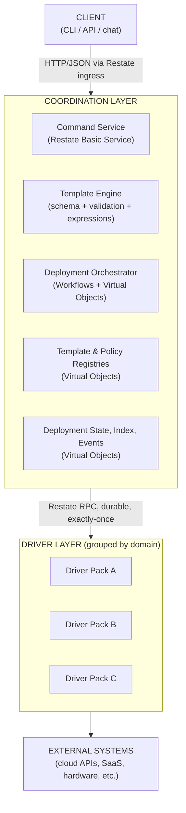
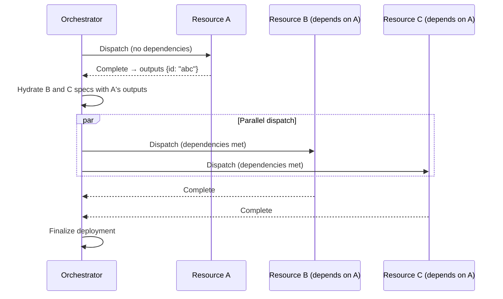
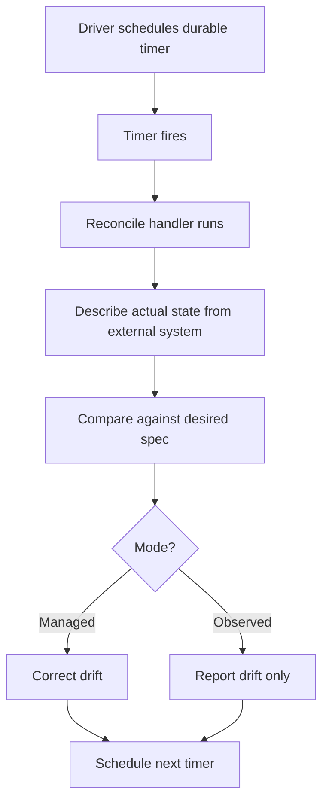
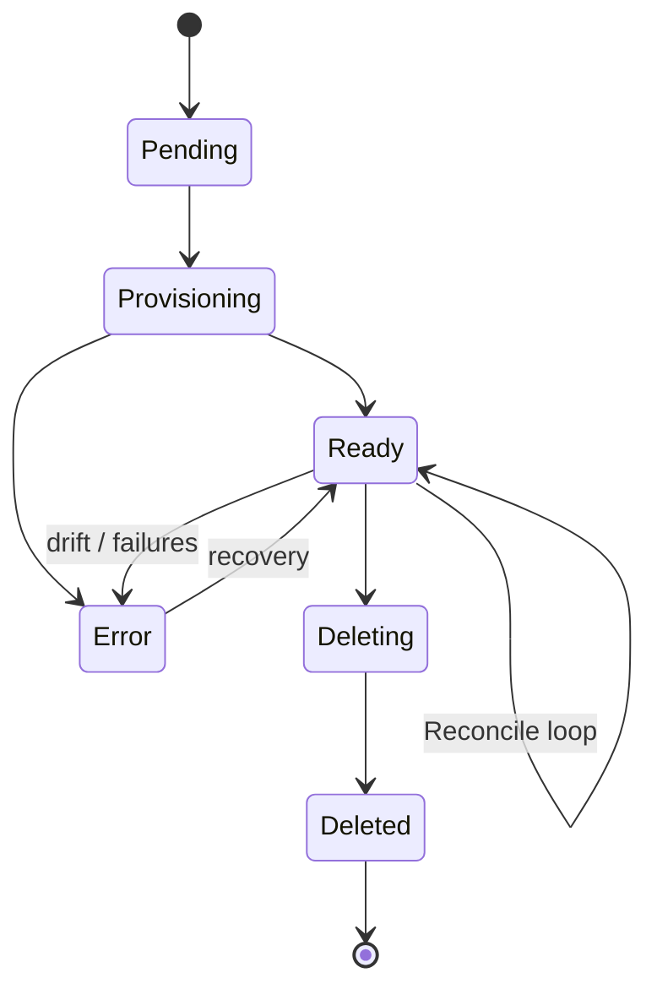
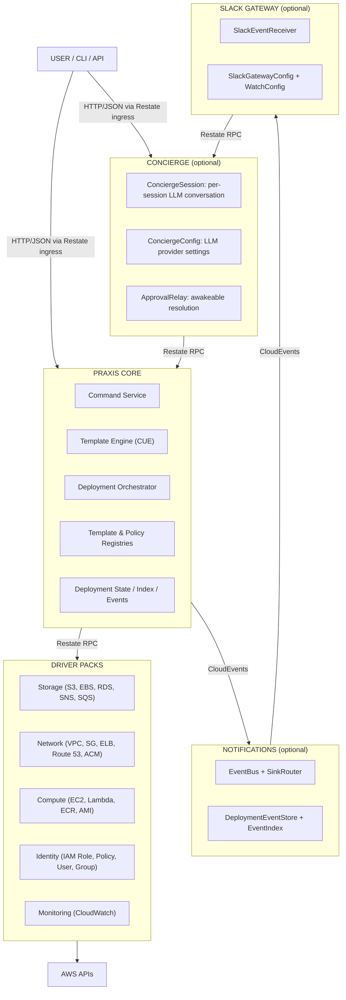
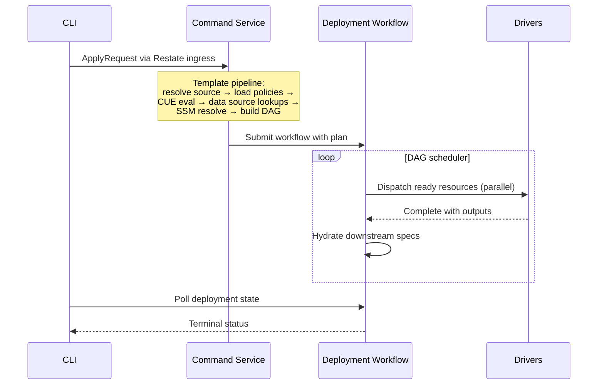
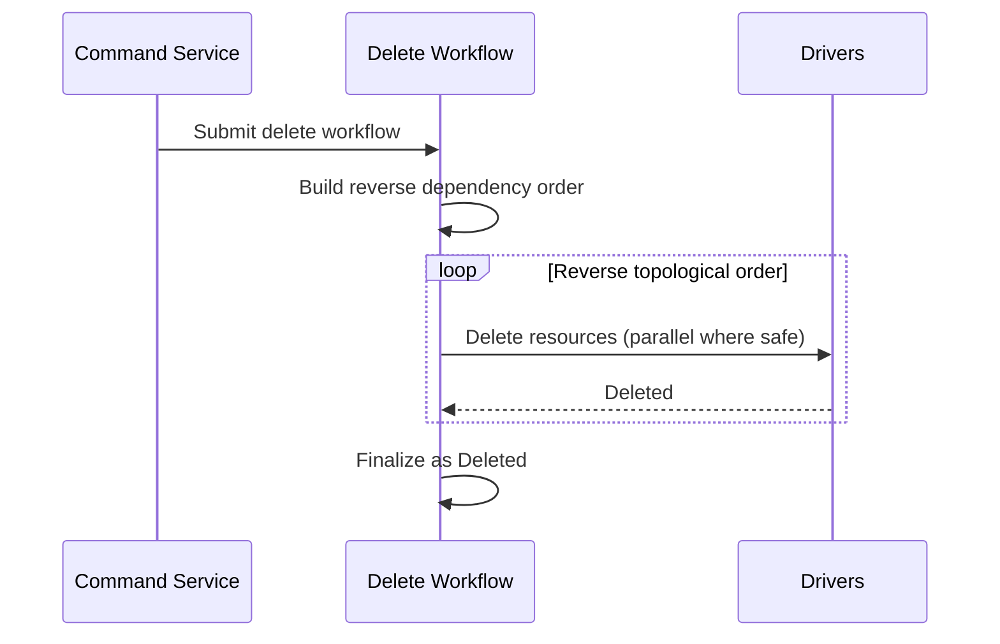

# The Praxis Architecture

A blueprint for building reconciliation-driven systems on durable execution, without Kubernetes.

---

## The Core Idea

Kubernetes controllers solved a powerful problem: declare what you want, and a control loop converges reality to match. But that model comes welded to the Kubernetes control plane (etcd, API server, controller manager, scheduler). If your domain isn't container orchestration, you're paying for a cluster just to get reconciliation semantics.

The Praxis architecture extracts the reconciliation pattern and rebuilds it on [Restate](https://restate.dev), a durable execution engine. The result is a system with the same properties (drift detection, self-healing, dependency-aware orchestration, crash recovery) that runs as lightweight services in Docker Compose.

Praxis itself uses this architecture to manage AWS infrastructure. But the pattern applies anywhere you need to declare desired state and continuously converge toward it: cloud resources, SaaS configurations, fleet management, compliance enforcement, or any domain where the real world drifts from intent.

These patterns are very common for operation teams and this document describes the architecture as a reusable blueprint. Praxis is the reference implementation.

---

## Architecture at a Glance



Four layers, each with a clear responsibility:

| Layer | Role | Restate Primitive |
|-------|------|-------------------|
| **Client** | Sends commands (apply, plan, delete, import) | HTTP ingress |
| **Coordination** | Template evaluation, DAG scheduling, deployment lifecycle | Workflows + Virtual Objects |
| **Drivers** | CRUD + reconcile for a single resource type | Virtual Objects (one per resource instance) |
| **External** | The actual systems being managed | APIs, SDKs |

No dedicated API server. No external database. No message broker. Restate is the runtime: state storage, concurrency control, crash recovery, and inter-service communication all flow through it.

---

## Why Durable Execution Is the Right Foundation

Reconciliation systems have a fundamental problem: operations against external systems are slow, flaky, and can fail mid-way. A controller that creates a load balancer, attaches listeners, and registers targets needs to handle crashes at any step without leaving orphaned resources or getting into a bad state.

The usual approaches:
- **State machines + external databases** - complex bookkeeping, operational burden
- **Message queues + idempotent consumers** - eventual consistency headaches, dead letter queues
- **Kubernetes controllers** - works, but you need a full cluster

Durable execution solves this structurally. Every operation is journaled. If a service crashes mid-call, the runtime replays the journal from the last checkpoint without re-executing completed steps. This gives you:

| Property | How Restate Provides It | K8s Equivalent |
|----------|------------------------|----------------|
| State management | Virtual Object K/V store | etcd |
| Single-writer per resource | Exclusive handlers | Controller leader election |
| Crash recovery | Journal replay | Controller restart + re-list |
| Periodic reconciliation | Durable timers | Informer watches + work queues |
| Inter-service calls | Exactly-once RPC | N/A (controllers typically poll) |

You get the same correctness guarantees without operating a distributed consensus system.

---

## Pattern 1: Resources as Virtual Objects

The foundational modeling decision: **every managed resource instance is its own Virtual Object**, keyed by a natural identifier.

```
S3Bucket/my-bucket
SecurityGroup/vpc-123~web-sg
EC2Instance/us-east-1~web-server
```

A Virtual Object is a stateful, key-addressable entity with two handler modes:

- **Exclusive handlers** - serialized, single-writer access. Used for mutations (Provision, Delete, Reconcile).
- **Shared handlers** - concurrent read access. Used for queries (GetStatus, GetOutputs).

Each Virtual Object has its own key-value store. No external database.

### Why This Works

- **Single-writer guarantee.** Two concurrent provisions for the same resource are serialized automatically. No distributed locking, no optimistic concurrency conflicts.
- **Built-in state.** The resource's desired spec, observed state, outputs, and status all live in the Virtual Object's K/V store. No ORM, no migrations, no connection pools.
- **Natural addressing.** The key maps directly to a human-readable identifier. Debugging is straightforward: query `S3Bucket/my-bucket` and see everything about that resource.
- **Stateless services.** Driver containers hold zero state. Restate holds it all. Kill a container, restart it, scale it horizontally, nothing is lost.

### The Handler Contract

Every resource driver implements six handlers:

```
Exclusive (single-writer):
  Provision(spec)  → outputs     Create or update the resource
  Import(ref)      → outputs     Adopt an existing resource
  Delete()                       Remove the resource
  Reconcile()      → result      Check drift, optionally correct it

Shared (concurrent-read):
  GetStatus()      → status      Current lifecycle status
  GetOutputs()     → outputs     Resource outputs (ARN, ID, etc.)
```

Drivers know how to CRUD one resource type. They know nothing about other resources, dependency graphs, or deployments. This separation is what makes the system composable.

### Use This Pattern When

- Each entity in your domain has a natural key and independent lifecycle
- You need single-writer semantics without distributed locking
- You want to avoid operating an external database for entity state
- Your entities need periodic reconciliation against an external system

---

## Pattern 2: Centralized Orchestration with DAG Scheduling

Resources have dependencies. A security group needs a VPC ID. An EC2 instance needs both. A listener needs a load balancer and a target group.

The Praxis architecture solves this with a centralized orchestrator that:

1. **Builds a dependency graph** from cross-resource expressions (`${resources.vpc.outputs.vpcId}`)
2. **Dispatches resources in topological order** with maximum parallelism. If A and B are independent, they run concurrently
3. **Hydrates downstream specs** as outputs become available. When VPC completes, its `vpcId` gets injected into the security group's spec before dispatch
4. **Handles partial failure.** If a resource fails, all transitive dependents are skipped with a clear error chain



### Expression Hydration

Cross-resource references use a simple dot-path syntax:

```
${resources.<name>.outputs.<field>}
```

At dispatch time, the orchestrator walks the spec JSON, replaces expression strings with typed values from completed resource outputs, and sends the hydrated spec to the driver. Types are preserved: integers stay integers, arrays stay arrays.

### Why Centralized, Not Choreographed

An alternative is distributed choreography: each driver watches for its dependencies and self-dispatches. This is how Kubernetes controllers typically work (via watches and owner references).

Centralized orchestration has tradeoffs:

**Benefits:**
- Drivers stay simple: pure CRUD, no coordination logic
- Deployment state lives in one place for consistent observability
- Failure handling is centralized with clear error propagation
- The DAG is inspectable, so you can visualize and debug the execution plan

**Cost:**
- The orchestrator is a bottleneck. Every deployment flows through it.

This cost is acceptable for most resource management domains. If you need thousands of concurrent deployments, you can shard orchestrators by deployment key.

### Use This Pattern When

- Your entities have inter-dependencies that form a DAG
- You want maximum parallelism within dependency constraints
- You need clear failure propagation (skip dependents of failed resources)
- You prefer drivers/workers to be simple and stateless

---

## Pattern 3: Continuous Reconciliation via Durable Timers

Creating a resource is only half the problem. The real world drifts. Someone edits a security group in the console, a tag gets deleted, a configuration changes outside your system.

The reconciliation loop:



Key properties:

- **Durable timers survive crashes.** If the service restarts, Restate re-fires the timer. No cron jobs, no external scheduler, no missed reconciliations.
- **Per-resource scheduling.** Each Virtual Object schedules its own next reconciliation. No global work queue to contend over.
- **Two modes.** Managed resources get corrected automatically. Observed resources (imported, read-only) report drift without modifying anything.
- **Drift detection is field-level.** Drivers compare specific fields, not hashes. They know which fields are mutable (correct drift) and which are immutable (flag for replacement).

### Resource Lifecycle



| Status | Meaning |
| --- | --- |
| `Pending` | Declared but not yet acted on |
| `Provisioning` | Create/update in progress |
| `Ready` | Exists and matches desired state |
| `Error` | Operation failed, check the error field |
| `Deleting` | Deletion in progress |
| `Deleted` | Removed (tombstone preserved for queries) |

### Use This Pattern When

- Your managed entities can drift from desired state
- You need self-healing without manual intervention
- You want visibility into what's out of sync
- You have a mix of fully-managed and observed/imported entities

---

## Pattern 4: Domain-Grouped Service Packs

As the number of resource types grows, you need a deployment strategy. The extremes are:

- **One container per type.** 50+ containers for full coverage. Operationally miserable.
- **One monolithic container.** A crash in one driver takes down everything.

The middle ground: **group drivers by domain** into a handful of service packs. Each pack is a single container hosting related Virtual Objects.

In Praxis, the groupings follow AWS API boundaries:

| Pack | Drivers | Rationale |
| --- | --- | --- |
| **Storage** | S3, EBS, RDS, Aurora, SNS, SQS | Data stores, databases, messaging |
| **Network** | VPC, SG, EIP, IGW, Route 53, ALB, NLB, ACM | Networking resources deploy together |
| **Compute** | EC2, Lambda, ECR, AMI, KeyPair | Compute lifecycle |
| **Identity** | IAM Role, Policy, User, Group | Security-sensitive, low churn |
| **Monitoring** | CloudWatch Logs, Alarms, Dashboards | Optional, many deployments skip this |

The runtime doesn't care about grouping. Restate routes by Virtual Object service name, not by which container hosts it. Moving a driver between packs is a deployment-time decision: change which `main.go` binds it, rebuild, redeploy. Zero code changes to the driver itself.

```go
// Each pack is a main.go that binds related drivers to one Restate server
srv := server.NewRestate().
    Bind(restate.Reflect(vpc.NewVPCDriver(auth))).
    Bind(restate.Reflect(sg.NewSecurityGroupDriver(auth))).
    Bind(restate.Reflect(subnet.NewSubnetDriver(auth)))
```

### Why This Grouping Works

- **Blast radius is contained.** A panic in the VPC driver doesn't take down S3.
- **Scaling aligns with reality.** If you're churning EC2 instances, you're probably churning Lambda functions too. Scale the compute pack.
- **Selectivity.** Don't need monitoring? Don't run that pack.
- **Operations stay manageable.** 5 packs vs 50+ containers.

### Use This Pattern When

- You have many resource/entity types (10+) that need independent lifecycle management
- You want operational simplicity without monolithic coupling
- Your types naturally cluster by domain or API boundary

---

## Pattern 5: Schema-Driven Templates with Deferred Expression Resolution

The template system separates what gets resolved at different times:

| Phase | Mechanism | Timing | Example |
|-------|----------|--------|---------|
| Schema + constraints + defaults | CUE (or your schema language) | Template authoring | `versioning: bool \| *true` |
| Variable injection | CUE interpolation | Template evaluation | `"\(variables.name)-bucket"` |
| Data source lookups | Read-only queries | Compile time (pre-DAG) | `${data.existingVpc.outputs.vpcId}` |
| Cross-resource references | Expression hydration | Dispatch time | `${resources.sg.outputs.groupId}` |
| Secret references | SSM/vault protocol | Template evaluation | `ssm:///path/to/secret` |

The key insight: **not everything can be resolved at the same time.** Variable injection happens before the DAG exists. Cross-resource expressions can only resolve after dependencies complete. Separating these phases explicitly avoids the complexity of a single-pass evaluation engine that needs to handle partial resolution.

Praxis uses CUE because it merges types, constraints, defaults, and values into one language. A schema is simultaneously a validator and a default provider. But the multi-phase resolution pattern works with any schema language (JSON Schema, Protobuf, HCL, etc.).

### Use This Pattern When

- Your system has templates/configs that reference outputs of other operations
- You need validation at authoring time but dynamic values at runtime
- You want to separate platform-team concerns (schemas, constraints) from user concerns (fill-in variables)

---

## Pattern 6: Lifecycle Guards

Resources can declare protective policies that gate dangerous transitions:

- **`preventDestroy`** - The orchestrator refuses to delete the resource. The rule must be explicitly removed and re-applied before deletion can proceed.
- **`ignoreChanges`** - Specific fields are excluded from drift detection and correction, letting external systems co-manage those fields.

These rules don't change the state machine. They add gates around the `Ready → Deleting` transition and the drift correction path. They're declared in templates, enforced by the orchestrator, and auditable.

### Use This Pattern When

- Some entities should be protected from accidental deletion (databases, DNS zones)
- External systems legitimately modify certain fields your system should leave alone
- You need auditable protective policies, not just "be careful"

---

## How Praxis Instantiates the Architecture

The patterns above are generic. Here's how Praxis wires them together for AWS infrastructure management:

### System Topology



### Components

**Praxis Core** is the coordination layer. It hosts the Command Service (receives CLI commands), Template Engine (CUE evaluation + policy enforcement), Deployment Orchestrator (DAG-scheduled workflows), and state management Virtual Objects. Runs as a single container.

**Driver Packs** are five containers, each hosting related AWS resource drivers as Virtual Objects. Each driver implements the six-handler contract (Provision, Import, Delete, Reconcile, GetStatus, GetOutputs), stores state in Restate's K/V store, and handles AWS API rate limiting. Drivers have zero knowledge of each other.

**Concierge** (optional) is an AI-powered assistant that provides natural language interaction. It uses Restate awakeables for human-in-the-loop approval of destructive operations. Communicates with Core through the same RPC mechanism drivers use.

**Notifications** (optional) is a CloudEvents event bus for deployment lifecycle events. It fans out to event stores, indexes, and registered sinks. The orchestrator fires events and forgets about them. If notifications are unavailable, deployments keep going.

**Slack Gateway** (optional) receives events from the notification sink router and posts to Slack channels. Can optionally invoke the Concierge for AI-powered analysis.

**CLI** is a standalone Go binary (Cobra) that talks directly to Restate's ingress HTTP API. No dedicated API server. Write commands route to the Command Service; read commands query Virtual Objects directly.

### Data Flows

**Apply (provision resources):**



**Delete (tear down):**



**Plan (dry-run):** Same as Apply through template evaluation, then diffs each resource spec against current state. No workflow submitted.

---

## Design Tradeoff Summary

Every architecture is a set of bets. Here are the ones this architecture makes:

| Decision | Benefit | Cost |
|----------|---------|------|
| Durable execution over K8s | No cluster to operate; same correctness guarantees | Younger ecosystem; fewer off-the-shelf integrations |
| Virtual Objects over shared DB | Single-writer without locking; no database to operate | State lives in Restate's storage layer, not a queryable DB |
| Centralized orchestrator | Simple drivers; clear observability; inspectable DAGs | Coordination bottleneck at high scale |
| Domain-grouped packs | Operational simplicity; meaningful blast radius | Shared failure domain within a pack |
| CUE for templates | Schema + validation + defaults in one language | Steeper learning curve than YAML/JSON |
| Multi-phase expression resolution | Clean separation of compile-time vs dispatch-time concerns | More phases to understand and debug |

---

## Adapting the Architecture

To apply this architecture to a different domain, map these concepts:

| Praxis Concept | Your Domain |
|----------------|-------------|
| AWS resource (S3 bucket, EC2 instance) | Your managed entity (SaaS tenant, network device, compliance rule) |
| Driver | Your entity manager (CRUD + reconcile against an external API) |
| CUE template | Your declaration format (whatever schema fits your users) |
| Output expressions `${resources.x.outputs.y}` | Cross-entity references in your dependency graph |
| Driver pack | Your domain grouping (by API, by team, by failure domain) |
| Reconciliation timer | Your drift detection interval |

The pieces that are truly reusable:
1. Virtual Objects as the entity model
2. DAG-based orchestration with expression hydration
3. Durable timers for reconciliation loops
4. Domain-grouped service packs
5. The six-handler driver contract
6. Lifecycle guards (preventDestroy, ignoreChanges)

The pieces that are Praxis-specific:
1. CUE as the schema language (use whatever fits)
2. AWS as the target (swap in any external API)
3. The specific driver implementations
4. The CLI surface area

---

## Further Reading

These docs go deeper on specific subsystems within the Praxis implementation:

- [Drivers](DRIVERS.md) - the driver contract, implementation patterns, how to build one
- [Orchestrator](ORCHESTRATOR.md) - DAG scheduling, deployment workflows, state management
- [Templates](TEMPLATES.md) - CUE template system, data sources, policy enforcement
- [Events](EVENTS.md) - CloudEvents schema, event bus, notification sinks
- [Auth](AUTH.md) - credential management, workspaces, account selection
- [Errors](ERRORS.md) - error classification, status codes, retry semantics
- [CLI](CLI.md) - command reference and usage patterns
- [Operators](OPERATORS.md) - deployment, configuration, monitoring
- [Developers](DEVELOPERS.md) - building, testing, contributing
