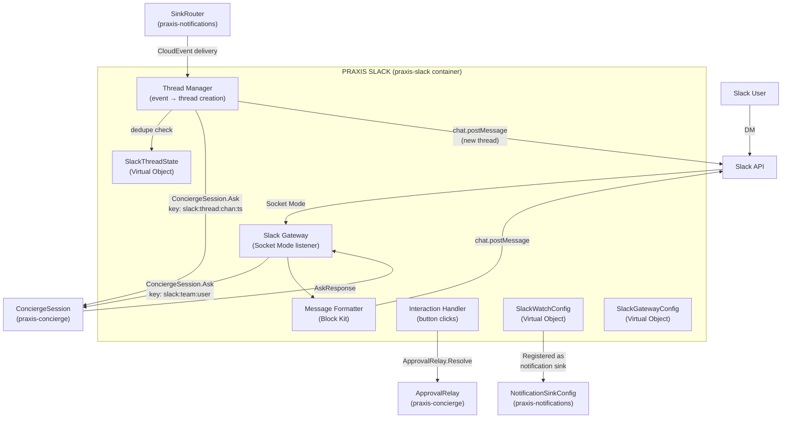
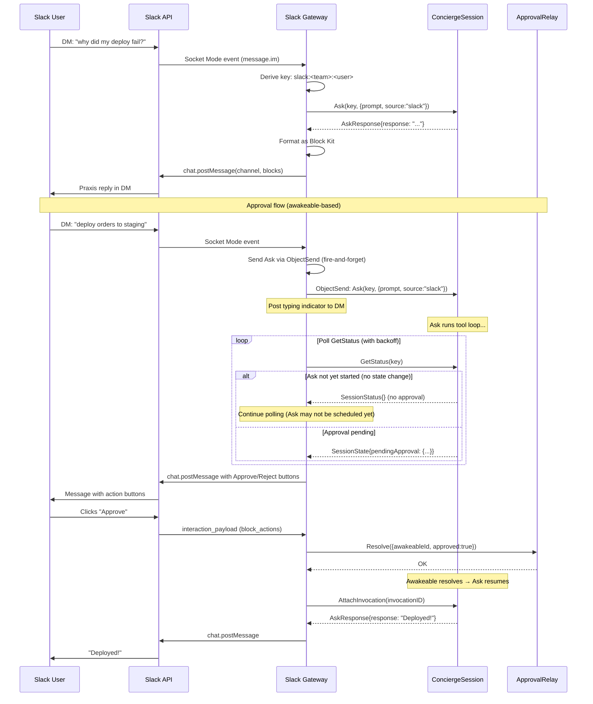
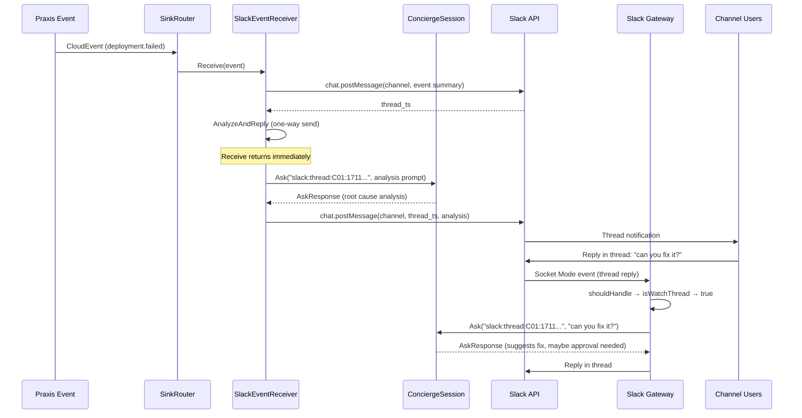

# Slack Gateway

---

## Overview

The Slack gateway (`praxis-slack`) connects the Praxis Concierge to Slack. Praxis appears as a bot user — a "person" in the workspace that users can DM directly. Conversations are persistent: the gateway maps each Slack user to a stable concierge session, so Praxis remembers context across messages without the user managing session IDs.

Beyond 1:1 conversations, the gateway provides **event-watch threads** — a proactive alerting system where the concierge monitors Praxis events (deployment failures, drift detection, resource state changes) and creates threads in a designated channel with AI-powered analysis and recommendations. These threads become their own concierge sessions, open to any user in the channel for follow-up instructions.

### Interaction Boundaries

The gateway enforces strict interaction scopes:

| Context | Allowed | Session Key |
|---------|---------|-------------|
| Direct messages (1:1 with Praxis bot) | Yes (if user allowed) | `slack:<team_id>:<user_id>` |
| Praxis-initiated event-watch threads | Yes (if user allowed) | `slack:thread:<channel_id>:<thread_ts>` |
| Channel messages (not in a Praxis thread) | No — Praxis ignores these | — |
| Group DMs | No — Praxis ignores these | — |
| User-initiated threads (on non-Praxis messages) | No — Praxis ignores these | — |
| DMs or thread replies from non-allowed users | No — static rejection message | — |

This keeps the interaction model simple and predictable. Users talk to Praxis in DMs. Praxis talks to the team in event-watch threads. No ambient channel noise.

When an allow-list is configured, only users whose Slack IDs appear in the list can interact with Praxis. Messages from unlisted users receive a static rejection reply — no LLM call is made. If the allow-list is empty, all users are permitted (open access).

### Design Principles

1. **Opt-in** — Separate container (`praxis-slack`). Don't need Slack integration? Don't run it. Zero impact on the concierge or any other component.
2. **Thin adapter** — The gateway translates Slack events into `ConciergeSession.Ask` calls and `AskResponse` back into Slack messages. It does not contain LLM logic, tool definitions, or infrastructure knowledge.
3. **Praxis owns no auth** — The gateway authenticates with Slack using a bot token the operator provides. Channel access, user permissions, and workspace security are the operator's responsibility. Praxis does not implement authorization on top of Slack's model.
4. **Dynamic configuration** — Watch lists, channel targets, allowed-user lists, and bot tokens are stored in a Restate Virtual Object and can be updated at runtime via CLI or DM. The gateway re-fetches configuration from Restate state before each operation (message handling, event delivery, interaction callback) rather than caching it at startup. Token changes that require a new Socket Mode connection (e.g. rotating the app-level token) trigger an automatic reconnect — the gateway watches for config version changes and reconnects when the app token changes. No container restart required.
5. **Event-watch as a sink** — The gateway registers itself as a notification sink in the existing Praxis event system. When matching events fire, the `SinkRouter` delivers them to the gateway, which creates threads with concierge analysis.

---

## Architecture



### Component Summary

| Component | Type | Purpose |
|-----------|------|---------|
| Slack Gateway (goroutine) | Non-Restate | Socket Mode connection, message routing, Slack API calls |
| `SlackGatewayConfig` | Virtual Object (`"global"`) | Bot token, app-level token, team ID, default channel |
| `SlackWatchConfig` | Virtual Object (`"global"`) | Event-watch rules, channel targets, active watches |
| `SlackThreadState` | Virtual Object (`<event_id>:<rule_id>` or `<channel>:<thread_ts>`) | Thread persistence, dedupe, reverse lookup |
| `SlackEventReceiver` | Basic Service | Receives CloudEvents from `SinkRouter`, triggers thread creation |
| Message Formatter | Internal | Translates `AskResponse` → Slack Block Kit |
| Interaction Handler | Internal | Processes button clicks (approvals) → `ApprovalRelay.Resolve` |
| Thread Manager | Internal | Creates threads for watched events, manages thread sessions |

**Cross-deployment RPC:** `SlackEventReceiver` is registered in the `praxis-slack` container. The `SinkRouter` (in `praxis-notifications`) calls it via `restate.ServiceSend`. This works because both deployments register with the same Restate instance — Restate routes the call to whichever deployment registered the target service, regardless of which container it runs in. No direct network connectivity between containers is needed.

---

## Restate Service Design

### SlackGatewayConfig — Virtual Object

Global singleton (`"global"` key) that stores Slack connection credentials and gateway settings. Configured via CLI at runtime.

```go
package slack

import restate "github.com/restatedev/sdk-go"

const (
    SlackGatewayConfigServiceName = "SlackGatewayConfig"
    SlackWatchConfigServiceName   = "SlackWatchConfig"
    SlackEventReceiverServiceName = "SlackEventReceiver"
)

type SlackGatewayConfig struct{}

func (SlackGatewayConfig) ServiceName() string { return SlackGatewayConfigServiceName }
```

#### Configuration State

```go
// SlackGatewayConfiguration holds the Slack connection settings.
type SlackGatewayConfiguration struct {
    BotToken     string   `json:"botToken,omitempty"`     // xoxb-... (Bot User OAuth Token). Optional literal for local/dev. Redacted on reads.
    BotTokenRef  string   `json:"botTokenRef,omitempty"`  // Preferred: SSM reference (e.g. "ssm:///praxis/slack/bot-token"). Resolved at request time.
    AppToken     string   `json:"appToken,omitempty"`     // xapp-... (App-Level Token for Socket Mode). Optional literal for local/dev. Redacted on reads.
    AppTokenRef  string   `json:"appTokenRef,omitempty"`  // Preferred: SSM reference (e.g. "ssm:///praxis/slack/app-token"). Resolved at request time.
    TeamID       string   `json:"teamId"`                 // Slack workspace ID
    BotUserID    string   `json:"botUserId"`              // Bot's own user ID (for filtering self-messages)
    EventChannel string   `json:"eventChannel"`           // Default channel for event-watch threads (e.g. "#praxis-alerts")
    Workspace    string   `json:"workspace,omitempty"`     // Default Praxis workspace for Slack-initiated requests (e.g. "production"). If empty, the concierge uses its session default.
    AllowedUsers []string `json:"allowedUsers"`           // Slack user IDs permitted to interact (empty = all allowed)
    Version      int      `json:"version"`                // Monotonically increasing. Incremented on every Configure call. Used by the gateway to detect config changes and trigger Socket Mode reconnect.
}
```

Token handling mirrors the concierge's `APIKey`/`APIKeyRef` pattern. Literal tokens are stored in Restate state for development convenience but are **redacted on reads** — `Get` returns `"***"` for `BotToken` and `AppToken`. In production, operators use `BotTokenRef` and `AppTokenRef` which point to SSM parameters resolved at request time. The resolved secrets are never written back to Restate state.

#### Handler Contract

| Handler | Type | Signature | Purpose |
|---------|------|-----------|---------|
| `Configure` | Exclusive | `(ObjectContext, SlackConfigRequest) → error` | Set or update Slack credentials and defaults |
| `Get` | Shared | `(ObjectSharedContext) → (SlackGatewayConfiguration, error)` | Return current configuration with secrets redacted |
| `SetAllowedUsers` | Exclusive | `(ObjectContext, SetAllowedUsersRequest) → error` | Replace the allowed-user list |
| `AddAllowedUser` | Exclusive | `(ObjectContext, string) → error` | Append a single Slack user ID to the allow-list |
| `RemoveAllowedUser` | Exclusive | `(ObjectContext, string) → error` | Remove a single Slack user ID from the allow-list |

### SlackWatchConfig — Virtual Object

Global singleton that stores the event-watch rule list. Each watch rule defines what events to monitor and where to post threads.

```go
type SlackWatchConfig struct{}

func (SlackWatchConfig) ServiceName() string { return SlackWatchConfigServiceName }
```

#### Watch State

```go
// WatchRule defines a single event-watch subscription.
type WatchRule struct {
    ID          string     `json:"id"`          // unique rule ID (auto-generated)
    Name        string     `json:"name"`        // human-readable name, e.g. "prod-failures"
    Channel     string     `json:"channel"`     // Slack channel ID to post threads in
    Filter      WatchFilter `json:"filter"`     // which events trigger this watch
    CreatedBy   string     `json:"createdBy"`   // Slack user ID of the creator
    CreatedAt   string     `json:"createdAt"`
    Enabled     bool       `json:"enabled"`
}

// WatchFilter mirrors the SinkFilter from the notification system.
// It determines which Praxis events trigger thread creation.
type WatchFilter struct {
    Types       []string `json:"types,omitempty"`       // event type prefixes, e.g. ["dev.praxis.deployment.failed"]
    Categories  []string `json:"categories,omitempty"`  // "lifecycle", "drift", "policy", "command"
    Severities  []string `json:"severities,omitempty"`  // "info", "warn", "error"
    Workspaces  []string `json:"workspaces,omitempty"`  // filter to specific workspaces
    Deployments []string `json:"deployments,omitempty"` // filter to specific deployment keys (supports * glob)
}

// WatchState is the full set of watches stored in the Virtual Object.
type WatchState struct {
    Rules    []WatchRule `json:"rules"`
    SinkName string     `json:"sinkName"` // name of the registered notification sink
}
```

#### Handler Contract

| Handler | Type | Signature | Purpose |
|---------|------|-----------|---------|
| `AddWatch` | Exclusive | `(ObjectContext, AddWatchRequest) → (WatchRule, error)` | Add a new event-watch rule, sync sink filter |
| `RemoveWatch` | Exclusive | `(ObjectContext, RemoveWatchRequest) → error` | Remove a watch rule by ID, sync sink filter |
| `UpdateWatch` | Exclusive | `(ObjectContext, UpdateWatchRequest) → (WatchRule, error)` | Update an existing watch rule, sync sink filter |
| `ListWatches` | Shared | `(ObjectSharedContext) → ([]WatchRule, error)` | List all active watch rules |
| `GetWatch` | Shared | `(ObjectSharedContext, string) → (WatchRule, error)` | Get a specific watch rule by ID |

#### Sink Synchronization

When watches are added, removed, or updated, the `SlackWatchConfig` merges all active watch filters into a single unified `SinkFilter` and registers (or updates) a notification sink named `"slack-gateway"` with the `NotificationSinkConfig` service. This keeps the gateway connected to the existing event system without any changes to the notification architecture.

```go
// syncSink merges all active watch filters and registers/updates the notification sink.
func syncSink(ctx restate.ObjectContext, state WatchState, config SlackGatewayConfiguration) error {
    // Merge all enabled watch filters into one SinkFilter
    merged := mergeFilters(state.Rules)

    // If no watches are enabled, remove the sink
    if len(state.Rules) == 0 || allDisabled(state.Rules) {
        if state.SinkName != "" {
            restate.ObjectSend(ctx, "NotificationSinkConfig", "global", "RemoveSink").
                Send(RemoveSinkRequest{Name: state.SinkName})
        }
        return nil
    }

    // Register or update the sink — the SinkRouter will deliver matching events
    // to SlackEventReceiver.Receive via Restate RPC (not a webhook URL)
    restate.ObjectSend(ctx, "NotificationSinkConfig", "global", "RegisterSink").
        Send(RegisterSinkRequest{
            Name:   "slack-gateway",
            Type:   "restate_rpc",    // internal sink type — delivers via Restate service call
            Target: SlackEventReceiverServiceName,
            Handler: "Receive",
            Filter: merged,
        })

    return nil
}
```

**Sink type note:** The existing notification system defines webhook, structured log, and CloudEvents HTTP sinks. The Slack gateway introduces a fourth internal sink type: `restate_rpc`. Instead of POSTing to an HTTP endpoint, the `SinkRouter` dispatches matching events to `SlackEventReceiver.Receive` via `restate.ServiceSend` — a durable fire-and-forget call within the Restate service mesh.

**Why `ServiceSend` (not `Service.Request`):** The existing HTTP sink delivery path runs inside `restate.Run()` (a side-effect block), where Restate service calls are not available. Rather than restructuring the retry/circuit-breaker machinery, `restate_rpc` sinks are handled as a special case **before** entering `deliverWithRetry` — the `SinkRouter`'s handler context calls `ServiceSend` directly. This means:

- **No circuit breaker needed** — `ServiceSend` always succeeds from the router's perspective. Restate durably queues the call and delivers it when the target service is available.
- **No retry loop needed** — Restate handles retries internally for durable sends.
- **No error noise** — if the Slack gateway is temporarily down, events queue silently in Restate rather than tripping circuit breakers or emitting delivery-failure events.
- **Idempotent delivery** — the send includes an idempotency key derived from the event's sequence number, preventing duplicates if `SinkRouter.Deliver` itself is retried.

This is the model that makes join/leave work cleanly: the bus doesn't care whether the receiver is up right now.

### SlackEventReceiver — Basic Service

Stateless Restate service that receives CloudEvents from the `SinkRouter` and triggers thread creation.

```go
type SlackEventReceiver struct{}

func (SlackEventReceiver) ServiceName() string { return SlackEventReceiverServiceName }

// Receive is called by the SinkRouter when a matching event fires.
// It fans out to ALL matching watch rules — each rule creates its own thread
// in its configured channel. One event can produce multiple threads if multiple
// rules match. Dedupe is keyed by (event-id, watch-rule-id) to prevent
// duplicate threads when the handler retries.
func (s SlackEventReceiver) Receive(ctx restate.Context, event CloudEventEnvelope) error {
    // 1. Load SlackGatewayConfig and resolve the bot token for Slack API calls.
    // Get returns redacted tokens, so we resolve from the ref (or use literal for dev).
    config, err := restate.Object[SlackGatewayConfiguration](
        ctx, SlackGatewayConfigServiceName, "global", "Get",
    ).Request(restate.Void{})
    if err != nil {
        return err
    }

    // SECURITY NOTE: Same journal exposure trade-off as the concierge's
    // resolveAPIKey (see CONCIERGE.md). The resolved bot token is
    // journaled by restate.Run(). Operators should restrict Restate admin
    // API access in production and rotate tokens periodically.
    botToken, err := restate.Run(ctx, func(rc restate.RunContext) (string, error) {
        return resolveToken(config.BotToken, config.BotTokenRef)
    })
    if err != nil {
        return err
    }

    // 2. Load watch rules to determine which channels to post in
    watches, err := restate.Object[[]WatchRule](
        ctx, SlackWatchConfigServiceName, "global", "ListWatches",
    ).Request(restate.Void{})
    if err != nil {
        return err
    }

    // 3. Find ALL matching watch rules — each gets its own thread
    matched := matchAllRules(watches, event)
    if len(matched) == 0 {
        // No rules matched — this event passed the merged sink filter but
        // doesn't match any individual rule (possible after a rule was
        // disabled or removed between filter sync and delivery). Silent no-op.
        return nil
    }

    for _, rule := range matched {
        channel := rule.Channel
        if channel == "" {
            channel = config.EventChannel
        }

        // Dedupe key: prevents duplicate thread creation on handler retry
        dedupeKey := fmt.Sprintf("thread:%s:%s", event.ID, rule.ID)

        // 4. Check if we already created a thread for this (event, rule) pair
        existing, err := restate.Object[*string](
            ctx, SlackThreadStateServiceName, dedupeKey, "GetThreadTS",
        ).Request(restate.Void{})
        if err != nil {
            return err
        }
        if existing != nil {
            continue // Already created — skip (idempotent)
        }

        // 5. Post the initial thread message to Slack (durable side effect)
        threadTS, err := restate.Run(ctx, func(rc restate.RunContext) (string, error) {
            return postEventThread(botToken, channel, event)
        })
        if err != nil {
            return err
        }

        // 6. Persist thread state for tracking and dedupe
        sessionKey := fmt.Sprintf("slack:thread:%s:%s", channel, threadTS)
        restate.ObjectSend(ctx, SlackThreadStateServiceName, dedupeKey, "RecordThread").
            Send(ThreadRecord{
                ChannelID:   channel,
                ThreadTS:    threadTS,
                SessionKey:  sessionKey,
                WatchRuleID: rule.ID,
                EventID:     event.ID,
                EventType:   event.Type,
            })

        // 7. Dispatch the analysis and reply posting to a separate one-way
        // handler. The Receive handler must not block on LLM analysis (which
        // can take 30+ seconds per event). AnalyzeAndReply is a Basic Service
        // handler that attaches to the Ask invocation and posts the reply.
        prompt := buildEventAnalysisPrompt(event)
        restate.ServiceSend(ctx, SlackEventReceiverServiceName, "AnalyzeAndReply").
            Send(AnalyzeAndReplyRequest{
                SessionKey:  sessionKey,
                Prompt:      prompt,
                Workspace:   event.Extensions["workspace"],
                ChannelID:   channel,
                ThreadTS:    threadTS,
            })
    }

    return nil
}

// AnalyzeAndReplyRequest contains everything needed to ask the concierge
// and post the analysis as a thread reply.
//
// NOTE: BotToken is NOT included in this request. The handler re-fetches
// SlackGatewayConfig and resolves the token itself. This avoids persisting
// the resolved bot token in Restate's durable journal (AnalyzeAndReply is
// called via ServiceSend, so its arguments are journaled).
type AnalyzeAndReplyRequest struct {
    SessionKey string `json:"sessionKey"`
    Prompt     string `json:"prompt"`
    Workspace  string `json:"workspace"`
    ChannelID  string `json:"channelId"`
    ThreadTS   string `json:"threadTs"`
}

// AnalyzeAndReply is called as a one-way send from Receive. It sends the
// Ask request, attaches to the invocation to wait for the response, and
// posts the result as a thread reply. Running this in a separate handler
// means Receive returns quickly and multiple events can be processed
// concurrently.
func (s SlackEventReceiver) AnalyzeAndReply(ctx restate.Context, req AnalyzeAndReplyRequest) error {
    // Resolve bot token fresh — not passed in the request to avoid double
    // journal exposure (once in ServiceSend args, once in restate.Run).
    // The restate.Run below still journals the resolved value — same
    // trade-off as Receive and the concierge's resolveAPIKey.
    config, err := restate.Object[SlackGatewayConfiguration](
        ctx, SlackGatewayConfigServiceName, "global", "Get",
    ).Request(restate.Void{})
    if err != nil {
        return err
    }
    botToken, err := restate.Run(ctx, func(rc restate.RunContext) (string, error) {
        return resolveToken(config.BotToken, config.BotTokenRef)
    })
    if err != nil {
        return err
    }

    invocationID := restate.ObjectSend(ctx, "ConciergeSession", req.SessionKey, "Ask").
        Send(AskRequest{
            Prompt:    req.Prompt,
            Workspace: req.Workspace,
            Source:    "slack:thread",
        }).GetInvocationId()

    resp, err := restate.AttachInvocation[AskResponse](ctx, invocationID).Response()
    if err != nil {
        slog.Error("concierge analysis failed", "session", req.SessionKey, "err", err)
        _, _ = restate.Run(ctx, func(rc restate.RunContext) (restate.Void, error) {
            return restate.Void{}, postThreadReply(botToken, req.ChannelID, req.ThreadTS,
                "_I encountered an error while analyzing this event. Reply in this thread to ask me about it._")
        })
        return nil
    }

    _, err = restate.Run(ctx, func(rc restate.RunContext) (restate.Void, error) {
        return restate.Void{}, postThreadReply(botToken, req.ChannelID, req.ThreadTS, resp.Response)
    })
    return err
}
```

---

## Direct Message Flow

When a user DMs Praxis in Slack, the gateway translates this into a concierge session call.

### Flow



**Race condition handling:** Between `ObjectSend` and the first `GetStatus` poll, the `Ask` handler may not have been scheduled by Restate yet. The gateway handles this by treating "no pending approval and no completion" as a "still starting" state — it continues polling with exponential backoff (starting at 200ms, capped at 2s). The gateway also uses `AttachInvocation` (with the invocation ID from the `ObjectSend` response) for completion detection rather than polling `GetStatus` for a `lastResponse` field. A background goroutine polls `GetStatus` purely for approval discovery, while the main path waits on `AttachInvocation` which blocks until `Ask` returns.

### Session Key Derivation

```go
// deriveSessionKey returns a stable session key for the given Slack event.
func deriveSessionKey(event *socketmode.Event) string {
    switch ev := event.Data.(type) {
    case *slackevents.MessageEvent:
        if ev.ChannelType == "im" {
            return fmt.Sprintf("slack:%s:%s", ev.TeamID, ev.UserID)
        }
        // Thread replies in a Praxis-initiated event-watch thread
        if ev.ThreadTimeStamp != "" && isWatchThread(ev.Channel, ev.ThreadTimeStamp) {
            return fmt.Sprintf("slack:thread:%s:%s", ev.Channel, ev.ThreadTimeStamp)
        }
    }
    return "" // empty = ignore this event
}
```

### Message Filtering

The gateway ignores messages that don't match the allowed interaction contexts:

```go
// shouldHandle returns true if this event should be processed.
// Note: isWatchThread performs a cache lookup with a Restate RPC fallback,
// so this function requires a context parameter for the async path.
func shouldHandle(ctx context.Context, event *slackevents.MessageEvent, botUserID string, threads *ThreadTracker) bool {
    // Ignore bot's own messages
    if event.UserID == botUserID {
        return false
    }

    // Ignore message subtypes (edits, deletes, joins, etc.)
    if event.SubType != "" {
        return false
    }

    // Allow: DMs (1:1 with the bot)
    if event.ChannelType == "im" {
        return true
    }

    // Allow: replies in Praxis-initiated event-watch threads
    if event.ThreadTimeStamp != "" && threads.IsWatchThread(ctx, event.Channel, event.ThreadTimeStamp) {
        return true
    }

    // Reject everything else: channels, group DMs, user-initiated threads
    return false
}

// isUserAllowed checks if the user is in the configured allow-list.
// An empty allow-list means all users are permitted.
func isUserAllowed(userID string, allowedUsers []string) bool {
    if len(allowedUsers) == 0 {
        return true
    }
    for _, id := range allowedUsers {
        if id == userID {
            return true
        }
    }
    return false
}

const notAllowedMessage = "Sorry, you don't have access to Praxis. " +
    "Contact your workspace administrator to request access."
```

### User Allow-List

The gateway supports an optional allow-list of Slack user IDs. When configured, only listed users can interact with Praxis via DMs or event-watch threads. Unlisted users receive a static rejection message — the concierge is never called, so no LLM tokens are consumed for unauthorized requests.

**Behavior:**

| Allow-list state | Effect |
|-----------------|--------|
| Empty (`[]`) | Open access — all workspace users can interact (default) |
| Non-empty (`["U01ABC", "U02DEF"]`) | Only listed user IDs can interact; all others are rejected |

**Enforcement points:**

- **DMs** — checked in `handleMessage` before calling `ConciergeSession.Ask`
- **Event-watch thread replies** — same check; thread creation itself is not gated (the event is system-initiated)
- **Interaction callbacks** (approval buttons) — checked before calling `ApprovalRelay.Resolve`

**Response to non-allowed users:**

The gateway replies with `notAllowedMessage` using an [ephemeral message](https://api.slack.com/methods/chat.postEphemeral) — visible only to the sender, keeping channel threads clean. The response is a fixed string, never LLM-generated.

#### Managing the Allow-List via CLI

The allow-list is managed exclusively through the CLI. This is intentional — the allow-list is an access-control boundary, so mutations must go through the operator's trusted path (the CLI, which speaks directly to Restate ingress). Allowing DM-based list management would let the first person to message the bot (when the list is empty) define future access, defeating the purpose of the list.

```bash
# Set the full allow-list (replaces any existing list)
praxis concierge slack allowed-users set U01ABC,U02DEF,U03GHI

# Add a single user
praxis concierge slack allowed-users add U04JKL

# Remove a single user
praxis concierge slack allowed-users remove U02DEF

# View current allow-list
praxis concierge slack allowed-users list

# Clear the allow-list (revert to open access)
praxis concierge slack allowed-users set ""
```

---

## Message Formatting

The gateway translates `AskResponse` into Slack Block Kit messages. Plain markdown from the concierge maps well to Slack's `mrkdwn` format with minor adjustments.

### Text Responses

```go
// formatResponse converts an AskResponse into Slack Block Kit blocks.
func formatResponse(resp AskResponse) []slack.Block {
    blocks := []slack.Block{
        slack.NewSectionBlock(
            slack.NewTextBlockObject("mrkdwn", convertMarkdown(resp.Response), false, false),
            nil, nil,
        ),
    }

    // Add turn count as context
    blocks = append(blocks, slack.NewContextBlock("",
        slack.NewTextBlockObject("mrkdwn",
            fmt.Sprintf("_Turn %d · Session %s_", resp.TurnCount, truncateID(resp.SessionID)),
            false, false,
        ),
    ))

    return blocks
}
```

### Approval Prompts

When the concierge returns a `PendingApproval`, the gateway renders it as an interactive message with Approve and Reject buttons:

```go
// formatApproval renders a pending approval as an interactive Block Kit message.
func formatApproval(approval *ApprovalInfo) []slack.Block {
    return []slack.Block{
        slack.NewSectionBlock(
            slack.NewTextBlockObject("mrkdwn",
                fmt.Sprintf(":lock: *The concierge wants to perform a destructive action:*\n\n"+
                    "*Action:* `%s`\n%s",
                    approval.Action, approval.Description),
                false, false,
            ),
            nil, nil,
        ),
        slack.NewActionBlock("approval_actions",
            slack.NewButtonBlockElement("approve", approval.AwakeableID,
                slack.NewTextBlockObject("plain_text", "Approve", false, false),
            ).WithStyle(slack.StyleDanger),
            slack.NewButtonBlockElement("reject", approval.AwakeableID,
                slack.NewTextBlockObject("plain_text", "Reject", false, false),
            ),
        ),
    }
}
```

### Interaction Handling

Button clicks arrive as Slack interaction payloads. The gateway checks the allow-list before forwarding to the relay — a user who can see the buttons (because they're in the channel) but isn't on the allow-list cannot approve or reject actions.

```go
// handleInteraction processes a Slack interaction callback (button click).
// It enforces the allow-list before resolving any approval.
func (g *Gateway) handleInteraction(callback slack.InteractionCallback) error {
    cfg, err := fetchConfig(context.Background(), g.restateClient)
    if err != nil {
        return fmt.Errorf("fetch config for interaction: %w", err)
    }

    if !isUserAllowed(callback.User.ID, cfg.AllowedUsers) {
        g.postEphemeral(callback.Channel.ID, callback.User.ID, notAllowedMessage)
        return nil
    }

    for _, action := range callback.ActionCallback.BlockActions {
        awakeableID := action.Value

        switch action.ActionID {
        case "approve":
            return g.approveAction(awakeableID, true, "", callback.User.ID)
        case "reject":
            return g.approveAction(awakeableID, false, "Rejected via Slack", callback.User.ID)
        }
    }
    return nil
}

// approveAction calls the ApprovalRelay via Restate ingress.
// The actor field records who approved/rejected for audit purposes.
func (g *Gateway) approveAction(awakeableID string, approved bool, reason string, actor string) error {
    _, err := ingress.Service[ApprovalRelayRequest, restate.Void](
        g.restateClient, "ApprovalRelay", "Resolve",
    ).Request(context.Background(), ApprovalRelayRequest{
        AwakeableID: awakeableID,
        Approved:    approved,
        Reason:      reason,
        Actor:       actor,
    })
    return err
}
```

After the approval is resolved, the suspended `Ask` handler resumes automatically — the awakeable resolution unblocks it inside the Restate runtime. The gateway receives the final `AskResponse` from its original `Ask` call (or via polling `GetStatus`) and posts the result to Slack. No re-call with an empty prompt is needed.

---

## Event-Watch Threads

Event-watch threads are the proactive alerting capability. Instead of users polling for status, Praxis creates Slack threads when events they care about occur, posts the concierge's analysis, and waits for instructions.

### How It Works

1. **User configures a watch** — via DM to Praxis (e.g., "watch my-vpc-prod deployment for failures") or via CLI (`praxis concierge slack watch add ...`). The watch specifies event filters and a target channel.

2. **Gateway registers as a sink** — the `SlackWatchConfig` merges all active watch filters and registers a notification sink with the existing `NotificationSinkConfig` service. The `SinkRouter` now delivers matching events to the gateway.

3. **Event fires** — when a matching Praxis event occurs (e.g., `dev.praxis.deployment.failed`), the `SinkRouter` calls `SlackEventReceiver.Receive`.

4. **Gateway creates a thread** — the receiver posts an initial event summary to the configured channel and immediately asks the concierge to analyze it.

5. **Concierge analyzes** — using a thread-scoped session key (`slack:thread:<channel>:<ts>`), the concierge queries deployment status, reads error details, and provides its analysis as a thread reply.

6. **Users respond in thread** — any user in the channel can reply in the thread. The gateway routes thread replies to the same concierge session. The concierge has full context from its initial analysis and can take further actions (plan, suggest fixes, even execute repairs with approval).

### Event Thread Creation



### Initial Thread Message

The first message in an event-watch thread is a structured summary of the event, not a concierge response. It establishes context before the AI analysis arrives:

```go
// postEventThread creates a new thread in the target channel with the event summary.
// Returns the thread_ts for subsequent replies.
func postEventThread(botToken, channel string, event CloudEventEnvelope) (string, error) {
    blocks := []slack.Block{
        slack.NewHeaderBlock(
            slack.NewTextBlockObject("plain_text", eventTypeEmoji(event.Type)+" "+eventTypeTitle(event.Type), false, false),
        ),
        slack.NewSectionBlock(
            slack.NewTextBlockObject("mrkdwn", formatEventSummary(event), false, false),
            []*slack.TextBlockObject{
                slack.NewTextBlockObject("mrkdwn", fmt.Sprintf("*Deployment:*\n`%s`", event.Extensions["deployment"])),
                slack.NewTextBlockObject("mrkdwn", fmt.Sprintf("*Workspace:*\n`%s`", event.Extensions["workspace"])),
                slack.NewTextBlockObject("mrkdwn", fmt.Sprintf("*Severity:*\n%s", event.Extensions["severity"])),
            },
            nil,
        ),
        slack.NewDividerBlock(),
        slack.NewContextBlock("",
            slack.NewTextBlockObject("mrkdwn", ":robot_face: _Analyzing... the concierge is investigating this event._", false, false),
        ),
    }

    _, ts, err := slack.New(botToken).PostMessage(channel,
        slack.MsgOptionBlocks(blocks...),
        slack.MsgOptionText(eventTypeTitle(event.Type), false),
    )
    return ts, err
}
```

### Analysis Prompt

The prompt sent to the concierge for event analysis lives in a standalone text file, embedded into the binary at compile time via `go:embed`. This keeps prompts reviewable in plain text — changes show up clearly in diffs.

**File:** `internal/slack/prompts/event_analysis.txt`

```go
import (
    _ "embed"
    "fmt"
)

//go:embed prompts/event_analysis.txt
var eventAnalysisPromptTemplate string

// buildEventAnalysisPrompt constructs a focused prompt for the concierge to analyze a Praxis event.
func buildEventAnalysisPrompt(event CloudEventEnvelope) string {
    return fmt.Sprintf(eventAnalysisPromptTemplate,
        event.Type,
        event.Extensions["severity"],
        event.Extensions["deployment"],
        event.Extensions["workspace"],
        event.Subject,
        event.Time,
        string(event.DataJSON),
    )
}
```

See [prompts/event_analysis.txt](../internal/slack/prompts/event_analysis.txt) for the full prompt text.

### Watch Management via DM

Users can manage watches through natural conversation with Praxis in DMs. The concierge has tools for watch CRUD:

| Tool | Description | Parameters |
|------|-------------|------------|
| `addSlackWatch` | Create a new event-watch rule | `name`, `channel`, `filter` (types, categories, severities, workspaces, deployments) |
| `removeSlackWatch` | Remove an event-watch rule by ID or name | `id` or `name` |
| `listSlackWatches` | List all active event-watch rules | *(none)* |
| `updateSlackWatch` | Update an existing watch rule | `id`, fields to update |

These tools are **always registered** in the concierge's tool registry — they are part of the static tool set, not dynamically injected. When the Slack gateway is not running, tool execution fails gracefully with a clear error message (e.g., "Slack gateway is not configured — run `praxis concierge slack configure` first") because the underlying `SlackGatewayConfig` Virtual Object returns empty state. This avoids cross-service tool registration, startup ordering problems, and split-brain issues that would arise from dynamic tool mutation.

Example conversation:

```
User:  Watch my production deployments for failures, post to #ops-alerts
Praxis: I'll set up an event watch for you.

        Watch created:
          Name: production-failures
          Channel: #ops-alerts
          Filter: types=[dev.praxis.deployment.failed, dev.praxis.resource.error]
                  workspaces=[production]

        I'll create a thread in #ops-alerts whenever a production deployment
        or resource fails, with my analysis of what went wrong.

User:  Also watch for drift on the api-gateway deployment
Praxis: Added:
          Name: api-gateway-drift
          Channel: #ops-alerts
          Filter: types=[dev.praxis.drift.detected, dev.praxis.drift.external_delete]
                  deployments=[api-gateway]

User:  List my watches
Praxis: Active watches:
        | # | Name                 | Channel      | Filter                          | Enabled |
        |---|----------------------|--------------|---------------------------------|---------|
        | 1 | production-failures  | #ops-alerts  | production failures/errors      | Yes     |
        | 2 | api-gateway-drift    | #ops-alerts  | drift on api-gateway            | Yes     |
```

### Watch Management via CLI

Watches can also be managed through the CLI for scripting and automation:

```bash
# Add a watch
praxis concierge slack watch add \
    --name "prod-failures" \
    --channel "#ops-alerts" \
    --types "dev.praxis.deployment.failed,dev.praxis.resource.error" \
    --workspaces "production"

# List watches
praxis concierge slack watch list

# Remove a watch
praxis concierge slack watch remove --id "watch-abc123"

# Disable a watch temporarily
praxis concierge slack watch update --id "watch-abc123" --enabled=false
```

---

## Thread Tracking

The gateway needs to know which threads it initiated (event-watch threads) vs. threads started by users or other bots. Only Praxis-initiated threads accept replies. Thread state is persisted in a dedicated Restate Virtual Object so it survives gateway restarts and supports idempotent thread creation.

### SlackThreadState — Virtual Object

Each thread is tracked as a Virtual Object keyed by `<event_id>:<watch_rule_id>` (for event-watch threads) or `<channel_id>:<thread_ts>` (for lookup by Slack coordinates). This serves dual purposes: idempotent thread creation (the receiver checks for an existing record before posting) and thread routing (the gateway checks if an incoming thread reply belongs to a Praxis-initiated thread).

```go
const SlackThreadStateServiceName = "SlackThreadState"

type SlackThreadState struct{}

func (SlackThreadState) ServiceName() string { return SlackThreadStateServiceName }

// ThreadRecord holds all metadata for a Praxis-initiated Slack thread.
type ThreadRecord struct {
    ChannelID   string `json:"channelId"`
    ThreadTS    string `json:"threadTs"`
    SessionKey  string `json:"sessionKey"`   // concierge session key (e.g. "slack:thread:C01:1711...")
    WatchRuleID string `json:"watchRuleId"`  // which watch rule triggered this thread
    EventID     string `json:"eventId"`      // the CloudEvent ID that triggered thread creation
    EventType   string `json:"eventType"`    // e.g. "dev.praxis.deployment.failed"
    CreatedAt   string `json:"createdAt"`
}
```

#### Handler Contract

| Handler | Type | Signature | Purpose |
|---------|------|-----------|---------|
| `RecordThread` | Exclusive | `(ObjectContext, ThreadRecord) → error` | Persist a new thread record. Also registers a reverse lookup entry via `SetReverseLookup`. |
| `SetReverseLookup` | Exclusive | `(ObjectContext, ThreadRecord) → error` | Persist a reverse-lookup record (keyed by `<channel>:<thread_ts>`). Called only from `RecordThread` — not recursive. |
| `GetThreadTS` | Shared | `(ObjectSharedContext) → (*string, error)` | Return the thread_ts if a record exists (nil if not). Used for dedupe. |
| `GetRecord` | Shared | `(ObjectSharedContext) → (*ThreadRecord, error)` | Return the full thread record. |
| `ListByChannel` | Shared | `(ObjectSharedContext, string) → ([]ThreadRecord, error)` | List active threads in a channel. |

#### Reverse Lookup

When the gateway receives a thread reply from Slack, it has a `(channel_id, thread_ts)` pair but needs to know if this is a Praxis-initiated thread. The `RecordThread` handler writes a second Virtual Object entry keyed by `<channel_id>:<thread_ts>` via `SetReverseLookup` — a separate handler that only persists the record without issuing further sends. This gives O(1) lookup on incoming messages without creating a recursive infinite loop.

```go
func (s SlackThreadState) RecordThread(ctx restate.ObjectContext, record ThreadRecord) error {
    // Capture a durable timestamp via restate.Run (time.Now() is non-deterministic during replay).
    now, err := restate.Run(ctx, func(rc restate.RunContext) (string, error) {
        return time.Now().UTC().Format(time.RFC3339), nil
    })
    if err != nil {
        return err
    }
    record.CreatedAt = now
    restate.Set(ctx, "record", record)

    // Register reverse lookup via a SEPARATE handler to avoid infinite recursion.
    // RecordThread → SetReverseLookup (stops there, no further sends).
    reverseKey := fmt.Sprintf("%s:%s", record.ChannelID, record.ThreadTS)
    restate.ObjectSend(ctx, SlackThreadStateServiceName, reverseKey, "SetReverseLookup").
        Send(record)

    return nil
}

// SetReverseLookup persists a thread record for reverse-lookup purposes only.
// It does NOT issue further ObjectSend calls — breaking the recursion chain.
func (s SlackThreadState) SetReverseLookup(ctx restate.ObjectContext, record ThreadRecord) error {
    restate.Set(ctx, "record", record)
    return nil
}
```

### In-Memory Cache

The gateway keeps a read-through in-memory cache for hot-path lookups (message routing). The cache is populated lazily (on cache miss) and updated when the gateway creates new threads.

```go
// ThreadTracker is a read-through cache backed by SlackThreadState Virtual Objects.
type ThreadTracker struct {
    mu            sync.RWMutex
    threads       map[string]ThreadRecord // key: "<channel_id>:<thread_ts>"
    restateClient *ingress.Client
}

// IsWatchThread checks the in-memory cache first, then falls back to a
// Restate RPC lookup on a cache miss. This makes the check async-safe:
// after a gateway restart, the cache is empty but correctness is preserved
// because the fallback queries durable state.
func (t *ThreadTracker) IsWatchThread(ctx context.Context, channelID, threadTS string) bool {
    key := channelID + ":" + threadTS

    t.mu.RLock()
    _, ok := t.threads[key]
    t.mu.RUnlock()
    if ok {
        return true
    }

    // Cache miss — query SlackThreadState by reverse-lookup key.
    // This is an RPC call, so it makes shouldHandle async. The gateway
    // wraps this in a context with a short timeout (500ms) to avoid
    // blocking message routing if Restate is slow.
    record, err := ingress.Object[restate.Void, *ThreadRecord](
        t.restateClient, SlackThreadStateServiceName, key, "GetRecord",
    ).Request(ctx, restate.Void{})
    if err != nil || record == nil {
        return false
    }

    // Populate cache for future lookups
    t.mu.Lock()
    t.threads[key] = *record
    t.mu.Unlock()
    return true
}
```

This read-through pattern means no startup cache warmup is needed. The first message in a thread after a gateway restart incurs one RPC call; subsequent messages hit the cache.

---

## Gateway Lifecycle

### Startup

```go
// cmd/praxis-slack/main.go
func main() {
    cfg := config.Load()

    // 1. Register Restate services
    srv := server.NewRestate().
        Bind(restate.Reflect(slack.SlackGatewayConfig{})).
        Bind(restate.Reflect(slack.SlackWatchConfig{})).
        Bind(restate.Reflect(slack.SlackThreadState{})).
        Bind(restate.Reflect(slack.SlackEventReceiver{}))

    // 2. Start Restate server in background
    go func() {
        if err := srv.Start(context.Background(), cfg.ListenAddr); err != nil {
            slog.Error("restate server exited", "err", err.Error())
            os.Exit(1)
        }
    }()

    // 3. Create gateway with Restate client — config is fetched dynamically per operation
    restateClient := ingress.NewClient(cfg.RestateURI)

    // Verify Slack config exists (gateway must be configured before first run)
    if _, err := loadSlackConfig(restateClient); err != nil {
        slog.Error("slack gateway not configured", "err", err.Error())
        slog.Info("configure with: praxis concierge slack configure --bot-token xoxb-... --app-token xapp-...")
        os.Exit(1)
    }

    // 3a. Startup sink re-sync: ensure the registered notification sink matches
    // current watch rules. Handles the case where the gateway was killed without
    // a clean shutdown (sink stayed registered with stale filters) or was offline
    // while watch rules were modified via CLI.
    if err := syncSinkOnStartup(restateClient); err != nil {
        slog.Warn("failed to sync notification sink on startup", "err", err)
        // Non-fatal — the gateway can still handle DMs; sink will be synced
        // on the next watch add/remove/update.
    }

    // 4. Start Socket Mode connection to Slack
    // The gateway re-fetches config from Restate state before each operation.
    // Token changes trigger automatic reconnect via config version watch.
    ctx, cancel := signal.NotifyContext(context.Background(), syscall.SIGINT, syscall.SIGTERM)
    defer cancel()

    gateway := slack.NewGateway(restateClient)

    // 5. Clean shutdown: deregister the notification sink so the bus doesn't
    //    queue events for a service that's permanently gone.
    go func() {
        <-ctx.Done()
        slog.Info("shutting down — removing notification sink")
        if err := removeSink(restateClient, "slack-gateway"); err != nil {
            slog.Warn("failed to remove sink on shutdown (operator can run: "+
                "praxis notifications sink remove slack-gateway)", "err", err.Error())
        }
    }()

    if err := gateway.Run(ctx); err != nil && ctx.Err() == nil {
        slog.Error("slack gateway exited", "err", err.Error())
        os.Exit(1)
    }
}
```

**Unclean shutdown note:** If the container is killed without a graceful signal (OOM, `kill -9`, node failure), the sink remains registered. Because `restate_rpc` delivery is fire-and-forget, this is harmless — events buffer in Restate silently with no errors or circuit-breaker noise. When the gateway restarts, it processes the backlog. If the gateway is permanently removed, the operator should run `praxis notifications sink remove slack-gateway` to clean up.

### Startup Sink Re-Sync

On startup, the gateway verifies that the registered notification sink matches the current watch rules. This handles two edge cases: (1) the gateway was killed without clean shutdown and the sink stayed registered with stale filters, (2) watch rules were modified via CLI while the gateway was offline.

```go
// syncSinkOnStartup loads the current watch state and re-syncs the
// notification sink. This is a non-Restate ingress call — it runs
// outside any Restate handler context.
func syncSinkOnStartup(rc *ingress.Client) error {
    ctx := context.Background()

    // Load current watch rules
    watches, err := ingress.Object[restate.Void, []WatchRule](
        rc, SlackWatchConfigServiceName, "global", "ListWatches",
    ).Request(ctx, restate.Void{})
    if err != nil {
        return fmt.Errorf("list watches: %w", err)
    }

    // Load gateway config (needed for default channel)
    config, err := ingress.Object[restate.Void, SlackGatewayConfiguration](
        rc, SlackGatewayConfigServiceName, "global", "Get",
    ).Request(ctx, restate.Void{})
    if err != nil {
        return fmt.Errorf("get config: %w", err)
    }

    // If no watches exist, remove the sink (might be stale from a previous run)
    if len(watches) == 0 || allDisabled(watches) {
        _ = removeSink(rc, "slack-gateway")
        return nil
    }

    // Merge all watch filters and re-register the sink
    merged := mergeFilters(watches)
    _, err = ingress.Object[RegisterSinkRequest, restate.Void](
        rc, "NotificationSinkConfig", "global", "RegisterSink",
    ).Request(ctx, RegisterSinkRequest{
        Name:    "slack-gateway",
        Type:    "restate_rpc",
        Target:  SlackEventReceiverServiceName,
        Handler: "Receive",
        Filter:  merged,
    })
    if err != nil {
        return fmt.Errorf("register sink: %w", err)
    }

    slog.Info("notification sink synced on startup",
        "rules", len(watches), "channel", config.EventChannel)
    return nil
}
```

### Socket Mode Connection

The gateway uses [Slack's Socket Mode](https://api.slack.com/apis/socket-mode) — a WebSocket connection that receives events without needing a public HTTP endpoint. This is ideal for infrastructure running in private networks.

```go
// Gateway manages the Slack Socket Mode connection and message routing.
// Configuration is fetched dynamically from SlackGatewayConfig VO on each
// operation. The Socket Mode connection is rebuilt when the config version
// changes (token rotation, allowed-user edits, etc.).
type Gateway struct {
    client        *socketmode.Client
    restateClient *ingress.Client
    threads       *ThreadTracker
    configVersion int // tracks last-seen config version for reconnect
}

func NewGateway(rc *ingress.Client) *Gateway {
    return &Gateway{
        restateClient: rc,
        threads:       NewThreadTracker(rc),
    }
}

// connect fetches the current SlackGatewayConfig and (re)creates the
// Socket Mode client. Tokens stored as SSM refs are resolved here via
// the existing ssmresolver package — resolved secrets are used in memory
// only and never written back to Restate state.
func (g *Gateway) connect(ctx context.Context) error {
    cfg, err := fetchConfig(ctx, g.restateClient) // calls SlackGatewayConfig.Get
    if err != nil {
        return fmt.Errorf("fetch slack config: %w", err)
    }
    g.configVersion = cfg.Version

    // Resolve token refs (SSM) → literal tokens for connection.
    botToken, err := resolveToken(cfg.BotToken, cfg.BotTokenRef)
    if err != nil {
        return fmt.Errorf("resolve bot token: %w", err)
    }
    appToken, err := resolveToken(cfg.AppToken, cfg.AppTokenRef)
    if err != nil {
        return fmt.Errorf("resolve app token: %w", err)
    }

    api := slackpkg.New(botToken,
        slackpkg.OptionAppLevelToken(appToken),
    )
    g.client = socketmode.New(api)
    return nil
}

// resolveToken returns the literal token if set, otherwise resolves the
// SSM ref. Returns an error if neither is provided.
func resolveToken(literal, ref string) (string, error) {
    if literal != "" && literal != "***" {
        return literal, nil
    }
    if ref != "" {
        return ssmresolver.Resolve(context.Background(), ref)
    }
    return "", fmt.Errorf("no token configured (provide a literal token or SSM ref)")
}

// Run manages the Socket Mode lifecycle with automatic reconnection on config
// changes. It wraps each connection in a per-connection context: when
// watchConfigVersion detects a version change, it cancels connCancel which
// tears down RunContext and handleEvents. The outer loop then creates a fresh
// connection. The parent ctx cancellation (SIGINT/SIGTERM) exits the loop
// entirely for a clean shutdown.
func (g *Gateway) Run(ctx context.Context) error {
    for {
        if err := g.connect(ctx); err != nil {
            return err
        }

        // Per-connection context: cancelled by watchConfigVersion to trigger reconnect.
        connCtx, connCancel := context.WithCancel(ctx)
        go g.handleEvents(connCtx)
        go g.watchConfigVersion(connCtx, connCancel)

        err := g.client.RunContext(connCtx)
        connCancel() // ensure child goroutines exit

        // Parent context cancelled → clean shutdown, don't reconnect.
        if ctx.Err() != nil {
            return nil
        }

        // RunContext exited for a non-shutdown reason (reconnect or transient error).
        slog.Info("socket mode disconnected, reconnecting...", "err", err)
    }
}

// watchConfigVersion polls config every 30s and triggers a reconnect when
// the version field changes. It cancels connCancel to tear down the current
// Socket Mode connection; the Run loop then creates a fresh one. This handles
// token rotation without container restart.
func (g *Gateway) watchConfigVersion(ctx context.Context, connCancel context.CancelFunc) {
    ticker := time.NewTicker(30 * time.Second)
    defer ticker.Stop()
    for {
        select {
        case <-ctx.Done():
            return
        case <-ticker.C:
            cfg, err := fetchConfig(ctx, g.restateClient)
            if err != nil {
                slog.Warn("config version check failed", "err", err)
                continue
            }
            if cfg.Version != g.configVersion {
                slog.Info("config version changed, triggering reconnect",
                    "old", g.configVersion, "new", cfg.Version)
                connCancel() // tears down RunContext → Run loop reconnects
                return
            }
        }
    }
}

func (g *Gateway) handleEvents(ctx context.Context) {
    for evt := range g.client.Events {
        switch evt.Type {
        case socketmode.EventTypeEventsAPI:
            g.client.Ack(*evt.Request)
            g.handleMessage(ctx, evt)
        case socketmode.EventTypeInteractive:
            g.client.Ack(*evt.Request)
            g.handleInteractionEvent(ctx, evt)
        }
    }
}

// handleMessage fetches config dynamically for each message to pick up
// allow-list changes without restart. If the user is not allowed, it
// replies with a static message — no LLM call.
func (g *Gateway) handleMessage(ctx context.Context, evt socketmode.Event) {
    msg, ok := parseMessageEvent(evt)
    if !ok {
        return
    }

    cfg, err := fetchConfig(ctx, g.restateClient)
    if err != nil {
        slog.Error("fetch config for message", "err", err)
        return
    }

    if !shouldHandle(ctx, msg, cfg.BotUserID, g.threads) {
        return
    }

    if !isUserAllowed(msg.UserID, cfg.AllowedUsers) {
        g.postEphemeral(msg.Channel, msg.UserID, notAllowedMessage)
        return
    }

    sessionKey := deriveSessionKey(evt)

    // Dedupe: use the Slack message timestamp as an idempotency key.
    // Socket Mode can deliver the same event more than once; without
    // dedupe the gateway would enqueue duplicate Ask invocations on
    // the same ConciergeSession (they'd queue behind the exclusive
    // handler and both execute). The message `ts` is unique per channel,
    // so `<channel>:<ts>` is a safe, Slack-native idempotency value.
    idempotencyKey := fmt.Sprintf("%s:%s", msg.Channel, msg.TimeStamp)

    invocationID := restateingress.ObjectSend[AskRequest](
        g.restateClient, "ConciergeSession", sessionKey, "Ask",
    ).Send(context.Background(), AskRequest{
        Prompt:    msg.Text,
        Workspace: cfg.Workspace,
        Source:    "slack:dm",
    }, restate.WithIdempotencyKey(idempotencyKey)).GetInvocationId()

    // Post a typing indicator while the concierge processes.
    g.postTypingIndicator(msg.Channel)

    // Background goroutine: poll GetStatus for approval discovery.
    // Uses exponential backoff (200ms → 2s) to avoid hammering Restate.
    // A cancellable context ensures the goroutine exits once AttachInvocation
    // returns on the main path. Derived from ctx (not context.Background())
    // so goroutines also cancel on gateway shutdown/reconnect.
    pollCtx, pollCancel := context.WithCancel(ctx)
    go func() {
        backoff := 200 * time.Millisecond
        for {
            select {
            case <-pollCtx.Done():
                return
            case <-time.After(backoff):
            }

            status, err := restateingress.Object[restate.Void, SessionStatus](
                g.restateClient, "ConciergeSession", sessionKey, "GetStatus",
            ).Request(pollCtx, restate.Void{})
            if err != nil || pollCtx.Err() != nil {
                return
            }

            if status.PendingApproval != nil {
                g.postApprovalPrompt(msg.Channel, status.PendingApproval)
                // After posting approval buttons, stop polling — the interaction
                // handler takes over when the user clicks a button.
                return
            }

            // Exponential backoff capped at 2s
            if backoff < 2*time.Second {
                backoff = time.Duration(float64(backoff) * 1.5)
            }
        }
    }()

    // Main path: block on AttachInvocation for completion.
    // Uses ctx (not context.Background()) so the goroutine exits on
    // gateway shutdown/reconnect rather than leaking.
    go func() {
        resp, err := restateingress.AttachInvocation[AskResponse](
            g.restateClient, invocationID,
        ).Response(ctx)
        pollCancel() // stop approval polling

        if err != nil {
            slog.Error("ask failed", "session", sessionKey, "err", err)
            g.postMessage(msg.Channel, "_I encountered an error processing your request._")
            return
        }

        blocks := formatResponse(resp)
        g.postBlocks(msg.Channel, blocks)
    }()
}
```

**DM dedupe via idempotency key:** Slack Socket Mode may deliver the same message event more than once (reconnects, ack timeouts). Because the gateway runs outside Restate, duplicate deliveries would create duplicate `ConciergeSession.Ask` invocations — both would queue and execute sequentially, producing a duplicate turn. The gateway attaches `WithIdempotencyKey(<channel>:<ts>)` on every `ObjectSend` call. Restate deduplicates invocations with the same idempotency key within the retention window, so the second delivery is a no-op.

**Interaction callbacks are naturally idempotent.** Clicking "Approve" resolves an awakeable. Resolving an already-resolved awakeable is a Restate no-op (the ID is consumed on first resolution), so duplicate interaction payloads cannot double-approve.

**Goroutine bounding:** Each incoming DM spawns two goroutines (approval poll + `AttachInvocation` completion wait). Both are cancelled when `AttachInvocation` returns (`pollCancel()` stops the approval poller, and the completion goroutine exits naturally). Under high concurrency, this means at most `2 × active_DM_sessions` goroutines. Since ConciergeSession is a Virtual Object with exclusive `Ask` — only one invocation executes per session at a time — the practical concurrency ceiling is bounded by the number of active Slack users, which is inherently limited. If this becomes a concern (e.g., bursts of messages from many users), a semaphore-based worker pool can be added to cap concurrent DM handling.

---

## Docker Compose

```yaml
praxis-slack:
  build:
    context: .
    dockerfile: cmd/praxis-slack/Dockerfile
  container_name: praxis-slack
  depends_on:
    restate:
      condition: service_healthy
    praxis-concierge:
      condition: service_started
  ports:
    - "9088:9080"
  environment:
    - PRAXIS_LISTEN_ADDR=0.0.0.0:9080
    - RESTATE_URI=http://restate:8080
```

---

## Configuration Flow

### Initial Setup

```bash
# 1. Configure the Slack gateway with bot and app tokens
praxis concierge slack configure \
    --bot-token "xoxb-..." \
    --app-token "xapp-..." \
    --event-channel "#praxis-alerts" \
    --allowed-users "U01ABC,U02DEF,U03GHI"

# 2. Configuration is live — the gateway re-fetches from Restate state on each operation.
# Token changes that affect the Socket Mode connection trigger automatic reconnect.
# No container restart needed.

# 3. Set up event watches (via CLI or DM)
praxis concierge slack watch add \
    --name "all-failures" \
    --types "dev.praxis.deployment.failed,dev.praxis.resource.error,dev.praxis.drift.external_delete" \
    --severities "error" \
    --channel "#praxis-alerts"
```

### Slack App Requirements

The Slack app needs the following configuration:

**OAuth Scopes (Bot Token):**
- `chat:write` — post messages and threads
- `im:read` — receive DMs
- `im:write` — send DMs
- `im:history` — access DM history

**Socket Mode:** Enabled

**Event Subscriptions:**
- `message.im` — DMs to the bot

**Interactivity:** Enabled (for approval buttons)

---

## Package Structure

```
internal/
  slack/
    gateway.go          # Gateway struct, Socket Mode lifecycle, message routing
    config.go           # SlackGatewayConfig Virtual Object
    watch.go            # SlackWatchConfig Virtual Object, sink synchronization
    receiver.go         # SlackEventReceiver Basic Service (Receive + AnalyzeAndReply handlers)
    thread_state.go     # SlackThreadState Virtual Object (persistence, dedupe, reverse lookup)
    messages.go         # Block Kit formatting (responses, approvals, event threads)
    interactions.go     # Button click handling → ApprovalRelay
    threads.go          # ThreadTracker in-memory cache, backed by SlackThreadState
    types.go            # All Slack gateway types
    prompts/
      event_analysis.txt  # Event analysis prompt template (plain text, embedded via go:embed)

cmd/
  praxis-slack/
    Dockerfile
    main.go

internal/
  cli/
    concierge_slack.go  # praxis concierge slack configure/watch subcommands
```

---

## Notification System Changes

The Slack gateway requires one addition to the existing notification system: a `restate_rpc` sink type. This change touches the core notification code (`internal/core/orchestrator/`) and must be implemented as a prerequisite before starting Slack gateway work (Phase 5 in the Concierge plan).

### Prerequisite Steps

1. Add `Target` and `Handler` fields to the `NotificationSink` struct in `internal/core/orchestrator/cloudevents.go`
2. Add the `SinkTypeRestateRPC` constant alongside existing sink type constants
3. Add the `#RestateRPCSink` definition to the CUE schema (`schemas/notifications/sink.cue`)
4. Update `deliverToSink` in `internal/core/orchestrator/notification_sinks.go` to handle `restate_rpc` sinks before the `deliverWithRetry` path
5. Add tests for `restate_rpc` delivery in `internal/core/orchestrator/notification_sinks_test.go`

### New Sink Type: `restate_rpc`

Instead of POSTing to an HTTP endpoint, `restate_rpc` sinks deliver events via durable Restate service sends. This keeps event delivery within the Restate service mesh — no HTTP endpoints to expose, no webhook signatures to verify.

The key constraint: `deliverToSinkOnce` runs inside `restate.Run()`, which only provides a `RunContext` — Restate service calls aren't available there. So `restate_rpc` sinks must be dispatched **before** the `deliverWithRetry` path, directly in `deliverToSink` using the handler's full `restate.Context`:

```go
// In deliverToSink — handle restate_rpc before the HTTP retry path
func deliverToSink(ctx restate.Context, sink NotificationSink, record SequencedCloudEvent) error {
    if sink.Type == SinkTypeRestateRPC {
        restate.ServiceSend(ctx, sink.Target, sink.Handler).
            Send(record, restate.WithIdempotencyKey(
                fmt.Sprintf("%s-%d", sink.Name, record.Sequence)))
        return nil // always succeeds — Restate queues durably
    }
    // ... existing HTTP/structured_log retry path unchanged
}
```

Because `ServiceSend` is fire-and-forget from the router's perspective, `restate_rpc` sinks:
- **Skip the circuit breaker entirely** — delivery never "fails" from the router's point of view
- **Skip the retry loop** — Restate handles delivery guarantees internally
- **Generate zero error noise** — if the target service is down, Restate buffers; no `SinkDeliveryUpdate` failures recorded

The `NotificationSink` struct gains two optional fields for `restate_rpc` sinks:

```go
type NotificationSink struct {
    // ... existing fields ...
    Target  string `json:"target,omitempty"`  // Restate service name (restate_rpc only)
    Handler string `json:"handler,omitempty"` // Restate handler name (restate_rpc only)
}
```

A new constant is added alongside the existing sink types in `cloudevents.go`:

```go
SinkTypeRestateRPC = "restate_rpc"
```

The CUE schema addition:

```cue
#RestateRPCSink: {
    name:    string & =~"^[a-zA-Z0-9_-]{1,64}$"
    type:    "restate_rpc"
    target:  string   // Restate service name
    handler: string   // handler name
    filter:  #SinkFilter
}

#NotificationSink: #WebhookSink | #StructuredLogSink | #CloudEventsHTTPSink | #RestateRPCSink
```

This is a minimal, backward-compatible change. Existing sinks are unaffected. The `restate_rpc` type is also useful beyond Slack — any future internal consumer that wants to receive events via Restate RPC (e.g., a Discord gateway) can use the same pattern.
