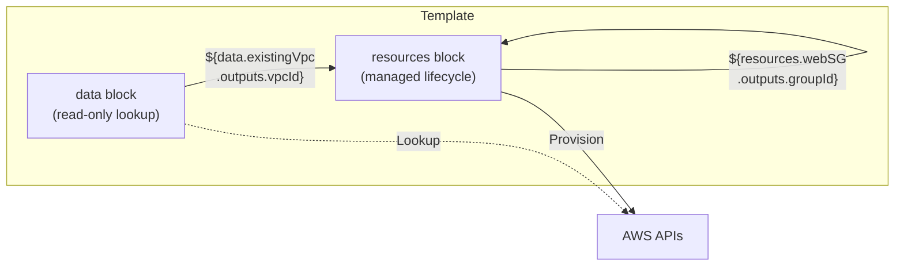
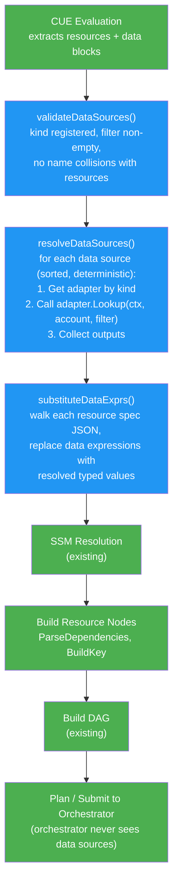
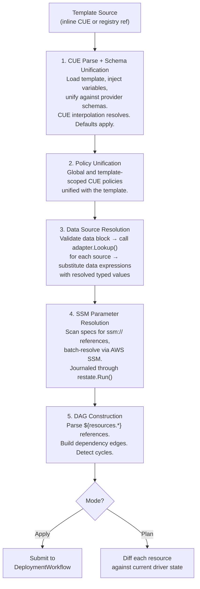
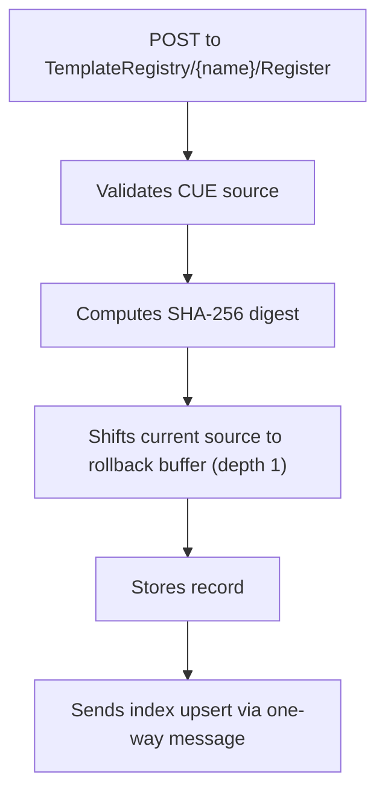
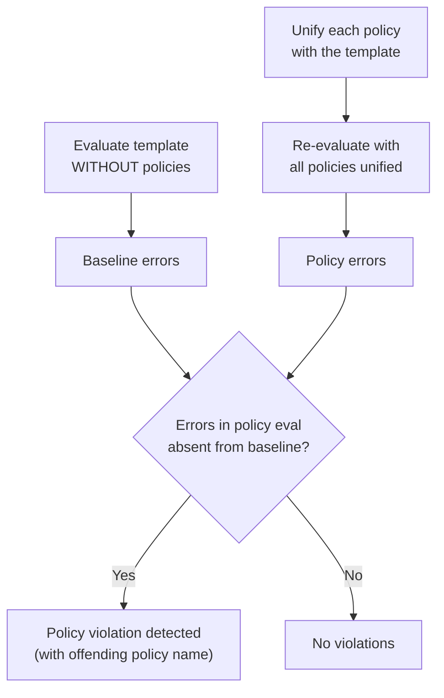
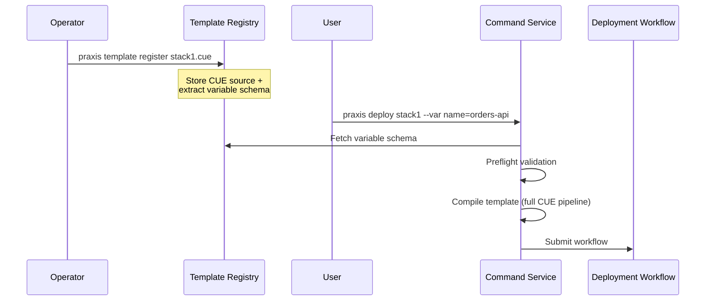
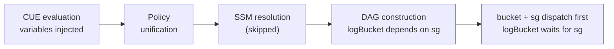
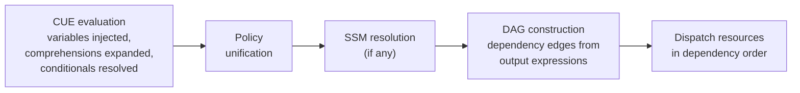

# Templates

---

## Overview

Praxis uses **CUE** for schema definition, validation, composition, defaults, and variable injection. Cross-resource dependencies are expressed with `${resources.<name>.outputs.<field>}` output expressions that resolve at dispatch time when dependency outputs become available.

Platform teams write CUE templates that define typed, validated resource compositions. End users fill in variables via CLI flags or value files. Praxis evaluates the template, resolves dependencies, and hands the result to the [orchestrator](ORCHESTRATOR.md) for execution.

---

## Why CUE

### CUE (Configure, Unify, Execute)

CUE merges types, constraints, defaults, and values into a single lattice. A CUE schema is simultaneously a type definition, a validator, a default provider, and a composition target.

- **Schema + validation + templating in one language** — no separate type system
- **Composition via unification** — layer constraints from base templates, organizational policies, and user values
- **Deep Go integration** — CUE is implemented in Go with a rich API
- **Non-Turing-complete** — safe for untrusted user input

### Output Expressions

Cross-resource references use a simple `${resources.<name>.outputs.<field>}` syntax:

- **Familiar interpolation** — standard `${...}` placeholder syntax
- **Dot-path resolution** — walks the resource output map directly, no expression language overhead
- **Type-preserving** — integers stay integers, booleans stay booleans
- **Natural for dependency references** — express that resource B needs an output from resource A

### Evaluation Phases

| Concern | Mechanism | When | Example |
|---------|----------|------|---------|
| Schema, constraints, defaults | CUE | Template authoring | `versioning: bool \| *true` |
| Variable injection | CUE interpolation | Template evaluation | `"\(variables.name)-bucket"` |
| Data source lookups | Adapter Lookup | Compilation (before DAG) | `${data.existingVpc.outputs.vpcId}` |
| Cross-resource references | Output expressions | Dispatch time | `${resources.sg.outputs.groupId}` |
| Secret references | SSM protocol | Template evaluation | `ssm:///praxis/prod/db-password` |

---

## Template Structure

A Praxis template is a CUE file with two sections:

```cue
// variables: input parameters that end users provide
variables: {
    name:        string & =~"^[a-z][a-z0-9-]{2,40}$"
    environment: "dev" | "staging" | "prod"
    vpcId:       string
}

// resources: the infrastructure to provision
resources: {
    bucket: s3.#S3Bucket & {
        metadata: name: "\(variables.name)-\(variables.environment)-assets"
        spec: {
            region:     "us-east-1"
            versioning: true
            tags: {
                app: variables.name
                env: variables.environment
            }
        }
        lifecycle: {
            preventDestroy: variables.environment == "prod"
        }
    }

    sg: ec2.#SecurityGroup & {
        metadata: name: "\(variables.name)-\(variables.environment)-sg"
        spec: {
            groupName:   "\(variables.name)-\(variables.environment)-sg"
            description: "Security group for \(variables.name)"
            vpcId:       variables.vpcId
            ingressRules: [{
                protocol:  "tcp"
                fromPort:  443
                toPort:    443
                cidrBlock: "0.0.0.0/0"
            }]
            tags: {
                app: variables.name
                env: variables.environment
            }
        }
    }

    logBucket: s3.#S3Bucket & {
        metadata: name: "\(variables.name)-\(variables.environment)-logs"
        spec: {
            region:     "us-east-1"
            versioning: false
            tags: {
                app:           variables.name
                env:           variables.environment
                securityGroup: "${resources.sg.outputs.groupId}"
            }
        }
    }
}
```

Key elements:

- **CUE constraints** — `string & =~"..."` enforces naming patterns at validation time
- **CUE unification** — `s3.#S3Bucket &` validates resources against provider schemas
- **CUE interpolation** — `\(variables.name)` resolves during CUE evaluation
- **Output expression placeholders** — `${resources.sg.outputs.groupId}` remain as strings until the dependency completes at dispatch time

## Data Sources

Templates can declare a top-level `data` block for **read-only lookups of existing cloud resources**. A data source performs a lookup against the cloud provider, returns the resource's attributes as outputs, and disappears — no state is stored, no lifecycle is tracked.

This unlocks a critical composition pattern: a team deploys a VPC once, and many application templates reference it without taking ownership.



### How Data Sources Differ from `import --observe`

| | Data Source | Import (Observed) |
|---|---|---|
| **Persistent state** | None — ephemeral per-evaluation | Yes — creates a tracked Virtual Object |
| **Drift detection** | No | Yes (read-only) |
| **Appears in `praxis get`** | No | Yes |
| **Deleted on `praxis delete`** | No | Untracked only |
| **Purpose** | Inject existing outputs into a template | Adopt unmanaged resources into Praxis |

### Data Source Syntax

Each entry in the `data` block uses a generic lookup shape:

```cue
variables: {
    environment: "dev" | "staging" | "prod"
}

data: {
    existingVpc: {
        kind:   "VPC"
        region: "us-east-1"
        filter: {
            tag: Name: "production-vpc"
        }
    }

    artifactBucket: {
        kind:   "S3Bucket"
        filter: {
            name: "company-artifacts-prod"
        }
    }
}

resources: {
    webSG: {
        apiVersion: "praxis.io/v1"
        kind:       "SecurityGroup"
        metadata: name: "web-sg"
        spec: {
            groupName:   "web-sg"
            description: "Web security group"
            vpcId:       "${data.existingVpc.outputs.vpcId}"
            ingressRules: [{
                protocol:  "tcp"
                fromPort:  443
                toPort:    443
                cidrBlock: "0.0.0.0/0"
            }]
            tags: env: variables.environment
        }
    }
}
```

### Data Source Fields

| Field | Type | Required | Description |
|---|---|---|---|
| `kind` | string | Yes | The resource kind to look up (e.g., `"VPC"`, `"S3Bucket"`, `"SecurityGroup"`). Must match a registered adapter. |
| `region` | string | No | AWS region for region-scoped resources. Required for kinds that use `KeyScopeRegion`. |
| `account` | string | No | Override the deployment's default account for this lookup. Falls back to the deployment account. |
| `filter` | struct | Yes | Provider-specific filter criteria (see below). |

### Filter Specification

Filters are a nested struct with well-known keys. Each adapter defines which filters it supports.

```cue
filter: {
    // Look up by resource ID (fastest — direct Describe call)
    id: "vpc-0abc123def456"

    // Look up by name tag (common pattern)
    name: "production-vpc"

    // Look up by tag key/value pairs
    tag: {
        Name:        "production-vpc"
        Environment: "prod"
    }
}
```

**Resolution priority** (adapters apply the first matching filter):
1. `id` — Direct `Describe<Resource>(id)` call. Fastest, no ambiguity.
2. `name` — Uses the driver's `FindByManagedKey` or a name-based Describe.
3. `tag` — Tag-based filter using the AWS `DescribeX(Filters: tag:Key=Value)` pattern.

When multiple filter fields are provided, they are ANDed (all must match).

### Data Source Expressions

Data source outputs use the `data.` prefix instead of `resources.`:

```
${data.<dataSourceName>.outputs.<fieldName>}
```

**Examples:**
- `${data.existingVpc.outputs.vpcId}` — the VPC ID
- `${data.existingVpc.outputs.cidrBlock}` — the VPC's CIDR block
- `${data.artifactBucket.outputs.arn}` — the S3 bucket ARN

These expressions follow the same rules as resource expressions:
- Must occupy the **full JSON value** at their path (no mixed interpolation).
- The expression value is replaced with the **typed output** (string, int, bool, array).
- Data source names must not collide with resource names (validated at build time).

The critical difference: data source expressions are resolved **before** the DAG is built, so they are gone by the time the orchestrator sees the plan. The orchestrator only ever sees `resources.*` expressions.

### Data Source Resolution Pipeline

Data sources are resolved during template compilation in the Command Service, between CUE evaluation and SSM resolution:



**Why resolve in the Command Service, not the Orchestrator:**

1. **DAG construction depends on data source outputs.** If a data source is needed to build a resource key (e.g., a security group scoped to a looked-up VPC ID), the key must be known before `BuildKey` runs.
2. **Plan needs resolved specs.** `praxis plan` must show the fully resolved diff, including data-sourced values.
3. **Simplicity.** The orchestrator's dispatch loop handles provisioning futures and failure cascades. Adding a separate lookup phase would complicate it significantly.

The trade-off is that data source lookups run synchronously during `plan` and `apply` compilation. This is acceptable because lookups are fast read-only API calls.

### Supported Data Source Kinds

| Kind | Outputs | Filter Support |
|---|---|---|
| `VPC` | vpcId, arn, cidrBlock, state, enableDnsHostnames, enableDnsSupport, ownerId | id, name, tag |
| `Subnet` | subnetId, cidrBlock, availabilityZone, vpcId, arn | id, name, tag |
| `SecurityGroup` | groupId, vpcId, arn, groupName | id, name, tag |
| `S3Bucket` | bucketName, arn, domainName, region | name |
| `IAMRole` | roleId, arn, roleName | id, name, tag |
| `Route53HostedZone` | hostedZoneId, nameServers, isPrivate | id, name, tag |

All other adapter kinds return a `501` error indicating lookup is not supported for that kind.

### Data Source Error Handling

| Scenario | HTTP Status | Behavior |
|---|---|---|
| Resource not found | `404` | Terminal error — `plan` and `apply` fail immediately |
| Ambiguous match (multiple results) | `409` | Terminal error — narrow the filter criteria |
| Adapter does not support lookup | `501` | Terminal error — the kind has not implemented `Lookup` |
| Invalid filter (empty or unsupported) | `400` | Terminal error at validation before any API calls |
| Name collision (data source name = resource name) | `400` | Terminal error at validation |
| Unresolved `data.*` expression reaches DAG parser | `400` | Rejected with "data sources must be resolved before dependency parsing" |

### Data Source CLI Output

When data sources are present, `plan`, `apply`, and `deploy --dry-run` print a `Data sources:` section:

```
Data sources:
  existingVpc (VPC)
    cidrBlock = 10.0.0.0/16
    vpcId     = vpc-123abc
    arn       = arn:aws:ec2:us-east-1:123456789:vpc/vpc-123abc
    state     = available
```

In JSON output mode, the same information appears in the `dataSources` response field.

### Data Source Examples

- [examples/stacks/data-source-vpc.cue](../examples/stacks/data-source-vpc.cue) — VPC lookup with security group deployment
- [examples/stacks/data-source-multi.cue](../examples/stacks/data-source-multi.cue) — Multiple lookups (S3Bucket + IAMRole)

### Extensibility: Non-AWS Data Sources

The design avoids encoding AWS-specific concepts into the syntax. The `kind` field maps to an adapter, and adapters can wrap any cloud provider. Adding GCP or Azure support follows the same pattern:

1. A GCP VPC adapter registers with `Kind() = "GCPVPC"`.
2. Templates reference it as `kind: "GCPVPC"`.
3. The adapter's `Lookup` method calls the appropriate GCP API.
4. The expression format (`data.<name>.outputs.<field>`) is identical.

---

## CUE Language Features

Praxis templates support the full CUE language. The engine evaluates CUE to completion before extracting resources, so all CUE features resolve transparently. This section documents the features most useful for template authoring.

### Variable Types

Variables support all CUE types:

```cue
variables: {
    // Scalar types
    name:        string & =~"^[a-z][a-z0-9-]{2,40}$"
    environment: "dev" | "staging" | "prod"   // disjunction (enum)
    count:       int & >=1 & <=10
    ratio:       float
    debug:       bool | *false                // default value

    // List types — for comprehension-driven templates
    buckets: [...string]                      // list of strings
    ports:   [...int]                         // list of ints
    subnets: [...{                            // list of structs
        suffix: string
        cidr:   string
        az:     string
    }]

    // Struct types
    config: {
        retries: int
        timeout: string
    }
}
```

The variable schema system extracts types `"string"`, `"bool"`, `"int"`, `"float"`, `"list"`, and `"struct"`. For list variables, the element type is tracked in the `Items` field (e.g., `"string"`, `"int"`, `"struct"`).

### Comprehensions (`for` loops)

Generate resources dynamically from list variables:

```cue
variables: {
    buckets: [...string]
}

resources: {
    for _, name in variables.buckets {
        "bucket-\(name)": {
            apiVersion: "praxis.io/v1"
            kind:       "S3Bucket"
            metadata: name: "myapp-\(name)"
            spec: {
                region:     "us-east-1"
                versioning: true
                tags: purpose: name
            }
        }
    }
}
```

With `buckets: ["orders", "payments", "logs"]`, this generates three resources: `bucket-orders`, `bucket-payments`, `bucket-logs`.

Comprehensions work with struct lists too:

```cue
variables: {
    subnets: [...{suffix: string, cidr: string, az: string}]
}

resources: {
    for _, sub in variables.subnets {
        "subnet-\(sub.suffix)": {
            apiVersion: "praxis.io/v1"
            kind:       "Subnet"
            metadata: name: "myapp-\(sub.suffix)"
            spec: {
                region:           "us-east-1"
                vpcId:            "${resources.vpc.outputs.vpcId}"
                cidrBlock:        sub.cidr
                availabilityZone: sub.az
            }
        }
    }
}
```

Nested comprehensions produce a cross-product:

```cue
variables: {
    envs: [...string]
    svcs: [...string]
}

resources: {
    for _, env in variables.envs
    for _, svc in variables.svcs {
        "\(svc)-\(env)": {
            kind: "S3Bucket"
            spec: { region: "us-east-1", bucketName: "\(svc)-\(env)" }
        }
    }
}
```

With `envs: ["dev", "prod"]` and `svcs: ["api", "web"]`, this generates four resources.

### Conditionals (`if` guards)

Include resources only when a condition is met:

```cue
variables: {
    enableLogging: bool | *false
}

resources: {
    main: {
        kind: "S3Bucket"
        spec: { region: "us-east-1", bucketName: "main" }
    }
    if variables.enableLogging {
        logs: {
            kind: "S3Bucket"
            spec: { region: "us-east-1", bucketName: "logs" }
        }
    }
}
```

When `enableLogging` is `false`, CUE omits `logs` entirely — the engine never sees it.

### Hidden Fields (`_helper`)

Fields prefixed with `_` are invisible to the resource extractor. Use them for shared configuration:

```cue
variables: {
    name:        string
    environment: string
}

_naming: {
    prefix: "\(variables.name)-\(variables.environment)"
    region: "us-east-1"
}

resources: {
    bucket: {
        kind: "S3Bucket"
        spec: {
            region:     _naming.region
            bucketName: "\(_naming.prefix)-data"
        }
    }
}
```

`_naming` resolves during CUE evaluation but does not appear as a resource.

### Lifecycle Rules

Declare protective rules on individual resources via an optional `lifecycle` block:

```cue
resources: {
    database: {
        apiVersion: "praxis.io/v1"
        kind:       "RDSInstance"
        metadata: name: "prod-db"
        spec: { ... }

        lifecycle: {
            preventDestroy: true                   // block deletion
            ignoreChanges: ["masterUserPassword"]  // ignore drift in these fields
        }
    }
}
```

| Field | Type | Default | Description |
|-------|------|---------|-------------|
| `preventDestroy` | `bool` | `false` | If `true`, the orchestrator refuses to delete this resource. Also blocks `--replace` and `--allow-replace`. Use `praxis delete --force` to override. |
| `ignoreChanges` | `[...string]` | `[]` | Dot-separated spec field paths to ignore during plan diff and reconciliation. |

Lifecycle rules are validated during CUE template evaluation (independently from driver schemas), parsed during pipeline build, and threaded through the deployment state. The orchestrator and plan diff engine enforce them.

**Field path matching:** `ignoreChanges` supports exact matches and prefix matching. Specifying `"tags"` ignores all `tags.*` fields. Specifying `"tags.env"` ignores only that specific tag.

**Conditional rules:** Use CUE expressions to set rules dynamically:

```cue
lifecycle: {
    preventDestroy: variables.environment == "prod"
}
```

**Policy integration:** Policies can enforce lifecycle rules across templates:

```cue
// All production resources must be protected
resources: [=~"-prod"]: lifecycle: preventDestroy: true
```

See [Orchestrator — Lifecycle Rules](ORCHESTRATOR.md#lifecycle-rules) for enforcement details.

### `let` Bindings

Scoped aliases that reduce duplication:

```cue
resources: {
    let prefix = "\(variables.name)-\(variables.environment)"

    bucket: {
        kind: "S3Bucket"
        spec: { region: "us-east-1", bucketName: "\(prefix)-assets" }
    }
    logs: {
        kind: "S3Bucket"
        spec: { region: "us-east-1", bucketName: "\(prefix)-logs" }
    }
}
```

`let` bindings are evaluated away before JSON export. They don't appear in the output.

### User-Defined Definitions (`#Name`)

Create reusable building blocks inside a template:

```cue
variables: {
    name: string
    env:  string
}

#StandardTags: {
    app:       variables.name
    env:       variables.env
    managedBy: "praxis"
}

resources: {
    bucket: {
        kind: "S3Bucket"
        spec: {
            region: "us-east-1"
            tags:   #StandardTags
        }
    }
}
```

Definitions (`#StandardTags`) are resolved by CUE and skipped by the resource extractor.

### Struct Embedding

Merge shared config into specs:

```cue
_baseSpec: {
    region: "us-east-1"
    tags: managedBy: "praxis"
}

resources: {
    bucket: {
        kind: "S3Bucket"
        spec: {
            _baseSpec
            bucketName: "my-bucket"
            versioning: true
        }
    }
}
```

CUE merges the embedded struct's fields into the parent, producing a flat spec with `region`, `tags`, `bucketName`, and `versioning`.

### CUE Standard Library

CUE's built-in packages (`strings`, `list`, `math`, `regexp`, etc.) are available:

```cue
import "strings"

variables: {
    name: string
}

resources: {
    bucket: {
        kind: "S3Bucket"
        spec: {
            region:     "us-east-1"
            bucketName: strings.ToLower(variables.name)
        }
    }
}
```

Functions like `strings.ToLower()`, `strings.Replace()`, `strings.Join()`, `list.Sort()`, `math.Floor()` resolve at evaluation time. The result is a concrete value in the JSON output.

### Pattern Constraints

Apply constraints to all resources matching a pattern:

```cue
// All resources whose name starts with "prod-" must have encryption
resources: [=~"^prod-"]: spec: encryption: enabled: true
```

This is the same mechanism used by [policies](#policy-as-code).

### Feature Summary

| CUE Feature | Status | Notes |
|-------------|--------|-------|
| Types, constraints, defaults | Works | `string`, `bool`, `int`, `float`, regex `=~`, bounds `>=`/`<=`, `*default` |
| Disjunctions (enums) | Works | `"a" \| "b" \| "c"` — extracted as `Enum` in variable schema |
| Definitions (`#Name`) | Works | Template-local schemas, skipped by resource extractor |
| Unification (`&`) | Works | Core validation mechanism against provider schemas |
| Optional fields (`field?:`) | Works | Used in schemas (`outputs?:`, `keyName?:`) |
| Open/closed structs | Works | `close({...})` supported natively |
| Pattern constraints | Works | `[=~"pattern"]: constraint` — used in policies |
| Struct embedding | Works | Merge shared config into specs |
| `for` comprehensions | Works | Generate N resources from list variables |
| `if` conditionals | Works | Include/exclude resources based on variables |
| `let` bindings | Works | Scoped aliases, invisible in output |
| Hidden fields (`_name`) | Works | Template-local helpers, invisible in output |
| Standard library | Works | `import "strings"`, `"list"`, `"math"`, etc. |
| Nested comprehensions | Works | Cross-product generation |
| Integer bounds | Works | `int & >=0 & <=65535` |
| `null` | Works | JSON marshaling preserves it |
| `or()` / `and()` builtins | Works | Computed disjunctions |
| Field references | Works | `spec: vpcId: resources.vpc.spec.vpcId` for intra-template refs |
| Lifecycle rules (`lifecycle:`) | Works | `preventDestroy` and `ignoreChanges` on resources — enforced at plan/delete/reconcile time |

**Not supported:** Multi-file templates (single-file is the design contract).

---

## Evaluation Pipeline

Template evaluation runs as a sequential pipeline in the Command Service:



### How the Engine Handles CUE Features

The engine calls `resourcesVal.Fields()` (without options) to iterate the `resources` block. This call returns only **regular exported fields**, which means:

- **Definitions** (`#MyResource: { ... }`) — **skipped** by `Fields()`
- **Hidden fields** (`_helper: expr`) — **skipped** by `Fields()`
- **`let` bindings** — **evaluated away** before `Fields()` runs
- **Comprehension-generated fields** — **expanded** by CUE before `Fields()` runs
- **Conditionally omitted fields** — **absent** when the guard is false

This `Fields()` behavior naturally separates "template machinery" from "resources to deploy."

### Dispatch-Time Expression Resolution

Output expressions are resolved at dispatch time as resource outputs become available:

- **Template time:** The DAG parser extracts `${resources.<name>.outputs.<field>}` patterns from JSON specs and records them as dependency edges. The expressions remain as literal strings in the spec.
- **Dispatch time:** When a dependency completes and its outputs are available, `HydrateExprs` resolves each expression by walking the dot path through the output map and writes the **typed** result back into the JSON document — strings stay strings, integers stay integers, booleans stay booleans.
- **Plan time:** For accurate diffs, the plan pipeline resolves expressions using outputs stored from the previous deployment. This allows `praxis plan` to call the adapter's `Plan()` method with a fully hydrated spec, producing real create/update/noop diffs instead of showing all expression-bearing resources as `create`. On first deploy (no prior state), expression-bearing resources are shown as `create`.

This split exists because resource outputs only exist after provisioning. Variable values are known at evaluation time and are resolved by CUE interpolation (`\(variables.name)`).

---

## Provider Schemas

Each driver ships a CUE schema that defines the valid shape of that resource type:

### S3 Bucket Schema (`schemas/aws/s3/s3.cue`)

```cue
#S3Bucket: {
    apiVersion: "praxis.io/v1"
    kind:       "S3Bucket"
    metadata: {
        name: string & =~"^[a-z0-9][a-z0-9.-]{1,61}[a-z0-9]$"
    }
    spec: {
        region:     string
        versioning: bool | *true
        acl:        "private" | "public-read" | *"private"
        encryption: {
            enabled:   bool | *true
            algorithm: *"AES256" | "aws:kms"
        }
        tags: [string]: string
    }
}
```

### Security Group Schema (`schemas/aws/ec2/sg.cue`)

```cue
#SecurityGroup: {
    apiVersion: "praxis.io/v1"
    kind:       "SecurityGroup"
    metadata: {
        name: string
    }
    spec: {
        groupName:   string
        description: string
        vpcId:       string
        ingressRules: [...{
            protocol:  "tcp" | "udp" | "icmp" | "all"
            fromPort:  int
            toPort:    int
            cidrBlock: string
        }]
        egressRules: [...{
            protocol:  "tcp" | "udp" | "icmp" | "all"
            fromPort:  int
            toPort:    int
            cidrBlock: string
        }]
        tags: [string]: string
    }
}
```

### EC2 Instance Schema (`schemas/aws/ec2/ec2.cue`)

```cue
#EC2Instance: {
    apiVersion: "praxis.io/v1"
    kind:       "EC2Instance"
    metadata: {
        name: string & =~"^[a-zA-Z0-9][a-zA-Z0-9._-]{0,254}$"
    }
    spec: {
        region:       string
        imageId:      string & =~"^ami-[a-f0-9]{8,17}$"
        instanceType: string
        keyName?:     string
        subnetId:     string
        securityGroupIds: [...string] | *[]
        userData?:          string
        iamInstanceProfile?: string
        rootVolume?: {
            sizeGiB:    int & >=1 & <=16384 | *20
            volumeType: "gp2" | "gp3" | "io1" | "io2" | "st1" | "sc1" | *"gp3"
            encrypted:  bool | *true
        }
        monitoring: bool | *false
        tags: [string]: string
    }
    outputs?: {
        instanceId:       string
        privateIpAddress: string
        publicIpAddress?: string
        privateDnsName:   string
        arn:              string
        state:            string
        subnetId:         string
        vpcId:            string
    }
}
```

Templates unify against these schemas via CUE's `&` operator. Invalid specs fail at evaluation time with path-specific error messages.

### EBS Volume Schema (`schemas/aws/ebs/ebs.cue`)

```cue
#EBSVolume: {
    apiVersion: "praxis.io/v1"
    kind:       "EBSVolume"
    metadata: {
        name: string & =~"^[a-zA-Z0-9][a-zA-Z0-9._-]{0,254}$"
        labels: [string]: string
    }
    spec: {
        region:           string
        availabilityZone: string
        volumeType:       "gp2" | "gp3" | "io1" | "io2" | "st1" | "sc1" | *"gp3"
        sizeGiB:          int & >=1 & <=16384 | *20
        iops?:            int & >=100
        throughput?:      int & >=125 & <=1000
        encrypted:        bool | *true
        kmsKeyId?:        string
        snapshotId?:      string & =~"^snap-[a-f0-9]{8,17}$"
        tags: [string]: string
    }
    outputs?: {
        volumeId:         string
        arn?:             string
        availabilityZone: string
        state:            string
        sizeGiB:          int
        volumeType:       string
        encrypted:        bool
    }
}
```

### Elastic IP Schema (`schemas/aws/ec2/eip.cue`)

```cue
#ElasticIP: {
    apiVersion: "praxis.io/v1"
    kind:       "ElasticIP"
    metadata: {
        name: string & =~"^[a-zA-Z0-9][a-zA-Z0-9._-]{0,254}$"
        labels: [string]: string
    }
    spec: {
        region:              string
        domain:              "vpc" | *"vpc"
        networkBorderGroup?: string
        publicIpv4Pool?:     string
        tags: [string]: string
    }
    outputs?: {
        allocationId:       string
        publicIp:           string
        arn:                string
        domain:             string
        networkBorderGroup: string
    }
}
```

---

## Template Registry

Templates can be registered for reuse instead of submitting inline CUE on every apply.

### Service Model

Two Restate Virtual Objects in `internal/core/registry/`:

| Object | Key | Purpose |
|--------|-----|---------|
| `TemplateRegistry` | Template name | Per-template source, digest, metadata, rollback buffer |
| `TemplateIndex` | `"global"` (fixed) | Sorted listing of all registered templates |

### Registration



### Reference in Apply/Plan

Templates can be referenced by name instead of providing inline source:

```go
type ApplyRequest struct {
    Template    string         // inline CUE source (option A)
    TemplateRef *TemplateRef   // registry reference (option B)
    Variables   map[string]any
    // ...
}

type TemplateRef struct {
    Name string `json:"name"`
}
```

Exactly one of `Template` or `TemplateRef` must be provided.

### Template Record

```go
type TemplateRecord struct {
    Metadata       TemplateMetadata
    Source         string           // current CUE source
    Digest         string           // SHA-256 of current source
    VariableSchema VariableSchema   // extracted variable schema
    PreviousSource string           // rollback buffer (depth 1)
    PreviousDigest string
}
```

The shallow rollback buffer lets operators revert a bad registration without pulling from version control. For full version history, use Git.

### Variable Schema

When a template is registered, Praxis automatically extracts the `variables:` CUE block and stores a **variable schema** alongside the source. This schema enables:

1. **Fast preflight validation** — reject invalid variables before running the CUE pipeline
2. **Discoverability** — `praxis template describe <name>` shows required variables, types, constraints, and defaults

The schema is a JSON representation of each variable's type, constraints, and defaults:

```go
type VariableField struct {
    Type     string   // "string", "bool", "int", "float", "list", "struct"
    Required bool     // true if no default exists
    Default  any      // default value if present
    Enum     []string // allowed values for disjunctions
    Items    string   // element type for list variables (e.g., "string", "int", "struct")
}

type VariableSchema map[string]VariableField
```

For example, a template with:

```cue
variables: {
    name:        string & =~"^[a-z][a-z0-9-]{2,40}$"
    environment: "dev" | "staging" | "prod"
    vpcId:       string
    buckets:     [...string]
    config:      { retries: int, timeout: string }
}
```

Produces this schema:

```json
{
  "name":        { "type": "string", "required": true },
  "environment": { "type": "string", "required": true, "enum": ["dev", "staging", "prod"] },
  "vpcId":       { "type": "string", "required": true },
  "buckets":     { "type": "list",   "required": false, "items": "string" },
  "config":      { "type": "struct", "required": true }
}
```

List variables (`[...T]`) default to `[]` in CUE, so they are not marked as required. Struct variables without defaults are required.

The `GetVariableSchema` shared handler retrieves the schema without acquiring the object lock, making it efficient for preflight validation.

---

## Policy as Code

Organizational constraints are enforced as CUE policies that unify with templates during evaluation.

### How It Works

Policies are CUE fragments that express constraints:

```cue
// require-encryption.cue — all S3 buckets must have encryption enabled
resources: [_]: spec: {
    encryption: enabled: true
}
```

When unified with a template where `encryption: enabled: false`, CUE produces a unification conflict. Praxis detects this as a **policy violation** and reports the offending policy name.

### Scope Model

| Scope | Key | Applies To |
|-------|-----|------------|
| Global | `"global"` | All templates (inline and registry) |
| Template | `"template:<name>"` | Only the named registered template |

Inline templates are subject to global policies only (there is no template name to scope against).

### Violation Detection

The engine uses a baseline-comparison approach:



Each violation carries the offending policy name for clear attribution.

### PolicyRegistry

A Restate Virtual Object keyed by scope identifier:

| Handler | Purpose |
|---------|---------|
| `AddPolicy` | Validate CUE source, check for duplicate name, compute digest, store |
| `RemovePolicy` | Remove by name |
| `GetPolicies` | Return all policies for a scope |
| `GetPolicy` | Return a single policy by name |

### Validation Modes

`ValidateTemplate` supports two modes:

| Mode | Runs | Skips | Use Case |
|------|------|-------|----------|
| **Static** | CUE parse, schema unification, policy unification, variable shape check | SSM, DAG | Fast preflight |
| **Full** | Complete evaluation pipeline | Workflow submission | Deep preflight without provisioning |

---

## SSM Secret Resolution

Templates can reference AWS SSM Parameter Store values:

```cue
spec: {
    password: "ssm:///praxis/prod/db-password"
}
```

The resolver scans all string values in the rendered JSON for `ssm://` prefixes, batch-resolves them via AWS SSM `GetParameters`, and substitutes the values in place.

### Sensitivity Tracking

Parameters marked with `?sensitive=true` are resolved normally for execution but tracked as sensitive paths. The CLI masks these values in plan output and deployment details:

```cue
spec: {
    password: "ssm:///praxis/prod/db-password?sensitive=true"
}
```

### Restate Journaling

Inside Restate handlers, SSM lookups are wrapped in `restate.Run()` so replays return the journaled result without re-issuing AWS calls. Each batch is fetched in a single `restate.Run()` call.

---

## Deploying from Templates (User API)

The primary user-facing path for deploying infrastructure is the **Deploy** API. Unlike `Apply` (which accepts inline CUE), `Deploy` requires a pre-registered template and only accepts variables.

### How It Works



### Deploy Request

```go
type DeployRequest struct {
    Template      string         `json:"template"`                // registered template name (required)
    Variables     map[string]any `json:"variables,omitempty"`     // user-provided variables
    DeploymentKey string         `json:"deploymentKey,omitempty"` // optional stable key
    Account       string         `json:"account,omitempty"`       // AWS account override
}
```

### Deploy Pipeline

1. **Validate template name** — the template must exist in the registry
2. **Fetch variable schema** — from `TemplateRegistry.GetVariableSchema` (shared handler, no lock)
3. **Preflight validation** — check required variables, types, enum constraints, list element types, and struct shapes
4. **Compile template** — full CUE evaluation pipeline with the registered source
5. **Derive deployment key** — from request or auto-generated from template name + resources
6. **Submit workflow** — same asynchronous orchestration as `Apply`

If variable validation fails, the request is rejected with a 400 error **before** the expensive CUE pipeline runs.

### PlanDeploy (Dry Run)

`PlanDeploy` is the dry-run variant of `Deploy`. It runs the full template pipeline and returns a diff plan without submitting a workflow:

```go
type PlanDeployRequest struct {
    Template  string         `json:"template"`            // registered template name
    Variables map[string]any `json:"variables,omitempty"` // user-provided variables
    Account   string         `json:"account,omitempty"`   // AWS account override
}
```

Access via CLI:

```bash
praxis deploy stack1 --var name=orders-api --dry-run
```

### Relationship to Apply

| | `Apply` | `Deploy` |
|---|---|---|
| **Audience** | Operators / developers | End users |
| **Template source** | Inline CUE or registry ref | Registry only |
| **Variable validation** | At CUE evaluation time | Preflight + CUE evaluation |
| **CUE knowledge required** | Yes | No |
| **Use case** | Development, testing, operator workflows | Production deployments |

Both use the same underlying pipeline and orchestration. `Apply` is the operator-facing entry point; `Deploy` is the user-facing entry point.

---

## End-to-End Examples

### Static Template

#### 1. Platform Engineer Creates a Template

```cue
variables: {
    name:        string & =~"^[a-z][a-z0-9-]{2,40}$"
    environment: "dev" | "staging" | "prod"
    vpcId:       string
}

resources: {
    bucket: s3.#S3Bucket & {
        metadata: name: "\(variables.name)-\(variables.environment)-assets"
        spec: {
            region:     "us-east-1"
            versioning: true
            tags: { app: variables.name, env: variables.environment }
        }
    }
    sg: ec2.#SecurityGroup & {
        metadata: name: "\(variables.name)-\(variables.environment)-sg"
        spec: {
            groupName: "\(variables.name)-\(variables.environment)-sg"
            vpcId:     variables.vpcId
            // ...
        }
    }
    logBucket: s3.#S3Bucket & {
        metadata: name: "\(variables.name)-\(variables.environment)-logs"
        spec: {
            region: "us-east-1"
            tags: {
                securityGroup: "${resources.sg.outputs.groupId}"
            }
        }
    }
}
```

#### 2. Operator Registers a Policy

```cue
// require-encryption.cue — enforce encryption on all S3 buckets
resources: [_]: spec: {
    encryption: enabled: true
}
```

Registered as a global policy, this unifies with every template. Any S3 bucket that sets `encryption: enabled: false` triggers a policy violation at evaluation time.

#### 3. Operator Registers the Template

```bash
praxis template register service-stack.cue --name service-stack
```

This stores the CUE source and extracts the variable schema. Verify with:

```bash
praxis template describe service-stack
```

Output:

```text
Template:    service-stack
Digest:      a1b2c3d4...

Variables:
  NAME          TYPE    REQUIRED  DEFAULT  CONSTRAINT
  name          string  yes       -        ^[a-z][a-z0-9-]{2,40}$
  environment   string  yes       -        dev | staging | prod
  vpcId         string  yes       -        -
```

#### 4. End User Deploys

Via the template-first Deploy command (recommended for end users):

```bash
praxis deploy service-stack \
    --var name=orders-api \
    --var environment=prod \
    --var vpcId=vpc-0abc123 \
    --account local \
    --key orders-prod
```

Or preview first with `--dry-run`:

```bash
praxis deploy service-stack \
    --var name=orders-api \
    --var environment=prod \
    --var vpcId=vpc-0abc123 \
    --dry-run
```

Or via the Restate ingress JSON API:

```bash
curl -X POST http://localhost:8080/PraxisCommandService/Deploy \
  -H 'content-type: application/json' \
  -d '{
    "template": "service-stack",
    "variables": {
      "name": "orders-api",
      "environment": "prod",
      "vpcId": "vpc-0abc123"
    },
    "deploymentKey": "orders-prod",
    "account": "local"
  }'
```

The inline deploy path is still available for operators and development:

```bash
praxis deploy service-stack.cue \
    --var name=orders-api \
    --var environment=prod \
    --var vpcId=vpc-0abc123 \
    --account local \
    --key orders-prod
```

Or via the Restate ingress JSON API directly:

```bash
curl -X POST http://localhost:8080/PraxisCommandService/Apply \
  -H 'content-type: application/json' \
  -d '{
    "template": "<CUE source as string>",
    "variables": {
      "name": "orders-api",
      "environment": "prod",
      "vpcId": "vpc-0abc123"
    },
    "deploymentKey": "orders-prod",
    "account": "local"
  }'
```

#### 5. Pipeline Runs



1. **CUE evaluation** — variables injected, interpolation resolves (`orders-api-prod-assets`), schemas validate, defaults apply (`versioning: true`, `encryption.enabled: true`)
2. **Policy unification** — global policies checked (e.g., encryption required)
3. **SSM resolution** — no SSM refs in this template, skip
4. **DAG construction** — `logBucket` depends on `sg` (detected from output expression). No cycles.

Result: `bucket` and `sg` dispatch first (no dependencies). `logBucket` waits for `sg`.

#### 6. Orchestrator Executes

- `bucket` and `sg` provision in parallel
- `sg` completes → outputs include `groupId: "sg-0ff1ce"`
- `logBucket` hydrated: `"${resources.sg.outputs.groupId}"` → `"sg-0ff1ce"`
- `logBucket` provisioned with concrete spec
- All done → deployment Complete

### Dynamic Template (Comprehensions)

#### 1. Platform Engineer Creates a Comprehension-Driven Template

```cue
variables: {
    name:          string & =~"^[a-z][a-z0-9-]{2,40}$"
    environment:   "dev" | "staging" | "prod"
    buckets:       [...string]
    enableLogging: bool | *false
}

_naming: {
    prefix: "\(variables.name)-\(variables.environment)"
}

#StandardTags: {
    app:       variables.name
    env:       variables.environment
    managedBy: "praxis"
}

resources: {
    for _, suffix in variables.buckets {
        "bucket-\(suffix)": {
            apiVersion: "praxis.io/v1"
            kind:       "S3Bucket"
            metadata: name: "\(_naming.prefix)-\(suffix)"
            spec: {
                region:     "us-east-1"
                versioning: true
                encryption: { enabled: true, algorithm: "AES256" }
                tags: #StandardTags & { purpose: suffix }
            }
        }
    }

    if variables.enableLogging {
        "log-aggregator": {
            apiVersion: "praxis.io/v1"
            kind:       "S3Bucket"
            metadata: name: "\(_naming.prefix)-logs"
            spec: {
                region:     "us-east-1"
                versioning: false
                encryption: { enabled: true, algorithm: "AES256" }
                tags: #StandardTags & { purpose: "log-aggregation" }
            }
        }
    }
}
```

#### 2. Deploy

```bash
praxis deploy dynamic-buckets \
    --var name=orders-api \
    --var environment=prod \
    --var buckets='["assets","uploads","backups"]' \
    --var enableLogging=true \
    --key orders-prod
```

Or with a vars file:

```bash
praxis deploy dynamic-buckets --account local -f vars.json --key orders-prod
```

```json
{
  "name": "orders-api",
  "environment": "prod",
  "buckets": ["assets", "uploads", "backups"],
  "enableLogging": true
}
```

#### 3. Pipeline Execution



1. **CUE evaluation** — variables injected, `for` loops expanded, `if` guards resolved, `_helpers` and `#definitions` computed, interpolation resolves, schemas validate, defaults apply
2. **Policy unification** — global policies checked (e.g., encryption required)
3. **SSM resolution** — scan for `ssm://` prefixes, batch-resolve
4. **DAG construction** — detect `${resources.*}` references, build edges, detect cycles
5. **Dispatch** — provision resources in parallel where dependencies allow

Result: Four buckets provisioned — `bucket-assets`, `bucket-uploads`, `bucket-backups`, and `log-aggregator`. The template uses hidden fields (`_naming`), definitions (`#StandardTags`), a `for` comprehension, and an `if` conditional.

---

## File Map

| Package | Files | Purpose |
|---------|-------|---------|
| `internal/core/template/` | `engine.go`, `schema.go`, `validate_vars.go`, `errors.go` | CUE evaluation, variable schema extraction and validation |
| `internal/core/registry/` | `template_registry.go`, `template_index.go`, `policy_registry.go`, `constants.go` | Template and policy Restate Virtual Objects |
| `internal/core/command/` | `pipeline.go`, `handlers_apply.go`, `handlers_deploy.go`, `handlers_plan_deploy.go`, `handlers_template.go`, `handlers_policy.go` | Template pipeline, deploy/apply handlers, CRUD pass-through |
| `internal/core/resolver/` | `ssm.go`, `restate_ssm.go` | SSM parameter resolution |
| `internal/core/dag/` | `parser.go`, `graph.go`, `scheduler.go` | Dependency extraction, DAG, scheduling |
| `schemas/aws/` | `s3/s3.cue`, `ec2/sg.cue`, `ec2/eip.cue`, `ebs/ebs.cue` | Provider schemas |
| `pkg/types/` | `template.go`, `policy.go`, `contract.go` | Shared request/response types |
