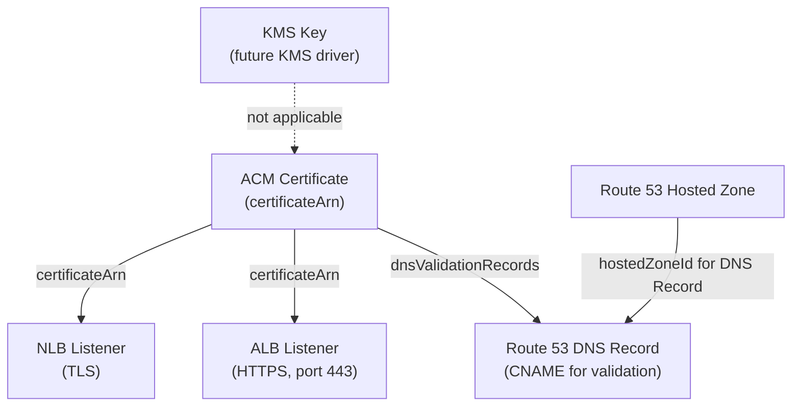

# ACM Driver Pack — Overview

---

## Table of Contents

1. [Driver Summary](#1-driver-summary)
2. [Relationships & Dependencies](#2-relationships--dependencies)
3. [Runtime Packs](#3-runtime-packs)
4. [Shared Infrastructure](#4-shared-infrastructure)
5. [Implementation Order](#5-implementation-order)
6. [Docker Compose Topology](#6-docker-compose-topology)
7. [Justfile Targets](#7-justfile-targets)
8. [Registry Integration](#8-registry-integration)
9. [Cross-Driver References](#9-cross-driver-references)
10. [Common Patterns](#10-common-patterns)
11. [Checklist](#11-checklist)

---

## 1. Driver Summary

| Driver | Kind | Key | Key Scope | Mutable | Tags | Spec Doc |
|---|---|---|---|---|---|---|
| ACM Certificate | `ACMCertificate` | `region~name` | `KeyScopeRegion` | options.certificateTransparencyLoggingPreference, tags | Yes | [ACM_CERTIFICATE_DRIVER_PLAN.md](ACM_CERTIFICATE_DRIVER_PLAN.md) |

ACM certificates are regional resources. Each certificate is identified in Praxis
by `region~metadata.name`. The AWS-assigned certificate ARN is stored only in
state and outputs — it is never part of the Virtual Object key.

DNS validation is the recommended validation method. After provisioning, the driver
outputs the CNAME records that ACM requires for domain ownership verification. Those
records are created as `DNSRecord` resources (Route 53 driver pack), forming a
natural DAG chain: `ACMCertificate → Route53 DNSRecord`. Once the CNAME records
propagate and ACM validates them, the certificate status transitions from
`PENDING_VALIDATION` to `ISSUED`.

---

## 2. Relationships & Dependencies



### Dependency Rules

| From | To | Relationship |
|---|---|---|
| Route 53 DNS Record | ACM Certificate | Validation CNAME name/value comes from certificate outputs |
| ALB Listener | ACM Certificate | HTTPS listener's `certificateArn` references the issued certificate |
| NLB Listener | ACM Certificate | TLS listener's `certificateArn` references the issued certificate |

### DNS Validation Flow

```text
ACMCertificate.Provision
  → RequestCertificate
  → DescribeCertificate (poll until DomainValidationOptions populated)
  → Store DNS validation records in outputs

User template DAG:
  "my-cert" → "cname-record-my-cert" (Route53 DNSRecord)

Once DNS propagates:
  ACMCertificate.Reconcile polls DescribeCertificate
  → status == ISSUED → stored in state
```

The certificate driver does **not** create Route 53 records automatically. That is
the user's responsibility in the template, enabling full control over which hosted
zone receives the validation CNAME.

### Ownership Boundaries

- **ACM Certificate driver**: Manages the certificate lifecycle — request, import,
  describe, delete, wait for validation status, drift detection on options and tags.
  Does NOT create DNS records, manage private CAs, or manage certificate associations
  to load balancers (that is the Listener driver's responsibility).
- **Route 53 DNS Record driver**: Creates the CNAME validation records by consuming
  `${resources.my-cert.outputs.dnsValidationRecords[0].resourceRecordName}` and
  `${resources.my-cert.outputs.dnsValidationRecords[0].resourceRecordValue}`.

---

## 3. Runtime Packs

ACM certificates belong to the **praxis-network** runtime pack alongside VPC,
Route 53, and ELB drivers. TLS/SSL certificates are network-layer security
primitives that are tightly coupled to DNS and load balancer configuration.

| Driver | Runtime Pack | Binary | Host Port |
|---|---|---|---|
| ACM Certificate | praxis-network | `cmd/praxis-network` | 9082 |

### praxis-network Entry Point (Updated)

```go
// cmd/praxis-network/main.go
rp := config.DefaultRetryPolicy()
srv := server.NewRestate().
    // ... existing network drivers ...
    Bind(restate.Reflect(acmcert.NewACMCertificateDriver(auth), rp))
```

---

## 4. Shared Infrastructure

### AWS Client

The ACM certificate driver uses the ACM API client from
`aws-sdk-go-v2/service/acm`. A new `NewACMClient(cfg aws.Config) *acm.Client`
factory is added to `internal/infra/awsclient/client.go`.

```go
func NewACMClient(cfg aws.Config) *acm.Client {
    return acm.NewFromConfig(cfg)
}
```

### Rate Limiters

| Driver | Namespace | Sustained | Burst |
|---|---|---|---|
| ACM Certificate | `acm-certificate` | 10 | 5 |

ACM API rate limits are more conservative than messaging APIs. The AWS default
quota for `RequestCertificate` is 5 requests per second in most regions.
`DescribeCertificate` has a higher limit but the driver throttles to 10 req/s
overall to avoid account-level throttling during large-scale deployments.

### Error Classifiers

The ACM certificate driver classifies AWS ACM API errors into:

- **Not found**: `ResourceNotFoundException` — certificate ARN does not exist
- **Limit exceeded**: `LimitExceededException` — account certificate quota reached (terminal error)
- **Invalid ARN**: `InvalidArnException` — malformed certificate ARN (terminal error)
- **Invalid domain**: `InvalidDomainValidationOptionsException` — bad domain/SANs (terminal error)
- **Invalid state**: `InvalidStateException` — operation not valid for certificate's current status
- **Request in progress**: `RequestInProgressException` — request already submitted, retryable
- **Throttled**: API throttling from ACM service (retryable)

### Ownership Tags

The ACM certificate driver tags each certificate with
`praxis:managed-key=<region~name>` for cross-installation conflict detection and
`FindByManagedKey` lookups during provisioning and import.

---

## 5. Implementation Order

ACM has a single driver with no intra-pack dependencies:

1. **ACM Certificate** — Self-contained. No dependencies on other ACM resources.
   Can be implemented and tested in isolation. DNS validation records appear in
   outputs and are consumed by the existing Route 53 DNS Record driver.

---

## 6. Docker Compose Topology

ACM is hosted in the existing praxis-network service. The only change required
is adding `acm` to Moto's `SERVICES` list:

```yaml
# praxis-network hosts VPC, Route53, ELB, and ACM drivers
praxis-network:
  build:
    context: .
    dockerfile: cmd/praxis-network/Dockerfile
  ports:
    - "9082:9080"
  environment:
    - AWS_ENDPOINT_URL=http://moto:4566
    - AWS_ACCESS_KEY_ID=test
    - AWS_SECRET_ACCESS_KEY=test
    - AWS_REGION=us-east-1

# Moto — add acm to SERVICES
moto:
  environment:
    - SERVICES=s3,ssm,sts,ec2,iam,route53,acm,...
```

---

## 7. Justfile Targets

### Unit Tests

```just
test-acmcert:    go test ./internal/drivers/acmcert/... -v -count=1 -race
test-acm:        go test ./internal/drivers/acmcert/... -v -count=1 -race
```

### Integration Tests

```just
test-acm-integration:
    go test ./tests/integration/ -run "TestACMCertificate" \
            -v -count=1 -tags=integration -timeout=5m

test-acmcert-integration:
    go test ./tests/integration/ -run TestACMCertificate \
            -v -count=1 -tags=integration -timeout=3m
```

### Build

```just
build-network:  # included in `build` target (already exists for VPC/Route53/ELB)
    go build -o bin/praxis-network ./cmd/praxis-network
```

---

## 8. Registry Integration

The ACM certificate adapter is registered in `internal/core/provider/registry.go`:

```go
func NewRegistry() *Registry {
    auth := authservice.NewAuthClient()
    return NewRegistryWithAdapters(
        // ... existing adapters ...
        NewACMCertificateAdapterWithAuth(auth),
        // ...
    )
}
```

### Adapter Files

| Driver | Adapter File |
|---|---|
| ACM Certificate | `internal/core/provider/acmcert_adapter.go` |

---

## 9. Cross-Driver References

In Praxis templates, ACM certificate outputs are consumed by Route 53 DNS Record
resources (for validation) and ELB listener resources (for HTTPS termination).

### Public Certificate with DNS Validation (Route 53)

```cue
resources: {
    "api-cert": {
        kind: "ACMCertificate"
        spec: {
            region:           "us-east-1"
            domainName:       "api.example.com"
            validationMethod: "DNS"
            tags: {
                "Environment": "production"
            }
        }
    }

    "api-cert-validation": {
        kind: "DNSRecord"
        spec: {
            hostedZoneId: "${resources.example-zone.outputs.hostedZoneId}"
            name:         "${resources.api-cert.outputs.dnsValidationRecords[0].resourceRecordName}"
            type:         "CNAME"
            ttl:          300
            records: [
                "${resources.api-cert.outputs.dnsValidationRecords[0].resourceRecordValue}"
            ]
        }
    }

    "https-listener": {
        kind: "Listener"
        spec: {
            loadBalancerArn: "${resources.api-alb.outputs.albArn}"
            port:            443
            protocol:        "HTTPS"
            certificateArn:  "${resources.api-cert.outputs.certificateArn}"
            defaultAction: {
                type:           "forward"
                targetGroupArn: "${resources.api-tg.outputs.targetGroupArn}"
            }
        }
    }
}
```

### Wildcard Certificate with Multiple SANs

```cue
resources: {
    "wildcard-cert": {
        kind: "ACMCertificate"
        spec: {
            region:     "us-east-1"
            domainName: "*.example.com"
            subjectAlternativeNames: [
                "example.com",
                "*.api.example.com"
            ]
            validationMethod: "DNS"
        }
    }

    "wildcard-validation-apex": {
        kind: "DNSRecord"
        spec: {
            hostedZoneId: "${resources.example-zone.outputs.hostedZoneId}"
            name:         "${resources.wildcard-cert.outputs.dnsValidationRecords[0].resourceRecordName}"
            type:         "CNAME"
            ttl:          300
            records: [
                "${resources.wildcard-cert.outputs.dnsValidationRecords[0].resourceRecordValue}"
            ]
        }
    }
}
```

> **Note on multiple SANs**: ACM deduplicates DNS validation records across SANs
> on the same root domain. A single CNAME record typically covers `example.com`
> and `*.example.com`. The `dnsValidationRecords` output includes one entry per
> unique CNAME record; the driver deduplicates records with matching
> `resourceRecordName` values.

### Certificate on NLB (TLS Listener)

```cue
resources: {
    "tls-listener": {
        kind: "Listener"
        spec: {
            loadBalancerArn: "${resources.my-nlb.outputs.nlbArn}"
            port:            443
            protocol:        "TLS"
            certificateArn:  "${resources.api-cert.outputs.certificateArn}"
            defaultAction: {
                type:           "forward"
                targetGroupArn: "${resources.backend-tg.outputs.targetGroupArn}"
            }
        }
    }
}
```

The DAG resolver handles dependency ordering automatically: `api-cert` →
`api-cert-validation` → `https-listener`.

---

## 10. Common Patterns

### ACM Certificate Driver Shares

- **`KeyScopeRegion`** — ACM certificates are regional; keys follow `<region>~<name>`
- **`praxis:managed-key` tag** — Used for cross-installation conflict detection
- **Separate rate limiter namespace** — Independent token bucket for ACM
- **Import defaults to `ModeObserved`** — Imported certificates are observed without mutation

### Certificate-Specific Patterns

| Scenario | Pattern |
|---|---|
| DNS validation | Provision outputs CNAME records; user creates `DNSRecord` resources |
| Email validation | Provision outputs the email validation status; no DNS records needed |
| Imported external cert | `Import` uses `ImportCertificate` API; no validation needed |
| Certificate renewal | ACM renews managed certificates automatically; driver reflects updated `notAfter` |
| Private CA cert | `certificateAuthorityArn` field; different status flow than public certs |

### Immutable Fields

Almost all ACM certificate attributes are immutable after creation. The only
mutable fields are `options.certificateTransparencyLoggingPreference` and `tags`.
When spec changes involve immutable fields (domain name, SANs, validation method,
key algorithm), the driver returns a terminal error instructing the user to replace
the resource.

### Certificate Lifecycle States

| AWS Status | Meaning | Driver Behavior |
|---|---|---|
| `PENDING_VALIDATION` | Waiting for DNS/email validation | Outputs DNS records; `GetStatus` returns `Pending` |
| `ISSUED` | Validated and active | `GetStatus` returns `Active`; full outputs available |
| `INACTIVE` | Not currently in use | `GetStatus` returns `Inactive` |
| `EXPIRED` | Past `notAfter` date | `GetStatus` returns `Error`; logged as drift |
| `VALIDATION_TIMED_OUT` | Validation not completed in time | Terminal error with explanation |
| `FAILED` | Request failed | Terminal error with `failureReason` |
| `REVOKED` | Certificate has been revoked | `GetStatus` returns `Error` |

---

## 11. Checklist

### Schemas

- [x] `schemas/aws/acm/certificate.cue`

### Drivers (types + aws + drift + driver)

- [x] `internal/drivers/acmcert/`

### Adapters

- [x] `internal/core/provider/acmcert_adapter.go`

### Registry

- [x] `acmcert` adapter registered in `NewRegistry()`

### Tests

- [x] Unit tests for `acmcert` driver
- [x] Integration tests for `acmcert` driver

### Infrastructure

- [x] `internal/infra/awsclient/client.go` — Add `NewACMClient()`
- [x] `cmd/praxis-network/main.go` — Bind ACM certificate driver
- [x] `docker-compose.yaml` — Add `acm` to Moto SERVICES
- [x] `justfile` — Add ACM test targets

### Documentation

- [x] [ACM_CERTIFICATE_DRIVER_PLAN.md](ACM_CERTIFICATE_DRIVER_PLAN.md)
- [x] This overview document
