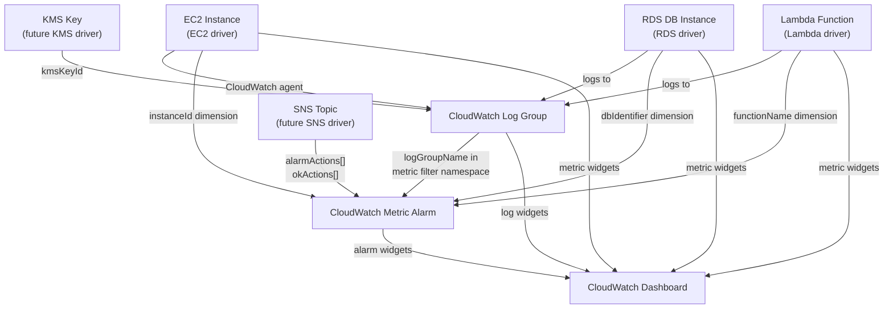

# CloudWatch Driver Pack — Overview

---

## Table of Contents

1. [Driver Summary](#1-driver-summary)
2. [Relationships & Dependencies](#2-relationships--dependencies)
3. [Driver Pack: praxis-monitoring](#3-driver-pack-praxis-monitoring)
4. [Shared Infrastructure](#4-shared-infrastructure)
5. [Implementation Order](#5-implementation-order)
6. [go.mod Changes](#6-gomod-changes)
7. [Docker Compose Changes](#7-docker-compose-changes)
8. [Justfile Changes](#8-justfile-changes)
9. [Registry Integration](#9-registry-integration)
10. [Cross-Driver References](#10-cross-driver-references)
11. [Common Patterns](#11-common-patterns)
12. [Checklist](#12-checklist)

---

## 1. Driver Summary

| Driver | Kind | Key | Key Scope | Mutable | Tags | Spec Doc |
|---|---|---|---|---|---|---|
| CloudWatch Log Group | `LogGroup` | `region~logGroupName` | `KeyScopeRegion` | retentionInDays, kmsKeyId, tags | Yes | [LOG_GROUP_DRIVER_PLAN.md](LOG_GROUP_DRIVER_PLAN.md) |
| CloudWatch Metric Alarm | `MetricAlarm` | `region~alarmName` | `KeyScopeRegion` | threshold, comparisonOperator, evaluationPeriods, period, statistic, treatMissingData, alarmActions, okActions, insufficientDataActions, datapointsToAlarm, tags | Yes | [METRIC_ALARM_DRIVER_PLAN.md](METRIC_ALARM_DRIVER_PLAN.md) |
| CloudWatch Dashboard | `Dashboard` | `region~dashboardName` | `KeyScopeRegion` | dashboardBody, tags | No | [DASHBOARD_DRIVER_PLAN.md](DASHBOARD_DRIVER_PLAN.md) |

All three drivers use `KeyScopeRegion` — CloudWatch resources are regional, keys
are prefixed with the region (`<region>~<name>`).

---

## 2. Relationships & Dependencies



### Dependency Rules

| From | To | Relationship |
|---|---|---|
| Log Group | KMS Key | Log group's `kmsKeyId` references a KMS key ARN for encryption |
| Metric Alarm | SNS Topic | Alarm's `alarmActions[]`, `okActions[]`, `insufficientDataActions[]` reference SNS topic ARNs |
| Metric Alarm | Log Group | Alarm can monitor metrics derived from log group metric filters |
| Dashboard | Log Group | Dashboard widgets can reference log groups for log query widgets |
| Dashboard | Metric Alarm | Dashboard widgets can display alarm status |
| Lambda Function | Log Group | Lambda automatically creates `/aws/lambda/<functionName>` log groups |
| RDS DB Instance | Log Group | RDS publishes logs to `/aws/rds/instance/<dbIdentifier>/<logType>` log groups |

### Ownership Boundaries

- **Log Group driver**: Manages the log group lifecycle (create, set retention,
  configure encryption, delete). Does NOT manage log streams, subscription filters,
  metric filters, or log data. Those are future extensions or handled by the
  applications producing logs.
- **Metric Alarm driver**: Manages metric alarm lifecycle (create, update threshold
  and actions, delete). Does NOT manage composite alarms, anomaly detection bands,
  or alarm suppression rules. Composite alarms are a future extension.
- **Dashboard driver**: Manages dashboard lifecycle (create, update body, delete).
  Does NOT manage dashboard sharing, annotations, or automatic dashboards (those
  are CloudWatch features, not resources). Dashboard body is a JSON document
  containing widget definitions.

---

## 3. Driver Pack: praxis-monitoring

### New Entry Point

**File**: `cmd/praxis-monitoring/main.go`

```go
package main

import (
    "context"
    "log/slog"
    "os"

    restate "github.com/restatedev/sdk-go"
    server "github.com/restatedev/sdk-go/server"

    "github.com/shirvan/praxis/internal/core/config"
    "github.com/shirvan/praxis/internal/drivers/loggroup"
    "github.com/shirvan/praxis/internal/drivers/metricalarm"
    "github.com/shirvan/praxis/internal/drivers/dashboard"
)

func main() {
    cfg := config.Load()

    rp := config.DefaultRetryPolicy()
    srv := server.NewRestate().
        Bind(restate.Reflect(loggroup.NewLogGroupDriver(auth), rp)).
        Bind(restate.Reflect(metricalarm.NewMetricAlarmDriver(auth), rp)).
        Bind(restate.Reflect(dashboard.NewDashboardDriver(auth), rp))

    if err := srv.Start(context.Background(), cfg.ListenAddr); err != nil {
        slog.Error("praxis-monitoring exited unexpectedly", "err", err.Error())
        os.Exit(1)
    }
}
```

### Dockerfile

**File**: `cmd/praxis-monitoring/Dockerfile`

Follows same pattern as existing driver packs.

```dockerfile
FROM golang:1.25-alpine AS build
WORKDIR /src
COPY go.mod go.sum ./
RUN go mod download
COPY . .
RUN CGO_ENABLED=0 go build -o /praxis-monitoring ./cmd/praxis-monitoring

FROM gcr.io/distroless/static-debian12:nonroot
COPY --from=build /praxis-monitoring /praxis-monitoring
ENTRYPOINT ["/praxis-monitoring"]
```

### Port: 9086

| Pack | Port |
|---|---|
| praxis-storage | 9081 |
| praxis-network | 9082 |
| praxis-core | 9083 |
| praxis-compute | 9084 |
| praxis-identity | 9085 |
| **praxis-monitoring** | **9086** |

---

## 4. Shared Infrastructure

### AWS Clients

CloudWatch drivers use **two** SDK packages because CloudWatch Logs and CloudWatch
Metrics/Dashboards are separate AWS API surfaces:

| SDK Package | Used By |
|---|---|
| `aws-sdk-go-v2/service/cloudwatchlogs` | Log Group driver |
| `aws-sdk-go-v2/service/cloudwatch` | Metric Alarm driver, Dashboard driver |

Two new factory functions are needed in `internal/infra/awsclient/client.go`:

```go
import (
    "github.com/aws/aws-sdk-go-v2/service/cloudwatch"
    "github.com/aws/aws-sdk-go-v2/service/cloudwatchlogs"
)

// NewCloudWatchClient creates a CloudWatch API client from the given AWS config.
func NewCloudWatchClient(cfg aws.Config) *cloudwatch.Client {
    return cloudwatch.NewFromConfig(cfg)
}

// NewCloudWatchLogsClient creates a CloudWatch Logs API client from the given AWS config.
func NewCloudWatchLogsClient(cfg aws.Config) *cloudwatchlogs.Client {
    return cloudwatchlogs.NewFromConfig(cfg)
}
```

### Rate Limiters

Each driver uses its own rate limiter namespace:

| Driver | Namespace | Sustained | Burst |
|---|---|---|---|
| Log Group | `cloudwatch-logs` | 10 | 5 |
| Metric Alarm | `cloudwatch-alarm` | 10 | 5 |
| Dashboard | `cloudwatch-dashboard` | 10 | 5 |

CloudWatch API rate limits are moderate. The `DescribeLogGroups` API has a limit of
5 TPS; `PutMetricAlarm` has a limit of 3 TPS per account. The sustained rate of
10 req/s per namespace with burst of 5 provides headroom while respecting aggregate
account-level limits.

### Error Classifiers

#### CloudWatch Logs Errors (Log Group Driver)

- **Not found**: `ResourceNotFoundException` — log group does not exist
- **Already exists**: `ResourceAlreadyExistsException` — log group already exists
- **Invalid parameter**: `InvalidParameterException` — bad input (terminal error)
- **Limit exceeded**: `LimitExceededException` — account limit reached (terminal error)
- **Service unavailable**: `ServiceUnavailableException` — CloudWatch Logs internal error (retryable)
- **Throttled**: `ThrottlingException` — API rate limit (retryable)

#### CloudWatch Errors (Metric Alarm, Dashboard Drivers)

- **Not found**: `ResourceNotFoundException` — alarm or dashboard does not exist
- **Already exists**: — (not applicable; `PutMetricAlarm` and `PutDashboard` are upserts)
- **Invalid parameter**: `InvalidParameterValueException`, `InvalidParameterCombinationException` — bad input (terminal error)
- **Limit exceeded**: `LimitExceededFault` — account alarm limit reached (terminal error)
- **Dashboard validation**: `DashboardInvalidInputError` — malformed dashboard body (terminal error)
- **Throttled**: `ThrottlingException` — API rate limit (retryable)

Each driver defines its own classifiers because the relevant subset of errors differs
per resource type and API surface.

### Ownership Tags

- **Log Group**: Log group names are unique per region per account. AWS rejects
  duplicates on `CreateLogGroup`. The driver adds `praxis:managed-key=<region~logGroupName>`
  as a tag for cross-installation conflict detection.
- **Metric Alarm**: Alarm names are unique per region per account. `PutMetricAlarm`
  is an upsert — calling it on an existing alarm updates it. The driver adds
  `praxis:managed-key=<region~alarmName>` as a tag to detect unmanaged alarms
  during import.
- **Dashboard**: Dashboard names are unique per region per account. `PutDashboard`
  is an upsert. No ownership tag needed — dashboards are not taggable resources
  in the traditional sense (they use a separate `TagResource` API with the
  dashboard ARN).

---

## 5. Implementation Order

The recommended implementation order respects dependencies and allows incremental
testing:

### Phase 1: Foundation (no cross-CloudWatch dependencies)

1. **Log Group** — No dependencies on other CloudWatch resources. Simple
   create/describe/delete lifecycle. Good for establishing CloudWatch SDK
   patterns (error classification, API wrappers, tag management). Most commonly
   used CloudWatch resource — virtually every AWS workload produces logs.

### Phase 2: Alarms

2. **Metric Alarm** — May reference SNS topics (external dependency) for alarm
   actions. References CloudWatch metrics by namespace/metric name/dimensions.
   More complex spec with threshold configurations and multiple action lists.

### Phase 3: Dashboards

3. **Dashboard** — May reference log groups and alarms in widget definitions
   (soft references via dashboard body JSON, not hard resource dependencies).
   Simplest lifecycle (upsert model) but largest spec (JSON body).

### Dependency Test Order

```text
Log Group → Metric Alarm → Dashboard
```

---

## 6. go.mod Changes

Add the CloudWatch SDK packages:

```text
github.com/aws/aws-sdk-go-v2/service/cloudwatch      v1.x.x
github.com/aws/aws-sdk-go-v2/service/cloudwatchlogs   v1.x.x
```

Run:

```bash
go get github.com/aws/aws-sdk-go-v2/service/cloudwatch
go get github.com/aws/aws-sdk-go-v2/service/cloudwatchlogs
go mod tidy
```

---

## 7. Docker Compose Changes

**File**: `docker-compose.yaml` — add the `praxis-monitoring` service:

```yaml
  praxis-monitoring:
    build:
      context: .
      dockerfile: cmd/praxis-monitoring/Dockerfile
    container_name: praxis-monitoring
    env_file:
      - .env
    depends_on:
      restate:
        condition: service_healthy
      moto-init:
        condition: service_completed_successfully
    ports:
      - "9086:9080"
    environment:
      - PRAXIS_LISTEN_ADDR=0.0.0.0:9080
```

### Restate Registration

```bash
curl -s -X POST http://localhost:9070/deployments \
  -H 'content-type: application/json' \
  -d '{"uri": "http://praxis-monitoring:9080"}'
```

All three services are discovered automatically from the single registration endpoint
via Restate's reflection-based service discovery.

---

## 8. Justfile Changes

Add targets for the new driver pack and individual drivers:

```just
# Monitoring driver pack
build-monitoring:
    go build ./cmd/praxis-monitoring/...

test-monitoring:
    go test ./internal/drivers/loggroup/... ./internal/drivers/metricalarm/... \
            ./internal/drivers/dashboard/... \
            -v -count=1 -race

test-monitoring-integration:
    go test ./tests/integration/ -run "TestLogGroup|TestMetricAlarm|TestDashboard" \
            -v -count=1 -tags=integration -timeout=10m

# Individual driver targets
test-loggroup:
    go test ./internal/drivers/loggroup/... -v -count=1 -race

test-metricalarm:
    go test ./internal/drivers/metricalarm/... -v -count=1 -race

test-dashboard:
    go test ./internal/drivers/dashboard/... -v -count=1 -race

logs-monitoring:
    docker compose logs -f praxis-monitoring
```

---

## 9. Registry Integration

**File**: `internal/core/provider/registry.go`

Add all three adapters to `NewRegistry()`:

```go
func NewRegistry() *Registry {
    auth := authservice.NewAuthClient()
    return NewRegistryWithAdapters(
        // ... existing adapters ...

        // CloudWatch / Monitoring drivers
        NewLogGroupAdapterWithAuth(auth),
        NewMetricAlarmAdapterWithAuth(auth),
        NewDashboardAdapterWithAuth(auth),
    )
}
```

### Adapter Files

| Driver | Adapter File |
|---|---|
| Log Group | `internal/core/provider/loggroup_adapter.go` |
| Metric Alarm | `internal/core/provider/metricalarm_adapter.go` |
| Dashboard | `internal/core/provider/dashboard_adapter.go` |

---

## 10. Cross-Driver References

In Praxis templates, CloudWatch resources reference each other and external resources
via output expressions:

### Log Group with Retention and Encryption

```cue
resources: {
    "app-logs": {
        kind: "LogGroup"
        spec: {
            region: "us-east-1"
            logGroupName: "/app/myservice"
            retentionInDays: 30
            tags: {
                Environment: "production"
                Service: "myservice"
            }
        }
    }
}
```

### Metric Alarm on Lambda Errors

```cue
resources: {
    "api-handler": {
        kind: "LambdaFunction"
        spec: {
            functionName: "api-handler"
            // ...
        }
    }
    "api-error-alarm": {
        kind: "MetricAlarm"
        spec: {
            region: "us-east-1"
            alarmName: "api-handler-errors"
            namespace: "AWS/Lambda"
            metricName: "Errors"
            dimensions: {
                FunctionName: "${resources.api-handler.outputs.functionName}"
            }
            statistic: "Sum"
            period: 300
            evaluationPeriods: 2
            threshold: 5
            comparisonOperator: "GreaterThanThreshold"
            treatMissingData: "notBreaching"
            alarmActions: ["${resources.ops-topic.outputs.topicArn}"]
        }
    }
}
```

### Dashboard Referencing Multiple Resources

```cue
resources: {
    "ops-dashboard": {
        kind: "Dashboard"
        spec: {
            region: "us-east-1"
            dashboardName: "myapp-operations"
            dashboardBody: """
            {
                "widgets": [
                    {
                        "type": "metric",
                        "properties": {
                            "metrics": [
                                ["AWS/Lambda", "Invocations", "FunctionName", "api-handler"],
                                ["AWS/Lambda", "Errors", "FunctionName", "api-handler"]
                            ],
                            "period": 300,
                            "title": "Lambda Invocations & Errors"
                        }
                    },
                    {
                        "type": "metric",
                        "properties": {
                            "metrics": [
                                ["AWS/RDS", "CPUUtilization", "DBInstanceIdentifier", "myapp-db"]
                            ],
                            "period": 300,
                            "title": "RDS CPU"
                        }
                    },
                    {
                        "type": "log",
                        "properties": {
                            "query": "fields @timestamp, @message | sort @timestamp desc | limit 50",
                            "region": "us-east-1",
                            "title": "Application Logs"
                        }
                    }
                ]
            }
            """
        }
    }
}
```

### Full Monitoring Stack

```cue
resources: {
    "app-logs": {
        kind: "LogGroup"
        spec: {
            region: "us-east-1"
            logGroupName: "/app/myservice"
            retentionInDays: 14
        }
    }
    "error-alarm": {
        kind: "MetricAlarm"
        spec: {
            region: "us-east-1"
            alarmName: "myservice-errors-high"
            namespace: "MyApp"
            metricName: "ErrorCount"
            statistic: "Sum"
            period: 60
            evaluationPeriods: 3
            datapointsToAlarm: 2
            threshold: 10
            comparisonOperator: "GreaterThanThreshold"
            treatMissingData: "notBreaching"
            alarmActions: ["${resources.ops-topic.outputs.topicArn}"]
            okActions: ["${resources.ops-topic.outputs.topicArn}"]
        }
    }
    "latency-alarm": {
        kind: "MetricAlarm"
        spec: {
            region: "us-east-1"
            alarmName: "myservice-latency-high"
            namespace: "MyApp"
            metricName: "ResponseTime"
            statistic: "p99"
            period: 300
            evaluationPeriods: 2
            threshold: 2000
            comparisonOperator: "GreaterThanThreshold"
            treatMissingData: "missing"
            alarmActions: ["${resources.ops-topic.outputs.topicArn}"]
        }
    }
    "ops-dashboard": {
        kind: "Dashboard"
        spec: {
            region: "us-east-1"
            dashboardName: "myservice-ops"
            dashboardBody: """
            {
                "widgets": [
                    {
                        "type": "metric",
                        "properties": {
                            "metrics": [
                                ["MyApp", "ErrorCount"],
                                ["MyApp", "ResponseTime", {"stat": "p99"}]
                            ],
                            "period": 60,
                            "title": "Error Rate & Latency"
                        }
                    },
                    {
                        "type": "alarm",
                        "properties": {
                            "alarms": [
                                "${resources.error-alarm.outputs.alarmArn}",
                                "${resources.latency-alarm.outputs.alarmArn}"
                            ],
                            "title": "Alarm Status"
                        }
                    }
                ]
            }
            """
        }
    }
}
```

The DAG resolver handles dependency ordering automatically based on these expression
references.

---

## 11. Common Patterns

### All CloudWatch Drivers Share

- **`KeyScopeRegion`** — All CloudWatch resources are regional; keys follow `<region>~<name>`
- **Resource name uniqueness** — Log group names, alarm names, and dashboard names are
  unique per region per account. AWS rejects or upserts duplicates. This eliminates the
  need for `FindByManagedKey` — the create/put call itself provides the conflict signal
- **Import defaults to `ModeObserved`** — CloudWatch resources may be auto-created by
  other AWS services (e.g., Lambda auto-creates log groups). Import without mutation
  avoids disrupting existing monitoring

### SDK Split

| Driver | SDK Package | Note |
|---|---|---|
| Log Group | `cloudwatchlogs` | Separate API surface for CloudWatch Logs |
| Metric Alarm | `cloudwatch` | Core CloudWatch API |
| Dashboard | `cloudwatch` | Core CloudWatch API (shared with alarms) |

Metric Alarm and Dashboard drivers share the same `cloudwatch.Client` but use
separate rate limiter namespaces to prevent dashboard operations from starving
alarm operations.

### Driver-Specific Patterns

| Driver | Notable Pattern |
|---|---|
| Log Group | Simple CRUD; `CreateLogGroup` is separate from `PutRetentionPolicy` — retention is a secondary API call; log group class (`STANDARD` vs `INFREQUENT_ACCESS`) is immutable after creation |
| Metric Alarm | `PutMetricAlarm` is an upsert — the same call handles create and update; extensive configuration surface (dimensions, statistics, comparison operators, multiple action lists); extended statistics (`p99`, `p95`) use `ExtendedStatistic` instead of `Statistic` |
| Dashboard | `PutDashboard` is an upsert; body is a JSON string; validation errors return structured `DashboardValidationMessage` list; no tagging support via standard CloudWatch `TagResource` |

### Driver Complexity Ranking

| Driver | Complexity | Reason |
|---|---|---|
| Log Group | Low | Simple CRUD; few mutable fields; no sub-resources |
| Dashboard | Low–Medium | Upsert model simplifies lifecycle; body is opaque JSON (validated by AWS); no fine-grained drift detection on body contents |
| Metric Alarm | Medium | Many configuration fields; dimension handling; multiple action lists; extended statistics; state transitions (OK → ALARM → INSUFFICIENT_DATA) |

---

## 12. Checklist

### Infrastructure

- [x] `go get github.com/aws/aws-sdk-go-v2/service/cloudwatch` added
- [x] `go get github.com/aws/aws-sdk-go-v2/service/cloudwatchlogs` added
- [x] `cmd/praxis-monitoring/main.go` created
- [x] `cmd/praxis-monitoring/Dockerfile` created
- [x] `docker-compose.yaml` updated with `praxis-monitoring` service
- [x] `justfile` updated with monitoring targets

### Schemas

- [x] `schemas/aws/cloudwatch/log_group.cue`
- [x] `schemas/aws/cloudwatch/metric_alarm.cue`
- [x] `schemas/aws/cloudwatch/dashboard.cue`

### Drivers (per driver: types + aws + drift + driver)

- [x] `internal/drivers/loggroup/`
- [x] `internal/drivers/metricalarm/`
- [x] `internal/drivers/dashboard/`

### Adapters

- [x] `internal/core/provider/loggroup_adapter.go`
- [x] `internal/core/provider/metricalarm_adapter.go`
- [x] `internal/core/provider/dashboard_adapter.go`

### Registry

- [x] All 3 adapters registered in `NewRegistry()`

### Tests

- [x] Unit tests for all 3 drivers
- [x] Integration tests for all 3 drivers
- [ ] Cross-driver integration test (LogGroup → MetricAlarm → Dashboard)

### Documentation

- [x] [LOG_GROUP_DRIVER_PLAN.md](LOG_GROUP_DRIVER_PLAN.md)
- [x] [METRIC_ALARM_DRIVER_PLAN.md](METRIC_ALARM_DRIVER_PLAN.md)
- [x] [DASHBOARD_DRIVER_PLAN.md](DASHBOARD_DRIVER_PLAN.md)
- [x] This overview document
