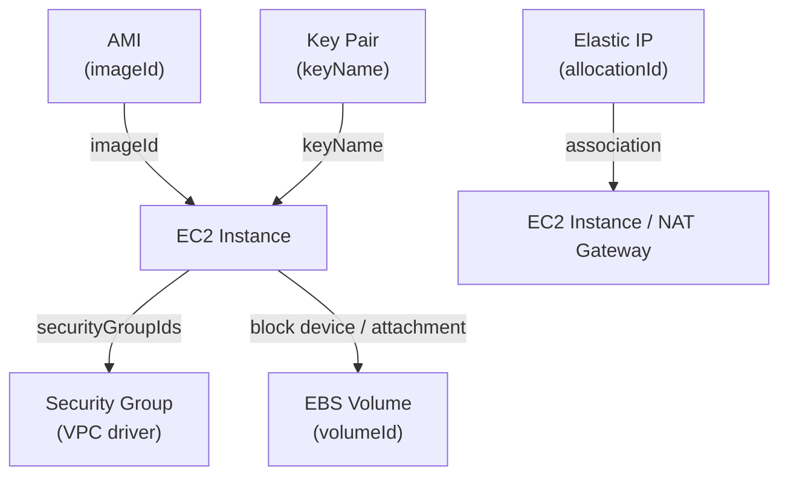

# EC2 Driver Pack — Overview

---

## Table of Contents

1. [Driver Summary](#1-driver-summary)
2. [Relationships & Dependencies](#2-relationships--dependencies)
3. [Runtime Packs](#3-runtime-packs)
4. [Shared Infrastructure](#4-shared-infrastructure)
5. [Implementation Order](#5-implementation-order)
6. [Docker Compose Topology](#6-docker-compose-topology)
7. [Justfile Targets](#7-justfile-targets)
8. [Registry Integration](#8-registry-integration)
9. [Cross-Driver References](#9-cross-driver-references)
10. [Common Patterns](#10-common-patterns)
11. [Checklist](#11-checklist)

---

## 1. Driver Summary

| Driver | Kind | Key | Key Scope | Mutable | Tags | Plan Doc |
|---|---|---|---|---|---|---|
| EC2 Instance | `EC2Instance` | `region~instanceName` | `KeyScopeRegion` | instanceType (stop/start), securityGroupIds, monitoring, tags | Yes | [EC2_DRIVER_PLAN.md](EC2_DRIVER_PLAN.md) |
| AMI | `AMI` | `region~name` | `KeyScopeRegion` | tags, description | Yes | [AMI_DRIVER_PLAN.md](AMI_DRIVER_PLAN.md) |
| EBS Volume | `EBSVolume` | `region~volumeName` | `KeyScopeRegion` | iops, throughput (type-dependent), tags | Yes | [EBS_DRIVER_PLAN.md](EBS_DRIVER_PLAN.md) |
| Elastic IP | `ElasticIP` | `region~name` | `KeyScopeRegion` | tags, association | Yes | [EIP_DRIVER_PLAN.md](EIP_DRIVER_PLAN.md) |
| Key Pair | `KeyPair` | `region~keyName` | `KeyScopeRegion` | tags | Yes | [KEYPAIR_DRIVER_PLAN.md](KEYPAIR_DRIVER_PLAN.md) |
| Launch Template | `LaunchTemplate` | TBD | TBD | TBD | TBD | [LAUNCH_TEMPLATE_DRIVER_PLAN.md](LAUNCH_TEMPLATE_DRIVER_PLAN.md) |

All five implemented drivers use `KeyScopeRegion` — EC2 resources are regional, keys are
prefixed with the region (`<region>~<name>`).

---

## 2. Relationships & Dependencies



### Dependency Rules

| From | To | Relationship |
|---|---|---|
| EC2 Instance | AMI | Instance's `imageId` references an AMI |
| EC2 Instance | Key Pair | Instance's `keyName` references a key pair |
| EC2 Instance | Security Group | Instance's `securityGroupIds[]` references SG IDs |
| EC2 Instance | Subnet | Instance's `subnetId` references a subnet (VPC driver pack) |
| EC2 Instance | IAM Instance Profile | Instance's `iamInstanceProfile` references a profile ARN (future IAM pack) |
| EBS Volume | EC2 Instance | Volumes attach to instances (out-of-band or via block device mappings) |
| Elastic IP | EC2 Instance | EIP associates to an instance's ENI |
| Elastic IP | NAT Gateway | EIP associates to a NAT gateway (VPC driver pack) |

### Ownership Boundaries

- **EC2 Instance driver**: Manages the instance lifecycle (create, stop/start for type
  change, terminate). Does NOT manage attached EBS volumes or EIP associations.
- **AMI driver**: Manages AMI registration/deregistration. Two creation paths: from
  snapshot or cross-region copy.
- **EBS Volume driver**: Manages volume lifecycle (create, modify, delete). Does NOT
  manage attachments to instances.
- **Elastic IP driver**: Manages allocation/release. Does NOT manage association to
  instances (that's the instance or NAT gateway's concern).
- **Key Pair driver**: Manages key pair creation/import/deletion. Private key material
  is returned only once on creation and never stored.

---

## 3. Runtime Packs

The EC2 driver family spans **three** runtime packs:

| Driver | Runtime Pack | Binary | Host Port |
|---|---|---|---|
| EC2 Instance | praxis-compute | `cmd/praxis-compute` | 9084 |
| AMI | praxis-compute | `cmd/praxis-compute` | 9084 |
| Key Pair | praxis-compute | `cmd/praxis-compute` | 9084 |
| EBS Volume | praxis-storage | `cmd/praxis-storage` | 9081 |
| Elastic IP | praxis-network | `cmd/praxis-network` | 9082 |

### praxis-compute Entry Point

```go
// cmd/praxis-compute/main.go
auth := authservice.NewAuthClient()
rp := config.DefaultRetryPolicy()
srv := server.NewRestate().
    Bind(restate.Reflect(ami.NewAMIDriver(auth), rp)).
    Bind(restate.Reflect(keypair.NewKeyPairDriver(auth), rp)).
    Bind(restate.Reflect(ec2.NewEC2InstanceDriver(auth), rp)).
    // Also hosts ECR, Lambda, and ESM drivers
    Bind(restate.Reflect(ecrrepo.NewECRRepositoryDriver(auth), rp)).
    Bind(restate.Reflect(ecrpolicy.NewECRLifecyclePolicyDriver(auth), rp)).
    Bind(restate.Reflect(esm.NewEventSourceMappingDriver(auth), rp)).
    Bind(restate.Reflect(lambda.NewLambdaFunctionDriver(auth), rp)).
    Bind(restate.Reflect(lambdalayer.NewLambdaLayerDriver(auth), rp)).
    Bind(restate.Reflect(lambdaperm.NewLambdaPermissionDriver(auth), rp))
```

### praxis-storage Entry Point (EBS)

```go
// cmd/praxis-storage/main.go
auth := authservice.NewAuthClient()
rp := config.DefaultRetryPolicy()
srv := server.NewRestate().
    Bind(restate.Reflect(s3.NewS3BucketDriver(auth), rp)).
    Bind(restate.Reflect(ebs.NewEBSVolumeDriver(auth), rp))
```

### praxis-network Entry Point (EIP)

```go
// cmd/praxis-network/main.go — EIP among network drivers
Bind(restate.Reflect(eip.NewElasticIPDriver(auth), rp))
```

---

## 4. Shared Infrastructure

### AWS Client

All five drivers use the EC2 API client from `aws-sdk-go-v2/service/ec2`. EBS and
EIP are EC2 subsystems — they share the same API surface. S3 is the only storage
driver with its own client (`aws-sdk-go-v2/service/s3`).

The client is created per-account via the auth registry's `GetConfig(account)` method.

### Rate Limiters

Each driver uses its own rate limiter namespace:

| Driver | Namespace | Sustained | Burst |
|---|---|---|---|
| EC2 Instance | `ec2-instance` | 20 | 10 |
| AMI | `ami` | 20 | 10 |
| EBS Volume | `ebs-volume` | 20 | 10 |
| Elastic IP | `elastic-ip` | 20 | 10 |
| Key Pair | `key-pair` | 20 | 10 |

Unlike the IAM driver pack (which shares a single `"iam"` bucket), EC2 drivers use
separate namespaces because the EC2 API has per-action rate limits rather than a
single global quota.

### Error Classifiers

All drivers classify AWS API errors into:

- **Not found**: Instance/volume/AMI terminated, released, or deregistered
- **Already exists**: Duplicate managed key, name conflict
- **Conflict**: Resource in wrong state for the requested operation

Each driver defines its own classifiers because error shapes differ across EC2
subsystems (e.g., `InvalidInstanceID.NotFound` vs `InvalidVolume.NotFound`).

### Managed Key Conflict Detection

All five drivers tag resources with `praxis:managed-key=<key>` and check for
conflicts on create/import. This prevents two Praxis instances from managing the
same underlying AWS resource.

---

## 5. Implementation Order

The drivers were implemented in this order, respecting dependencies and allowing
incremental testing:

### Foundation (no cross-driver dependencies)

1. **EBS Volume** — Standalone block storage. No dependencies on other EC2 resources.
   Tests only need an availability zone.

2. **Key Pair** — Standalone credential. Tests only need a region. Established
   EC2 driver patterns (managed key, tag management).

3. **Elastic IP** — Standalone address allocation. Simple lifecycle, validates
   managed key patterns.

### Images

4. **AMI** — References snapshots or instances. Multiple creation paths add
   complexity but no hard dependencies on other Praxis drivers.

### Instances

5. **EC2 Instance** — References AMIs, key pairs, subnets, security groups. Most
   complex driver. Implemented last so all dependencies are testable.

### Templates (Not Yet Implemented)

6. **Launch Template** — References AMIs, security groups, key pairs, instance
   profiles. Provides reusable instance configurations. See
   [LAUNCH_TEMPLATE_DRIVER_PLAN.md](LAUNCH_TEMPLATE_DRIVER_PLAN.md).

---

## 6. Docker Compose Topology

EC2 drivers are spread across multiple services:

```yaml
# praxis-compute hosts EC2 Instance, AMI, Key Pair
praxis-compute:
  build:
    context: .
    dockerfile: cmd/praxis-compute/Dockerfile
  ports:
    - "9084:9080"

# praxis-storage hosts EBS Volume (alongside S3)
praxis-storage:
  build:
    context: .
    dockerfile: cmd/praxis-storage/Dockerfile
  ports:
    - "9081:9080"

# praxis-network hosts Elastic IP (alongside VPC drivers)
praxis-network:
  build:
    context: .
    dockerfile: cmd/praxis-network/Dockerfile
  ports:
    - "9082:9080"
```

All driver packs use the same Dockerfile pattern: `golang:1.25-alpine` multi-stage
build with `distroless/static-debian12:nonroot` runtime image.

---

## 7. Justfile Targets

### Unit Tests

```just
test-ec2:       go test ./internal/drivers/ec2/...      -v -count=1 -race
test-ami:       go test ./internal/drivers/ami/...      -v -count=1 -race
test-ebs:       go test ./internal/drivers/ebs/...      -v -count=1 -race
test-eip:       go test ./internal/drivers/eip/...      -v -count=1 -race
test-keypair:   go test ./internal/drivers/keypair/...  -v -count=1 -race
```

### Integration Tests

```just
test-ec2-integration:       -run TestEC2      -timeout=5m
test-ami-integration:       -run TestAMI      -timeout=10m
test-ebs-integration:       -run TestEBS      -timeout=5m
test-eip-integration:       -run TestEIP      -timeout=5m
test-keypair-integration:   -run TestKeyPair  -timeout=3m
```

### Build

```just
build-compute:  # included in `build` target
    go build -o bin/praxis-compute ./cmd/praxis-compute
```

---

## 8. Registry Integration

All five adapters are registered in `internal/core/provider/registry.go`:

```go
func NewRegistry(auth authservice.AuthClient) *Registry {
    return NewRegistryWithAdapters(
        // ... other adapters ...
        NewEBSAdapterWithAuth(auth),
        NewAMIAdapterWithAuth(auth),
        NewEC2AdapterWithAuth(auth),
        NewKeyPairAdapterWithAuth(auth),
        NewEIPAdapterWithAuth(auth),
        // ...
    )
}
```

### Adapter Files

| Driver | Adapter File |
|---|---|
| EC2 Instance | `internal/core/provider/ec2_adapter.go` |
| AMI | `internal/core/provider/ami_adapter.go` |
| EBS Volume | `internal/core/provider/ebs_adapter.go` |
| Elastic IP | `internal/core/provider/eip_adapter.go` |
| Key Pair | `internal/core/provider/keypair_adapter.go` |

---

## 9. Cross-Driver References

In Praxis templates, EC2 resources reference each other via output expressions:

### AMI → EC2 Instance

```cue
resources: {
    "app-ami": {
        kind: "AMI"
        spec: {
            name: "app-image"
            source: fromSnapshot: { snapshotId: "snap-abc123" }
        }
    }
    "app-server": {
        kind: "EC2Instance"
        spec: {
            imageId: "${resources.app-ami.outputs.imageId}"
            instanceType: "t3.micro"
        }
    }
}
```

### Key Pair → EC2 Instance

```cue
resources: {
    "deploy-key": {
        kind: "KeyPair"
        spec: {
            keyName: "deploy-key"
            keyType: "ed25519"
        }
    }
    "app-server": {
        kind: "EC2Instance"
        spec: {
            keyName: "${resources.deploy-key.outputs.keyName}"
            imageId: "ami-abc123"
        }
    }
}
```

### EIP → EC2 Instance

```cue
resources: {
    "web-eip": {
        kind: "ElasticIP"
        spec: { domain: "vpc" }
    }
    "web-server": {
        kind: "EC2Instance"
        spec: {
            imageId: "ami-abc123"
            // EIP association is typically done out-of-band or via
            // the allocationId output
        }
    }
}
```

### Cross-Pack References (VPC → EC2)

```cue
resources: {
    "app-subnet": {
        kind: "Subnet"
        spec: {
            vpcId: "${resources.main-vpc.outputs.vpcId}"
            cidrBlock: "10.0.1.0/24"
        }
    }
    "app-server": {
        kind: "EC2Instance"
        spec: {
            subnetId: "${resources.app-subnet.outputs.subnetId}"
            securityGroupIds: ["${resources.app-sg.outputs.groupId}"]
        }
    }
}
```

The DAG resolver handles dependency ordering automatically based on these expression
references.

---

## 10. Common Patterns

### All EC2 Drivers Share

- **`KeyScopeRegion`** — All EC2 resources are regional; keys follow `<region>~<name>`
- **Managed key tag** — `praxis:managed-key=<key>` for ownership tracking and conflict
  detection
- **Import defaults to `ModeObserved`** — Imported resources are observed, not mutated
- **Pre-deletion cleanup** — Release associations before deleting (EIP disassociation,
  volume detachment)
- **Separate rate limiter namespaces** — Per-driver token buckets (unlike IAM's shared
  bucket)
- **EC2 API client** — All five drivers share the `aws-sdk-go-v2/service/ec2` package

### Driver-Specific Patterns

| Driver | Notable Pattern |
|---|---|
| EC2 Instance | Stop/start cycle for instance type changes; terminated instances treated as "not found" |
| AMI | Three creation paths (snapshot, instance, copy); waits for "available" state |
| EBS Volume | Type-dependent mutability (IOPS/throughput); modification cooldown (429 handling) |
| Elastic IP | Address quota enforcement (503); simple allocate/release lifecycle |
| Key Pair | Private key returned once on creation, never stored; two modes (generate vs import) |

### Driver Complexity Ranking

| Driver | Complexity | Reason |
|---|---|---|
| Key Pair | Low | Immutable after creation, simple CRUD, no sub-resources |
| Elastic IP | Low | Simple allocate/release, managed key is the only tricky part |
| EBS Volume | Medium | State transitions, type-dependent mutability, modification cooldowns |
| AMI | Medium–High | Two creation paths (snapshot, copy), slow state transitions, cross-region copy |
| EC2 Instance | Very High | Lifecycle states, type changes require stop/start, many cross-driver dependencies |

---

## 11. Checklist

### Schemas

- [x] `schemas/aws/ec2/ec2.cue`
- [x] `schemas/aws/ec2/ami.cue`
- [x] `schemas/aws/ebs/ebs.cue`
- [x] `schemas/aws/ec2/eip.cue`
- [x] `schemas/aws/ec2/keypair.cue`
- [ ] `schemas/aws/ec2/launch_template.cue` (NYI)

### Drivers (per driver: types + aws + drift + driver)

- [x] `internal/drivers/ec2/`
- [x] `internal/drivers/ami/`
- [x] `internal/drivers/ebs/`
- [x] `internal/drivers/eip/`
- [x] `internal/drivers/keypair/`

### Adapters

- [x] `internal/core/provider/ec2_adapter.go`
- [x] `internal/core/provider/ami_adapter.go`
- [x] `internal/core/provider/ebs_adapter.go`
- [x] `internal/core/provider/eip_adapter.go`
- [x] `internal/core/provider/keypair_adapter.go`

### Registry

- [x] All 5 adapters registered in `NewRegistry()`

### Tests

- [x] Unit tests for all 5 drivers
- [x] Integration tests for all 5 drivers

### Documentation

- [x] [EC2_DRIVER_PLAN.md](EC2_DRIVER_PLAN.md)
- [x] [AMI_DRIVER_PLAN.md](AMI_DRIVER_PLAN.md)
- [x] [EBS_DRIVER_PLAN.md](EBS_DRIVER_PLAN.md)
- [x] [EIP_DRIVER_PLAN.md](EIP_DRIVER_PLAN.md)
- [x] [KEYPAIR_DRIVER_PLAN.md](KEYPAIR_DRIVER_PLAN.md)
- [ ] [LAUNCH_TEMPLATE_DRIVER_PLAN.md](LAUNCH_TEMPLATE_DRIVER_PLAN.md) (NYI)
- [x] This overview document
