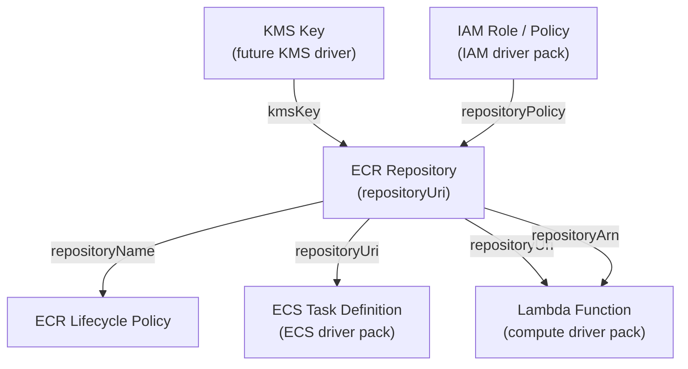

# ECR Driver Pack — Overview

> NYI
> This document summarizes the ECR driver family for Praxis: two drivers covering
> ECR Repositories and ECR Lifecycle Policies. It describes their relationships,
> shared infrastructure, runtime deployment, implementation order, and integration
> with the existing `praxis-compute` driver pack.

---

## Table of Contents

1. [Driver Summary](#1-driver-summary)
2. [Relationships & Dependencies](#2-relationships--dependencies)
3. [Runtime Pack](#3-runtime-pack)
4. [Shared Infrastructure](#4-shared-infrastructure)
5. [Implementation Order](#5-implementation-order)
6. [Docker Compose Topology](#6-docker-compose-topology)
7. [Justfile Targets](#7-justfile-targets)
8. [Registry Integration](#8-registry-integration)
9. [Cross-Driver References](#9-cross-driver-references)
10. [Common Patterns](#10-common-patterns)
11. [Checklist](#11-checklist)

---

## 1. Driver Summary

| Driver | Kind | Key | Key Scope | Mutable | Tags | Plan Doc |
|---|---|---|---|---|---|---|
| ECR Repository | `ECRRepository` | `region~repositoryName` | `KeyScopeRegion` | imageTagMutability, imageScanningConfiguration, repositoryPolicy, tags | Yes | [ECR_REPOSITORY_DRIVER_PLAN.md](ECR_REPOSITORY_DRIVER_PLAN.md) |
| ECR Lifecycle Policy | `ECRLifecyclePolicy` | `region~repositoryName` | `KeyScopeCustom` | lifecyclePolicyText | No | [ECR_LIFECYCLE_POLICY_DRIVER_PLAN.md](ECR_LIFECYCLE_POLICY_DRIVER_PLAN.md) |

Both drivers use region-prefixed keys — ECR resources are regional. The Lifecycle
Policy driver uses `KeyScopeCustom` because its identity is derived from
`spec.repositoryName` (the attached repository's name), not from `metadata.name`.

**Key design note — `encryptionConfiguration` is immutable:** ECR repository
encryption settings are configured at creation time and cannot be changed. Attempting
to change `encryptionConfiguration` after creation results in a terminal error. This
mirrors the `fifoTopic` constraint in SNS and the `iops/volumeType` constraints in
EBS.

---

## 2. Relationships & Dependencies



### Dependency Rules

| From | To | Relationship |
|---|---|---|
| ECR Repository | KMS Key | Repository's `encryptionConfiguration.kmsKey` references a KMS key |
| ECR Repository | IAM Role / Policy | `repositoryPolicy` IAM policy document references IAM principals |
| ECR Lifecycle Policy | ECR Repository | Lifecycle policy's `repositoryName` references the repository |
| ECS Task Definition | ECR Repository | Container image URIs reference the repository's `repositoryUri` |
| Lambda Function | ECR Repository | Container image deployments reference the repository's `repositoryUri` |

### Ownership Boundaries

- **ECR Repository driver**: Manages the repository resource, image tag mutability,
  scanning configuration, resource-based access policy, and tags. Does NOT manage
  lifecycle policies — that is the Lifecycle Policy driver's responsibility.
- **ECR Lifecycle Policy driver**: Manages the lifecycle policy document attached to
  a repository. An ECR repository can have exactly one lifecycle policy. The driver
  handles full replacement on update (via `PutLifecyclePolicy`) and deletion via
  `DeleteLifecyclePolicy`. Does NOT manage the repository itself.

---

## 3. Runtime Pack

Both ECR drivers are hosted in the **praxis-compute** runtime pack alongside Lambda
and EC2 drivers. ECR is a compute-adjacent container registry service — grouping it
with other compute-plane services follows the established domain alignment.

| Driver | Runtime Pack | Binary | Host Port |
|---|---|---|---|
| ECR Repository | praxis-compute | `cmd/praxis-compute` | 9084 |
| ECR Lifecycle Policy | praxis-compute | `cmd/praxis-compute` | 9084 |

### praxis-compute Entry Point (Updated)

```go
// cmd/praxis-compute/main.go
srv := server.NewRestate().
    Bind(restate.Reflect(ec2.NewEC2InstanceDriver(cfg.Auth()))).
    Bind(restate.Reflect(ami.NewAMIDriver(cfg.Auth()))).
    Bind(restate.Reflect(keypair.NewKeyPairDriver(cfg.Auth()))).
    Bind(restate.Reflect(lambda.NewLambdaFunctionDriver(cfg.Auth()))).
    Bind(restate.Reflect(lambdalayer.NewLambdaLayerDriver(cfg.Auth()))).
    Bind(restate.Reflect(lambdaperm.NewLambdaPermissionDriver(cfg.Auth()))).
    Bind(restate.Reflect(esm.NewEventSourceMappingDriver(cfg.Auth()))).
    // ECR drivers
    Bind(restate.Reflect(ecrrepo.NewECRRepositoryDriver(cfg.Auth()))).
    Bind(restate.Reflect(ecrpolicy.NewECRLifecyclePolicyDriver(cfg.Auth())))
```

---

## 4. Shared Infrastructure

### AWS Client

Both drivers share the same `ecr.Client` from `github.com/aws/aws-sdk-go-v2/service/ecr`.
Add a single factory function:

```go
// internal/infra/awsclient/client.go
func NewECRClient(cfg aws.Config) *ecr.Client {
    return ecr.NewFromConfig(cfg)
}
```

### Rate Limiting

ECR API limits are moderate. Use the shared rate limiter pattern with conservative
settings:

| API Category | Rate (req/s) | Burst |
|---|---|---|
| Repository mutations (Create, Delete) | 5 | 3 |
| Repository reads (Describe, GetPolicy) | 15 | 5 |
| Tag operations | 10 | 5 |

### `go.mod` Change

Add the ECR service SDK package:

```text
require (
    github.com/aws/aws-sdk-go-v2/service/ecr v1.x.x
)
```

---

## 5. Implementation Order

Implement in this order to ensure each driver can be tested before the next depends
on it:

1. **ECR Repository** — standalone; no ECR dependencies
2. **ECR Lifecycle Policy** — depends on ECR Repository existing

Within each driver, implement in this order:

1. CUE schema
2. Driver types (`types.go`)
3. AWS API abstraction (`aws.go`)
4. Drift detection (`drift.go`)
5. Driver Virtual Object (`driver.go`)
6. Provider adapter (`*_adapter.go`)
7. Registry integration
8. Entry point bind
9. Unit tests
10. Integration tests

---

## 6. Docker Compose Topology

ECR drivers are part of the existing `praxis-compute` service. No new service
definition is needed. LocalStack must have `ecr` added to its `SERVICES` list:

```yaml
# docker-compose.yaml
services:
  localstack:
    environment:
      SERVICES: s3,ec2,iam,lambda,ecr,ecs,sns,sqs,...
```

The `praxis-compute` service already has a service stanza in `docker-compose.yaml`.
Binding the new drivers to the existing entry point is sufficient.

---

## 7. Justfile Targets

```makefile
# ECR tests
test-ecr-repository:
    go test ./internal/drivers/ecrrepo/... -v -timeout 120s

test-ecr-lifecycle-policy:
    go test ./internal/drivers/ecrpolicy/... -v -timeout 120s

test-ecr-integration:
    go test ./tests/integration/ -run TestECR -v -timeout 300s

test-ecr: test-ecr-repository test-ecr-lifecycle-policy test-ecr-integration
```

---

## 8. Registry Integration

Both adapters are registered in `internal/core/provider/registry.go` inside
`NewRegistry()`:

```go
func NewRegistry() *Registry {
    accounts := auth.LoadFromEnv()
    return NewRegistryWithAdapters(
        // ... existing adapters ...
        NewECRRepositoryAdapterWithRegistry(accounts),
        NewECRLifecyclePolicyAdapterWithRegistry(accounts),
    )
}
```

---

## 9. Cross-Driver References

### ECR Repository outputs consumed by other drivers

```text
${resources.my-repo.outputs.repositoryUri}    → ECS Task Definition container image URIs
${resources.my-repo.outputs.repositoryUri}    → Lambda Function spec.code.imageUri
${resources.my-repo.outputs.repositoryArn}    → IAM Policy resource ARNs
${resources.my-repo.outputs.repositoryName}   → ECR Lifecycle Policy spec.repositoryName
${resources.my-repo.outputs.registryId}       → Cross-account pull configuration
```

### ECR Lifecycle Policy inputs from other drivers

```text
spec.repositoryName  ←  ${resources.my-repo.outputs.repositoryName}
spec.repositoryArn   ←  ${resources.my-repo.outputs.repositoryArn}
```

---

## 10. Common Patterns

### `PutLifecyclePolicy` is Idempotent

Unlike many AWS create APIs, `PutLifecyclePolicy` is an upsert — it creates or
replaces the lifecycle policy for a repository in a single call. The ECRLifecyclePolicy
driver exploits this: `Provision` calls `PutLifecyclePolicy` unconditionally,
making the driver's create and update paths identical. Drift detection reduces to
a JSON semantic equality check between the desired and observed policy text.

### Repository URI Pattern

ECR repository URIs follow the pattern:

```text
<registryId>.dkr.ecr.<region>.amazonaws.com/<repositoryName>
```

This URI is the primary output consumed by downstream compute resources. The driver
exposes it as `repositoryUri` in outputs.

### `forceDelete` Safety Flag

ECR refuses to delete a repository that contains images unless `force: true` is
specified. The `ECRRepositorySpec.ForceDelete` field defaults to `false`. Operators
should consciously opt in to forced deletion in templates that may need to delete
populated repositories. This prevents accidental image loss during stack teardowns.

### Encryption Immutability

`encryptionConfiguration` (KMS vs AES256) is set at repository creation and cannot
be changed. The drift checker marks encryption configuration changes as terminal
errors — the operator must delete and recreate the repository to change encryption
settings. This matches the `fifoTopic` pattern in the SNS Topic driver.

---

## 11. Checklist

### ECR Repository

- [ ] CUE schema (`schemas/aws/ecr/repository.cue`)
- [ ] Driver types (`internal/drivers/ecrrepo/types.go`)
- [ ] AWS API abstraction (`internal/drivers/ecrrepo/aws.go`)
- [ ] Drift detection (`internal/drivers/ecrrepo/drift.go`)
- [ ] Driver Virtual Object (`internal/drivers/ecrrepo/driver.go`)
- [ ] Unit tests (`internal/drivers/ecrrepo/driver_test.go`, `aws_test.go`, `drift_test.go`)
- [ ] Provider adapter (`internal/core/provider/ecrrepository_adapter.go`)
- [ ] Adapter tests (`internal/core/provider/ecrrepository_adapter_test.go`)
- [ ] Registry entry (`internal/core/provider/registry.go`)
- [ ] Entry point bind (`cmd/praxis-compute/main.go`)
- [ ] Integration tests (`tests/integration/ecr_repository_driver_test.go`)
- [ ] AWS client factory (`internal/infra/awsclient/client.go`)
- [ ] LocalStack SERVICES (`docker-compose.yaml`)
- [ ] Justfile targets

### ECR Lifecycle Policy

- [ ] CUE schema (`schemas/aws/ecr/lifecycle_policy.cue`)
- [ ] Driver types (`internal/drivers/ecrpolicy/types.go`)
- [ ] AWS API abstraction (`internal/drivers/ecrpolicy/aws.go`)
- [ ] Drift detection (`internal/drivers/ecrpolicy/drift.go`)
- [ ] Driver Virtual Object (`internal/drivers/ecrpolicy/driver.go`)
- [ ] Unit tests (`internal/drivers/ecrpolicy/driver_test.go`, `aws_test.go`, `drift_test.go`)
- [ ] Provider adapter (`internal/core/provider/ecrlifecyclepolicy_adapter.go`)
- [ ] Adapter tests (`internal/core/provider/ecrlifecyclepolicy_adapter_test.go`)
- [ ] Registry entry (`internal/core/provider/registry.go`)
- [ ] Entry point bind (`cmd/praxis-compute/main.go`)
- [ ] Integration tests (`tests/integration/ecr_lifecycle_policy_driver_test.go`)
