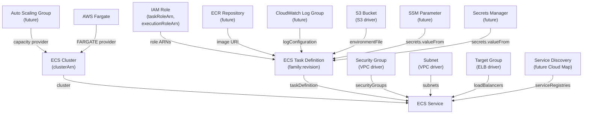

# ECS Driver Pack — Overview

> NYI
> This document summarizes the ECS driver family for Praxis: three drivers covering
> ECS Clusters, ECS Task Definitions, and ECS Services. It describes their
> relationships, shared infrastructure, runtime deployment, implementation order,
> and integration with the existing `praxis-compute` driver pack.

---

## Table of Contents

1. [Driver Summary](#1-driver-summary)
2. [Relationships & Dependencies](#2-relationships--dependencies)
3. [Runtime Packs](#3-runtime-packs)
4. [Shared Infrastructure](#4-shared-infrastructure)
5. [Implementation Order](#5-implementation-order)
6. [go.mod Changes](#6-gomod-changes)
7. [Docker Compose Topology](#7-docker-compose-topology)
8. [Justfile Targets](#8-justfile-targets)
9. [Registry Integration](#9-registry-integration)
10. [Cross-Driver References](#10-cross-driver-references)
11. [Common Patterns](#11-common-patterns)
12. [Checklist](#12-checklist)

---

## 1. Driver Summary

| Driver | Kind | Key | Key Scope | Mutable | Tags | Plan Doc |
|---|---|---|---|---|---|---|
| ECS Cluster | `ECSCluster` | `region~clusterName` | `KeyScopeRegion` | settings (containerInsights), configuration (executeCommand), capacityProviders, defaultCapacityProviderStrategy, tags | Yes | [ECS_CLUSTER_DRIVER_PLAN.md](ECS_CLUSTER_DRIVER_PLAN.md) |
| ECS Task Definition | `ECSTaskDefinition` | `region~family` | `KeyScopeRegion` | (new revisions only) containerDefinitions, cpu, memory, taskRoleArn, executionRoleArn, networkMode, volumes, placementConstraints, runtimePlatform | No | [ECS_TASK_DEFINITION_DRIVER_PLAN.md](ECS_TASK_DEFINITION_DRIVER_PLAN.md) |
| ECS Service | `ECSService` | `region~clusterName~serviceName` | `KeyScopeRegion` | desiredCount, taskDefinition, capacityProviderStrategy, deploymentConfiguration, healthCheckGracePeriod, loadBalancers, networkConfiguration, platformVersion, enableExecuteCommand, tags | Yes | [ECS_SERVICE_DRIVER_PLAN.md](ECS_SERVICE_DRIVER_PLAN.md) |

All three drivers use `KeyScopeRegion` — ECS resources are regional, keys are
prefixed with the region (`<region>~<identifier>`).

**Key design note — Task Definitions are versioned and immutable:** ECS task
definitions follow a family + revision model. Each `RegisterTaskDefinition` call
creates a new immutable revision. "Updating" a task definition means registering
a new revision under the same family. The driver tracks the latest active revision.

---

## 2. Relationships & Dependencies



### Dependency Rules

| From | To | Relationship |
|---|---|---|
| ECS Cluster | — | Top-level resource; no ECS-internal dependencies |
| ECS Cluster | Auto Scaling Group | Capacity providers reference ASGs for EC2 launch type (future) |
| ECS Task Definition | IAM Role | `taskRoleArn` (application permissions) and `executionRoleArn` (pull images, push logs) |
| ECS Task Definition | ECR Repository | Container image URIs reference ECR repos (future ECR driver) |
| ECS Task Definition | CloudWatch Log Group | `logConfiguration.options.awslogs-group` references a log group (future) |
| ECS Task Definition | S3 Bucket | `environmentFile` can reference S3 objects for bulk env vars |
| ECS Task Definition | SSM / Secrets Manager | `secrets[].valueFrom` references SSM parameters or Secrets Manager secrets |
| ECS Service | ECS Cluster | Service's `cluster` references the cluster ARN or name |
| ECS Service | ECS Task Definition | Service's `taskDefinition` references a task definition family or ARN |
| ECS Service | Security Group | Service's `networkConfiguration.awsvpcConfiguration.securityGroups` |
| ECS Service | Subnet | Service's `networkConfiguration.awsvpcConfiguration.subnets` |
| ECS Service | Target Group | Service's `loadBalancers[].targetGroupArn` for ALB/NLB integration |
| ECS Service | Service Discovery | Service's `serviceRegistries` for Cloud Map integration (future) |

### Ownership Boundaries

- **ECS Cluster driver**: Manages the cluster resource, its settings (Container
  Insights), capacity provider associations, and default capacity provider strategy.
  Does NOT manage services, task definitions, or the underlying EC2 instances /
  Auto Scaling Groups that back capacity providers.
- **ECS Task Definition driver**: Manages task definition families and revisions.
  Each "update" registers a new revision. The driver tracks the active revision
  and can deregister old revisions. Does NOT manage the containers at runtime —
  that's the service's responsibility.
- **ECS Service driver**: Manages the service resource within a cluster, including
  desired count, deployment configuration, load balancer attachments, network
  configuration, and rolling deployments. Does NOT manage the cluster, the task
  definition, or the underlying task instances (ECS manages task placement and
  lifecycle).

---

## 3. Runtime Packs

All ECS drivers are hosted in the **praxis-compute** runtime pack alongside EC2,
AMI, Key Pair, and Lambda drivers. ECS is an AWS compute service — grouping it with
other compute drivers is the natural domain alignment.

| Driver | Runtime Pack | Binary | Host Port |
|---|---|---|---|
| ECS Cluster | praxis-compute | `cmd/praxis-compute` | 9084 |
| ECS Task Definition | praxis-compute | `cmd/praxis-compute` | 9084 |
| ECS Service | praxis-compute | `cmd/praxis-compute` | 9084 |

### praxis-compute Entry Point (Updated)

```go
// cmd/praxis-compute/main.go
srv := server.NewRestate().
    Bind(restate.Reflect(ami.NewAMIDriver(cfg.Auth()))).
    Bind(restate.Reflect(keypair.NewKeyPairDriver(cfg.Auth()))).
    Bind(restate.Reflect(ec2.NewEC2InstanceDriver(cfg.Auth()))).
    // Lambda drivers (future)
    Bind(restate.Reflect(lambda.NewLambdaFunctionDriver(cfg.Auth()))).
    Bind(restate.Reflect(lambdalayer.NewLambdaLayerDriver(cfg.Auth()))).
    Bind(restate.Reflect(lambdaperm.NewLambdaPermissionDriver(cfg.Auth()))).
    Bind(restate.Reflect(esm.NewEventSourceMappingDriver(cfg.Auth()))).
    // ECS drivers
    Bind(restate.Reflect(ecscluster.NewECSClusterDriver(cfg.Auth()))).
    Bind(restate.Reflect(ecstaskdef.NewECSTaskDefinitionDriver(cfg.Auth()))).
    Bind(restate.Reflect(ecsservice.NewECSServiceDriver(cfg.Auth())))
```

---

## 4. Shared Infrastructure

### ECS Client

All three drivers share the same `ecs.Client` from `aws-sdk-go-v2/service/ecs`.
The ECS API surface covers clusters, task definitions, services, and tasks through
a single SDK package.

The client is created per-account via the auth registry's `GetConfig(account)` method.

A new factory function is needed in `internal/infra/awsclient/client.go`:

```go
func NewECSClient(cfg aws.Config) *ecs.Client {
    return ecs.NewFromConfig(cfg)
}
```

### Rate Limiters

Each driver uses its own rate limiter namespace:

| Driver | Namespace | Sustained | Burst |
|---|---|---|---|
| ECS Cluster | `ecs-cluster` | 15 | 8 |
| ECS Task Definition | `ecs-taskdef` | 15 | 8 |
| ECS Service | `ecs-service` | 15 | 8 |

ECS API rate limits are moderate — `DescribeServices` and `UpdateService` are
typically limited to ~20 TPS, while `RegisterTaskDefinition` is more generous.
Using 15 sustained / 8 burst per driver namespace is conservative and prevents
one driver's activity from impacting another.

### Error Classifiers

All drivers classify AWS ECS API errors into:

- **Not found**: `ClusterNotFoundException`, `ServiceNotFoundException`,
  `TaskDefinitionNotFoundException` — resource does not exist
- **Already exists**: `ClusterAlreadyExistsException` — cluster with the same name exists
- **Invalid parameter**: `InvalidParameterException` — bad input (terminal error)
- **Client exception**: `ClientException` — general client-side error (terminal)
- **Server exception**: `ServerException` — ECS internal error (retryable)
- **Update in progress**: `UpdateInProgressException` — service deployment in flight
- **Access denied**: `AccessDeniedException` — insufficient IAM permissions (terminal)

Each driver defines its own classifiers because the relevant subset of errors
differs per resource type.

### Ownership Tags

ECS resources have varying tag support:

- **ECS Cluster**: Supports tags via `CreateCluster` and `TagResource`. The driver
  adds `praxis:managed-key=<region~clusterName>` for consistency, though cluster
  names are unique per account per region.
- **ECS Task Definition**: Supports tags via `RegisterTaskDefinition` and
  `TagResource`. No ownership tag needed — families are unique per account per
  region, and revisions are AWS-assigned.
- **ECS Service**: Supports tags via `CreateService` and `TagResource`. The driver
  adds `praxis:managed-key=<region~clusterName~serviceName>` for cross-Praxis
  conflict detection. Service names are unique within a cluster.

---

## 5. Implementation Order

The recommended implementation order respects dependencies and allows incremental
testing:

### Phase 1: Foundation

1. **ECS Cluster** — No dependencies on other ECS resources. Simple lifecycle.
   Establishes ECS SDK patterns, error classification, and client setup. Basic
   CRUD with capacity provider configuration.

### Phase 2: Task Configuration

2. **ECS Task Definition** — No dependencies on other ECS resources (references
   IAM roles and container images externally). Versioned publish model similar to
   Lambda Layer. Establishes the register/deregister revision lifecycle.

### Phase 3: Runtime Orchestration

3. **ECS Service** — Depends on both Cluster and Task Definition. Most complex
   driver with deployment management, health checks, load balancer integration,
   and network configuration. Should be implemented last when all patterns are
   established.

### Dependency Test Order

```
ECS Cluster (isolated) → ECS Task Definition (isolated) → ECS Service (uses Cluster + TaskDef)
```

---

## 6. go.mod Changes

Add the ECS SDK package:

```
github.com/aws/aws-sdk-go-v2/service/ecs v1.x.x
```

Run:
```bash
go get github.com/aws/aws-sdk-go-v2/service/ecs
go mod tidy
```

---

## 7. Docker Compose Topology

ECS drivers are hosted in the existing praxis-compute service:

```yaml
# praxis-compute hosts EC2 Instance, AMI, Key Pair, Lambda, and all ECS drivers
praxis-compute:
  build:
    context: .
    dockerfile: cmd/praxis-compute/Dockerfile
  ports:
    - "9084:9080"
  environment:
    - AWS_ENDPOINT_URL=http://localstack:4566
    - AWS_ACCESS_KEY_ID=test
    - AWS_SECRET_ACCESS_KEY=test
    - AWS_REGION=us-east-1
```

No new Docker Compose service is needed. All ECS drivers are discovered automatically
from the existing `praxis-compute` registration via Restate's reflection-based
service discovery.

**Note:** LocalStack's ECS support is limited. Integration tests should focus on API
shape validation. For full deployment lifecycle testing, consider using a real AWS
account or moto-based mocks.

---

## 8. Justfile Targets

### Unit Tests

```just
test-ecs-cluster:    go test ./internal/drivers/ecscluster/...    -v -count=1 -race
test-ecs-taskdef:    go test ./internal/drivers/ecstaskdef/...    -v -count=1 -race
test-ecs-service:    go test ./internal/drivers/ecsservice/...    -v -count=1 -race

test-ecs:
    go test ./internal/drivers/ecscluster/... ./internal/drivers/ecstaskdef/... \
            ./internal/drivers/ecsservice/... \
            -v -count=1 -race
```

### Integration Tests

```just
test-ecs-integration:
    go test ./tests/integration/ -run "TestECSCluster|TestECSTaskDefinition|TestECSService" \
            -v -count=1 -tags=integration -timeout=10m
```

### Build

```just
build-compute:  # already exists — no changes needed
    go build -o bin/praxis-compute ./cmd/praxis-compute
```

---

## 9. Registry Integration

All three adapters are registered in `internal/core/provider/registry.go`:

```go
func NewRegistry() *Registry {
    accounts := auth.LoadFromEnv()
    return NewRegistryWithAdapters(
        // ... existing adapters ...

        // ECS drivers
        NewECSClusterAdapterWithRegistry(accounts),
        NewECSTaskDefinitionAdapterWithRegistry(accounts),
        NewECSServiceAdapterWithRegistry(accounts),
    )
}
```

### Adapter Files

| Driver | Adapter File |
|---|---|
| ECS Cluster | `internal/core/provider/ecscluster_adapter.go` |
| ECS Task Definition | `internal/core/provider/ecstaskdef_adapter.go` |
| ECS Service | `internal/core/provider/ecsservice_adapter.go` |

---

## 10. Cross-Driver References

In Praxis templates, ECS resources reference each other and external resources via
output expressions:

### Fargate Service with ALB

```cue
resources: {
    "app-cluster": {
        kind: "ECSCluster"
        spec: {
            clusterName: "myapp"
            region: "us-east-1"
            settings: [{
                name: "containerInsights"
                value: "enabled"
            }]
            capacityProviders: ["FARGATE", "FARGATE_SPOT"]
            defaultCapacityProviderStrategy: [{
                capacityProvider: "FARGATE"
                weight: 1
                base: 1
            }]
        }
    }
    "app-taskdef": {
        kind: "ECSTaskDefinition"
        spec: {
            family: "myapp-web"
            region: "us-east-1"
            cpu: "256"
            memory: "512"
            networkMode: "awsvpc"
            requiresCompatibilities: ["FARGATE"]
            executionRoleArn: "${resources.ecs-exec-role.outputs.arn}"
            taskRoleArn: "${resources.ecs-task-role.outputs.arn}"
            containerDefinitions: [{
                name: "web"
                image: "123456789012.dkr.ecr.us-east-1.amazonaws.com/myapp:latest"
                portMappings: [{
                    containerPort: 8080
                    protocol: "tcp"
                }]
                logConfiguration: {
                    logDriver: "awslogs"
                    options: {
                        "awslogs-group": "/ecs/myapp-web"
                        "awslogs-region": "us-east-1"
                        "awslogs-stream-prefix": "web"
                    }
                }
                environment: [{
                    name: "APP_ENV"
                    value: "production"
                }]
                secrets: [{
                    name: "DB_PASSWORD"
                    valueFrom: "arn:aws:ssm:us-east-1:123456789012:parameter/myapp/db-password"
                }]
            }]
        }
    }
    "app-service": {
        kind: "ECSService"
        spec: {
            serviceName: "myapp-web"
            region: "us-east-1"
            cluster: "${resources.app-cluster.outputs.clusterArn}"
            taskDefinition: "${resources.app-taskdef.outputs.taskDefinitionArn}"
            desiredCount: 3
            launchType: "FARGATE"
            networkConfiguration: {
                awsvpcConfiguration: {
                    subnets: [
                        "${resources.private-subnet-a.outputs.subnetId}",
                        "${resources.private-subnet-b.outputs.subnetId}"
                    ]
                    securityGroups: ["${resources.app-sg.outputs.groupId}"]
                    assignPublicIp: "DISABLED"
                }
            }
            loadBalancers: [{
                targetGroupArn: "${resources.app-tg.outputs.targetGroupArn}"
                containerName: "web"
                containerPort: 8080
            }]
            healthCheckGracePeriodSeconds: 60
            deploymentConfiguration: {
                maximumPercent: 200
                minimumHealthyPercent: 100
                deploymentCircuitBreaker: {
                    enable: true
                    rollback: true
                }
            }
        }
    }
}
```

### EC2 Launch Type with Capacity Provider

```cue
resources: {
    "compute-cluster": {
        kind: "ECSCluster"
        spec: {
            clusterName: "compute"
            region: "us-east-1"
            settings: [{
                name: "containerInsights"
                value: "enabled"
            }]
        }
    }
    "worker-taskdef": {
        kind: "ECSTaskDefinition"
        spec: {
            family: "worker"
            region: "us-east-1"
            networkMode: "bridge"
            requiresCompatibilities: ["EC2"]
            taskRoleArn: "${resources.worker-role.outputs.arn}"
            executionRoleArn: "${resources.ecs-exec-role.outputs.arn}"
            containerDefinitions: [{
                name: "worker"
                image: "123456789012.dkr.ecr.us-east-1.amazonaws.com/worker:latest"
                cpu: 512
                memory: 1024
                essential: true
                environment: [{
                    name: "QUEUE_URL"
                    value: "${resources.work-queue.outputs.queueUrl}"
                }]
            }]
        }
    }
    "worker-service": {
        kind: "ECSService"
        spec: {
            serviceName: "worker"
            region: "us-east-1"
            cluster: "${resources.compute-cluster.outputs.clusterArn}"
            taskDefinition: "${resources.worker-taskdef.outputs.taskDefinitionArn}"
            desiredCount: 5
            launchType: "EC2"
            deploymentConfiguration: {
                maximumPercent: 200
                minimumHealthyPercent: 50
            }
        }
    }
}
```

The DAG resolver handles dependency ordering automatically based on these expression
references.

---

## 11. Common Patterns

### All ECS Drivers Share

- **`KeyScopeRegion`** — All ECS resources are regional; keys follow `<region>~<identifier>`
- **ECS API client** — All three drivers share the `aws-sdk-go-v2/service/ecs` package
- **`InvalidParameterException`** → terminal error classification across all drivers
- **`ServerException`** → retryable error across all drivers
- **Separate rate limiter namespaces** — Per-driver token buckets

### Driver-Specific Patterns

| Driver | Notable Pattern |
|---|---|
| ECS Cluster | Simple CRUD; capacity provider association is a separate `PutClusterCapacityProviders` call; settings are update-only (no partial API) |
| ECS Task Definition | Versioned and immutable per revision; "update" means register new revision; the driver tracks the active family and deregisters old revisions; list + describe to discover current state |
| ECS Service | Most complex: rolling deployments tracked by `DeploymentId`; circuit breaker; load balancer attachments are immutable after creation (require delete + recreate); network config mutable; force new deployment to pick up latest task def revision |

### Fargate vs EC2 Launch Types

| Aspect | Fargate | EC2 |
|---|---|---|
| Task definition `cpu`/`memory` | Required (hard limits) | Optional (can use container-level) |
| Network mode | `awsvpc` (required) | `bridge`, `host`, `awsvpc`, or `none` |
| `requiresCompatibilities` | `["FARGATE"]` | `["EC2"]` |
| Service `networkConfiguration` | Required (awsvpc) | Required only if `awsvpc` network mode |
| Platform version | Applies (`LATEST`, `1.4.0`, etc.) | N/A |
| Capacity providers | `FARGATE`, `FARGATE_SPOT` | Custom (backed by ASGs) |

The driver does not enforce launch-type constraints at the driver level — AWS
validates compatibility at service creation time. The CUE schema can optionally
add constraints for common misconfigurations (e.g., requiring `networkMode: "awsvpc"`
when `requiresCompatibilities` includes `"FARGATE"`).

### Driver Complexity Ranking

| Driver | Complexity | Reason |
|---|---|---|
| ECS Cluster | Low | Simple CRUD; few mutable attributes; no complex state machine |
| ECS Task Definition | Medium | Versioned revision model; register/deregister lifecycle; many container definition fields |
| ECS Service | Very High | Rolling deployments; circuit breaker; load balancer integration (immutable); network config; force-new-deployment; steady-state wait; complex drift reconciliation |

---

## 12. Checklist

### Infrastructure
- [ ] `go get github.com/aws/aws-sdk-go-v2/service/ecs` added
- [ ] `cmd/praxis-compute/main.go` updated to bind ECS drivers
- [ ] No new Dockerfile needed (reuses praxis-compute)
- [ ] No Docker Compose changes needed (reuses praxis-compute)
- [ ] `justfile` updated with ECS test targets

### Schemas
- [ ] `schemas/aws/ecs/cluster.cue`
- [ ] `schemas/aws/ecs/task_definition.cue`
- [ ] `schemas/aws/ecs/service.cue`

### Drivers (per driver: types + aws + drift + driver)
- [ ] `internal/drivers/ecscluster/`
- [ ] `internal/drivers/ecstaskdef/`
- [ ] `internal/drivers/ecsservice/`

### Adapters
- [ ] `internal/core/provider/ecscluster_adapter.go`
- [ ] `internal/core/provider/ecstaskdef_adapter.go`
- [ ] `internal/core/provider/ecsservice_adapter.go`

### Registry
- [ ] All 3 adapters registered in `NewRegistry()`

### Tests
- [ ] Unit tests for all 3 drivers
- [ ] Integration tests for all 3 drivers
- [ ] Cross-driver integration test (Cluster → TaskDef → Service)

### Documentation
- [ ] [ECS_CLUSTER_DRIVER_PLAN.md](ECS_CLUSTER_DRIVER_PLAN.md)
- [ ] [ECS_TASK_DEFINITION_DRIVER_PLAN.md](ECS_TASK_DEFINITION_DRIVER_PLAN.md)
- [ ] [ECS_SERVICE_DRIVER_PLAN.md](ECS_SERVICE_DRIVER_PLAN.md)
- [x] This overview document
