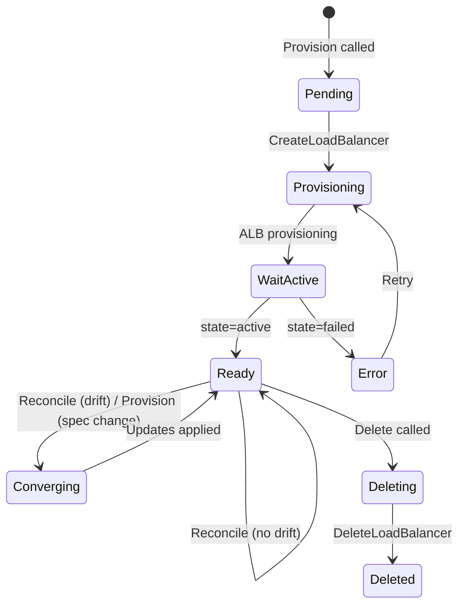

# ALB Driver — Implementation Spec

---

## Table of Contents

1. [Overview & Scope](#1-overview--scope)
2. [Key Strategy](#2-key-strategy)
3. [File Inventory](#3-file-inventory)
4. [Step 1 — CUE Schema](#step-1--cue-schema)
5. [Step 2 — AWS Client Factory](#step-2--aws-client-factory)
6. [Step 3 — Driver Types](#step-3--driver-types)
7. [Step 4 — AWS API Abstraction Layer](#step-4--aws-api-abstraction-layer)
8. [Step 5 — Drift Detection](#step-5--drift-detection)
9. [Step 6 — Driver Implementation](#step-6--driver-implementation)
10. [Step 7 — Provider Adapter](#step-7--provider-adapter)
11. [Step 8 — Registry Integration](#step-8--registry-integration)
12. [Step 9 — ELB Driver Pack Entry Point](#step-9--elb-driver-pack-entry-point)
13. [Step 10 — Docker Compose & Justfile](#step-10--docker-compose--justfile)
14. [Step 11 — Unit Tests](#step-11--unit-tests)
15. [Step 12 — Integration Tests](#step-12--integration-tests)
16. [ALB-Specific Design Decisions](#alb-specific-design-decisions)
17. [Checklist](#checklist)

---

## 1. Overview & Scope

The ALB driver manages the lifecycle of **Application Load Balancers** only. It
creates, imports, updates, and deletes ALBs along with their subnet mappings,
security group associations, access log configuration, and tags.

ALBs are the primary HTTP/HTTPS load balancer in AWS. They operate at Layer 7 and
support content-based routing via listeners and listener rules. In compound
templates, ALBs are typically positioned downstream of VPC/Subnet/SG resources and
upstream of Listener, Listener Rule, and Target Group resources.

**Out of scope**: Network Load Balancers (separate driver), Listeners (separate driver),
Listener Rules (separate driver), Target Groups (separate driver). Each is a distinct
resource type with its own lifecycle and Virtual Object key space.

### Driver Contract

| Handler | Context | Purpose |
|---|---|---|
| `Provision` | `ObjectContext` (exclusive) | Create or converge an ALB |
| `Import` | `ObjectContext` (exclusive) | Adopt an existing ALB |
| `Delete` | `ObjectContext` (exclusive) | Remove an ALB (deletes listeners first if needed) |
| `Reconcile` | `ObjectContext` (exclusive) | Detect/correct drift (report-only for Observed mode) |
| `GetStatus` | `ObjectSharedContext` (shared) | Return current status |
| `GetOutputs` | `ObjectSharedContext` (shared) | Return ALB outputs |

### Mutable vs Immutable Attributes

| Attribute | Mutability | Notes |
|---|---|---|
| `name` | Immutable | Part of the Virtual Object key; cannot change after creation |
| `scheme` | Immutable | `internet-facing` or `internal`; requires delete + recreate to change |
| `ipAddressType` | Mutable | Can switch between `ipv4` and `dualstack` via `SetIpAddressType` |
| `subnets` | Mutable | Updated via `SetSubnets`; minimum 2 AZs required |
| `securityGroups` | Mutable | Updated via `SetSecurityGroups` |
| `accessLogs` | Mutable | Updated via `ModifyLoadBalancerAttributes` |
| `deletionProtection` | Mutable | Updated via `ModifyLoadBalancerAttributes` |
| `idleTimeout` | Mutable | Updated via `ModifyLoadBalancerAttributes` (ALB only, seconds) |
| `tags` | Mutable | Full replace via `RemoveTag` + `AddTags` |

### Downstream Consumers

```text
${resources.my-alb.outputs.loadBalancerArn}   → Listener's loadBalancerArn
${resources.my-alb.outputs.dnsName}            → Route 53 alias target, application config
${resources.my-alb.outputs.hostedZoneId}       → Route 53 alias hosted zone ID
${resources.my-alb.outputs.vpcId}              → Informational cross-reference
```

---

## 2. Key Strategy

### Key Scope: `KeyScopeRegion`

ALBs are regional resources. Load balancer names are unique within a region and account.

```text
region~albName
```

### BuildKey vs BuildImportKey

- **`BuildKey(resourceDoc)`**: Extracts `metadata.name` from the resource document.
  Prepends the region from the resolved account config. Returns `region~name`.

- **`BuildImportKey(region, resourceID)`**: Returns `region~resourceID`. The
  `resourceID` is the ALB name (not the ARN). Since ALB names are unique per region
  per account, import and template management produce the **same key** for the same
  load balancer.

### No Ownership Tags

ALB names are unique within a region and account (AWS-enforced).
`CreateLoadBalancer` returns `DuplicateLoadBalancerName` if the name already exists.
This natural conflict signal eliminates the need for `praxis:managed-key` ownership
tags — matching the IAM pattern.

---

## 3. File Inventory

```text
✦ schemas/aws/elb/alb.cue                         — CUE schema for ALB resource
✦ internal/drivers/alb/types.go                    — Spec, Outputs, ObservedState, State structs
✦ internal/drivers/alb/aws.go                      — ALBAPI interface + realALBAPI implementation
✦ internal/drivers/alb/drift.go                    — HasDrift(), ComputeFieldDiffs()
✦ internal/drivers/alb/driver.go                   — ALBDriver Virtual Object
✦ internal/drivers/alb/driver_test.go              — Unit tests for driver (mocked AWS)
✦ internal/drivers/alb/aws_test.go                 — Unit tests for error classification
✦ internal/drivers/alb/drift_test.go               — Unit tests for drift detection
✦ internal/core/provider/alb_adapter.go            — ALBAdapter implementing provider.Adapter
✦ internal/core/provider/alb_adapter_test.go       — Unit tests for adapter
✦ tests/integration/alb_driver_test.go             — Integration tests
✎ internal/core/provider/registry.go               — Add NewALBAdapter to NewRegistry()
✎ justfile                                         — Add ELB build/test targets
```

---

## Step 1 — CUE Schema

**File**: `schemas/aws/elb/alb.cue`

```cue
package elb

#ALB: {
    apiVersion: "praxis.io/v1"
    kind:       "ALB"

    metadata: {
        name: string & =~"^[a-zA-Z0-9]([a-zA-Z0-9-]{0,30}[a-zA-Z0-9])?$"
        labels: [string]: string
    }

    spec: {
        // name is the load balancer name in AWS.
        // Must be unique per region per account.
        // Max 32 chars, alphanumeric and hyphens, cannot start/end with hyphen.
        name: string & =~"^[a-zA-Z0-9]([a-zA-Z0-9-]{0,30}[a-zA-Z0-9])?$"

        // account is the target AWS account alias (optional).
        account?: string

        // scheme is "internet-facing" or "internal". Immutable after creation.
        scheme: "internet-facing" | "internal" | *"internet-facing"

        // ipAddressType is "ipv4" or "dualstack".
        ipAddressType: "ipv4" | "dualstack" | *"ipv4"

        // subnets is a list of subnet IDs. At least 2 AZs required.
        // Mutually exclusive with subnetMappings.
        subnets?: [...string] & [_, _, ...]

        // subnetMappings allows per-subnet configuration (e.g., EIP allocation).
        // Mutually exclusive with subnets.
        subnetMappings?: [...#SubnetMapping] & [_, _, ...]

        // securityGroups is a list of security group IDs.
        securityGroups: [...string] & [_, ...]

        // accessLogs configures S3 access logging.
        accessLogs?: {
            enabled: bool | *false
            bucket:  string
            prefix?: string
        }

        // deletionProtection prevents accidental deletion.
        deletionProtection: bool | *false

        // idleTimeout is the idle connection timeout in seconds (1-4000).
        idleTimeout: int & >=1 & <=4000 | *60

        // tags applied to the ALB.
        tags: [string]: string
    }

    outputs?: {
        loadBalancerArn: string
        dnsName:         string
        hostedZoneId:    string
        vpcId:           string
        canonicalHostedZoneId: string
    }
}

#SubnetMapping: {
    subnetId:      string
    allocationId?: string
}
```

### Key Design Decisions

- **`subnets` vs `subnetMappings`**: Mutually exclusive. `subnets` is the simple
  case (list of subnet IDs). `subnetMappings` allows per-subnet EIP allocation,
  primarily for NLBs but supported by ALBs for consistency.

- **`securityGroups` minimum 1**: ALBs require at least one security group. The CUE
  constraint `[_, ...]` enforces a non-empty list.

- **`subnets` minimum 2**: ALBs require subnets in at least 2 availability zones.
  The CUE constraint `[_, _, ...]` enforces a minimum of 2 entries.

- **ALB name regex**: AWS ALB names must be 1-32 characters, alphanumeric and hyphens
  only, cannot begin or end with a hyphen, and cannot begin with `internal-`.

---

## Step 2 — AWS Client Factory

**File**: `internal/infra/awsclient/client.go` — **NEEDS NEW ELBv2 CLIENT FACTORY**

ELB operations use the ELBv2 SDK client, not the EC2 SDK client:

```go
func NewELBv2Client(cfg aws.Config) *elasticloadbalancingv2.Client {
    return elasticloadbalancingv2.NewFromConfig(cfg)
}
```

This requires adding `github.com/aws/aws-sdk-go-v2/service/elasticloadbalancingv2`
to `go.mod`.

---

## Step 3 — Driver Types

**File**: `internal/drivers/alb/types.go`

```go
package alb

import "github.com/shirvan/praxis/pkg/types"

const ServiceName = "ALB"

type ALBSpec struct {
    Account            string            `json:"account,omitempty"`
    Name               string            `json:"name"`
    Scheme             string            `json:"scheme"`
    IpAddressType      string            `json:"ipAddressType"`
    Subnets            []string          `json:"subnets,omitempty"`
    SubnetMappings     []SubnetMapping   `json:"subnetMappings,omitempty"`
    SecurityGroups     []string          `json:"securityGroups"`
    AccessLogs         *AccessLogConfig  `json:"accessLogs,omitempty"`
    DeletionProtection bool              `json:"deletionProtection"`
    IdleTimeout        int               `json:"idleTimeout"`
    Tags               map[string]string `json:"tags,omitempty"`
}

type SubnetMapping struct {
    SubnetId     string `json:"subnetId"`
    AllocationId string `json:"allocationId,omitempty"`
}

type AccessLogConfig struct {
    Enabled bool   `json:"enabled"`
    Bucket  string `json:"bucket"`
    Prefix  string `json:"prefix,omitempty"`
}

type ALBOutputs struct {
    LoadBalancerArn       string `json:"loadBalancerArn"`
    DnsName               string `json:"dnsName"`
    HostedZoneId          string `json:"hostedZoneId"`
    VpcId                 string `json:"vpcId"`
    CanonicalHostedZoneId string `json:"canonicalHostedZoneId"`
}

type ObservedState struct {
    LoadBalancerArn       string            `json:"loadBalancerArn"`
    DnsName               string            `json:"dnsName"`
    HostedZoneId          string            `json:"hostedZoneId"`
    Name                  string            `json:"name"`
    Scheme                string            `json:"scheme"`
    VpcId                 string            `json:"vpcId"`
    IpAddressType         string            `json:"ipAddressType"`
    Subnets               []string          `json:"subnets"`
    SecurityGroups        []string          `json:"securityGroups"`
    AccessLogs            *AccessLogConfig  `json:"accessLogs,omitempty"`
    DeletionProtection    bool              `json:"deletionProtection"`
    IdleTimeout           int               `json:"idleTimeout"`
    State                 string            `json:"state"`
    Tags                  map[string]string `json:"tags"`
}

type ALBState struct {
    Desired            ALBSpec              `json:"desired"`
    Observed           ObservedState        `json:"observed"`
    Outputs            ALBOutputs           `json:"outputs"`
    Status             types.ResourceStatus `json:"status"`
    Mode               types.Mode           `json:"mode"`
    Error              string               `json:"error,omitempty"`
    Generation         int64                `json:"generation"`
    LastReconcile      string               `json:"lastReconcile,omitempty"`
    ReconcileScheduled bool                 `json:"reconcileScheduled"`
}
```

### ALB-Specific Type Notes

- **`AccessLogConfig` as pointer**: Optional in the spec — a nil pointer means no
  access log configuration (use AWS defaults). A non-nil struct with `Enabled: false`
  explicitly disables access logging.

- **`Subnets` vs `SubnetMappings`**: Only one should be populated. The driver
  validates mutual exclusivity and prefers `SubnetMappings` when both are specified.
  Internally, all subnet references are normalized to subnet mappings for consistent
  drift comparison.

- **`State` field in ObservedState**: ALBs have an AWS provisioning state
  (`provisioning`, `active`, `failed`). The driver maps this to Praxis status
  accordingly.

---

## Step 4 — AWS API Abstraction Layer

**File**: `internal/drivers/alb/aws.go`

### ALBAPI Interface

```go
type ALBAPI interface {
    // CreateALB creates a new Application Load Balancer.
    CreateALB(ctx context.Context, spec ALBSpec) (arn, dnsName, hostedZoneId, vpcId string, err error)

    // DescribeALB returns the observed state of an ALB by ARN.
    DescribeALB(ctx context.Context, arn string) (ObservedState, error)

    // FindALB looks up an ALB by name. Returns the observed state.
    FindALB(ctx context.Context, name string) (ObservedState, error)

    // DeleteALB deletes an ALB by ARN.
    DeleteALB(ctx context.Context, arn string) error

    // SetSubnets updates the subnets for an ALB.
    SetSubnets(ctx context.Context, arn string, subnets []SubnetMapping) error

    // SetSecurityGroups updates the security groups for an ALB.
    SetSecurityGroups(ctx context.Context, arn string, securityGroups []string) error

    // SetIpAddressType updates the IP address type for an ALB.
    SetIpAddressType(ctx context.Context, arn string, ipAddressType string) error

    // ModifyAttributes updates load balancer attributes (access logs, deletion
    // protection, idle timeout, etc.).
    ModifyAttributes(ctx context.Context, arn string, attrs map[string]string) error

    // UpdateTags replaces all user tags on the ALB.
    UpdateTags(ctx context.Context, arn string, desired map[string]string) error
}
```

### realALBAPI Implementation

```go
type realALBAPI struct {
    client  *elasticloadbalancingv2.Client
    limiter *ratelimit.Limiter
}

func NewALBAPI(client *elasticloadbalancingv2.Client) ALBAPI {
    return &realALBAPI{
        client:  client,
        limiter: ratelimit.New("alb", 15, 8),
    }
}
```

### Key Implementation Details

#### `CreateALB`

```go
func (r *realALBAPI) CreateALB(ctx context.Context, spec ALBSpec) (string, string, string, string, error) {
    input := &elbv2.CreateLoadBalancerInput{
        Name:           aws.String(spec.Name),
        Type:           elbv2types.LoadBalancerTypeEnumApplication,
        Scheme:         elbv2types.LoadBalancerSchemeEnum(spec.Scheme),
        IpAddressType:  elbv2types.IpAddressType(spec.IpAddressType),
        SecurityGroups: spec.SecurityGroups,
    }

    if len(spec.SubnetMappings) > 0 {
        for _, sm := range spec.SubnetMappings {
            mapping := elbv2types.SubnetMapping{SubnetId: aws.String(sm.SubnetId)}
            if sm.AllocationId != "" {
                mapping.AllocationId = aws.String(sm.AllocationId)
            }
            input.SubnetMappings = append(input.SubnetMappings, mapping)
        }
    } else {
        input.Subnets = spec.Subnets
    }

    if len(spec.Tags) > 0 {
        input.Tags = toELBTags(spec.Tags)
    }

    out, err := r.client.CreateLoadBalancer(ctx, input)
    if err != nil {
        return "", "", "", "", err
    }
    lb := out.LoadBalancers[0]
    return aws.ToString(lb.LoadBalancerArn),
           aws.ToString(lb.DNSName),
           aws.ToString(lb.CanonicalHostedZoneId),
           aws.ToString(lb.VpcId),
           nil
}
```

#### `DescribeALB`

The describe operation is composite — it requires multiple API calls:

1. `DescribeLoadBalancers` — base ALB attributes
2. `DescribeLoadBalancerAttributes` — access logs, deletion protection, idle timeout
3. `DescribeTags` — resource tags

All calls are made within a single `restate.Run` block in the driver.

#### `DeleteALB`

Before deleting, the driver must:

1. Disable deletion protection if enabled (`ModifyLoadBalancerAttributes`)
2. Call `DeleteLoadBalancer`

The delete is terminal — if the ALB has active listeners, AWS will delete them
automatically as part of load balancer deletion.

### Error Classification

| Function | AWS Error Code(s) | Semantics |
|---|---|---|
| `IsNotFound` | `LoadBalancerNotFound` | ALB doesn't exist |
| `IsDuplicate` | `DuplicateLoadBalancerName` | ALB name already exists in region |
| `IsResourceInUse` | `ResourceInUse`, `OperationNotPermitted` | ALB is in use or deletion protected |
| `IsTooMany` | `TooManyLoadBalancers` | Account quota exceeded (terminal) |
| `IsInvalidConfig` | `InvalidConfigurationRequest` | Invalid subnet/SG/scheme configuration |

All classifiers include string fallback matching for Restate-wrapped panic errors.

---

## Step 5 — Drift Detection

**File**: `internal/drivers/alb/drift.go`

### Drift Comparison Fields

| Field | Comparison Strategy |
|---|---|
| `ipAddressType` | String equality |
| `subnets` | Sorted set comparison of subnet IDs |
| `securityGroups` | Sorted set comparison of SG IDs |
| `accessLogs.enabled` | Bool equality |
| `accessLogs.bucket` | String equality (if enabled) |
| `accessLogs.prefix` | String equality (if enabled) |
| `deletionProtection` | Bool equality |
| `idleTimeout` | Integer equality |
| `tags` | Map equality (excluding `praxis:*` system tags) |

**Immutable fields not compared**: `name`, `scheme`, `vpcId`. These cannot drift
(they're structural to the AWS resource). If a user changes `scheme` in the template,
the Plan handler will flag it as a recreate-required diff.

### HasDrift / ComputeFieldDiffs

```go
func HasDrift(desired ALBSpec, observed ObservedState) bool {
    // Returns true if any mutable field differs between desired and observed.
}

func ComputeFieldDiffs(desired ALBSpec, observed ObservedState) []types.FieldDiff {
    // Returns a list of field-level diffs for human-readable plan output.
}
```

### Subnet Normalization

AWS returns availability zone information alongside subnet IDs in
`DescribeLoadBalancers`. The driver extracts and sorts subnet IDs for comparison,
ignoring AZ metadata.

---

## Step 6 — Driver Implementation

**File**: `internal/drivers/alb/driver.go`

### ALBDriver Struct

```go
type ALBDriver struct {
    auth       authservice.AuthClient
}

func NewALBDriver(auth       authservice.AuthClient) *ALBDriver {
    return &ALBDriver{accounts: accounts}
}

func (d *ALBDriver) ServiceName() string { return ServiceName }
```

### Provision Flow

1. Load existing state (if any)
2. If ALB exists and status is Ready, check for spec changes → converge
3. If ALB doesn't exist:
   a. `CreateLoadBalancer` (wrapped in `restate.Run`)
   b. Wait for ALB to become `active` (poll with `restate.Sleep` between checks)
   c. Set attributes (access logs, deletion protection, idle timeout)
4. Save state with `Status: Ready`
5. Schedule reconciliation
6. Return outputs

### ALB State Machine



### Waiting for Active State

ALBs take a non-trivial time to provision (typically 1-3 minutes). The driver polls
`DescribeLoadBalancers` with `restate.Sleep` between checks:

```go
for {
    observed, err := restate.Run(ctx, func(ctx restate.RunContext) (ObservedState, error) {
        return api.DescribeALB(ctx, arn)
    })
    if err != nil {
        return ALBOutputs{}, err
    }
    if observed.State == "active" {
        break
    }
    if observed.State == "failed" {
        return ALBOutputs{}, restate.TerminalError(
            fmt.Errorf("ALB entered failed state"), 500)
    }
    if err := restate.Sleep(ctx, 10*time.Second); err != nil {
        return ALBOutputs{}, err
    }
}
```

### Convergence

When the spec changes on an existing ALB, the driver applies targeted updates:

1. **IP address type** → `SetIpAddressType`
2. **Subnets** → `SetSubnets`
3. **Security groups** → `SetSecurityGroups`
4. **Attributes** → `ModifyLoadBalancerAttributes` (access logs, deletion protection, idle timeout)
5. **Tags** → `RemoveTags` + `AddTags`

Each update is wrapped in its own `restate.Run` call for incremental journaling.

### Delete Flow

1. Load state
2. If deletion protection is enabled, disable it (`ModifyLoadBalancerAttributes`)
3. Call `DeleteLoadBalancer`
4. Clear all state

---

## Step 7 — Provider Adapter

**File**: `internal/core/provider/alb_adapter.go`

```go
type ALBAdapter struct {
    auth       authservice.AuthClient
}

func NewALBAdapterWithAuth(auth       authservice.AuthClient) *ALBAdapter {
    return &ALBAdapter{accounts: accounts}
}

func (a *ALBAdapter) Kind() string                    { return "ALB" }
func (a *ALBAdapter) ServiceName() string             { return "ALB" }
func (a *ALBAdapter) Scope() KeyScope                 { return KeyScopeRegion }
func (a *ALBAdapter) BuildKey(doc json.RawMessage) (string, error)  { /* region~name */ }
func (a *ALBAdapter) BuildImportKey(region, id string) string         { /* region~id */ }
func (a *ALBAdapter) Plan(ctx restate.Context, key string, account string, desiredSpec any) (types.DiffOperation, []types.FieldDiff, error) { /* ... */ }
```

### Plan Method

The Plan method:

1. Extracts the ALB name from the resource doc
2. Calls `FindALB(name)` to check if the ALB exists
3. If it doesn't exist → `PlanActionCreate`
4. If it exists → compare observed vs desired → `PlanActionUpdate` or `PlanActionNoop`
5. If immutable fields differ (scheme) → `PlanActionRecreate`

---

## Step 8 — Registry Integration

Add `NewALBAdapterWithAuth` to `internal/core/provider/registry.go`:

```go
// Added to NewRegistryWithAdapters() call:
NewALBAdapterWithAuth(auth),
```

---

## Step 9 — ELB Driver Pack Entry Point

The ALB driver is bound in `cmd/praxis-network/main.go` alongside NLB, Target Group,
Listener, and Listener Rule drivers (and all other networking drivers). See the
[ELB Driver Pack Overview](ELB_DRIVER_PACK_OVERVIEW.md) for details.

---

## Step 10 — Docker Compose & Justfile

See the [ELB Driver Pack Overview](ELB_DRIVER_PACK_OVERVIEW.md) for Docker Compose
service definition and Justfile targets.

---

## Step 11 — Unit Tests

**File**: `internal/drivers/alb/driver_test.go`

### Test Cases

| Test | Description |
|---|---|
| `TestServiceName` | Verify `ServiceName()` returns `"ALB"` |
| `TestSpecFromObserved` | Verify building a spec from observed state (import path) |
| `TestDuplicateNameHandling` | Verify `DuplicateLoadBalancerName` maps to terminal 409 |

**File**: `internal/drivers/alb/aws_test.go`

| Test | Description |
|---|---|
| `TestIsNotFound` | Verify `LoadBalancerNotFound` error classification |
| `TestIsDuplicate` | Verify `DuplicateLoadBalancerName` error classification |
| `TestIsResourceInUse` | Verify `ResourceInUse` error classification |

**File**: `internal/drivers/alb/drift_test.go`

| Test | Description |
|---|---|
| `TestNoDrift` | Identical desired and observed → no drift |
| `TestSubnetDrift` | Different subnet sets → drift detected |
| `TestSecurityGroupDrift` | Different SG sets → drift detected |
| `TestAccessLogDrift` | Changed access log config → drift detected |
| `TestIdleTimeoutDrift` | Different idle timeout → drift detected |
| `TestTagDrift` | Changed tags → drift detected |
| `TestDeletionProtectionDrift` | Changed deletion protection → drift detected |

---

## Step 12 — Integration Tests

**File**: `tests/integration/alb_driver_test.go`

### Prerequisites

- Moto with ELBv2 support (Pro feature or community mock)
- Pre-existing VPC + 2 subnets in different AZs + security group

### Test Scenarios

| Test | Description |
|---|---|
| `TestALBProvision` | Create ALB, verify outputs, verify Ready status |
| `TestALBProvisionIdempotent` | Provision twice with same spec → no-op on second call |
| `TestALBImport` | Import existing ALB, verify observed state captured |
| `TestALBUpdate` | Change security groups → verify convergence |
| `TestALBDelete` | Delete ALB, verify Deleted status |
| `TestALBDeleteWithProtection` | Delete ALB with deletion protection → auto-disables protection |
| `TestALBReconcile` | Externally modify SGs → reconcile detects and corrects drift |
| `TestALBDuplicateName` | Provision with existing name → terminal 409 |

---

## ALB-Specific Design Decisions

### 1. ALBs vs NLBs: Separate Drivers

ALBs and NLBs share the same ELBv2 API but have different attribute sets, validation
rules, and operational characteristics. Separate drivers allow:

- Type-safe specs (ALB has `securityGroups`, `idleTimeout`, `accessLogs`; NLB does not)
- Independent drift detection logic
- Clear CUE schema separation
- Independent rate limiting and error handling

The alternative (a single "LoadBalancer" driver with a `type` discriminator) was
rejected because it would require extensive conditional logic throughout the driver
and produce a confusing user experience in templates.

### 2. Deletion Protection Auto-Disable

When `Delete` is called on an ALB with deletion protection enabled, the driver
automatically disables protection before deleting. This matches the Praxis contract:
`Delete` should succeed unless there's a genuine conflict. Users who want to prevent
accidental deletion should rely on Praxis-level controls (observed mode, deployment
policies), not AWS-level protection flags.

### 3. Access Log S3 Bucket Validation

The driver does NOT validate that the S3 bucket exists or has the correct bucket
policy. This is the user's responsibility and is validated by AWS on
`ModifyLoadBalancerAttributes`. The driver surfaces AWS's error as a terminal error.

### 4. Subnet Minimum Enforcement

AWS requires ALBs to span at least 2 availability zones. The CUE schema enforces
a minimum of 2 subnet entries, but does not validate that they are in different AZs
(that's left to the AWS API). The driver surfaces AWS's error as a terminal error
if the subnets are in the same AZ.

---

## Checklist

- [x] `schemas/aws/elb/alb.cue` created
- [x] `internal/drivers/alb/types.go` created
- [x] `internal/drivers/alb/aws.go` created
- [x] `internal/drivers/alb/drift.go` created
- [x] `internal/drivers/alb/driver.go` created
- [x] `internal/drivers/alb/driver_test.go` created
- [x] `internal/drivers/alb/aws_test.go` created
- [x] `internal/drivers/alb/drift_test.go` created
- [x] `internal/core/provider/alb_adapter.go` created
- [x] `internal/core/provider/registry.go` updated
- [x] `tests/integration/alb_driver_test.go` created
