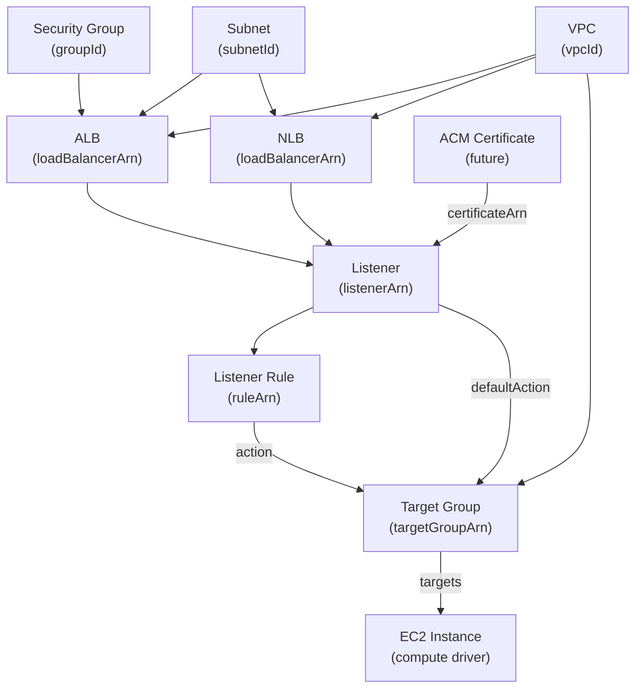

# ELB Driver Pack — Overview

---

## Table of Contents

1. [Driver Summary](#1-driver-summary)
2. [Relationships & Dependencies](#2-relationships--dependencies)
3. [Driver Pack: praxis-network (ELB drivers)](#3-driver-pack-praxis-network-elb-drivers)
4. [Shared Infrastructure](#4-shared-infrastructure)
5. [Implementation Order](#5-implementation-order)
6. [go.mod Changes](#6-gomod-changes)
7. [Docker Compose Changes](#7-docker-compose-changes)
8. [Justfile Changes](#8-justfile-changes)
9. [Registry Integration](#9-registry-integration)
10. [Cross-Driver References](#10-cross-driver-references)
11. [Common Patterns](#11-common-patterns)
12. [Checklist](#12-checklist)

---

## 1. Driver Summary

| Driver | Kind | Key | Key Scope | Mutable | Tags | Spec Doc |
|---|---|---|---|---|---|---|
| ALB | `ALB` | `region~albName` | `KeyScopeRegion` | subnets, securityGroups, ipAddressType, accessLogs, deletionProtection, idleTimeout, tags | Yes | [ALB_DRIVER_PLAN.md](ALB_DRIVER_PLAN.md) |
| NLB | `NLB` | `region~nlbName` | `KeyScopeRegion` | subnets, crossZoneLoadBalancing, deletionProtection, tags | Yes | [NLB_DRIVER_PLAN.md](NLB_DRIVER_PLAN.md) |
| Target Group | `TargetGroup` | `region~tgName` | `KeyScopeRegion` | healthCheck, deregistrationDelay, stickiness, targets, tags | Yes | [TARGET_GROUP_DRIVER_PLAN.md](TARGET_GROUP_DRIVER_PLAN.md) |
| Listener | `Listener` | `region~listenerName` | `KeyScopeRegion` | port, protocol, defaultActions, sslPolicy, certificateArn, alpnPolicy, tags | Yes | [LISTENER_DRIVER_PLAN.md](LISTENER_DRIVER_PLAN.md) |
| Listener Rule | `ListenerRule` | `region~ruleName` | `KeyScopeRegion` | priority, conditions, actions, tags | Yes | [LISTENER_RULE_DRIVER_PLAN.md](LISTENER_RULE_DRIVER_PLAN.md) |

All five drivers use `KeyScopeRegion` — ELBv2 resources are regional, keys are
prefixed with the region (`<region>~<name>`).

---

## 2. Relationships & Dependencies



### Dependency Rules

| From | To | Relationship |
|---|---|---|
| ALB | VPC | Load balancer is provisioned within a VPC (via subnets) |
| ALB | Subnet | ALB's `subnets[]` references subnet IDs (minimum 2 AZs) |
| ALB | Security Group | ALB's `securityGroups[]` references SG IDs |
| NLB | VPC | Load balancer is provisioned within a VPC (via subnets) |
| NLB | Subnet | NLB's `subnets[]` references subnet IDs (minimum 2 AZs) |
| NLB | Elastic IP | NLB optionally maps EIPs to subnet mappings (static IPs) |
| Target Group | VPC | TG's `vpcId` references a VPC (for instance/IP targets) |
| Listener | ALB or NLB | Listener's `loadBalancerArn` references a load balancer |
| Listener | Target Group | Listener's `defaultActions[].targetGroupArn` references a TG |
| Listener | ACM Certificate | HTTPS/TLS listener's `certificateArn` references a certificate (future) |
| Listener Rule | Listener | Rule's `listenerArn` references a listener |
| Listener Rule | Target Group | Rule's `actions[].targetGroupArn` references a TG |
| Target Group | EC2 Instance | TG's `targets[].id` references instance IDs (compute driver) |

### Ownership Boundaries

- **ALB driver**: Manages the Application Load Balancer resource and its attributes
  (subnets, security groups, access logs, deletion protection). Does NOT manage
  listeners, listener rules, or target groups.
- **NLB driver**: Manages the Network Load Balancer resource and its attributes
  (subnets, cross-zone load balancing, deletion protection). Does NOT manage
  listeners, listener rules, or target groups.
- **Target Group driver**: Manages the target group resource, its health check
  configuration, and target registrations. Does NOT manage the load balancer or
  listeners that route to it.
- **Listener driver**: Manages the listener resource on a load balancer. Owns the
  port, protocol, SSL configuration, and default action. Does NOT manage listener
  rules (non-default routing).
- **Listener Rule driver**: Manages individual routing rules on a listener. Owns
  priority, conditions, and actions. Does NOT manage the parent listener or the
  target groups referenced by actions.

---

## 3. Driver Pack: praxis-network (ELB drivers)

The five ELB drivers are served by the **praxis-network** driver pack alongside VPC,
Security Group, Route 53, and other networking drivers. Load balancers are
fundamentally networking infrastructure and share deployment lifecycle with VPC and
DNS resources.

### Entry Point

**File**: `cmd/praxis-network/main.go`

The ELB drivers are registered alongside all other networking drivers:

```go
srv := server.NewRestate().
    // ... VPC, SG, Route 53, etc. ...
    Bind(restate.Reflect(alb.NewALBDriver(auth))).
    Bind(restate.Reflect(nlb.NewNLBDriver(auth))).
    Bind(restate.Reflect(targetgroup.NewTargetGroupDriver(auth))).
    Bind(restate.Reflect(listener.NewListenerDriver(auth))).
    Bind(restate.Reflect(listenerrule.NewListenerRuleDriver(auth)))
```

### Port: 9082 (same as praxis-network)

| Pack | Port |
|---|---|
| praxis-storage | 9081 |
| praxis-network | 9082 |
| praxis-core | 9083 |
| praxis-compute | 9084 |
| praxis-identity | 9085 |

---

## 4. Shared Infrastructure

### ELBv2 Client

All five drivers share the same `elasticloadbalancingv2.Client` from
`aws-sdk-go-v2/service/elasticloadbalancingv2`. ALBs, NLBs, Target Groups,
Listeners, and Listener Rules are all managed through the ELBv2 API surface.

The client is created per-account via the auth registry's `GetConfig(account)` method.

### Rate Limiters

Each driver uses its own rate limiter namespace:

| Driver | Namespace | Sustained | Burst |
|---|---|---|---|
| ALB | `alb` | 15 | 8 |
| NLB | `nlb` | 15 | 8 |
| Target Group | `target-group` | 15 | 8 |
| Listener | `listener` | 15 | 8 |
| Listener Rule | `listener-rule` | 15 | 8 |

All use 15/8 (sustained/burst) configuration. The ELBv2 API has relatively
conservative rate limits compared to EC2, so 15 sustained RPS with burst of 8 is
appropriate. Separate namespaces prevent one driver's heavy usage from throttling
another.

### Error Classifiers

All drivers classify AWS API errors with driver-specific classifiers:

- **Not found**: Resource doesn't exist (`LoadBalancerNotFound`, `TargetGroupNotFound`,
  `ListenerNotFound`, `RuleNotFound`)
- **Already exists**: Duplicate name conflict (`DuplicateLoadBalancerName`,
  `DuplicateTargetGroupName`)
- **Dependency violation**: Resource has dependents (`ResourceInUse`,
  `OperationNotPermitted`)
- **Too many resources**: Quota exceeded (`TooManyLoadBalancers`,
  `TooManyTargetGroups`, `TooManyListeners`, `TooManyRules`)

Each driver defines its own classifiers because the ELBv2 error codes differ per
resource type.

### No Managed Key Tags

Unlike EC2/VPC drivers that use `praxis:managed-key` tags for ownership tracking, ELB
resources use AWS-enforced unique names within a region and account. `CreateLoadBalancer`
returns `DuplicateLoadBalancerName` if the name already exists. This natural conflict
signal eliminates the need for managed key ownership tags — matching the IAM pattern.

Target Groups similarly have unique names per region per account.

Listeners and Listener Rules are uniquely identified by their ARN and are children of
their parent load balancer/listener, so there is no ownership ambiguity.

---

## 5. Implementation Order

The recommended implementation order respects dependencies and allows incremental
testing:

### Phase 1: Foundation (no cross-driver dependencies within ELB)

1. **Target Group** — No dependencies on other ELB resources (only VPC). Can be
   tested standalone with health checks and target registrations. Establishes ELBv2
   API patterns and client setup.

### Phase 2: Load Balancers

2. **ALB** — Depends on subnets and security groups (from VPC pack). Most common
   load balancer type. Establishes the load balancer provisioning pattern.

3. **NLB** — Same structure as ALB but fewer attributes (no security groups).
   Benefits from patterns established by ALB driver.

### Phase 3: Routing

4. **Listener** — Depends on ALB or NLB and Target Group. Creates the port/protocol
   binding. Must come after load balancers and target groups exist.

5. **Listener Rule** — Depends on Listener and Target Group. Most complex routing
   component with conditions and priority management. Should be last.

### Dependency Test Order

```text
Target Group (isolated) → ALB → NLB → Listener (uses LB + TG) → Listener Rule (uses Listener + TG)
```

---

## 6. go.mod Changes

Add the ELBv2 SDK package:

```text
github.com/aws/aws-sdk-go-v2/service/elasticloadbalancingv2 v1.x.x
```

Run:

```bash
go get github.com/aws/aws-sdk-go-v2/service/elasticloadbalancingv2
go mod tidy
```

---

## 7. Docker Compose Changes

The ELB drivers are served by the existing `praxis-network` service in
`docker-compose.yaml`. No additional Docker Compose service is needed.

### Restate Registration

The ELB drivers are discovered automatically when `praxis-network` is registered:

```bash
curl -s -X POST http://localhost:9070/deployments \
  -H 'content-type: application/json' \
  -d '{"uri": "http://praxis-network:9080"}'
```

All networking and ELB services are discovered from the single registration endpoint
via Restate's reflection-based service discovery.

---

## 8. Justfile Changes

ELB driver test targets are standalone; logs are available via `logs-network`:

```just
test-elb:
    go test ./internal/drivers/alb/... ./internal/drivers/nlb/... \
            ./internal/drivers/targetgroup/... ./internal/drivers/listener/... \
            ./internal/drivers/listenerrule/... \
            -v -count=1 -race

test-elb-integration:
    go test ./tests/integration/ -run "TestALB|TestNLB|TestTargetGroup|TestListener|TestListenerRule" \
            -v -count=1 -tags=integration -timeout=15m

# Individual driver targets
test-alb:
    go test ./internal/drivers/alb/... -v -count=1 -race

test-nlb:
    go test ./internal/drivers/nlb/... -v -count=1 -race

test-targetgroup:
    go test ./internal/drivers/targetgroup/... -v -count=1 -race

test-listener:
    go test ./internal/drivers/listener/... -v -count=1 -race

test-listenerrule:
    go test ./internal/drivers/listenerrule/... -v -count=1 -race

# ELB logs (via network pack)
logs-network:
    docker compose logs -f praxis-network
```

---

## 9. Registry Integration

**File**: `internal/core/provider/registry.go`

Add all five adapters to `NewRegistry()`:

```go
func NewRegistry() *Registry {
    auth := authservice.NewAuthClient()
    return NewRegistryWithAdapters(
        // ... existing adapters ...

        // ELB drivers
        NewALBAdapterWithAuth(auth),
        NewNLBAdapterWithAuth(auth),
        NewTargetGroupAdapterWithAuth(auth),
        NewListenerAdapterWithAuth(auth),
        NewListenerRuleAdapterWithAuth(auth),
    )
}
```

### Adapter Files

| Driver | Adapter File |
|---|---|
| ALB | `internal/core/provider/alb_adapter.go` |
| NLB | `internal/core/provider/nlb_adapter.go` |
| Target Group | `internal/core/provider/targetgroup_adapter.go` |
| Listener | `internal/core/provider/listener_adapter.go` |
| Listener Rule | `internal/core/provider/listenerrule_adapter.go` |

---

## 10. Cross-Driver References

In Praxis templates, ELB resources reference each other via output expressions:

### Full Web Stack (ALB + Listener + Target Group + Listener Rule)

```cue
resources: {
    "web-tg": {
        kind: "TargetGroup"
        spec: {
            name: "web-targets"
            protocol: "HTTP"
            port: 80
            vpcId: "${resources.main-vpc.outputs.vpcId}"
            targetType: "instance"
            healthCheck: {
                path: "/health"
                protocol: "HTTP"
                port: "traffic-port"
                healthyThreshold: 3
                unhealthyThreshold: 3
                interval: 30
                timeout: 5
            }
            targets: [{
                id: "${resources.web-server.outputs.instanceId}"
                port: 80
            }]
        }
    }
    "web-alb": {
        kind: "ALB"
        spec: {
            name: "web-lb"
            scheme: "internet-facing"
            ipAddressType: "ipv4"
            subnets: [
                "${resources.public-subnet-a.outputs.subnetId}",
                "${resources.public-subnet-b.outputs.subnetId}"
            ]
            securityGroups: ["${resources.alb-sg.outputs.groupId}"]
        }
    }
    "web-listener": {
        kind: "Listener"
        spec: {
            name: "web-https"
            loadBalancerArn: "${resources.web-alb.outputs.loadBalancerArn}"
            port: 443
            protocol: "HTTPS"
            sslPolicy: "ELBSecurityPolicy-TLS13-1-2-2021-06"
            certificateArn: "arn:aws:acm:us-east-1:123456789012:certificate/abc-123"
            defaultActions: [{
                type: "forward"
                targetGroupArn: "${resources.web-tg.outputs.targetGroupArn}"
            }]
        }
    }
    "api-rule": {
        kind: "ListenerRule"
        spec: {
            name: "api-route"
            listenerArn: "${resources.web-listener.outputs.listenerArn}"
            priority: 100
            conditions: [{
                field: "path-pattern"
                values: ["/api/*"]
            }]
            actions: [{
                type: "forward"
                targetGroupArn: "${resources.api-tg.outputs.targetGroupArn}"
            }]
        }
    }
}
```

### NLB with Static IPs

```cue
resources: {
    "tcp-nlb": {
        kind: "NLB"
        spec: {
            name: "tcp-lb"
            scheme: "internet-facing"
            ipAddressType: "ipv4"
            subnetMappings: [{
                subnetId: "${resources.public-subnet-a.outputs.subnetId}"
                allocationId: "${resources.nlb-eip-a.outputs.allocationId}"
            }, {
                subnetId: "${resources.public-subnet-b.outputs.subnetId}"
                allocationId: "${resources.nlb-eip-b.outputs.allocationId}"
            }]
        }
    }
    "tcp-listener": {
        kind: "Listener"
        spec: {
            name: "tcp-listener"
            loadBalancerArn: "${resources.tcp-nlb.outputs.loadBalancerArn}"
            port: 443
            protocol: "TLS"
            sslPolicy: "ELBSecurityPolicy-TLS13-1-2-2021-06"
            certificateArn: "arn:aws:acm:us-east-1:123456789012:certificate/abc-456"
            defaultActions: [{
                type: "forward"
                targetGroupArn: "${resources.tcp-tg.outputs.targetGroupArn}"
            }]
        }
    }
}
```

The DAG resolver handles dependency ordering automatically based on these expression
references.

---

## 11. Common Patterns

### All ELB Drivers Share

- **`KeyScopeRegion`** — ELBv2 resources are regional; keys follow `<region>~<name>`
- **No managed key tags** — ELB uses AWS-enforced unique names; duplicate errors serve
  as natural conflict signals
- **Import defaults to `ModeObserved`** — Imported resources are observed, not mutated
- **Pre-deletion cleanup** — Remove child resources/associations before deleting
  (delete listeners before LB, deregister targets before TG)
- **ELBv2 API client** — All five drivers share `aws-sdk-go-v2/service/elasticloadbalancingv2`
- **Rate limiter**: 15 sustained / 8 burst per driver namespace

### Load Balancer Drivers (ALB + NLB)

| Pattern | ALB | NLB |
|---|---|---|
| Security groups | Yes (mutable) | No |
| Subnet mappings | Via `subnets[]` or `subnetMappings[]` | Via `subnets[]` or `subnetMappings[]` |
| Static IPs | No | Yes (EIP allocation per subnet) |
| Idle timeout | Yes (configurable) | No |
| Access logs | Yes (S3 bucket) | No |
| Deletion protection | Yes | Yes |
| Cross-zone LB | Default enabled | Configurable |
| WAF integration | Yes (future) | No |

### Routing Drivers (Listener + Listener Rule)

| Pattern | Listener | Listener Rule |
|---|---|---|
| Parent resource | Load Balancer (ALB or NLB) | Listener |
| Default/named | One default action (required) | Priority-ordered conditions |
| SSL termination | Yes (HTTPS/TLS) | No (inherits from listener) |
| Condition types | N/A | path-pattern, host-header, http-header, query-string, source-ip, http-request-method |
| Action types | forward, redirect, fixed-response | forward, redirect, fixed-response, authenticate-oidc, authenticate-cognito |

### Driver Complexity Ranking

| Driver | Complexity | Reason |
|---|---|---|
| Target Group | Medium | CRUD + health check configuration + target registration/deregistration |
| NLB | Medium | Straightforward CRUD; fewer attributes than ALB; subnet mapping |
| ALB | High | Security groups, access logs, idle timeout, WAF hooks; subnet mapping |
| Listener | High | SSL policy management; certificate association; default actions; ALB/NLB polymorphism |
| Listener Rule | Very High | Priority ordering; complex condition types; action chaining; rule limit management |

---

## 12. Checklist

### Infrastructure

- [x] `go get github.com/aws/aws-sdk-go-v2/service/elasticloadbalancingv2` added
- [x] ELB drivers added to `cmd/praxis-network/main.go`
- [x] `justfile` updated with ELB targets

### Schemas

- [x] `schemas/aws/elb/alb.cue`
- [x] `schemas/aws/elb/nlb.cue`
- [x] `schemas/aws/elb/target_group.cue`
- [x] `schemas/aws/elb/listener.cue`
- [x] `schemas/aws/elb/listener_rule.cue`

### Drivers (per driver: types + aws + drift + driver)

- [x] `internal/drivers/alb/`
- [x] `internal/drivers/nlb/`
- [x] `internal/drivers/targetgroup/`
- [x] `internal/drivers/listener/`
- [x] `internal/drivers/listenerrule/`

### Adapters

- [x] `internal/core/provider/alb_adapter.go`
- [x] `internal/core/provider/nlb_adapter.go`
- [x] `internal/core/provider/targetgroup_adapter.go`
- [x] `internal/core/provider/listener_adapter.go`
- [x] `internal/core/provider/listenerrule_adapter.go`

### Registry

- [x] All 5 adapters registered in `NewRegistry()`

### Tests

- [x] Unit tests for all 5 drivers
- [x] Integration tests for all 5 drivers
- [ ] Cross-driver integration test (TG → ALB → Listener → Listener Rule)

### Documentation

- [x] [ALB_DRIVER_PLAN.md](ALB_DRIVER_PLAN.md)
- [x] [NLB_DRIVER_PLAN.md](NLB_DRIVER_PLAN.md)
- [x] [TARGET_GROUP_DRIVER_PLAN.md](TARGET_GROUP_DRIVER_PLAN.md)
- [x] [LISTENER_DRIVER_PLAN.md](LISTENER_DRIVER_PLAN.md)
- [x] [LISTENER_RULE_DRIVER_PLAN.md](LISTENER_RULE_DRIVER_PLAN.md)
- [x] This overview document
