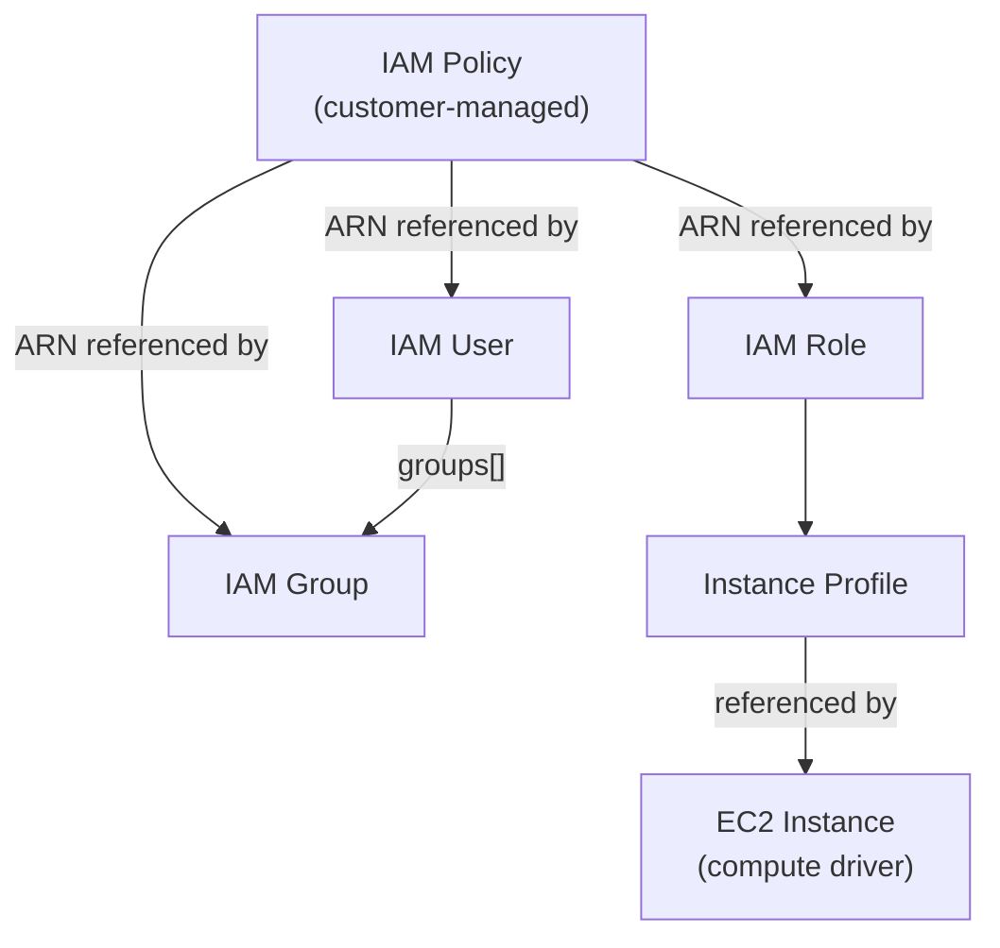

# IAM Driver Pack — Overview

> NYI
> This document summarizes the IAM driver family for Praxis: five drivers covering
> IAM Roles, Policies, Users, Groups, and Instance Profiles. It describes their
> relationships, shared infrastructure, implementation order, and the new
> `praxis-iam` driver pack.

---

## Table of Contents

1. [Driver Summary](#1-driver-summary)
2. [Relationships & Dependencies](#2-relationships--dependencies)
3. [Driver Pack: praxis-iam](#3-driver-pack-praxis-iam)
4. [Shared Infrastructure](#4-shared-infrastructure)
5. [Implementation Order](#5-implementation-order)
6. [go.mod Changes](#6-gomod-changes)
7. [Docker Compose Changes](#7-docker-compose-changes)
8. [Justfile Changes](#8-justfile-changes)
9. [Registry Integration](#9-registry-integration)
10. [Cross-Driver References](#10-cross-driver-references)
11. [Common Patterns](#11-common-patterns)
12. [Checklist](#12-checklist)

---

## 1. Driver Summary

| Driver | Kind | Key | Mutable | Tags | Plan Doc |
|---|---|---|---|---|---|
| IAM Role | `IAMRole` | `roleName` | assumeRolePolicyDocument, description, maxSessionDuration, permissionsBoundary, inlinePolicies, managedPolicyArns, tags | Yes | [IAM_ROLE_DRIVER_PLAN.md](IAM_ROLE_DRIVER_PLAN.md) |
| IAM Policy | `IAMPolicy` | `policyName` | policyDocument, tags | Yes | [IAM_POLICY_DRIVER_PLAN.md](IAM_POLICY_DRIVER_PLAN.md) |
| IAM User | `IAMUser` | `userName` | path, permissionsBoundary, inlinePolicies, managedPolicyArns, groups, tags | Yes | [IAM_USER_DRIVER_PLAN.md](IAM_USER_DRIVER_PLAN.md) |
| IAM Group | `IAMGroup` | `groupName` | path, inlinePolicies, managedPolicyArns | **No** | [IAM_GROUP_DRIVER_PLAN.md](IAM_GROUP_DRIVER_PLAN.md) |
| IAM Instance Profile | `IAMInstanceProfile` | `instanceProfileName` | roleName, tags | Yes | [IAM_INSTANCE_PROFILE_DRIVER_PLAN.md](IAM_INSTANCE_PROFILE_DRIVER_PLAN.md) |

All drivers use `KeyScopeGlobal` — IAM is a global service, names are unique per account.

---

## 2. Relationships & Dependencies



### Dependency Rules

| From | To | Relationship |
|---|---|---|
| IAM User | IAM Group | User's `groups[]` references group names |
| IAM User | IAM Policy | User's `managedPolicyArns[]` references policy ARNs |
| IAM Role | IAM Policy | Role's `managedPolicyArns[]` references policy ARNs |
| IAM Group | IAM Policy | Group's `managedPolicyArns[]` references policy ARNs |
| Instance Profile | IAM Role | Profile's `roleName` references role name |
| EC2 Instance | Instance Profile | EC2's `iamInstanceProfile` references profile ARN/name |

### Ownership Boundaries

- **IAM Policy driver**: Manages the policy resource (document, versions, tags). Does NOT manage attachments.
- **IAM Role driver**: Manages the role resource AND its policy attachments (inline + managed).
- **IAM User driver**: Manages the user resource, its policy attachments, AND group membership.
- **IAM Group driver**: Manages the group resource AND its policy attachments. Does NOT manage membership.
- **Instance Profile driver**: Manages the instance profile AND its role association.

---

## 3. Driver Pack: praxis-iam

### New Entry Point

**File**: `cmd/praxis-iam/main.go`

```go
package main

import (
    "context"
    "log/slog"
    "os"

    restate "github.com/restatedev/sdk-go"
    server "github.com/restatedev/sdk-go/server"

    "github.com/praxiscloud/praxis/internal/core/config"
    "github.com/praxiscloud/praxis/internal/drivers/iamrole"
    "github.com/praxiscloud/praxis/internal/drivers/iampolicy"
    "github.com/praxiscloud/praxis/internal/drivers/iamuser"
    "github.com/praxiscloud/praxis/internal/drivers/iamgroup"
    "github.com/praxiscloud/praxis/internal/drivers/iaminstanceprofile"
)

func main() {
    cfg := config.Load()

    srv := server.NewRestate().
        Bind(restate.Reflect(iamrole.NewIAMRoleDriver(cfg.Auth()))).
        Bind(restate.Reflect(iampolicy.NewIAMPolicyDriver(cfg.Auth()))).
        Bind(restate.Reflect(iamuser.NewIAMUserDriver(cfg.Auth()))).
        Bind(restate.Reflect(iamgroup.NewIAMGroupDriver(cfg.Auth()))).
        Bind(restate.Reflect(iaminstanceprofile.NewIAMInstanceProfileDriver(cfg.Auth())))

    if err := srv.Start(context.Background(), ":9085"); err != nil {
        slog.Error("praxis-iam exited unexpectedly", "err", err.Error())
        os.Exit(1)
    }
}
```

### Dockerfile

**File**: `cmd/praxis-iam/Dockerfile`

Follows same pattern as existing driver packs (`cmd/praxis-compute/Dockerfile`).

```dockerfile
FROM golang:1.25 AS builder
WORKDIR /app
COPY go.mod go.sum ./
RUN go mod download
COPY . .
RUN CGO_ENABLED=0 go build -o /praxis-iam ./cmd/praxis-iam

FROM gcr.io/distroless/static-debian12
COPY --from=builder /praxis-iam /praxis-iam
ENTRYPOINT ["/praxis-iam"]
```

### Port: 9085

| Pack | Port |
|---|---|
| praxis-storage | 9081 |
| praxis-network | 9082 |
| praxis-core | 9083 |
| praxis-compute | 9084 |
| **praxis-iam** | **9085** |

---

## 4. Shared Infrastructure

### IAM Client

All five drivers share the same `iam.Client` from `aws-sdk-go-v2/service/iam`. The
client is created per-account via the auth registry's `GetConfig(account)` method.

### Rate Limiter

All IAM drivers share the same rate limiter namespace:

```go
ratelimit.New("iam", 15, 8)
```

This means IAM API calls from all 5 drivers in the same process share a single token
bucket, preventing aggregate IAM throttling.

### Error Classifiers

All five drivers use the same error classification pattern:

```go
func IsNotFound(err error) bool       // NoSuchEntity
func IsAlreadyExists(err error) bool   // EntityAlreadyExists
func IsDeleteConflict(err error) bool  // DeleteConflict
```

Each driver defines its own copy (not shared) because drivers are independent
packages. A future refactoring could extract a shared `iamcommon` package, but this
is not needed for the initial implementation.

### Policy Document Canonicalization

Role, User, Group, and Policy drivers all handle JSON policy documents. They share
the same canonicalization logic:

1. URL-decode (AWS returns URL-encoded documents from some APIs)
2. JSON unmarshal → re-marshal (removes formatting differences)
3. Compare canonical forms

Each driver has its own copy of `canonicalizePolicyDoc`. Again, a shared utility is
a future consideration.

---

## 5. Implementation Order

The recommended implementation order respects dependencies and allows incremental
testing:

### Phase 1: Foundation (no cross-driver dependencies)

1. **IAM Policy** — No dependencies on other IAM resources. Creates standalone
   customer-managed policies. Can be tested in isolation.

2. **IAM Group** — No dependencies (membership is user-side). Simplest driver (no
   tags, no complex sub-resources). Good for establishing IAM patterns.

### Phase 2: Core Resources

3. **IAM Role** — References policies by ARN (but ARNs can be hardcoded in tests).
   Most complex IAM driver. Handles assume role policy, inline policies, managed
   policies, instance profile associations, tags.

4. **IAM User** — References policies by ARN and groups by name. Most operational
   handlers (group membership + two policy types + permission boundary).

### Phase 3: Bridge

5. **IAM Instance Profile** — References roles by name. Simple resource but critical
   for EC2 integration. Should be implemented last so the Role driver is available
   for end-to-end testing.

### Dependency Test Order

```
Policy (isolated) → Group (isolated) → Role (uses Policy ARNs) → User (uses Policies + Groups) → Instance Profile (uses Roles)
```

---

## 6. go.mod Changes

Add the IAM SDK package:

```
github.com/aws/aws-sdk-go-v2/service/iam v1.x.x
```

Run:
```bash
go get github.com/aws/aws-sdk-go-v2/service/iam
go mod tidy
```

---

## 7. Docker Compose Changes

**File**: `docker-compose.yaml` — add the `praxis-iam` service:

```yaml
  praxis-iam:
    build:
      context: .
      dockerfile: cmd/praxis-iam/Dockerfile
    ports:
      - "9085:9085"
    environment:
      - AWS_REGION=${AWS_REGION:-us-east-1}
      - AWS_ACCESS_KEY_ID=${AWS_ACCESS_KEY_ID}
      - AWS_SECRET_ACCESS_KEY=${AWS_SECRET_ACCESS_KEY}
      - AWS_ENDPOINT_URL=${AWS_ENDPOINT_URL:-}
    depends_on:
      - restate
```

Update the Restate service's registration to include `praxis-iam:9085`.

---

## 8. Justfile Changes

Add targets for the new driver pack and individual drivers:

```just
# IAM driver pack
build-iam:
    go build ./cmd/praxis-iam/...

test-iam:
    go test ./internal/drivers/iamrole/... ./internal/drivers/iampolicy/... \
            ./internal/drivers/iamuser/... ./internal/drivers/iamgroup/... \
            ./internal/drivers/iaminstanceprofile/... \
            -v -count=1 -race

test-iam-integration:
    go test ./tests/integration/ -run "TestIAMRole|TestIAMPolicy|TestIAMUser|TestIAMGroup|TestIAMInstanceProfile" \
            -v -count=1 -tags=integration -timeout=10m

# Individual driver targets
test-iamrole:
    go test ./internal/drivers/iamrole/... -v -count=1 -race

test-iampolicy:
    go test ./internal/drivers/iampolicy/... -v -count=1 -race

test-iamuser:
    go test ./internal/drivers/iamuser/... -v -count=1 -race

test-iamgroup:
    go test ./internal/drivers/iamgroup/... -v -count=1 -race

test-iaminstanceprofile:
    go test ./internal/drivers/iaminstanceprofile/... -v -count=1 -race
```

---

## 9. Registry Integration

**File**: `internal/core/provider/registry.go`

Add all five adapters to `NewRegistry()`:

```go
func NewRegistry(accounts *auth.Registry) *Registry {
    r := &Registry{adapters: make(map[string]Adapter)}

    // ... existing adapters ...

    // IAM drivers
    r.Register(NewIAMRoleAdapterWithRegistry(accounts))
    r.Register(NewIAMPolicyAdapterWithRegistry(accounts))
    r.Register(NewIAMUserAdapterWithRegistry(accounts))
    r.Register(NewIAMGroupAdapterWithRegistry(accounts))
    r.Register(NewIAMInstanceProfileAdapterWithRegistry(accounts))

    return r
}
```

---

## 10. Cross-Driver References

In Praxis templates, IAM resources reference each other via output expressions:

### Policy → Role / User / Group

```cue
resources: {
    "my-policy": {
        kind: "IAMPolicy"
        spec: policyDocument: "..."
    }
    "my-role": {
        kind: "IAMRole"
        spec: managedPolicyArns: ["${resources.my-policy.outputs.arn}"]
    }
}
```

### Role → Instance Profile → EC2

```cue
resources: {
    "app-role": {
        kind: "IAMRole"
        spec: assumeRolePolicyDocument: "..."
    }
    "app-profile": {
        kind: "IAMInstanceProfile"
        spec: roleName: "${resources.app-role.outputs.roleName}"
    }
    "app-instance": {
        kind: "EC2"
        spec: iamInstanceProfile: "${resources.app-profile.outputs.arn}"
    }
}
```

### Group → User

```cue
resources: {
    "dev-group": {
        kind: "IAMGroup"
        spec: managedPolicyArns: ["${resources.dev-policy.outputs.arn}"]
    }
    "dev-user": {
        kind: "IAMUser"
        spec: groups: ["${resources.dev-group.outputs.groupName}"]
    }
}
```

The DAG resolver handles dependency ordering automatically based on these expression
references.

---

## 11. Common Patterns

### All IAM Drivers Share

- **`KeyScopeGlobal`** — IAM is global, no region prefix
- **Import defaults to `ModeObserved`** — IAM resources are high-value; don't mutate on import
- **Pre-deletion cleanup** — Remove associations before deleting the resource
- **Error classifiers with string fallback** — Handle Restate-wrapped panic errors
- **Rate limiter namespace `"iam"`** — All share the same token bucket
- **Composite describe** — Base resource + sub-resources (policies, attachments, etc.)

### Driver Complexity Ranking

| Driver | Complexity | Reason |
|---|---|---|
| IAM Group | Low | No tags, no members management, minimal sub-resources |
| IAM Instance Profile | Low | Only role association + tags |
| IAM Policy | Medium | Version management (5-version limit), no sub-resources |
| IAM User | High | Group membership + inline policies + managed policies + tags |
| IAM Role | High | Assume role policy + inline policies + managed policies + instance profile cleanup + tags |

---

## 12. Checklist

### Infrastructure
- [ ] `go get github.com/aws/aws-sdk-go-v2/service/iam` added
- [ ] `cmd/praxis-iam/main.go` created
- [ ] `cmd/praxis-iam/Dockerfile` created
- [ ] `docker-compose.yaml` updated with `praxis-iam` service
- [ ] `justfile` updated with IAM targets

### Schemas
- [ ] `schemas/aws/iam/role.cue`
- [ ] `schemas/aws/iam/policy.cue`
- [ ] `schemas/aws/iam/user.cue`
- [ ] `schemas/aws/iam/group.cue`
- [ ] `schemas/aws/iam/instance_profile.cue`

### Drivers (per driver: types + aws + drift + driver)
- [ ] `internal/drivers/iamrole/`
- [ ] `internal/drivers/iampolicy/`
- [ ] `internal/drivers/iamuser/`
- [ ] `internal/drivers/iamgroup/`
- [ ] `internal/drivers/iaminstanceprofile/`

### Adapters
- [ ] `internal/core/provider/iamrole_adapter.go`
- [ ] `internal/core/provider/iampolicy_adapter.go`
- [ ] `internal/core/provider/iamuser_adapter.go`
- [ ] `internal/core/provider/iamgroup_adapter.go`
- [ ] `internal/core/provider/iaminstanceprofile_adapter.go`

### Registry
- [ ] All 5 adapters registered in `NewRegistry()`

### Tests
- [ ] Unit tests for all 5 drivers
- [ ] Integration tests for all 5 drivers
- [ ] Cross-driver integration test (Policy → Role → Instance Profile → EC2)

### Documentation
- [ ] [IAM_ROLE_DRIVER_PLAN.md](IAM_ROLE_DRIVER_PLAN.md)
- [ ] [IAM_POLICY_DRIVER_PLAN.md](IAM_POLICY_DRIVER_PLAN.md)
- [ ] [IAM_USER_DRIVER_PLAN.md](IAM_USER_DRIVER_PLAN.md)
- [ ] [IAM_GROUP_DRIVER_PLAN.md](IAM_GROUP_DRIVER_PLAN.md)
- [ ] [IAM_INSTANCE_PROFILE_DRIVER_PLAN.md](IAM_INSTANCE_PROFILE_DRIVER_PLAN.md)
- [ ] This overview document
