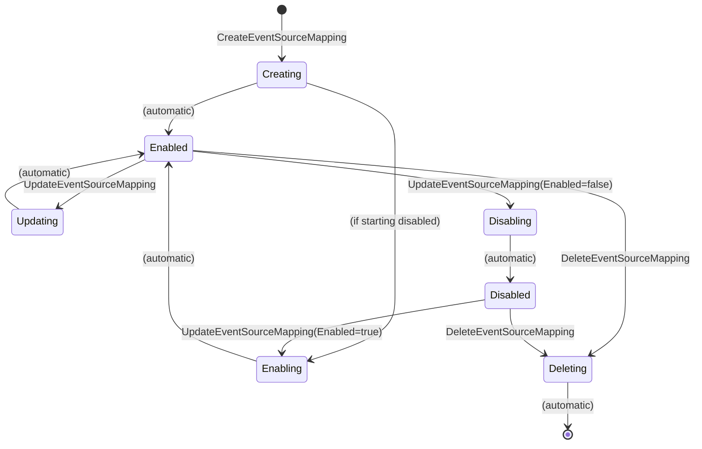

# Event Source Mapping Driver — Implementation Spec

---

## Table of Contents

1. [Overview & Scope](#1-overview--scope)
2. [Key Strategy](#2-key-strategy)
3. [File Inventory](#3-file-inventory)
4. [Step 1 — CUE Schema](#step-1--cue-schema)
5. [Step 2 — AWS Client Factory](#step-2--aws-client-factory)
6. [Step 3 — Driver Types](#step-3--driver-types)
7. [Step 4 — AWS API Abstraction Layer](#step-4--aws-api-abstraction-layer)
8. [Step 5 — Drift Detection](#step-5--drift-detection)
9. [Step 6 — Driver Implementation](#step-6--driver-implementation)
10. [Step 7 — Provider Adapter](#step-7--provider-adapter)
11. [Step 8 — Registry Integration](#step-8--registry-integration)
12. [Step 9 — Compute Driver Pack Entry Point](#step-9--compute-driver-pack-entry-point)
13. [Step 10 — Docker Compose & Justfile](#step-10--docker-compose--justfile)
14. [Step 11 — Unit Tests](#step-11--unit-tests)
15. [Step 12 — Integration Tests](#step-12--integration-tests)
16. [ESM-Specific Design Decisions](#esm-specific-design-decisions)
17. [Checklist](#checklist)

---

## 1. Overview & Scope

The Event Source Mapping (ESM) driver manages the mapping between an **event source**
and a **Lambda function**. An ESM configures Lambda to poll a stream or queue and
invoke the function with batches of records. The event source mapping is the
"glue" that connects event producers to Lambda consumers.

### Supported Event Sources

| Source | Service | Key Characteristics |
|---|---|---|
| SQS Queue | Amazon SQS | Standard and FIFO queues; batch window; max concurrency |
| DynamoDB Stream | Amazon DynamoDB | Stream of table modifications; starting position; bisect on error |
| Kinesis Stream | Amazon Kinesis | Real-time data stream; starting position; parallelization |
| Amazon MSK | Amazon MSK | Kafka topic; consumer group; starting position |
| Self-managed Kafka | Apache Kafka | Self-hosted Kafka; SASL/TLS auth; topic |
| Amazon MQ | Amazon MQ | ActiveMQ/RabbitMQ; queue name; basic auth |
| Amazon DocumentDB | Amazon DocumentDB | Change streams; collection; starting position |

The driver is event-source-agnostic at the API level — all sources use the same
`CreateEventSourceMapping` / `UpdateEventSourceMapping` / `DeleteEventSourceMapping`
APIs. Source-specific configuration (starting position, SASL auth, topic) is modeled
in the spec as optional fields.

### ESM Lifecycle State Machine



The driver must handle these transient states. State transitions are asynchronous —
after calling an API, the driver polls until the ESM reaches a stable state
(`Enabled`, `Disabled`, or deleted).

### Driver Contract

| Handler | Context | Purpose |
|---|---|---|
| `Provision` | `ObjectContext` (exclusive) | Create or update an ESM |
| `Import` | `ObjectContext` (exclusive) | Adopt an existing ESM |
| `Delete` | `ObjectContext` (exclusive) | Delete an ESM |
| `Reconcile` | `ObjectContext` (exclusive) | Detect/correct drift |
| `GetStatus` | `ObjectSharedContext` (shared) | Return current status |
| `GetOutputs` | `ObjectSharedContext` (shared) | Return ESM outputs |

### Mutable vs Immutable Attributes

| Attribute | Mutability | Notes |
|---|---|---|
| UUID | Immutable | AWS-assigned identifier |
| Event source ARN | Immutable | Cannot change the source after creation |
| Function name/ARN | Mutable | Can re-point to a different function |
| Batch size | Mutable | Records per batch |
| Maximum batching window | Mutable | Time to wait for a full batch |
| Enabled | Mutable | Enable/disable the mapping |
| Filter criteria | Mutable | Event filtering patterns |
| Starting position | Immutable | Only for stream sources; set at creation |
| Bisect batch on error | Mutable | DynamoDB/Kinesis only |
| Maximum retry attempts | Mutable | DynamoDB/Kinesis only |
| Maximum record age | Mutable | DynamoDB/Kinesis only |
| Parallelization factor | Mutable | DynamoDB/Kinesis only |
| Destination config (on failure) | Mutable | SQS/SNS DLQ for failed records |
| Tumbling window | Mutable | DynamoDB/Kinesis only |
| Scaling config (max concurrency) | Mutable | SQS only |

### What Is NOT In Scope

- **Event source creation**: The SQS queue, DynamoDB table, Kinesis stream, etc.
  must already exist. They are managed by their respective drivers.
- **Self-managed Kafka authentication secrets**: Secret Manager integration for
  Kafka auth is a future extension.
- **Pipe-style transformations**: Amazon EventBridge Pipes are a separate service.

### Downstream Consumers

```text
${resources.my-esm.outputs.uuid}              → Informational / management
${resources.my-esm.outputs.eventSourceArn}     → Cross-references
${resources.my-esm.outputs.functionArn}        → Cross-references
${resources.my-esm.outputs.state}              → Health monitoring
```

ESMs are typically leaf nodes in the DAG. Other resources rarely depend on an ESM's
outputs.

---

## 2. Key Strategy

### Key Format: `region~functionName~eventSourceArn`

An ESM is uniquely defined by the combination of a Lambda function and an event
source. AWS allows at most one ESM per function+eventSourceArn combination for most
source types. The composite key captures this natural uniqueness.

**Key encoding**: The event source ARN contains colons and slashes, which are not
safe in Restate Virtual Object keys. The driver base64url-encodes the event source
ARN component to produce a safe key:

```text
region~functionName~base64url(eventSourceArn)
```

Example:

```text
us-east-1~my-handler~YXJuOmF3czpzcXM6dXMtZWFzdC0xOjEyMzQ1Njc4OTAxMjpteS1xdWV1ZQ
```

1. **BuildKey** (adapter, plan-time): Extracts `spec.region`, `spec.functionName`,
   and `spec.eventSourceArn`, encodes the ARN, and returns the composite key.
2. **Provision / Delete**: dispatched to the same VO key.
3. **Plan**: reads VO state via `GetOutputs`. If outputs contain a UUID, describes
   the ESM by UUID. Otherwise, `OpCreate`.
4. **Import**: `BuildImportKey(region, resourceID)` where `resourceID` is the ESM
   UUID. Returns `region~<uuid>` — a different key form since we don't know the
   function+source combination from just the UUID. The import handler describes the
   ESM by UUID to discover the function and source ARN.

### No Ownership Tags

Event source mappings are not taggable AWS resources. The combination of
function+eventSourceArn is naturally unique — AWS rejects duplicate ESM creation.

---

## 3. File Inventory

```text
✦ internal/drivers/esm/types.go                — Spec, Outputs, ObservedState, State
✦ internal/drivers/esm/aws.go                  — ESMAPI interface + realESMAPI impl
✦ internal/drivers/esm/drift.go                — HasDrift(), ComputeFieldDiffs()
✦ internal/drivers/esm/driver.go               — EventSourceMappingDriver Virtual Object
✦ internal/drivers/esm/driver_test.go          — Unit tests for driver
✦ internal/drivers/esm/aws_test.go             — Unit tests for error classification
✦ internal/drivers/esm/drift_test.go           — Unit tests for drift detection
✦ internal/core/provider/esm_adapter.go        — Adapter
✦ internal/core/provider/esm_adapter_test.go   — Adapter tests
✦ schemas/aws/lambda/event_source_mapping.cue  — CUE schema
✦ tests/integration/esm_driver_test.go         — Integration tests
✎ cmd/praxis-compute/main.go                   — Bind ESM driver
✎ internal/core/provider/registry.go           — Add adapter to NewRegistry()
```

---

## Step 1 — CUE Schema

**File**: `schemas/aws/lambda/event_source_mapping.cue`

```cue
package lambda

#EventSourceMapping: {
    apiVersion: "praxis.io/v1"
    kind:       "EventSourceMapping"

    metadata: {
        // name is a logical name for this mapping within the Praxis template.
        name: string & =~"^[a-zA-Z0-9][a-zA-Z0-9._-]{0,254}$"
        labels: [string]: string
    }

    spec: {
        // region is the AWS region.
        region: string

        // functionName is the name or ARN of the target Lambda function.
        functionName: string

        // eventSourceArn is the ARN of the event source (SQS queue, DynamoDB stream, Kinesis stream, etc.).
        eventSourceArn: string

        // enabled controls whether the mapping is active.
        enabled: bool | *true

        // batchSize is the maximum number of records per batch (1-10000, source-dependent).
        batchSize?: int & >=1 & <=10000

        // maximumBatchingWindowInSeconds is the maximum time to wait for a full batch.
        maximumBatchingWindowInSeconds?: int & >=0 & <=300

        // startingPosition for stream-based sources (TRIM_HORIZON, LATEST, AT_TIMESTAMP).
        // Required for DynamoDB Streams, Kinesis, MSK. Not applicable for SQS.
        startingPosition?: "TRIM_HORIZON" | "LATEST" | "AT_TIMESTAMP"

        // startingPositionTimestamp when startingPosition is AT_TIMESTAMP.
        startingPositionTimestamp?: string

        // filterCriteria defines event filtering patterns.
        filterCriteria?: {
            filters: [...{
                pattern: string
            }]
        }

        // Stream-source-specific settings (DynamoDB, Kinesis)

        // bisectBatchOnFunctionError splits a failed batch in two for retrying.
        bisectBatchOnFunctionError?: bool

        // maximumRetryAttempts for stream sources (-1 for infinite).
        maximumRetryAttempts?: int & >=-1 & <=10000

        // maximumRecordAgeInSeconds discards records older than this (-1 for infinite).
        maximumRecordAgeInSeconds?: int & >=-1 & <=604800

        // parallelizationFactor for stream sources (1-10).
        parallelizationFactor?: int & >=1 & <=10

        // tumblingWindowInSeconds for stream aggregation (0-900).
        tumblingWindowInSeconds?: int & >=0 & <=900

        // destinationConfig for failed record routing.
        destinationConfig?: {
            onFailure: {
                // destinationArn is an SQS queue or SNS topic ARN for failed records.
                destinationArn: string
            }
        }

        // SQS-specific settings

        // scalingConfig controls SQS concurrency scaling.
        scalingConfig?: {
            maximumConcurrency: int & >=2 & <=1000
        }

        // functionResponseTypes enables partial batch response reporting.
        functionResponseTypes?: [...("ReportBatchItemFailures")]
    }

    outputs?: {
        uuid:           string
        eventSourceArn: string
        functionArn:    string
        state:          string
        lastModified:   string
        batchSize:      int
    }
}
```

### Schema Design Notes

- **Source-agnostic core fields**: `functionName`, `eventSourceArn`, `enabled`,
  `batchSize`, `maximumBatchingWindowInSeconds`, `filterCriteria` apply to all sources.
- **Stream-specific fields**: `startingPosition`, `bisectBatchOnFunctionError`,
  `maximumRetryAttempts`, `maximumRecordAgeInSeconds`, `parallelizationFactor`,
  `tumblingWindowInSeconds`, `destinationConfig` are only relevant for DynamoDB
  Streams and Kinesis.
- **SQS-specific fields**: `scalingConfig` (maximum concurrency) is SQS-only.
- **`startingPosition` is creation-time only**: Cannot be changed after ESM creation.
  CUE validation does not enforce this — the driver returns a terminal error if the
  user tries to change it.
- **`filterCriteria.filters[].pattern`**: JSON string defining the filter pattern.
  The driver passes it through as-is to the AWS API.

---

## Step 2 — AWS Client Factory

**File**: `internal/infra/awsclient/client.go` — **NO CHANGES NEEDED**

ESM operations use the same Lambda API client. Reuses `NewLambdaClient()`.

---

## Step 3 — Driver Types

**File**: `internal/drivers/esm/types.go`

```go
package esm

import "github.com/shirvan/praxis/pkg/types"

const ServiceName = "EventSourceMapping"

type EventSourceMappingSpec struct {
    Account                          string               `json:"account,omitempty"`
    Region                           string               `json:"region"`
    FunctionName                     string               `json:"functionName"`
    EventSourceArn                   string               `json:"eventSourceArn"`
    Enabled                          bool                 `json:"enabled"`
    BatchSize                        *int32               `json:"batchSize,omitempty"`
    MaximumBatchingWindowInSeconds   *int32               `json:"maximumBatchingWindowInSeconds,omitempty"`
    StartingPosition                 string               `json:"startingPosition,omitempty"`
    StartingPositionTimestamp        *string              `json:"startingPositionTimestamp,omitempty"`
    FilterCriteria                   *FilterCriteriaSpec  `json:"filterCriteria,omitempty"`
    BisectBatchOnFunctionError       *bool                `json:"bisectBatchOnFunctionError,omitempty"`
    MaximumRetryAttempts             *int32               `json:"maximumRetryAttempts,omitempty"`
    MaximumRecordAgeInSeconds        *int32               `json:"maximumRecordAgeInSeconds,omitempty"`
    ParallelizationFactor            *int32               `json:"parallelizationFactor,omitempty"`
    TumblingWindowInSeconds          *int32               `json:"tumblingWindowInSeconds,omitempty"`
    DestinationConfig                *DestinationSpec     `json:"destinationConfig,omitempty"`
    ScalingConfig                    *ScalingSpec         `json:"scalingConfig,omitempty"`
    FunctionResponseTypes            []string             `json:"functionResponseTypes,omitempty"`
    ManagedKey                       string               `json:"managedKey,omitempty"`
}

type FilterCriteriaSpec struct {
    Filters []FilterSpec `json:"filters"`
}

type FilterSpec struct {
    Pattern string `json:"pattern"`
}

type DestinationSpec struct {
    OnFailure OnFailureSpec `json:"onFailure"`
}

type OnFailureSpec struct {
    DestinationArn string `json:"destinationArn"`
}

type ScalingSpec struct {
    MaximumConcurrency int32 `json:"maximumConcurrency"`
}

type EventSourceMappingOutputs struct {
    UUID           string `json:"uuid"`
    EventSourceArn string `json:"eventSourceArn"`
    FunctionArn    string `json:"functionArn"`
    State          string `json:"state"`
    LastModified   string `json:"lastModified"`
    BatchSize      int32  `json:"batchSize"`
}

type ObservedState struct {
    UUID                             string              `json:"uuid"`
    EventSourceArn                   string              `json:"eventSourceArn"`
    FunctionArn                      string              `json:"functionArn"`
    State                            string              `json:"state"` // Creating, Enabling, Enabled, Disabling, Disabled, Updating, Deleting
    BatchSize                        int32               `json:"batchSize"`
    MaximumBatchingWindowInSeconds   int32               `json:"maximumBatchingWindowInSeconds"`
    StartingPosition                 string              `json:"startingPosition,omitempty"`
    FilterCriteria                   *FilterCriteriaSpec `json:"filterCriteria,omitempty"`
    BisectBatchOnFunctionError       bool                `json:"bisectBatchOnFunctionError"`
    MaximumRetryAttempts             *int32              `json:"maximumRetryAttempts,omitempty"`
    MaximumRecordAgeInSeconds        *int32              `json:"maximumRecordAgeInSeconds,omitempty"`
    ParallelizationFactor            int32               `json:"parallelizationFactor"`
    TumblingWindowInSeconds          int32               `json:"tumblingWindowInSeconds"`
    DestinationConfig                *DestinationSpec    `json:"destinationConfig,omitempty"`
    ScalingConfig                    *ScalingSpec        `json:"scalingConfig,omitempty"`
    FunctionResponseTypes            []string            `json:"functionResponseTypes,omitempty"`
    LastModified                     string              `json:"lastModified"`
}

type EventSourceMappingState struct {
    Desired            EventSourceMappingSpec    `json:"desired"`
    Observed           ObservedState             `json:"observed"`
    Outputs            EventSourceMappingOutputs `json:"outputs"`
    Status             types.ResourceStatus      `json:"status"`
    Mode               types.Mode                `json:"mode"`
    Error              string                    `json:"error,omitempty"`
    Generation         int64                     `json:"generation"`
    LastReconcile      string                    `json:"lastReconcile,omitempty"`
    ReconcileScheduled bool                      `json:"reconcileScheduled"`
}
```

### Types Design Notes

- **Pointer types for optional integers**: `*int32` is used for fields that have
  meaningful zero values (e.g., `BatchSize` of 0 is invalid, but `MaximumRetryAttempts`
  of 0 means no retries). Pointers distinguish "not set" from "set to zero".
- **`ObservedState.State`**: The ESM lifecycle state from AWS (Creating, Enabling,
  Enabled, etc.). This is used by the driver to wait for stable states before
  proceeding with updates or deletions.

---

## Step 4 — AWS API Abstraction Layer

**File**: `internal/drivers/esm/aws.go`

### ESMAPI Interface

```go
type ESMAPI interface {
    // CreateEventSourceMapping creates a new ESM.
    CreateEventSourceMapping(ctx context.Context, spec EventSourceMappingSpec) (EventSourceMappingOutputs, error)

    // GetEventSourceMapping returns the current ESM state by UUID.
    GetEventSourceMapping(ctx context.Context, uuid string) (ObservedState, error)

    // FindEventSourceMapping finds an ESM by function name + event source ARN.
    // Returns ("", nil) if not found, (uuid, nil) if found.
    FindEventSourceMapping(ctx context.Context, functionName, eventSourceArn string) (string, error)

    // UpdateEventSourceMapping updates mutable ESM attributes.
    UpdateEventSourceMapping(ctx context.Context, uuid string, spec EventSourceMappingSpec) error

    // DeleteEventSourceMapping initiates ESM deletion.
    DeleteEventSourceMapping(ctx context.Context, uuid string) error

    // WaitForStableState polls until the ESM reaches Enabled, Disabled, or is deleted.
    WaitForStableState(ctx context.Context, uuid string) (string, error)
}
```

### Implementation: realESMAPI

```go
type realESMAPI struct {
    client  *lambda.Client
    limiter ratelimit.Limiter
}

func NewESMAPI(client *lambdasdk.Client) ESMAPI {
    return &realESMAPI{client: client, limiter: ratelimit.New("lambda-esm", 15, 10)}
}
```

### Error Classification

```go
func isNotFound(err error) bool {
    var rnf *types.ResourceNotFoundException
    return errors.As(err, &rnf)
}

func isConflict(err error) bool {
    var rce *types.ResourceConflictException
    return errors.As(err, &rce)
}

func isInvalidParam(err error) bool {
    var ipv *types.InvalidParameterValueException
    return errors.As(err, &ipv)
}

func isThrottled(err error) bool {
    var tmr *types.TooManyRequestsException
    return errors.As(err, &tmr)
}
```

### Key Implementation: FindEventSourceMapping

```go
func (r *realESMAPI) FindEventSourceMapping(ctx context.Context, functionName, eventSourceArn string) (string, error) {
    r.limiter.Wait(ctx)

    input := &lambda.ListEventSourceMappingsInput{
        FunctionName:   &functionName,
        EventSourceArn: &eventSourceArn,
    }

    out, err := r.client.ListEventSourceMappings(ctx, input)
    if err != nil {
        return "", err
    }

    for _, esm := range out.EventSourceMappings {
        if aws.ToString(esm.EventSourceArn) == eventSourceArn {
            return aws.ToString(esm.UUID), nil
        }
    }

    return "", nil
}
```

### Key Implementation: WaitForStableState

```go
func (r *realESMAPI) WaitForStableState(ctx context.Context, uuid string) (string, error) {
    deadline := time.After(3 * time.Minute)
    ticker := time.NewTicker(5 * time.Second)
    defer ticker.Stop()

    for {
        select {
        case <-ctx.Done():
            return "", ctx.Err()
        case <-deadline:
            return "", fmt.Errorf("timeout waiting for ESM %s to reach stable state", uuid)
        case <-ticker.C:
            observed, err := r.GetEventSourceMapping(ctx, uuid)
            if err != nil {
                if isNotFound(err) {
                    return "Deleted", nil
                }
                return "", err
            }
            switch observed.State {
            case "Enabled", "Disabled":
                return observed.State, nil
            case "Creating", "Enabling", "Disabling", "Updating":
                continue // transient state, keep polling
            case "Deleting":
                continue // will eventually become not-found
            default:
                return observed.State, nil
            }
        }
    }
}
```

### Key Implementation: CreateEventSourceMapping

```go
func (r *realESMAPI) CreateEventSourceMapping(ctx context.Context, spec EventSourceMappingSpec) (EventSourceMappingOutputs, error) {
    r.limiter.Wait(ctx)

    input := &lambda.CreateEventSourceMappingInput{
        FunctionName:   &spec.FunctionName,
        EventSourceArn: &spec.EventSourceArn,
        Enabled:        &spec.Enabled,
    }

    if spec.BatchSize != nil {
        input.BatchSize = spec.BatchSize
    }
    if spec.MaximumBatchingWindowInSeconds != nil {
        input.MaximumBatchingWindowInSeconds = spec.MaximumBatchingWindowInSeconds
    }
    if spec.StartingPosition != "" {
        input.StartingPosition = lambdatypes.EventSourcePosition(spec.StartingPosition)
    }
    if spec.FilterCriteria != nil {
        input.FilterCriteria = buildFilterCriteria(spec.FilterCriteria)
    }
    if spec.BisectBatchOnFunctionError != nil {
        input.BisectBatchOnFunctionError = spec.BisectBatchOnFunctionError
    }
    if spec.MaximumRetryAttempts != nil {
        input.MaximumRetryAttempts = spec.MaximumRetryAttempts
    }
    if spec.MaximumRecordAgeInSeconds != nil {
        input.MaximumRecordAgeInSeconds = spec.MaximumRecordAgeInSeconds
    }
    if spec.ParallelizationFactor != nil {
        input.ParallelizationFactor = spec.ParallelizationFactor
    }
    if spec.TumblingWindowInSeconds != nil {
        input.TumblingWindowInSeconds = spec.TumblingWindowInSeconds
    }
    if spec.DestinationConfig != nil {
        input.DestinationConfig = buildDestinationConfig(spec.DestinationConfig)
    }
    if spec.ScalingConfig != nil {
        input.ScalingConfig = &lambdatypes.ScalingConfig{
            MaximumConcurrency: &spec.ScalingConfig.MaximumConcurrency,
        }
    }
    if len(spec.FunctionResponseTypes) > 0 {
        input.FunctionResponseTypes = toFunctionResponseTypes(spec.FunctionResponseTypes)
    }

    out, err := r.client.CreateEventSourceMapping(ctx, input)
    if err != nil {
        return EventSourceMappingOutputs{}, err
    }

    return outputsFromCreateResponse(out), nil
}
```

---

## Step 5 — Drift Detection

**File**: `internal/drivers/esm/drift.go`

### Drift-Detectable Fields

| Field | Drift Source | Notes |
|---|---|---|
| Enabled | Console, CLI | ESM enabled/disabled externally |
| Batch size | Console, CLI | Batch size changed |
| Maximum batching window | Console, CLI | Window changed |
| Filter criteria | Console, CLI | Filters added/removed/changed |
| Bisect batch on error | Console, CLI | Stream setting changed |
| Maximum retry attempts | Console, CLI | Retry config changed |
| Maximum record age | Console, CLI | Record age limit changed |
| Parallelization factor | Console, CLI | Stream parallelism changed |
| Tumbling window | Console, CLI | Aggregation window changed |
| Destination config | Console, CLI | DLQ ARN changed |
| Scaling config | Console, CLI | SQS concurrency changed |
| Function response types | Console, CLI | Batch failure reporting changed |
| Function ARN | Console, CLI | Target function re-pointed |

### Fields NOT Drift-Detected

- **Starting position**: Immutable after creation. Cannot drift.
- **Event source ARN**: Immutable after creation. Cannot drift.
- **UUID**: Immutable. AWS-assigned.

### HasDrift

```go
func HasDrift(desired EventSourceMappingSpec, observed ObservedState) bool {
    if desired.Enabled && observed.State == "Disabled" { return true }
    if !desired.Enabled && observed.State == "Enabled" { return true }
    if desired.BatchSize != nil && *desired.BatchSize != observed.BatchSize { return true }
    if desired.MaximumBatchingWindowInSeconds != nil &&
        *desired.MaximumBatchingWindowInSeconds != observed.MaximumBatchingWindowInSeconds { return true }
    if !filterCriteriaMatch(desired.FilterCriteria, observed.FilterCriteria) { return true }
    if desired.BisectBatchOnFunctionError != nil &&
        *desired.BisectBatchOnFunctionError != observed.BisectBatchOnFunctionError { return true }
    if !int32PtrMatch(desired.MaximumRetryAttempts, observed.MaximumRetryAttempts) { return true }
    if !int32PtrMatch(desired.MaximumRecordAgeInSeconds, observed.MaximumRecordAgeInSeconds) { return true }
    if desired.ParallelizationFactor != nil &&
        *desired.ParallelizationFactor != observed.ParallelizationFactor { return true }
    if desired.TumblingWindowInSeconds != nil &&
        *desired.TumblingWindowInSeconds != observed.TumblingWindowInSeconds { return true }
    if !destinationMatch(desired.DestinationConfig, observed.DestinationConfig) { return true }
    if !scalingMatch(desired.ScalingConfig, observed.ScalingConfig) { return true }
    if !slicesEqual(desired.FunctionResponseTypes, observed.FunctionResponseTypes) { return true }
    return false
}
```

### ComputeFieldDiffs

```go
func ComputeFieldDiffs(desired EventSourceMappingSpec, observed ObservedState) []types.FieldDiff {
    var diffs []types.FieldDiff
    if desired.Enabled && observed.State == "Disabled" {
        diffs = append(diffs, types.FieldDiff{Field: "enabled", Desired: "true", Observed: "false"})
    }
    if !desired.Enabled && observed.State == "Enabled" {
        diffs = append(diffs, types.FieldDiff{Field: "enabled", Desired: "false", Observed: "true"})
    }
    if desired.BatchSize != nil && *desired.BatchSize != observed.BatchSize {
        diffs = append(diffs, types.FieldDiff{
            Field:    "batchSize",
            Desired:  fmt.Sprintf("%d", *desired.BatchSize),
            Observed: fmt.Sprintf("%d", observed.BatchSize),
        })
    }
    // ... similar for all drift-detectable fields
    return diffs
}
```

---

## Step 6 — Driver Implementation

**File**: `internal/drivers/esm/driver.go`

### Constructor

```go
type EventSourceMappingDriver struct {
    auth       authservice.AuthClient
    apiFactory func(aws.Config) ESMAPI
}

func NewEventSourceMappingDriver(auth authservice.AuthClient) *EventSourceMappingDriver {
    return NewEventSourceMappingDriverWithFactory(auth, func(cfg aws.Config) ESMAPI {
        return NewESMAPI(awsclient.NewLambdaClient(cfg))
    })
}

func NewEventSourceMappingDriverWithFactory(auth authservice.AuthClient, factory func(aws.Config) ESMAPI) *EventSourceMappingDriver {
    if factory == nil {
        factory = func(cfg aws.Config) ESMAPI { return NewESMAPI(awsclient.NewLambdaClient(cfg)) }
    }
    return &EventSourceMappingDriver{auth: auth, apiFactory: factory}
}

func (d *EventSourceMappingDriver) ServiceName() string { return ServiceName }
```

### Provision

```go
func (d *EventSourceMappingDriver) Provision(ctx restate.ObjectContext, spec EventSourceMappingSpec) (EventSourceMappingOutputs, error) {
    state, _ := restate.Get[*EventSourceMappingState](ctx, drivers.StateKey)
    api := d.buildAPI(spec.Account, spec.Region)

    // Case 1: No existing state → check for existing ESM or create
    if state == nil || state.Outputs.UUID == "" {
        return d.createESM(ctx, api, spec)
    }

    // Case 2: Existing ESM → update
    return d.updateESM(ctx, api, spec, state)
}
```

#### Create Flow

```go
func (d *EventSourceMappingDriver) createESM(ctx restate.ObjectContext, api ESMAPI, spec EventSourceMappingSpec) (EventSourceMappingOutputs, error) {
    // Check for existing ESM (convergent provision)
    existingUUID, err := restate.Run(ctx, func(rc restate.RunContext) (string, error) {
        return api.FindEventSourceMapping(rc, spec.FunctionName, spec.EventSourceArn)
    })
    if err != nil {
        return EventSourceMappingOutputs{}, err
    }

    if existingUUID != "" {
        // ESM already exists — adopt it and update if needed
        observed, err := restate.Run(ctx, func(rc restate.RunContext) (ObservedState, error) {
            return api.GetEventSourceMapping(rc, existingUUID)
        })
        if err != nil {
            return EventSourceMappingOutputs{}, err
        }

        state := &EventSourceMappingState{
            Desired:  spec,
            Observed: observed,
            Outputs:  outputsFromObserved(observed),
            Status:   types.StatusReady,
            Mode:     types.ModeManaged,
            Generation: 1,
        }
        restate.Set(ctx, drivers.StateKey, state)

        if HasDrift(spec, observed) {
            return d.updateESM(ctx, api, spec, state)
        }

        d.scheduleReconcile(ctx)
        return state.Outputs, nil
    }

    // No existing ESM — create new
    restate.Set(ctx, drivers.StateKey, &EventSourceMappingState{
        Desired: spec,
        Status:  types.StatusProvisioning,
        Mode:    types.ModeManaged,
    })

    outputs, err := restate.Run(ctx, func(rc restate.RunContext) (EventSourceMappingOutputs, error) {
        return api.CreateEventSourceMapping(rc, spec)
    })
    if err != nil {
        if isConflict(err) {
            return EventSourceMappingOutputs{}, restate.TerminalError(
                fmt.Errorf("ESM for function %q and source %q already exists",
                    spec.FunctionName, spec.EventSourceArn), 409)
        }
        if isNotFound(err) {
            return EventSourceMappingOutputs{}, restate.TerminalError(
                fmt.Errorf("function %q or event source not found", spec.FunctionName), 404)
        }
        return EventSourceMappingOutputs{}, err
    }

    // Wait for stable state
    finalState, err := restate.Run(ctx, func(rc restate.RunContext) (string, error) {
        return api.WaitForStableState(rc, outputs.UUID)
    })
    if err != nil {
        return EventSourceMappingOutputs{}, err
    }
    outputs.State = finalState

    // Describe for full observed state
    observed, err := restate.Run(ctx, func(rc restate.RunContext) (ObservedState, error) {
        return api.GetEventSourceMapping(rc, outputs.UUID)
    })
    if err != nil {
        return EventSourceMappingOutputs{}, err
    }

    restate.Set(ctx, drivers.StateKey, &EventSourceMappingState{
        Desired:    spec,
        Observed:   observed,
        Outputs:    outputs,
        Status:     types.StatusReady,
        Mode:       types.ModeManaged,
        Generation: 1,
    })

    d.scheduleReconcile(ctx)
    return outputs, nil
}
```

#### Update Flow

```go
func (d *EventSourceMappingDriver) updateESM(ctx restate.ObjectContext, api ESMAPI, spec EventSourceMappingSpec, state *EventSourceMappingState) (EventSourceMappingOutputs, error) {
    // Validate immutable fields haven't changed
    if spec.StartingPosition != state.Desired.StartingPosition && state.Desired.StartingPosition != "" {
        return EventSourceMappingOutputs{}, restate.TerminalError(
            fmt.Errorf("startingPosition is immutable after creation"), 400)
    }
    if spec.EventSourceArn != state.Desired.EventSourceArn {
        return EventSourceMappingOutputs{}, restate.TerminalError(
            fmt.Errorf("eventSourceArn is immutable after creation"), 400)
    }

    state.Desired = spec
    state.Status = types.StatusProvisioning
    state.Generation++
    restate.Set(ctx, drivers.StateKey, state)

    // Wait for any in-progress state transition
    if _, err := restate.Run(ctx, func(rc restate.RunContext) (string, error) {
        return api.WaitForStableState(rc, state.Outputs.UUID)
    }); err != nil {
        return EventSourceMappingOutputs{}, err
    }

    // Apply update
    if err := restate.Run(ctx, func(rc restate.RunContext) (restate.Void, error) {
        return restate.Void{}, api.UpdateEventSourceMapping(rc, state.Outputs.UUID, spec)
    }); err != nil {
        if isConflict(err) {
            // ESM is in a transient state — retryable
            return EventSourceMappingOutputs{}, err
        }
        return EventSourceMappingOutputs{}, err
    }

    // Wait for update to complete
    finalState, err := restate.Run(ctx, func(rc restate.RunContext) (string, error) {
        return api.WaitForStableState(rc, state.Outputs.UUID)
    })
    if err != nil {
        return EventSourceMappingOutputs{}, err
    }

    // Describe for full observed state
    observed, err := restate.Run(ctx, func(rc restate.RunContext) (ObservedState, error) {
        return api.GetEventSourceMapping(rc, state.Outputs.UUID)
    })
    if err != nil {
        return EventSourceMappingOutputs{}, err
    }

    outputs := outputsFromObserved(observed)
    outputs.State = finalState

    state.Observed = observed
    state.Outputs = outputs
    state.Status = types.StatusReady
    state.Error = ""
    restate.Set(ctx, drivers.StateKey, state)

    d.scheduleReconcile(ctx)
    return outputs, nil
}
```

### Import

```go
func (d *EventSourceMappingDriver) Import(ctx restate.ObjectContext, ref types.ImportRef) (EventSourceMappingOutputs, error) {
    api := d.buildAPI(ref.Account, ref.Region)

    // ResourceID is the ESM UUID
    observed, err := restate.Run(ctx, func(rc restate.RunContext) (ObservedState, error) {
        return api.GetEventSourceMapping(rc, ref.ResourceID)
    })
    if err != nil {
        if isNotFound(err) {
            return EventSourceMappingOutputs{}, restate.TerminalError(
                fmt.Errorf("event source mapping %q not found", ref.ResourceID), 404)
        }
        return EventSourceMappingOutputs{}, err
    }

    spec := specFromObserved(observed, ref)
    outputs := outputsFromObserved(observed)
    mode := types.ModeObserved
    if ref.Mode != "" {
        mode = ref.Mode
    }

    restate.Set(ctx, drivers.StateKey, &EventSourceMappingState{
        Desired:    spec,
        Observed:   observed,
        Outputs:    outputs,
        Status:     types.StatusReady,
        Mode:       mode,
        Generation: 1,
    })

    d.scheduleReconcile(ctx)
    return outputs, nil
}
```

### Delete

```go
func (d *EventSourceMappingDriver) Delete(ctx restate.ObjectContext) error {
    state, err := restate.Get[*EventSourceMappingState](ctx, drivers.StateKey)
    if err != nil {
        return err
    }
    if state == nil {
        return nil
    }
    if state.Mode == types.ModeObserved {
        return restate.TerminalError(fmt.Errorf("cannot delete observed resource"), 403)
    }

    state.Status = types.StatusDeleting
    restate.Set(ctx, drivers.StateKey, state)

    api := d.buildAPI(state.Desired.Account, state.Desired.Region)

    // Wait for stable state before deleting
    if _, err := restate.Run(ctx, func(rc restate.RunContext) (string, error) {
        return api.WaitForStableState(rc, state.Outputs.UUID)
    }); err != nil {
        if !isNotFound(err) {
            return err
        }
    }

    if _, err := restate.Run(ctx, func(rc restate.RunContext) (restate.Void, error) {
        return restate.Void{}, api.DeleteEventSourceMapping(rc, state.Outputs.UUID)
    }); err != nil {
        if !isNotFound(err) {
            return err
        }
    }

    // Wait for deletion to complete
    if _, err := restate.Run(ctx, func(rc restate.RunContext) (string, error) {
        return api.WaitForStableState(rc, state.Outputs.UUID)
    }); err != nil {
        if !isNotFound(err) {
            return err
        }
    }

    state.Status = types.StatusDeleted
    restate.Set(ctx, drivers.StateKey, state)
    restate.Clear(ctx, drivers.StateKey)

    return nil
}
```

### Reconcile

```go
func (d *EventSourceMappingDriver) Reconcile(ctx restate.ObjectContext) (types.ReconcileResult, error) {
    state, err := restate.Get[*EventSourceMappingState](ctx, drivers.StateKey)
    if err != nil {
        return types.ReconcileResult{}, err
    }
    if state == nil {
        return types.ReconcileResult{Status: "no-state"}, nil
    }

    state.ReconcileScheduled = false
    api := d.buildAPI(state.Desired.Account, state.Desired.Region)

    observed, err := restate.Run(ctx, func(rc restate.RunContext) (ObservedState, error) {
        return api.GetEventSourceMapping(rc, state.Outputs.UUID)
    })
    if err != nil {
        if isNotFound(err) {
            state.Status = types.StatusError
            state.Error = "event source mapping not found — may have been deleted externally"
            state.Observed = ObservedState{}
            restate.Set(ctx, drivers.StateKey, state)
            d.scheduleReconcile(ctx)
            return types.ReconcileResult{Status: "error", Error: state.Error}, nil
        }
        return types.ReconcileResult{}, err
    }

    state.Observed = observed
    state.LastReconcile = time.Now().UTC().Format(time.RFC3339)

    // Skip drift check if ESM is in transient state
    switch observed.State {
    case "Creating", "Enabling", "Disabling", "Updating", "Deleting":
        state.Status = types.StatusReady
        restate.Set(ctx, drivers.StateKey, state)
        d.scheduleReconcile(ctx)
        return types.ReconcileResult{Status: "transient-state", Error: "ESM in " + observed.State + " state"}, nil
    }

    if !HasDrift(state.Desired, observed) {
        state.Status = types.StatusReady
        state.Error = ""
        restate.Set(ctx, drivers.StateKey, state)
        d.scheduleReconcile(ctx)
        return types.ReconcileResult{Status: "ok"}, nil
    }

    diffs := ComputeFieldDiffs(state.Desired, observed)
    result := types.ReconcileResult{
        Status: "drift-detected",
        Drifts: diffs,
    }

    if state.Mode == types.ModeManaged {
        // Correct drift by updating the ESM
        if err := restate.Run(ctx, func(rc restate.RunContext) (restate.Void, error) {
            return restate.Void{}, api.UpdateEventSourceMapping(rc, state.Outputs.UUID, state.Desired)
        }); err != nil {
            state.Error = fmt.Sprintf("drift correction failed: %v", err)
            state.Status = types.StatusError
            restate.Set(ctx, drivers.StateKey, state)
            d.scheduleReconcile(ctx)
            return types.ReconcileResult{Status: "error", Error: state.Error}, nil
        }

        // Wait for stable state
        if _, err := restate.Run(ctx, func(rc restate.RunContext) (string, error) {
            return api.WaitForStableState(rc, state.Outputs.UUID)
        }); err != nil {
            state.Error = fmt.Sprintf("drift correction wait failed: %v", err)
            state.Status = types.StatusError
            restate.Set(ctx, drivers.StateKey, state)
            d.scheduleReconcile(ctx)
            return types.ReconcileResult{Status: "error", Error: state.Error}, nil
        }

        result.Status = "drift-corrected"
        state.Status = types.StatusReady
        state.Error = ""
    }

    restate.Set(ctx, drivers.StateKey, state)
    d.scheduleReconcile(ctx)
    return result, nil
}
```

### GetStatus / GetOutputs

Follow the standard pattern.

---

## Step 7 — Provider Adapter

**File**: `internal/core/provider/esm_adapter.go`

```go
type EventSourceMappingAdapter struct {
    auth authservice.AuthClient
}

func NewEventSourceMappingAdapterWithRegistry(auth authservice.AuthClient) *EventSourceMappingAdapter {
    return &EventSourceMappingAdapter{auth: auth}
}

func (a *EventSourceMappingAdapter) Kind() string { return esm.ServiceName }

func (a *EventSourceMappingAdapter) Scope() KeyScope { return KeyScopeRegion }

func (a *EventSourceMappingAdapter) BuildKey(doc json.RawMessage) (string, error) {
    region, _ := jsonpath.String(doc.Spec, "region")
    functionName, _ := jsonpath.String(doc.Spec, "functionName")
    eventSourceArn, _ := jsonpath.String(doc.Spec, "eventSourceArn")
    if region == "" || functionName == "" || eventSourceArn == "" {
        return "", fmt.Errorf("EventSourceMapping requires spec.region, spec.functionName, and spec.eventSourceArn")
    }
    // Base64url-encode the event source ARN to produce a safe key component
    encodedArn := base64.RawURLEncoding.EncodeToString([]byte(eventSourceArn))
    return region + "~" + functionName + "~" + encodedArn, nil
}

func (a *EventSourceMappingAdapter) BuildImportKey(region, resourceID string) (string, error) {
    // resourceID is the ESM UUID — import key is region~uuid
    return region + "~" + resourceID, nil
}

func (a *EventSourceMappingAdapter) Plan(ctx restate.Context, key string, account string, desiredSpec any) (types.DiffOperation, []types.FieldDiff, error) {
    spec, err := decodeSpec(doc)
    if err != nil {
        return types.PlanResult{}, err
    }

    if len(currentOutputs) == 0 {
        return types.PlanResult{Op: types.OpCreate, Spec: spec}, nil
    }

    // Check for immutable field changes
    if prevSource, ok := currentOutputs["eventSourceArn"].(string); ok && prevSource != spec.EventSourceArn {
        return types.PlanResult{}, fmt.Errorf("cannot change eventSourceArn (immutable after creation)")
    }

    cfg, err := a.accounts.GetConfig(spec.Account, spec.Region)
    if err != nil {
        return types.PlanResult{}, err
    }
    client := awsclient.NewLambdaClient(cfg)
    api := NewESMAPI(client)

    uuid, ok := currentOutputs["uuid"].(string)
    if !ok || uuid == "" {
        return types.PlanResult{Op: types.OpCreate, Spec: spec}, nil
    }

    observed, err := api.GetEventSourceMapping(ctx, uuid)
    if err != nil {
        if isNotFound(err) {
            return types.PlanResult{Op: types.OpCreate, Spec: spec}, nil
        }
        return types.PlanResult{}, err
    }

    if HasDrift(spec, observed) {
        diffs := ComputeFieldDiffs(spec, observed)
        return types.PlanResult{Op: types.OpUpdate, Spec: spec, Diffs: diffs}, nil
    }

    return types.PlanResult{Op: types.OpNoop, Spec: spec}, nil
}
```

---

## Step 8 — Registry Integration

**File**: `internal/core/provider/registry.go` — **MODIFY**

Add `NewEventSourceMappingAdapterWithRegistry(accounts)` to `NewRegistry()`.

---

## Step 9 — Compute Driver Pack Entry Point

**File**: `cmd/praxis-compute/main.go` — **MODIFY**

```go
import "github.com/shirvan/praxis/internal/drivers/esm"

auth := authservice.NewAuthClient()
Bind(restate.Reflect(esm.NewEventSourceMappingDriver(auth)))
```

---

## Step 10 — Docker Compose & Justfile

### Docker Compose

No changes needed.

### Justfile Additions

```just
test-esm:
    go test ./internal/drivers/esm/... -v -count=1 -race

test-esm-integration:
    go test ./tests/integration/... -run TestEventSourceMapping -v -timeout=5m
```

---

## Step 11 — Unit Tests

**File**: `internal/drivers/esm/driver_test.go`

| Test | Description |
|---|---|
| `TestProvision_NewESM_SQS` | Creates SQS-based ESM; verifies outputs and stable state |
| `TestProvision_NewESM_DynamoDB` | Creates DynamoDB stream ESM with starting position |
| `TestProvision_NewESM_Kinesis` | Creates Kinesis ESM with parallelization |
| `TestProvision_ExistingESM_Adopt` | Finds existing ESM via FindEventSourceMapping; adopts |
| `TestProvision_Update_BatchSize` | Changes batch size; verifies update |
| `TestProvision_Update_Enable` | Enables disabled ESM; verifies state transition |
| `TestProvision_Update_Disable` | Disables enabled ESM; verifies state transition |
| `TestProvision_Update_ImmutableField` | Changes eventSourceArn; verifies terminal 400 |
| `TestProvision_Conflict` | Duplicate create; verifies 409 |
| `TestImport_Success` | Imports by UUID; verifies state |
| `TestImport_NotFound` | UUID not found; verifies 404 |
| `TestDelete_Managed` | Deletes ESM; waits for completion; verifies cleanup |
| `TestDelete_Observed` | Cannot delete observed; verifies 403 |
| `TestDelete_AlreadyGone` | ESM already deleted; verifies idempotent |
| `TestReconcile_NoDrift` | No drift; verifies ok |
| `TestReconcile_DriftDetected_Managed` | Batch size changed; verifies correction |
| `TestReconcile_DriftDetected_Observed` | Drift in observed mode; verifies report-only |
| `TestReconcile_TransientState` | ESM in Creating state; verifies deferred reconcile |
| `TestReconcile_ESMGone` | ESM deleted externally; verifies error status |

**File**: `internal/drivers/esm/drift_test.go`

| Test | Description |
|---|---|
| `TestHasDrift_NoDrift` | All fields match; no drift |
| `TestHasDrift_BatchSizeChanged` | Batch size differs; drift detected |
| `TestHasDrift_EnabledChanged` | Enabled/disabled mismatch; drift detected |
| `TestHasDrift_FilterCriteriaChanged` | Filter patterns changed; drift detected |
| `TestHasDrift_DestinationChanged` | DLQ ARN changed; drift detected |
| `TestHasDrift_ScalingChanged` | Max concurrency changed; drift detected |

---

## Step 12 — Integration Tests

**File**: `tests/integration/esm_driver_test.go`

| Test | Description |
|---|---|
| `TestESM_SQS_CreateAndDescribe` | Create SQS ESM, verify outputs |
| `TestESM_SQS_UpdateBatchSize` | Update batch size, verify change |
| `TestESM_SQS_EnableDisable` | Toggle enabled, verify state transitions |
| `TestESM_SQS_FilterCriteria` | Add filter criteria, verify applied |
| `TestESM_Import` | Create ESM via AWS API, import, verify state |
| `TestESM_Delete` | Create then delete, verify ESM gone |
| `TestESM_Reconcile_NoDrift` | Create, reconcile, verify no changes |
| `TestESM_Reconcile_DriftCorrection` | Create, externally modify batch size, reconcile |

### Moto Considerations

- Moto supports event source mappings for SQS. DynamoDB Streams and Kinesis
  ESMs have partial support.
- Integration tests should focus on SQS-based ESMs for the most reliable coverage.
- Tests must create a Lambda function and an SQS queue as prerequisites.
- Use a minimal Lambda function with a no-op handler.
- SQS queue creation is simple — use the SQS SDK directly in test setup.

---

## ESM-Specific Design Decisions

### 1. Composite Key with Encoded ARN

**Decision**: The VO key is `region~functionName~base64url(eventSourceArn)`.

**Rationale**: Event source ARNs contain characters that are unsafe in Restate VO
keys (colons, slashes). Base64url encoding produces a safe, deterministic key
component. The key uniquely identifies the function+source combination, which is the
natural identity of an ESM.

### 2. Convergent Create via FindEventSourceMapping

**Decision**: Before creating a new ESM, the driver checks for an existing ESM with
the same function+source combination via `ListEventSourceMappings`.

**Rationale**: Unlike most resources where `Create` returns an explicit conflict
error, ESM creation can sometimes succeed with a second mapping (depending on
timing and source type). The pre-flight check prevents accidental duplicates and
enables convergent provision — if an ESM already exists, adopt it and update if
needed.

### 3. Wait for Stable State

**Decision**: After every create, update, or delete, the driver polls until the
ESM reaches a stable state (Enabled, Disabled, or Deleted).

**Rationale**: ESM state transitions are asynchronous. Calling Update on an ESM in
a Creating or Enabling state returns `ResourceConflictException`. The driver must
wait for stable state before proceeding. The wait is wrapped in `restate.Run()` for
journaling and bounded by a 3-minute timeout.

### 4. Immutable Field Validation

**Decision**: The driver returns a terminal error if the user tries to change
`eventSourceArn` or `startingPosition` on an existing ESM.

**Rationale**: These fields are immutable in AWS. The only way to change them is to
delete and recreate the ESM. The driver surfaces this constraint at plan/provision
time rather than letting the AWS API return a confusing error.

### 5. Import by UUID

**Decision**: Import takes the ESM UUID as the resource ID.

**Rationale**: ESMs are identified by UUID in AWS. The UUID is the only stable
identifier — the function+source combination could match multiple ESMs in edge cases.
The import handler describes the ESM by UUID to discover all configuration and
adopts it.

### 6. Import Default Mode

**Decision**: Import defaults to `ModeObserved`.

**Rationale**: Consistent with all other Lambda drivers and compute resource drivers.
ESMs are operational configuration — importing as observed prevents accidental
disruption of message processing.

### 7. Transient State Handling in Reconcile

**Decision**: If the ESM is in a transient state (Creating, Enabling, Disabling,
Updating) during reconciliation, the driver skips drift detection and reschedules.

**Rationale**: Transient states indicate an in-progress operation. Comparing desired
vs observed during a transition would produce false drift signals. The driver waits
for the next reconciliation cycle when the ESM should be in a stable state.

### 8. Source-Type-Agnostic Design

**Decision**: The driver does not branch on event source type. All source-specific
fields are optional in the spec. The AWS API validates at call time that the correct
fields are provided for the given source type.

**Rationale**: The Lambda `CreateEventSourceMapping` / `UpdateEventSourceMapping`
APIs are polymorphic — they accept all parameters and validate server-side. The
driver does not need to know which parameters are valid for which source. This keeps
the driver simple and forward-compatible with new source types.

---

## Checklist

### Implementation

- [x] `schemas/aws/lambda/event_source_mapping.cue`
- [x] `internal/drivers/esm/types.go`
- [x] `internal/drivers/esm/aws.go`
- [x] `internal/drivers/esm/drift.go`
- [x] `internal/drivers/esm/driver.go`
- [x] `internal/core/provider/esm_adapter.go`

### Tests

- [x] `internal/drivers/esm/driver_test.go`
- [x] `internal/drivers/esm/aws_test.go`
- [x] `internal/drivers/esm/drift_test.go`
- [x] `internal/core/provider/esm_adapter_test.go`
- [x] `tests/integration/esm_driver_test.go`

### Integration

- [x] `cmd/praxis-compute/main.go` — Bind driver
- [x] `internal/core/provider/registry.go` — Register adapter
- [x] `justfile` — Add test targets
