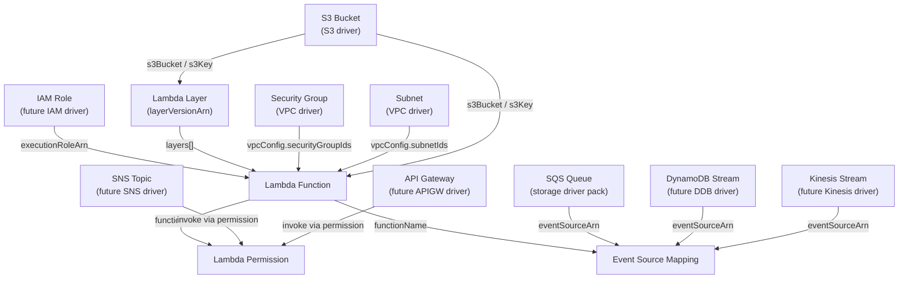

# Lambda Driver Pack — Overview

---

## Table of Contents

1. [Driver Summary](#1-driver-summary)
2. [Relationships & Dependencies](#2-relationships--dependencies)
3. [Runtime Packs](#3-runtime-packs)
4. [Shared Infrastructure](#4-shared-infrastructure)
5. [Implementation Order](#5-implementation-order)
6. [Docker Compose Topology](#6-docker-compose-topology)
7. [Justfile Targets](#7-justfile-targets)
8. [Registry Integration](#8-registry-integration)
9. [Cross-Driver References](#9-cross-driver-references)
10. [Common Patterns](#10-common-patterns)
11. [Checklist](#11-checklist)

---

## 1. Driver Summary

| Driver | Kind | Key | Key Scope | Mutable | Tags | Plan Doc |
|---|---|---|---|---|---|---|
| Lambda Function | `LambdaFunction` | `region~functionName` | `KeyScopeRegion` | code, runtime, handler, memorySize, timeout, environment, layers, vpcConfig, tags | Yes | [LAMBDA_FUNCTION_DRIVER_PLAN.md](LAMBDA_FUNCTION_DRIVER_PLAN.md) |
| Lambda Layer | `LambdaLayer` | `region~layerName` | `KeyScopeRegion` | (new versions only) compatibleRuntimes, description, license | No | [LAMBDA_LAYER_DRIVER_PLAN.md](LAMBDA_LAYER_DRIVER_PLAN.md) |
| Lambda Permission | `LambdaPermission` | `region~functionName~statementId` | `KeyScopeRegion` | None (immutable, replace-only) | No | [LAMBDA_PERMISSION_DRIVER_PLAN.md](LAMBDA_PERMISSION_DRIVER_PLAN.md) |
| Event Source Mapping | `EventSourceMapping` | `region~functionName~eventSourceArn` | `KeyScopeRegion` | batchSize, enabled, filterCriteria, maxBatchingWindow, parallelization, bisectBatch | No | [EVENT_SOURCE_MAPPING_DRIVER_PLAN.md](EVENT_SOURCE_MAPPING_DRIVER_PLAN.md) |

All four drivers use `KeyScopeRegion` — Lambda resources are regional, keys are
prefixed with the region (`<region>~<identifier>`).

---

## 2. Relationships & Dependencies



### Dependency Rules

| From | To | Relationship |
|---|---|---|
| Lambda Function | IAM Role | Function's `role` references an IAM execution role ARN |
| Lambda Function | Lambda Layer | Function's `layers[]` references layer version ARNs |
| Lambda Function | S3 Bucket | Function code can be sourced from an S3 bucket + key |
| Lambda Function | Security Group | Function's `vpcConfig.securityGroupIds[]` references SG IDs |
| Lambda Function | Subnet | Function's `vpcConfig.subnetIds[]` references subnet IDs |
| Lambda Layer | S3 Bucket | Layer code can be sourced from an S3 bucket + key |
| Lambda Permission | Lambda Function | Permission's `functionName` references the function |
| Lambda Permission | External Service | Permission's `principal` and `sourceArn` reference the invoker (SNS, API GW, etc.) |
| Event Source Mapping | Lambda Function | ESM's `functionName` references the target function |
| Event Source Mapping | Event Source | ESM's `eventSourceArn` references SQS, DynamoDB, Kinesis, etc. |

### Ownership Boundaries

- **Lambda Function driver**: Manages the function lifecycle (create, update code,
  update configuration, delete). Does NOT manage permissions, event source mappings,
  aliases, or provisioned concurrency.
- **Lambda Layer driver**: Manages layer version publication and deletion. Layers are
  versioned and immutable per version — "updating" a layer means publishing a new
  version.
- **Lambda Permission driver**: Manages resource-based policy statements on a function.
  Each statement is an individual permission granting an AWS service or account the
  ability to invoke the function.
- **Event Source Mapping driver**: Manages the mapping between an event source (SQS,
  DynamoDB Streams, Kinesis, etc.) and a Lambda function. The ESM polls the source
  and invokes the function.

---

## 3. Runtime Packs

All Lambda drivers are hosted in the **praxis-compute** runtime pack alongside EC2,
AMI, and Key Pair drivers. Lambda is an AWS compute service — grouping it with other
compute drivers is the natural domain alignment.

| Driver | Runtime Pack | Binary | Host Port |
|---|---|---|---|
| Lambda Function | praxis-compute | `cmd/praxis-compute` | 9084 |
| Lambda Layer | praxis-compute | `cmd/praxis-compute` | 9084 |
| Lambda Permission | praxis-compute | `cmd/praxis-compute` | 9084 |
| Event Source Mapping | praxis-compute | `cmd/praxis-compute` | 9084 |

### praxis-compute Entry Point (Updated)

```go
// cmd/praxis-compute/main.go
auth := authservice.NewAuthClient()

srv := server.NewRestate().
    Bind(restate.Reflect(ami.NewAMIDriver(auth))).
    Bind(restate.Reflect(keypair.NewKeyPairDriver(auth))).
    Bind(restate.Reflect(ec2.NewEC2InstanceDriver(auth))).
    Bind(restate.Reflect(ecrrepo.NewECRRepositoryDriver(auth))).
    Bind(restate.Reflect(ecrpolicy.NewECRLifecyclePolicyDriver(auth))).
    // Lambda drivers
    Bind(restate.Reflect(esm.NewEventSourceMappingDriver(auth))).
    Bind(restate.Reflect(lambda.NewLambdaFunctionDriver(auth))).
    Bind(restate.Reflect(lambdalayer.NewLambdaLayerDriver(auth))).
    Bind(restate.Reflect(lambdaperm.NewLambdaPermissionDriver(auth)))
```

---

## 4. Shared Infrastructure

### AWS Client

All four Lambda drivers use the Lambda API client from `aws-sdk-go-v2/service/lambda`.
Event Source Mappings are a Lambda subsystem — they share the same API surface. A new
`NewLambdaClient(cfg aws.Config) *lambda.Client` factory is added to
`internal/infra/awsclient/client.go`.

The client is created per-account via the auth registry's `GetConfig(account)` method.

### Rate Limiters

Each driver uses its own rate limiter namespace:

| Driver | Namespace | Sustained | Burst |
|---|---|---|---|
| Lambda Function | `lambda-function` | 15 | 10 |
| Lambda Layer | `lambda-layer` | 15 | 10 |
| Lambda Permission | `lambda-permission` | 20 | 10 |
| Event Source Mapping | `lambda-esm` | 15 | 10 |

Lambda API rate limits are more restrictive than EC2. The default sustained rate of
15 req/s per namespace reflects the `GetFunction` and `UpdateFunctionCode` API limits
(typically 15-75 TPS depending on the action). Burst capacity is conservative to
avoid hitting account-level Lambda throttling.

### Error Classifiers

All drivers classify AWS Lambda API errors into:

- **Not found**: `ResourceNotFoundException` — function, layer, or ESM does not exist
- **Already exists**: `ResourceConflictException` — function already exists during create
- **Conflict**: `ResourceConflictException` — function update in progress, ESM state transition
- **Too many requests**: `TooManyRequestsException` — Lambda API throttling
- **Invalid parameter**: `InvalidParameterValueException` — bad input (terminal error)
- **Service exception**: `ServiceException` — Lambda internal error (retryable)

Each driver defines its own classifiers because the relevant subset of errors differs
per resource type.

### Ownership Tags (Lambda Function Only)

Only the Lambda Function driver uses `praxis:managed-key` ownership tags. AWS Lambda
function names are unique within a region+account, but the tag provides an additional
safety net for conflict detection across Praxis installations:

- **Lambda Function**: `praxis:managed-key=<region~functionName>` tag on the function.
- **Lambda Layer**: Layer names are unique per account+region. AWS rejects duplicates
  on `PublishLayerVersion` if the layer name is already taken by another account (but
  within the same account, versions stack). No ownership tag needed.
- **Lambda Permission**: Statement IDs are unique per function. No tags available
  (permissions are policy statements, not taggable resources).
- **Event Source Mapping**: UUIDs assigned by AWS. No ownership tag needed — the driver
  discovers existing mappings by function+sourceArn combination.

---

## 5. Implementation Order

The drivers were implemented in this order, respecting dependencies:

### Phase 1: Foundation (no cross-driver dependencies within Lambda)

1. **Lambda Layer** — Standalone versioned artifact. No dependencies on other Lambda
   resources. Simple publish/delete lifecycle.

### Phase 2: Core Function

2. **Lambda Function** — References IAM roles (external), S3 buckets (external), VPC
   resources (external), and optionally Lambda layers. Most complex Lambda driver.
   Core of the Lambda ecosystem.

### Phase 3: Function Extensions

3. **Lambda Permission** — References a Lambda function. Simple add/remove lifecycle.
   Enables event-driven architectures (SNS → Lambda, API Gateway → Lambda).

4. **Event Source Mapping** — References a Lambda function and an event source (SQS,
   DynamoDB, Kinesis). More complex state machine (creating → enabled/disabled → deleting).

---

## 6. Docker Compose Topology

Lambda drivers are hosted in the existing praxis-compute service:

```yaml
# praxis-compute hosts EC2 Instance, AMI, Key Pair, and all Lambda drivers
praxis-compute:
  build:
    context: .
    dockerfile: cmd/praxis-compute/Dockerfile
  ports:
    - "9084:9080"
  environment:
    - AWS_ENDPOINT_URL=http://localstack:4566
    - AWS_ACCESS_KEY_ID=test
    - AWS_SECRET_ACCESS_KEY=test
    - AWS_REGION=us-east-1
```

All Lambda drivers use the same Dockerfile pattern: `golang:1.25-alpine` multi-stage
build with `distroless/static-debian12:nonroot` runtime image.

---

## 7. Justfile Targets

### Unit Tests

```just
test-lambda:            go test ./internal/drivers/lambda/...            -v -count=1 -race
test-lambda-layer:      go test ./internal/drivers/lambdalayer/...       -v -count=1 -race
test-lambda-permission: go test ./internal/drivers/lambdaperm/...        -v -count=1 -race
test-esm:               go test ./internal/drivers/esm/...               -v -count=1 -race
```

### Integration Tests

```just
test-lambda-integration:              -run TestLambdaFunction    -timeout=5m
test-lambda-layer-integration:        -run TestLambdaLayer       -timeout=3m
test-lambda-permission-integration:   -run TestLambdaPermission  -timeout=3m
test-esm-integration:                 -run TestEventSourceMapping -timeout=5m
```

### Build

```just
build-compute:  # included in `build` target (already exists for EC2/AMI/KeyPair)
    go build -o bin/praxis-compute ./cmd/praxis-compute
```

---

## 8. Registry Integration

All four adapters are registered in `internal/core/provider/registry.go`:

```go
func NewRegistry() *Registry {
    accounts := auth.LoadFromEnv()
    return NewRegistryWithAdapters(
        // ... existing adapters ...
        NewLambdaFunctionAdapterWithRegistry(accounts),
        NewLambdaLayerAdapterWithRegistry(accounts),
        NewLambdaPermissionAdapterWithRegistry(accounts),
        NewEventSourceMappingAdapterWithRegistry(accounts),
        // ...
    )
}
```

### Adapter Files

| Driver | Adapter File |
|---|---|
| Lambda Function | `internal/core/provider/lambda_adapter.go` |
| Lambda Layer | `internal/core/provider/lambdalayer_adapter.go` |
| Lambda Permission | `internal/core/provider/lambdaperm_adapter.go` |
| Event Source Mapping | `internal/core/provider/esm_adapter.go` |

---

## 9. Cross-Driver References

In Praxis templates, Lambda resources reference each other and external resources via
output expressions:

### Lambda Layer → Lambda Function

```cue
resources: {
    "utils-layer": {
        kind: "LambdaLayer"
        spec: {
            layerName: "utils"
            region: "us-east-1"
            code: s3: {
                bucket: "${resources.code-bucket.outputs.bucketName}"
                key: "layers/utils.zip"
            }
            compatibleRuntimes: ["python3.12", "python3.13"]
        }
    }
    "api-handler": {
        kind: "LambdaFunction"
        spec: {
            functionName: "api-handler"
            region: "us-east-1"
            role: "${resources.lambda-role.outputs.arn}"
            runtime: "python3.12"
            handler: "main.handler"
            code: s3: {
                bucket: "${resources.code-bucket.outputs.bucketName}"
                key: "functions/api-handler.zip"
            }
            layers: ["${resources.utils-layer.outputs.layerVersionArn}"]
        }
    }
}
```

### Lambda Function → Lambda Permission

```cue
resources: {
    "api-handler": {
        kind: "LambdaFunction"
        spec: {
            functionName: "api-handler"
            // ...
        }
    }
    "allow-apigw-invoke": {
        kind: "LambdaPermission"
        spec: {
            functionName: "${resources.api-handler.outputs.functionName}"
            statementId: "AllowAPIGatewayInvoke"
            action: "lambda:InvokeFunction"
            principal: "apigateway.amazonaws.com"
            sourceArn: "arn:aws:execute-api:us-east-1:123456789012:abc123/*"
        }
    }
}
```

### Lambda Function → Event Source Mapping

```cue
resources: {
    "api-handler": {
        kind: "LambdaFunction"
        spec: {
            functionName: "api-handler"
            // ...
        }
    }
    "queue-trigger": {
        kind: "EventSourceMapping"
        spec: {
            functionName: "${resources.api-handler.outputs.functionArn}"
            eventSourceArn: "${resources.request-queue.outputs.queueArn}"
            batchSize: 10
            enabled: true
        }
    }
}
```

### Cross-Pack References (VPC → Lambda Function)

```cue
resources: {
    "app-subnet-a": {
        kind: "Subnet"
        spec: {
            vpcId: "${resources.main-vpc.outputs.vpcId}"
            cidrBlock: "10.0.1.0/24"
        }
    }
    "app-sg": {
        kind: "SecurityGroup"
        spec: {
            vpcId: "${resources.main-vpc.outputs.vpcId}"
            groupName: "lambda-sg"
        }
    }
    "api-handler": {
        kind: "LambdaFunction"
        spec: {
            functionName: "api-handler"
            vpcConfig: {
                subnetIds: [
                    "${resources.app-subnet-a.outputs.subnetId}",
                    "${resources.app-subnet-b.outputs.subnetId}"
                ]
                securityGroupIds: ["${resources.app-sg.outputs.groupId}"]
            }
            // ...
        }
    }
}
```

The DAG resolver handles dependency ordering automatically based on these expression
references.

---

## 10. Common Patterns

### All Lambda Drivers Share

- **`KeyScopeRegion`** — All Lambda resources are regional; keys follow `<region>~<identifier>`
- **Lambda API client** — All four drivers share the `aws-sdk-go-v2/service/lambda` package
- **`ResourceNotFoundException`** → not-found classification across all drivers
- **`TooManyRequestsException`** → rate limit / throttle handling across all drivers
- **Separate rate limiter namespaces** — Per-driver token buckets

### Driver-Specific Patterns

| Driver | Notable Pattern |
|---|---|
| Lambda Function | Code update + config update are separate API calls; must wait for `LastUpdateStatus: Successful` between them |
| Lambda Layer | Versioned and immutable per version; "update" means publish new version; cannot modify existing versions |
| Lambda Permission | Immutable statements; "update" requires remove + add; statement ID is the identity |
| Event Source Mapping | AWS-assigned UUID; state machine (Creating → Enabled/Disabled → Deleting → Deleted); polling-based event delivery |

### Driver Complexity Ranking

| Driver | Complexity | Reason |
|---|---|---|
| Lambda Permission | Low | Simple add/remove, no mutable attributes, no sub-resources |
| Lambda Layer | Low–Medium | Versioned publish model, version cleanup considerations, S3-sourced code |
| Event Source Mapping | Medium | State machine lifecycle, multiple event source types with different configurations |
| Lambda Function | High | Code + config dual update path, async update status, VPC attachment latency, layer references, environment encryption |

---

## 11. Checklist

### Schemas

- [ ] `schemas/aws/lambda/function.cue`
- [ ] `schemas/aws/lambda/layer.cue`
- [ ] `schemas/aws/lambda/permission.cue`
- [ ] `schemas/aws/lambda/event_source_mapping.cue`

### Drivers (per driver: types + aws + drift + driver)

- [ ] `internal/drivers/lambda/`
- [ ] `internal/drivers/lambdalayer/`
- [ ] `internal/drivers/lambdaperm/`
- [ ] `internal/drivers/esm/`

### Adapters

- [ ] `internal/core/provider/lambda_adapter.go`
- [ ] `internal/core/provider/lambdalayer_adapter.go`
- [ ] `internal/core/provider/lambdaperm_adapter.go`
- [ ] `internal/core/provider/esm_adapter.go`

### Registry

- [ ] All 4 adapters registered in `NewRegistry()`

### Tests

- [ ] Unit tests for all 4 drivers
- [ ] Integration tests for all 4 drivers

### Infrastructure

- [ ] `internal/infra/awsclient/client.go` — Add `NewLambdaClient()`
- [ ] `cmd/praxis-compute/main.go` — Bind all 4 Lambda drivers
- [ ] `docker-compose.yaml` — No changes needed (praxis-compute already exposed)
- [ ] `justfile` — Add Lambda test targets

### Documentation

- [ ] [LAMBDA_FUNCTION_DRIVER_PLAN.md](LAMBDA_FUNCTION_DRIVER_PLAN.md)
- [ ] [LAMBDA_LAYER_DRIVER_PLAN.md](LAMBDA_LAYER_DRIVER_PLAN.md)
- [ ] [LAMBDA_PERMISSION_DRIVER_PLAN.md](LAMBDA_PERMISSION_DRIVER_PLAN.md)
- [ ] [EVENT_SOURCE_MAPPING_DRIVER_PLAN.md](EVENT_SOURCE_MAPPING_DRIVER_PLAN.md)
- [x] This overview document
