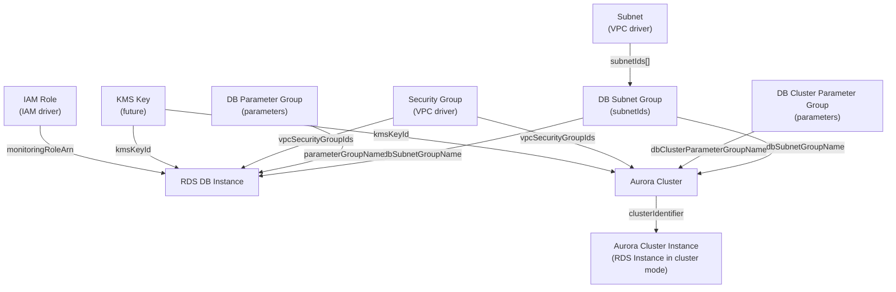

# RDS Driver Pack — Overview

> **Implementation note:** This plan originally proposed a standalone `praxis-database`
> driver pack on port 9086. The actual implementation places all four RDS drivers in
> the existing **`praxis-storage`** pack (`cmd/praxis-storage/`). References to
> `praxis-database`, `cmd/praxis-database/`, and port 9086 below reflect the original
> plan; the canonical source of truth is `cmd/praxis-storage/main.go`.

> This document summarizes the RDS driver family for Praxis: four drivers covering
> RDS DB Instances, Aurora Clusters, DB Parameter Groups, and DB Subnet Groups. It
> describes their relationships, shared infrastructure, implementation order, and the
> new `praxis-database` driver pack.

---

## Table of Contents

1. [Driver Summary](#1-driver-summary)
2. [Relationships & Dependencies](#2-relationships--dependencies)
3. [Driver Pack: praxis-database](#3-driver-pack-praxis-database)
4. [Shared Infrastructure](#4-shared-infrastructure)
5. [Implementation Order](#5-implementation-order)
6. [go.mod Changes](#6-gomod-changes)
7. [Docker Compose Changes](#7-docker-compose-changes)
8. [Justfile Changes](#8-justfile-changes)
9. [Registry Integration](#9-registry-integration)
10. [Cross-Driver References](#10-cross-driver-references)
11. [Common Patterns](#11-common-patterns)
12. [Checklist](#12-checklist)

---

## 1. Driver Summary

| Driver | Kind | Key | Key Scope | Mutable | Tags | Plan Doc |
|---|---|---|---|---|---|---|
| RDS DB Instance | `RDSInstance` | `region~dbIdentifier` | `KeyScopeRegion` | instanceClass, allocatedStorage, engineVersion, masterUserPassword, parameterGroupName, optionGroupName, backupRetentionPeriod, multiAZ, publiclyAccessible, storageType, iops, tags | Yes | [RDS_INSTANCE_DRIVER_PLAN.md](RDS_INSTANCE_DRIVER_PLAN.md) |
| Aurora Cluster | `AuroraCluster` | `region~clusterIdentifier` | `KeyScopeRegion` | engineVersion, masterUserPassword, backupRetentionPeriod, preferredBackupWindow, preferredMaintenanceWindow, dbClusterParameterGroupName, deletionProtection, tags | Yes | [AURORA_CLUSTER_DRIVER_PLAN.md](AURORA_CLUSTER_DRIVER_PLAN.md) |
| DB Parameter Group | `DBParameterGroup` | `region~groupName` | `KeyScopeRegion` | parameters, tags | Yes | [DB_PARAMETER_GROUP_DRIVER_PLAN.md](DB_PARAMETER_GROUP_DRIVER_PLAN.md) |
| DB Subnet Group | `DBSubnetGroup` | `region~groupName` | `KeyScopeRegion` | subnetIds, tags | Yes | [DB_SUBNET_GROUP_DRIVER_PLAN.md](DB_SUBNET_GROUP_DRIVER_PLAN.md) |

All four drivers use `KeyScopeRegion` — RDS resources are regional, keys are
prefixed with the region (`<region>~<name>`).

---

## 2. Relationships & Dependencies



### Dependency Rules

| From | To | Relationship |
|---|---|---|
| RDS DB Instance | DB Subnet Group | Instance's `dbSubnetGroupName` references a subnet group |
| RDS DB Instance | DB Parameter Group | Instance's `parameterGroupName` references a parameter group |
| RDS DB Instance | Security Group | Instance's `vpcSecurityGroupIds[]` references SG IDs (VPC driver) |
| RDS DB Instance | IAM Role | Instance's `monitoringRoleArn` references an IAM role (IAM driver) |
| Aurora Cluster | DB Subnet Group | Cluster's `dbSubnetGroupName` references a subnet group |
| Aurora Cluster | DB Parameter Group | Cluster's `dbClusterParameterGroupName` references a cluster parameter group |
| Aurora Cluster | Security Group | Cluster's `vpcSecurityGroupIds[]` references SG IDs (VPC driver) |
| Aurora Cluster Instance | Aurora Cluster | Cluster instance's `dbClusterIdentifier` references the cluster |
| DB Subnet Group | Subnet | Subnet group's `subnetIds[]` references VPC subnets (VPC driver) |

### Ownership Boundaries

- **RDS DB Instance driver**: Manages the DB instance lifecycle (create, modify,
  delete, reboot). Does NOT manage snapshots, read replicas, or Aurora cluster
  instances (those are created via the instance driver with `dbClusterIdentifier`).
- **Aurora Cluster driver**: Manages the Aurora cluster lifecycle (create, modify,
  delete). Does NOT manage cluster instances — those are created as RDS instances
  with `dbClusterIdentifier` set. Does NOT manage global clusters.
- **DB Parameter Group driver**: Manages parameter group lifecycle and parameter
  values. Does NOT manage cluster parameter groups (those are a separate RDS
  resource type but share the same driver pattern and interface).
- **DB Subnet Group driver**: Manages subnet group lifecycle and subnet membership.
  Does NOT manage the underlying subnets (those are VPC driver resources).

---

## 3. Driver Pack: praxis-database

### New Entry Point

**File**: `cmd/praxis-database/main.go`

```go
package main

import (
    "context"
    "log/slog"
    "os"

    restate "github.com/restatedev/sdk-go"
    server "github.com/restatedev/sdk-go/server"

    "github.com/shirvan/praxis/internal/core/config"
    "github.com/shirvan/praxis/internal/drivers/rdsinstance"
    "github.com/shirvan/praxis/internal/drivers/auroracluster"
    "github.com/shirvan/praxis/internal/drivers/dbparametergroup"
    "github.com/shirvan/praxis/internal/drivers/dbsubnetgroup"
)

func main() {
    cfg := config.Load()

    srv := server.NewRestate().
        Bind(restate.Reflect(rdsinstance.NewRDSInstanceDriver(cfg.Auth()))).
        Bind(restate.Reflect(auroracluster.NewAuroraClusterDriver(cfg.Auth()))).
        Bind(restate.Reflect(dbparametergroup.NewDBParameterGroupDriver(cfg.Auth()))).
        Bind(restate.Reflect(dbsubnetgroup.NewDBSubnetGroupDriver(cfg.Auth())))

    if err := srv.Start(context.Background(), cfg.ListenAddr); err != nil {
        slog.Error("praxis-database exited unexpectedly", "err", err.Error())
        os.Exit(1)
    }
}
```

### Dockerfile

**File**: `cmd/praxis-database/Dockerfile`

Follows same pattern as existing driver packs.

```dockerfile
FROM golang:1.25-alpine AS build
WORKDIR /src
COPY go.mod go.sum ./
RUN go mod download
COPY . .
RUN CGO_ENABLED=0 go build -o /praxis-database ./cmd/praxis-database

FROM gcr.io/distroless/static-debian12:nonroot
COPY --from=build /praxis-database /praxis-database
ENTRYPOINT ["/praxis-database"]
```

### Port: 9086

| Pack | Port |
|---|---|
| praxis-storage | 9081 |
| praxis-network | 9082 |
| praxis-core | 9083 |
| praxis-compute | 9084 |
| praxis-identity | 9085 |
| **praxis-database** | **9086** |

---

## 4. Shared Infrastructure

### RDS Client

All four drivers share the same `rds.Client` from `aws-sdk-go-v2/service/rds`. The
client is created per-account via the auth registry's `GetConfig(account)` method.

A new factory function is needed in `internal/infra/awsclient/client.go`:

```go
func NewRDSClient(cfg aws.Config) *rds.Client {
    return rds.NewFromConfig(cfg)
}
```

### Rate Limiters

All RDS drivers share the same rate limiter namespace:

```go
ratelimit.New("rds", 15, 8)
```

RDS API has relatively conservative rate limits. All 4 drivers in the same process
share a single token bucket, preventing aggregate RDS API throttling.

### Error Classifiers

All four drivers use the same error classification pattern:

```go
func IsNotFound(err error) bool         // DBInstanceNotFound, DBClusterNotFoundFault, etc.
func IsAlreadyExists(err error) bool     // DBInstanceAlreadyExists, DBClusterAlreadyExistsFault, etc.
func IsInvalidState(err error) bool      // InvalidDBInstanceState, InvalidDBClusterStateFault
func IsSnapshotNotFound(err error) bool  // DBSnapshotNotFound
```

Each driver defines its own classifiers because the RDS error codes differ per
resource type (e.g., `DBInstanceNotFoundFault` vs `DBClusterNotFoundFault`).

### Tagging via ARN

Unlike EC2 resources (which use resource IDs for tagging), RDS uses ARNs for tag
operations (`AddTagsToResource`, `RemoveTagsFromResource`, `ListTagsForResource`).
All drivers pass the resource ARN to tag APIs.

---

## 5. Implementation Order

The recommended implementation order respects dependencies and allows incremental
testing:

### Phase 1: Foundation (no cross-RDS dependencies)

1. **DB Subnet Group** — No dependencies on other RDS resources. References VPC
   subnets (external dependency). Simple lifecycle. Good for establishing RDS
   driver patterns (API client, error classifiers, tag management).

2. **DB Parameter Group** — No dependencies on other RDS resources. Manages a
   parameter set. Complex parameter reset semantics but isolated lifecycle.

### Phase 2: Core Resources

3. **RDS DB Instance** — References subnet groups and parameter groups. Most
   commonly used RDS resource. Long provisioning time (5–15 min). Significant
   mutable state. Should be implemented after its dependencies are testable.

### Phase 3: Aurora

4. **Aurora Cluster** — References subnet groups and cluster parameter groups.
   More complex lifecycle (cluster + instances). Should be implemented last
   so all foundation drivers and patterns are established.

### Dependency Test Order

```
DB Subnet Group → DB Parameter Group → RDS DB Instance → Aurora Cluster
```

---

## 6. go.mod Changes

Add the RDS SDK package:

```
github.com/aws/aws-sdk-go-v2/service/rds v1.x.x
```

Run:
```bash
go get github.com/aws/aws-sdk-go-v2/service/rds
go mod tidy
```

---

## 7. Docker Compose Changes

**File**: `docker-compose.yaml` — add the `praxis-database` service:

```yaml
  praxis-database:
    build:
      context: .
      dockerfile: cmd/praxis-database/Dockerfile
    container_name: praxis-database
    env_file:
      - .env
    depends_on:
      restate:
        condition: service_healthy
      localstack-init:
        condition: service_completed_successfully
    ports:
      - "9086:9080"
    environment:
      - PRAXIS_LISTEN_ADDR=0.0.0.0:9080
```

Update the Restate service's registration to include `praxis-database:9080`.

### Restate Registration

```bash
curl -s -X POST http://localhost:9070/deployments \
  -H 'content-type: application/json' \
  -d '{"uri": "http://praxis-database:9080"}'
```

All four services are discovered automatically from the single registration endpoint
via Restate's reflection-based service discovery.

---

## 8. Justfile Changes

Add targets for the new driver pack and individual drivers:

```just
# Database driver pack
build-database:
    go build ./cmd/praxis-database/...

test-database:
    go test ./internal/drivers/rdsinstance/... ./internal/drivers/auroracluster/... \
            ./internal/drivers/dbparametergroup/... ./internal/drivers/dbsubnetgroup/... \
            -v -count=1 -race

test-database-integration:
    go test ./tests/integration/ -run "TestRDSInstance|TestAuroraCluster|TestDBParameterGroup|TestDBSubnetGroup" \
            -v -count=1 -tags=integration -timeout=20m

# Individual driver targets
test-rdsinstance:
    go test ./internal/drivers/rdsinstance/... -v -count=1 -race

test-auroracluster:
    go test ./internal/drivers/auroracluster/... -v -count=1 -race

test-dbparametergroup:
    go test ./internal/drivers/dbparametergroup/... -v -count=1 -race

test-dbsubnetgroup:
    go test ./internal/drivers/dbsubnetgroup/... -v -count=1 -race

logs-database:
    docker compose logs -f praxis-database
```

---

## 9. Registry Integration

**File**: `internal/core/provider/registry.go`

Add all four adapters to `NewRegistry()`:

```go
func NewRegistry() *Registry {
    accounts := auth.LoadFromEnv()
    return NewRegistryWithAdapters(
        // ... existing adapters ...

        // RDS / Database drivers
        NewRDSInstanceAdapterWithRegistry(accounts),
        NewAuroraClusterAdapterWithRegistry(accounts),
        NewDBParameterGroupAdapterWithRegistry(accounts),
        NewDBSubnetGroupAdapterWithRegistry(accounts),
    )
}
```

### Adapter Files

| Driver | Adapter File |
|---|---|
| RDS DB Instance | `internal/core/provider/rdsinstance_adapter.go` |
| Aurora Cluster | `internal/core/provider/auroracluster_adapter.go` |
| DB Parameter Group | `internal/core/provider/dbparametergroup_adapter.go` |
| DB Subnet Group | `internal/core/provider/dbsubnetgroup_adapter.go` |

---

## 10. Cross-Driver References

In Praxis templates, RDS resources reference each other via output expressions:

### Full RDS Stack

```cue
resources: {
    "db-subnet-group": {
        kind: "DBSubnetGroup"
        spec: {
            region: "us-east-1"
            groupName: "myapp-db-subnets"
            description: "Subnets for myapp database"
            subnetIds: [
                "${resources.private-subnet-a.outputs.subnetId}",
                "${resources.private-subnet-b.outputs.subnetId}",
            ]
        }
    }
    "db-params": {
        kind: "DBParameterGroup"
        spec: {
            region: "us-east-1"
            groupName: "myapp-postgres16"
            family: "postgres16"
            description: "Parameters for myapp PostgreSQL"
            parameters: {
                "max_connections": "200"
                "shared_buffers": "{DBInstanceClassMemory/4}"
                "log_statement": "all"
            }
        }
    }
    "db-sg": {
        kind: "SecurityGroup"
        spec: {
            vpcId: "${resources.main-vpc.outputs.vpcId}"
            groupName: "myapp-db-sg"
            description: "Allow PostgreSQL from app tier"
            ingressRules: [{
                protocol: "tcp"
                fromPort: 5432
                toPort: 5432
                cidrBlock: "10.0.0.0/16"
            }]
        }
    }
    "myapp-db": {
        kind: "RDSInstance"
        spec: {
            region: "us-east-1"
            dbIdentifier: "myapp-db"
            engine: "postgres"
            engineVersion: "16.4"
            instanceClass: "db.t3.medium"
            allocatedStorage: 50
            masterUsername: "admin"
            masterUserPassword: "ssm:///myapp/db-password"
            dbSubnetGroupName: "${resources.db-subnet-group.outputs.groupName}"
            parameterGroupName: "${resources.db-params.outputs.groupName}"
            vpcSecurityGroupIds: ["${resources.db-sg.outputs.groupId}"]
            multiAZ: true
            storageEncrypted: true
            backupRetentionPeriod: 7
        }
    }
}
```

### Aurora Cluster with Instances

```cue
resources: {
    "aurora-cluster": {
        kind: "AuroraCluster"
        spec: {
            region: "us-east-1"
            clusterIdentifier: "myapp-aurora"
            engine: "aurora-postgresql"
            engineVersion: "16.4"
            masterUsername: "admin"
            masterUserPassword: "ssm:///myapp/aurora-password"
            dbSubnetGroupName: "${resources.db-subnet-group.outputs.groupName}"
            vpcSecurityGroupIds: ["${resources.db-sg.outputs.groupId}"]
            deletionProtection: true
        }
    }
    "aurora-instance-1": {
        kind: "RDSInstance"
        spec: {
            region: "us-east-1"
            dbIdentifier: "myapp-aurora-1"
            engine: "aurora-postgresql"
            instanceClass: "db.r6g.large"
            dbClusterIdentifier: "${resources.aurora-cluster.outputs.clusterIdentifier}"
        }
    }
    "aurora-instance-2": {
        kind: "RDSInstance"
        spec: {
            region: "us-east-1"
            dbIdentifier: "myapp-aurora-2"
            engine: "aurora-postgresql"
            instanceClass: "db.r6g.large"
            dbClusterIdentifier: "${resources.aurora-cluster.outputs.clusterIdentifier}"
        }
    }
}
```

The DAG resolver handles dependency ordering automatically based on these expression
references.

---

## 11. Common Patterns

### All RDS Drivers Share

- **`KeyScopeRegion`** — All RDS resources are regional; keys follow `<region>~<name>`
- **RDS API client** — All four drivers share `aws-sdk-go-v2/service/rds`
- **Rate limiter namespace `"rds"`** — All share the same token bucket
- **ARN-based tagging** — Use `AddTagsToResource` / `RemoveTagsFromResource` with resource ARN
- **Import defaults to `ModeObserved`** — RDS resources are high-value; don't mutate on import
- **Pre-deletion cleanup** — Disable deletion protection, remove from cluster before delete
- **Long provisioning times** — DB instances: 5–15 min; Aurora clusters: 5–10 min. Drivers
  use waiters for state transitions wrapped in `restate.Run` for durable journaling
- **Identifier uniqueness** — DB identifiers are unique per region per account. `CreateDB*`
  returns `DBInstanceAlreadyExists` / `DBClusterAlreadyExistsFault` for duplicates, which
  eliminates the need for `praxis:managed-key` ownership tags

### Waiter Pattern

RDS resources have long creation/modification/deletion times. The drivers use RDS
waiters (`rds.NewDBInstanceAvailableWaiter`, etc.) to poll for completion:

```go
waiter := rds.NewDBInstanceAvailableWaiter(client)
err := waiter.Wait(ctx, &rds.DescribeDBInstancesInput{
    DBInstanceIdentifier: aws.String(dbIdentifier),
}, 20*time.Minute)
```

All waiter calls are wrapped in `restate.Run` for durable journaling. If the process
restarts, the journaled result is replayed without re-waiting.

### Driver-Specific Patterns

| Driver | Notable Pattern |
|---|---|
| RDS DB Instance | Long provisioning (5–15 min); stop/start for non-Aurora; pending-reboot for parameter changes; storage autoscaling |
| Aurora Cluster | Cluster + instances model; cluster instances are separate RDS instances; global clusters out of scope |
| DB Parameter Group | Apply-method semantics (immediate vs pending-reboot); reset-to-default for removed params |
| DB Subnet Group | Simple CRUD; cross-AZ subnet validation; dependency from instances/clusters |

### Driver Complexity Ranking

| Driver | Complexity | Reason |
|---|---|---|
| DB Subnet Group | Low | Simple CRUD; subnet membership only |
| DB Parameter Group | Medium | Parameter apply semantics; reset-to-default; family validation |
| RDS DB Instance | Very High | Long provisioning; many mutable fields; stop/start; storage constraints; multi-AZ failover |
| Aurora Cluster | Very High | Cluster + instance model; engine-specific constraints; deletion protection; failover |

---

## 12. Checklist

### Infrastructure
- [x] `go get github.com/aws/aws-sdk-go-v2/service/rds` added
- [x] `cmd/praxis-database/main.go` created
- [x] `cmd/praxis-database/Dockerfile` created
- [x] `docker-compose.yaml` updated with `praxis-database` service
- [x] `justfile` updated with database targets

### Schemas
- [x] `schemas/aws/rds/instance.cue`
- [x] `schemas/aws/rds/aurora_cluster.cue`
- [x] `schemas/aws/rds/parameter_group.cue`
- [x] `schemas/aws/rds/subnet_group.cue`

### Drivers (per driver: types + aws + drift + driver)
- [x] `internal/drivers/rdsinstance/`
- [x] `internal/drivers/auroracluster/`
- [x] `internal/drivers/dbparametergroup/`
- [x] `internal/drivers/dbsubnetgroup/`

### Adapters
- [x] `internal/core/provider/rdsinstance_adapter.go`
- [x] `internal/core/provider/auroracluster_adapter.go`
- [x] `internal/core/provider/dbparametergroup_adapter.go`
- [x] `internal/core/provider/dbsubnetgroup_adapter.go`

### Registry
- [x] All 4 adapters registered in `NewRegistry()`

### Tests
- [x] Unit tests for all 4 drivers
- [x] Integration tests for all 4 drivers
- [ ] Cross-driver integration test (SubnetGroup → ParameterGroup → Instance → Aurora)

### Documentation
- [x] [RDS_INSTANCE_DRIVER_PLAN.md](RDS_INSTANCE_DRIVER_PLAN.md)
- [x] [AURORA_CLUSTER_DRIVER_PLAN.md](AURORA_CLUSTER_DRIVER_PLAN.md)
- [x] [DB_PARAMETER_GROUP_DRIVER_PLAN.md](DB_PARAMETER_GROUP_DRIVER_PLAN.md)
- [x] [DB_SUBNET_GROUP_DRIVER_PLAN.md](DB_SUBNET_GROUP_DRIVER_PLAN.md)
- [x] This overview document
