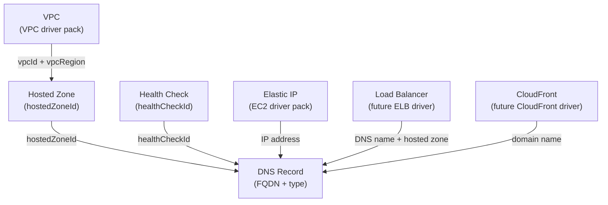

# Route 53 Driver Pack — Overview

---

## Table of Contents

1. [Driver Summary](#1-driver-summary)
2. [Relationships & Dependencies](#2-relationships--dependencies)
3. [Driver Pack: praxis-network](#3-driver-pack-praxis-network)
4. [Shared Infrastructure](#4-shared-infrastructure)
5. [Implementation Order](#5-implementation-order)
6. [go.mod Changes](#6-gomod-changes)
7. [Docker Compose Changes](#7-docker-compose-changes)
8. [Justfile Changes](#8-justfile-changes)
9. [Registry Integration](#9-registry-integration)
10. [Cross-Driver References](#10-cross-driver-references)
11. [Common Patterns](#11-common-patterns)
12. [Checklist](#12-checklist)

---

## 1. Driver Summary

| Driver | Kind | Key | Key Scope | Mutable | Tags | Plan Doc |
|---|---|---|---|---|---|---|
| Hosted Zone | `Route53HostedZone` | `zoneName` | `KeyScopeGlobal` | comment, vpc associations (private zones), tags | Yes | [HOSTED_ZONE_DRIVER_PLAN.md](HOSTED_ZONE_DRIVER_PLAN.md) |
| DNS Record | `Route53Record` | `hostedZoneId~recordFQDN~recordType` | `KeyScopeCustom` | ttl, resource records, alias target, routing policy weights/regions, health check association | No | [DNS_RECORD_DRIVER_PLAN.md](DNS_RECORD_DRIVER_PLAN.md) |
| Health Check | `Route53HealthCheck` | `healthCheckName` | `KeyScopeGlobal` | ipAddress, port, resourcePath, fqdn, searchString, failureThreshold, requestInterval, regions, tags | Yes | [HEALTH_CHECK_DRIVER_PLAN.md](HEALTH_CHECK_DRIVER_PLAN.md) |

Route 53 is a global AWS service. Hosted zones and health checks use
`KeyScopeGlobal` — names are unique per account (enforced by caller reference or
tag-based ownership). DNS records use `KeyScopeCustom` because their identity is
the combination of hosted zone ID, fully-qualified domain name, and record type.

---

## 2. Relationships & Dependencies



### Dependency Rules

| From | To | Relationship |
|---|---|---|
| DNS Record | Hosted Zone | Record's `hostedZoneId` references a hosted zone |
| DNS Record | Health Check | Record's `healthCheckId` references a health check (optional) |
| Hosted Zone (private) | VPC | Private zone's `vpcs[]` references VPC IDs and regions |
| DNS Record (A/AAAA) | Elastic IP | Record's value may reference an EIP address |
| DNS Record (alias) | ELB | Alias record targets an ELB DNS name and hosted zone ID |
| DNS Record (alias) | CloudFront | Alias record targets a CloudFront distribution domain |
| DNS Record (alias) | S3 | Alias record targets an S3 website endpoint |

### Ownership Boundaries

- **Hosted Zone driver**: Manages the hosted zone resource, its comment/description,
  VPC associations (for private zones), and tags. Does NOT manage DNS records within
  the zone — that's the DNS Record driver's responsibility.
- **DNS Record driver**: Manages individual DNS record sets within a hosted zone.
  Handles standard records (A, AAAA, CNAME, MX, TXT, etc.) and alias records.
  Supports routing policies (simple, weighted, latency, failover, geolocation,
  multivalue). Does NOT manage the hosted zone itself.
- **Health Check driver**: Manages health check resources — endpoint health checks
  (HTTP, HTTPS, TCP), calculated health checks, and CloudWatch alarm-based checks.
  Does NOT manage the association of health checks to DNS records (that's a property
  of the DNS Record driver).

---

## 3. Driver Pack: praxis-network

All three Route 53 drivers are registered in the **`praxis-network`** pack
alongside VPC, SG, EIP, subnet, and other network drivers.

### Entry Point

**File**: `cmd/praxis-network/main.go` (excerpt — Route 53 bindings)

```go
auth := authservice.NewAuthClient()

rp := config.DefaultRetryPolicy()
srv := server.NewRestate().
    // ... other network drivers ...
    Bind(restate.Reflect(route53zone.NewHostedZoneDriver(auth), rp)).
    Bind(restate.Reflect(route53record.NewDNSRecordDriver(auth), rp)).
    Bind(restate.Reflect(route53healthcheck.NewHealthCheckDriver(auth), rp))
```

Constructor signature for all three drivers:

```go
func NewHostedZoneDriver(auth authservice.AuthClient) *HostedZoneDriver
func NewDNSRecordDriver(auth authservice.AuthClient) *RecordDriver
func NewHealthCheckDriver(auth authservice.AuthClient) *HealthCheckDriver
```

### Port: 9082 (shared with praxis-network)

| Pack | Port |
|---|---|
| praxis-storage | 9081 |
| **praxis-network** | **9082** |
| praxis-core | 9083 |
| praxis-compute | 9084 |
| praxis-identity | 9085 |

---

## 4. Shared Infrastructure

### Route 53 Client

All three drivers use the Route 53 API client from `aws-sdk-go-v2/service/route53`.
Route 53 is a standalone AWS service with its own SDK client — it does not share the
EC2 or IAM API surface.

The client is created per-account via the auth registry's `GetConfig(account)` method.

```go
func NewRoute53Client(cfg aws.Config) *route53.Client {
    return route53.NewFromConfig(cfg)
}
```

### Rate Limiter

All Route 53 drivers share the same rate limiter namespace:

```go
ratelimit.New("route53", 5, 3)
```

Route 53 has notably conservative API rate limits (5 requests per second for most
operations). All three drivers share a single token bucket to prevent aggregate
throttling, similar to the IAM pattern.

| Driver | Namespace | Sustained | Burst |
|---|---|---|---|
| Hosted Zone | `route53` | 5 | 3 |
| DNS Record | `route53` | 5 | 3 |
| Health Check | `route53` | 5 | 3 |

### Error Classifiers

All three drivers classify AWS API errors:

```go
func IsNotFound(err error) bool         // NoSuchHostedZone, NoSuchHealthCheck
func IsAlreadyExists(err error) bool    // HostedZoneAlreadyExists, HealthCheckAlreadyExists
func IsConflict(err error) bool         // ConflictingDomainExists, PriorRequestNotComplete
func IsInvalidInput(err error) bool     // InvalidInput, InvalidChangeBatch
```

Each driver defines its own classifiers because error codes differ per resource
type (e.g., `NoSuchHostedZone` vs `NoSuchHealthCheck`). All classifiers include
string fallback for Restate-wrapped panic errors, following the established pattern.

### Caller Reference for Idempotent Creates

Route 53 hosted zones and health checks use a `CallerReference` field — a unique
string that ensures idempotent creation. If a create request with the same caller
reference is sent twice, AWS returns the existing resource instead of creating a
duplicate. The drivers use the Restate Virtual Object key as the caller reference,
ensuring natural idempotency across retries and replays.

### No Ownership Tags for Hosted Zones

Hosted zones are identified by domain name + caller reference. AWS enforces
uniqueness via caller reference — a second `CreateHostedZone` call with the same
caller reference returns the existing zone. This natural conflict signal eliminates
the need for `praxis:managed-key` ownership tags on the zone itself. Health checks
use tag-based ownership (similar to the EC2 pattern) because health check names are
not globally unique.

---

## 5. Implementation Order

The drivers were implemented in this order, respecting dependencies:

### Foundation (no cross-driver dependencies)

1. **Hosted Zone** — Root of all DNS resources. No dependencies on other Route 53
   resources. Implemented first since DNS records reference a hosted zone ID.
   Supports both public and private zones.

2. **Health Check** — Standalone resource with no Route 53 dependencies. Tested
   independently. Supports endpoint checks, calculated checks, and CloudWatch
   alarm checks.

### Records

3. **DNS Record** — References hosted zone (required) and health check (optional).
   Most complex driver due to diverse record types, alias vs standard records, and
   multiple routing policies. Implemented last so both dependencies were available
   for end-to-end testing.

### Dependency Test Order

```text
Hosted Zone (isolated) → Health Check (isolated) → DNS Record (uses Hosted Zone + Health Check)
```

---

## 6. go.mod Changes

Add the Route 53 SDK package:

```text
github.com/aws/aws-sdk-go-v2/service/route53 v1.x.x
```

Run:

```bash
go get github.com/aws/aws-sdk-go-v2/service/route53
go mod tidy
```

---

## 7. Docker Compose Changes

The Route 53 drivers are part of the `praxis-network` service in `docker-compose.yaml`
(port 9082). No additional service entry is needed.

All three Route 53 services are discovered automatically from the `praxis-network`
registration endpoint via Restate's reflection-based service discovery.

---

## 8. Justfile Changes

The Route 53 drivers are built and tested as part of the `praxis-network` pack:

```just
test-route53:
    go test ./internal/drivers/route53zone/... ./internal/drivers/route53record/... \
            ./internal/drivers/route53healthcheck/... \
            -v -count=1 -race

test-route53-integration:
    go test ./tests/integration/ -run "TestRoute53HostedZone|TestRoute53Record|TestRoute53HealthCheck" \
            -v -count=1 -tags=integration -timeout=10m
```

---

## 9. Registry Integration

**File**: `internal/core/provider/registry.go`

Add all three adapters to `NewRegistry()`:

```go
func NewRegistry() *Registry {
    accounts := auth.LoadFromEnv()
    return NewRegistryWithAdapters(
        // ... existing adapters ...

        // Route 53 drivers
        NewRoute53HostedZoneAdapterWithRegistry(accounts),
        NewRoute53RecordAdapterWithRegistry(accounts),
        NewRoute53HealthCheckAdapterWithRegistry(accounts),
    )
}
```

### Adapter Files

| Driver | Adapter File |
|---|---|
| Hosted Zone | `internal/core/provider/route53zone_adapter.go` |
| DNS Record | `internal/core/provider/route53record_adapter.go` |
| Health Check | `internal/core/provider/route53healthcheck_adapter.go` |
---

## 10. Cross-Driver References

In Praxis templates, Route 53 resources reference each other via output expressions:

### Public Hosted Zone with Records

```cue
resources: {
    "main-zone": {
        kind: "Route53HostedZone"
        spec: {
            name: "example.com"
            comment: "Main production zone"
        }
    }
    "web-record": {
        kind: "Route53Record"
        spec: {
            hostedZoneId: "${resources.main-zone.outputs.hostedZoneId}"
            name: "www.example.com"
            type: "A"
            ttl: 300
            resourceRecords: ["${resources.web-server.outputs.publicIp}"]
        }
    }
    "api-record": {
        kind: "Route53Record"
        spec: {
            hostedZoneId: "${resources.main-zone.outputs.hostedZoneId}"
            name: "api.example.com"
            type: "A"
            aliasTarget: {
                hostedZoneId: "${resources.api-alb.outputs.canonicalHostedZoneId}"
                dnsName: "${resources.api-alb.outputs.dnsName}"
                evaluateTargetHealth: true
            }
        }
    }
}
```

### Private Hosted Zone with VPC Association

```cue
resources: {
    "main-vpc": {
        kind: "VPC"
        spec: {
            cidrBlock: "10.0.0.0/16"
            enableDnsHostnames: true
            enableDnsSupport: true
        }
    }
    "private-zone": {
        kind: "Route53HostedZone"
        spec: {
            name: "internal.example.com"
            isPrivate: true
            vpcs: [{
                vpcId: "${resources.main-vpc.outputs.vpcId}"
                vpcRegion: "us-east-1"
            }]
            comment: "Internal service discovery"
        }
    }
    "db-record": {
        kind: "Route53Record"
        spec: {
            hostedZoneId: "${resources.private-zone.outputs.hostedZoneId}"
            name: "db.internal.example.com"
            type: "CNAME"
            ttl: 60
            resourceRecords: ["${resources.rds-instance.outputs.endpoint}"]
        }
    }
}
```

### Health Check with Failover Records

```cue
resources: {
    "primary-health": {
        kind: "Route53HealthCheck"
        spec: {
            type: "HTTPS"
            fqdn: "primary.example.com"
            port: 443
            resourcePath: "/health"
            failureThreshold: 3
            requestInterval: 30
        }
    }
    "primary-record": {
        kind: "Route53Record"
        spec: {
            hostedZoneId: "${resources.main-zone.outputs.hostedZoneId}"
            name: "app.example.com"
            type: "A"
            ttl: 60
            resourceRecords: ["${resources.primary-server.outputs.publicIp}"]
            setIdentifier: "primary"
            failover: "PRIMARY"
            healthCheckId: "${resources.primary-health.outputs.healthCheckId}"
        }
    }
    "secondary-record": {
        kind: "Route53Record"
        spec: {
            hostedZoneId: "${resources.main-zone.outputs.hostedZoneId}"
            name: "app.example.com"
            type: "A"
            ttl: 60
            resourceRecords: ["${resources.secondary-server.outputs.publicIp}"]
            setIdentifier: "secondary"
            failover: "SECONDARY"
        }
    }
}
```

The DAG resolver handles dependency ordering automatically based on these expression
references.

---

## 11. Common Patterns

### All Route 53 Drivers Share

- **Route 53 API client** — `aws-sdk-go-v2/service/route53` for all three drivers
- **Rate limiter namespace `"route53"`** — All three drivers share a single token bucket (5/3)
- **Import defaults to `ModeObserved`** — DNS is critical infrastructure; imported resources are observed, not mutated
- **CallerReference for idempotent creates** — Hosted zones and health checks use VO key as caller reference
- **Error classifiers with string fallback** — Handle Restate-wrapped panic errors

### Record Type Complexity

| Record Type | Complexity | Notes |
|---|---|---|
| A, AAAA | Low | Simple IP-based records |
| CNAME | Low | Single target, cannot coexist with other types at same name |
| MX, TXT, SRV | Medium | Multiple values, quoting rules |
| Alias (A, AAAA) | Medium | AWS-specific, references other AWS resources |
| Weighted/Latency | High | Multiple record sets with same name, requires set identifier |
| Failover | High | Primary/secondary pairing, health check integration |
| Geolocation | High | Country/continent/subdivision routing |
| Multivalue | Medium | Multiple records with health checks |

### Driver Complexity Ranking

| Driver | Complexity | Reason |
|---|---|---|
| Health Check | Medium | Multiple check types (endpoint, calculated, CloudWatch), tag-based ownership |
| Hosted Zone | Medium | Public vs private zones, VPC associations, delegation sets |
| DNS Record | Very High | 10+ record types, alias vs standard, 6 routing policies, change batching |

---

## 12. Checklist

### Infrastructure

- [x] `go get github.com/aws/aws-sdk-go-v2/service/route53` added
- [x] Route 53 drivers bound in `cmd/praxis-network/main.go`
- [x] `docker-compose.yaml` — `praxis-network` service on port 9082
- [x] `justfile` updated with Route 53 targets

### Schemas

- [x] `schemas/aws/route53/hosted_zone.cue`
- [x] `schemas/aws/route53/record.cue`
- [x] `schemas/aws/route53/health_check.cue`

### Drivers (per driver: types + aws + drift + driver)

- [x] `internal/drivers/route53zone/`
- [x] `internal/drivers/route53record/`
- [x] `internal/drivers/route53healthcheck/`

### Adapters

- [x] `internal/core/provider/route53zone_adapter.go`
- [x] `internal/core/provider/route53record_adapter.go`
- [x] `internal/core/provider/route53healthcheck_adapter.go`

### Registry

- [x] All 3 adapters registered in `NewRegistry()`

### Tests

- [x] Unit tests for all 3 drivers
- [x] Integration tests for all 3 drivers
- [x] Cross-driver integration test (Hosted Zone → Health Check → DNS Record)

### Documentation

- [x] [HOSTED_ZONE_DRIVER_PLAN.md](HOSTED_ZONE_DRIVER_PLAN.md)
- [x] [DNS_RECORD_DRIVER_PLAN.md](DNS_RECORD_DRIVER_PLAN.md)
- [x] [HEALTH_CHECK_DRIVER_PLAN.md](HEALTH_CHECK_DRIVER_PLAN.md)
- [x] This overview document
