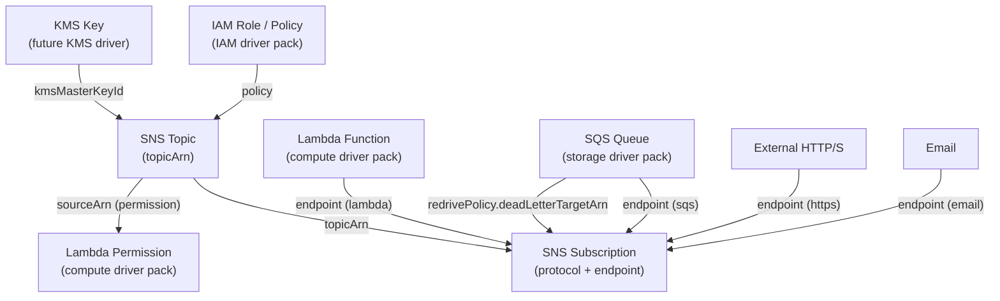

# SNS Driver Pack — Overview

> This document summarizes the SNS driver family for Praxis: two drivers covering
> SNS Topics and SNS Subscriptions. It describes their relationships, shared
> infrastructure, runtime deployment, implementation order, and cross-driver
> references.

---

## Table of Contents

1. [Driver Summary](#1-driver-summary)
2. [Relationships & Dependencies](#2-relationships--dependencies)
3. [Runtime Packs](#3-runtime-packs)
4. [Shared Infrastructure](#4-shared-infrastructure)
5. [Implementation Order](#5-implementation-order)
6. [Docker Compose Topology](#6-docker-compose-topology)
7. [Justfile Targets](#7-justfile-targets)
8. [Registry Integration](#8-registry-integration)
9. [Cross-Driver References](#9-cross-driver-references)
10. [Common Patterns](#10-common-patterns)
11. [Checklist](#11-checklist)

---

## 1. Driver Summary

| Driver | Kind | Key | Key Scope | Mutable | Tags | Plan Doc |
|---|---|---|---|---|---|---|
| SNS Topic | `SNSTopic` | `region~topicName` | `KeyScopeRegion` | displayName, policy, deliveryPolicy, kmsMasterKeyId, fifoTopic (immutable), contentBasedDeduplication, tags | Yes | [SNS_TOPIC_DRIVER_PLAN.md](SNS_TOPIC_DRIVER_PLAN.md) |
| SNS Subscription | `SNSSubscription` | `region~topicArn~protocol~endpoint` | `KeyScopeCustom` | deliveryPolicy, filterPolicy, filterPolicyScope, rawMessageDelivery, redrivePolicy | No | [SNS_SUBSCRIPTION_DRIVER_PLAN.md](SNS_SUBSCRIPTION_DRIVER_PLAN.md) |

All SNS resources are regional. Topics use `KeyScopeRegion` with a simple
`region~topicName` key. Subscriptions use `KeyScopeCustom` because their identity
is the combination of topic ARN, protocol, and endpoint — there is no user-chosen
unique name.

---

## 2. Relationships & Dependencies



### Dependency Rules

| From | To | Relationship |
|---|---|---|
| SNS Subscription | SNS Topic | Subscription's `topicArn` references the topic |
| SNS Subscription | Lambda Function | Lambda protocol subscription's `endpoint` is a function ARN |
| SNS Subscription | SQS Queue | SQS protocol subscription's `endpoint` is a queue ARN |
| SNS Topic | KMS Key | Topic's `kmsMasterKeyId` references a KMS key for encryption |
| SNS Topic | IAM Policy | Topic's access policy references IAM principals |
| Lambda Permission | SNS Topic | Permission's `sourceArn` references the topic ARN (for Lambda subscribers) |

### Ownership Boundaries

- **SNS Topic driver**: Manages the topic resource, its display name, access policy,
  delivery policy, encryption configuration (KMS), FIFO settings, and tags. Does NOT
  manage subscriptions to the topic — that is the Subscription driver's
  responsibility.
- **SNS Subscription driver**: Manages individual subscriptions that connect a topic
  to a delivery endpoint. Handles protocol-specific configuration (filter policies,
  raw message delivery, redrive policies). Does NOT manage the topic itself or the
  target endpoint (Lambda function, SQS queue, etc.).

---

## 3. Runtime Packs

All SNS drivers are hosted in the **praxis-storage** runtime pack alongside S3 and
EBS drivers. SNS is an AWS messaging/storage-adjacent service — grouping it with
other data-plane services follows the established domain alignment. The
docker-compose.yaml header already identifies SNS as a future praxis-storage service.

| Driver | Runtime Pack | Binary | Host Port |
|---|---|---|---|
| SNS Topic | praxis-storage | `cmd/praxis-storage` | 9081 |
| SNS Subscription | praxis-storage | `cmd/praxis-storage` | 9081 |

### praxis-storage Entry Point (Updated)

```go
// cmd/praxis-storage/main.go
srv := server.NewRestate().
    Bind(restate.Reflect(s3.NewS3BucketDriver(cfg.Auth()))).
    Bind(restate.Reflect(ebs.NewEBSVolumeDriver(cfg.Auth()))).
    Bind(restate.Reflect(dbsubnetgroup.NewDBSubnetGroupDriver(cfg.Auth()))).
    Bind(restate.Reflect(dbparametergroup.NewDBParameterGroupDriver(cfg.Auth()))).
    Bind(restate.Reflect(rdsinstance.NewRDSInstanceDriver(cfg.Auth()))).
    Bind(restate.Reflect(auroracluster.NewAuroraClusterDriver(cfg.Auth()))).
    // SNS drivers
    Bind(restate.Reflect(snstopic.NewSNSTopicDriver(cfg.Auth()))).
    Bind(restate.Reflect(snssub.NewSNSSubscriptionDriver(cfg.Auth())))
```

---

## 4. Shared Infrastructure

### AWS Client

Both SNS drivers use the SNS API client from `aws-sdk-go-v2/service/sns`. A new
`NewSNSClient(cfg aws.Config) *sns.Client` factory is added to
`internal/infra/awsclient/client.go`.

The client is created per-account via the auth registry's `Resolve(account)` method.

```go
func NewSNSClient(cfg aws.Config) *sns.Client {
    return sns.NewFromConfig(cfg)
}
```

### Rate Limiters

Each driver uses its own rate limiter namespace:

| Driver | Namespace | Sustained | Burst |
|---|---|---|---|
| SNS Topic | `sns-topic` | 30 | 10 |
| SNS Subscription | `sns-subscription` | 30 | 10 |

SNS API rate limits are relatively generous compared to Route 53 or IAM. The
default sustained rate of 30 req/s per namespace reflects typical SNS API limits
(30 TPS for most operations). Burst capacity is conservative to avoid hitting
account-level throttling during batch operations.

### Error Classifiers

Both drivers classify AWS SNS API errors into:

- **Not found**: `NotFoundException` — topic or subscription does not exist
- **Already exists**: topic name already taken (during create)
- **Authorization error**: `AuthorizationErrorException` — insufficient IAM permissions
- **Invalid parameter**: `InvalidParameterException`, `InvalidParameterValueException` — bad input (terminal error)
- **Throttled**: `ThrottledException` — SNS API throttling (retryable)
- **Internal error**: `InternalErrorException` — SNS service error (retryable)

Each driver defines its own classifiers because the relevant subset of errors differs
per resource type. All classifiers include string fallback for Restate-wrapped panic
errors, following the established pattern.

### Ownership Tags (SNS Topic Only)

Only the SNS Topic driver uses `praxis:managed-key` ownership tags. Topic names
are unique per account+region, but the tag provides an additional safety net for
conflict detection across Praxis installations:

- **SNS Topic**: `praxis:managed-key=<region~topicName>` tag on the topic.
- **SNS Subscription**: Subscriptions are identified by their ARN (AWS-assigned).
  The driver discovers existing subscriptions by topic+protocol+endpoint combination.
  No ownership tag needed — subscription ARNs are globally unique.

---

## 5. Implementation Order

The drivers should be implemented in this order, respecting dependencies and allowing
incremental testing:

### Phase 1: Foundation

1. **SNS Topic** — Root of all SNS resources. No dependencies on other SNS resources.
   Must be implemented first since subscriptions reference a topic ARN. Supports
   standard and FIFO topics.

### Phase 2: Subscriptions

2. **SNS Subscription** — References an SNS topic (required). More complex driver
   due to diverse protocol types, filter policies, and delivery configuration. Should
   be implemented after topics so end-to-end testing is possible.

### Dependency Test Order

```text
SNS Topic (isolated) → SNS Subscription (uses SNS Topic)
```

---

## 6. Docker Compose Topology

SNS drivers are hosted in the existing praxis-storage service. The only change
required is adding `sns` to LocalStack's `SERVICES` list:

```yaml
# praxis-storage hosts S3, EBS, and all SNS drivers
praxis-storage:
  build:
    context: .
    dockerfile: cmd/praxis-storage/Dockerfile
  ports:
    - "9081:9080"
  environment:
    - AWS_ENDPOINT_URL=http://localstack:4566
    - AWS_ACCESS_KEY_ID=test
    - AWS_SECRET_ACCESS_KEY=test
    - AWS_REGION=us-east-1

# LocalStack — add sns to SERVICES
localstack:
  environment:
    - SERVICES=s3,ssm,sts,ec2,iam,route53,sns
```

---

## 7. Justfile Targets

### Unit Tests

```just
test-snstopic:        go test ./internal/drivers/snstopic/...    -v -count=1 -race
test-snssub:          go test ./internal/drivers/snssub/...      -v -count=1 -race
test-sns:             go test ./internal/drivers/snstopic/... ./internal/drivers/snssub/... -v -count=1 -race
```

### Integration Tests

```just
test-sns-integration:
    go test ./tests/integration/ -run "TestSNSTopic|TestSNSSubscription" \
            -v -count=1 -tags=integration -timeout=5m

test-snstopic-integration:
    go test ./tests/integration/ -run TestSNSTopic -v -count=1 -tags=integration -timeout=3m

test-snssub-integration:
    go test ./tests/integration/ -run TestSNSSubscription -v -count=1 -tags=integration -timeout=3m
```

### Build

```just
build-storage:  # included in `build` target (already exists for S3/EBS)
    go build -o bin/praxis-storage ./cmd/praxis-storage
```

---

## 8. Registry Integration

Both adapters are registered in `internal/core/provider/registry.go`:

```go
func NewRegistry() *Registry {
    accounts := auth.LoadFromEnv()
    return NewRegistryWithAdapters(
        // ... existing adapters ...
        NewSNSTopicAdapterWithRegistry(accounts),
        NewSNSSubscriptionAdapterWithRegistry(accounts),
        // ...
    )
}
```

### Adapter Files

| Driver | Adapter File |
|---|---|
| SNS Topic | `internal/core/provider/snstopic_adapter.go` |
| SNS Subscription | `internal/core/provider/snssub_adapter.go` |

---

## 9. Cross-Driver References

In Praxis templates, SNS resources reference each other and external resources via
output expressions:

### SNS Topic with Lambda Subscription

```cue
resources: {
    "notifications-topic": {
        kind: "SNSTopic"
        spec: {
            topicName: "order-notifications"
            region: "us-east-1"
            displayName: "Order Notifications"
        }
    }
    "lambda-subscriber": {
        kind: "SNSSubscription"
        spec: {
            topicArn: "${resources.notifications-topic.outputs.topicArn}"
            region: "us-east-1"
            protocol: "lambda"
            endpoint: "${resources.notification-handler.outputs.functionArn}"
        }
    }
    "allow-sns-invoke": {
        kind: "LambdaPermission"
        spec: {
            functionName: "${resources.notification-handler.outputs.functionName}"
            statementId: "AllowSNSInvoke"
            action: "lambda:InvokeFunction"
            principal: "sns.amazonaws.com"
            sourceArn: "${resources.notifications-topic.outputs.topicArn}"
        }
    }
}
```

### SNS Topic with SQS Subscription and Dead-Letter Queue

```cue
resources: {
    "events-topic": {
        kind: "SNSTopic"
        spec: {
            topicName: "app-events"
            region: "us-east-1"
        }
    }
    "processor-subscription": {
        kind: "SNSSubscription"
        spec: {
            topicArn: "${resources.events-topic.outputs.topicArn}"
            region: "us-east-1"
            protocol: "sqs"
            endpoint: "${resources.processor-queue.outputs.queueArn}"
            rawMessageDelivery: true
            filterPolicy: "{\"eventType\": [\"order.created\", \"order.updated\"]}"
            filterPolicyScope: "MessageAttributes"
        }
    }
}
```

### FIFO Topic with Content-Based Deduplication

```cue
resources: {
    "order-events": {
        kind: "SNSTopic"
        spec: {
            topicName: "order-events.fifo"
            region: "us-east-1"
            fifoTopic: true
            contentBasedDeduplication: true
            displayName: "Order Events (FIFO)"
        }
    }
    "audit-subscription": {
        kind: "SNSSubscription"
        spec: {
            topicArn: "${resources.order-events.outputs.topicArn}"
            region: "us-east-1"
            protocol: "sqs"
            endpoint: "${resources.audit-queue.outputs.queueArn}"
        }
    }
}
```

### Encrypted Topic with KMS

```cue
resources: {
    "secure-topic": {
        kind: "SNSTopic"
        spec: {
            topicName: "sensitive-alerts"
            region: "us-east-1"
            kmsMasterKeyId: "${resources.sns-key.outputs.keyId}"
            displayName: "Sensitive Alerts (Encrypted)"
        }
    }
}
```

The DAG resolver handles dependency ordering automatically based on these expression
references.

---

## 10. Common Patterns

### All SNS Drivers Share

- **`KeyScopeRegion` base** — SNS resources are regional; topic keys follow `<region>~<identifier>`
- **SNS API client** — Both drivers share the `aws-sdk-go-v2/service/sns` package
- **`NotFoundException`** → not-found classification across both drivers
- **`ThrottledException`** → rate limit / throttle handling across both drivers
- **Separate rate limiter namespaces** — Per-driver token buckets
- **Import defaults to `ModeObserved`** — SNS is messaging infrastructure; imported resources are observed, not mutated

### Driver-Specific Patterns

| Driver | Notable Pattern |
|---|---|
| SNS Topic | Attributes are get/set individually via `GetTopicAttributes`/`SetTopicAttributes`; no single "update topic" API |
| SNS Subscription | Subscription confirmation required for HTTP/HTTPS/email protocols; Lambda and SQS are auto-confirmed; attributes set via `SetSubscriptionAttributes` |

### Protocol Complexity

| Protocol | Complexity | Notes |
|---|---|---|
| lambda | Low | Auto-confirmed, endpoint is function ARN |
| sqs | Low | Auto-confirmed, endpoint is queue ARN |
| email | Medium | Requires manual confirmation, cannot be fully automated |
| email-json | Medium | Same confirmation requirement as email |
| http / https | Medium | Requires endpoint confirmation (HTTP POST) |
| sms | Low | Direct delivery, region-specific availability |
| application | Medium | Mobile push, requires platform application ARN |
| firehose | Low | Auto-confirmed, endpoint is delivery stream ARN |

### Driver Complexity Ranking

| Driver | Complexity | Reason |
|---|---|---|
| SNS Topic | Low–Medium | Attribute-based API, FIFO vs standard distinction, access policy management, KMS integration |
| SNS Subscription | Medium–High | Multiple protocols with different behaviors, filter policies (JSON), confirmation workflows, redrive policies, pending confirmation state |

---

## 11. Checklist

### Schemas

- [ ] `schemas/aws/sns/topic.cue`
- [ ] `schemas/aws/sns/subscription.cue`

### Drivers (per driver: types + aws + drift + driver)

- [ ] `internal/drivers/snstopic/`
- [ ] `internal/drivers/snssub/`

### Adapters

- [ ] `internal/core/provider/snstopic_adapter.go`
- [ ] `internal/core/provider/snssub_adapter.go`

### Registry

- [ ] Both adapters registered in `NewRegistry()`

### Tests

- [ ] Unit tests for both drivers
- [ ] Integration tests for both drivers

### Infrastructure

- [ ] `internal/infra/awsclient/client.go` — Add `NewSNSClient()`
- [ ] `cmd/praxis-storage/main.go` — Bind both SNS drivers
- [ ] `docker-compose.yaml` — Add `sns` to LocalStack SERVICES
- [ ] `justfile` — Add SNS test targets

### Documentation

- [x] [SNS_TOPIC_DRIVER_PLAN.md](SNS_TOPIC_DRIVER_PLAN.md)
- [x] [SNS_SUBSCRIPTION_DRIVER_PLAN.md](SNS_SUBSCRIPTION_DRIVER_PLAN.md)
- [x] This overview document
