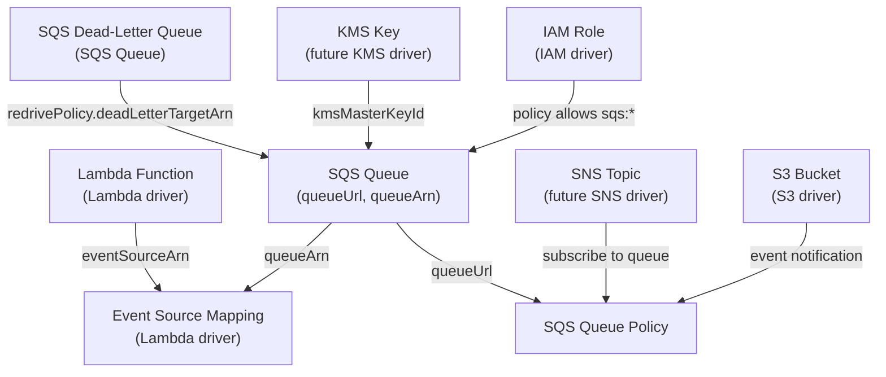

# SQS Driver Pack — Overview

---

## Table of Contents

1. [Driver Summary](#1-driver-summary)
2. [Relationships & Dependencies](#2-relationships--dependencies)
3. [Runtime Packs](#3-runtime-packs)
4. [Shared Infrastructure](#4-shared-infrastructure)
5. [Implementation Order](#5-implementation-order)
6. [go.mod Changes](#6-gomod-changes)
7. [Docker Compose Changes](#7-docker-compose-changes)
8. [Justfile Changes](#8-justfile-changes)
9. [Registry Integration](#9-registry-integration)
10. [Cross-Driver References](#10-cross-driver-references)
11. [Common Patterns](#11-common-patterns)
12. [Checklist](#12-checklist)

---

## 1. Driver Summary

| Driver | Kind | Key | Key Scope | Mutable | Tags | Spec Doc |
|---|---|---|---|---|---|---|
| SQS Queue | `SQSQueue` | `region~queueName` | `KeyScopeRegion` | visibilityTimeout, messageRetentionPeriod, maximumMessageSize, delaySeconds, receiveMessageWaitTimeSeconds, redrivePolicy, sqsManagedSseEnabled, kmsMasterKeyId, kmsDataKeyReusePeriodSeconds, fifoThroughputLimit, deduplicationScope, tags | Yes | [SQS_QUEUE_DRIVER_PLAN.md](SQS_QUEUE_DRIVER_PLAN.md) |
| SQS Queue Policy | `SQSQueuePolicy` | `region~queueName` | `KeyScopeRegion` | policy document | No | [SQS_QUEUE_POLICY_DRIVER_PLAN.md](SQS_QUEUE_POLICY_DRIVER_PLAN.md) |

Both drivers use `KeyScopeRegion` — SQS queues are regional resources, keys are
prefixed with the region (`<region>~<queueName>`).

---

## 2. Relationships & Dependencies



### Dependency Rules

| From | To | Relationship |
|---|---|---|
| SQS Queue Policy | SQS Queue | Policy's `queueUrl` references the queue |
| SQS Queue (redrive) | SQS Dead-Letter Queue | Queue's `redrivePolicy.deadLetterTargetArn` references another SQS queue |
| SQS Queue (SSE-KMS) | KMS Key | Queue's `kmsMasterKeyId` references a KMS key ARN |
| Event Source Mapping | SQS Queue | ESM's `eventSourceArn` references the queue ARN |
| SNS Subscription | SQS Queue | SNS delivers messages to the queue (requires queue policy) |
| S3 Event Notification | SQS Queue | S3 sends event notifications to the queue (requires queue policy) |
| IAM Policy | SQS Queue | IAM policies grant `sqs:SendMessage`, `sqs:ReceiveMessage`, etc. |

### Ownership Boundaries

- **SQS Queue driver**: Manages the queue lifecycle (create, update attributes,
  delete) and queue tags. Does NOT manage the queue's access policy — that's the
  Queue Policy driver's responsibility. Does NOT manage messages within the queue.
- **SQS Queue Policy driver**: Manages the resource-based access policy on a queue.
  Controls which AWS services, accounts, or IAM principals can send messages to or
  receive messages from the queue. The policy is a single JSON document attached to
  the queue — the driver manages the entire document atomically.

---

## 3. Runtime Packs

Both SQS drivers are hosted in the **praxis-storage** runtime pack alongside the
S3 driver. SQS is an AWS messaging/storage service — grouping it with other storage
drivers is the natural domain alignment, consistent with the docker-compose comment
that lists SQS under praxis-storage.

| Driver | Runtime Pack | Binary | Host Port |
|---|---|---|---|
| SQS Queue | praxis-storage | `cmd/praxis-storage` | 9081 |
| SQS Queue Policy | praxis-storage | `cmd/praxis-storage` | 9081 |

### praxis-storage Entry Point (Updated)

```go
// cmd/praxis-storage/main.go
srv := server.NewRestate().
    Bind(restate.Reflect(s3.NewS3BucketDriver(auth))).
    Bind(restate.Reflect(ebs.NewEBSVolumeDriver(auth))).
    Bind(restate.Reflect(dbsubnetgroup.NewDBSubnetGroupDriver(auth))).
    Bind(restate.Reflect(dbparametergroup.NewDBParameterGroupDriver(auth))).
    Bind(restate.Reflect(rdsinstance.NewRDSInstanceDriver(auth))).
    Bind(restate.Reflect(auroracluster.NewAuroraClusterDriver(auth))).
    // SQS drivers
    Bind(restate.Reflect(sqs.NewSQSQueueDriver(auth))).
    Bind(restate.Reflect(sqspolicy.NewSQSQueuePolicyDriver(auth)))
```

---

## 4. Shared Infrastructure

### SQS Client

Both drivers use the SQS API client from `aws-sdk-go-v2/service/sqs`. SQS has its
own SDK client — it does not share the S3 or EC2 API surface.

The client is created per-account via the auth registry's `Resolve(account)` method.

```go
func NewSQSClient(cfg aws.Config) *sqs.Client {
    return sqs.NewFromConfig(cfg)
}
```

### Rate Limiters

Both drivers share the same rate limiter namespace:

| Driver | Namespace | Sustained | Burst |
|---|---|---|---|
| SQS Queue | `sqs` | 50 | 20 |
| SQS Queue Policy | `sqs` | 50 | 20 |

SQS API rate limits are moderate (roughly 50–100 TPS for control plane operations
like `CreateQueue`, `SetQueueAttributes`, `GetQueueAttributes`). Both drivers share
a single token bucket to prevent aggregate throttling.

### Error Classifiers

Both drivers classify AWS SQS API errors:

```go
func IsNotFound(err error) bool         // QueueDoesNotExist, AWS.SimpleQueueService.NonExistentQueue
func IsAlreadyExists(err error) bool    // QueueNameExists (with different attributes)
func IsConflict(err error) bool         // QueueDeletedRecently (must wait 60s)
func IsInvalidInput(err error) bool     // InvalidAttributeName, InvalidAttributeValue
```

Each driver defines its own classifiers because the relevant subset of errors differs
per resource type. All classifiers include string fallback for Restate-wrapped panic
errors, following the established pattern.

### Queue URL Resolution

SQS operations use queue URLs (not ARNs or names). The queue URL is returned by
`CreateQueue` and `GetQueueUrl`. Both drivers need to resolve a queue name to a URL:

- **SQS Queue driver**: Receives the URL from `CreateQueue` during provisioning and
  stores it in state. For imports, calls `GetQueueUrl` to resolve the name.
- **SQS Queue Policy driver**: Calls `GetQueueUrl` to resolve the queue name from
  its key, or receives it as an output reference from the queue resource.

### Ownership Tags

Only the SQS Queue driver uses `praxis:managed-key` ownership tags. Queue names are
unique within a region+account, but the tag provides an additional safety net for
conflict detection across Praxis installations:

- **SQS Queue**: `praxis:managed-key=<region~queueName>` tag on the queue.
- **SQS Queue Policy**: No tags — the policy is an attribute of the queue, not a
  separate taggable resource.

---

## 5. Implementation Order

The drivers should be implemented in this order, respecting dependencies and allowing
incremental testing:

### Phase 1: Foundation

1. **SQS Queue** — Root resource for all SQS operations. No dependencies on other
   SQS resources. Must be implemented first since the queue policy references a
   queue URL. Supports both standard and FIFO queues, dead-letter queue configuration,
   and encryption settings.

### Phase 2: Access Control

2. **SQS Queue Policy** — References an SQS queue (required). Manages the
   resource-based policy that controls cross-service and cross-account access to
   the queue. Should be implemented after the queue driver so end-to-end testing
   (queue + policy) is possible.

### Dependency Test Order

```text
SQS Queue (isolated) → SQS Queue Policy (uses SQS Queue)
```

---

## 6. go.mod Changes

Add the SQS SDK package:

```text
github.com/aws/aws-sdk-go-v2/service/sqs v1.x.x
```

Run:

```bash
go get github.com/aws/aws-sdk-go-v2/service/sqs
go mod tidy
```

---

## 7. Docker Compose Changes

No new services or port changes needed — SQS drivers are hosted in the existing
`praxis-storage` service (port 9081). The Restate endpoint at
`http://praxis-storage:9080` already exists; adding new `.Bind()` calls in the
entry point automatically exposes the SQS drivers via Restate's reflection-based
service discovery.

The existing registration command:

```bash
curl -s -X POST http://localhost:9070/deployments \
  -H 'content-type: application/json' \
  -d '{"uri": "http://praxis-storage:9080"}'
```

will discover the SQS drivers automatically alongside S3 after re-registration.

---

## 8. Justfile Changes

Add targets for the SQS drivers:

```just
# SQS driver tests
test-sqs:
    go test ./internal/drivers/sqs/... -v -count=1 -race

test-sqspolicy:
    go test ./internal/drivers/sqspolicy/... -v -count=1 -race

test-sqs-all:
    go test ./internal/drivers/sqs/... ./internal/drivers/sqspolicy/... \
            -v -count=1 -race

test-sqs-integration:
    go test ./tests/integration/ -run "TestSQSQueue|TestSQSQueuePolicy" \
            -v -count=1 -tags=integration -timeout=5m

# Convenience: list queues in LocalStack
ls-sqs:
    aws --endpoint-url=http://localhost:4566 sqs list-queues --region us-east-1
```

---

## 9. Registry Integration

**File**: `internal/core/provider/registry.go`

Add both adapters to `NewRegistry()`:

```go
func NewRegistry() *Registry {
    auth := authservice.NewAuthClient()
    return NewRegistryWithAdapters(
        // ... existing adapters ...

        // SQS drivers
        NewSQSQueueAdapterWithAuth(auth),
        NewSQSQueuePolicyAdapterWithAuth(auth),
    )
}
```

### Adapter Files

| Driver | Adapter File |
|---|---|
| SQS Queue | `internal/core/provider/sqs_adapter.go` |
| SQS Queue Policy | `internal/core/provider/sqspolicy_adapter.go` |

---

## 10. Cross-Driver References

In Praxis templates, SQS resources reference each other and external resources via
output expressions:

### Standard Queue with Dead-Letter Queue

```cue
resources: {
    "dlq": {
        kind: "SQSQueue"
        spec: {
            queueName: "order-processing-dlq"
            region: "us-east-1"
            messageRetentionPeriod: 1209600  // 14 days
            tags: {
                environment: "production"
                purpose: "dead-letter"
            }
        }
    }
    "order-queue": {
        kind: "SQSQueue"
        spec: {
            queueName: "order-processing"
            region: "us-east-1"
            visibilityTimeout: 300
            messageRetentionPeriod: 345600  // 4 days
            redrivePolicy: {
                deadLetterTargetArn: "${resources.dlq.outputs.queueArn}"
                maxReceiveCount: 3
            }
            tags: {
                environment: "production"
            }
        }
    }
}
```

### FIFO Queue

```cue
resources: {
    "order-fifo": {
        kind: "SQSQueue"
        spec: {
            queueName: "order-processing.fifo"
            region: "us-east-1"
            fifoQueue: true
            contentBasedDeduplication: true
            deduplicationScope: "queue"
            fifoThroughputLimit: "perQueue"
            tags: {
                environment: "production"
            }
        }
    }
}
```

### Queue with Policy (SNS → SQS)

```cue
resources: {
    "notification-queue": {
        kind: "SQSQueue"
        spec: {
            queueName: "notifications"
            region: "us-east-1"
        }
    }
    "notification-queue-policy": {
        kind: "SQSQueuePolicy"
        spec: {
            queueName: "notifications"
            region: "us-east-1"
            policy: {
                Version: "2012-10-17"
                Statement: [{
                    Sid: "AllowSNSPublish"
                    Effect: "Allow"
                    Principal: Service: "sns.amazonaws.com"
                    Action: "sqs:SendMessage"
                    Resource: "${resources.notification-queue.outputs.queueArn}"
                    Condition: ArnEquals: "aws:SourceArn": "${resources.order-topic.outputs.topicArn}"
                }]
            }
        }
    }
}
```

### Queue with Policy (S3 → SQS)

```cue
resources: {
    "upload-queue": {
        kind: "SQSQueue"
        spec: {
            queueName: "s3-upload-events"
            region: "us-east-1"
        }
    }
    "upload-queue-policy": {
        kind: "SQSQueuePolicy"
        spec: {
            queueName: "s3-upload-events"
            region: "us-east-1"
            policy: {
                Version: "2012-10-17"
                Statement: [{
                    Sid: "AllowS3Notify"
                    Effect: "Allow"
                    Principal: Service: "s3.amazonaws.com"
                    Action: "sqs:SendMessage"
                    Resource: "${resources.upload-queue.outputs.queueArn}"
                    Condition: ArnEquals: "aws:SourceArn": "${resources.upload-bucket.outputs.arn}"
                }]
            }
        }
    }
}
```

### Lambda Event Source Mapping (Cross-Pack)

```cue
resources: {
    "work-queue": {
        kind: "SQSQueue"
        spec: {
            queueName: "work-items"
            region: "us-east-1"
            visibilityTimeout: 900  // 6x Lambda timeout
        }
    }
    "worker-function": {
        kind: "LambdaFunction"
        spec: {
            functionName: "work-processor"
            region: "us-east-1"
            runtime: "python3.12"
            handler: "main.handler"
            timeout: 150
            // ...
        }
    }
    "queue-trigger": {
        kind: "EventSourceMapping"
        spec: {
            functionName: "${resources.worker-function.outputs.functionArn}"
            eventSourceArn: "${resources.work-queue.outputs.queueArn}"
            batchSize: 10
            enabled: true
        }
    }
}
```

The DAG resolver handles dependency ordering automatically based on these expression
references.

---

## 11. Common Patterns

### All SQS Drivers Share

- **`KeyScopeRegion`** — All SQS resources are regional; keys follow `<region>~<queueName>`
- **SQS API client** — Both drivers share the `aws-sdk-go-v2/service/sqs` package
- **`QueueDoesNotExist`** → not-found classification across both drivers
- **`QueueDeletedRecently`** → conflict handling (AWS enforces a 60-second cooldown
  after queue deletion before a queue with the same name can be recreated)
- **Shared rate limiter namespace `"sqs"`** — Single token bucket (50/20) for both drivers
- **Import defaults to `ModeObserved`** — Queues are often shared infrastructure;
  imported queues are observed, not mutated

### Driver-Specific Patterns

| Driver | Notable Pattern |
|---|---|
| SQS Queue | `CreateQueue` is idempotent if attributes match; returns existing queue URL. If attributes differ, AWS returns `QueueNameExists` error. Standard vs FIFO queues have different attribute sets — FIFO-specific attributes are only validated when `fifoQueue: true`. |
| SQS Queue Policy | Policy is set via `SetQueueAttributes` with `Policy` attribute — same API surface as queue attributes. An empty policy string removes the policy. The driver replaces the entire policy document atomically (no statement-level granularity). |

### Queue Deletion Cooldown

AWS enforces a **60-second cooldown** after deleting a queue. During this window,
any attempt to create a queue with the same name returns `QueueDeletedRecently`.
The drivers surface this as a retryable conflict error — Restate will retry the
operation after its backoff interval. This is a well-known SQS API behavior that
cannot be worked around.

### FIFO Queue Naming

FIFO queue names **must** end with `.fifo`. The CUE schema enforces this constraint
when `fifoQueue: true` is set, preventing invalid queue creation attempts.

### Driver Complexity Ranking

| Driver | Complexity | Reason |
|---|---|---|
| SQS Queue Policy | Low | Single attribute (`Policy`) on the queue; set/get/delete via `SetQueueAttributes`/`GetQueueAttributes` |
| SQS Queue | Medium | Standard + FIFO variants, redrive policy (DLQ), encryption options, 12+ mutable attributes, queue URL resolution |

---

## 12. Checklist

### Schemas

- [x] `schemas/aws/sqs/queue.cue`
- [x] `schemas/aws/sqs/queue_policy.cue`

### Drivers (per driver: types + aws + drift + driver)

- [x] `internal/drivers/sqs/`
- [x] `internal/drivers/sqspolicy/`

### Adapters

- [x] `internal/core/provider/sqs_adapter.go`
- [x] `internal/core/provider/sqspolicy_adapter.go`

### Registry

- [x] Both adapters registered in `NewRegistry()`

### Tests

- [x] Unit tests for both drivers
- [x] Integration tests for both drivers
- [x] Cross-driver integration test (SQS Queue → SQS Queue Policy)

### Infrastructure

- [x] `internal/infra/awsclient/client.go` — Add `NewSQSClient()`
- [x] `cmd/praxis-storage/main.go` — Bind both SQS drivers
- [x] `docker-compose.yaml` — No changes needed (praxis-storage already exposed)
- [x] `justfile` — Add SQS test targets
- [x] `go get github.com/aws/aws-sdk-go-v2/service/sqs`

### Documentation

- [x] [SQS_QUEUE_DRIVER_PLAN.md](SQS_QUEUE_DRIVER_PLAN.md)
- [x] [SQS_QUEUE_POLICY_DRIVER_PLAN.md](SQS_QUEUE_POLICY_DRIVER_PLAN.md)
- [x] This overview document
