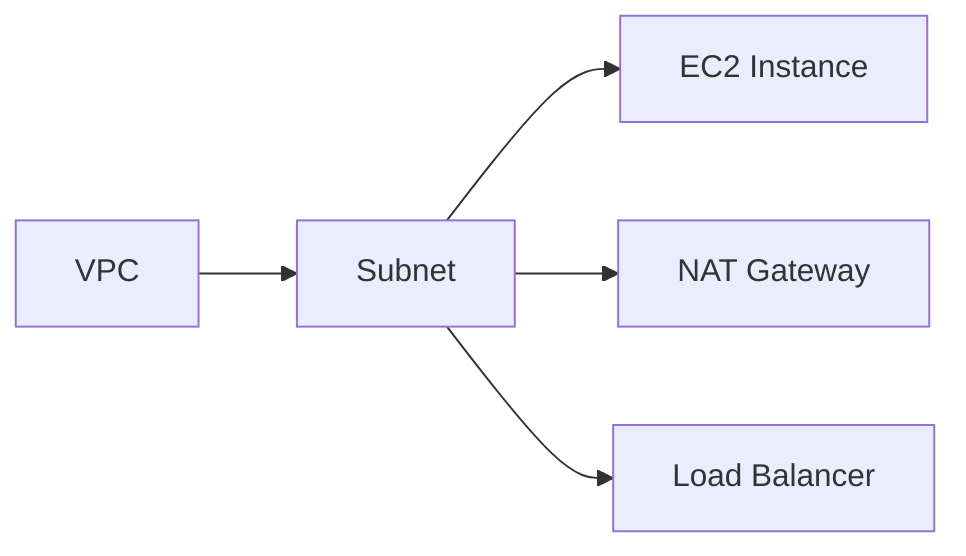

# Subnet Driver — Implementation Specification

---

## Table of Contents

1. [Overview & Scope](#1-overview--scope)
2. [Key Strategy](#2-key-strategy)
3. [File Inventory](#3-file-inventory)
4. [Step 1 — CUE Schema](#step-1--cue-schema)
5. [Step 2 — AWS Client Factory](#step-2--aws-client-factory)
6. [Step 3 — Driver Types](#step-3--driver-types)
7. [Step 4 — AWS API Abstraction Layer](#step-4--aws-api-abstraction-layer)
8. [Step 5 — Drift Detection](#step-5--drift-detection)
9. [Step 6 — Driver Implementation](#step-6--driver-implementation)
10. [Step 7 — Provider Adapter](#step-7--provider-adapter)
11. [Step 8 — Registry Integration](#step-8--registry-integration)
12. [Step 9 — Binary Entry Point & Dockerfile](#step-9--binary-entry-point--dockerfile)
13. [Step 10 — Docker Compose & Justfile](#step-10--docker-compose--justfile)
14. [Step 11 — Unit Tests](#step-11--unit-tests)
15. [Step 12 — Integration Tests](#step-12--integration-tests)
16. [Subnet-Specific Design Decisions](#subnet-specific-design-decisions)
17. [Design Decisions (Resolved)](#design-decisions-resolved)
18. [Checklist](#checklist)

---

## 1. Overview & Scope

The Subnet driver manages the lifecycle of AWS **Subnets** only. Route table
associations, network ACL associations, and NAT gateway placements within subnets
are handled by their respective drivers. This document covers exclusively the
Subnet resource itself.

### Why Subnets

Subnets are the second-most fundamental networking primitive after VPCs. Every
instance, Lambda function, RDS database, and load balancer launches into a subnet.
Without a Subnet driver, Praxis cannot compose realistic application stacks that
include networking — templates must rely on pre-existing subnets. Implementing
subnets unblocks multi-AZ deployments, public/private network topologies, and
compound templates that provision end-to-end stacks.

### Resource Scope

| In Scope | Out of Scope (Separate Drivers/Resources) |
|---|---|
| Subnet creation, update, deletion | Route table associations |
| Availability Zone placement | Network ACL associations |
| CIDR block (IPv4) | NAT gateway placement |
| Auto-assign public IP setting | Elastic IP association |
| Tags | IPv6 CIDR association |
| Import and drift detection | VPC management |
| Ownership tag enforcement | |
| Map public IP on launch | |

### Subnet Driver Contract

The driver follows the established Virtual Object contract:

| Handler | Context | Purpose |
|---|---|---|
| `Provision` | `ObjectContext` (exclusive) | Create or converge a Subnet |
| `Import` | `ObjectContext` (exclusive) | Adopt an existing Subnet |
| `Delete` | `ObjectContext` (exclusive) | Delete a Subnet (blocked for Observed mode) |
| `Reconcile` | `ObjectContext` (exclusive) | Detect/correct drift (report-only for Observed mode) |
| `GetStatus` | `ObjectSharedContext` (shared) | Return current status |
| `GetOutputs` | `ObjectSharedContext` (shared) | Return Subnet outputs |

### Downstream Consumers

The Subnet driver's outputs are the primary integration point for dependent resources:

```text
${resources.my-subnet.outputs.subnetId}            → EC2 instances, ELB, RDS, Lambda
${resources.my-subnet.outputs.availabilityZone}     → AZ-aware resource placement
${resources.my-subnet.outputs.cidrBlock}            → Network ACLs, security group rules
${resources.my-subnet.outputs.availabilityZoneId}   → Cross-account AZ consistency
```

---

## 2. Key Strategy

### Key Format: `vpcId~metadata.name`

Subnet names are not unique within a region — only within a VPC. Two different VPCs
can have subnets with the same Name tag. The key must capture both dimensions to
avoid conflicts, matching the Security Group driver's `KeyScopeCustom` pattern.

1. **BuildKey** (adapter, plan-time): returns `vpcId~metadata.name`. The `vpcId`
   is extracted from `spec.vpcId` in the resource document. If `spec.vpcId` is a
   template expression (e.g., `${resources.my-vpc.outputs.vpcId}`), it must be
   resolved before BuildKey is called — the pipeline handles this.
2. **Provision** (pipeline → workflow → driver): dispatched to same key.
3. **Delete** (pipeline → workflow → driver): dispatched to same key.
4. **Plan** (adapter → describe by Subnet ID from state): uses the key to reach
   the Virtual Object, reads the stored Subnet ID from state, describes by ID.
5. **Import** (handlers_resource.go): `BuildImportKey(region, resourceID)` returns
   `region~resourceID` where `resourceID` is the Subnet ID — **this targets a
   different Virtual Object** intentionally.

The AWS Subnet ID (`subnet-0abc123...`) is stored only in state/outputs and is
the AWS API handle, not the Praxis identity handle.

### Constraint: metadata.name Must Be Unique Within a VPC

Praxis requires `metadata.name` to be unique per VPC for managed Subnet resources.
If a user wants two subnets with similar purposes in the same VPC, they should use
different template resource names (e.g., "public-a", "public-b").

### Conflict Enforcement via Ownership Tags

Same pattern as VPC/EC2:

- **Tag**: `praxis:managed-key = <vpcId~metadata.name>` written at creation.
- **Pre-flight check**: `FindByManagedKey` queries for subnets with the tag.
- **Conflict**: Terminal error 409 if a matching subnet already exists.

### Import Semantics

Import defaults to `ModeObserved` for Subnets. Deleting a subnet abruptly
disconnects any instances or services running in it. The Observed default prevents
accidental deletion. Operators pass `--mode managed` to enable full lifecycle control.

Import key: `region~subnetId` — separate Virtual Object from template-managed one.

---

## 3. File Inventory

Files (✓ = implemented):

```text
✓ internal/drivers/subnet/types.go             — Spec, Outputs, ObservedState, State structs
✓ internal/drivers/subnet/aws.go               — SubnetAPI interface + realSubnetAPI implementation
✓ internal/drivers/subnet/drift.go             — HasDrift(), ComputeFieldDiffs()
✓ internal/drivers/subnet/driver.go            — SubnetDriver Virtual Object
✓ internal/drivers/subnet/driver_test.go       — Unit tests for driver (mocked AWS)
✓ internal/drivers/subnet/aws_test.go          — Unit tests for error classification helpers
✓ internal/drivers/subnet/drift_test.go        — Unit tests for drift detection
✓ internal/core/provider/subnet_adapter.go     — SubnetAdapter implementing provider.Adapter
✓ internal/core/provider/subnet_adapter_test.go — Unit tests for Subnet adapter
✓ schemas/aws/subnet/subnet.cue               — CUE schema for Subnet resource
✓ tests/integration/subnet_driver_test.go      — Integration tests (Testcontainers + LocalStack)
✓ cmd/praxis-network/main.go                  — Add Subnet driver `.Bind()` to network pack
✓ internal/core/provider/registry.go           — Add NewSubnetAdapter to NewRegistry()
✓ justfile                                     — Add subnet test targets
```

---

## Step 1 — CUE Schema

**File**: `schemas/aws/subnet/subnet.cue`

```cue
package subnet

#Subnet: {
    apiVersion: "praxis.io/v1"
    kind:       "Subnet"

    metadata: {
        name: string & =~"^[a-zA-Z0-9][a-zA-Z0-9._-]{0,254}$"
        labels: [string]: string
    }

    spec: {
        // region is the AWS region for the subnet.
        region: string

        // vpcId is the VPC to create the subnet in.
        // Typically a template expression: "${resources.my-vpc.outputs.vpcId}"
        vpcId: string

        // cidrBlock is the IPv4 CIDR block for the subnet.
        // Must be a subset of the VPC's CIDR block.
        // Immutable after creation — changing requires subnet replacement.
        cidrBlock: string & =~"^([0-9]{1,3}\\.){3}[0-9]{1,3}/([0-9]|[12][0-9]|3[0-2])$"

        // availabilityZone is the AZ to create the subnet in.
        // e.g., "us-east-1a". Immutable after creation.
        availabilityZone: string

        // mapPublicIpOnLaunch controls whether instances launched in this subnet
        // receive a public IPv4 address by default.
        // Default: false.
        mapPublicIpOnLaunch: bool | *false

        // tags applied to the subnet resource.
        tags: [string]: string
    }

    outputs?: {
        subnetId:            string
        arn:                 string
        vpcId:               string
        cidrBlock:           string
        availabilityZone:    string
        availabilityZoneId:  string
        mapPublicIpOnLaunch: bool
        state:               string
        ownerId:             string
        availableIpCount:    int
    }
}
```

**Key decisions**:

- `availabilityZone` is required and immutable — subnets are AZ-bound.
- `mapPublicIpOnLaunch` defaults to `false` (private by default, matching AWS behavior).
- `availableIpCount` in outputs provides visibility into IP exhaustion.
- No IPv6 fields — consistent with VPC driver scope.

---

## Step 2 — AWS Client Factory

**File**: `internal/infra/awsclient/client.go` — **NO CHANGES NEEDED**

Subnet API calls use the same EC2 SDK client (`NewEC2Client`).

---

## Step 3 — Driver Types

**File**: `internal/drivers/subnet/types.go`

```go
package subnet

import "github.com/shirvan/praxis/pkg/types"

const ServiceName = "Subnet"

type SubnetSpec struct {
    Account             string            `json:"account,omitempty"`
    Region              string            `json:"region"`
    VpcId               string            `json:"vpcId"`
    CidrBlock           string            `json:"cidrBlock"`
    AvailabilityZone    string            `json:"availabilityZone"`
    MapPublicIpOnLaunch bool              `json:"mapPublicIpOnLaunch"`
    Tags                map[string]string `json:"tags,omitempty"`
    ManagedKey          string            `json:"managedKey,omitempty"`
}

type SubnetOutputs struct {
    SubnetId            string `json:"subnetId"`
    ARN                 string `json:"arn,omitempty"`
    VpcId               string `json:"vpcId"`
    CidrBlock           string `json:"cidrBlock"`
    AvailabilityZone    string `json:"availabilityZone"`
    AvailabilityZoneId  string `json:"availabilityZoneId"`
    MapPublicIpOnLaunch bool   `json:"mapPublicIpOnLaunch"`
    State               string `json:"state"`
    OwnerId             string `json:"ownerId"`
    AvailableIpCount    int    `json:"availableIpCount"`
}

type ObservedState struct {
    SubnetId            string            `json:"subnetId"`
    VpcId               string            `json:"vpcId"`
    CidrBlock           string            `json:"cidrBlock"`
    AvailabilityZone    string            `json:"availabilityZone"`
    AvailabilityZoneId  string            `json:"availabilityZoneId"`
    MapPublicIpOnLaunch bool              `json:"mapPublicIpOnLaunch"`
    State               string            `json:"state"` // "pending", "available"
    OwnerId             string            `json:"ownerId"`
    AvailableIpCount    int               `json:"availableIpCount"`
    Tags                map[string]string `json:"tags"`
}

type SubnetState struct {
    Desired            SubnetSpec           `json:"desired"`
    Observed           ObservedState        `json:"observed"`
    Outputs            SubnetOutputs        `json:"outputs"`
    Status             types.ResourceStatus `json:"status"`
    Mode               types.Mode           `json:"mode"`
    Error              string               `json:"error,omitempty"`
    Generation         int64                `json:"generation"`
    LastReconcile      string               `json:"lastReconcile,omitempty"`
    ReconcileScheduled bool                 `json:"reconcileScheduled"`
}
```

---

## Step 4 — AWS API Abstraction Layer

**File**: `internal/drivers/subnet/aws.go`

### SubnetAPI Interface

```go
type SubnetAPI interface {
    // CreateSubnet creates a new subnet in the specified VPC and AZ.
    // Returns the subnet ID assigned by AWS.
    CreateSubnet(ctx context.Context, spec SubnetSpec) (string, error)

    // DescribeSubnet returns the full observed state of a subnet.
    DescribeSubnet(ctx context.Context, subnetId string) (ObservedState, error)

    // DeleteSubnet deletes a subnet.
    // Fails if the subnet has active instances or other resources.
    DeleteSubnet(ctx context.Context, subnetId string) error

    // WaitUntilAvailable blocks until the subnet reaches "available" state.
    WaitUntilAvailable(ctx context.Context, subnetId string) error

    // ModifyMapPublicIp enables or disables auto-assign public IP for the subnet.
    ModifyMapPublicIp(ctx context.Context, subnetId string, enabled bool) error

    // UpdateTags replaces all user-managed tags on the subnet.
    // Does NOT modify praxis:* system tags.
    UpdateTags(ctx context.Context, subnetId string, tags map[string]string) error

    // FindByManagedKey searches for subnets tagged with praxis:managed-key=managedKey.
    FindByManagedKey(ctx context.Context, managedKey string) (string, error)
}
```

### Implementation Notes

- `CreateSubnet`: Uses `CreateSubnet` API with `TagSpecifications` to attach
  `praxis:managed-key` and user tags at creation time.
- `DescribeSubnet`: Uses `DescribeSubnets` API. Unlike VPCs, subnet attributes
  (mapPublicIpOnLaunch) are returned directly in the describe response — no
  separate attribute call needed. **1 API call per describe** (vs. 3 for VPC).
- `DeleteSubnet`: Returns `DependencyViolation` if instances or ENIs exist in
  the subnet.
- `WaitUntilAvailable`: Uses `ec2sdk.NewSubnetAvailableWaiter`. Subnets typically
  become available within seconds.
- `ModifyMapPublicIp`: Uses `ModifySubnetAttribute` API.
- `UpdateTags`: Same delete-old-create-new pattern as VPC, preserving `praxis:*` tags.

### Error Classification Helpers

```go
func IsNotFound(err error) bool       // "InvalidSubnetID.NotFound", "InvalidSubnetID.Malformed"
func IsDependencyViolation(err error) bool  // "DependencyViolation"
func IsInvalidParam(err error) bool    // "InvalidParameterValue", "InvalidSubnet.Range"
func IsCidrConflict(err error) bool    // "InvalidSubnet.Conflict" (overlapping CIDR)
```

---

## Step 5 — Drift Detection

**File**: `internal/drivers/subnet/drift.go`

### Drift Rules

| Field | Mutable? | Drift Checked? | How Corrected |
|---|---|---|---|
| `mapPublicIpOnLaunch` | Yes | **Yes** | `ModifySubnetAttribute` |
| `tags` | Yes | **Yes** | `CreateTags` / `DeleteTags` |
| `cidrBlock` | **No** | **No** | Requires replacement |
| `availabilityZone` | **No** | **No** | Requires replacement |
| `vpcId` | **No** | **No** | Requires replacement |

```go
func HasDrift(desired SubnetSpec, observed ObservedState) bool {
    if observed.State != "available" {
        return false
    }
    if desired.MapPublicIpOnLaunch != observed.MapPublicIpOnLaunch {
        return true
    }
    if !tagsMatch(desired.Tags, observed.Tags) {
        return true
    }
    return false
}

func ComputeFieldDiffs(desired SubnetSpec, observed ObservedState) []FieldDiffEntry {
    // Mutable: mapPublicIpOnLaunch, tags
    // Immutable (reported only): cidrBlock, availabilityZone
}
```

---

## Step 6 — Driver Implementation

**File**: `internal/drivers/subnet/driver.go`

Follows the VPC driver pattern exactly:

### Provision

1. Input validation: `cidrBlock`, `region`, `vpcId`, `availabilityZone` required.
2. Load current state. If subnet exists (re-provision), verify it still exists.
3. Pre-flight ownership check via `FindByManagedKey`.
4. Create subnet if new: `CreateSubnet` → `WaitUntilAvailable`.
5. Apply `MapPublicIpOnLaunch` if non-default (AWS default is `false`).
6. Re-provision path: converge `MapPublicIpOnLaunch` and tags only.
7. Final describe → build outputs → commit state.
8. Schedule reconcile.

### Import

1. Describe existing subnet by ID.
2. Synthesize spec from observed state.
3. Default to `ModeObserved`.
4. Store state and schedule reconcile.

### Delete

1. Block `ModeObserved` resources (409).
2. Call `DeleteSubnet`. Handle `DependencyViolation` as terminal error 409.
3. Set tombstone state.

### Reconcile

1. Describe current state.
2. Check drift on mutable fields.
3. Managed mode: correct drift. Observed mode: report only.
4. Schedule next reconcile.

---

## Step 7 — Provider Adapter

**File**: `internal/core/provider/subnet_adapter.go`

### Key Scope: `KeyScopeCustom`

- `BuildKey`: `JoinKey(spec.VpcId, metadata.name)`
- `BuildImportKey`: `JoinKey(region, subnetId)`

### Plan

Same VO-to-VO call pattern as VPC adapter: read `GetOutputs` → describe by stored
subnet ID → `ComputeFieldDiffs`.

### NormalizeOutputs

```go
func (a *SubnetAdapter) NormalizeOutputs(raw any) (map[string]any, error) {
    out := raw.(SubnetOutputs)
    return map[string]any{
        "subnetId":            out.SubnetId,
        "arn":                 out.ARN,
        "vpcId":               out.VpcId,
        "cidrBlock":           out.CidrBlock,
        "availabilityZone":    out.AvailabilityZone,
        "availabilityZoneId":  out.AvailabilityZoneId,
        "mapPublicIpOnLaunch": out.MapPublicIpOnLaunch,
        "state":               out.State,
        "ownerId":             out.OwnerId,
        "availableIpCount":    out.AvailableIpCount,
    }, nil
}
```

---

## Step 8 — Registry Integration

**File**: `internal/core/provider/registry.go`

`NewSubnetAdapterWithAuth` is registered in `NewRegistry()`.

---

## Step 9 — Binary Entry Point & Dockerfile

**File**: `cmd/praxis-network/main.go`

The Subnet driver is bound in `cmd/praxis-network/main.go`:

`.Bind(restate.Reflect(subnet.NewSubnetDriver(auth)))`

No new Dockerfile needed.

---

## Step 10 — Docker Compose & Justfile

No Docker Compose changes needed — Subnet joins the existing `praxis-network` service.

**Justfile**: Add subnet test target:

```makefile
test-subnet:
    go test ./internal/drivers/subnet/... -v -count=1 -race
```

---

## Step 11 — Unit Tests

### `internal/drivers/subnet/driver_test.go`

1. `TestProvision_CreatesNewSubnet` — happy path with VPC ID and AZ.
2. `TestProvision_MissingCidrBlockFails` — terminal error 400.
3. `TestProvision_MissingVpcIdFails` — terminal error 400.
4. `TestProvision_MissingAvailabilityZoneFails` — terminal error 400.
5. `TestProvision_CidrConflictFails` — overlapping CIDR → terminal error 409.
6. `TestProvision_IdempotentReprovision` — second call converges, no new subnet.
7. `TestProvision_MapPublicIpChange` — modification calls ModifySubnetAttribute.
8. `TestProvision_TagUpdate` — tag change calls UpdateTags.
9. `TestProvision_ConflictTaggedSubnetFails` — FindByManagedKey conflict → 409.
10. `TestProvision_MapPublicIpOnCreate` — new subnet with mapPublicIpOnLaunch=true.
11. `TestImport_ExistingSubnet` — describes, synthesizes spec, returns outputs.
12. `TestImport_NotFoundFails` — terminal error 404.
13. `TestImport_DefaultsToObservedMode` — ModeObserved when no explicit mode.
14. `TestDelete_DeletesSubnet` — calls DeleteSubnet, sets tombstone.
15. `TestDelete_AlreadyGone` — IsNotFound returns success.
16. `TestDelete_ObservedModeBlocked` — terminal error 409.
17. `TestDelete_DependencyViolationFails` — instances in subnet → terminal error 409.
18. `TestReconcile_NoDrift` — no changes when spec matches observed.
19. `TestReconcile_DetectsMapPublicIpDrift` — drift=true, correcting=true.
20. `TestReconcile_DetectsTagDrift` — drift=true, tag correction applied.
21. `TestReconcile_ObservedModeReportsOnly` — drift=true, correcting=false.
22. `TestGetStatus_ReturnsCurrentState` — reads from K/V.
23. `TestGetOutputs_ReturnsOutputs` — reads from K/V.

### `internal/drivers/subnet/drift_test.go`

1. `TestHasDrift_NoDrift` — identical returns false.
2. `TestHasDrift_MapPublicIpChanged` — returns true.
3. `TestHasDrift_TagAdded` — returns true.
4. `TestHasDrift_PendingSubnetNoDrift` — returns false.
5. `TestHasDrift_CidrChangedNoDrift` — immutable, not checked.
6. `TestHasDrift_AZChangedNoDrift` — immutable, not checked.
7. `TestComputeFieldDiffs_MapPublicIp` — field-level diff.
8. `TestComputeFieldDiffs_ImmutableCidrBlock` — reports with replacement suffix.
9. `TestComputeFieldDiffs_ImmutableAZ` — reports with replacement suffix.
10. `TestTagsMatch_IgnoresPraxisTags` — praxis:managed-key excluded.

### `internal/drivers/subnet/aws_test.go`

1. `TestIsNotFound_True` — `InvalidSubnetID.NotFound`.
2. `TestIsDependencyViolation_True` — `DependencyViolation`.
3. `TestIsInvalidParam_True` — `InvalidParameterValue`.
4. `TestIsCidrConflict_True` — `InvalidSubnet.Conflict`.

---

## Step 12 — Integration Tests

**File**: `tests/integration/subnet_driver_test.go`

1. **TestSubnetProvision_CreatesRealSubnet** — Creates VPC first, then provisions
   subnet, verifies it exists via DescribeSubnets.
2. **TestSubnetProvision_Idempotent** — Two provisions with same spec.
3. **TestSubnetProvision_WithPublicIp** — mapPublicIpOnLaunch=true verified.
4. **TestSubnetImport_ExistingSubnet** — Creates subnet via SDK, imports.
5. **TestSubnetDelete_DeletesSubnet** — Provisions, deletes, verifies gone.
6. **TestSubnetDelete_DependencyViolation** — Creates instance in subnet, delete fails.
7. **TestSubnetReconcile_DetectsTagDrift** — Manually changes tags, reconcile corrects.
8. **TestSubnetReconcile_DetectsMapPublicIpDrift** — Toggles setting, reconcile corrects.
9. **TestSubnetGetStatus_ReturnsReady** — Provisions, checks status.
10. **TestSubnetOutputs_SubnetIdAvailable** — Verifies subnetId in outputs.

### LocalStack Subnet Compatibility Note

LocalStack's subnet emulation is comprehensive: CreateSubnet, DescribeSubnets,
DeleteSubnet, ModifySubnetAttribute, CreateTags are all well-supported. Availability
zone handling may produce synthetic AZ names in LocalStack.

---

## Subnet-Specific Design Decisions

### 1. Key Strategy: `vpcId~metadata.name`

Subnet names are only unique within a VPC (unlike VPCs which are unique within a
region). This matches the Security Group driver's `KeyScopeCustom` pattern.

**Why not `region~metadata.name`**: Multiple VPCs in the same region can have
subnets with the same name. Using region-scoped keys would cause collisions.

**Why not `region~subnetId`**: Subnet IDs are assigned at creation time, unavailable
at `BuildKey` time.

**BuildKey dependency on resolved VPC ID**: `spec.vpcId` must be a concrete VPC ID
(not a template expression) when `BuildKey` runs. The pipeline resolves template
expressions before calling `BuildKey`. If the VPC hasn't been provisioned yet and
the VPC ID expression can't resolve, the pipeline reports a dependency error.

### 2. Immutable vs. Mutable Attributes

| Attribute | Mutable? | Drift Checked? |
|---|---|---|
| `mapPublicIpOnLaunch` | Yes | **Yes** |
| `tags` | Yes | **Yes** |
| `cidrBlock` | **No** | **No** |
| `availabilityZone` | **No** | **No** |
| `vpcId` | **No** | **No** |

### 3. Deletion: Dependency Handling

Subnet deletion fails with `DependencyViolation` if the subnet contains:

- EC2 instances (running or stopped)
- Network interfaces (ENIs)
- Load balancer nodes
- RDS instances
- NAT gateways
- Lambda ENIs

The driver surfaces this as a terminal error (409). The DAG scheduler should order
deletions so instances and ENIs are removed before subnets.

### 4. AZ Selection Strategy

The driver requires an explicit `availabilityZone` in the spec. It does NOT
auto-select AZs. This is intentional:

- AZ selection is a deployment topology decision, not a driver responsibility.
- Templates should explicitly declare AZ placement for reproducibility.
- Multi-AZ deployments require the template author to plan subnet distribution.

### 5. ARN Construction

Subnet ARN format: `arn:aws:ec2:<region>:<account-id>:subnet/<subnet-id>`.
`OwnerId` is available in `DescribeSubnets`, so the ARN is constructed at provision
time without an STS call (same as VPC).

### 6. Available IP Count

`AvailableIpCount` is included in outputs as a read-only informational field.
AWS reserves 5 IP addresses per subnet (first 4 + broadcast), so a /24 subnet
has 251 usable IPs. This field is not drift-checked — it changes as instances
are launched and terminated.

### 7. Subnet as a DAG Intermediate Node

In compound templates, subnets sit between VPCs and compute resources:



During apply: VPC first, then subnets (depends on `vpcId`), then instances.
During delete: instances first, then subnets, then VPC.

---

## Design Decisions (Resolved)

1. **Should the driver manage route table associations?**
   No. Route table associations are the Route Table driver's responsibility. The
   Subnet driver creates the raw subnet; the Route Table driver associates it.
   AWS automatically associates new subnets with the VPC's main route table.

2. **Should the driver support IPv6 CIDR assignment?**
   No. Consistent with the VPC driver — IPv6 is out of scope for the initial
   networking layer.

3. **Should the driver support `assignIpv6AddressOnCreation`?**
   No. Requires IPv6 CIDR block to be associated with the VPC first.

4. **Should the driver auto-detect the VPC's AZs?**
   No. AZ selection is the template author's responsibility. The driver validates
   that the specified AZ exists at creation time (AWS returns an error if it doesn't).

5. **Should `AvailableIpCount` be drift-checked?**
   No. It's a dynamic value that changes as instances are created/destroyed. It's
   an informational output, not a desired-state field.

---

## Example Template

```cue
import (
    "praxis.io/schemas/aws/vpc"
    "praxis.io/schemas/aws/subnet"
)

resources: {
    "my-vpc": vpc.#VPC & {
        apiVersion: "praxis.io/v1"
        kind:       "VPC"
        metadata: name: "web-vpc"
        spec: {
            region:             "\(variables.region)"
            cidrBlock:          "10.0.0.0/16"
            enableDnsHostnames: true
            enableDnsSupport:   true
            tags: { Name: "web-vpc" }
        }
    }

    "public-subnet-a": subnet.#Subnet & {
        apiVersion: "praxis.io/v1"
        kind:       "Subnet"
        metadata: name: "public-a"
        spec: {
            region:              "\(variables.region)"
            vpcId:               "${resources.my-vpc.outputs.vpcId}"
            cidrBlock:           "10.0.1.0/24"
            availabilityZone:    "\(variables.region)a"
            mapPublicIpOnLaunch: true
            tags: {
                Name:        "public-a"
                Environment: "production"
                Tier:        "public"
            }
        }
    }

    "private-subnet-a": subnet.#Subnet & {
        apiVersion: "praxis.io/v1"
        kind:       "Subnet"
        metadata: name: "private-a"
        spec: {
            region:              "\(variables.region)"
            vpcId:               "${resources.my-vpc.outputs.vpcId}"
            cidrBlock:           "10.0.10.0/24"
            availabilityZone:    "\(variables.region)a"
            mapPublicIpOnLaunch: false
            tags: {
                Name:        "private-a"
                Environment: "production"
                Tier:        "private"
            }
        }
    }
}

variables: {
    region: string | *"us-east-1"
}
```

---

## Checklist

- [ ] **Schema**: `schemas/aws/subnet/subnet.cue` created
- [ ] **Types**: `internal/drivers/subnet/types.go` created
- [ ] **AWS API**: `internal/drivers/subnet/aws.go` created with SubnetAPI interface + realSubnetAPI
- [ ] **Drift**: `internal/drivers/subnet/drift.go` created with HasDrift, ComputeFieldDiffs
- [ ] **Driver**: `internal/drivers/subnet/driver.go` created with all 6 handlers
- [ ] **Adapter**: `internal/core/provider/subnet_adapter.go` created
- [ ] **Registry**: `internal/core/provider/registry.go` updated with Subnet adapter
- [ ] **Entry point**: Subnet driver `.Bind()` added to `cmd/praxis-network/main.go`
- [ ] **Justfile**: Updated with subnet test targets
- [ ] **Unit tests (drift)**: `internal/drivers/subnet/drift_test.go` created
- [ ] **Unit tests (aws helpers)**: `internal/drivers/subnet/aws_test.go` created
- [ ] **Unit tests (driver)**: `internal/drivers/subnet/driver_test.go` created
- [ ] **Unit tests (adapter)**: `internal/core/provider/subnet_adapter_test.go` created
- [ ] **Integration tests**: `tests/integration/subnet_driver_test.go` created
- [ ] **Conflict check**: `FindByManagedKey` in SubnetAPI interface
- [ ] **Ownership tag**: `praxis:managed-key` written at creation, preserved by UpdateTags
- [ ] **Import default mode**: ModeObserved when unspecified
- [ ] **Delete mode guard**: Blocks deletion for ModeObserved (409)
- [ ] **Dependency violation handling**: Surfaces as terminal error 409
- [ ] **Build passes**: `go build ./...` succeeds
- [ ] **Unit tests pass**: `go test ./internal/drivers/subnet/... ./internal/core/provider/... -race`
- [ ] **Integration tests pass**: `go test ./tests/integration/ -run TestSubnet -tags=integration`
