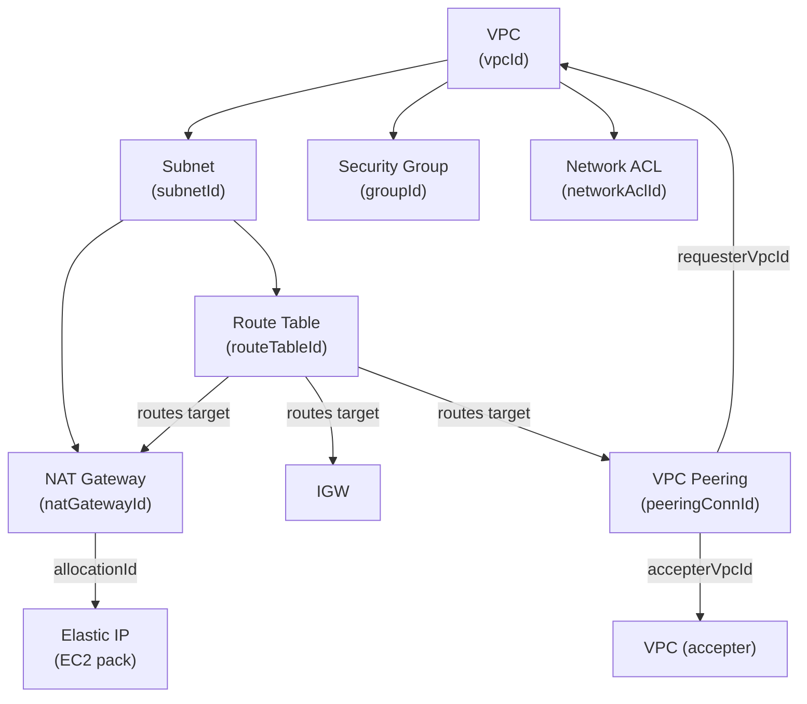

# VPC Driver Pack — Overview

> This document summarizes the VPC driver family for Praxis: eight drivers covering
> VPCs, Subnets, Security Groups, Internet Gateways, NAT Gateways, Route Tables,
> Network ACLs, and VPC Peering Connections. It describes their relationships,
> shared infrastructure, and runtime deployment.

---

## Table of Contents

1. [Driver Summary](#1-driver-summary)
2. [Relationships & Dependencies](#2-relationships--dependencies)
3. [Runtime Pack: praxis-network](#3-runtime-pack-praxis-network)
4. [Shared Infrastructure](#4-shared-infrastructure)
5. [Implementation Order](#5-implementation-order)
6. [Docker Compose Topology](#6-docker-compose-topology)
7. [Justfile Targets](#7-justfile-targets)
8. [Registry Integration](#8-registry-integration)
9. [Cross-Driver References](#9-cross-driver-references)
10. [Common Patterns](#10-common-patterns)
11. [Checklist](#11-checklist)

---

## 1. Driver Summary

| Driver | Kind | Key | Key Scope | Mutable | Tags | Plan Doc |
|---|---|---|---|---|---|---|
| VPC | `VPC` | `region~vpcName` | `KeyScopeRegion` | enableDnsHostnames, enableDnsSupport, tags | Yes | [VPC_DRIVER_PLAN.md](VPC_DRIVER_PLAN.md) |
| Subnet | `Subnet` | `region~subnetName` | `KeyScopeCustom` | mapPublicIpOnLaunch, tags | Yes | [SUBNET_DRIVER_PLAN.md](SUBNET_DRIVER_PLAN.md) |
| Security Group | `SecurityGroup` | `vpcId~groupName` | `KeyScopeCustom` | ingressRules, egressRules, tags | Yes | [SG_DRIVER_PLAN.md](SG_DRIVER_PLAN.md) |
| Internet Gateway | `InternetGateway` | `region~igwName` | `KeyScopeCustom` | VPC attachment, tags | Yes | [IGW_DRIVER_PLAN.md](IGW_DRIVER_PLAN.md) |
| NAT Gateway | `NATGateway` | `region~natgwName` | `KeyScopeCustom` | tags | Yes | [NATGW_DRIVER_PLAN.md](NATGW_DRIVER_PLAN.md) |
| Route Table | `RouteTable` | `region~rtName` | `KeyScopeCustom` | routes, subnetAssociations, tags | Yes | [ROUTETABLE_DRIVER_PLAN.md](ROUTETABLE_DRIVER_PLAN.md) |
| Network ACL | `NetworkACL` | `region~naclName` | `KeyScopeCustom` | ingressRules, egressRules, tags | Yes | [NACL_DRIVER_PLAN.md](NACL_DRIVER_PLAN.md) |
| VPC Peering | `VPCPeering` | `region~peeringName` | `KeyScopeCustom` | tags, options | Yes | [VPCPEERING_DRIVER_PLAN.md](VPCPEERING_DRIVER_PLAN.md) |

Most VPC drivers use `KeyScopeCustom` — keys are constructed from region or VPC ID
plus the resource name. VPC itself uses `KeyScopeRegion` (`<region>~<name>`).

---

## 2. Relationships & Dependencies



### Dependency Rules

| From | To | Relationship |
|---|---|---|
| Subnet | VPC | Subnet's `vpcId` references a VPC |
| Security Group | VPC | SG's `vpcId` references a VPC |
| Network ACL | VPC | NACL's `vpcId` references a VPC |
| Internet Gateway | VPC | IGW's `vpcId` determines attachment target |
| NAT Gateway | Subnet | NAT GW's `subnetId` references a public subnet |
| NAT Gateway | Elastic IP | NAT GW's `allocationId` references an EIP (public connectivity) |
| Route Table | VPC | RT's `vpcId` references a VPC |
| Route Table | Subnet | RT's `subnetAssociations[]` references subnets |
| Route Table | IGW | Route target `gatewayId` references an internet gateway |
| Route Table | NAT Gateway | Route target `natGatewayId` references a NAT gateway |
| Route Table | VPC Peering | Route target `vpcPeeringConnectionId` references a peering connection |
| VPC Peering | VPC | Peering's `requesterVpcId` and `accepterVpcId` reference VPCs |
| EC2 Instance | Subnet | Instance's `subnetId` references a subnet (EC2 driver pack) |
| EC2 Instance | Security Group | Instance's `securityGroupIds[]` references SGs (EC2 driver pack) |

### Ownership Boundaries

- **VPC driver**: Manages the VPC resource and its DNS attributes. Does NOT manage
  subnets, route tables, or other child resources.
- **Subnet driver**: Manages subnet lifecycle and attributes. Does NOT manage route
  table associations (that's the Route Table driver's responsibility).
- **Security Group driver**: Manages the SG resource AND its ingress/egress rules.
  Rules are fully owned — the driver performs add-before-remove reconciliation.
- **Internet Gateway driver**: Manages the IGW resource AND its VPC attachment. Can
  move an IGW between VPCs (detach + attach).
- **NAT Gateway driver**: Manages the NAT GW lifecycle. References subnet and EIP but
  does not own them. Handles "failed" state by delete-and-recreate.
- **Route Table driver**: Manages the RT resource, its routes, AND subnet
  associations. Cannot delete the main route table.
- **Network ACL driver**: Manages the NACL resource AND its rules (ingress + egress).
  Rule numbers are the driver's responsibility. Cannot delete the default NACL.
- **VPC Peering driver**: Manages the peering connection lifecycle. Handles
  auto-accept for intra-account peering. Cross-account requires manual acceptance.

---

## 3. Runtime Pack: praxis-network

All eight VPC drivers plus Elastic IP run in a single runtime pack.

### Entry Point

**File**: `cmd/praxis-network/main.go`

```go
srv := server.NewRestate().
    Bind(restate.Reflect(eip.NewElasticIPDriver(cfg.Auth()))).
    Bind(restate.Reflect(igw.NewIGWDriver(cfg.Auth()))).
    Bind(restate.Reflect(natgw.NewNATGatewayDriver(cfg.Auth()))).
    Bind(restate.Reflect(nacl.NewNetworkACLDriver(cfg.Auth()))).
    Bind(restate.Reflect(routetable.NewRouteTableDriver(cfg.Auth()))).
    Bind(restate.Reflect(sg.NewSecurityGroupDriver(cfg.Auth()))).
    Bind(restate.Reflect(subnet.NewSubnetDriver(cfg.Auth()))).
    Bind(restate.Reflect(vpcpeering.NewVPCPeeringDriver(cfg.Auth()))).
    Bind(restate.Reflect(vpc.NewVPCDriver(cfg.Auth())))
```

### Port

| Pack | Host Port | Container Port |
|---|---|---|
| praxis-network | 9082 | 9080 |

> **Note**: Elastic IP is documented under the EC2 driver family (`docs/ec2/`) but
> runs in the network pack because it's fundamentally a networking primitive — EIPs
> are allocated from Amazon's IP address pool and associated with network interfaces.

---

## 4. Shared Infrastructure

### AWS Client

All eight drivers (plus EIP) use the EC2 API client from `aws-sdk-go-v2/service/ec2`.
VPC, Subnet, Security Group, IGW, NAT Gateway, Route Table, NACL, and VPC Peering
are all EC2 subsystems — they share the same API surface.

The client is created per-account via the auth registry's `GetConfig(account)` method.

### Rate Limiters

Each driver uses its own rate limiter namespace:

| Driver | Namespace | Sustained | Burst |
|---|---|---|---|
| VPC | `vpc` | 20 | 10 |
| Subnet | `subnet` | 20 | 10 |
| Security Group | `ec2` | 20 | 10 |
| Internet Gateway | `internet-gateway` | 20 | 10 |
| NAT Gateway | `nat-gateway` | 20 | 10 |
| Route Table | `route-table` | 20 | 10 |
| Network ACL | `network-acl` | 20 | 10 |
| VPC Peering | `vpc-peering` | 20 | 10 |

All use the same 20/10 (sustained/burst) configuration. Separate namespaces prevent
one driver's heavy usage from throttling another, since the EC2 API has per-action
rate limits.

### Error Classifiers

All drivers classify AWS API errors with driver-specific classifiers:

- **Not found**: Resource doesn't exist (`InvalidVpc.NotFound`, `InvalidSubnetID.NotFound`, etc.)
- **Already exists**: Duplicate name or managed key conflict
- **Dependency violation**: Resource has dependents that prevent deletion

Each driver defines its own classifiers because the EC2 error codes differ per
resource type.

### Managed Key Conflict Detection

All drivers tag resources with `praxis:managed-key=<key>` and check for conflicts on
create/import. This prevents two Praxis instances from managing the same underlying
AWS resource.

---

## 5. Implementation Order

The drivers were implemented in this order, respecting the VPC dependency tree:

### Phase 1: Foundation

1. **VPC** — Root of all networking. No dependencies on other VPC resources. Must be
   implemented first since every other driver references a VPC.

### Phase 2: Core Networking

2. **Subnet** — Direct child of VPC. Required by NAT Gateway, Route Table
   associations, and EC2 instances.

3. **Security Group** — Direct child of VPC. Required by EC2 instances. Most complex
   rule management (add-before-remove).

4. **Internet Gateway** — VPC attachment. Required by Route Table (as a route target)
   and NAT Gateway (public connectivity path).

### Phase 3: Advanced Networking

5. **NAT Gateway** — Requires subnet + EIP. Enables private subnet outbound traffic.

6. **Route Table** — References all other networking resources as route targets (IGW,
   NAT GW, VPC Peering). Must be late in the order.

7. **Network ACL** — Stateless firewall at subnet level. Independent of route tables
   but depends on VPC.

### Phase 4: Multi-VPC

8. **VPC Peering** — References two VPCs. Cross-account adds complexity. Route tables
   reference peering connections as targets.

### Dependency Test Order

```text
VPC → Subnet → SG → IGW → NAT GW → Route Table → NACL → VPC Peering
```

---

## 6. Docker Compose Topology

```yaml
praxis-network:
  build:
    context: .
    dockerfile: cmd/praxis-network/Dockerfile
  container_name: praxis-network
  env_file:
    - .env
  depends_on:
    restate:
      condition: service_healthy
    localstack-init:
      condition: service_completed_successfully
  ports:
    - "9082:9080"
  environment:
    - PRAXIS_LISTEN_ADDR=0.0.0.0:9080
```

The Dockerfile follows the standard pattern: `golang:1.25-alpine` multi-stage build
with `distroless/static-debian12:nonroot` runtime image.

### Restate Registration

```bash
curl -s -X POST http://localhost:9070/deployments \
  -H 'content-type: application/json' \
  -d '{"uri": "http://praxis-network:9080"}'
```

All nine services (8 VPC + EIP) are discovered automatically from the single
registration endpoint via Restate's reflection-based service discovery.

---

## 7. Justfile Targets

### Unit Tests

```just
test-vpc:         go test ./internal/drivers/vpc/...         -v -count=1 -race
test-subnet:      go test ./internal/drivers/subnet/...      -v -count=1 -race
test-sg:          go test ./internal/drivers/sg/...          -v -count=1 -race
test-igw:         go test ./internal/drivers/igw/...         -v -count=1 -race
test-natgw:       go test ./internal/drivers/natgw/...       -v -count=1 -race
test-routetable:  go test ./internal/drivers/routetable/...  -v -count=1 -race
test-nacl:        go test ./internal/drivers/nacl/...        -v -count=1 -race
test-vpcpeering:  go test ./internal/drivers/vpcpeering/...  -v -count=1 -race
```

### Integration Tests

```just
test-vpc-integration:     -run TestVPC      -timeout=5m
test-subnet-integration:  -run TestSubnet   -timeout=10m
test-sg-integration:      -run TestSG       -timeout=5m
test-igw-integration:     -run TestIGW      -timeout=5m
test-natgw-integration:   -run TestNATGW    -timeout=10m
test-nacl-integration:    -run TestNACL     -timeout=5m
```

### Logs

```just
logs-network:  docker compose logs -f praxis-network
```

---

## 8. Registry Integration

All eight adapters (plus EIP) are registered in `internal/core/provider/registry.go`:

```go
func NewRegistry() *Registry {
    accounts := auth.LoadFromEnv()
    return NewRegistryWithAdapters(
        // ... other adapters ...
        NewEIPAdapterWithRegistry(accounts),
        NewNATGatewayAdapterWithRegistry(accounts),
        NewNetworkACLAdapterWithRegistry(accounts),
        NewRouteTableAdapterWithRegistry(accounts),
        NewSecurityGroupAdapterWithRegistry(accounts),
        NewSubnetAdapterWithRegistry(accounts),
        NewIGWAdapterWithRegistry(accounts),
        NewVPCPeeringAdapterWithRegistry(accounts),
        NewVPCAdapterWithRegistry(accounts),
        // ...
    )
}
```

### Adapter Files

| Driver | Adapter File |
|---|---|
| VPC | `internal/core/provider/vpc_adapter.go` |
| Subnet | `internal/core/provider/subnet_adapter.go` |
| Security Group | `internal/core/provider/sg_adapter.go` |
| Internet Gateway | `internal/core/provider/igw_adapter.go` |
| NAT Gateway | `internal/core/provider/natgw_adapter.go` |
| Route Table | `internal/core/provider/routetable_adapter.go` |
| Network ACL | `internal/core/provider/nacl_adapter.go` |
| VPC Peering | `internal/core/provider/vpcpeering_adapter.go` |

---

## 9. Cross-Driver References

In Praxis templates, VPC resources reference each other via output expressions:

### Full VPC Stack

```cue
resources: {
    "main-vpc": {
        kind: "VPC"
        spec: {
            cidrBlock: "10.0.0.0/16"
            enableDnsHostnames: true
            enableDnsSupport: true
        }
    }
    "public-subnet": {
        kind: "Subnet"
        spec: {
            vpcId: "${resources.main-vpc.outputs.vpcId}"
            cidrBlock: "10.0.1.0/24"
            availabilityZone: "us-east-1a"
            mapPublicIpOnLaunch: true
        }
    }
    "private-subnet": {
        kind: "Subnet"
        spec: {
            vpcId: "${resources.main-vpc.outputs.vpcId}"
            cidrBlock: "10.0.2.0/24"
            availabilityZone: "us-east-1a"
        }
    }
    "web-sg": {
        kind: "SecurityGroup"
        spec: {
            vpcId: "${resources.main-vpc.outputs.vpcId}"
            groupName: "web-sg"
            description: "Allow HTTP/HTTPS"
            ingressRules: [{
                protocol: "tcp"
                fromPort: 443
                toPort: 443
                cidrBlock: "0.0.0.0/0"
            }]
        }
    }
    "main-igw": {
        kind: "InternetGateway"
        spec: {
            vpcId: "${resources.main-vpc.outputs.vpcId}"
        }
    }
    "nat-eip": {
        kind: "ElasticIP"
        spec: { domain: "vpc" }
    }
    "main-nat": {
        kind: "NATGateway"
        spec: {
            subnetId: "${resources.public-subnet.outputs.subnetId}"
            allocationId: "${resources.nat-eip.outputs.allocationId}"
            connectivityType: "public"
        }
    }
    "public-rt": {
        kind: "RouteTable"
        spec: {
            vpcId: "${resources.main-vpc.outputs.vpcId}"
            routes: [{
                destinationCidrBlock: "0.0.0.0/0"
                gatewayId: "${resources.main-igw.outputs.internetGatewayId}"
            }]
            subnetAssociations: ["${resources.public-subnet.outputs.subnetId}"]
        }
    }
    "private-rt": {
        kind: "RouteTable"
        spec: {
            vpcId: "${resources.main-vpc.outputs.vpcId}"
            routes: [{
                destinationCidrBlock: "0.0.0.0/0"
                natGatewayId: "${resources.main-nat.outputs.natGatewayId}"
            }]
            subnetAssociations: ["${resources.private-subnet.outputs.subnetId}"]
        }
    }
}
```

### VPC Peering with Route Tables

```cue
resources: {
    "peer": {
        kind: "VPCPeering"
        spec: {
            requesterVpcId: "${resources.vpc-a.outputs.vpcId}"
            accepterVpcId: "${resources.vpc-b.outputs.vpcId}"
            autoAccept: true
        }
    }
    "peer-route": {
        kind: "RouteTable"
        spec: {
            vpcId: "${resources.vpc-a.outputs.vpcId}"
            routes: [{
                destinationCidrBlock: "10.1.0.0/16"
                vpcPeeringConnectionId: "${resources.peer.outputs.vpcPeeringConnectionId}"
            }]
        }
    }
}
```

The DAG resolver handles dependency ordering automatically based on these expression
references.

---

## 10. Common Patterns

### All VPC Drivers Share

- **EC2 API client** — VPC is an EC2 subsystem; all drivers use `aws-sdk-go-v2/service/ec2`
- **Managed key tag** — `praxis:managed-key=<key>` for ownership tracking and conflict
  detection
- **Import defaults to `ModeObserved`** — Imported resources are observed, not mutated
- **Pre-deletion cleanup** — Remove associations/attachments before deleting the
  resource (detach IGW, disassociate route table, etc.)
- **Default resource constraints** — Cannot delete default VPC, default route table,
  or default NACL
- **Rate limiter**: 20 sustained / 10 burst per driver namespace

### Rule-Based Drivers

Security Group, Network ACL, and Route Table all manage ordered rule sets:

| Pattern | SG | NACL | Route Table |
|---|---|---|---|
| Add-before-remove | Yes | Yes | Yes |
| Rule diffing | Ingress + egress rules | Ingress + egress rules with rule numbers | Routes + subnet associations |
| Numbering | N/A (AWS-assigned) | Explicit rule numbers (1–32766) | N/A |
| Default entries | AWS adds default egress allow-all | Default NACL has allow-all | Local route is auto-managed |

### Attachment Drivers

Internet Gateway and NAT Gateway manage lifecycle attachments:

| Pattern | IGW | NAT Gateway |
|---|---|---|
| Attach/detach | Explicit VPC attach/detach | Implicit (created in subnet) |
| Move between targets | Yes (detach old → attach new) | No (delete + recreate) |
| Failure recovery | Detach-on-error | Delete-and-recreate on "failed" state |
| One-to-one | One IGW per VPC | One NAT GW per subnet (soft limit) |

### Driver Complexity Ranking

| Driver | Complexity | Reason |
|---|---|---|
| VPC | Medium | Straightforward CRUD; DNS attribute ordering on update |
| Subnet | Medium | Simple CRUD; depends on VPC existing |
| Elastic IP | Medium | Simple allocate/release; quota enforcement |
| Internet Gateway | High | VPC attachment state machine; detach-before-delete |
| NAT Gateway | High | State transitions; failure handling; delete-and-recreate |
| VPC Peering | High | Cross-account vs intra-account; status state machine |
| Security Group | Very High | Rule diffing; add-before-remove ordering; dependency violations |
| Route Table | Very High | Route state machine; subnet associations; main table constraints |
| Network ACL | Very High | Rule numbering; ordering constraints; default NACL protection |

---

## 11. Checklist

### Schemas

- [x] `schemas/aws/vpc/vpc.cue`
- [x] `schemas/aws/subnet/subnet.cue`
- [x] `schemas/aws/ec2/sg.cue`
- [x] `schemas/aws/igw/igw.cue`
- [x] `schemas/aws/natgw/natgw.cue`
- [x] `schemas/aws/routetable/routetable.cue`
- [x] `schemas/aws/nacl/nacl.cue`
- [x] `schemas/aws/vpcpeering/vpcpeering.cue`

### Drivers (per driver: types + aws + drift + driver)

- [x] `internal/drivers/vpc/`
- [x] `internal/drivers/subnet/`
- [x] `internal/drivers/sg/`
- [x] `internal/drivers/igw/`
- [x] `internal/drivers/natgw/`
- [x] `internal/drivers/routetable/`
- [x] `internal/drivers/nacl/`
- [x] `internal/drivers/vpcpeering/`

### Adapters

- [x] `internal/core/provider/vpc_adapter.go`
- [x] `internal/core/provider/subnet_adapter.go`
- [x] `internal/core/provider/sg_adapter.go`
- [x] `internal/core/provider/igw_adapter.go`
- [x] `internal/core/provider/natgw_adapter.go`
- [x] `internal/core/provider/routetable_adapter.go`
- [x] `internal/core/provider/nacl_adapter.go`
- [x] `internal/core/provider/vpcpeering_adapter.go`

### Registry

- [x] All 8 adapters registered in `NewRegistry()`

### Tests

- [x] Unit tests for all 8 drivers
- [x] Integration tests for all 8 drivers

### Documentation

- [x] [VPC_DRIVER_PLAN.md](VPC_DRIVER_PLAN.md)
- [x] [SUBNET_DRIVER_PLAN.md](SUBNET_DRIVER_PLAN.md)
- [x] [SG_DRIVER_PLAN.md](SG_DRIVER_PLAN.md)
- [x] [IGW_DRIVER_PLAN.md](IGW_DRIVER_PLAN.md)
- [x] [NATGW_DRIVER_PLAN.md](NATGW_DRIVER_PLAN.md)
- [x] [ROUTETABLE_DRIVER_PLAN.md](ROUTETABLE_DRIVER_PLAN.md)
- [x] [NACL_DRIVER_PLAN.md](NACL_DRIVER_PLAN.md)
- [x] [VPCPEERING_DRIVER_PLAN.md](VPCPEERING_DRIVER_PLAN.md)
- [x] This overview document
